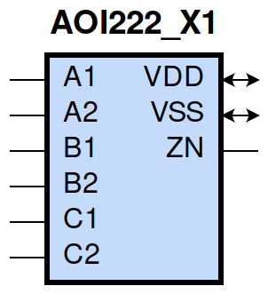

====================================
gf180mcu_fd_sc_mcu9t5v0__aoi222_x1
====================================

**gf180mcu_fd_sc_mcu9t5v0__aoi222_x1 symbol**

**gf180mcu_fd_sc_mcu9t5v0__aoi222_x1 schematic**

.. image:: sc9_sch/AOI222_X1_sch.png
    :height: 250px
    :width: 450 px
    :align: center
    :alt: gf180mcu_fd_sc_mcu9t5v0__aoi222_x1 schematic

**gf180mcu_fd_sc_mcu9t5v0__aoi222_x1 layout**

.. image:: sc9_lay/AOI222_X1_lay.png
    :height: 300px
    :width: 500 px
    :align: center
    :alt: gf180mcu_fd_sc_mcu9t5v0__aoi222_x1 layout

.. include:: images.rst
| AOI222_X1 is a three 2-input AND into 3-input NOR with 1X drive strength

|
| Attributes

============= ======================
**Attribute** **Value**
area          39.513600 µm\ :sup:`2`
============= ======================

|
| OUTPUT FUNCTIONS

+----------------+-------------------------------------------------------------------------------------------------------------------------------------------------------------------+
| **Output Pin** | **Function**                                                                                                                                                      |
+----------------+-------------------------------------------------------------------------------------------------------------------------------------------------------------------+
| ZN             | (((!A1)&(!B1)&(!C1))|((!A1)&(!B1)&(!C2))|((!A1)&(!B2)&(!C1))|((!A1)&(!B2)&(!C2))|((!A2)&(!B1)&(!C1))|((!A2)&(!B1)&(!C2))|((!A2)&(!B2)&(!C1))|((!A2)&(!B2)&(!C2))) |
+----------------+-------------------------------------------------------------------------------------------------------------------------------------------------------------------+

|
| TRUTH TABLE FOR ZN

====== ====== ====== ====== ====== ====== ======
**A1** **A2** **B1** **B2** **C1** **C2** **ZN**
0      ?      0      ?      0      ?      1
0      ?      0      ?      ?      0      1
0      ?      ?      0      0      ?      1
0      ?      ?      0      ?      0      1
?      0      0      ?      0      ?      1
?      0      0      ?      ?      0      1
?      0      ?      0      0      ?      1
?      0      ?      0      ?      0      1
1      1      ?      ?      ?      ?      0
?      ?      1      1      ?      ?      0
?      ?      ?      ?      1      1      0
====== ====== ====== ====== ====== ====== ======

|
| FUNCTIONAL SCHEMATIC

| |image83|

| PIN CAPACITANCE (pf)

======= ======== ====================
**Pin** **Type** **Capacitance (pf)**
C2      input    0.0066
C1      input    0.0068
B1      input    0.0068
B2      input    0.0066
A2      input    0.0069
A1      input    0.0072
======= ======== ====================

|
| DELAY AND OUTPUT TRANSITION TIME corresponding to min slew and load

+---------------+------------+--------------------+--------------+-------------------+----------------+---------------+
| **Input Pin** | **Output** | **When Condition** | **Tin (ns)** | **Out Load (pf)** | **Delay (ns)** | **Tout (ns)** |
+---------------+------------+--------------------+--------------+-------------------+----------------+---------------+
| C2(LH)        | ZN(HL)     | !A1&!A2&!B1&!B2&C1 | 0.0100       | 0.0010            | 0.1591         | 0.1071        |
+---------------+------------+--------------------+--------------+-------------------+----------------+---------------+
| C2(LH)        | ZN(HL)     | !A1&!A2&!B1&B2&C1  | 0.0100       | 0.0010            | 0.1499         | 0.1001        |
+---------------+------------+--------------------+--------------+-------------------+----------------+---------------+
| C2(LH)        | ZN(HL)     | !A1&!A2&B1&!B2&C1  | 0.0100       | 0.0010            | 0.1623         | 0.1214        |
+---------------+------------+--------------------+--------------+-------------------+----------------+---------------+
| C2(LH)        | ZN(HL)     | !A1&A2&!B1&!B2&C1  | 0.0100       | 0.0010            | 0.1204         | 0.0911        |
+---------------+------------+--------------------+--------------+-------------------+----------------+---------------+
| C2(LH)        | ZN(HL)     | !A1&A2&!B1&B2&C1   | 0.0100       | 0.0010            | 0.1161         | 0.0855        |
+---------------+------------+--------------------+--------------+-------------------+----------------+---------------+
| C2(LH)        | ZN(HL)     | !A1&A2&B1&!B2&C1   | 0.0100       | 0.0010            | 0.1289         | 0.1088        |
+---------------+------------+--------------------+--------------+-------------------+----------------+---------------+
| C2(LH)        | ZN(HL)     | A1&!A2&!B1&!B2&C1  | 0.0100       | 0.0010            | 0.1339         | 0.1149        |
+---------------+------------+--------------------+--------------+-------------------+----------------+---------------+
| C2(LH)        | ZN(HL)     | A1&!A2&!B1&B2&C1   | 0.0100       | 0.0010            | 0.1289         | 0.1088        |
+---------------+------------+--------------------+--------------+-------------------+----------------+---------------+
| C2(LH)        | ZN(HL)     | A1&!A2&B1&!B2&C1   | 0.0100       | 0.0010            | 0.1424         | 0.1308        |
+---------------+------------+--------------------+--------------+-------------------+----------------+---------------+
| C2(HL)        | ZN(LH)     | !A1&!A2&!B1&!B2&C1 | 0.0100       | 0.0010            | 0.2713         | 0.1657        |
+---------------+------------+--------------------+--------------+-------------------+----------------+---------------+
| C2(HL)        | ZN(LH)     | !A1&!A2&!B1&B2&C1  | 0.0100       | 0.0010            | 0.3151         | 0.2053        |
+---------------+------------+--------------------+--------------+-------------------+----------------+---------------+
| C2(HL)        | ZN(LH)     | !A1&!A2&B1&!B2&C1  | 0.0100       | 0.0010            | 0.3636         | 0.2422        |
+---------------+------------+--------------------+--------------+-------------------+----------------+---------------+
| C2(HL)        | ZN(LH)     | !A1&A2&!B1&!B2&C1  | 0.0100       | 0.0010            | 0.3171         | 0.1704        |
+---------------+------------+--------------------+--------------+-------------------+----------------+---------------+
| C2(HL)        | ZN(LH)     | !A1&A2&!B1&B2&C1   | 0.0100       | 0.0010            | 0.3556         | 0.2038        |
+---------------+------------+--------------------+--------------+-------------------+----------------+---------------+
| C2(HL)        | ZN(LH)     | !A1&A2&B1&!B2&C1   | 0.0100       | 0.0010            | 0.4135         | 0.2478        |
+---------------+------------+--------------------+--------------+-------------------+----------------+---------------+
| C2(HL)        | ZN(LH)     | A1&!A2&!B1&!B2&C1  | 0.0100       | 0.0010            | 0.3660         | 0.2067        |
+---------------+------------+--------------------+--------------+-------------------+----------------+---------------+
| C2(HL)        | ZN(LH)     | A1&!A2&!B1&B2&C1   | 0.0100       | 0.0010            | 0.4136         | 0.2479        |
+---------------+------------+--------------------+--------------+-------------------+----------------+---------------+
| C2(HL)        | ZN(LH)     | A1&!A2&B1&!B2&C1   | 0.0100       | 0.0010            | 0.4712         | 0.2921        |
+---------------+------------+--------------------+--------------+-------------------+----------------+---------------+
| C1(LH)        | ZN(HL)     | !A1&!A2&!B1&!B2&C2 | 0.0100       | 0.0010            | 0.1483         | 0.1078        |
+---------------+------------+--------------------+--------------+-------------------+----------------+---------------+
| C1(LH)        | ZN(HL)     | !A1&!A2&!B1&B2&C2  | 0.0100       | 0.0010            | 0.1389         | 0.1006        |
+---------------+------------+--------------------+--------------+-------------------+----------------+---------------+
| C1(LH)        | ZN(HL)     | !A1&!A2&B1&!B2&C2  | 0.0100       | 0.0010            | 0.1515         | 0.1218        |
+---------------+------------+--------------------+--------------+-------------------+----------------+---------------+
| C1(LH)        | ZN(HL)     | !A1&A2&!B1&!B2&C2  | 0.0100       | 0.0010            | 0.1092         | 0.0915        |
+---------------+------------+--------------------+--------------+-------------------+----------------+---------------+
| C1(LH)        | ZN(HL)     | !A1&A2&!B1&B2&C2   | 0.0100       | 0.0010            | 0.1049         | 0.0862        |
+---------------+------------+--------------------+--------------+-------------------+----------------+---------------+
| C1(LH)        | ZN(HL)     | !A1&A2&B1&!B2&C2   | 0.0100       | 0.0010            | 0.1177         | 0.1092        |
+---------------+------------+--------------------+--------------+-------------------+----------------+---------------+
| C1(LH)        | ZN(HL)     | A1&!A2&!B1&!B2&C2  | 0.0100       | 0.0010            | 0.1229         | 0.1155        |
+---------------+------------+--------------------+--------------+-------------------+----------------+---------------+
| C1(LH)        | ZN(HL)     | A1&!A2&!B1&B2&C2   | 0.0100       | 0.0010            | 0.1177         | 0.1093        |
+---------------+------------+--------------------+--------------+-------------------+----------------+---------------+
| C1(LH)        | ZN(HL)     | A1&!A2&B1&!B2&C2   | 0.0100       | 0.0010            | 0.1313         | 0.1311        |
+---------------+------------+--------------------+--------------+-------------------+----------------+---------------+
| C1(HL)        | ZN(LH)     | !A1&!A2&!B1&!B2&C2 | 0.0100       | 0.0010            | 0.2398         | 0.1372        |
+---------------+------------+--------------------+--------------+-------------------+----------------+---------------+
| C1(HL)        | ZN(LH)     | !A1&!A2&!B1&B2&C2  | 0.0100       | 0.0010            | 0.2759         | 0.1692        |
+---------------+------------+--------------------+--------------+-------------------+----------------+---------------+
| C1(HL)        | ZN(LH)     | !A1&!A2&B1&!B2&C2  | 0.0100       | 0.0010            | 0.3266         | 0.2057        |
+---------------+------------+--------------------+--------------+-------------------+----------------+---------------+
| C1(HL)        | ZN(LH)     | !A1&A2&!B1&!B2&C2  | 0.0100       | 0.0010            | 0.2776         | 0.1352        |
+---------------+------------+--------------------+--------------+-------------------+----------------+---------------+
| C1(HL)        | ZN(LH)     | !A1&A2&!B1&B2&C2   | 0.0100       | 0.0010            | 0.3094         | 0.1606        |
+---------------+------------+--------------------+--------------+-------------------+----------------+---------------+
| C1(HL)        | ZN(LH)     | !A1&A2&B1&!B2&C2   | 0.0100       | 0.0010            | 0.3695         | 0.2046        |
+---------------+------------+--------------------+--------------+-------------------+----------------+---------------+
| C1(HL)        | ZN(LH)     | A1&!A2&!B1&!B2&C2  | 0.0100       | 0.0010            | 0.3291         | 0.1707        |
+---------------+------------+--------------------+--------------+-------------------+----------------+---------------+
| C1(HL)        | ZN(LH)     | A1&!A2&!B1&B2&C2   | 0.0100       | 0.0010            | 0.3696         | 0.2047        |
+---------------+------------+--------------------+--------------+-------------------+----------------+---------------+
| C1(HL)        | ZN(LH)     | A1&!A2&B1&!B2&C2   | 0.0100       | 0.0010            | 0.4280         | 0.2487        |
+---------------+------------+--------------------+--------------+-------------------+----------------+---------------+
| B1(LH)        | ZN(HL)     | !A1&!A2&B2&!C1&!C2 | 0.0100       | 0.0010            | 0.1223         | 0.0799        |
+---------------+------------+--------------------+--------------+-------------------+----------------+---------------+
| B1(LH)        | ZN(HL)     | !A1&!A2&B2&!C1&C2  | 0.0100       | 0.0010            | 0.1227         | 0.0797        |
+---------------+------------+--------------------+--------------+-------------------+----------------+---------------+
| B1(LH)        | ZN(HL)     | !A1&!A2&B2&C1&!C2  | 0.0100       | 0.0010            | 0.1323         | 0.0979        |
+---------------+------------+--------------------+--------------+-------------------+----------------+---------------+
| B1(LH)        | ZN(HL)     | !A1&A2&B2&!C1&!C2  | 0.0100       | 0.0010            | 0.1004         | 0.0707        |
+---------------+------------+--------------------+--------------+-------------------+----------------+---------------+
| B1(LH)        | ZN(HL)     | !A1&A2&B2&!C1&C2   | 0.0100       | 0.0010            | 0.1007         | 0.0710        |
+---------------+------------+--------------------+--------------+-------------------+----------------+---------------+
| B1(LH)        | ZN(HL)     | !A1&A2&B2&C1&!C2   | 0.0100       | 0.0010            | 0.1103         | 0.0899        |
+---------------+------------+--------------------+--------------+-------------------+----------------+---------------+
| B1(LH)        | ZN(HL)     | A1&!A2&B2&!C1&!C2  | 0.0100       | 0.0010            | 0.1101         | 0.0903        |
+---------------+------------+--------------------+--------------+-------------------+----------------+---------------+
| B1(LH)        | ZN(HL)     | A1&!A2&B2&!C1&C2   | 0.0100       | 0.0010            | 0.1104         | 0.0905        |
+---------------+------------+--------------------+--------------+-------------------+----------------+---------------+
| B1(LH)        | ZN(HL)     | A1&!A2&B2&C1&!C2   | 0.0100       | 0.0010            | 0.1216         | 0.1090        |
+---------------+------------+--------------------+--------------+-------------------+----------------+---------------+
| B1(HL)        | ZN(LH)     | !A1&!A2&B2&!C1&!C2 | 0.0100       | 0.0010            | 0.1905         | 0.1268        |
+---------------+------------+--------------------+--------------+-------------------+----------------+---------------+
| B1(HL)        | ZN(LH)     | !A1&!A2&B2&!C1&C2  | 0.0100       | 0.0010            | 0.2291         | 0.1686        |
+---------------+------------+--------------------+--------------+-------------------+----------------+---------------+
| B1(HL)        | ZN(LH)     | !A1&!A2&B2&C1&!C2  | 0.0100       | 0.0010            | 0.2782         | 0.2046        |
+---------------+------------+--------------------+--------------+-------------------+----------------+---------------+
| B1(HL)        | ZN(LH)     | !A1&A2&B2&!C1&!C2  | 0.0100       | 0.0010            | 0.2229         | 0.1273        |
+---------------+------------+--------------------+--------------+-------------------+----------------+---------------+
| B1(HL)        | ZN(LH)     | !A1&A2&B2&!C1&C2   | 0.0100       | 0.0010            | 0.2627         | 0.1601        |
+---------------+------------+--------------------+--------------+-------------------+----------------+---------------+
| B1(HL)        | ZN(LH)     | !A1&A2&B2&C1&!C2   | 0.0100       | 0.0010            | 0.3208         | 0.2030        |
+---------------+------------+--------------------+--------------+-------------------+----------------+---------------+
| B1(HL)        | ZN(LH)     | A1&!A2&B2&!C1&!C2  | 0.0100       | 0.0010            | 0.2723         | 0.1640        |
+---------------+------------+--------------------+--------------+-------------------+----------------+---------------+
| B1(HL)        | ZN(LH)     | A1&!A2&B2&!C1&C2   | 0.0100       | 0.0010            | 0.3223         | 0.2041        |
+---------------+------------+--------------------+--------------+-------------------+----------------+---------------+
| B1(HL)        | ZN(LH)     | A1&!A2&B2&C1&!C2   | 0.0100       | 0.0010            | 0.3800         | 0.2475        |
+---------------+------------+--------------------+--------------+-------------------+----------------+---------------+
| B2(HL)        | ZN(LH)     | !A1&!A2&B1&!C1&!C2 | 0.0100       | 0.0010            | 0.2222         | 0.1566        |
+---------------+------------+--------------------+--------------+-------------------+----------------+---------------+
| B2(HL)        | ZN(LH)     | !A1&!A2&B1&!C1&C2  | 0.0100       | 0.0010            | 0.2693         | 0.2059        |
+---------------+------------+--------------------+--------------+-------------------+----------------+---------------+
| B2(HL)        | ZN(LH)     | !A1&!A2&B1&C1&!C2  | 0.0100       | 0.0010            | 0.3166         | 0.2419        |
+---------------+------------+--------------------+--------------+-------------------+----------------+---------------+
| B2(HL)        | ZN(LH)     | !A1&A2&B1&!C1&!C2  | 0.0100       | 0.0010            | 0.2623         | 0.1641        |
+---------------+------------+--------------------+--------------+-------------------+----------------+---------------+
| B2(HL)        | ZN(LH)     | !A1&A2&B1&!C1&C2   | 0.0100       | 0.0010            | 0.3104         | 0.2048        |
+---------------+------------+--------------------+--------------+-------------------+----------------+---------------+
| B2(HL)        | ZN(LH)     | !A1&A2&B1&C1&!C2   | 0.0100       | 0.0010            | 0.3665         | 0.2476        |
+---------------+------------+--------------------+--------------+-------------------+----------------+---------------+
| B2(HL)        | ZN(LH)     | A1&!A2&B1&!C1&!C2  | 0.0100       | 0.0010            | 0.3105         | 0.2008        |
+---------------+------------+--------------------+--------------+-------------------+----------------+---------------+
| B2(HL)        | ZN(LH)     | A1&!A2&B1&!C1&C2   | 0.0100       | 0.0010            | 0.3684         | 0.2487        |
+---------------+------------+--------------------+--------------+-------------------+----------------+---------------+
| B2(HL)        | ZN(LH)     | A1&!A2&B1&C1&!C2   | 0.0100       | 0.0010            | 0.4242         | 0.2921        |
+---------------+------------+--------------------+--------------+-------------------+----------------+---------------+
| B2(LH)        | ZN(HL)     | !A1&!A2&B1&!C1&!C2 | 0.0100       | 0.0010            | 0.1335         | 0.0798        |
+---------------+------------+--------------------+--------------+-------------------+----------------+---------------+
| B2(LH)        | ZN(HL)     | !A1&!A2&B1&!C1&C2  | 0.0100       | 0.0010            | 0.1339         | 0.0799        |
+---------------+------------+--------------------+--------------+-------------------+----------------+---------------+
| B2(LH)        | ZN(HL)     | !A1&!A2&B1&C1&!C2  | 0.0100       | 0.0010            | 0.1435         | 0.0979        |
+---------------+------------+--------------------+--------------+-------------------+----------------+---------------+
| B2(LH)        | ZN(HL)     | !A1&A2&B1&!C1&!C2  | 0.0100       | 0.0010            | 0.1117         | 0.0706        |
+---------------+------------+--------------------+--------------+-------------------+----------------+---------------+
| B2(LH)        | ZN(HL)     | !A1&A2&B1&!C1&C2   | 0.0100       | 0.0010            | 0.1120         | 0.0706        |
+---------------+------------+--------------------+--------------+-------------------+----------------+---------------+
| B2(LH)        | ZN(HL)     | !A1&A2&B1&C1&!C2   | 0.0100       | 0.0010            | 0.1217         | 0.0897        |
+---------------+------------+--------------------+--------------+-------------------+----------------+---------------+
| B2(LH)        | ZN(HL)     | A1&!A2&B1&!C1&!C2  | 0.0100       | 0.0010            | 0.1215         | 0.0902        |
+---------------+------------+--------------------+--------------+-------------------+----------------+---------------+
| B2(LH)        | ZN(HL)     | A1&!A2&B1&!C1&C2   | 0.0100       | 0.0010            | 0.1218         | 0.0903        |
+---------------+------------+--------------------+--------------+-------------------+----------------+---------------+
| B2(LH)        | ZN(HL)     | A1&!A2&B1&C1&!C2   | 0.0100       | 0.0010            | 0.1329         | 0.1087        |
+---------------+------------+--------------------+--------------+-------------------+----------------+---------------+
| A2(HL)        | ZN(LH)     | A1&!B1&!B2&!C1&!C2 | 0.0100       | 0.0010            | 0.1418         | 0.1233        |
+---------------+------------+--------------------+--------------+-------------------+----------------+---------------+
| A2(HL)        | ZN(LH)     | A1&!B1&!B2&!C1&C2  | 0.0100       | 0.0010            | 0.1554         | 0.1544        |
+---------------+------------+--------------------+--------------+-------------------+----------------+---------------+
| A2(HL)        | ZN(LH)     | A1&!B1&!B2&C1&!C2  | 0.0100       | 0.0010            | 0.2002         | 0.1951        |
+---------------+------------+--------------------+--------------+-------------------+----------------+---------------+
| A2(HL)        | ZN(LH)     | A1&!B1&B2&!C1&!C2  | 0.0100       | 0.0010            | 0.1703         | 0.1595        |
+---------------+------------+--------------------+--------------+-------------------+----------------+---------------+
| A2(HL)        | ZN(LH)     | A1&!B1&B2&!C1&C2   | 0.0100       | 0.0010            | 0.1855         | 0.1933        |
+---------------+------------+--------------------+--------------+-------------------+----------------+---------------+
| A2(HL)        | ZN(LH)     | A1&!B1&B2&C1&!C2   | 0.0100       | 0.0010            | 0.2406         | 0.2411        |
+---------------+------------+--------------------+--------------+-------------------+----------------+---------------+
| A2(HL)        | ZN(LH)     | A1&B1&!B2&!C1&!C2  | 0.0100       | 0.0010            | 0.2180         | 0.1981        |
+---------------+------------+--------------------+--------------+-------------------+----------------+---------------+
| A2(HL)        | ZN(LH)     | A1&B1&!B2&!C1&C2   | 0.0100       | 0.0010            | 0.2419         | 0.2422        |
+---------------+------------+--------------------+--------------+-------------------+----------------+---------------+
| A2(HL)        | ZN(LH)     | A1&B1&!B2&C1&!C2   | 0.0100       | 0.0010            | 0.2973         | 0.2883        |
+---------------+------------+--------------------+--------------+-------------------+----------------+---------------+
| A2(LH)        | ZN(HL)     | A1&!B1&!B2&!C1&!C2 | 0.0100       | 0.0010            | 0.0793         | 0.0422        |
+---------------+------------+--------------------+--------------+-------------------+----------------+---------------+
| A2(LH)        | ZN(HL)     | A1&!B1&!B2&!C1&C2  | 0.0100       | 0.0010            | 0.0793         | 0.0422        |
+---------------+------------+--------------------+--------------+-------------------+----------------+---------------+
| A2(LH)        | ZN(HL)     | A1&!B1&!B2&C1&!C2  | 0.0100       | 0.0010            | 0.0846         | 0.0579        |
+---------------+------------+--------------------+--------------+-------------------+----------------+---------------+
| A2(LH)        | ZN(HL)     | A1&!B1&B2&!C1&!C2  | 0.0100       | 0.0010            | 0.0795         | 0.0422        |
+---------------+------------+--------------------+--------------+-------------------+----------------+---------------+
| A2(LH)        | ZN(HL)     | A1&!B1&B2&!C1&C2   | 0.0100       | 0.0010            | 0.0796         | 0.0422        |
+---------------+------------+--------------------+--------------+-------------------+----------------+---------------+
| A2(LH)        | ZN(HL)     | A1&!B1&B2&C1&!C2   | 0.0100       | 0.0010            | 0.0848         | 0.0579        |
+---------------+------------+--------------------+--------------+-------------------+----------------+---------------+
| A2(LH)        | ZN(HL)     | A1&B1&!B2&!C1&!C2  | 0.0100       | 0.0010            | 0.0848         | 0.0583        |
+---------------+------------+--------------------+--------------+-------------------+----------------+---------------+
| A2(LH)        | ZN(HL)     | A1&B1&!B2&!C1&C2   | 0.0100       | 0.0010            | 0.0848         | 0.0583        |
+---------------+------------+--------------------+--------------+-------------------+----------------+---------------+
| A2(LH)        | ZN(HL)     | A1&B1&!B2&C1&!C2   | 0.0100       | 0.0010            | 0.0920         | 0.0745        |
+---------------+------------+--------------------+--------------+-------------------+----------------+---------------+
| A1(HL)        | ZN(LH)     | A2&!B1&!B2&!C1&!C2 | 0.0100       | 0.0010            | 0.1117         | 0.0920        |
+---------------+------------+--------------------+--------------+-------------------+----------------+---------------+
| A1(HL)        | ZN(LH)     | A2&!B1&!B2&!C1&C2  | 0.0100       | 0.0010            | 0.1197         | 0.1128        |
+---------------+------------+--------------------+--------------+-------------------+----------------+---------------+
| A1(HL)        | ZN(LH)     | A2&!B1&!B2&C1&!C2  | 0.0100       | 0.0010            | 0.1638         | 0.1549        |
+---------------+------------+--------------------+--------------+-------------------+----------------+---------------+
| A1(HL)        | ZN(LH)     | A2&!B1&B2&!C1&!C2  | 0.0100       | 0.0010            | 0.1322         | 0.1195        |
+---------------+------------+--------------------+--------------+-------------------+----------------+---------------+
| A1(HL)        | ZN(LH)     | A2&!B1&B2&!C1&C2   | 0.0100       | 0.0010            | 0.1411         | 0.1436        |
+---------------+------------+--------------------+--------------+-------------------+----------------+---------------+
| A1(HL)        | ZN(LH)     | A2&!B1&B2&C1&!C2   | 0.0100       | 0.0010            | 0.1958         | 0.1935        |
+---------------+------------+--------------------+--------------+-------------------+----------------+---------------+
| A1(HL)        | ZN(LH)     | A2&B1&!B2&!C1&!C2  | 0.0100       | 0.0010            | 0.1802         | 0.1600        |
+---------------+------------+--------------------+--------------+-------------------+----------------+---------------+
| A1(HL)        | ZN(LH)     | A2&B1&!B2&!C1&C2   | 0.0100       | 0.0010            | 0.1973         | 0.1948        |
+---------------+------------+--------------------+--------------+-------------------+----------------+---------------+
| A1(HL)        | ZN(LH)     | A2&B1&!B2&C1&!C2   | 0.0100       | 0.0010            | 0.2533         | 0.2419        |
+---------------+------------+--------------------+--------------+-------------------+----------------+---------------+
| A1(LH)        | ZN(HL)     | A2&!B1&!B2&!C1&!C2 | 0.0100       | 0.0010            | 0.0680         | 0.0422        |
+---------------+------------+--------------------+--------------+-------------------+----------------+---------------+
| A1(LH)        | ZN(HL)     | A2&!B1&!B2&!C1&C2  | 0.0100       | 0.0010            | 0.0681         | 0.0422        |
+---------------+------------+--------------------+--------------+-------------------+----------------+---------------+
| A1(LH)        | ZN(HL)     | A2&!B1&!B2&C1&!C2  | 0.0100       | 0.0010            | 0.0734         | 0.0578        |
+---------------+------------+--------------------+--------------+-------------------+----------------+---------------+
| A1(LH)        | ZN(HL)     | A2&!B1&B2&!C1&!C2  | 0.0100       | 0.0010            | 0.0682         | 0.0420        |
+---------------+------------+--------------------+--------------+-------------------+----------------+---------------+
| A1(LH)        | ZN(HL)     | A2&!B1&B2&!C1&C2   | 0.0100       | 0.0010            | 0.0683         | 0.0423        |
+---------------+------------+--------------------+--------------+-------------------+----------------+---------------+
| A1(LH)        | ZN(HL)     | A2&!B1&B2&C1&!C2   | 0.0100       | 0.0010            | 0.0734         | 0.0579        |
+---------------+------------+--------------------+--------------+-------------------+----------------+---------------+
| A1(LH)        | ZN(HL)     | A2&B1&!B2&!C1&!C2  | 0.0100       | 0.0010            | 0.0735         | 0.0583        |
+---------------+------------+--------------------+--------------+-------------------+----------------+---------------+
| A1(LH)        | ZN(HL)     | A2&B1&!B2&!C1&C2   | 0.0100       | 0.0010            | 0.0735         | 0.0583        |
+---------------+------------+--------------------+--------------+-------------------+----------------+---------------+
| A1(LH)        | ZN(HL)     | A2&B1&!B2&C1&!C2   | 0.0100       | 0.0010            | 0.0807         | 0.0745        |
+---------------+------------+--------------------+--------------+-------------------+----------------+---------------+

|
| DYNAMIC ENERGY

+---------------+---------------------+--------------+------------+-------------------+---------------------+
| **Input Pin** | **When Condition**  | **Tin (ns)** | **Output** | **Out Load (pf)** | **Energy (uW/MHz)** |
+---------------+---------------------+--------------+------------+-------------------+---------------------+
| A1            | A2&!B1&!B2&!C1&!C2  | 0.0100       | ZN(LH)     | 0.0010            | 0.2370              |
+---------------+---------------------+--------------+------------+-------------------+---------------------+
| A1            | A2&!B1&!B2&!C1&C2   | 0.0100       | ZN(LH)     | 0.0010            | 0.2372              |
+---------------+---------------------+--------------+------------+-------------------+---------------------+
| A1            | A2&!B1&!B2&C1&!C2   | 0.0100       | ZN(LH)     | 0.0010            | 0.3017              |
+---------------+---------------------+--------------+------------+-------------------+---------------------+
| A1            | A2&!B1&B2&!C1&!C2   | 0.0100       | ZN(LH)     | 0.0010            | 0.2370              |
+---------------+---------------------+--------------+------------+-------------------+---------------------+
| A1            | A2&!B1&B2&!C1&C2    | 0.0100       | ZN(LH)     | 0.0010            | 0.2370              |
+---------------+---------------------+--------------+------------+-------------------+---------------------+
| A1            | A2&!B1&B2&C1&!C2    | 0.0100       | ZN(LH)     | 0.0010            | 0.3015              |
+---------------+---------------------+--------------+------------+-------------------+---------------------+
| A1            | A2&B1&!B2&!C1&!C2   | 0.0100       | ZN(LH)     | 0.0010            | 0.3031              |
+---------------+---------------------+--------------+------------+-------------------+---------------------+
| A1            | A2&B1&!B2&!C1&C2    | 0.0100       | ZN(LH)     | 0.0010            | 0.3032              |
+---------------+---------------------+--------------+------------+-------------------+---------------------+
| A1            | A2&B1&!B2&C1&!C2    | 0.0100       | ZN(LH)     | 0.0010            | 0.3670              |
+---------------+---------------------+--------------+------------+-------------------+---------------------+
| B2            | !A1&!A2&B1&!C1&!C2  | 0.0100       | ZN(LH)     | 0.0010            | 0.4120              |
+---------------+---------------------+--------------+------------+-------------------+---------------------+
| B2            | !A1&!A2&B1&!C1&C2   | 0.0100       | ZN(LH)     | 0.0010            | 0.4121              |
+---------------+---------------------+--------------+------------+-------------------+---------------------+
| B2            | !A1&!A2&B1&C1&!C2   | 0.0100       | ZN(LH)     | 0.0010            | 0.4750              |
+---------------+---------------------+--------------+------------+-------------------+---------------------+
| B2            | !A1&A2&B1&!C1&!C2   | 0.0100       | ZN(LH)     | 0.0010            | 0.3788              |
+---------------+---------------------+--------------+------------+-------------------+---------------------+
| B2            | !A1&A2&B1&!C1&C2    | 0.0100       | ZN(LH)     | 0.0010            | 0.3788              |
+---------------+---------------------+--------------+------------+-------------------+---------------------+
| B2            | !A1&A2&B1&C1&!C2    | 0.0100       | ZN(LH)     | 0.0010            | 0.4418              |
+---------------+---------------------+--------------+------------+-------------------+---------------------+
| B2            | A1&!A2&B1&!C1&!C2   | 0.0100       | ZN(LH)     | 0.0010            | 0.4436              |
+---------------+---------------------+--------------+------------+-------------------+---------------------+
| B2            | A1&!A2&B1&!C1&C2    | 0.0100       | ZN(LH)     | 0.0010            | 0.4436              |
+---------------+---------------------+--------------+------------+-------------------+---------------------+
| B2            | A1&!A2&B1&C1&!C2    | 0.0100       | ZN(LH)     | 0.0010            | 0.5066              |
+---------------+---------------------+--------------+------------+-------------------+---------------------+
| B1            | !A1&!A2&B2&!C1&!C2  | 0.0100       | ZN(HL)     | 0.0010            | 0.0933              |
+---------------+---------------------+--------------+------------+-------------------+---------------------+
| B1            | !A1&!A2&B2&!C1&C2   | 0.0100       | ZN(HL)     | 0.0010            | 0.0941              |
+---------------+---------------------+--------------+------------+-------------------+---------------------+
| B1            | !A1&!A2&B2&C1&!C2   | 0.0100       | ZN(HL)     | 0.0010            | 0.0943              |
+---------------+---------------------+--------------+------------+-------------------+---------------------+
| B1            | !A1&A2&B2&!C1&!C2   | 0.0100       | ZN(HL)     | 0.0010            | 0.0836              |
+---------------+---------------------+--------------+------------+-------------------+---------------------+
| B1            | !A1&A2&B2&!C1&C2    | 0.0100       | ZN(HL)     | 0.0010            | 0.0843              |
+---------------+---------------------+--------------+------------+-------------------+---------------------+
| B1            | !A1&A2&B2&C1&!C2    | 0.0100       | ZN(HL)     | 0.0010            | 0.0845              |
+---------------+---------------------+--------------+------------+-------------------+---------------------+
| B1            | A1&!A2&B2&!C1&!C2   | 0.0100       | ZN(HL)     | 0.0010            | 0.0837              |
+---------------+---------------------+--------------+------------+-------------------+---------------------+
| B1            | A1&!A2&B2&!C1&C2    | 0.0100       | ZN(HL)     | 0.0010            | 0.0845              |
+---------------+---------------------+--------------+------------+-------------------+---------------------+
| B1            | A1&!A2&B2&C1&!C2    | 0.0100       | ZN(HL)     | 0.0010            | 0.0845              |
+---------------+---------------------+--------------+------------+-------------------+---------------------+
| A2            | A1&!B1&!B2&!C1&!C2  | 0.0100       | ZN(LH)     | 0.0010            | 0.2935              |
+---------------+---------------------+--------------+------------+-------------------+---------------------+
| A2            | A1&!B1&!B2&!C1&C2   | 0.0100       | ZN(LH)     | 0.0010            | 0.2936              |
+---------------+---------------------+--------------+------------+-------------------+---------------------+
| A2            | A1&!B1&!B2&C1&!C2   | 0.0100       | ZN(LH)     | 0.0010            | 0.3567              |
+---------------+---------------------+--------------+------------+-------------------+---------------------+
| A2            | A1&!B1&B2&!C1&!C2   | 0.0100       | ZN(LH)     | 0.0010            | 0.2934              |
+---------------+---------------------+--------------+------------+-------------------+---------------------+
| A2            | A1&!B1&B2&!C1&C2    | 0.0100       | ZN(LH)     | 0.0010            | 0.2935              |
+---------------+---------------------+--------------+------------+-------------------+---------------------+
| A2            | A1&!B1&B2&C1&!C2    | 0.0100       | ZN(LH)     | 0.0010            | 0.3566              |
+---------------+---------------------+--------------+------------+-------------------+---------------------+
| A2            | A1&B1&!B2&!C1&!C2   | 0.0100       | ZN(LH)     | 0.0010            | 0.3582              |
+---------------+---------------------+--------------+------------+-------------------+---------------------+
| A2            | A1&B1&!B2&!C1&C2    | 0.0100       | ZN(LH)     | 0.0010            | 0.3583              |
+---------------+---------------------+--------------+------------+-------------------+---------------------+
| A2            | A1&B1&!B2&C1&!C2    | 0.0100       | ZN(LH)     | 0.0010            | 0.4214              |
+---------------+---------------------+--------------+------------+-------------------+---------------------+
| B1            | !A1&!A2&B2&!C1&!C2  | 0.0100       | ZN(LH)     | 0.0010            | 0.3554              |
+---------------+---------------------+--------------+------------+-------------------+---------------------+
| B1            | !A1&!A2&B2&!C1&C2   | 0.0100       | ZN(LH)     | 0.0010            | 0.3554              |
+---------------+---------------------+--------------+------------+-------------------+---------------------+
| B1            | !A1&!A2&B2&C1&!C2   | 0.0100       | ZN(LH)     | 0.0010            | 0.4199              |
+---------------+---------------------+--------------+------------+-------------------+---------------------+
| B1            | !A1&A2&B2&!C1&!C2   | 0.0100       | ZN(LH)     | 0.0010            | 0.3221              |
+---------------+---------------------+--------------+------------+-------------------+---------------------+
| B1            | !A1&A2&B2&!C1&C2    | 0.0100       | ZN(LH)     | 0.0010            | 0.3220              |
+---------------+---------------------+--------------+------------+-------------------+---------------------+
| B1            | !A1&A2&B2&C1&!C2    | 0.0100       | ZN(LH)     | 0.0010            | 0.3866              |
+---------------+---------------------+--------------+------------+-------------------+---------------------+
| B1            | A1&!A2&B2&!C1&!C2   | 0.0100       | ZN(LH)     | 0.0010            | 0.3886              |
+---------------+---------------------+--------------+------------+-------------------+---------------------+
| B1            | A1&!A2&B2&!C1&C2    | 0.0100       | ZN(LH)     | 0.0010            | 0.3885              |
+---------------+---------------------+--------------+------------+-------------------+---------------------+
| B1            | A1&!A2&B2&C1&!C2    | 0.0100       | ZN(LH)     | 0.0010            | 0.4524              |
+---------------+---------------------+--------------+------------+-------------------+---------------------+
| C1            | !A1&!A2&!B1&!B2&C2  | 0.0100       | ZN(HL)     | 0.0010            | 0.1616              |
+---------------+---------------------+--------------+------------+-------------------+---------------------+
| C1            | !A1&!A2&!B1&B2&C2   | 0.0100       | ZN(HL)     | 0.0010            | 0.1517              |
+---------------+---------------------+--------------+------------+-------------------+---------------------+
| C1            | !A1&!A2&B1&!B2&C2   | 0.0100       | ZN(HL)     | 0.0010            | 0.1519              |
+---------------+---------------------+--------------+------------+-------------------+---------------------+
| C1            | !A1&A2&!B1&!B2&C2   | 0.0100       | ZN(HL)     | 0.0010            | 0.1520              |
+---------------+---------------------+--------------+------------+-------------------+---------------------+
| C1            | !A1&A2&!B1&B2&C2    | 0.0100       | ZN(HL)     | 0.0010            | 0.1422              |
+---------------+---------------------+--------------+------------+-------------------+---------------------+
| C1            | !A1&A2&B1&!B2&C2    | 0.0100       | ZN(HL)     | 0.0010            | 0.1423              |
+---------------+---------------------+--------------+------------+-------------------+---------------------+
| C1            | A1&!A2&!B1&!B2&C2   | 0.0100       | ZN(HL)     | 0.0010            | 0.1520              |
+---------------+---------------------+--------------+------------+-------------------+---------------------+
| C1            | A1&!A2&!B1&B2&C2    | 0.0100       | ZN(HL)     | 0.0010            | 0.1423              |
+---------------+---------------------+--------------+------------+-------------------+---------------------+
| C1            | A1&!A2&B1&!B2&C2    | 0.0100       | ZN(HL)     | 0.0010            | 0.1423              |
+---------------+---------------------+--------------+------------+-------------------+---------------------+
| A2            | A1&!B1&!B2&!C1&!C2  | 0.0100       | ZN(HL)     | 0.0010            | 0.0036              |
+---------------+---------------------+--------------+------------+-------------------+---------------------+
| A2            | A1&!B1&!B2&!C1&C2   | 0.0100       | ZN(HL)     | 0.0010            | 0.0035              |
+---------------+---------------------+--------------+------------+-------------------+---------------------+
| A2            | A1&!B1&!B2&C1&!C2   | 0.0100       | ZN(HL)     | 0.0010            | 0.0036              |
+---------------+---------------------+--------------+------------+-------------------+---------------------+
| A2            | A1&!B1&B2&!C1&!C2   | 0.0100       | ZN(HL)     | 0.0010            | 0.0040              |
+---------------+---------------------+--------------+------------+-------------------+---------------------+
| A2            | A1&!B1&B2&!C1&C2    | 0.0100       | ZN(HL)     | 0.0010            | 0.0040              |
+---------------+---------------------+--------------+------------+-------------------+---------------------+
| A2            | A1&!B1&B2&C1&!C2    | 0.0100       | ZN(HL)     | 0.0010            | 0.0040              |
+---------------+---------------------+--------------+------------+-------------------+---------------------+
| A2            | A1&B1&!B2&!C1&!C2   | 0.0100       | ZN(HL)     | 0.0010            | 0.0040              |
+---------------+---------------------+--------------+------------+-------------------+---------------------+
| A2            | A1&B1&!B2&!C1&C2    | 0.0100       | ZN(HL)     | 0.0010            | 0.0040              |
+---------------+---------------------+--------------+------------+-------------------+---------------------+
| A2            | A1&B1&!B2&C1&!C2    | 0.0100       | ZN(HL)     | 0.0010            | 0.0041              |
+---------------+---------------------+--------------+------------+-------------------+---------------------+
| C2            | !A1&!A2&!B1&!B2&C1  | 0.0100       | ZN(HL)     | 0.0010            | 0.1616              |
+---------------+---------------------+--------------+------------+-------------------+---------------------+
| C2            | !A1&!A2&!B1&B2&C1   | 0.0100       | ZN(HL)     | 0.0010            | 0.1517              |
+---------------+---------------------+--------------+------------+-------------------+---------------------+
| C2            | !A1&!A2&B1&!B2&C1   | 0.0100       | ZN(HL)     | 0.0010            | 0.1518              |
+---------------+---------------------+--------------+------------+-------------------+---------------------+
| C2            | !A1&A2&!B1&!B2&C1   | 0.0100       | ZN(HL)     | 0.0010            | 0.1519              |
+---------------+---------------------+--------------+------------+-------------------+---------------------+
| C2            | !A1&A2&!B1&B2&C1    | 0.0100       | ZN(HL)     | 0.0010            | 0.1423              |
+---------------+---------------------+--------------+------------+-------------------+---------------------+
| C2            | !A1&A2&B1&!B2&C1    | 0.0100       | ZN(HL)     | 0.0010            | 0.1422              |
+---------------+---------------------+--------------+------------+-------------------+---------------------+
| C2            | A1&!A2&!B1&!B2&C1   | 0.0100       | ZN(HL)     | 0.0010            | 0.1520              |
+---------------+---------------------+--------------+------------+-------------------+---------------------+
| C2            | A1&!A2&!B1&B2&C1    | 0.0100       | ZN(HL)     | 0.0010            | 0.1422              |
+---------------+---------------------+--------------+------------+-------------------+---------------------+
| C2            | A1&!A2&B1&!B2&C1    | 0.0100       | ZN(HL)     | 0.0010            | 0.1422              |
+---------------+---------------------+--------------+------------+-------------------+---------------------+
| C1            | !A1&!A2&!B1&!B2&C2  | 0.0100       | ZN(LH)     | 0.0010            | 0.4597              |
+---------------+---------------------+--------------+------------+-------------------+---------------------+
| C1            | !A1&!A2&!B1&B2&C2   | 0.0100       | ZN(LH)     | 0.0010            | 0.4270              |
+---------------+---------------------+--------------+------------+-------------------+---------------------+
| C1            | !A1&!A2&B1&!B2&C2   | 0.0100       | ZN(LH)     | 0.0010            | 0.4938              |
+---------------+---------------------+--------------+------------+-------------------+---------------------+
| C1            | !A1&A2&!B1&!B2&C2   | 0.0100       | ZN(LH)     | 0.0010            | 0.4262              |
+---------------+---------------------+--------------+------------+-------------------+---------------------+
| C1            | !A1&A2&!B1&B2&C2    | 0.0100       | ZN(LH)     | 0.0010            | 0.3935              |
+---------------+---------------------+--------------+------------+-------------------+---------------------+
| C1            | !A1&A2&B1&!B2&C2    | 0.0100       | ZN(LH)     | 0.0010            | 0.4603              |
+---------------+---------------------+--------------+------------+-------------------+---------------------+
| C1            | A1&!A2&!B1&!B2&C2   | 0.0100       | ZN(LH)     | 0.0010            | 0.4929              |
+---------------+---------------------+--------------+------------+-------------------+---------------------+
| C1            | A1&!A2&!B1&B2&C2    | 0.0100       | ZN(LH)     | 0.0010            | 0.4604              |
+---------------+---------------------+--------------+------------+-------------------+---------------------+
| C1            | A1&!A2&B1&!B2&C2    | 0.0100       | ZN(LH)     | 0.0010            | 0.5261              |
+---------------+---------------------+--------------+------------+-------------------+---------------------+
| C2            | !A1&!A2&!B1&!B2&C1  | 0.0100       | ZN(LH)     | 0.0010            | 0.5146              |
+---------------+---------------------+--------------+------------+-------------------+---------------------+
| C2            | !A1&!A2&!B1&B2&C1   | 0.0100       | ZN(LH)     | 0.0010            | 0.4821              |
+---------------+---------------------+--------------+------------+-------------------+---------------------+
| C2            | !A1&!A2&B1&!B2&C1   | 0.0100       | ZN(LH)     | 0.0010            | 0.5468              |
+---------------+---------------------+--------------+------------+-------------------+---------------------+
| C2            | !A1&A2&!B1&!B2&C1   | 0.0100       | ZN(LH)     | 0.0010            | 0.4813              |
+---------------+---------------------+--------------+------------+-------------------+---------------------+
| C2            | !A1&A2&!B1&B2&C1    | 0.0100       | ZN(LH)     | 0.0010            | 0.4488              |
+---------------+---------------------+--------------+------------+-------------------+---------------------+
| C2            | !A1&A2&B1&!B2&C1    | 0.0100       | ZN(LH)     | 0.0010            | 0.5135              |
+---------------+---------------------+--------------+------------+-------------------+---------------------+
| C2            | A1&!A2&!B1&!B2&C1   | 0.0100       | ZN(LH)     | 0.0010            | 0.5461              |
+---------------+---------------------+--------------+------------+-------------------+---------------------+
| C2            | A1&!A2&!B1&B2&C1    | 0.0100       | ZN(LH)     | 0.0010            | 0.5136              |
+---------------+---------------------+--------------+------------+-------------------+---------------------+
| C2            | A1&!A2&B1&!B2&C1    | 0.0100       | ZN(LH)     | 0.0010            | 0.5783              |
+---------------+---------------------+--------------+------------+-------------------+---------------------+
| A1            | A2&!B1&!B2&!C1&!C2  | 0.0100       | ZN(HL)     | 0.0010            | 0.0036              |
+---------------+---------------------+--------------+------------+-------------------+---------------------+
| A1            | A2&!B1&!B2&!C1&C2   | 0.0100       | ZN(HL)     | 0.0010            | 0.0036              |
+---------------+---------------------+--------------+------------+-------------------+---------------------+
| A1            | A2&!B1&!B2&C1&!C2   | 0.0100       | ZN(HL)     | 0.0010            | 0.0036              |
+---------------+---------------------+--------------+------------+-------------------+---------------------+
| A1            | A2&!B1&B2&!C1&!C2   | 0.0100       | ZN(HL)     | 0.0010            | 0.0041              |
+---------------+---------------------+--------------+------------+-------------------+---------------------+
| A1            | A2&!B1&B2&!C1&C2    | 0.0100       | ZN(HL)     | 0.0010            | 0.0041              |
+---------------+---------------------+--------------+------------+-------------------+---------------------+
| A1            | A2&!B1&B2&C1&!C2    | 0.0100       | ZN(HL)     | 0.0010            | 0.0040              |
+---------------+---------------------+--------------+------------+-------------------+---------------------+
| A1            | A2&B1&!B2&!C1&!C2   | 0.0100       | ZN(HL)     | 0.0010            | 0.0040              |
+---------------+---------------------+--------------+------------+-------------------+---------------------+
| A1            | A2&B1&!B2&!C1&C2    | 0.0100       | ZN(HL)     | 0.0010            | 0.0040              |
+---------------+---------------------+--------------+------------+-------------------+---------------------+
| A1            | A2&B1&!B2&C1&!C2    | 0.0100       | ZN(HL)     | 0.0010            | 0.0040              |
+---------------+---------------------+--------------+------------+-------------------+---------------------+
| B2            | !A1&!A2&B1&!C1&!C2  | 0.0100       | ZN(HL)     | 0.0010            | 0.0935              |
+---------------+---------------------+--------------+------------+-------------------+---------------------+
| B2            | !A1&!A2&B1&!C1&C2   | 0.0100       | ZN(HL)     | 0.0010            | 0.0942              |
+---------------+---------------------+--------------+------------+-------------------+---------------------+
| B2            | !A1&!A2&B1&C1&!C2   | 0.0100       | ZN(HL)     | 0.0010            | 0.0943              |
+---------------+---------------------+--------------+------------+-------------------+---------------------+
| B2            | !A1&A2&B1&!C1&!C2   | 0.0100       | ZN(HL)     | 0.0010            | 0.0837              |
+---------------+---------------------+--------------+------------+-------------------+---------------------+
| B2            | !A1&A2&B1&!C1&C2    | 0.0100       | ZN(HL)     | 0.0010            | 0.0844              |
+---------------+---------------------+--------------+------------+-------------------+---------------------+
| B2            | !A1&A2&B1&C1&!C2    | 0.0100       | ZN(HL)     | 0.0010            | 0.0845              |
+---------------+---------------------+--------------+------------+-------------------+---------------------+
| B2            | A1&!A2&B1&!C1&!C2   | 0.0100       | ZN(HL)     | 0.0010            | 0.0838              |
+---------------+---------------------+--------------+------------+-------------------+---------------------+
| B2            | A1&!A2&B1&!C1&C2    | 0.0100       | ZN(HL)     | 0.0010            | 0.0845              |
+---------------+---------------------+--------------+------------+-------------------+---------------------+
| B2            | A1&!A2&B1&C1&!C2    | 0.0100       | ZN(HL)     | 0.0010            | 0.0844              |
+---------------+---------------------+--------------+------------+-------------------+---------------------+
| B2(LH)        | !A1&!A2&!B1&!C1&!C2 | 0.0100       | n/a        | n/a               | -0.0599             |
+---------------+---------------------+--------------+------------+-------------------+---------------------+
| B2(LH)        | !A1&!A2&!B1&!C1&C2  | 0.0100       | n/a        | n/a               | -0.0599             |
+---------------+---------------------+--------------+------------+-------------------+---------------------+
| B2(LH)        | !A1&!A2&!B1&C1&!C2  | 0.0100       | n/a        | n/a               | -0.0599             |
+---------------+---------------------+--------------+------------+-------------------+---------------------+
| B2(LH)        | !A1&A2&!B1&!C1&!C2  | 0.0100       | n/a        | n/a               | -0.0598             |
+---------------+---------------------+--------------+------------+-------------------+---------------------+
| B2(LH)        | !A1&A2&!B1&!C1&C2   | 0.0100       | n/a        | n/a               | -0.0598             |
+---------------+---------------------+--------------+------------+-------------------+---------------------+
| B2(LH)        | !A1&A2&!B1&C1&!C2   | 0.0100       | n/a        | n/a               | -0.0598             |
+---------------+---------------------+--------------+------------+-------------------+---------------------+
| B2(LH)        | A1&!A2&!B1&!C1&!C2  | 0.0100       | n/a        | n/a               | -0.0598             |
+---------------+---------------------+--------------+------------+-------------------+---------------------+
| B2(LH)        | A1&!A2&!B1&!C1&C2   | 0.0100       | n/a        | n/a               | -0.0598             |
+---------------+---------------------+--------------+------------+-------------------+---------------------+
| B2(LH)        | A1&!A2&!B1&C1&!C2   | 0.0100       | n/a        | n/a               | -0.0598             |
+---------------+---------------------+--------------+------------+-------------------+---------------------+
| B2(LH)        | !A1&!A2&!B1&C1&C2   | 0.0100       | n/a        | n/a               | -0.0178             |
+---------------+---------------------+--------------+------------+-------------------+---------------------+
| B2(LH)        | !A1&!A2&B1&C1&C2    | 0.0100       | n/a        | n/a               | -0.0188             |
+---------------+---------------------+--------------+------------+-------------------+---------------------+
| B2(LH)        | !A1&A2&!B1&C1&C2    | 0.0100       | n/a        | n/a               | -0.0179             |
+---------------+---------------------+--------------+------------+-------------------+---------------------+
| B2(LH)        | !A1&A2&B1&C1&C2     | 0.0100       | n/a        | n/a               | -0.0188             |
+---------------+---------------------+--------------+------------+-------------------+---------------------+
| B2(LH)        | A1&!A2&!B1&C1&C2    | 0.0100       | n/a        | n/a               | -0.0179             |
+---------------+---------------------+--------------+------------+-------------------+---------------------+
| B2(LH)        | A1&!A2&B1&C1&C2     | 0.0100       | n/a        | n/a               | -0.0188             |
+---------------+---------------------+--------------+------------+-------------------+---------------------+
| B2(LH)        | A1&A2&!B1&!C1&!C2   | 0.0100       | n/a        | n/a               | -0.0596             |
+---------------+---------------------+--------------+------------+-------------------+---------------------+
| B2(LH)        | A1&A2&!B1&!C1&C2    | 0.0100       | n/a        | n/a               | -0.0596             |
+---------------+---------------------+--------------+------------+-------------------+---------------------+
| B2(LH)        | A1&A2&!B1&C1&!C2    | 0.0100       | n/a        | n/a               | -0.0596             |
+---------------+---------------------+--------------+------------+-------------------+---------------------+
| B2(LH)        | A1&A2&!B1&C1&C2     | 0.0100       | n/a        | n/a               | -0.0342             |
+---------------+---------------------+--------------+------------+-------------------+---------------------+
| B2(LH)        | A1&A2&B1&!C1&!C2    | 0.0100       | n/a        | n/a               | -0.0473             |
+---------------+---------------------+--------------+------------+-------------------+---------------------+
| B2(LH)        | A1&A2&B1&!C1&C2     | 0.0100       | n/a        | n/a               | -0.0468             |
+---------------+---------------------+--------------+------------+-------------------+---------------------+
| B2(LH)        | A1&A2&B1&C1&!C2     | 0.0100       | n/a        | n/a               | -0.0468             |
+---------------+---------------------+--------------+------------+-------------------+---------------------+
| B2(LH)        | A1&A2&B1&C1&C2      | 0.0100       | n/a        | n/a               | -0.0362             |
+---------------+---------------------+--------------+------------+-------------------+---------------------+
| C2(HL)        | !A1&!A2&!B1&!B2&!C1 | 0.0100       | n/a        | n/a               | 0.0665              |
+---------------+---------------------+--------------+------------+-------------------+---------------------+
| C2(HL)        | !A1&!A2&!B1&B2&!C1  | 0.0100       | n/a        | n/a               | 0.0664              |
+---------------+---------------------+--------------+------------+-------------------+---------------------+
| C2(HL)        | !A1&!A2&B1&!B2&!C1  | 0.0100       | n/a        | n/a               | 0.0664              |
+---------------+---------------------+--------------+------------+-------------------+---------------------+
| C2(HL)        | !A1&A2&!B1&!B2&!C1  | 0.0100       | n/a        | n/a               | 0.0665              |
+---------------+---------------------+--------------+------------+-------------------+---------------------+
| C2(HL)        | !A1&A2&!B1&B2&!C1   | 0.0100       | n/a        | n/a               | 0.0664              |
+---------------+---------------------+--------------+------------+-------------------+---------------------+
| C2(HL)        | !A1&A2&B1&!B2&!C1   | 0.0100       | n/a        | n/a               | 0.0664              |
+---------------+---------------------+--------------+------------+-------------------+---------------------+
| C2(HL)        | A1&!A2&!B1&!B2&!C1  | 0.0100       | n/a        | n/a               | 0.0665              |
+---------------+---------------------+--------------+------------+-------------------+---------------------+
| C2(HL)        | A1&!A2&!B1&B2&!C1   | 0.0100       | n/a        | n/a               | 0.0664              |
+---------------+---------------------+--------------+------------+-------------------+---------------------+
| C2(HL)        | A1&!A2&B1&!B2&!C1   | 0.0100       | n/a        | n/a               | 0.0664              |
+---------------+---------------------+--------------+------------+-------------------+---------------------+
| C2(HL)        | !A1&!A2&B1&B2&!C1   | 0.0100       | n/a        | n/a               | 0.0597              |
+---------------+---------------------+--------------+------------+-------------------+---------------------+
| C2(HL)        | !A1&!A2&B1&B2&C1    | 0.0100       | n/a        | n/a               | 0.0597              |
+---------------+---------------------+--------------+------------+-------------------+---------------------+
| C2(HL)        | !A1&A2&B1&B2&!C1    | 0.0100       | n/a        | n/a               | 0.0597              |
+---------------+---------------------+--------------+------------+-------------------+---------------------+
| C2(HL)        | !A1&A2&B1&B2&C1     | 0.0100       | n/a        | n/a               | 0.0597              |
+---------------+---------------------+--------------+------------+-------------------+---------------------+
| C2(HL)        | A1&!A2&B1&B2&!C1    | 0.0100       | n/a        | n/a               | 0.0597              |
+---------------+---------------------+--------------+------------+-------------------+---------------------+
| C2(HL)        | A1&!A2&B1&B2&C1     | 0.0100       | n/a        | n/a               | 0.0597              |
+---------------+---------------------+--------------+------------+-------------------+---------------------+
| C2(HL)        | A1&A2&!B1&!B2&!C1   | 0.0100       | n/a        | n/a               | 0.0598              |
+---------------+---------------------+--------------+------------+-------------------+---------------------+
| C2(HL)        | A1&A2&!B1&!B2&C1    | 0.0100       | n/a        | n/a               | 0.0600              |
+---------------+---------------------+--------------+------------+-------------------+---------------------+
| C2(HL)        | A1&A2&!B1&B2&!C1    | 0.0100       | n/a        | n/a               | 0.0597              |
+---------------+---------------------+--------------+------------+-------------------+---------------------+
| C2(HL)        | A1&A2&!B1&B2&C1     | 0.0100       | n/a        | n/a               | 0.0599              |
+---------------+---------------------+--------------+------------+-------------------+---------------------+
| C2(HL)        | A1&A2&B1&!B2&!C1    | 0.0100       | n/a        | n/a               | 0.0597              |
+---------------+---------------------+--------------+------------+-------------------+---------------------+
| C2(HL)        | A1&A2&B1&!B2&C1     | 0.0100       | n/a        | n/a               | 0.0599              |
+---------------+---------------------+--------------+------------+-------------------+---------------------+
| C2(HL)        | A1&A2&B1&B2&!C1     | 0.0100       | n/a        | n/a               | 0.0597              |
+---------------+---------------------+--------------+------------+-------------------+---------------------+
| C2(HL)        | A1&A2&B1&B2&C1      | 0.0100       | n/a        | n/a               | 0.0597              |
+---------------+---------------------+--------------+------------+-------------------+---------------------+
| B2(HL)        | !A1&!A2&!B1&!C1&!C2 | 0.0100       | n/a        | n/a               | 0.0666              |
+---------------+---------------------+--------------+------------+-------------------+---------------------+
| B2(HL)        | !A1&!A2&!B1&!C1&C2  | 0.0100       | n/a        | n/a               | 0.0665              |
+---------------+---------------------+--------------+------------+-------------------+---------------------+
| B2(HL)        | !A1&!A2&!B1&C1&!C2  | 0.0100       | n/a        | n/a               | 0.0666              |
+---------------+---------------------+--------------+------------+-------------------+---------------------+
| B2(HL)        | !A1&A2&!B1&!C1&!C2  | 0.0100       | n/a        | n/a               | 0.0667              |
+---------------+---------------------+--------------+------------+-------------------+---------------------+
| B2(HL)        | !A1&A2&!B1&!C1&C2   | 0.0100       | n/a        | n/a               | 0.0666              |
+---------------+---------------------+--------------+------------+-------------------+---------------------+
| B2(HL)        | !A1&A2&!B1&C1&!C2   | 0.0100       | n/a        | n/a               | 0.0666              |
+---------------+---------------------+--------------+------------+-------------------+---------------------+
| B2(HL)        | A1&!A2&!B1&!C1&!C2  | 0.0100       | n/a        | n/a               | 0.0667              |
+---------------+---------------------+--------------+------------+-------------------+---------------------+
| B2(HL)        | A1&!A2&!B1&!C1&C2   | 0.0100       | n/a        | n/a               | 0.0666              |
+---------------+---------------------+--------------+------------+-------------------+---------------------+
| B2(HL)        | A1&!A2&!B1&C1&!C2   | 0.0100       | n/a        | n/a               | 0.0666              |
+---------------+---------------------+--------------+------------+-------------------+---------------------+
| B2(HL)        | !A1&!A2&!B1&C1&C2   | 0.0100       | n/a        | n/a               | 0.0195              |
+---------------+---------------------+--------------+------------+-------------------+---------------------+
| B2(HL)        | !A1&!A2&B1&C1&C2    | 0.0100       | n/a        | n/a               | 0.0599              |
+---------------+---------------------+--------------+------------+-------------------+---------------------+
| B2(HL)        | !A1&A2&!B1&C1&C2    | 0.0100       | n/a        | n/a               | 0.0195              |
+---------------+---------------------+--------------+------------+-------------------+---------------------+
| B2(HL)        | !A1&A2&B1&C1&C2     | 0.0100       | n/a        | n/a               | 0.0597              |
+---------------+---------------------+--------------+------------+-------------------+---------------------+
| B2(HL)        | A1&!A2&!B1&C1&C2    | 0.0100       | n/a        | n/a               | 0.0196              |
+---------------+---------------------+--------------+------------+-------------------+---------------------+
| B2(HL)        | A1&!A2&B1&C1&C2     | 0.0100       | n/a        | n/a               | 0.0597              |
+---------------+---------------------+--------------+------------+-------------------+---------------------+
| B2(HL)        | A1&A2&!B1&!C1&!C2   | 0.0100       | n/a        | n/a               | 0.0599              |
+---------------+---------------------+--------------+------------+-------------------+---------------------+
| B2(HL)        | A1&A2&!B1&!C1&C2    | 0.0100       | n/a        | n/a               | 0.0598              |
+---------------+---------------------+--------------+------------+-------------------+---------------------+
| B2(HL)        | A1&A2&!B1&C1&!C2    | 0.0100       | n/a        | n/a               | 0.0598              |
+---------------+---------------------+--------------+------------+-------------------+---------------------+
| B2(HL)        | A1&A2&!B1&C1&C2     | 0.0100       | n/a        | n/a               | 0.0328              |
+---------------+---------------------+--------------+------------+-------------------+---------------------+
| B2(HL)        | A1&A2&B1&!C1&!C2    | 0.0100       | n/a        | n/a               | 0.0600              |
+---------------+---------------------+--------------+------------+-------------------+---------------------+
| B2(HL)        | A1&A2&B1&!C1&C2     | 0.0100       | n/a        | n/a               | 0.0599              |
+---------------+---------------------+--------------+------------+-------------------+---------------------+
| B2(HL)        | A1&A2&B1&C1&!C2     | 0.0100       | n/a        | n/a               | 0.0599              |
+---------------+---------------------+--------------+------------+-------------------+---------------------+
| B2(HL)        | A1&A2&B1&C1&C2      | 0.0100       | n/a        | n/a               | 0.0351              |
+---------------+---------------------+--------------+------------+-------------------+---------------------+
| C2(LH)        | !A1&!A2&!B1&!B2&!C1 | 0.0100       | n/a        | n/a               | -0.0596             |
+---------------+---------------------+--------------+------------+-------------------+---------------------+
| C2(LH)        | !A1&!A2&!B1&B2&!C1  | 0.0100       | n/a        | n/a               | -0.0596             |
+---------------+---------------------+--------------+------------+-------------------+---------------------+
| C2(LH)        | !A1&!A2&B1&!B2&!C1  | 0.0100       | n/a        | n/a               | -0.0596             |
+---------------+---------------------+--------------+------------+-------------------+---------------------+
| C2(LH)        | !A1&A2&!B1&!B2&!C1  | 0.0100       | n/a        | n/a               | -0.0595             |
+---------------+---------------------+--------------+------------+-------------------+---------------------+
| C2(LH)        | !A1&A2&!B1&B2&!C1   | 0.0100       | n/a        | n/a               | -0.0595             |
+---------------+---------------------+--------------+------------+-------------------+---------------------+
| C2(LH)        | !A1&A2&B1&!B2&!C1   | 0.0100       | n/a        | n/a               | -0.0595             |
+---------------+---------------------+--------------+------------+-------------------+---------------------+
| C2(LH)        | A1&!A2&!B1&!B2&!C1  | 0.0100       | n/a        | n/a               | -0.0595             |
+---------------+---------------------+--------------+------------+-------------------+---------------------+
| C2(LH)        | A1&!A2&!B1&B2&!C1   | 0.0100       | n/a        | n/a               | -0.0595             |
+---------------+---------------------+--------------+------------+-------------------+---------------------+
| C2(LH)        | A1&!A2&B1&!B2&!C1   | 0.0100       | n/a        | n/a               | -0.0595             |
+---------------+---------------------+--------------+------------+-------------------+---------------------+
| C2(LH)        | !A1&!A2&B1&B2&!C1   | 0.0100       | n/a        | n/a               | -0.0593             |
+---------------+---------------------+--------------+------------+-------------------+---------------------+
| C2(LH)        | !A1&!A2&B1&B2&C1    | 0.0100       | n/a        | n/a               | -0.0509             |
+---------------+---------------------+--------------+------------+-------------------+---------------------+
| C2(LH)        | !A1&A2&B1&B2&!C1    | 0.0100       | n/a        | n/a               | -0.0593             |
+---------------+---------------------+--------------+------------+-------------------+---------------------+
| C2(LH)        | !A1&A2&B1&B2&C1     | 0.0100       | n/a        | n/a               | -0.0509             |
+---------------+---------------------+--------------+------------+-------------------+---------------------+
| C2(LH)        | A1&!A2&B1&B2&!C1    | 0.0100       | n/a        | n/a               | -0.0593             |
+---------------+---------------------+--------------+------------+-------------------+---------------------+
| C2(LH)        | A1&!A2&B1&B2&C1     | 0.0100       | n/a        | n/a               | -0.0509             |
+---------------+---------------------+--------------+------------+-------------------+---------------------+
| C2(LH)        | A1&A2&!B1&!B2&!C1   | 0.0100       | n/a        | n/a               | -0.0594             |
+---------------+---------------------+--------------+------------+-------------------+---------------------+
| C2(LH)        | A1&A2&!B1&!B2&C1    | 0.0100       | n/a        | n/a               | -0.0478             |
+---------------+---------------------+--------------+------------+-------------------+---------------------+
| C2(LH)        | A1&A2&!B1&B2&!C1    | 0.0100       | n/a        | n/a               | -0.0594             |
+---------------+---------------------+--------------+------------+-------------------+---------------------+
| C2(LH)        | A1&A2&!B1&B2&C1     | 0.0100       | n/a        | n/a               | -0.0491             |
+---------------+---------------------+--------------+------------+-------------------+---------------------+
| C2(LH)        | A1&A2&B1&!B2&!C1    | 0.0100       | n/a        | n/a               | -0.0594             |
+---------------+---------------------+--------------+------------+-------------------+---------------------+
| C2(LH)        | A1&A2&B1&!B2&C1     | 0.0100       | n/a        | n/a               | -0.0491             |
+---------------+---------------------+--------------+------------+-------------------+---------------------+
| C2(LH)        | A1&A2&B1&B2&!C1     | 0.0100       | n/a        | n/a               | -0.0593             |
+---------------+---------------------+--------------+------------+-------------------+---------------------+
| C2(LH)        | A1&A2&B1&B2&C1      | 0.0100       | n/a        | n/a               | -0.0523             |
+---------------+---------------------+--------------+------------+-------------------+---------------------+
| A2(LH)        | !A1&!B1&!B2&!C1&!C2 | 0.0100       | n/a        | n/a               | -0.0602             |
+---------------+---------------------+--------------+------------+-------------------+---------------------+
| A2(LH)        | !A1&!B1&!B2&!C1&C2  | 0.0100       | n/a        | n/a               | -0.0601             |
+---------------+---------------------+--------------+------------+-------------------+---------------------+
| A2(LH)        | !A1&!B1&!B2&C1&!C2  | 0.0100       | n/a        | n/a               | -0.0601             |
+---------------+---------------------+--------------+------------+-------------------+---------------------+
| A2(LH)        | !A1&!B1&B2&!C1&!C2  | 0.0100       | n/a        | n/a               | -0.0601             |
+---------------+---------------------+--------------+------------+-------------------+---------------------+
| A2(LH)        | !A1&!B1&B2&!C1&C2   | 0.0100       | n/a        | n/a               | -0.0601             |
+---------------+---------------------+--------------+------------+-------------------+---------------------+
| A2(LH)        | !A1&!B1&B2&C1&!C2   | 0.0100       | n/a        | n/a               | -0.0601             |
+---------------+---------------------+--------------+------------+-------------------+---------------------+
| A2(LH)        | !A1&B1&!B2&!C1&!C2  | 0.0100       | n/a        | n/a               | -0.0601             |
+---------------+---------------------+--------------+------------+-------------------+---------------------+
| A2(LH)        | !A1&B1&!B2&!C1&C2   | 0.0100       | n/a        | n/a               | -0.0601             |
+---------------+---------------------+--------------+------------+-------------------+---------------------+
| A2(LH)        | !A1&B1&!B2&C1&!C2   | 0.0100       | n/a        | n/a               | -0.0601             |
+---------------+---------------------+--------------+------------+-------------------+---------------------+
| A2(LH)        | !A1&!B1&!B2&C1&C2   | 0.0100       | n/a        | n/a               | -0.0151             |
+---------------+---------------------+--------------+------------+-------------------+---------------------+
| A2(LH)        | !A1&!B1&B2&C1&C2    | 0.0100       | n/a        | n/a               | -0.0151             |
+---------------+---------------------+--------------+------------+-------------------+---------------------+
| A2(LH)        | !A1&B1&!B2&C1&C2    | 0.0100       | n/a        | n/a               | -0.0151             |
+---------------+---------------------+--------------+------------+-------------------+---------------------+
| A2(LH)        | !A1&B1&B2&!C1&!C2   | 0.0100       | n/a        | n/a               | -0.0152             |
+---------------+---------------------+--------------+------------+-------------------+---------------------+
| A2(LH)        | !A1&B1&B2&!C1&C2    | 0.0100       | n/a        | n/a               | -0.0152             |
+---------------+---------------------+--------------+------------+-------------------+---------------------+
| A2(LH)        | !A1&B1&B2&C1&!C2    | 0.0100       | n/a        | n/a               | -0.0152             |
+---------------+---------------------+--------------+------------+-------------------+---------------------+
| A2(LH)        | !A1&B1&B2&C1&C2     | 0.0100       | n/a        | n/a               | -0.0152             |
+---------------+---------------------+--------------+------------+-------------------+---------------------+
| A2(LH)        | A1&!B1&!B2&C1&C2    | 0.0100       | n/a        | n/a               | -0.0157             |
+---------------+---------------------+--------------+------------+-------------------+---------------------+
| A2(LH)        | A1&!B1&B2&C1&C2     | 0.0100       | n/a        | n/a               | -0.0157             |
+---------------+---------------------+--------------+------------+-------------------+---------------------+
| A2(LH)        | A1&B1&!B2&C1&C2     | 0.0100       | n/a        | n/a               | -0.0157             |
+---------------+---------------------+--------------+------------+-------------------+---------------------+
| A2(LH)        | A1&B1&B2&!C1&!C2    | 0.0100       | n/a        | n/a               | -0.0158             |
+---------------+---------------------+--------------+------------+-------------------+---------------------+
| A2(LH)        | A1&B1&B2&!C1&C2     | 0.0100       | n/a        | n/a               | -0.0158             |
+---------------+---------------------+--------------+------------+-------------------+---------------------+
| A2(LH)        | A1&B1&B2&C1&!C2     | 0.0100       | n/a        | n/a               | -0.0158             |
+---------------+---------------------+--------------+------------+-------------------+---------------------+
| A2(LH)        | A1&B1&B2&C1&C2      | 0.0100       | n/a        | n/a               | -0.0158             |
+---------------+---------------------+--------------+------------+-------------------+---------------------+
| A1(LH)        | !A2&!B1&!B2&!C1&!C2 | 0.0100       | n/a        | n/a               | -0.0451             |
+---------------+---------------------+--------------+------------+-------------------+---------------------+
| A1(LH)        | !A2&!B1&!B2&!C1&C2  | 0.0100       | n/a        | n/a               | -0.0452             |
+---------------+---------------------+--------------+------------+-------------------+---------------------+
| A1(LH)        | !A2&!B1&!B2&C1&!C2  | 0.0100       | n/a        | n/a               | -0.0452             |
+---------------+---------------------+--------------+------------+-------------------+---------------------+
| A1(LH)        | !A2&!B1&B2&!C1&!C2  | 0.0100       | n/a        | n/a               | -0.0451             |
+---------------+---------------------+--------------+------------+-------------------+---------------------+
| A1(LH)        | !A2&!B1&B2&!C1&C2   | 0.0100       | n/a        | n/a               | -0.0451             |
+---------------+---------------------+--------------+------------+-------------------+---------------------+
| A1(LH)        | !A2&!B1&B2&C1&!C2   | 0.0100       | n/a        | n/a               | -0.0451             |
+---------------+---------------------+--------------+------------+-------------------+---------------------+
| A1(LH)        | !A2&B1&!B2&!C1&!C2  | 0.0100       | n/a        | n/a               | -0.0451             |
+---------------+---------------------+--------------+------------+-------------------+---------------------+
| A1(LH)        | !A2&B1&!B2&!C1&C2   | 0.0100       | n/a        | n/a               | -0.0451             |
+---------------+---------------------+--------------+------------+-------------------+---------------------+
| A1(LH)        | !A2&B1&!B2&C1&!C2   | 0.0100       | n/a        | n/a               | -0.0451             |
+---------------+---------------------+--------------+------------+-------------------+---------------------+
| A1(LH)        | !A2&!B1&!B2&C1&C2   | 0.0100       | n/a        | n/a               | -0.0151             |
+---------------+---------------------+--------------+------------+-------------------+---------------------+
| A1(LH)        | !A2&!B1&B2&C1&C2    | 0.0100       | n/a        | n/a               | -0.0151             |
+---------------+---------------------+--------------+------------+-------------------+---------------------+
| A1(LH)        | !A2&B1&!B2&C1&C2    | 0.0100       | n/a        | n/a               | -0.0151             |
+---------------+---------------------+--------------+------------+-------------------+---------------------+
| A1(LH)        | !A2&B1&B2&!C1&!C2   | 0.0100       | n/a        | n/a               | -0.0152             |
+---------------+---------------------+--------------+------------+-------------------+---------------------+
| A1(LH)        | !A2&B1&B2&!C1&C2    | 0.0100       | n/a        | n/a               | -0.0152             |
+---------------+---------------------+--------------+------------+-------------------+---------------------+
| A1(LH)        | !A2&B1&B2&C1&!C2    | 0.0100       | n/a        | n/a               | -0.0152             |
+---------------+---------------------+--------------+------------+-------------------+---------------------+
| A1(LH)        | !A2&B1&B2&C1&C2     | 0.0100       | n/a        | n/a               | -0.0153             |
+---------------+---------------------+--------------+------------+-------------------+---------------------+
| A1(LH)        | A2&!B1&!B2&C1&C2    | 0.0100       | n/a        | n/a               | -0.0157             |
+---------------+---------------------+--------------+------------+-------------------+---------------------+
| A1(LH)        | A2&!B1&B2&C1&C2     | 0.0100       | n/a        | n/a               | -0.0157             |
+---------------+---------------------+--------------+------------+-------------------+---------------------+
| A1(LH)        | A2&B1&!B2&C1&C2     | 0.0100       | n/a        | n/a               | -0.0157             |
+---------------+---------------------+--------------+------------+-------------------+---------------------+
| A1(LH)        | A2&B1&B2&!C1&!C2    | 0.0100       | n/a        | n/a               | -0.0158             |
+---------------+---------------------+--------------+------------+-------------------+---------------------+
| A1(LH)        | A2&B1&B2&!C1&C2     | 0.0100       | n/a        | n/a               | -0.0158             |
+---------------+---------------------+--------------+------------+-------------------+---------------------+
| A1(LH)        | A2&B1&B2&C1&!C2     | 0.0100       | n/a        | n/a               | -0.0158             |
+---------------+---------------------+--------------+------------+-------------------+---------------------+
| A1(LH)        | A2&B1&B2&C1&C2      | 0.0100       | n/a        | n/a               | -0.0158             |
+---------------+---------------------+--------------+------------+-------------------+---------------------+
| C1(LH)        | !A1&!A2&!B1&!B2&!C2 | 0.0100       | n/a        | n/a               | -0.0464             |
+---------------+---------------------+--------------+------------+-------------------+---------------------+
| C1(LH)        | !A1&!A2&!B1&B2&!C2  | 0.0100       | n/a        | n/a               | -0.0463             |
+---------------+---------------------+--------------+------------+-------------------+---------------------+
| C1(LH)        | !A1&!A2&B1&!B2&!C2  | 0.0100       | n/a        | n/a               | -0.0463             |
+---------------+---------------------+--------------+------------+-------------------+---------------------+
| C1(LH)        | !A1&A2&!B1&!B2&!C2  | 0.0100       | n/a        | n/a               | -0.0464             |
+---------------+---------------------+--------------+------------+-------------------+---------------------+
| C1(LH)        | !A1&A2&!B1&B2&!C2   | 0.0100       | n/a        | n/a               | -0.0463             |
+---------------+---------------------+--------------+------------+-------------------+---------------------+
| C1(LH)        | !A1&A2&B1&!B2&!C2   | 0.0100       | n/a        | n/a               | -0.0463             |
+---------------+---------------------+--------------+------------+-------------------+---------------------+
| C1(LH)        | A1&!A2&!B1&!B2&!C2  | 0.0100       | n/a        | n/a               | -0.0464             |
+---------------+---------------------+--------------+------------+-------------------+---------------------+
| C1(LH)        | A1&!A2&!B1&B2&!C2   | 0.0100       | n/a        | n/a               | -0.0463             |
+---------------+---------------------+--------------+------------+-------------------+---------------------+
| C1(LH)        | A1&!A2&B1&!B2&!C2   | 0.0100       | n/a        | n/a               | -0.0463             |
+---------------+---------------------+--------------+------------+-------------------+---------------------+
| C1(LH)        | !A1&!A2&B1&B2&!C2   | 0.0100       | n/a        | n/a               | -0.0593             |
+---------------+---------------------+--------------+------------+-------------------+---------------------+
| C1(LH)        | !A1&!A2&B1&B2&C2    | 0.0100       | n/a        | n/a               | -0.0509             |
+---------------+---------------------+--------------+------------+-------------------+---------------------+
| C1(LH)        | !A1&A2&B1&B2&!C2    | 0.0100       | n/a        | n/a               | -0.0593             |
+---------------+---------------------+--------------+------------+-------------------+---------------------+
| C1(LH)        | !A1&A2&B1&B2&C2     | 0.0100       | n/a        | n/a               | -0.0509             |
+---------------+---------------------+--------------+------------+-------------------+---------------------+
| C1(LH)        | A1&!A2&B1&B2&!C2    | 0.0100       | n/a        | n/a               | -0.0593             |
+---------------+---------------------+--------------+------------+-------------------+---------------------+
| C1(LH)        | A1&!A2&B1&B2&C2     | 0.0100       | n/a        | n/a               | -0.0509             |
+---------------+---------------------+--------------+------------+-------------------+---------------------+
| C1(LH)        | A1&A2&!B1&!B2&!C2   | 0.0100       | n/a        | n/a               | -0.0594             |
+---------------+---------------------+--------------+------------+-------------------+---------------------+
| C1(LH)        | A1&A2&!B1&!B2&C2    | 0.0100       | n/a        | n/a               | -0.0479             |
+---------------+---------------------+--------------+------------+-------------------+---------------------+
| C1(LH)        | A1&A2&!B1&B2&!C2    | 0.0100       | n/a        | n/a               | -0.0594             |
+---------------+---------------------+--------------+------------+-------------------+---------------------+
| C1(LH)        | A1&A2&!B1&B2&C2     | 0.0100       | n/a        | n/a               | -0.0491             |
+---------------+---------------------+--------------+------------+-------------------+---------------------+
| C1(LH)        | A1&A2&B1&!B2&!C2    | 0.0100       | n/a        | n/a               | -0.0594             |
+---------------+---------------------+--------------+------------+-------------------+---------------------+
| C1(LH)        | A1&A2&B1&!B2&C2     | 0.0100       | n/a        | n/a               | -0.0491             |
+---------------+---------------------+--------------+------------+-------------------+---------------------+
| C1(LH)        | A1&A2&B1&B2&!C2     | 0.0100       | n/a        | n/a               | -0.0593             |
+---------------+---------------------+--------------+------------+-------------------+---------------------+
| C1(LH)        | A1&A2&B1&B2&C2      | 0.0100       | n/a        | n/a               | -0.0523             |
+---------------+---------------------+--------------+------------+-------------------+---------------------+
| A2(HL)        | !A1&!B1&!B2&!C1&!C2 | 0.0100       | n/a        | n/a               | 0.0666              |
+---------------+---------------------+--------------+------------+-------------------+---------------------+
| A2(HL)        | !A1&!B1&!B2&!C1&C2  | 0.0100       | n/a        | n/a               | 0.0665              |
+---------------+---------------------+--------------+------------+-------------------+---------------------+
| A2(HL)        | !A1&!B1&!B2&C1&!C2  | 0.0100       | n/a        | n/a               | 0.0665              |
+---------------+---------------------+--------------+------------+-------------------+---------------------+
| A2(HL)        | !A1&!B1&B2&!C1&!C2  | 0.0100       | n/a        | n/a               | 0.0665              |
+---------------+---------------------+--------------+------------+-------------------+---------------------+
| A2(HL)        | !A1&!B1&B2&!C1&C2   | 0.0100       | n/a        | n/a               | 0.0665              |
+---------------+---------------------+--------------+------------+-------------------+---------------------+
| A2(HL)        | !A1&!B1&B2&C1&!C2   | 0.0100       | n/a        | n/a               | 0.0665              |
+---------------+---------------------+--------------+------------+-------------------+---------------------+
| A2(HL)        | !A1&B1&!B2&!C1&!C2  | 0.0100       | n/a        | n/a               | 0.0665              |
+---------------+---------------------+--------------+------------+-------------------+---------------------+
| A2(HL)        | !A1&B1&!B2&!C1&C2   | 0.0100       | n/a        | n/a               | 0.0665              |
+---------------+---------------------+--------------+------------+-------------------+---------------------+
| A2(HL)        | !A1&B1&!B2&C1&!C2   | 0.0100       | n/a        | n/a               | 0.0665              |
+---------------+---------------------+--------------+------------+-------------------+---------------------+
| A2(HL)        | !A1&!B1&!B2&C1&C2   | 0.0100       | n/a        | n/a               | 0.0156              |
+---------------+---------------------+--------------+------------+-------------------+---------------------+
| A2(HL)        | !A1&!B1&B2&C1&C2    | 0.0100       | n/a        | n/a               | 0.0156              |
+---------------+---------------------+--------------+------------+-------------------+---------------------+
| A2(HL)        | !A1&B1&!B2&C1&C2    | 0.0100       | n/a        | n/a               | 0.0156              |
+---------------+---------------------+--------------+------------+-------------------+---------------------+
| A2(HL)        | !A1&B1&B2&!C1&!C2   | 0.0100       | n/a        | n/a               | 0.0157              |
+---------------+---------------------+--------------+------------+-------------------+---------------------+
| A2(HL)        | !A1&B1&B2&!C1&C2    | 0.0100       | n/a        | n/a               | 0.0157              |
+---------------+---------------------+--------------+------------+-------------------+---------------------+
| A2(HL)        | !A1&B1&B2&C1&!C2    | 0.0100       | n/a        | n/a               | 0.0157              |
+---------------+---------------------+--------------+------------+-------------------+---------------------+
| A2(HL)        | !A1&B1&B2&C1&C2     | 0.0100       | n/a        | n/a               | 0.0157              |
+---------------+---------------------+--------------+------------+-------------------+---------------------+
| A2(HL)        | A1&!B1&!B2&C1&C2    | 0.0100       | n/a        | n/a               | 0.1521              |
+---------------+---------------------+--------------+------------+-------------------+---------------------+
| A2(HL)        | A1&!B1&B2&C1&C2     | 0.0100       | n/a        | n/a               | 0.1429              |
+---------------+---------------------+--------------+------------+-------------------+---------------------+
| A2(HL)        | A1&B1&!B2&C1&C2     | 0.0100       | n/a        | n/a               | 0.1429              |
+---------------+---------------------+--------------+------------+-------------------+---------------------+
| A2(HL)        | A1&B1&B2&!C1&!C2    | 0.0100       | n/a        | n/a               | 0.0820              |
+---------------+---------------------+--------------+------------+-------------------+---------------------+
| A2(HL)        | A1&B1&B2&!C1&C2     | 0.0100       | n/a        | n/a               | 0.0820              |
+---------------+---------------------+--------------+------------+-------------------+---------------------+
| A2(HL)        | A1&B1&B2&C1&!C2     | 0.0100       | n/a        | n/a               | 0.0820              |
+---------------+---------------------+--------------+------------+-------------------+---------------------+
| A2(HL)        | A1&B1&B2&C1&C2      | 0.0100       | n/a        | n/a               | 0.0820              |
+---------------+---------------------+--------------+------------+-------------------+---------------------+
| B1(HL)        | !A1&!A2&!B2&!C1&!C2 | 0.0100       | n/a        | n/a               | 0.0672              |
+---------------+---------------------+--------------+------------+-------------------+---------------------+
| B1(HL)        | !A1&!A2&!B2&!C1&C2  | 0.0100       | n/a        | n/a               | 0.0671              |
+---------------+---------------------+--------------+------------+-------------------+---------------------+
| B1(HL)        | !A1&!A2&!B2&C1&!C2  | 0.0100       | n/a        | n/a               | 0.0671              |
+---------------+---------------------+--------------+------------+-------------------+---------------------+
| B1(HL)        | !A1&A2&!B2&!C1&!C2  | 0.0100       | n/a        | n/a               | 0.0672              |
+---------------+---------------------+--------------+------------+-------------------+---------------------+
| B1(HL)        | !A1&A2&!B2&!C1&C2   | 0.0100       | n/a        | n/a               | 0.0671              |
+---------------+---------------------+--------------+------------+-------------------+---------------------+
| B1(HL)        | !A1&A2&!B2&C1&!C2   | 0.0100       | n/a        | n/a               | 0.0671              |
+---------------+---------------------+--------------+------------+-------------------+---------------------+
| B1(HL)        | A1&!A2&!B2&!C1&!C2  | 0.0100       | n/a        | n/a               | 0.0672              |
+---------------+---------------------+--------------+------------+-------------------+---------------------+
| B1(HL)        | A1&!A2&!B2&!C1&C2   | 0.0100       | n/a        | n/a               | 0.0671              |
+---------------+---------------------+--------------+------------+-------------------+---------------------+
| B1(HL)        | A1&!A2&!B2&C1&!C2   | 0.0100       | n/a        | n/a               | 0.0672              |
+---------------+---------------------+--------------+------------+-------------------+---------------------+
| B1(HL)        | !A1&!A2&!B2&C1&C2   | 0.0100       | n/a        | n/a               | 0.0195              |
+---------------+---------------------+--------------+------------+-------------------+---------------------+
| B1(HL)        | !A1&!A2&B2&C1&C2    | 0.0100       | n/a        | n/a               | 0.0599              |
+---------------+---------------------+--------------+------------+-------------------+---------------------+
| B1(HL)        | !A1&A2&!B2&C1&C2    | 0.0100       | n/a        | n/a               | 0.0195              |
+---------------+---------------------+--------------+------------+-------------------+---------------------+
| B1(HL)        | !A1&A2&B2&C1&C2     | 0.0100       | n/a        | n/a               | 0.0596              |
+---------------+---------------------+--------------+------------+-------------------+---------------------+
| B1(HL)        | A1&!A2&!B2&C1&C2    | 0.0100       | n/a        | n/a               | 0.0195              |
+---------------+---------------------+--------------+------------+-------------------+---------------------+
| B1(HL)        | A1&!A2&B2&C1&C2     | 0.0100       | n/a        | n/a               | 0.0596              |
+---------------+---------------------+--------------+------------+-------------------+---------------------+
| B1(HL)        | A1&A2&!B2&!C1&!C2   | 0.0100       | n/a        | n/a               | 0.0598              |
+---------------+---------------------+--------------+------------+-------------------+---------------------+
| B1(HL)        | A1&A2&!B2&!C1&C2    | 0.0100       | n/a        | n/a               | 0.0598              |
+---------------+---------------------+--------------+------------+-------------------+---------------------+
| B1(HL)        | A1&A2&!B2&C1&!C2    | 0.0100       | n/a        | n/a               | 0.0597              |
+---------------+---------------------+--------------+------------+-------------------+---------------------+
| B1(HL)        | A1&A2&!B2&C1&C2     | 0.0100       | n/a        | n/a               | 0.0328              |
+---------------+---------------------+--------------+------------+-------------------+---------------------+
| B1(HL)        | A1&A2&B2&!C1&!C2    | 0.0100       | n/a        | n/a               | 0.0599              |
+---------------+---------------------+--------------+------------+-------------------+---------------------+
| B1(HL)        | A1&A2&B2&!C1&C2     | 0.0100       | n/a        | n/a               | 0.0599              |
+---------------+---------------------+--------------+------------+-------------------+---------------------+
| B1(HL)        | A1&A2&B2&C1&!C2     | 0.0100       | n/a        | n/a               | 0.0599              |
+---------------+---------------------+--------------+------------+-------------------+---------------------+
| B1(HL)        | A1&A2&B2&C1&C2      | 0.0100       | n/a        | n/a               | 0.0350              |
+---------------+---------------------+--------------+------------+-------------------+---------------------+
| C1(HL)        | !A1&!A2&!B1&!B2&!C2 | 0.0100       | n/a        | n/a               | 0.0671              |
+---------------+---------------------+--------------+------------+-------------------+---------------------+
| C1(HL)        | !A1&!A2&!B1&B2&!C2  | 0.0100       | n/a        | n/a               | 0.0671              |
+---------------+---------------------+--------------+------------+-------------------+---------------------+
| C1(HL)        | !A1&!A2&B1&!B2&!C2  | 0.0100       | n/a        | n/a               | 0.0671              |
+---------------+---------------------+--------------+------------+-------------------+---------------------+
| C1(HL)        | !A1&A2&!B1&!B2&!C2  | 0.0100       | n/a        | n/a               | 0.0671              |
+---------------+---------------------+--------------+------------+-------------------+---------------------+
| C1(HL)        | !A1&A2&!B1&B2&!C2   | 0.0100       | n/a        | n/a               | 0.0671              |
+---------------+---------------------+--------------+------------+-------------------+---------------------+
| C1(HL)        | !A1&A2&B1&!B2&!C2   | 0.0100       | n/a        | n/a               | 0.0671              |
+---------------+---------------------+--------------+------------+-------------------+---------------------+
| C1(HL)        | A1&!A2&!B1&!B2&!C2  | 0.0100       | n/a        | n/a               | 0.0671              |
+---------------+---------------------+--------------+------------+-------------------+---------------------+
| C1(HL)        | A1&!A2&!B1&B2&!C2   | 0.0100       | n/a        | n/a               | 0.0671              |
+---------------+---------------------+--------------+------------+-------------------+---------------------+
| C1(HL)        | A1&!A2&B1&!B2&!C2   | 0.0100       | n/a        | n/a               | 0.0671              |
+---------------+---------------------+--------------+------------+-------------------+---------------------+
| C1(HL)        | !A1&!A2&B1&B2&!C2   | 0.0100       | n/a        | n/a               | 0.0597              |
+---------------+---------------------+--------------+------------+-------------------+---------------------+
| C1(HL)        | !A1&!A2&B1&B2&C2    | 0.0100       | n/a        | n/a               | 0.0596              |
+---------------+---------------------+--------------+------------+-------------------+---------------------+
| C1(HL)        | !A1&A2&B1&B2&!C2    | 0.0100       | n/a        | n/a               | 0.0597              |
+---------------+---------------------+--------------+------------+-------------------+---------------------+
| C1(HL)        | !A1&A2&B1&B2&C2     | 0.0100       | n/a        | n/a               | 0.0596              |
+---------------+---------------------+--------------+------------+-------------------+---------------------+
| C1(HL)        | A1&!A2&B1&B2&!C2    | 0.0100       | n/a        | n/a               | 0.0597              |
+---------------+---------------------+--------------+------------+-------------------+---------------------+
| C1(HL)        | A1&!A2&B1&B2&C2     | 0.0100       | n/a        | n/a               | 0.0596              |
+---------------+---------------------+--------------+------------+-------------------+---------------------+
| C1(HL)        | A1&A2&!B1&!B2&!C2   | 0.0100       | n/a        | n/a               | 0.0597              |
+---------------+---------------------+--------------+------------+-------------------+---------------------+
| C1(HL)        | A1&A2&!B1&!B2&C2    | 0.0100       | n/a        | n/a               | 0.0600              |
+---------------+---------------------+--------------+------------+-------------------+---------------------+
| C1(HL)        | A1&A2&!B1&B2&!C2    | 0.0100       | n/a        | n/a               | 0.0597              |
+---------------+---------------------+--------------+------------+-------------------+---------------------+
| C1(HL)        | A1&A2&!B1&B2&C2     | 0.0100       | n/a        | n/a               | 0.0598              |
+---------------+---------------------+--------------+------------+-------------------+---------------------+
| C1(HL)        | A1&A2&B1&!B2&!C2    | 0.0100       | n/a        | n/a               | 0.0597              |
+---------------+---------------------+--------------+------------+-------------------+---------------------+
| C1(HL)        | A1&A2&B1&!B2&C2     | 0.0100       | n/a        | n/a               | 0.0599              |
+---------------+---------------------+--------------+------------+-------------------+---------------------+
| C1(HL)        | A1&A2&B1&B2&!C2     | 0.0100       | n/a        | n/a               | 0.0597              |
+---------------+---------------------+--------------+------------+-------------------+---------------------+
| C1(HL)        | A1&A2&B1&B2&C2      | 0.0100       | n/a        | n/a               | 0.0596              |
+---------------+---------------------+--------------+------------+-------------------+---------------------+
| A1(HL)        | !A2&!B1&!B2&!C1&!C2 | 0.0100       | n/a        | n/a               | 0.0673              |
+---------------+---------------------+--------------+------------+-------------------+---------------------+
| A1(HL)        | !A2&!B1&!B2&!C1&C2  | 0.0100       | n/a        | n/a               | 0.0673              |
+---------------+---------------------+--------------+------------+-------------------+---------------------+
| A1(HL)        | !A2&!B1&!B2&C1&!C2  | 0.0100       | n/a        | n/a               | 0.0673              |
+---------------+---------------------+--------------+------------+-------------------+---------------------+
| A1(HL)        | !A2&!B1&B2&!C1&!C2  | 0.0100       | n/a        | n/a               | 0.0673              |
+---------------+---------------------+--------------+------------+-------------------+---------------------+
| A1(HL)        | !A2&!B1&B2&!C1&C2   | 0.0100       | n/a        | n/a               | 0.0673              |
+---------------+---------------------+--------------+------------+-------------------+---------------------+
| A1(HL)        | !A2&!B1&B2&C1&!C2   | 0.0100       | n/a        | n/a               | 0.0673              |
+---------------+---------------------+--------------+------------+-------------------+---------------------+
| A1(HL)        | !A2&B1&!B2&!C1&!C2  | 0.0100       | n/a        | n/a               | 0.0673              |
+---------------+---------------------+--------------+------------+-------------------+---------------------+
| A1(HL)        | !A2&B1&!B2&!C1&C2   | 0.0100       | n/a        | n/a               | 0.0673              |
+---------------+---------------------+--------------+------------+-------------------+---------------------+
| A1(HL)        | !A2&B1&!B2&C1&!C2   | 0.0100       | n/a        | n/a               | 0.0673              |
+---------------+---------------------+--------------+------------+-------------------+---------------------+
| A1(HL)        | !A2&!B1&!B2&C1&C2   | 0.0100       | n/a        | n/a               | 0.0155              |
+---------------+---------------------+--------------+------------+-------------------+---------------------+
| A1(HL)        | !A2&!B1&B2&C1&C2    | 0.0100       | n/a        | n/a               | 0.0156              |
+---------------+---------------------+--------------+------------+-------------------+---------------------+
| A1(HL)        | !A2&B1&!B2&C1&C2    | 0.0100       | n/a        | n/a               | 0.0156              |
+---------------+---------------------+--------------+------------+-------------------+---------------------+
| A1(HL)        | !A2&B1&B2&!C1&!C2   | 0.0100       | n/a        | n/a               | 0.0156              |
+---------------+---------------------+--------------+------------+-------------------+---------------------+
| A1(HL)        | !A2&B1&B2&!C1&C2    | 0.0100       | n/a        | n/a               | 0.0156              |
+---------------+---------------------+--------------+------------+-------------------+---------------------+
| A1(HL)        | !A2&B1&B2&C1&!C2    | 0.0100       | n/a        | n/a               | 0.0156              |
+---------------+---------------------+--------------+------------+-------------------+---------------------+
| A1(HL)        | !A2&B1&B2&C1&C2     | 0.0100       | n/a        | n/a               | 0.0156              |
+---------------+---------------------+--------------+------------+-------------------+---------------------+
| A1(HL)        | A2&!B1&!B2&C1&C2    | 0.0100       | n/a        | n/a               | 0.1521              |
+---------------+---------------------+--------------+------------+-------------------+---------------------+
| A1(HL)        | A2&!B1&B2&C1&C2     | 0.0100       | n/a        | n/a               | 0.1430              |
+---------------+---------------------+--------------+------------+-------------------+---------------------+
| A1(HL)        | A2&B1&!B2&C1&C2     | 0.0100       | n/a        | n/a               | 0.1428              |
+---------------+---------------------+--------------+------------+-------------------+---------------------+
| A1(HL)        | A2&B1&B2&!C1&!C2    | 0.0100       | n/a        | n/a               | 0.0820              |
+---------------+---------------------+--------------+------------+-------------------+---------------------+
| A1(HL)        | A2&B1&B2&!C1&C2     | 0.0100       | n/a        | n/a               | 0.0820              |
+---------------+---------------------+--------------+------------+-------------------+---------------------+
| A1(HL)        | A2&B1&B2&C1&!C2     | 0.0100       | n/a        | n/a               | 0.0820              |
+---------------+---------------------+--------------+------------+-------------------+---------------------+
| A1(HL)        | A2&B1&B2&C1&C2      | 0.0100       | n/a        | n/a               | 0.0820              |
+---------------+---------------------+--------------+------------+-------------------+---------------------+
| B1(LH)        | !A1&!A2&!B2&!C1&!C2 | 0.0100       | n/a        | n/a               | -0.0449             |
+---------------+---------------------+--------------+------------+-------------------+---------------------+
| B1(LH)        | !A1&!A2&!B2&!C1&C2  | 0.0100       | n/a        | n/a               | -0.0450             |
+---------------+---------------------+--------------+------------+-------------------+---------------------+
| B1(LH)        | !A1&!A2&!B2&C1&!C2  | 0.0100       | n/a        | n/a               | -0.0450             |
+---------------+---------------------+--------------+------------+-------------------+---------------------+
| B1(LH)        | !A1&A2&!B2&!C1&!C2  | 0.0100       | n/a        | n/a               | -0.0449             |
+---------------+---------------------+--------------+------------+-------------------+---------------------+
| B1(LH)        | !A1&A2&!B2&!C1&C2   | 0.0100       | n/a        | n/a               | -0.0449             |
+---------------+---------------------+--------------+------------+-------------------+---------------------+
| B1(LH)        | !A1&A2&!B2&C1&!C2   | 0.0100       | n/a        | n/a               | -0.0449             |
+---------------+---------------------+--------------+------------+-------------------+---------------------+
| B1(LH)        | A1&!A2&!B2&!C1&!C2  | 0.0100       | n/a        | n/a               | -0.0449             |
+---------------+---------------------+--------------+------------+-------------------+---------------------+
| B1(LH)        | A1&!A2&!B2&!C1&C2   | 0.0100       | n/a        | n/a               | -0.0449             |
+---------------+---------------------+--------------+------------+-------------------+---------------------+
| B1(LH)        | A1&!A2&!B2&C1&!C2   | 0.0100       | n/a        | n/a               | -0.0449             |
+---------------+---------------------+--------------+------------+-------------------+---------------------+
| B1(LH)        | !A1&!A2&!B2&C1&C2   | 0.0100       | n/a        | n/a               | -0.0178             |
+---------------+---------------------+--------------+------------+-------------------+---------------------+
| B1(LH)        | !A1&!A2&B2&C1&C2    | 0.0100       | n/a        | n/a               | -0.0188             |
+---------------+---------------------+--------------+------------+-------------------+---------------------+
| B1(LH)        | !A1&A2&!B2&C1&C2    | 0.0100       | n/a        | n/a               | -0.0179             |
+---------------+---------------------+--------------+------------+-------------------+---------------------+
| B1(LH)        | !A1&A2&B2&C1&C2     | 0.0100       | n/a        | n/a               | -0.0188             |
+---------------+---------------------+--------------+------------+-------------------+---------------------+
| B1(LH)        | A1&!A2&!B2&C1&C2    | 0.0100       | n/a        | n/a               | -0.0179             |
+---------------+---------------------+--------------+------------+-------------------+---------------------+
| B1(LH)        | A1&!A2&B2&C1&C2     | 0.0100       | n/a        | n/a               | -0.0188             |
+---------------+---------------------+--------------+------------+-------------------+---------------------+
| B1(LH)        | A1&A2&!B2&!C1&!C2   | 0.0100       | n/a        | n/a               | -0.0596             |
+---------------+---------------------+--------------+------------+-------------------+---------------------+
| B1(LH)        | A1&A2&!B2&!C1&C2    | 0.0100       | n/a        | n/a               | -0.0596             |
+---------------+---------------------+--------------+------------+-------------------+---------------------+
| B1(LH)        | A1&A2&!B2&C1&!C2    | 0.0100       | n/a        | n/a               | -0.0596             |
+---------------+---------------------+--------------+------------+-------------------+---------------------+
| B1(LH)        | A1&A2&!B2&C1&C2     | 0.0100       | n/a        | n/a               | -0.0342             |
+---------------+---------------------+--------------+------------+-------------------+---------------------+
| B1(LH)        | A1&A2&B2&!C1&!C2    | 0.0100       | n/a        | n/a               | -0.0473             |
+---------------+---------------------+--------------+------------+-------------------+---------------------+
| B1(LH)        | A1&A2&B2&!C1&C2     | 0.0100       | n/a        | n/a               | -0.0468             |
+---------------+---------------------+--------------+------------+-------------------+---------------------+
| B1(LH)        | A1&A2&B2&C1&!C2     | 0.0100       | n/a        | n/a               | -0.0468             |
+---------------+---------------------+--------------+------------+-------------------+---------------------+
| B1(LH)        | A1&A2&B2&C1&C2      | 0.0100       | n/a        | n/a               | -0.0362             |
+---------------+---------------------+--------------+------------+-------------------+---------------------+

|
| LEAKAGE POWER

======================= ==============
**When Condition**      **Power (nW)**
!A1&!A2&!B1&!B2&!C1&!C2 0.1258
!A1&!A2&!B1&!B2&!C1&C2  0.1261
!A1&!A2&!B1&!B2&C1&!C2  0.1659
!A1&!A2&!B1&B2&!C1&!C2  0.1261
!A1&!A2&!B1&B2&!C1&C2   0.1264
!A1&!A2&!B1&B2&C1&!C2   0.1662
!A1&!A2&B1&!B2&!C1&!C2  0.1659
!A1&!A2&B1&!B2&!C1&C2   0.1662
!A1&!A2&B1&!B2&C1&!C2   0.2060
!A1&A2&!B1&!B2&!C1&!C2  0.1261
!A1&A2&!B1&!B2&!C1&C2   0.1264
!A1&A2&!B1&!B2&C1&!C2   0.1662
!A1&A2&!B1&B2&!C1&!C2   0.1264
!A1&A2&!B1&B2&!C1&C2    0.1267
!A1&A2&!B1&B2&C1&!C2    0.1665
!A1&A2&B1&!B2&!C1&!C2   0.1662
!A1&A2&B1&!B2&!C1&C2    0.1665
!A1&A2&B1&!B2&C1&!C2    0.2063
A1&!A2&!B1&!B2&!C1&!C2  0.1659
A1&!A2&!B1&!B2&!C1&C2   0.1662
A1&!A2&!B1&!B2&C1&!C2   0.2060
A1&!A2&!B1&B2&!C1&!C2   0.1662
A1&!A2&!B1&B2&!C1&C2    0.1665
A1&!A2&!B1&B2&C1&!C2    0.2063
A1&!A2&B1&!B2&!C1&!C2   0.2060
A1&!A2&B1&!B2&!C1&C2    0.2063
A1&!A2&B1&!B2&C1&!C2    0.2460
!A1&!A2&!B1&!B2&C1&C2   0.2451
!A1&!A2&!B1&B2&C1&C2    0.2474
!A1&!A2&B1&!B2&C1&C2    0.2474
!A1&!A2&B1&B2&!C1&!C2   0.1746
!A1&!A2&B1&B2&!C1&C2    0.1746
!A1&!A2&B1&B2&C1&!C2    0.1746
!A1&!A2&B1&B2&C1&C2     0.1746
!A1&A2&!B1&!B2&C1&C2    0.2478
!A1&A2&!B1&B2&C1&C2     0.2501
!A1&A2&B1&!B2&C1&C2     0.2501
!A1&A2&B1&B2&!C1&!C2    0.1774
!A1&A2&B1&B2&!C1&C2     0.1774
!A1&A2&B1&B2&C1&!C2     0.1774
!A1&A2&B1&B2&C1&C2      0.1774
A1&!A2&!B1&!B2&C1&C2    0.2478
A1&!A2&!B1&B2&C1&C2     0.2501
A1&!A2&B1&!B2&C1&C2     0.2501
A1&!A2&B1&B2&!C1&!C2    0.1774
A1&!A2&B1&B2&!C1&C2     0.1774
A1&!A2&B1&B2&C1&!C2     0.1774
A1&!A2&B1&B2&C1&C2      0.1774
A1&A2&!B1&!B2&!C1&!C2   0.1037
A1&A2&!B1&!B2&!C1&C2    0.1037
A1&A2&!B1&!B2&C1&!C2    0.1037
A1&A2&!B1&!B2&C1&C2     0.1038
A1&A2&!B1&B2&!C1&!C2    0.1037
A1&A2&!B1&B2&!C1&C2     0.1037
A1&A2&!B1&B2&C1&!C2     0.1037
A1&A2&!B1&B2&C1&C2      0.1038
A1&A2&B1&!B2&!C1&!C2    0.1037
A1&A2&B1&!B2&!C1&C2     0.1037
A1&A2&B1&!B2&C1&!C2     0.1037
A1&A2&B1&!B2&C1&C2      0.1038
A1&A2&B1&B2&!C1&!C2     0.1038
A1&A2&B1&B2&!C1&C2      0.1038
A1&A2&B1&B2&C1&!C2      0.1038
A1&A2&B1&B2&C1&C2       0.1038
======================= ==============

