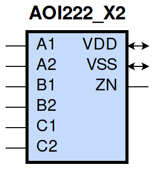
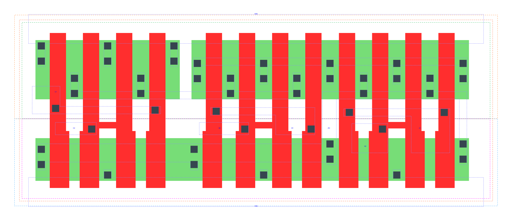

====================================
gf180mcu_fd_sc_mcu9t5v0__aoi222_x2
====================================

**gf180mcu_fd_sc_mcu9t5v0__aoi222_x2 symbol**

**gf180mcu_fd_sc_mcu9t5v0__aoi222_x2 schematic**

.. image:: sc9_sch/AOI222_X2_sch.png
    :height: 250px
    :width: 450 px
    :align: center
    :alt: gf180mcu_fd_sc_mcu9t5v0__aoi222_x2 schematic

**gf180mcu_fd_sc_mcu9t5v0__aoi222_x2 layout**

.. include:: images.rst
| AOI222_X2 is a three 2-input AND into 3-input NOR with 2X drive strength

|
| Attributes

============= ======================
**Attribute** **Value**
area          70.560000 µm\ :sup:`2`
============= ======================

|
| OUTPUT FUNCTIONS

+----------------+-------------------------------------------------------------------------------------------------------------------------------------------------------------------+
| **Output Pin** | **Function**                                                                                                                                                      |
+----------------+-------------------------------------------------------------------------------------------------------------------------------------------------------------------+
| ZN             | (((!A1)&(!B1)&(!C1))|((!A1)&(!B1)&(!C2))|((!A1)&(!B2)&(!C1))|((!A1)&(!B2)&(!C2))|((!A2)&(!B1)&(!C1))|((!A2)&(!B1)&(!C2))|((!A2)&(!B2)&(!C1))|((!A2)&(!B2)&(!C2))) |
+----------------+-------------------------------------------------------------------------------------------------------------------------------------------------------------------+

|
| TRUTH TABLE FOR ZN

====== ====== ====== ====== ====== ====== ======
**A1** **A2** **B1** **B2** **C1** **C2** **ZN**
0      ?      0      ?      0      ?      1
0      ?      0      ?      ?      0      1
0      ?      ?      0      0      ?      1
0      ?      ?      0      ?      0      1
?      0      0      ?      0      ?      1
?      0      0      ?      ?      0      1
?      0      ?      0      0      ?      1
?      0      ?      0      ?      0      1
1      1      ?      ?      ?      ?      0
?      ?      1      1      ?      ?      0
?      ?      ?      ?      1      1      0
====== ====== ====== ====== ====== ====== ======

|
| FUNCTIONAL SCHEMATIC

| |image86|

| PIN CAPACITANCE (pf)

======= ======== ====================
**Pin** **Type** **Capacitance (pf)**
C1      input    0.0140
C2      input    0.0130
B2      input    0.0132
B1      input    0.0142
A1      input    0.0147
A2      input    0.0136
======= ======== ====================

|
| DELAY AND OUTPUT TRANSITION TIME corresponding to min slew and load

+---------------+------------+--------------------+--------------+-------------------+----------------+---------------+
| **Input Pin** | **Output** | **When Condition** | **Tin (ns)** | **Out Load (pf)** | **Delay (ns)** | **Tout (ns)** |
+---------------+------------+--------------------+--------------+-------------------+----------------+---------------+
| C1(LH)        | ZN(HL)     | !A1&!A2&!B1&!B2&C2 | 0.0100       | 0.0010            | 0.1454         | 0.1045        |
+---------------+------------+--------------------+--------------+-------------------+----------------+---------------+
| C1(LH)        | ZN(HL)     | !A1&!A2&!B1&B2&C2  | 0.0100       | 0.0010            | 0.1356         | 0.0980        |
+---------------+------------+--------------------+--------------+-------------------+----------------+---------------+
| C1(LH)        | ZN(HL)     | !A1&!A2&B1&!B2&C2  | 0.0100       | 0.0010            | 0.1481         | 0.1195        |
+---------------+------------+--------------------+--------------+-------------------+----------------+---------------+
| C1(LH)        | ZN(HL)     | !A1&A2&!B1&!B2&C2  | 0.0100       | 0.0010            | 0.1074         | 0.0893        |
+---------------+------------+--------------------+--------------+-------------------+----------------+---------------+
| C1(LH)        | ZN(HL)     | !A1&A2&!B1&B2&C2   | 0.0100       | 0.0010            | 0.1030         | 0.0839        |
+---------------+------------+--------------------+--------------+-------------------+----------------+---------------+
| C1(LH)        | ZN(HL)     | !A1&A2&B1&!B2&C2   | 0.0100       | 0.0010            | 0.1156         | 0.1074        |
+---------------+------------+--------------------+--------------+-------------------+----------------+---------------+
| C1(LH)        | ZN(HL)     | A1&!A2&!B1&!B2&C2  | 0.0100       | 0.0010            | 0.1208         | 0.1130        |
+---------------+------------+--------------------+--------------+-------------------+----------------+---------------+
| C1(LH)        | ZN(HL)     | A1&!A2&!B1&B2&C2   | 0.0100       | 0.0010            | 0.1154         | 0.1068        |
+---------------+------------+--------------------+--------------+-------------------+----------------+---------------+
| C1(LH)        | ZN(HL)     | A1&!A2&B1&!B2&C2   | 0.0100       | 0.0010            | 0.1292         | 0.1292        |
+---------------+------------+--------------------+--------------+-------------------+----------------+---------------+
| C1(HL)        | ZN(LH)     | !A1&!A2&!B1&!B2&C2 | 0.0100       | 0.0010            | 0.2327         | 0.1336        |
+---------------+------------+--------------------+--------------+-------------------+----------------+---------------+
| C1(HL)        | ZN(LH)     | !A1&!A2&!B1&B2&C2  | 0.0100       | 0.0010            | 0.2670         | 0.1640        |
+---------------+------------+--------------------+--------------+-------------------+----------------+---------------+
| C1(HL)        | ZN(LH)     | !A1&!A2&B1&!B2&C2  | 0.0100       | 0.0010            | 0.3188         | 0.2011        |
+---------------+------------+--------------------+--------------+-------------------+----------------+---------------+
| C1(HL)        | ZN(LH)     | !A1&A2&!B1&!B2&C2  | 0.0100       | 0.0010            | 0.2691         | 0.1319        |
+---------------+------------+--------------------+--------------+-------------------+----------------+---------------+
| C1(HL)        | ZN(LH)     | !A1&A2&!B1&B2&C2   | 0.0100       | 0.0010            | 0.2982         | 0.1560        |
+---------------+------------+--------------------+--------------+-------------------+----------------+---------------+
| C1(HL)        | ZN(LH)     | !A1&A2&B1&!B2&C2   | 0.0100       | 0.0010            | 0.3596         | 0.2005        |
+---------------+------------+--------------------+--------------+-------------------+----------------+---------------+
| C1(HL)        | ZN(LH)     | A1&!A2&!B1&!B2&C2  | 0.0100       | 0.0010            | 0.3201         | 0.1672        |
+---------------+------------+--------------------+--------------+-------------------+----------------+---------------+
| C1(HL)        | ZN(LH)     | A1&!A2&!B1&B2&C2   | 0.0100       | 0.0010            | 0.3586         | 0.1999        |
+---------------+------------+--------------------+--------------+-------------------+----------------+---------------+
| C1(HL)        | ZN(LH)     | A1&!A2&B1&!B2&C2   | 0.0100       | 0.0010            | 0.4186         | 0.2450        |
+---------------+------------+--------------------+--------------+-------------------+----------------+---------------+
| C2(LH)        | ZN(HL)     | !A1&!A2&!B1&!B2&C1 | 0.0100       | 0.0010            | 0.1568         | 0.1047        |
+---------------+------------+--------------------+--------------+-------------------+----------------+---------------+
| C2(LH)        | ZN(HL)     | !A1&!A2&!B1&B2&C1  | 0.0100       | 0.0010            | 0.1472         | 0.0976        |
+---------------+------------+--------------------+--------------+-------------------+----------------+---------------+
| C2(LH)        | ZN(HL)     | !A1&!A2&B1&!B2&C1  | 0.0100       | 0.0010            | 0.1597         | 0.1191        |
+---------------+------------+--------------------+--------------+-------------------+----------------+---------------+
| C2(LH)        | ZN(HL)     | !A1&A2&!B1&!B2&C1  | 0.0100       | 0.0010            | 0.1192         | 0.0888        |
+---------------+------------+--------------------+--------------+-------------------+----------------+---------------+
| C2(LH)        | ZN(HL)     | !A1&A2&!B1&B2&C1   | 0.0100       | 0.0010            | 0.1148         | 0.0834        |
+---------------+------------+--------------------+--------------+-------------------+----------------+---------------+
| C2(LH)        | ZN(HL)     | !A1&A2&B1&!B2&C1   | 0.0100       | 0.0010            | 0.1274         | 0.1067        |
+---------------+------------+--------------------+--------------+-------------------+----------------+---------------+
| C2(LH)        | ZN(HL)     | A1&!A2&!B1&!B2&C1  | 0.0100       | 0.0010            | 0.1325         | 0.1126        |
+---------------+------------+--------------------+--------------+-------------------+----------------+---------------+
| C2(LH)        | ZN(HL)     | A1&!A2&!B1&B2&C1   | 0.0100       | 0.0010            | 0.1272         | 0.1062        |
+---------------+------------+--------------------+--------------+-------------------+----------------+---------------+
| C2(LH)        | ZN(HL)     | A1&!A2&B1&!B2&C1   | 0.0100       | 0.0010            | 0.1409         | 0.1286        |
+---------------+------------+--------------------+--------------+-------------------+----------------+---------------+
| C2(HL)        | ZN(LH)     | !A1&!A2&!B1&!B2&C1 | 0.0100       | 0.0010            | 0.2661         | 0.1630        |
+---------------+------------+--------------------+--------------+-------------------+----------------+---------------+
| C2(HL)        | ZN(LH)     | !A1&!A2&!B1&B2&C1  | 0.0100       | 0.0010            | 0.3082         | 0.2011        |
+---------------+------------+--------------------+--------------+-------------------+----------------+---------------+
| C2(HL)        | ZN(LH)     | !A1&!A2&B1&!B2&C1  | 0.0100       | 0.0010            | 0.3580         | 0.2387        |
+---------------+------------+--------------------+--------------+-------------------+----------------+---------------+
| C2(HL)        | ZN(LH)     | !A1&A2&!B1&!B2&C1  | 0.0100       | 0.0010            | 0.3104         | 0.1684        |
+---------------+------------+--------------------+--------------+-------------------+----------------+---------------+
| C2(HL)        | ZN(LH)     | !A1&A2&!B1&B2&C1   | 0.0100       | 0.0010            | 0.3471         | 0.2004        |
+---------------+------------+--------------------+--------------+-------------------+----------------+---------------+
| C2(HL)        | ZN(LH)     | !A1&A2&B1&!B2&C1   | 0.0100       | 0.0010            | 0.4063         | 0.2454        |
+---------------+------------+--------------------+--------------+-------------------+----------------+---------------+
| C2(HL)        | ZN(LH)     | A1&!A2&!B1&!B2&C1  | 0.0100       | 0.0010            | 0.3593         | 0.2044        |
+---------------+------------+--------------------+--------------+-------------------+----------------+---------------+
| C2(HL)        | ZN(LH)     | A1&!A2&!B1&B2&C1   | 0.0100       | 0.0010            | 0.4049         | 0.2445        |
+---------------+------------+--------------------+--------------+-------------------+----------------+---------------+
| C2(HL)        | ZN(LH)     | A1&!A2&B1&!B2&C1   | 0.0100       | 0.0010            | 0.4636         | 0.2898        |
+---------------+------------+--------------------+--------------+-------------------+----------------+---------------+
| B2(HL)        | ZN(LH)     | !A1&!A2&B1&!C1&!C2 | 0.0100       | 0.0010            | 0.2154         | 0.1533        |
+---------------+------------+--------------------+--------------+-------------------+----------------+---------------+
| B2(HL)        | ZN(LH)     | !A1&!A2&B1&!C1&C2  | 0.0100       | 0.0010            | 0.2605         | 0.2012        |
+---------------+------------+--------------------+--------------+-------------------+----------------+---------------+
| B2(HL)        | ZN(LH)     | !A1&!A2&B1&C1&!C2  | 0.0100       | 0.0010            | 0.3095         | 0.2385        |
+---------------+------------+--------------------+--------------+-------------------+----------------+---------------+
| B2(HL)        | ZN(LH)     | !A1&A2&B1&!C1&!C2  | 0.0100       | 0.0010            | 0.2536         | 0.1615        |
+---------------+------------+--------------------+--------------+-------------------+----------------+---------------+
| B2(HL)        | ZN(LH)     | !A1&A2&B1&!C1&C2   | 0.0100       | 0.0010            | 0.2998         | 0.2007        |
+---------------+------------+--------------------+--------------+-------------------+----------------+---------------+
| B2(HL)        | ZN(LH)     | !A1&A2&B1&C1&!C2   | 0.0100       | 0.0010            | 0.3577         | 0.2452        |
+---------------+------------+--------------------+--------------+-------------------+----------------+---------------+
| B2(HL)        | ZN(LH)     | A1&!A2&B1&!C1&!C2  | 0.0100       | 0.0010            | 0.3020         | 0.1982        |
+---------------+------------+--------------------+--------------+-------------------+----------------+---------------+
| B2(HL)        | ZN(LH)     | A1&!A2&B1&!C1&C2   | 0.0100       | 0.0010            | 0.3576         | 0.2450        |
+---------------+------------+--------------------+--------------+-------------------+----------------+---------------+
| B2(HL)        | ZN(LH)     | A1&!A2&B1&C1&!C2   | 0.0100       | 0.0010            | 0.4153         | 0.2897        |
+---------------+------------+--------------------+--------------+-------------------+----------------+---------------+
| B2(LH)        | ZN(HL)     | !A1&!A2&B1&!C1&!C2 | 0.0100       | 0.0010            | 0.1302         | 0.0765        |
+---------------+------------+--------------------+--------------+-------------------+----------------+---------------+
| B2(LH)        | ZN(HL)     | !A1&!A2&B1&!C1&C2  | 0.0100       | 0.0010            | 0.1305         | 0.0765        |
+---------------+------------+--------------------+--------------+-------------------+----------------+---------------+
| B2(LH)        | ZN(HL)     | !A1&!A2&B1&C1&!C2  | 0.0100       | 0.0010            | 0.1400         | 0.0949        |
+---------------+------------+--------------------+--------------+-------------------+----------------+---------------+
| B2(LH)        | ZN(HL)     | !A1&A2&B1&!C1&!C2  | 0.0100       | 0.0010            | 0.1097         | 0.0674        |
+---------------+------------+--------------------+--------------+-------------------+----------------+---------------+
| B2(LH)        | ZN(HL)     | !A1&A2&B1&!C1&C2   | 0.0100       | 0.0010            | 0.1100         | 0.0674        |
+---------------+------------+--------------------+--------------+-------------------+----------------+---------------+
| B2(LH)        | ZN(HL)     | !A1&A2&B1&C1&!C2   | 0.0100       | 0.0010            | 0.1193         | 0.0868        |
+---------------+------------+--------------------+--------------+-------------------+----------------+---------------+
| B2(LH)        | ZN(HL)     | A1&!A2&B1&!C1&!C2  | 0.0100       | 0.0010            | 0.1190         | 0.0867        |
+---------------+------------+--------------------+--------------+-------------------+----------------+---------------+
| B2(LH)        | ZN(HL)     | A1&!A2&B1&!C1&C2   | 0.0100       | 0.0010            | 0.1193         | 0.0867        |
+---------------+------------+--------------------+--------------+-------------------+----------------+---------------+
| B2(LH)        | ZN(HL)     | A1&!A2&B1&C1&!C2   | 0.0100       | 0.0010            | 0.1304         | 0.1056        |
+---------------+------------+--------------------+--------------+-------------------+----------------+---------------+
| B1(LH)        | ZN(HL)     | !A1&!A2&B2&!C1&!C2 | 0.0100       | 0.0010            | 0.1186         | 0.0763        |
+---------------+------------+--------------------+--------------+-------------------+----------------+---------------+
| B1(LH)        | ZN(HL)     | !A1&!A2&B2&!C1&C2  | 0.0100       | 0.0010            | 0.1188         | 0.0766        |
+---------------+------------+--------------------+--------------+-------------------+----------------+---------------+
| B1(LH)        | ZN(HL)     | !A1&!A2&B2&C1&!C2  | 0.0100       | 0.0010            | 0.1282         | 0.0951        |
+---------------+------------+--------------------+--------------+-------------------+----------------+---------------+
| B1(LH)        | ZN(HL)     | !A1&A2&B2&!C1&!C2  | 0.0100       | 0.0010            | 0.0979         | 0.0677        |
+---------------+------------+--------------------+--------------+-------------------+----------------+---------------+
| B1(LH)        | ZN(HL)     | !A1&A2&B2&!C1&C2   | 0.0100       | 0.0010            | 0.0982         | 0.0679        |
+---------------+------------+--------------------+--------------+-------------------+----------------+---------------+
| B1(LH)        | ZN(HL)     | !A1&A2&B2&C1&!C2   | 0.0100       | 0.0010            | 0.1075         | 0.0871        |
+---------------+------------+--------------------+--------------+-------------------+----------------+---------------+
| B1(LH)        | ZN(HL)     | A1&!A2&B2&!C1&!C2  | 0.0100       | 0.0010            | 0.1073         | 0.0869        |
+---------------+------------+--------------------+--------------+-------------------+----------------+---------------+
| B1(LH)        | ZN(HL)     | A1&!A2&B2&!C1&C2   | 0.0100       | 0.0010            | 0.1075         | 0.0871        |
+---------------+------------+--------------------+--------------+-------------------+----------------+---------------+
| B1(LH)        | ZN(HL)     | A1&!A2&B2&C1&!C2   | 0.0100       | 0.0010            | 0.1186         | 0.1060        |
+---------------+------------+--------------------+--------------+-------------------+----------------+---------------+
| B1(HL)        | ZN(LH)     | !A1&!A2&B2&!C1&!C2 | 0.0100       | 0.0010            | 0.1821         | 0.1229        |
+---------------+------------+--------------------+--------------+-------------------+----------------+---------------+
| B1(HL)        | ZN(LH)     | !A1&!A2&B2&!C1&C2  | 0.0100       | 0.0010            | 0.2192         | 0.1632        |
+---------------+------------+--------------------+--------------+-------------------+----------------+---------------+
| B1(HL)        | ZN(LH)     | !A1&!A2&B2&C1&!C2  | 0.0100       | 0.0010            | 0.2695         | 0.2003        |
+---------------+------------+--------------------+--------------+-------------------+----------------+---------------+
| B1(HL)        | ZN(LH)     | !A1&A2&B2&!C1&!C2  | 0.0100       | 0.0010            | 0.2128         | 0.1237        |
+---------------+------------+--------------------+--------------+-------------------+----------------+---------------+
| B1(HL)        | ZN(LH)     | !A1&A2&B2&!C1&C2   | 0.0100       | 0.0010            | 0.2504         | 0.1553        |
+---------------+------------+--------------------+--------------+-------------------+----------------+---------------+
| B1(HL)        | ZN(LH)     | !A1&A2&B2&C1&!C2   | 0.0100       | 0.0010            | 0.3105         | 0.1999        |
+---------------+------------+--------------------+--------------+-------------------+----------------+---------------+
| B1(HL)        | ZN(LH)     | A1&!A2&B2&!C1&!C2  | 0.0100       | 0.0010            | 0.2623         | 0.1605        |
+---------------+------------+--------------------+--------------+-------------------+----------------+---------------+
| B1(HL)        | ZN(LH)     | A1&!A2&B2&!C1&C2   | 0.0100       | 0.0010            | 0.3104         | 0.1997        |
+---------------+------------+--------------------+--------------+-------------------+----------------+---------------+
| B1(HL)        | ZN(LH)     | A1&!A2&B2&C1&!C2   | 0.0100       | 0.0010            | 0.3691         | 0.2441        |
+---------------+------------+--------------------+--------------+-------------------+----------------+---------------+
| A1(HL)        | ZN(LH)     | A2&!B1&!B2&!C1&!C2 | 0.0100       | 0.0010            | 0.1103         | 0.0906        |
+---------------+------------+--------------------+--------------+-------------------+----------------+---------------+
| A1(HL)        | ZN(LH)     | A2&!B1&!B2&!C1&C2  | 0.0100       | 0.0010            | 0.1186         | 0.1113        |
+---------------+------------+--------------------+--------------+-------------------+----------------+---------------+
| A1(HL)        | ZN(LH)     | A2&!B1&!B2&C1&!C2  | 0.0100       | 0.0010            | 0.1646         | 0.1542        |
+---------------+------------+--------------------+--------------+-------------------+----------------+---------------+
| A1(HL)        | ZN(LH)     | A2&!B1&B2&!C1&!C2  | 0.0100       | 0.0010            | 0.1317         | 0.1176        |
+---------------+------------+--------------------+--------------+-------------------+----------------+---------------+
| A1(HL)        | ZN(LH)     | A2&!B1&B2&!C1&C2   | 0.0100       | 0.0010            | 0.1413         | 0.1418        |
+---------------+------------+--------------------+--------------+-------------------+----------------+---------------+
| A1(HL)        | ZN(LH)     | A2&!B1&B2&C1&!C2   | 0.0100       | 0.0010            | 0.1982         | 0.1924        |
+---------------+------------+--------------------+--------------+-------------------+----------------+---------------+
| A1(HL)        | ZN(LH)     | A2&B1&!B2&!C1&!C2  | 0.0100       | 0.0010            | 0.1812         | 0.1582        |
+---------------+------------+--------------------+--------------+-------------------+----------------+---------------+
| A1(HL)        | ZN(LH)     | A2&B1&!B2&!C1&C2   | 0.0100       | 0.0010            | 0.1993         | 0.1932        |
+---------------+------------+--------------------+--------------+-------------------+----------------+---------------+
| A1(HL)        | ZN(LH)     | A2&B1&!B2&C1&!C2   | 0.0100       | 0.0010            | 0.2575         | 0.2411        |
+---------------+------------+--------------------+--------------+-------------------+----------------+---------------+
| A1(LH)        | ZN(HL)     | A2&!B1&!B2&!C1&!C2 | 0.0100       | 0.0010            | 0.0673         | 0.0415        |
+---------------+------------+--------------------+--------------+-------------------+----------------+---------------+
| A1(LH)        | ZN(HL)     | A2&!B1&!B2&!C1&C2  | 0.0100       | 0.0010            | 0.0673         | 0.0414        |
+---------------+------------+--------------------+--------------+-------------------+----------------+---------------+
| A1(LH)        | ZN(HL)     | A2&!B1&!B2&C1&!C2  | 0.0100       | 0.0010            | 0.0725         | 0.0576        |
+---------------+------------+--------------------+--------------+-------------------+----------------+---------------+
| A1(LH)        | ZN(HL)     | A2&!B1&B2&!C1&!C2  | 0.0100       | 0.0010            | 0.0676         | 0.0415        |
+---------------+------------+--------------------+--------------+-------------------+----------------+---------------+
| A1(LH)        | ZN(HL)     | A2&!B1&B2&!C1&C2   | 0.0100       | 0.0010            | 0.0676         | 0.0414        |
+---------------+------------+--------------------+--------------+-------------------+----------------+---------------+
| A1(LH)        | ZN(HL)     | A2&!B1&B2&C1&!C2   | 0.0100       | 0.0010            | 0.0728         | 0.0575        |
+---------------+------------+--------------------+--------------+-------------------+----------------+---------------+
| A1(LH)        | ZN(HL)     | A2&B1&!B2&!C1&!C2  | 0.0100       | 0.0010            | 0.0728         | 0.0579        |
+---------------+------------+--------------------+--------------+-------------------+----------------+---------------+
| A1(LH)        | ZN(HL)     | A2&B1&!B2&!C1&C2   | 0.0100       | 0.0010            | 0.0728         | 0.0579        |
+---------------+------------+--------------------+--------------+-------------------+----------------+---------------+
| A1(LH)        | ZN(HL)     | A2&B1&!B2&C1&!C2   | 0.0100       | 0.0010            | 0.0800         | 0.0746        |
+---------------+------------+--------------------+--------------+-------------------+----------------+---------------+
| A2(HL)        | ZN(LH)     | A1&!B1&!B2&!C1&!C2 | 0.0100       | 0.0010            | 0.1410         | 0.1220        |
+---------------+------------+--------------------+--------------+-------------------+----------------+---------------+
| A2(HL)        | ZN(LH)     | A1&!B1&!B2&!C1&C2  | 0.0100       | 0.0010            | 0.1550         | 0.1528        |
+---------------+------------+--------------------+--------------+-------------------+----------------+---------------+
| A2(HL)        | ZN(LH)     | A1&!B1&!B2&C1&!C2  | 0.0100       | 0.0010            | 0.2015         | 0.1944        |
+---------------+------------+--------------------+--------------+-------------------+----------------+---------------+
| A2(HL)        | ZN(LH)     | A1&!B1&B2&!C1&!C2  | 0.0100       | 0.0010            | 0.1704         | 0.1569        |
+---------------+------------+--------------------+--------------+-------------------+----------------+---------------+
| A2(HL)        | ZN(LH)     | A1&!B1&B2&!C1&C2   | 0.0100       | 0.0010            | 0.1865         | 0.1908        |
+---------------+------------+--------------------+--------------+-------------------+----------------+---------------+
| A2(HL)        | ZN(LH)     | A1&!B1&B2&C1&!C2   | 0.0100       | 0.0010            | 0.2435         | 0.2393        |
+---------------+------------+--------------------+--------------+-------------------+----------------+---------------+
| A2(HL)        | ZN(LH)     | A1&B1&!B2&!C1&!C2  | 0.0100       | 0.0010            | 0.2193         | 0.1963        |
+---------------+------------+--------------------+--------------+-------------------+----------------+---------------+
| A2(HL)        | ZN(LH)     | A1&B1&!B2&!C1&C2   | 0.0100       | 0.0010            | 0.2446         | 0.2401        |
+---------------+------------+--------------------+--------------+-------------------+----------------+---------------+
| A2(HL)        | ZN(LH)     | A1&B1&!B2&C1&!C2   | 0.0100       | 0.0010            | 0.3017         | 0.2870        |
+---------------+------------+--------------------+--------------+-------------------+----------------+---------------+
| A2(LH)        | ZN(HL)     | A1&!B1&!B2&!C1&!C2 | 0.0100       | 0.0010            | 0.0788         | 0.0414        |
+---------------+------------+--------------------+--------------+-------------------+----------------+---------------+
| A2(LH)        | ZN(HL)     | A1&!B1&!B2&!C1&C2  | 0.0100       | 0.0010            | 0.0788         | 0.0414        |
+---------------+------------+--------------------+--------------+-------------------+----------------+---------------+
| A2(LH)        | ZN(HL)     | A1&!B1&!B2&C1&!C2  | 0.0100       | 0.0010            | 0.0840         | 0.0576        |
+---------------+------------+--------------------+--------------+-------------------+----------------+---------------+
| A2(LH)        | ZN(HL)     | A1&!B1&B2&!C1&!C2  | 0.0100       | 0.0010            | 0.0790         | 0.0414        |
+---------------+------------+--------------------+--------------+-------------------+----------------+---------------+
| A2(LH)        | ZN(HL)     | A1&!B1&B2&!C1&C2   | 0.0100       | 0.0010            | 0.0790         | 0.0414        |
+---------------+------------+--------------------+--------------+-------------------+----------------+---------------+
| A2(LH)        | ZN(HL)     | A1&!B1&B2&C1&!C2   | 0.0100       | 0.0010            | 0.0843         | 0.0576        |
+---------------+------------+--------------------+--------------+-------------------+----------------+---------------+
| A2(LH)        | ZN(HL)     | A1&B1&!B2&!C1&!C2  | 0.0100       | 0.0010            | 0.0843         | 0.0579        |
+---------------+------------+--------------------+--------------+-------------------+----------------+---------------+
| A2(LH)        | ZN(HL)     | A1&B1&!B2&!C1&C2   | 0.0100       | 0.0010            | 0.0843         | 0.0579        |
+---------------+------------+--------------------+--------------+-------------------+----------------+---------------+
| A2(LH)        | ZN(HL)     | A1&B1&!B2&C1&!C2   | 0.0100       | 0.0010            | 0.0915         | 0.0746        |
+---------------+------------+--------------------+--------------+-------------------+----------------+---------------+

|
| DYNAMIC ENERGY

+---------------+---------------------+--------------+------------+-------------------+---------------------+
| **Input Pin** | **When Condition**  | **Tin (ns)** | **Output** | **Out Load (pf)** | **Energy (uW/MHz)** |
+---------------+---------------------+--------------+------------+-------------------+---------------------+
| A1            | A2&!B1&!B2&!C1&!C2  | 0.0100       | ZN(LH)     | 0.0010            | 0.4889              |
+---------------+---------------------+--------------+------------+-------------------+---------------------+
| A1            | A2&!B1&!B2&!C1&C2   | 0.0100       | ZN(LH)     | 0.0010            | 0.4891              |
+---------------+---------------------+--------------+------------+-------------------+---------------------+
| A1            | A2&!B1&!B2&C1&!C2   | 0.0100       | ZN(LH)     | 0.0010            | 0.6222              |
+---------------+---------------------+--------------+------------+-------------------+---------------------+
| A1            | A2&!B1&B2&!C1&!C2   | 0.0100       | ZN(LH)     | 0.0010            | 0.4885              |
+---------------+---------------------+--------------+------------+-------------------+---------------------+
| A1            | A2&!B1&B2&!C1&C2    | 0.0100       | ZN(LH)     | 0.0010            | 0.4887              |
+---------------+---------------------+--------------+------------+-------------------+---------------------+
| A1            | A2&!B1&B2&C1&!C2    | 0.0100       | ZN(LH)     | 0.0010            | 0.6217              |
+---------------+---------------------+--------------+------------+-------------------+---------------------+
| A1            | A2&B1&!B2&!C1&!C2   | 0.0100       | ZN(LH)     | 0.0010            | 0.6240              |
+---------------+---------------------+--------------+------------+-------------------+---------------------+
| A1            | A2&B1&!B2&!C1&C2    | 0.0100       | ZN(LH)     | 0.0010            | 0.6241              |
+---------------+---------------------+--------------+------------+-------------------+---------------------+
| A1            | A2&B1&!B2&C1&!C2    | 0.0100       | ZN(LH)     | 0.0010            | 0.7558              |
+---------------+---------------------+--------------+------------+-------------------+---------------------+
| B2            | !A1&!A2&B1&!C1&!C2  | 0.0100       | ZN(LH)     | 0.0010            | 0.8278              |
+---------------+---------------------+--------------+------------+-------------------+---------------------+
| B2            | !A1&!A2&B1&!C1&C2   | 0.0100       | ZN(LH)     | 0.0010            | 0.8276              |
+---------------+---------------------+--------------+------------+-------------------+---------------------+
| B2            | !A1&!A2&B1&C1&!C2   | 0.0100       | ZN(LH)     | 0.0010            | 0.9574              |
+---------------+---------------------+--------------+------------+-------------------+---------------------+
| B2            | !A1&A2&B1&!C1&!C2   | 0.0100       | ZN(LH)     | 0.0010            | 0.7613              |
+---------------+---------------------+--------------+------------+-------------------+---------------------+
| B2            | !A1&A2&B1&!C1&C2    | 0.0100       | ZN(LH)     | 0.0010            | 0.7611              |
+---------------+---------------------+--------------+------------+-------------------+---------------------+
| B2            | !A1&A2&B1&C1&!C2    | 0.0100       | ZN(LH)     | 0.0010            | 0.8912              |
+---------------+---------------------+--------------+------------+-------------------+---------------------+
| B2            | A1&!A2&B1&!C1&!C2   | 0.0100       | ZN(LH)     | 0.0010            | 0.8906              |
+---------------+---------------------+--------------+------------+-------------------+---------------------+
| B2            | A1&!A2&B1&!C1&C2    | 0.0100       | ZN(LH)     | 0.0010            | 0.8908              |
+---------------+---------------------+--------------+------------+-------------------+---------------------+
| B2            | A1&!A2&B1&C1&!C2    | 0.0100       | ZN(LH)     | 0.0010            | 1.0204              |
+---------------+---------------------+--------------+------------+-------------------+---------------------+
| B1            | !A1&!A2&B2&!C1&!C2  | 0.0100       | ZN(HL)     | 0.0010            | 0.1697              |
+---------------+---------------------+--------------+------------+-------------------+---------------------+
| B1            | !A1&!A2&B2&!C1&C2   | 0.0100       | ZN(HL)     | 0.0010            | 0.1715              |
+---------------+---------------------+--------------+------------+-------------------+---------------------+
| B1            | !A1&!A2&B2&C1&!C2   | 0.0100       | ZN(HL)     | 0.0010            | 0.1714              |
+---------------+---------------------+--------------+------------+-------------------+---------------------+
| B1            | !A1&A2&B2&!C1&!C2   | 0.0100       | ZN(HL)     | 0.0010            | 0.1500              |
+---------------+---------------------+--------------+------------+-------------------+---------------------+
| B1            | !A1&A2&B2&!C1&C2    | 0.0100       | ZN(HL)     | 0.0010            | 0.1515              |
+---------------+---------------------+--------------+------------+-------------------+---------------------+
| B1            | !A1&A2&B2&C1&!C2    | 0.0100       | ZN(HL)     | 0.0010            | 0.1517              |
+---------------+---------------------+--------------+------------+-------------------+---------------------+
| B1            | A1&!A2&B2&!C1&!C2   | 0.0100       | ZN(HL)     | 0.0010            | 0.1502              |
+---------------+---------------------+--------------+------------+-------------------+---------------------+
| B1            | A1&!A2&B2&!C1&C2    | 0.0100       | ZN(HL)     | 0.0010            | 0.1518              |
+---------------+---------------------+--------------+------------+-------------------+---------------------+
| B1            | A1&!A2&B2&C1&!C2    | 0.0100       | ZN(HL)     | 0.0010            | 0.1517              |
+---------------+---------------------+--------------+------------+-------------------+---------------------+
| A2            | A1&!B1&!B2&!C1&!C2  | 0.0100       | ZN(LH)     | 0.0010            | 0.6019              |
+---------------+---------------------+--------------+------------+-------------------+---------------------+
| A2            | A1&!B1&!B2&!C1&C2   | 0.0100       | ZN(LH)     | 0.0010            | 0.6021              |
+---------------+---------------------+--------------+------------+-------------------+---------------------+
| A2            | A1&!B1&!B2&C1&!C2   | 0.0100       | ZN(LH)     | 0.0010            | 0.7323              |
+---------------+---------------------+--------------+------------+-------------------+---------------------+
| A2            | A1&!B1&B2&!C1&!C2   | 0.0100       | ZN(LH)     | 0.0010            | 0.6017              |
+---------------+---------------------+--------------+------------+-------------------+---------------------+
| A2            | A1&!B1&B2&!C1&C2    | 0.0100       | ZN(LH)     | 0.0010            | 0.6020              |
+---------------+---------------------+--------------+------------+-------------------+---------------------+
| A2            | A1&!B1&B2&C1&!C2    | 0.0100       | ZN(LH)     | 0.0010            | 0.7321              |
+---------------+---------------------+--------------+------------+-------------------+---------------------+
| A2            | A1&B1&!B2&!C1&!C2   | 0.0100       | ZN(LH)     | 0.0010            | 0.7343              |
+---------------+---------------------+--------------+------------+-------------------+---------------------+
| A2            | A1&B1&!B2&!C1&C2    | 0.0100       | ZN(LH)     | 0.0010            | 0.7345              |
+---------------+---------------------+--------------+------------+-------------------+---------------------+
| A2            | A1&B1&!B2&C1&!C2    | 0.0100       | ZN(LH)     | 0.0010            | 0.8643              |
+---------------+---------------------+--------------+------------+-------------------+---------------------+
| B1            | !A1&!A2&B2&!C1&!C2  | 0.0100       | ZN(LH)     | 0.0010            | 0.7109              |
+---------------+---------------------+--------------+------------+-------------------+---------------------+
| B1            | !A1&!A2&B2&!C1&C2   | 0.0100       | ZN(LH)     | 0.0010            | 0.7109              |
+---------------+---------------------+--------------+------------+-------------------+---------------------+
| B1            | !A1&!A2&B2&C1&!C2   | 0.0100       | ZN(LH)     | 0.0010            | 0.8443              |
+---------------+---------------------+--------------+------------+-------------------+---------------------+
| B1            | !A1&A2&B2&!C1&!C2   | 0.0100       | ZN(LH)     | 0.0010            | 0.6444              |
+---------------+---------------------+--------------+------------+-------------------+---------------------+
| B1            | !A1&A2&B2&!C1&C2    | 0.0100       | ZN(LH)     | 0.0010            | 0.6442              |
+---------------+---------------------+--------------+------------+-------------------+---------------------+
| B1            | !A1&A2&B2&C1&!C2    | 0.0100       | ZN(LH)     | 0.0010            | 0.7778              |
+---------------+---------------------+--------------+------------+-------------------+---------------------+
| B1            | A1&!A2&B2&!C1&!C2   | 0.0100       | ZN(LH)     | 0.0010            | 0.7775              |
+---------------+---------------------+--------------+------------+-------------------+---------------------+
| B1            | A1&!A2&B2&!C1&C2    | 0.0100       | ZN(LH)     | 0.0010            | 0.7773              |
+---------------+---------------------+--------------+------------+-------------------+---------------------+
| B1            | A1&!A2&B2&C1&!C2    | 0.0100       | ZN(LH)     | 0.0010            | 0.9089              |
+---------------+---------------------+--------------+------------+-------------------+---------------------+
| C1            | !A1&!A2&!B1&!B2&C2  | 0.0100       | ZN(HL)     | 0.0010            | 0.3064              |
+---------------+---------------------+--------------+------------+-------------------+---------------------+
| C1            | !A1&!A2&!B1&B2&C2   | 0.0100       | ZN(HL)     | 0.0010            | 0.2870              |
+---------------+---------------------+--------------+------------+-------------------+---------------------+
| C1            | !A1&!A2&B1&!B2&C2   | 0.0100       | ZN(HL)     | 0.0010            | 0.2870              |
+---------------+---------------------+--------------+------------+-------------------+---------------------+
| C1            | !A1&A2&!B1&!B2&C2   | 0.0100       | ZN(HL)     | 0.0010            | 0.2873              |
+---------------+---------------------+--------------+------------+-------------------+---------------------+
| C1            | !A1&A2&!B1&B2&C2    | 0.0100       | ZN(HL)     | 0.0010            | 0.2678              |
+---------------+---------------------+--------------+------------+-------------------+---------------------+
| C1            | !A1&A2&B1&!B2&C2    | 0.0100       | ZN(HL)     | 0.0010            | 0.2680              |
+---------------+---------------------+--------------+------------+-------------------+---------------------+
| C1            | A1&!A2&!B1&!B2&C2   | 0.0100       | ZN(HL)     | 0.0010            | 0.2874              |
+---------------+---------------------+--------------+------------+-------------------+---------------------+
| C1            | A1&!A2&!B1&B2&C2    | 0.0100       | ZN(HL)     | 0.0010            | 0.2681              |
+---------------+---------------------+--------------+------------+-------------------+---------------------+
| C1            | A1&!A2&B1&!B2&C2    | 0.0100       | ZN(HL)     | 0.0010            | 0.2679              |
+---------------+---------------------+--------------+------------+-------------------+---------------------+
| A2            | A1&!B1&!B2&!C1&!C2  | 0.0100       | ZN(HL)     | 0.0010            | 0.0072              |
+---------------+---------------------+--------------+------------+-------------------+---------------------+
| A2            | A1&!B1&!B2&!C1&C2   | 0.0100       | ZN(HL)     | 0.0010            | 0.0073              |
+---------------+---------------------+--------------+------------+-------------------+---------------------+
| A2            | A1&!B1&!B2&C1&!C2   | 0.0100       | ZN(HL)     | 0.0010            | 0.0073              |
+---------------+---------------------+--------------+------------+-------------------+---------------------+
| A2            | A1&!B1&B2&!C1&!C2   | 0.0100       | ZN(HL)     | 0.0010            | 0.0083              |
+---------------+---------------------+--------------+------------+-------------------+---------------------+
| A2            | A1&!B1&B2&!C1&C2    | 0.0100       | ZN(HL)     | 0.0010            | 0.0083              |
+---------------+---------------------+--------------+------------+-------------------+---------------------+
| A2            | A1&!B1&B2&C1&!C2    | 0.0100       | ZN(HL)     | 0.0010            | 0.0084              |
+---------------+---------------------+--------------+------------+-------------------+---------------------+
| A2            | A1&B1&!B2&!C1&!C2   | 0.0100       | ZN(HL)     | 0.0010            | 0.0084              |
+---------------+---------------------+--------------+------------+-------------------+---------------------+
| A2            | A1&B1&!B2&!C1&C2    | 0.0100       | ZN(HL)     | 0.0010            | 0.0084              |
+---------------+---------------------+--------------+------------+-------------------+---------------------+
| A2            | A1&B1&!B2&C1&!C2    | 0.0100       | ZN(HL)     | 0.0010            | 0.0084              |
+---------------+---------------------+--------------+------------+-------------------+---------------------+
| C2            | !A1&!A2&!B1&!B2&C1  | 0.0100       | ZN(HL)     | 0.0010            | 0.3064              |
+---------------+---------------------+--------------+------------+-------------------+---------------------+
| C2            | !A1&!A2&!B1&B2&C1   | 0.0100       | ZN(HL)     | 0.0010            | 0.2866              |
+---------------+---------------------+--------------+------------+-------------------+---------------------+
| C2            | !A1&!A2&B1&!B2&C1   | 0.0100       | ZN(HL)     | 0.0010            | 0.2868              |
+---------------+---------------------+--------------+------------+-------------------+---------------------+
| C2            | !A1&A2&!B1&!B2&C1   | 0.0100       | ZN(HL)     | 0.0010            | 0.2871              |
+---------------+---------------------+--------------+------------+-------------------+---------------------+
| C2            | !A1&A2&!B1&B2&C1    | 0.0100       | ZN(HL)     | 0.0010            | 0.2676              |
+---------------+---------------------+--------------+------------+-------------------+---------------------+
| C2            | !A1&A2&B1&!B2&C1    | 0.0100       | ZN(HL)     | 0.0010            | 0.2677              |
+---------------+---------------------+--------------+------------+-------------------+---------------------+
| C2            | A1&!A2&!B1&!B2&C1   | 0.0100       | ZN(HL)     | 0.0010            | 0.2872              |
+---------------+---------------------+--------------+------------+-------------------+---------------------+
| C2            | A1&!A2&!B1&B2&C1    | 0.0100       | ZN(HL)     | 0.0010            | 0.2677              |
+---------------+---------------------+--------------+------------+-------------------+---------------------+
| C2            | A1&!A2&B1&!B2&C1    | 0.0100       | ZN(HL)     | 0.0010            | 0.2677              |
+---------------+---------------------+--------------+------------+-------------------+---------------------+
| C1            | !A1&!A2&!B1&!B2&C2  | 0.0100       | ZN(LH)     | 0.0010            | 0.9247              |
+---------------+---------------------+--------------+------------+-------------------+---------------------+
| C1            | !A1&!A2&!B1&B2&C2   | 0.0100       | ZN(LH)     | 0.0010            | 0.8592              |
+---------------+---------------------+--------------+------------+-------------------+---------------------+
| C1            | !A1&!A2&B1&!B2&C2   | 0.0100       | ZN(LH)     | 0.0010            | 0.9959              |
+---------------+---------------------+--------------+------------+-------------------+---------------------+
| C1            | !A1&A2&!B1&!B2&C2   | 0.0100       | ZN(LH)     | 0.0010            | 0.8578              |
+---------------+---------------------+--------------+------------+-------------------+---------------------+
| C1            | !A1&A2&!B1&B2&C2    | 0.0100       | ZN(LH)     | 0.0010            | 0.7926              |
+---------------+---------------------+--------------+------------+-------------------+---------------------+
| C1            | !A1&A2&B1&!B2&C2    | 0.0100       | ZN(LH)     | 0.0010            | 0.9293              |
+---------------+---------------------+--------------+------------+-------------------+---------------------+
| C1            | A1&!A2&!B1&!B2&C2   | 0.0100       | ZN(LH)     | 0.0010            | 0.9915              |
+---------------+---------------------+--------------+------------+-------------------+---------------------+
| C1            | A1&!A2&!B1&B2&C2    | 0.0100       | ZN(LH)     | 0.0010            | 0.9265              |
+---------------+---------------------+--------------+------------+-------------------+---------------------+
| C1            | A1&!A2&B1&!B2&C2    | 0.0100       | ZN(LH)     | 0.0010            | 1.0606              |
+---------------+---------------------+--------------+------------+-------------------+---------------------+
| C2            | !A1&!A2&!B1&!B2&C1  | 0.0100       | ZN(LH)     | 0.0010            | 1.0398              |
+---------------+---------------------+--------------+------------+-------------------+---------------------+
| C2            | !A1&!A2&!B1&B2&C1   | 0.0100       | ZN(LH)     | 0.0010            | 0.9750              |
+---------------+---------------------+--------------+------------+-------------------+---------------------+
| C2            | !A1&!A2&B1&!B2&C1   | 0.0100       | ZN(LH)     | 0.0010            | 1.1069              |
+---------------+---------------------+--------------+------------+-------------------+---------------------+
| C2            | !A1&A2&!B1&!B2&C1   | 0.0100       | ZN(LH)     | 0.0010            | 0.9734              |
+---------------+---------------------+--------------+------------+-------------------+---------------------+
| C2            | !A1&A2&!B1&B2&C1    | 0.0100       | ZN(LH)     | 0.0010            | 0.9082              |
+---------------+---------------------+--------------+------------+-------------------+---------------------+
| C2            | !A1&A2&B1&!B2&C1    | 0.0100       | ZN(LH)     | 0.0010            | 1.0404              |
+---------------+---------------------+--------------+------------+-------------------+---------------------+
| C2            | A1&!A2&!B1&!B2&C1   | 0.0100       | ZN(LH)     | 0.0010            | 1.1028              |
+---------------+---------------------+--------------+------------+-------------------+---------------------+
| C2            | A1&!A2&!B1&B2&C1    | 0.0100       | ZN(LH)     | 0.0010            | 1.0377              |
+---------------+---------------------+--------------+------------+-------------------+---------------------+
| C2            | A1&!A2&B1&!B2&C1    | 0.0100       | ZN(LH)     | 0.0010            | 1.1698              |
+---------------+---------------------+--------------+------------+-------------------+---------------------+
| A1            | A2&!B1&!B2&!C1&!C2  | 0.0100       | ZN(HL)     | 0.0010            | 0.0074              |
+---------------+---------------------+--------------+------------+-------------------+---------------------+
| A1            | A2&!B1&!B2&!C1&C2   | 0.0100       | ZN(HL)     | 0.0010            | 0.0074              |
+---------------+---------------------+--------------+------------+-------------------+---------------------+
| A1            | A2&!B1&!B2&C1&!C2   | 0.0100       | ZN(HL)     | 0.0010            | 0.0073              |
+---------------+---------------------+--------------+------------+-------------------+---------------------+
| A1            | A2&!B1&B2&!C1&!C2   | 0.0100       | ZN(HL)     | 0.0010            | 0.0085              |
+---------------+---------------------+--------------+------------+-------------------+---------------------+
| A1            | A2&!B1&B2&!C1&C2    | 0.0100       | ZN(HL)     | 0.0010            | 0.0084              |
+---------------+---------------------+--------------+------------+-------------------+---------------------+
| A1            | A2&!B1&B2&C1&!C2    | 0.0100       | ZN(HL)     | 0.0010            | 0.0083              |
+---------------+---------------------+--------------+------------+-------------------+---------------------+
| A1            | A2&B1&!B2&!C1&!C2   | 0.0100       | ZN(HL)     | 0.0010            | 0.0083              |
+---------------+---------------------+--------------+------------+-------------------+---------------------+
| A1            | A2&B1&!B2&!C1&C2    | 0.0100       | ZN(HL)     | 0.0010            | 0.0083              |
+---------------+---------------------+--------------+------------+-------------------+---------------------+
| A1            | A2&B1&!B2&C1&!C2    | 0.0100       | ZN(HL)     | 0.0010            | 0.0084              |
+---------------+---------------------+--------------+------------+-------------------+---------------------+
| B2            | !A1&!A2&B1&!C1&!C2  | 0.0100       | ZN(HL)     | 0.0010            | 0.1698              |
+---------------+---------------------+--------------+------------+-------------------+---------------------+
| B2            | !A1&!A2&B1&!C1&C2   | 0.0100       | ZN(HL)     | 0.0010            | 0.1711              |
+---------------+---------------------+--------------+------------+-------------------+---------------------+
| B2            | !A1&!A2&B1&C1&!C2   | 0.0100       | ZN(HL)     | 0.0010            | 0.1713              |
+---------------+---------------------+--------------+------------+-------------------+---------------------+
| B2            | !A1&A2&B1&!C1&!C2   | 0.0100       | ZN(HL)     | 0.0010            | 0.1502              |
+---------------+---------------------+--------------+------------+-------------------+---------------------+
| B2            | !A1&A2&B1&!C1&C2    | 0.0100       | ZN(HL)     | 0.0010            | 0.1516              |
+---------------+---------------------+--------------+------------+-------------------+---------------------+
| B2            | !A1&A2&B1&C1&!C2    | 0.0100       | ZN(HL)     | 0.0010            | 0.1517              |
+---------------+---------------------+--------------+------------+-------------------+---------------------+
| B2            | A1&!A2&B1&!C1&!C2   | 0.0100       | ZN(HL)     | 0.0010            | 0.1503              |
+---------------+---------------------+--------------+------------+-------------------+---------------------+
| B2            | A1&!A2&B1&!C1&C2    | 0.0100       | ZN(HL)     | 0.0010            | 0.1517              |
+---------------+---------------------+--------------+------------+-------------------+---------------------+
| B2            | A1&!A2&B1&C1&!C2    | 0.0100       | ZN(HL)     | 0.0010            | 0.1516              |
+---------------+---------------------+--------------+------------+-------------------+---------------------+
| B2(LH)        | !A1&!A2&!B1&!C1&!C2 | 0.0100       | n/a        | n/a               | -0.1196             |
+---------------+---------------------+--------------+------------+-------------------+---------------------+
| B2(LH)        | !A1&!A2&!B1&!C1&C2  | 0.0100       | n/a        | n/a               | -0.1196             |
+---------------+---------------------+--------------+------------+-------------------+---------------------+
| B2(LH)        | !A1&!A2&!B1&C1&!C2  | 0.0100       | n/a        | n/a               | -0.1196             |
+---------------+---------------------+--------------+------------+-------------------+---------------------+
| B2(LH)        | !A1&A2&!B1&!C1&!C2  | 0.0100       | n/a        | n/a               | -0.1195             |
+---------------+---------------------+--------------+------------+-------------------+---------------------+
| B2(LH)        | !A1&A2&!B1&!C1&C2   | 0.0100       | n/a        | n/a               | -0.1194             |
+---------------+---------------------+--------------+------------+-------------------+---------------------+
| B2(LH)        | !A1&A2&!B1&C1&!C2   | 0.0100       | n/a        | n/a               | -0.1194             |
+---------------+---------------------+--------------+------------+-------------------+---------------------+
| B2(LH)        | A1&!A2&!B1&!C1&!C2  | 0.0100       | n/a        | n/a               | -0.1195             |
+---------------+---------------------+--------------+------------+-------------------+---------------------+
| B2(LH)        | A1&!A2&!B1&!C1&C2   | 0.0100       | n/a        | n/a               | -0.1194             |
+---------------+---------------------+--------------+------------+-------------------+---------------------+
| B2(LH)        | A1&!A2&!B1&C1&!C2   | 0.0100       | n/a        | n/a               | -0.1194             |
+---------------+---------------------+--------------+------------+-------------------+---------------------+
| B2(LH)        | !A1&!A2&!B1&C1&C2   | 0.0100       | n/a        | n/a               | -0.0347             |
+---------------+---------------------+--------------+------------+-------------------+---------------------+
| B2(LH)        | !A1&!A2&B1&C1&C2    | 0.0100       | n/a        | n/a               | -0.0365             |
+---------------+---------------------+--------------+------------+-------------------+---------------------+
| B2(LH)        | !A1&A2&!B1&C1&C2    | 0.0100       | n/a        | n/a               | -0.0349             |
+---------------+---------------------+--------------+------------+-------------------+---------------------+
| B2(LH)        | !A1&A2&B1&C1&C2     | 0.0100       | n/a        | n/a               | -0.0366             |
+---------------+---------------------+--------------+------------+-------------------+---------------------+
| B2(LH)        | A1&!A2&!B1&C1&C2    | 0.0100       | n/a        | n/a               | -0.0349             |
+---------------+---------------------+--------------+------------+-------------------+---------------------+
| B2(LH)        | A1&!A2&B1&C1&C2     | 0.0100       | n/a        | n/a               | -0.0366             |
+---------------+---------------------+--------------+------------+-------------------+---------------------+
| B2(LH)        | A1&A2&!B1&!C1&!C2   | 0.0100       | n/a        | n/a               | -0.1194             |
+---------------+---------------------+--------------+------------+-------------------+---------------------+
| B2(LH)        | A1&A2&!B1&!C1&C2    | 0.0100       | n/a        | n/a               | -0.1193             |
+---------------+---------------------+--------------+------------+-------------------+---------------------+
| B2(LH)        | A1&A2&!B1&C1&!C2    | 0.0100       | n/a        | n/a               | -0.1193             |
+---------------+---------------------+--------------+------------+-------------------+---------------------+
| B2(LH)        | A1&A2&!B1&C1&C2     | 0.0100       | n/a        | n/a               | -0.0656             |
+---------------+---------------------+--------------+------------+-------------------+---------------------+
| B2(LH)        | A1&A2&B1&!C1&!C2    | 0.0100       | n/a        | n/a               | -0.0939             |
+---------------+---------------------+--------------+------------+-------------------+---------------------+
| B2(LH)        | A1&A2&B1&!C1&C2     | 0.0100       | n/a        | n/a               | -0.0931             |
+---------------+---------------------+--------------+------------+-------------------+---------------------+
| B2(LH)        | A1&A2&B1&C1&!C2     | 0.0100       | n/a        | n/a               | -0.0930             |
+---------------+---------------------+--------------+------------+-------------------+---------------------+
| B2(LH)        | A1&A2&B1&C1&C2      | 0.0100       | n/a        | n/a               | -0.0695             |
+---------------+---------------------+--------------+------------+-------------------+---------------------+
| C2(HL)        | !A1&!A2&!B1&!B2&!C1 | 0.0100       | n/a        | n/a               | 0.1330              |
+---------------+---------------------+--------------+------------+-------------------+---------------------+
| C2(HL)        | !A1&!A2&!B1&B2&!C1  | 0.0100       | n/a        | n/a               | 0.1330              |
+---------------+---------------------+--------------+------------+-------------------+---------------------+
| C2(HL)        | !A1&!A2&B1&!B2&!C1  | 0.0100       | n/a        | n/a               | 0.1330              |
+---------------+---------------------+--------------+------------+-------------------+---------------------+
| C2(HL)        | !A1&A2&!B1&!B2&!C1  | 0.0100       | n/a        | n/a               | 0.1330              |
+---------------+---------------------+--------------+------------+-------------------+---------------------+
| C2(HL)        | !A1&A2&!B1&B2&!C1   | 0.0100       | n/a        | n/a               | 0.1330              |
+---------------+---------------------+--------------+------------+-------------------+---------------------+
| C2(HL)        | !A1&A2&B1&!B2&!C1   | 0.0100       | n/a        | n/a               | 0.1330              |
+---------------+---------------------+--------------+------------+-------------------+---------------------+
| C2(HL)        | A1&!A2&!B1&!B2&!C1  | 0.0100       | n/a        | n/a               | 0.1330              |
+---------------+---------------------+--------------+------------+-------------------+---------------------+
| C2(HL)        | A1&!A2&!B1&B2&!C1   | 0.0100       | n/a        | n/a               | 0.1330              |
+---------------+---------------------+--------------+------------+-------------------+---------------------+
| C2(HL)        | A1&!A2&B1&!B2&!C1   | 0.0100       | n/a        | n/a               | 0.1330              |
+---------------+---------------------+--------------+------------+-------------------+---------------------+
| C2(HL)        | !A1&!A2&B1&B2&!C1   | 0.0100       | n/a        | n/a               | 0.1194              |
+---------------+---------------------+--------------+------------+-------------------+---------------------+
| C2(HL)        | !A1&!A2&B1&B2&C1    | 0.0100       | n/a        | n/a               | 0.1193              |
+---------------+---------------------+--------------+------------+-------------------+---------------------+
| C2(HL)        | !A1&A2&B1&B2&!C1    | 0.0100       | n/a        | n/a               | 0.1194              |
+---------------+---------------------+--------------+------------+-------------------+---------------------+
| C2(HL)        | !A1&A2&B1&B2&C1     | 0.0100       | n/a        | n/a               | 0.1193              |
+---------------+---------------------+--------------+------------+-------------------+---------------------+
| C2(HL)        | A1&!A2&B1&B2&!C1    | 0.0100       | n/a        | n/a               | 0.1194              |
+---------------+---------------------+--------------+------------+-------------------+---------------------+
| C2(HL)        | A1&!A2&B1&B2&C1     | 0.0100       | n/a        | n/a               | 0.1193              |
+---------------+---------------------+--------------+------------+-------------------+---------------------+
| C2(HL)        | A1&A2&!B1&!B2&!C1   | 0.0100       | n/a        | n/a               | 0.1193              |
+---------------+---------------------+--------------+------------+-------------------+---------------------+
| C2(HL)        | A1&A2&!B1&!B2&C1    | 0.0100       | n/a        | n/a               | 0.1175              |
+---------------+---------------------+--------------+------------+-------------------+---------------------+
| C2(HL)        | A1&A2&!B1&B2&!C1    | 0.0100       | n/a        | n/a               | 0.1194              |
+---------------+---------------------+--------------+------------+-------------------+---------------------+
| C2(HL)        | A1&A2&!B1&B2&C1     | 0.0100       | n/a        | n/a               | 0.1178              |
+---------------+---------------------+--------------+------------+-------------------+---------------------+
| C2(HL)        | A1&A2&B1&!B2&!C1    | 0.0100       | n/a        | n/a               | 0.1194              |
+---------------+---------------------+--------------+------------+-------------------+---------------------+
| C2(HL)        | A1&A2&B1&!B2&C1     | 0.0100       | n/a        | n/a               | 0.1179              |
+---------------+---------------------+--------------+------------+-------------------+---------------------+
| C2(HL)        | A1&A2&B1&B2&!C1     | 0.0100       | n/a        | n/a               | 0.1194              |
+---------------+---------------------+--------------+------------+-------------------+---------------------+
| C2(HL)        | A1&A2&B1&B2&C1      | 0.0100       | n/a        | n/a               | 0.1193              |
+---------------+---------------------+--------------+------------+-------------------+---------------------+
| B2(HL)        | !A1&!A2&!B1&!C1&!C2 | 0.0100       | n/a        | n/a               | 0.1332              |
+---------------+---------------------+--------------+------------+-------------------+---------------------+
| B2(HL)        | !A1&!A2&!B1&!C1&C2  | 0.0100       | n/a        | n/a               | 0.1330              |
+---------------+---------------------+--------------+------------+-------------------+---------------------+
| B2(HL)        | !A1&!A2&!B1&C1&!C2  | 0.0100       | n/a        | n/a               | 0.1330              |
+---------------+---------------------+--------------+------------+-------------------+---------------------+
| B2(HL)        | !A1&A2&!B1&!C1&!C2  | 0.0100       | n/a        | n/a               | 0.1333              |
+---------------+---------------------+--------------+------------+-------------------+---------------------+
| B2(HL)        | !A1&A2&!B1&!C1&C2   | 0.0100       | n/a        | n/a               | 0.1331              |
+---------------+---------------------+--------------+------------+-------------------+---------------------+
| B2(HL)        | !A1&A2&!B1&C1&!C2   | 0.0100       | n/a        | n/a               | 0.1331              |
+---------------+---------------------+--------------+------------+-------------------+---------------------+
| B2(HL)        | A1&!A2&!B1&!C1&!C2  | 0.0100       | n/a        | n/a               | 0.1333              |
+---------------+---------------------+--------------+------------+-------------------+---------------------+
| B2(HL)        | A1&!A2&!B1&!C1&C2   | 0.0100       | n/a        | n/a               | 0.1331              |
+---------------+---------------------+--------------+------------+-------------------+---------------------+
| B2(HL)        | A1&!A2&!B1&C1&!C2   | 0.0100       | n/a        | n/a               | 0.1331              |
+---------------+---------------------+--------------+------------+-------------------+---------------------+
| B2(HL)        | !A1&!A2&!B1&C1&C2   | 0.0100       | n/a        | n/a               | 0.0388              |
+---------------+---------------------+--------------+------------+-------------------+---------------------+
| B2(HL)        | !A1&!A2&B1&C1&C2    | 0.0100       | n/a        | n/a               | 0.1211              |
+---------------+---------------------+--------------+------------+-------------------+---------------------+
| B2(HL)        | !A1&A2&!B1&C1&C2    | 0.0100       | n/a        | n/a               | 0.0389              |
+---------------+---------------------+--------------+------------+-------------------+---------------------+
| B2(HL)        | !A1&A2&B1&C1&C2     | 0.0100       | n/a        | n/a               | 0.1206              |
+---------------+---------------------+--------------+------------+-------------------+---------------------+
| B2(HL)        | A1&!A2&!B1&C1&C2    | 0.0100       | n/a        | n/a               | 0.0389              |
+---------------+---------------------+--------------+------------+-------------------+---------------------+
| B2(HL)        | A1&!A2&B1&C1&C2     | 0.0100       | n/a        | n/a               | 0.1206              |
+---------------+---------------------+--------------+------------+-------------------+---------------------+
| B2(HL)        | A1&A2&!B1&!C1&!C2   | 0.0100       | n/a        | n/a               | 0.1198              |
+---------------+---------------------+--------------+------------+-------------------+---------------------+
| B2(HL)        | A1&A2&!B1&!C1&C2    | 0.0100       | n/a        | n/a               | 0.1195              |
+---------------+---------------------+--------------+------------+-------------------+---------------------+
| B2(HL)        | A1&A2&!B1&C1&!C2    | 0.0100       | n/a        | n/a               | 0.1195              |
+---------------+---------------------+--------------+------------+-------------------+---------------------+
| B2(HL)        | A1&A2&!B1&C1&C2     | 0.0100       | n/a        | n/a               | 0.0653              |
+---------------+---------------------+--------------+------------+-------------------+---------------------+
| B2(HL)        | A1&A2&B1&!C1&!C2    | 0.0100       | n/a        | n/a               | 0.1184              |
+---------------+---------------------+--------------+------------+-------------------+---------------------+
| B2(HL)        | A1&A2&B1&!C1&C2     | 0.0100       | n/a        | n/a               | 0.1184              |
+---------------+---------------------+--------------+------------+-------------------+---------------------+
| B2(HL)        | A1&A2&B1&C1&!C2     | 0.0100       | n/a        | n/a               | 0.1183              |
+---------------+---------------------+--------------+------------+-------------------+---------------------+
| B2(HL)        | A1&A2&B1&C1&C2      | 0.0100       | n/a        | n/a               | 0.0697              |
+---------------+---------------------+--------------+------------+-------------------+---------------------+
| C2(LH)        | !A1&!A2&!B1&!B2&!C1 | 0.0100       | n/a        | n/a               | -0.1191             |
+---------------+---------------------+--------------+------------+-------------------+---------------------+
| C2(LH)        | !A1&!A2&!B1&B2&!C1  | 0.0100       | n/a        | n/a               | -0.1191             |
+---------------+---------------------+--------------+------------+-------------------+---------------------+
| C2(LH)        | !A1&!A2&B1&!B2&!C1  | 0.0100       | n/a        | n/a               | -0.1191             |
+---------------+---------------------+--------------+------------+-------------------+---------------------+
| C2(LH)        | !A1&A2&!B1&!B2&!C1  | 0.0100       | n/a        | n/a               | -0.1191             |
+---------------+---------------------+--------------+------------+-------------------+---------------------+
| C2(LH)        | !A1&A2&!B1&B2&!C1   | 0.0100       | n/a        | n/a               | -0.1191             |
+---------------+---------------------+--------------+------------+-------------------+---------------------+
| C2(LH)        | !A1&A2&B1&!B2&!C1   | 0.0100       | n/a        | n/a               | -0.1191             |
+---------------+---------------------+--------------+------------+-------------------+---------------------+
| C2(LH)        | A1&!A2&!B1&!B2&!C1  | 0.0100       | n/a        | n/a               | -0.1191             |
+---------------+---------------------+--------------+------------+-------------------+---------------------+
| C2(LH)        | A1&!A2&!B1&B2&!C1   | 0.0100       | n/a        | n/a               | -0.1191             |
+---------------+---------------------+--------------+------------+-------------------+---------------------+
| C2(LH)        | A1&!A2&B1&!B2&!C1   | 0.0100       | n/a        | n/a               | -0.1191             |
+---------------+---------------------+--------------+------------+-------------------+---------------------+
| C2(LH)        | !A1&!A2&B1&B2&!C1   | 0.0100       | n/a        | n/a               | -0.1188             |
+---------------+---------------------+--------------+------------+-------------------+---------------------+
| C2(LH)        | !A1&!A2&B1&B2&C1    | 0.0100       | n/a        | n/a               | -0.1011             |
+---------------+---------------------+--------------+------------+-------------------+---------------------+
| C2(LH)        | !A1&A2&B1&B2&!C1    | 0.0100       | n/a        | n/a               | -0.1188             |
+---------------+---------------------+--------------+------------+-------------------+---------------------+
| C2(LH)        | !A1&A2&B1&B2&C1     | 0.0100       | n/a        | n/a               | -0.1012             |
+---------------+---------------------+--------------+------------+-------------------+---------------------+
| C2(LH)        | A1&!A2&B1&B2&!C1    | 0.0100       | n/a        | n/a               | -0.1188             |
+---------------+---------------------+--------------+------------+-------------------+---------------------+
| C2(LH)        | A1&!A2&B1&B2&C1     | 0.0100       | n/a        | n/a               | -0.1012             |
+---------------+---------------------+--------------+------------+-------------------+---------------------+
| C2(LH)        | A1&A2&!B1&!B2&!C1   | 0.0100       | n/a        | n/a               | -0.1190             |
+---------------+---------------------+--------------+------------+-------------------+---------------------+
| C2(LH)        | A1&A2&!B1&!B2&C1    | 0.0100       | n/a        | n/a               | -0.0955             |
+---------------+---------------------+--------------+------------+-------------------+---------------------+
| C2(LH)        | A1&A2&!B1&B2&!C1    | 0.0100       | n/a        | n/a               | -0.1189             |
+---------------+---------------------+--------------+------------+-------------------+---------------------+
| C2(LH)        | A1&A2&!B1&B2&C1     | 0.0100       | n/a        | n/a               | -0.0980             |
+---------------+---------------------+--------------+------------+-------------------+---------------------+
| C2(LH)        | A1&A2&B1&!B2&!C1    | 0.0100       | n/a        | n/a               | -0.1189             |
+---------------+---------------------+--------------+------------+-------------------+---------------------+
| C2(LH)        | A1&A2&B1&!B2&C1     | 0.0100       | n/a        | n/a               | -0.0980             |
+---------------+---------------------+--------------+------------+-------------------+---------------------+
| C2(LH)        | A1&A2&B1&B2&!C1     | 0.0100       | n/a        | n/a               | -0.1188             |
+---------------+---------------------+--------------+------------+-------------------+---------------------+
| C2(LH)        | A1&A2&B1&B2&C1      | 0.0100       | n/a        | n/a               | -0.1043             |
+---------------+---------------------+--------------+------------+-------------------+---------------------+
| A2(LH)        | !A1&!B1&!B2&!C1&!C2 | 0.0100       | n/a        | n/a               | -0.1201             |
+---------------+---------------------+--------------+------------+-------------------+---------------------+
| A2(LH)        | !A1&!B1&!B2&!C1&C2  | 0.0100       | n/a        | n/a               | -0.1200             |
+---------------+---------------------+--------------+------------+-------------------+---------------------+
| A2(LH)        | !A1&!B1&!B2&C1&!C2  | 0.0100       | n/a        | n/a               | -0.1200             |
+---------------+---------------------+--------------+------------+-------------------+---------------------+
| A2(LH)        | !A1&!B1&B2&!C1&!C2  | 0.0100       | n/a        | n/a               | -0.1199             |
+---------------+---------------------+--------------+------------+-------------------+---------------------+
| A2(LH)        | !A1&!B1&B2&!C1&C2   | 0.0100       | n/a        | n/a               | -0.1199             |
+---------------+---------------------+--------------+------------+-------------------+---------------------+
| A2(LH)        | !A1&!B1&B2&C1&!C2   | 0.0100       | n/a        | n/a               | -0.1199             |
+---------------+---------------------+--------------+------------+-------------------+---------------------+
| A2(LH)        | !A1&B1&!B2&!C1&!C2  | 0.0100       | n/a        | n/a               | -0.1199             |
+---------------+---------------------+--------------+------------+-------------------+---------------------+
| A2(LH)        | !A1&B1&!B2&!C1&C2   | 0.0100       | n/a        | n/a               | -0.1199             |
+---------------+---------------------+--------------+------------+-------------------+---------------------+
| A2(LH)        | !A1&B1&!B2&C1&!C2   | 0.0100       | n/a        | n/a               | -0.1199             |
+---------------+---------------------+--------------+------------+-------------------+---------------------+
| A2(LH)        | !A1&!B1&!B2&C1&C2   | 0.0100       | n/a        | n/a               | -0.0296             |
+---------------+---------------------+--------------+------------+-------------------+---------------------+
| A2(LH)        | !A1&!B1&B2&C1&C2    | 0.0100       | n/a        | n/a               | -0.0295             |
+---------------+---------------------+--------------+------------+-------------------+---------------------+
| A2(LH)        | !A1&B1&!B2&C1&C2    | 0.0100       | n/a        | n/a               | -0.0295             |
+---------------+---------------------+--------------+------------+-------------------+---------------------+
| A2(LH)        | !A1&B1&B2&!C1&!C2   | 0.0100       | n/a        | n/a               | -0.0297             |
+---------------+---------------------+--------------+------------+-------------------+---------------------+
| A2(LH)        | !A1&B1&B2&!C1&C2    | 0.0100       | n/a        | n/a               | -0.0297             |
+---------------+---------------------+--------------+------------+-------------------+---------------------+
| A2(LH)        | !A1&B1&B2&C1&!C2    | 0.0100       | n/a        | n/a               | -0.0297             |
+---------------+---------------------+--------------+------------+-------------------+---------------------+
| A2(LH)        | !A1&B1&B2&C1&C2     | 0.0100       | n/a        | n/a               | -0.0296             |
+---------------+---------------------+--------------+------------+-------------------+---------------------+
| A2(LH)        | A1&!B1&!B2&C1&C2    | 0.0100       | n/a        | n/a               | -0.0313             |
+---------------+---------------------+--------------+------------+-------------------+---------------------+
| A2(LH)        | A1&!B1&B2&C1&C2     | 0.0100       | n/a        | n/a               | -0.0314             |
+---------------+---------------------+--------------+------------+-------------------+---------------------+
| A2(LH)        | A1&B1&!B2&C1&C2     | 0.0100       | n/a        | n/a               | -0.0315             |
+---------------+---------------------+--------------+------------+-------------------+---------------------+
| A2(LH)        | A1&B1&B2&!C1&!C2    | 0.0100       | n/a        | n/a               | -0.0317             |
+---------------+---------------------+--------------+------------+-------------------+---------------------+
| A2(LH)        | A1&B1&B2&!C1&C2     | 0.0100       | n/a        | n/a               | -0.0317             |
+---------------+---------------------+--------------+------------+-------------------+---------------------+
| A2(LH)        | A1&B1&B2&C1&!C2     | 0.0100       | n/a        | n/a               | -0.0317             |
+---------------+---------------------+--------------+------------+-------------------+---------------------+
| A2(LH)        | A1&B1&B2&C1&C2      | 0.0100       | n/a        | n/a               | -0.0317             |
+---------------+---------------------+--------------+------------+-------------------+---------------------+
| A1(LH)        | !A2&!B1&!B2&!C1&!C2 | 0.0100       | n/a        | n/a               | -0.0903             |
+---------------+---------------------+--------------+------------+-------------------+---------------------+
| A1(LH)        | !A2&!B1&!B2&!C1&C2  | 0.0100       | n/a        | n/a               | -0.0903             |
+---------------+---------------------+--------------+------------+-------------------+---------------------+
| A1(LH)        | !A2&!B1&!B2&C1&!C2  | 0.0100       | n/a        | n/a               | -0.0903             |
+---------------+---------------------+--------------+------------+-------------------+---------------------+
| A1(LH)        | !A2&!B1&B2&!C1&!C2  | 0.0100       | n/a        | n/a               | -0.0903             |
+---------------+---------------------+--------------+------------+-------------------+---------------------+
| A1(LH)        | !A2&!B1&B2&!C1&C2   | 0.0100       | n/a        | n/a               | -0.0903             |
+---------------+---------------------+--------------+------------+-------------------+---------------------+
| A1(LH)        | !A2&!B1&B2&C1&!C2   | 0.0100       | n/a        | n/a               | -0.0903             |
+---------------+---------------------+--------------+------------+-------------------+---------------------+
| A1(LH)        | !A2&B1&!B2&!C1&!C2  | 0.0100       | n/a        | n/a               | -0.0903             |
+---------------+---------------------+--------------+------------+-------------------+---------------------+
| A1(LH)        | !A2&B1&!B2&!C1&C2   | 0.0100       | n/a        | n/a               | -0.0902             |
+---------------+---------------------+--------------+------------+-------------------+---------------------+
| A1(LH)        | !A2&B1&!B2&C1&!C2   | 0.0100       | n/a        | n/a               | -0.0903             |
+---------------+---------------------+--------------+------------+-------------------+---------------------+
| A1(LH)        | !A2&!B1&!B2&C1&C2   | 0.0100       | n/a        | n/a               | -0.0296             |
+---------------+---------------------+--------------+------------+-------------------+---------------------+
| A1(LH)        | !A2&!B1&B2&C1&C2    | 0.0100       | n/a        | n/a               | -0.0294             |
+---------------+---------------------+--------------+------------+-------------------+---------------------+
| A1(LH)        | !A2&B1&!B2&C1&C2    | 0.0100       | n/a        | n/a               | -0.0294             |
+---------------+---------------------+--------------+------------+-------------------+---------------------+
| A1(LH)        | !A2&B1&B2&!C1&!C2   | 0.0100       | n/a        | n/a               | -0.0296             |
+---------------+---------------------+--------------+------------+-------------------+---------------------+
| A1(LH)        | !A2&B1&B2&!C1&C2    | 0.0100       | n/a        | n/a               | -0.0296             |
+---------------+---------------------+--------------+------------+-------------------+---------------------+
| A1(LH)        | !A2&B1&B2&C1&!C2    | 0.0100       | n/a        | n/a               | -0.0296             |
+---------------+---------------------+--------------+------------+-------------------+---------------------+
| A1(LH)        | !A2&B1&B2&C1&C2     | 0.0100       | n/a        | n/a               | -0.0296             |
+---------------+---------------------+--------------+------------+-------------------+---------------------+
| A1(LH)        | A2&!B1&!B2&C1&C2    | 0.0100       | n/a        | n/a               | -0.0313             |
+---------------+---------------------+--------------+------------+-------------------+---------------------+
| A1(LH)        | A2&!B1&B2&C1&C2     | 0.0100       | n/a        | n/a               | -0.0314             |
+---------------+---------------------+--------------+------------+-------------------+---------------------+
| A1(LH)        | A2&B1&!B2&C1&C2     | 0.0100       | n/a        | n/a               | -0.0314             |
+---------------+---------------------+--------------+------------+-------------------+---------------------+
| A1(LH)        | A2&B1&B2&!C1&!C2    | 0.0100       | n/a        | n/a               | -0.0316             |
+---------------+---------------------+--------------+------------+-------------------+---------------------+
| A1(LH)        | A2&B1&B2&!C1&C2     | 0.0100       | n/a        | n/a               | -0.0316             |
+---------------+---------------------+--------------+------------+-------------------+---------------------+
| A1(LH)        | A2&B1&B2&C1&!C2     | 0.0100       | n/a        | n/a               | -0.0316             |
+---------------+---------------------+--------------+------------+-------------------+---------------------+
| A1(LH)        | A2&B1&B2&C1&C2      | 0.0100       | n/a        | n/a               | -0.0316             |
+---------------+---------------------+--------------+------------+-------------------+---------------------+
| C1(LH)        | !A1&!A2&!B1&!B2&!C2 | 0.0100       | n/a        | n/a               | -0.0888             |
+---------------+---------------------+--------------+------------+-------------------+---------------------+
| C1(LH)        | !A1&!A2&!B1&B2&!C2  | 0.0100       | n/a        | n/a               | -0.0887             |
+---------------+---------------------+--------------+------------+-------------------+---------------------+
| C1(LH)        | !A1&!A2&B1&!B2&!C2  | 0.0100       | n/a        | n/a               | -0.0887             |
+---------------+---------------------+--------------+------------+-------------------+---------------------+
| C1(LH)        | !A1&A2&!B1&!B2&!C2  | 0.0100       | n/a        | n/a               | -0.0888             |
+---------------+---------------------+--------------+------------+-------------------+---------------------+
| C1(LH)        | !A1&A2&!B1&B2&!C2   | 0.0100       | n/a        | n/a               | -0.0887             |
+---------------+---------------------+--------------+------------+-------------------+---------------------+
| C1(LH)        | !A1&A2&B1&!B2&!C2   | 0.0100       | n/a        | n/a               | -0.0887             |
+---------------+---------------------+--------------+------------+-------------------+---------------------+
| C1(LH)        | A1&!A2&!B1&!B2&!C2  | 0.0100       | n/a        | n/a               | -0.0888             |
+---------------+---------------------+--------------+------------+-------------------+---------------------+
| C1(LH)        | A1&!A2&!B1&B2&!C2   | 0.0100       | n/a        | n/a               | -0.0887             |
+---------------+---------------------+--------------+------------+-------------------+---------------------+
| C1(LH)        | A1&!A2&B1&!B2&!C2   | 0.0100       | n/a        | n/a               | -0.0887             |
+---------------+---------------------+--------------+------------+-------------------+---------------------+
| C1(LH)        | !A1&!A2&B1&B2&!C2   | 0.0100       | n/a        | n/a               | -0.1187             |
+---------------+---------------------+--------------+------------+-------------------+---------------------+
| C1(LH)        | !A1&!A2&B1&B2&C2    | 0.0100       | n/a        | n/a               | -0.1009             |
+---------------+---------------------+--------------+------------+-------------------+---------------------+
| C1(LH)        | !A1&A2&B1&B2&!C2    | 0.0100       | n/a        | n/a               | -0.1187             |
+---------------+---------------------+--------------+------------+-------------------+---------------------+
| C1(LH)        | !A1&A2&B1&B2&C2     | 0.0100       | n/a        | n/a               | -0.1010             |
+---------------+---------------------+--------------+------------+-------------------+---------------------+
| C1(LH)        | A1&!A2&B1&B2&!C2    | 0.0100       | n/a        | n/a               | -0.1187             |
+---------------+---------------------+--------------+------------+-------------------+---------------------+
| C1(LH)        | A1&!A2&B1&B2&C2     | 0.0100       | n/a        | n/a               | -0.1010             |
+---------------+---------------------+--------------+------------+-------------------+---------------------+
| C1(LH)        | A1&A2&!B1&!B2&!C2   | 0.0100       | n/a        | n/a               | -0.1187             |
+---------------+---------------------+--------------+------------+-------------------+---------------------+
| C1(LH)        | A1&A2&!B1&!B2&C2    | 0.0100       | n/a        | n/a               | -0.0953             |
+---------------+---------------------+--------------+------------+-------------------+---------------------+
| C1(LH)        | A1&A2&!B1&B2&!C2    | 0.0100       | n/a        | n/a               | -0.1187             |
+---------------+---------------------+--------------+------------+-------------------+---------------------+
| C1(LH)        | A1&A2&!B1&B2&C2     | 0.0100       | n/a        | n/a               | -0.0978             |
+---------------+---------------------+--------------+------------+-------------------+---------------------+
| C1(LH)        | A1&A2&B1&!B2&!C2    | 0.0100       | n/a        | n/a               | -0.1187             |
+---------------+---------------------+--------------+------------+-------------------+---------------------+
| C1(LH)        | A1&A2&B1&!B2&C2     | 0.0100       | n/a        | n/a               | -0.0978             |
+---------------+---------------------+--------------+------------+-------------------+---------------------+
| C1(LH)        | A1&A2&B1&B2&!C2     | 0.0100       | n/a        | n/a               | -0.1187             |
+---------------+---------------------+--------------+------------+-------------------+---------------------+
| C1(LH)        | A1&A2&B1&B2&C2      | 0.0100       | n/a        | n/a               | -0.1041             |
+---------------+---------------------+--------------+------------+-------------------+---------------------+
| A2(HL)        | !A1&!B1&!B2&!C1&!C2 | 0.0100       | n/a        | n/a               | 0.1330              |
+---------------+---------------------+--------------+------------+-------------------+---------------------+
| A2(HL)        | !A1&!B1&!B2&!C1&C2  | 0.0100       | n/a        | n/a               | 0.1329              |
+---------------+---------------------+--------------+------------+-------------------+---------------------+
| A2(HL)        | !A1&!B1&!B2&C1&!C2  | 0.0100       | n/a        | n/a               | 0.1329              |
+---------------+---------------------+--------------+------------+-------------------+---------------------+
| A2(HL)        | !A1&!B1&B2&!C1&!C2  | 0.0100       | n/a        | n/a               | 0.1328              |
+---------------+---------------------+--------------+------------+-------------------+---------------------+
| A2(HL)        | !A1&!B1&B2&!C1&C2   | 0.0100       | n/a        | n/a               | 0.1328              |
+---------------+---------------------+--------------+------------+-------------------+---------------------+
| A2(HL)        | !A1&!B1&B2&C1&!C2   | 0.0100       | n/a        | n/a               | 0.1328              |
+---------------+---------------------+--------------+------------+-------------------+---------------------+
| A2(HL)        | !A1&B1&!B2&!C1&!C2  | 0.0100       | n/a        | n/a               | 0.1328              |
+---------------+---------------------+--------------+------------+-------------------+---------------------+
| A2(HL)        | !A1&B1&!B2&!C1&C2   | 0.0100       | n/a        | n/a               | 0.1328              |
+---------------+---------------------+--------------+------------+-------------------+---------------------+
| A2(HL)        | !A1&B1&!B2&C1&!C2   | 0.0100       | n/a        | n/a               | 0.1328              |
+---------------+---------------------+--------------+------------+-------------------+---------------------+
| A2(HL)        | !A1&!B1&!B2&C1&C2   | 0.0100       | n/a        | n/a               | 0.0312              |
+---------------+---------------------+--------------+------------+-------------------+---------------------+
| A2(HL)        | !A1&!B1&B2&C1&C2    | 0.0100       | n/a        | n/a               | 0.0313              |
+---------------+---------------------+--------------+------------+-------------------+---------------------+
| A2(HL)        | !A1&B1&!B2&C1&C2    | 0.0100       | n/a        | n/a               | 0.0313              |
+---------------+---------------------+--------------+------------+-------------------+---------------------+
| A2(HL)        | !A1&B1&B2&!C1&!C2   | 0.0100       | n/a        | n/a               | 0.0314              |
+---------------+---------------------+--------------+------------+-------------------+---------------------+
| A2(HL)        | !A1&B1&B2&!C1&C2    | 0.0100       | n/a        | n/a               | 0.0314              |
+---------------+---------------------+--------------+------------+-------------------+---------------------+
| A2(HL)        | !A1&B1&B2&C1&!C2    | 0.0100       | n/a        | n/a               | 0.0314              |
+---------------+---------------------+--------------+------------+-------------------+---------------------+
| A2(HL)        | !A1&B1&B2&C1&C2     | 0.0100       | n/a        | n/a               | 0.0314              |
+---------------+---------------------+--------------+------------+-------------------+---------------------+
| A2(HL)        | A1&!B1&!B2&C1&C2    | 0.0100       | n/a        | n/a               | 0.2902              |
+---------------+---------------------+--------------+------------+-------------------+---------------------+
| A2(HL)        | A1&!B1&B2&C1&C2     | 0.0100       | n/a        | n/a               | 0.2717              |
+---------------+---------------------+--------------+------------+-------------------+---------------------+
| A2(HL)        | A1&B1&!B2&C1&C2     | 0.0100       | n/a        | n/a               | 0.2718              |
+---------------+---------------------+--------------+------------+-------------------+---------------------+
| A2(HL)        | A1&B1&B2&!C1&!C2    | 0.0100       | n/a        | n/a               | 0.1497              |
+---------------+---------------------+--------------+------------+-------------------+---------------------+
| A2(HL)        | A1&B1&B2&!C1&C2     | 0.0100       | n/a        | n/a               | 0.1497              |
+---------------+---------------------+--------------+------------+-------------------+---------------------+
| A2(HL)        | A1&B1&B2&C1&!C2     | 0.0100       | n/a        | n/a               | 0.1497              |
+---------------+---------------------+--------------+------------+-------------------+---------------------+
| A2(HL)        | A1&B1&B2&C1&C2      | 0.0100       | n/a        | n/a               | 0.1497              |
+---------------+---------------------+--------------+------------+-------------------+---------------------+
| B1(HL)        | !A1&!A2&!B2&!C1&!C2 | 0.0100       | n/a        | n/a               | 0.1341              |
+---------------+---------------------+--------------+------------+-------------------+---------------------+
| B1(HL)        | !A1&!A2&!B2&!C1&C2  | 0.0100       | n/a        | n/a               | 0.1339              |
+---------------+---------------------+--------------+------------+-------------------+---------------------+
| B1(HL)        | !A1&!A2&!B2&C1&!C2  | 0.0100       | n/a        | n/a               | 0.1339              |
+---------------+---------------------+--------------+------------+-------------------+---------------------+
| B1(HL)        | !A1&A2&!B2&!C1&!C2  | 0.0100       | n/a        | n/a               | 0.1342              |
+---------------+---------------------+--------------+------------+-------------------+---------------------+
| B1(HL)        | !A1&A2&!B2&!C1&C2   | 0.0100       | n/a        | n/a               | 0.1340              |
+---------------+---------------------+--------------+------------+-------------------+---------------------+
| B1(HL)        | !A1&A2&!B2&C1&!C2   | 0.0100       | n/a        | n/a               | 0.1340              |
+---------------+---------------------+--------------+------------+-------------------+---------------------+
| B1(HL)        | A1&!A2&!B2&!C1&!C2  | 0.0100       | n/a        | n/a               | 0.1342              |
+---------------+---------------------+--------------+------------+-------------------+---------------------+
| B1(HL)        | A1&!A2&!B2&!C1&C2   | 0.0100       | n/a        | n/a               | 0.1340              |
+---------------+---------------------+--------------+------------+-------------------+---------------------+
| B1(HL)        | A1&!A2&!B2&C1&!C2   | 0.0100       | n/a        | n/a               | 0.1340              |
+---------------+---------------------+--------------+------------+-------------------+---------------------+
| B1(HL)        | !A1&!A2&!B2&C1&C2   | 0.0100       | n/a        | n/a               | 0.0387              |
+---------------+---------------------+--------------+------------+-------------------+---------------------+
| B1(HL)        | !A1&!A2&B2&C1&C2    | 0.0100       | n/a        | n/a               | 0.1209              |
+---------------+---------------------+--------------+------------+-------------------+---------------------+
| B1(HL)        | !A1&A2&!B2&C1&C2    | 0.0100       | n/a        | n/a               | 0.0388              |
+---------------+---------------------+--------------+------------+-------------------+---------------------+
| B1(HL)        | !A1&A2&B2&C1&C2     | 0.0100       | n/a        | n/a               | 0.1205              |
+---------------+---------------------+--------------+------------+-------------------+---------------------+
| B1(HL)        | A1&!A2&!B2&C1&C2    | 0.0100       | n/a        | n/a               | 0.0388              |
+---------------+---------------------+--------------+------------+-------------------+---------------------+
| B1(HL)        | A1&!A2&B2&C1&C2     | 0.0100       | n/a        | n/a               | 0.1205              |
+---------------+---------------------+--------------+------------+-------------------+---------------------+
| B1(HL)        | A1&A2&!B2&!C1&!C2   | 0.0100       | n/a        | n/a               | 0.1197              |
+---------------+---------------------+--------------+------------+-------------------+---------------------+
| B1(HL)        | A1&A2&!B2&!C1&C2    | 0.0100       | n/a        | n/a               | 0.1195              |
+---------------+---------------------+--------------+------------+-------------------+---------------------+
| B1(HL)        | A1&A2&!B2&C1&!C2    | 0.0100       | n/a        | n/a               | 0.1196              |
+---------------+---------------------+--------------+------------+-------------------+---------------------+
| B1(HL)        | A1&A2&!B2&C1&C2     | 0.0100       | n/a        | n/a               | 0.0653              |
+---------------+---------------------+--------------+------------+-------------------+---------------------+
| B1(HL)        | A1&A2&B2&!C1&!C2    | 0.0100       | n/a        | n/a               | 0.1184              |
+---------------+---------------------+--------------+------------+-------------------+---------------------+
| B1(HL)        | A1&A2&B2&!C1&C2     | 0.0100       | n/a        | n/a               | 0.1184              |
+---------------+---------------------+--------------+------------+-------------------+---------------------+
| B1(HL)        | A1&A2&B2&C1&!C2     | 0.0100       | n/a        | n/a               | 0.1184              |
+---------------+---------------------+--------------+------------+-------------------+---------------------+
| B1(HL)        | A1&A2&B2&C1&C2      | 0.0100       | n/a        | n/a               | 0.0697              |
+---------------+---------------------+--------------+------------+-------------------+---------------------+
| C1(HL)        | !A1&!A2&!B1&!B2&!C2 | 0.0100       | n/a        | n/a               | 0.1341              |
+---------------+---------------------+--------------+------------+-------------------+---------------------+
| C1(HL)        | !A1&!A2&!B1&B2&!C2  | 0.0100       | n/a        | n/a               | 0.1341              |
+---------------+---------------------+--------------+------------+-------------------+---------------------+
| C1(HL)        | !A1&!A2&B1&!B2&!C2  | 0.0100       | n/a        | n/a               | 0.1341              |
+---------------+---------------------+--------------+------------+-------------------+---------------------+
| C1(HL)        | !A1&A2&!B1&!B2&!C2  | 0.0100       | n/a        | n/a               | 0.1340              |
+---------------+---------------------+--------------+------------+-------------------+---------------------+
| C1(HL)        | !A1&A2&!B1&B2&!C2   | 0.0100       | n/a        | n/a               | 0.1341              |
+---------------+---------------------+--------------+------------+-------------------+---------------------+
| C1(HL)        | !A1&A2&B1&!B2&!C2   | 0.0100       | n/a        | n/a               | 0.1342              |
+---------------+---------------------+--------------+------------+-------------------+---------------------+
| C1(HL)        | A1&!A2&!B1&!B2&!C2  | 0.0100       | n/a        | n/a               | 0.1341              |
+---------------+---------------------+--------------+------------+-------------------+---------------------+
| C1(HL)        | A1&!A2&!B1&B2&!C2   | 0.0100       | n/a        | n/a               | 0.1341              |
+---------------+---------------------+--------------+------------+-------------------+---------------------+
| C1(HL)        | A1&!A2&B1&!B2&!C2   | 0.0100       | n/a        | n/a               | 0.1342              |
+---------------+---------------------+--------------+------------+-------------------+---------------------+
| C1(HL)        | !A1&!A2&B1&B2&!C2   | 0.0100       | n/a        | n/a               | 0.1195              |
+---------------+---------------------+--------------+------------+-------------------+---------------------+
| C1(HL)        | !A1&!A2&B1&B2&C2    | 0.0100       | n/a        | n/a               | 0.1191              |
+---------------+---------------------+--------------+------------+-------------------+---------------------+
| C1(HL)        | !A1&A2&B1&B2&!C2    | 0.0100       | n/a        | n/a               | 0.1195              |
+---------------+---------------------+--------------+------------+-------------------+---------------------+
| C1(HL)        | !A1&A2&B1&B2&C2     | 0.0100       | n/a        | n/a               | 0.1191              |
+---------------+---------------------+--------------+------------+-------------------+---------------------+
| C1(HL)        | A1&!A2&B1&B2&!C2    | 0.0100       | n/a        | n/a               | 0.1194              |
+---------------+---------------------+--------------+------------+-------------------+---------------------+
| C1(HL)        | A1&!A2&B1&B2&C2     | 0.0100       | n/a        | n/a               | 0.1191              |
+---------------+---------------------+--------------+------------+-------------------+---------------------+
| C1(HL)        | A1&A2&!B1&!B2&!C2   | 0.0100       | n/a        | n/a               | 0.1195              |
+---------------+---------------------+--------------+------------+-------------------+---------------------+
| C1(HL)        | A1&A2&!B1&!B2&C2    | 0.0100       | n/a        | n/a               | 0.1173              |
+---------------+---------------------+--------------+------------+-------------------+---------------------+
| C1(HL)        | A1&A2&!B1&B2&!C2    | 0.0100       | n/a        | n/a               | 0.1195              |
+---------------+---------------------+--------------+------------+-------------------+---------------------+
| C1(HL)        | A1&A2&!B1&B2&C2     | 0.0100       | n/a        | n/a               | 0.1176              |
+---------------+---------------------+--------------+------------+-------------------+---------------------+
| C1(HL)        | A1&A2&B1&!B2&!C2    | 0.0100       | n/a        | n/a               | 0.1195              |
+---------------+---------------------+--------------+------------+-------------------+---------------------+
| C1(HL)        | A1&A2&B1&!B2&C2     | 0.0100       | n/a        | n/a               | 0.1176              |
+---------------+---------------------+--------------+------------+-------------------+---------------------+
| C1(HL)        | A1&A2&B1&B2&!C2     | 0.0100       | n/a        | n/a               | 0.1195              |
+---------------+---------------------+--------------+------------+-------------------+---------------------+
| C1(HL)        | A1&A2&B1&B2&C2      | 0.0100       | n/a        | n/a               | 0.1191              |
+---------------+---------------------+--------------+------------+-------------------+---------------------+
| A1(HL)        | !A2&!B1&!B2&!C1&!C2 | 0.0100       | n/a        | n/a               | 0.1344              |
+---------------+---------------------+--------------+------------+-------------------+---------------------+
| A1(HL)        | !A2&!B1&!B2&!C1&C2  | 0.0100       | n/a        | n/a               | 0.1344              |
+---------------+---------------------+--------------+------------+-------------------+---------------------+
| A1(HL)        | !A2&!B1&!B2&C1&!C2  | 0.0100       | n/a        | n/a               | 0.1344              |
+---------------+---------------------+--------------+------------+-------------------+---------------------+
| A1(HL)        | !A2&!B1&B2&!C1&!C2  | 0.0100       | n/a        | n/a               | 0.1341              |
+---------------+---------------------+--------------+------------+-------------------+---------------------+
| A1(HL)        | !A2&!B1&B2&!C1&C2   | 0.0100       | n/a        | n/a               | 0.1342              |
+---------------+---------------------+--------------+------------+-------------------+---------------------+
| A1(HL)        | !A2&!B1&B2&C1&!C2   | 0.0100       | n/a        | n/a               | 0.1342              |
+---------------+---------------------+--------------+------------+-------------------+---------------------+
| A1(HL)        | !A2&B1&!B2&!C1&!C2  | 0.0100       | n/a        | n/a               | 0.1343              |
+---------------+---------------------+--------------+------------+-------------------+---------------------+
| A1(HL)        | !A2&B1&!B2&!C1&C2   | 0.0100       | n/a        | n/a               | 0.1342              |
+---------------+---------------------+--------------+------------+-------------------+---------------------+
| A1(HL)        | !A2&B1&!B2&C1&!C2   | 0.0100       | n/a        | n/a               | 0.1341              |
+---------------+---------------------+--------------+------------+-------------------+---------------------+
| A1(HL)        | !A2&!B1&!B2&C1&C2   | 0.0100       | n/a        | n/a               | 0.0310              |
+---------------+---------------------+--------------+------------+-------------------+---------------------+
| A1(HL)        | !A2&!B1&B2&C1&C2    | 0.0100       | n/a        | n/a               | 0.0311              |
+---------------+---------------------+--------------+------------+-------------------+---------------------+
| A1(HL)        | !A2&B1&!B2&C1&C2    | 0.0100       | n/a        | n/a               | 0.0311              |
+---------------+---------------------+--------------+------------+-------------------+---------------------+
| A1(HL)        | !A2&B1&B2&!C1&!C2   | 0.0100       | n/a        | n/a               | 0.0312              |
+---------------+---------------------+--------------+------------+-------------------+---------------------+
| A1(HL)        | !A2&B1&B2&!C1&C2    | 0.0100       | n/a        | n/a               | 0.0312              |
+---------------+---------------------+--------------+------------+-------------------+---------------------+
| A1(HL)        | !A2&B1&B2&C1&!C2    | 0.0100       | n/a        | n/a               | 0.0312              |
+---------------+---------------------+--------------+------------+-------------------+---------------------+
| A1(HL)        | !A2&B1&B2&C1&C2     | 0.0100       | n/a        | n/a               | 0.0312              |
+---------------+---------------------+--------------+------------+-------------------+---------------------+
| A1(HL)        | A2&!B1&!B2&C1&C2    | 0.0100       | n/a        | n/a               | 0.2901              |
+---------------+---------------------+--------------+------------+-------------------+---------------------+
| A1(HL)        | A2&!B1&B2&C1&C2     | 0.0100       | n/a        | n/a               | 0.2716              |
+---------------+---------------------+--------------+------------+-------------------+---------------------+
| A1(HL)        | A2&B1&!B2&C1&C2     | 0.0100       | n/a        | n/a               | 0.2717              |
+---------------+---------------------+--------------+------------+-------------------+---------------------+
| A1(HL)        | A2&B1&B2&!C1&!C2    | 0.0100       | n/a        | n/a               | 0.1497              |
+---------------+---------------------+--------------+------------+-------------------+---------------------+
| A1(HL)        | A2&B1&B2&!C1&C2     | 0.0100       | n/a        | n/a               | 0.1497              |
+---------------+---------------------+--------------+------------+-------------------+---------------------+
| A1(HL)        | A2&B1&B2&C1&!C2     | 0.0100       | n/a        | n/a               | 0.1497              |
+---------------+---------------------+--------------+------------+-------------------+---------------------+
| A1(HL)        | A2&B1&B2&C1&C2      | 0.0100       | n/a        | n/a               | 0.1497              |
+---------------+---------------------+--------------+------------+-------------------+---------------------+
| B1(LH)        | !A1&!A2&!B2&!C1&!C2 | 0.0100       | n/a        | n/a               | -0.0870             |
+---------------+---------------------+--------------+------------+-------------------+---------------------+
| B1(LH)        | !A1&!A2&!B2&!C1&C2  | 0.0100       | n/a        | n/a               | -0.0870             |
+---------------+---------------------+--------------+------------+-------------------+---------------------+
| B1(LH)        | !A1&!A2&!B2&C1&!C2  | 0.0100       | n/a        | n/a               | -0.0870             |
+---------------+---------------------+--------------+------------+-------------------+---------------------+
| B1(LH)        | !A1&A2&!B2&!C1&!C2  | 0.0100       | n/a        | n/a               | -0.0869             |
+---------------+---------------------+--------------+------------+-------------------+---------------------+
| B1(LH)        | !A1&A2&!B2&!C1&C2   | 0.0100       | n/a        | n/a               | -0.0870             |
+---------------+---------------------+--------------+------------+-------------------+---------------------+
| B1(LH)        | !A1&A2&!B2&C1&!C2   | 0.0100       | n/a        | n/a               | -0.0870             |
+---------------+---------------------+--------------+------------+-------------------+---------------------+
| B1(LH)        | A1&!A2&!B2&!C1&!C2  | 0.0100       | n/a        | n/a               | -0.0870             |
+---------------+---------------------+--------------+------------+-------------------+---------------------+
| B1(LH)        | A1&!A2&!B2&!C1&C2   | 0.0100       | n/a        | n/a               | -0.0870             |
+---------------+---------------------+--------------+------------+-------------------+---------------------+
| B1(LH)        | A1&!A2&!B2&C1&!C2   | 0.0100       | n/a        | n/a               | -0.0870             |
+---------------+---------------------+--------------+------------+-------------------+---------------------+
| B1(LH)        | !A1&!A2&!B2&C1&C2   | 0.0100       | n/a        | n/a               | -0.0347             |
+---------------+---------------------+--------------+------------+-------------------+---------------------+
| B1(LH)        | !A1&!A2&B2&C1&C2    | 0.0100       | n/a        | n/a               | -0.0364             |
+---------------+---------------------+--------------+------------+-------------------+---------------------+
| B1(LH)        | !A1&A2&!B2&C1&C2    | 0.0100       | n/a        | n/a               | -0.0349             |
+---------------+---------------------+--------------+------------+-------------------+---------------------+
| B1(LH)        | !A1&A2&B2&C1&C2     | 0.0100       | n/a        | n/a               | -0.0366             |
+---------------+---------------------+--------------+------------+-------------------+---------------------+
| B1(LH)        | A1&!A2&!B2&C1&C2    | 0.0100       | n/a        | n/a               | -0.0348             |
+---------------+---------------------+--------------+------------+-------------------+---------------------+
| B1(LH)        | A1&!A2&B2&C1&C2     | 0.0100       | n/a        | n/a               | -0.0366             |
+---------------+---------------------+--------------+------------+-------------------+---------------------+
| B1(LH)        | A1&A2&!B2&!C1&!C2   | 0.0100       | n/a        | n/a               | -0.1193             |
+---------------+---------------------+--------------+------------+-------------------+---------------------+
| B1(LH)        | A1&A2&!B2&!C1&C2    | 0.0100       | n/a        | n/a               | -0.1192             |
+---------------+---------------------+--------------+------------+-------------------+---------------------+
| B1(LH)        | A1&A2&!B2&C1&!C2    | 0.0100       | n/a        | n/a               | -0.1191             |
+---------------+---------------------+--------------+------------+-------------------+---------------------+
| B1(LH)        | A1&A2&!B2&C1&C2     | 0.0100       | n/a        | n/a               | -0.0654             |
+---------------+---------------------+--------------+------------+-------------------+---------------------+
| B1(LH)        | A1&A2&B2&!C1&!C2    | 0.0100       | n/a        | n/a               | -0.0938             |
+---------------+---------------------+--------------+------------+-------------------+---------------------+
| B1(LH)        | A1&A2&B2&!C1&C2     | 0.0100       | n/a        | n/a               | -0.0929             |
+---------------+---------------------+--------------+------------+-------------------+---------------------+
| B1(LH)        | A1&A2&B2&C1&!C2     | 0.0100       | n/a        | n/a               | -0.0929             |
+---------------+---------------------+--------------+------------+-------------------+---------------------+
| B1(LH)        | A1&A2&B2&C1&C2      | 0.0100       | n/a        | n/a               | -0.0693             |
+---------------+---------------------+--------------+------------+-------------------+---------------------+

|
| LEAKAGE POWER

======================= ==============
**When Condition**      **Power (nW)**
!A1&!A2&!B1&!B2&!C1&!C2 0.2015
!A1&!A2&!B1&!B2&!C1&C2  0.2022
!A1&!A2&!B1&!B2&C1&!C2  0.2817
!A1&!A2&!B1&B2&!C1&!C2  0.2022
!A1&!A2&!B1&B2&!C1&C2   0.2028
!A1&!A2&!B1&B2&C1&!C2   0.2824
!A1&!A2&B1&!B2&!C1&!C2  0.2817
!A1&!A2&B1&!B2&!C1&C2   0.2824
!A1&!A2&B1&!B2&C1&!C2   0.3619
!A1&A2&!B1&!B2&!C1&!C2  0.2022
!A1&A2&!B1&!B2&!C1&C2   0.2028
!A1&A2&!B1&!B2&C1&!C2   0.2824
!A1&A2&!B1&B2&!C1&!C2   0.2028
!A1&A2&!B1&B2&!C1&C2    0.2035
!A1&A2&!B1&B2&C1&!C2    0.2830
!A1&A2&B1&!B2&!C1&!C2   0.2824
!A1&A2&B1&!B2&!C1&C2    0.2830
!A1&A2&B1&!B2&C1&!C2    0.3626
A1&!A2&!B1&!B2&!C1&!C2  0.2817
A1&!A2&!B1&!B2&!C1&C2   0.2824
A1&!A2&!B1&!B2&C1&!C2   0.3619
A1&!A2&!B1&B2&!C1&!C2   0.2824
A1&!A2&!B1&B2&!C1&C2    0.2830
A1&!A2&!B1&B2&C1&!C2    0.3626
A1&!A2&B1&!B2&!C1&!C2   0.3619
A1&!A2&B1&!B2&!C1&C2    0.3626
A1&!A2&B1&!B2&C1&!C2    0.4421
!A1&!A2&!B1&!B2&C1&C2   0.4405
!A1&!A2&!B1&B2&C1&C2    0.4451
!A1&!A2&B1&!B2&C1&C2    0.4451
!A1&!A2&B1&B2&!C1&!C2   0.2995
!A1&!A2&B1&B2&!C1&C2    0.2995
!A1&!A2&B1&B2&C1&!C2    0.2995
!A1&!A2&B1&B2&C1&C2     0.2995
!A1&A2&!B1&!B2&C1&C2    0.4458
!A1&A2&!B1&B2&C1&C2     0.4505
!A1&A2&B1&!B2&C1&C2     0.4505
!A1&A2&B1&B2&!C1&!C2    0.3050
!A1&A2&B1&B2&!C1&C2     0.3050
!A1&A2&B1&B2&C1&!C2     0.3050
!A1&A2&B1&B2&C1&C2      0.3051
A1&!A2&!B1&!B2&C1&C2    0.4458
A1&!A2&!B1&B2&C1&C2     0.4505
A1&!A2&B1&!B2&C1&C2     0.4505
A1&!A2&B1&B2&!C1&!C2    0.3050
A1&!A2&B1&B2&!C1&C2     0.3050
A1&!A2&B1&B2&C1&!C2     0.3050
A1&!A2&B1&B2&C1&C2      0.3051
A1&A2&!B1&!B2&!C1&!C2   0.1574
A1&A2&!B1&!B2&!C1&C2    0.1574
A1&A2&!B1&!B2&C1&!C2    0.1574
A1&A2&!B1&!B2&C1&C2     0.1567
A1&A2&!B1&B2&!C1&!C2    0.1574
A1&A2&!B1&B2&!C1&C2     0.1574
A1&A2&!B1&B2&C1&!C2     0.1574
A1&A2&!B1&B2&C1&C2      0.1568
A1&A2&B1&!B2&!C1&!C2    0.1574
A1&A2&B1&!B2&!C1&C2     0.1574
A1&A2&B1&!B2&C1&!C2     0.1574
A1&A2&B1&!B2&C1&C2      0.1568
A1&A2&B1&B2&!C1&!C2     0.1569
A1&A2&B1&B2&!C1&C2      0.1569
A1&A2&B1&B2&C1&!C2      0.1569
A1&A2&B1&B2&C1&C2       0.1569
======================= ==============

