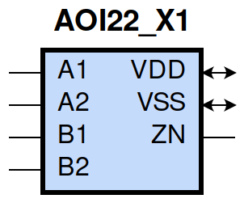
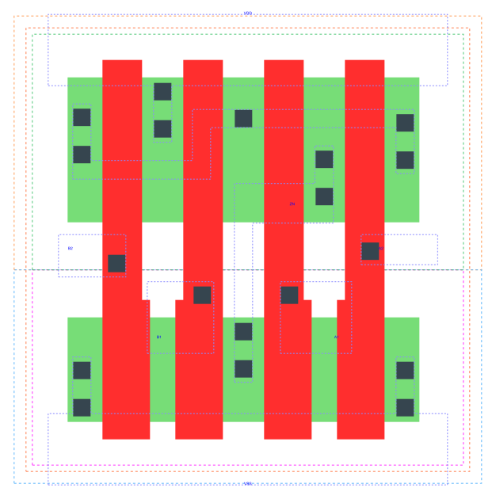

====================================
gf180mcu_fd_sc_mcu9t5v0__aoi22_x1
====================================

**gf180mcu_fd_sc_mcu9t5v0__aoi22_x1 symbol**

**gf180mcu_fd_sc_mcu9t5v0__aoi22_x1 schematic**

.. image:: sc9_sch/AOI22_X1_sch.png
    :height: 250px
    :width: 450 px
    :align: center
    :alt: gf180mcu_fd_sc_mcu9t5v0__aoi22_x1 schematic

**gf180mcu_fd_sc_mcu9t5v0__aoi22_x1 layout**

.. include:: images.rst
| AOI22_X1 is a two 2-input AND into 2-input NOR with 1X drive strength

|
| Attributes

============= ======================
**Attribute** **Value**
area          25.401600 µm\ :sup:`2`
============= ======================

|
| OUTPUT FUNCTIONS

============== =========================================================
**Output Pin** **Function**
ZN             (((!A1)&(!B1))|((!A1)&(!B2))|((!A2)&(!B1))|((!A2)&(!B2)))
============== =========================================================

|
| TRUTH TABLE FOR ZN

====== ====== ====== ====== ======
**A1** **A2** **B1** **B2** **ZN**
0      ?      0      ?      1
0      ?      ?      0      1
?      0      0      ?      1
?      0      ?      0      1
1      1      ?      ?      0
?      ?      1      1      0
====== ====== ====== ====== ======

|
| FUNCTIONAL SCHEMATIC

| |image92|

| PIN CAPACITANCE (pf)

======= ======== ====================
**Pin** **Type** **Capacitance (pf)**
B2      input    0.0067
B1      input    0.0069
A1      input    0.0070
A2      input    0.0068
======= ======== ====================

|
| DELAY AND OUTPUT TRANSITION TIME corresponding to min slew and load

+---------------+------------+--------------------+--------------+-------------------+----------------+---------------+
| **Input Pin** | **Output** | **When Condition** | **Tin (ns)** | **Out Load (pf)** | **Delay (ns)** | **Tout (ns)** |
+---------------+------------+--------------------+--------------+-------------------+----------------+---------------+
| B2(HL)        | ZN(LH)     | !A1&!A2&B1         | 0.0100       | 0.0010            | 0.1480         | 0.0942        |
+---------------+------------+--------------------+--------------+-------------------+----------------+---------------+
| B2(HL)        | ZN(LH)     | !A1&A2&B1          | 0.0100       | 0.0010            | 0.1781         | 0.1027        |
+---------------+------------+--------------------+--------------+-------------------+----------------+---------------+
| B2(HL)        | ZN(LH)     | A1&!A2&B1          | 0.0100       | 0.0010            | 0.2176         | 0.1321        |
+---------------+------------+--------------------+--------------+-------------------+----------------+---------------+
| B2(LH)        | ZN(HL)     | !A1&!A2&B1         | 0.0100       | 0.0010            | 0.1163         | 0.0655        |
+---------------+------------+--------------------+--------------+-------------------+----------------+---------------+
| B2(LH)        | ZN(HL)     | !A1&A2&B1          | 0.0100       | 0.0010            | 0.0937         | 0.0560        |
+---------------+------------+--------------------+--------------+-------------------+----------------+---------------+
| B2(LH)        | ZN(HL)     | A1&!A2&B1          | 0.0100       | 0.0010            | 0.1032         | 0.0765        |
+---------------+------------+--------------------+--------------+-------------------+----------------+---------------+
| B1(HL)        | ZN(LH)     | !A1&!A2&B2         | 0.0100       | 0.0010            | 0.1210         | 0.0720        |
+---------------+------------+--------------------+--------------+-------------------+----------------+---------------+
| B1(HL)        | ZN(LH)     | !A1&A2&B2          | 0.0100       | 0.0010            | 0.1425         | 0.0735        |
+---------------+------------+--------------------+--------------+-------------------+----------------+---------------+
| B1(HL)        | ZN(LH)     | A1&!A2&B2          | 0.0100       | 0.0010            | 0.1853         | 0.1024        |
+---------------+------------+--------------------+--------------+-------------------+----------------+---------------+
| B1(LH)        | ZN(HL)     | !A1&!A2&B2         | 0.0100       | 0.0010            | 0.1051         | 0.0653        |
+---------------+------------+--------------------+--------------+-------------------+----------------+---------------+
| B1(LH)        | ZN(HL)     | !A1&A2&B2          | 0.0100       | 0.0010            | 0.0823         | 0.0564        |
+---------------+------------+--------------------+--------------+-------------------+----------------+---------------+
| B1(LH)        | ZN(HL)     | A1&!A2&B2          | 0.0100       | 0.0010            | 0.0919         | 0.0768        |
+---------------+------------+--------------------+--------------+-------------------+----------------+---------------+
| A1(HL)        | ZN(LH)     | A2&!B1&!B2         | 0.0100       | 0.0010            | 0.0723         | 0.0500        |
+---------------+------------+--------------------+--------------+-------------------+----------------+---------------+
| A1(HL)        | ZN(LH)     | A2&!B1&B2          | 0.0100       | 0.0010            | 0.0861         | 0.0683        |
+---------------+------------+--------------------+--------------+-------------------+----------------+---------------+
| A1(HL)        | ZN(LH)     | A2&B1&!B2          | 0.0100       | 0.0010            | 0.1265         | 0.1001        |
+---------------+------------+--------------------+--------------+-------------------+----------------+---------------+
| A1(LH)        | ZN(HL)     | A2&!B1&!B2         | 0.0100       | 0.0010            | 0.0540         | 0.0300        |
+---------------+------------+--------------------+--------------+-------------------+----------------+---------------+
| A1(LH)        | ZN(HL)     | A2&!B1&B2          | 0.0100       | 0.0010            | 0.0541         | 0.0300        |
+---------------+------------+--------------------+--------------+-------------------+----------------+---------------+
| A1(LH)        | ZN(HL)     | A2&B1&!B2          | 0.0100       | 0.0010            | 0.0587         | 0.0459        |
+---------------+------------+--------------------+--------------+-------------------+----------------+---------------+
| A2(HL)        | ZN(LH)     | A1&!B1&!B2         | 0.0100       | 0.0010            | 0.0973         | 0.0728        |
+---------------+------------+--------------------+--------------+-------------------+----------------+---------------+
| A2(HL)        | ZN(LH)     | A1&!B1&B2          | 0.0100       | 0.0010            | 0.1189         | 0.0998        |
+---------------+------------+--------------------+--------------+-------------------+----------------+---------------+
| A2(HL)        | ZN(LH)     | A1&B1&!B2          | 0.0100       | 0.0010            | 0.1582         | 0.1306        |
+---------------+------------+--------------------+--------------+-------------------+----------------+---------------+
| A2(LH)        | ZN(HL)     | A1&!B1&!B2         | 0.0100       | 0.0010            | 0.0652         | 0.0299        |
+---------------+------------+--------------------+--------------+-------------------+----------------+---------------+
| A2(LH)        | ZN(HL)     | A1&!B1&B2          | 0.0100       | 0.0010            | 0.0655         | 0.0299        |
+---------------+------------+--------------------+--------------+-------------------+----------------+---------------+
| A2(LH)        | ZN(HL)     | A1&B1&!B2          | 0.0100       | 0.0010            | 0.0701         | 0.0459        |
+---------------+------------+--------------------+--------------+-------------------+----------------+---------------+

|
| DYNAMIC ENERGY

+---------------+--------------------+--------------+------------+-------------------+---------------------+
| **Input Pin** | **When Condition** | **Tin (ns)** | **Output** | **Out Load (pf)** | **Energy (uW/MHz)** |
+---------------+--------------------+--------------+------------+-------------------+---------------------+
| A1            | A2&!B1&!B2         | 0.0100       | ZN(LH)     | 0.0010            | 0.1674              |
+---------------+--------------------+--------------+------------+-------------------+---------------------+
| A1            | A2&!B1&B2          | 0.0100       | ZN(LH)     | 0.0010            | 0.1672              |
+---------------+--------------------+--------------+------------+-------------------+---------------------+
| A1            | A2&B1&!B2          | 0.0100       | ZN(LH)     | 0.0010            | 0.2351              |
+---------------+--------------------+--------------+------------+-------------------+---------------------+
| B2            | !A1&!A2&B1         | 0.0100       | ZN(LH)     | 0.0010            | 0.3397              |
+---------------+--------------------+--------------+------------+-------------------+---------------------+
| B2            | !A1&A2&B1          | 0.0100       | ZN(LH)     | 0.0010            | 0.3065              |
+---------------+--------------------+--------------+------------+-------------------+---------------------+
| B2            | A1&!A2&B1          | 0.0100       | ZN(LH)     | 0.0010            | 0.3714              |
+---------------+--------------------+--------------+------------+-------------------+---------------------+
| B1            | !A1&!A2&B2         | 0.0100       | ZN(LH)     | 0.0010            | 0.2794              |
+---------------+--------------------+--------------+------------+-------------------+---------------------+
| B1            | !A1&A2&B2          | 0.0100       | ZN(LH)     | 0.0010            | 0.2459              |
+---------------+--------------------+--------------+------------+-------------------+---------------------+
| B1            | A1&!A2&B2          | 0.0100       | ZN(LH)     | 0.0010            | 0.3146              |
+---------------+--------------------+--------------+------------+-------------------+---------------------+
| A2            | A1&!B1&!B2         | 0.0100       | ZN(LH)     | 0.0010            | 0.2260              |
+---------------+--------------------+--------------+------------+-------------------+---------------------+
| A2            | A1&!B1&B2          | 0.0100       | ZN(LH)     | 0.0010            | 0.2261              |
+---------------+--------------------+--------------+------------+-------------------+---------------------+
| A2            | A1&B1&!B2          | 0.0100       | ZN(LH)     | 0.0010            | 0.2913              |
+---------------+--------------------+--------------+------------+-------------------+---------------------+
| B1            | !A1&!A2&B2         | 0.0100       | ZN(HL)     | 0.0010            | 0.0916              |
+---------------+--------------------+--------------+------------+-------------------+---------------------+
| B1            | !A1&A2&B2          | 0.0100       | ZN(HL)     | 0.0010            | 0.0817              |
+---------------+--------------------+--------------+------------+-------------------+---------------------+
| B1            | A1&!A2&B2          | 0.0100       | ZN(HL)     | 0.0010            | 0.0818              |
+---------------+--------------------+--------------+------------+-------------------+---------------------+
| A1            | A2&!B1&!B2         | 0.0100       | ZN(HL)     | 0.0010            | 0.0025              |
+---------------+--------------------+--------------+------------+-------------------+---------------------+
| A1            | A2&!B1&B2          | 0.0100       | ZN(HL)     | 0.0010            | 0.0030              |
+---------------+--------------------+--------------+------------+-------------------+---------------------+
| A1            | A2&B1&!B2          | 0.0100       | ZN(HL)     | 0.0010            | 0.0030              |
+---------------+--------------------+--------------+------------+-------------------+---------------------+
| B2            | !A1&!A2&B1         | 0.0100       | ZN(HL)     | 0.0010            | 0.0916              |
+---------------+--------------------+--------------+------------+-------------------+---------------------+
| B2            | !A1&A2&B1          | 0.0100       | ZN(HL)     | 0.0010            | 0.0817              |
+---------------+--------------------+--------------+------------+-------------------+---------------------+
| B2            | A1&!A2&B1          | 0.0100       | ZN(HL)     | 0.0010            | 0.0818              |
+---------------+--------------------+--------------+------------+-------------------+---------------------+
| A2            | A1&!B1&!B2         | 0.0100       | ZN(HL)     | 0.0010            | 0.0024              |
+---------------+--------------------+--------------+------------+-------------------+---------------------+
| A2            | A1&!B1&B2          | 0.0100       | ZN(HL)     | 0.0010            | 0.0029              |
+---------------+--------------------+--------------+------------+-------------------+---------------------+
| A2            | A1&B1&!B2          | 0.0100       | ZN(HL)     | 0.0010            | 0.0030              |
+---------------+--------------------+--------------+------------+-------------------+---------------------+
| A1(LH)        | !A2&!B1&!B2        | 0.0100       | n/a        | n/a               | -0.0451             |
+---------------+--------------------+--------------+------------+-------------------+---------------------+
| A1(LH)        | !A2&!B1&B2         | 0.0100       | n/a        | n/a               | -0.0452             |
+---------------+--------------------+--------------+------------+-------------------+---------------------+
| A1(LH)        | !A2&B1&!B2         | 0.0100       | n/a        | n/a               | -0.0452             |
+---------------+--------------------+--------------+------------+-------------------+---------------------+
| A1(LH)        | !A2&B1&B2          | 0.0100       | n/a        | n/a               | -0.0153             |
+---------------+--------------------+--------------+------------+-------------------+---------------------+
| A1(LH)        | A2&B1&B2           | 0.0100       | n/a        | n/a               | -0.0160             |
+---------------+--------------------+--------------+------------+-------------------+---------------------+
| B2(LH)        | !A1&!A2&!B1        | 0.0100       | n/a        | n/a               | -0.0596             |
+---------------+--------------------+--------------+------------+-------------------+---------------------+
| B2(LH)        | !A1&A2&!B1         | 0.0100       | n/a        | n/a               | -0.0595             |
+---------------+--------------------+--------------+------------+-------------------+---------------------+
| B2(LH)        | A1&!A2&!B1         | 0.0100       | n/a        | n/a               | -0.0595             |
+---------------+--------------------+--------------+------------+-------------------+---------------------+
| B2(LH)        | A1&A2&!B1          | 0.0100       | n/a        | n/a               | -0.0593             |
+---------------+--------------------+--------------+------------+-------------------+---------------------+
| B2(LH)        | A1&A2&B1           | 0.0100       | n/a        | n/a               | -0.0486             |
+---------------+--------------------+--------------+------------+-------------------+---------------------+
| A2(HL)        | !A1&!B1&!B2        | 0.0100       | n/a        | n/a               | 0.0666              |
+---------------+--------------------+--------------+------------+-------------------+---------------------+
| A2(HL)        | !A1&!B1&B2         | 0.0100       | n/a        | n/a               | 0.0665              |
+---------------+--------------------+--------------+------------+-------------------+---------------------+
| A2(HL)        | !A1&B1&!B2         | 0.0100       | n/a        | n/a               | 0.0665              |
+---------------+--------------------+--------------+------------+-------------------+---------------------+
| A2(HL)        | !A1&B1&B2          | 0.0100       | n/a        | n/a               | 0.0158              |
+---------------+--------------------+--------------+------------+-------------------+---------------------+
| A2(HL)        | A1&B1&B2           | 0.0100       | n/a        | n/a               | 0.0821              |
+---------------+--------------------+--------------+------------+-------------------+---------------------+
| B1(HL)        | !A1&!A2&!B2        | 0.0100       | n/a        | n/a               | 0.0670              |
+---------------+--------------------+--------------+------------+-------------------+---------------------+
| B1(HL)        | !A1&A2&!B2         | 0.0100       | n/a        | n/a               | 0.0670              |
+---------------+--------------------+--------------+------------+-------------------+---------------------+
| B1(HL)        | A1&!A2&!B2         | 0.0100       | n/a        | n/a               | 0.0670              |
+---------------+--------------------+--------------+------------+-------------------+---------------------+
| B1(HL)        | A1&A2&!B2          | 0.0100       | n/a        | n/a               | 0.0597              |
+---------------+--------------------+--------------+------------+-------------------+---------------------+
| B1(HL)        | A1&A2&B2           | 0.0100       | n/a        | n/a               | 0.0597              |
+---------------+--------------------+--------------+------------+-------------------+---------------------+
| B2(HL)        | !A1&!A2&!B1        | 0.0100       | n/a        | n/a               | 0.0664              |
+---------------+--------------------+--------------+------------+-------------------+---------------------+
| B2(HL)        | !A1&A2&!B1         | 0.0100       | n/a        | n/a               | 0.0665              |
+---------------+--------------------+--------------+------------+-------------------+---------------------+
| B2(HL)        | A1&!A2&!B1         | 0.0100       | n/a        | n/a               | 0.0665              |
+---------------+--------------------+--------------+------------+-------------------+---------------------+
| B2(HL)        | A1&A2&!B1          | 0.0100       | n/a        | n/a               | 0.0597              |
+---------------+--------------------+--------------+------------+-------------------+---------------------+
| B2(HL)        | A1&A2&B1           | 0.0100       | n/a        | n/a               | 0.0597              |
+---------------+--------------------+--------------+------------+-------------------+---------------------+
| A1(HL)        | !A2&!B1&!B2        | 0.0100       | n/a        | n/a               | 0.0674              |
+---------------+--------------------+--------------+------------+-------------------+---------------------+
| A1(HL)        | !A2&!B1&B2         | 0.0100       | n/a        | n/a               | 0.0672              |
+---------------+--------------------+--------------+------------+-------------------+---------------------+
| A1(HL)        | !A2&B1&!B2         | 0.0100       | n/a        | n/a               | 0.0672              |
+---------------+--------------------+--------------+------------+-------------------+---------------------+
| A1(HL)        | !A2&B1&B2          | 0.0100       | n/a        | n/a               | 0.0158              |
+---------------+--------------------+--------------+------------+-------------------+---------------------+
| A1(HL)        | A2&B1&B2           | 0.0100       | n/a        | n/a               | 0.0821              |
+---------------+--------------------+--------------+------------+-------------------+---------------------+
| B1(LH)        | !A1&!A2&!B2        | 0.0100       | n/a        | n/a               | -0.0444             |
+---------------+--------------------+--------------+------------+-------------------+---------------------+
| B1(LH)        | !A1&A2&!B2         | 0.0100       | n/a        | n/a               | -0.0444             |
+---------------+--------------------+--------------+------------+-------------------+---------------------+
| B1(LH)        | A1&!A2&!B2         | 0.0100       | n/a        | n/a               | -0.0444             |
+---------------+--------------------+--------------+------------+-------------------+---------------------+
| B1(LH)        | A1&A2&!B2          | 0.0100       | n/a        | n/a               | -0.0593             |
+---------------+--------------------+--------------+------------+-------------------+---------------------+
| B1(LH)        | A1&A2&B2           | 0.0100       | n/a        | n/a               | -0.0487             |
+---------------+--------------------+--------------+------------+-------------------+---------------------+
| A2(LH)        | !A1&!B1&!B2        | 0.0100       | n/a        | n/a               | -0.0601             |
+---------------+--------------------+--------------+------------+-------------------+---------------------+
| A2(LH)        | !A1&!B1&B2         | 0.0100       | n/a        | n/a               | -0.0600             |
+---------------+--------------------+--------------+------------+-------------------+---------------------+
| A2(LH)        | !A1&B1&!B2         | 0.0100       | n/a        | n/a               | -0.0600             |
+---------------+--------------------+--------------+------------+-------------------+---------------------+
| A2(LH)        | !A1&B1&B2          | 0.0100       | n/a        | n/a               | -0.0153             |
+---------------+--------------------+--------------+------------+-------------------+---------------------+
| A2(LH)        | A1&B1&B2           | 0.0100       | n/a        | n/a               | -0.0160             |
+---------------+--------------------+--------------+------------+-------------------+---------------------+

|
| LEAKAGE POWER

================== ==============
**When Condition** **Power (nW)**
!A1&!A2&!B1&!B2    0.1005
!A1&!A2&!B1&B2     0.1008
!A1&!A2&B1&!B2     0.1406
!A1&A2&!B1&!B2     0.1008
!A1&A2&!B1&B2      0.1012
!A1&A2&B1&!B2      0.1409
A1&!A2&!B1&!B2     0.1406
A1&!A2&!B1&B2      0.1409
A1&!A2&B1&!B2      0.1807
!A1&!A2&B1&B2      0.1746
!A1&A2&B1&B2       0.1774
A1&!A2&B1&B2       0.1774
A1&A2&!B1&!B2      0.1037
A1&A2&!B1&B2       0.1037
A1&A2&B1&!B2       0.1037
A1&A2&B1&B2        0.1037
================== ==============

