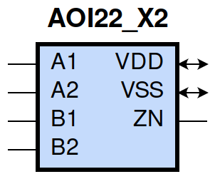
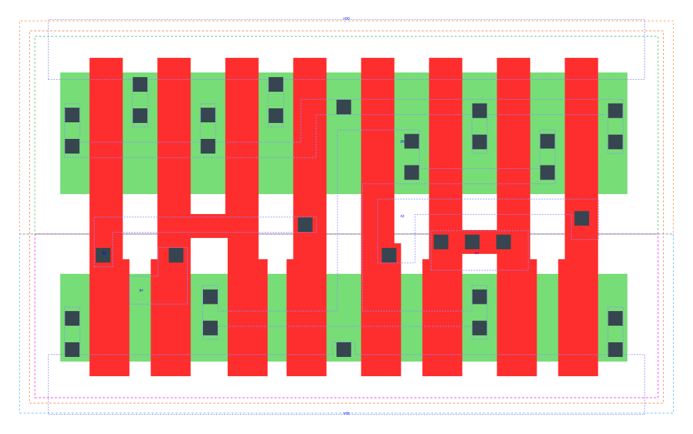

====================================
gf180mcu_fd_sc_mcu9t5v0__aoi22_x2
====================================

**gf180mcu_fd_sc_mcu9t5v0__aoi22_x2 symbol**

**gf180mcu_fd_sc_mcu9t5v0__aoi22_x2 schematic**

**gf180mcu_fd_sc_mcu9t5v0__aoi22_x2 layout**

.. include:: images.rst
| AOI22_X2 is a two 2-input AND into 2-input NOR with 2X drive strength

|
| Attributes

============= ======================
**Attribute** **Value**
area          45.158400 µm\ :sup:`2`
============= ======================

|
| OUTPUT FUNCTIONS

============== =========================================================
**Output Pin** **Function**
ZN             (((!A1)&(!B1))|((!A1)&(!B2))|((!A2)&(!B1))|((!A2)&(!B2)))
============== =========================================================

|
| TRUTH TABLE FOR ZN

====== ====== ====== ====== ======
**A1** **A2** **B1** **B2** **ZN**
0      ?      0      ?      1
0      ?      ?      0      1
?      0      0      ?      1
?      0      ?      0      1
1      1      ?      ?      0
?      ?      1      1      0
====== ====== ====== ====== ======

|
| FUNCTIONAL SCHEMATIC

| |image95|

| PIN CAPACITANCE (pf)

======= ======== ====================
**Pin** **Type** **Capacitance (pf)**
B2      input    0.0135
B1      input    0.0133
A2      input    0.0144
A1      input    0.0139
======= ======== ====================

|
| DELAY AND OUTPUT TRANSITION TIME corresponding to min slew and load

+---------------+------------+--------------------+--------------+-------------------+----------------+---------------+
| **Input Pin** | **Output** | **When Condition** | **Tin (ns)** | **Out Load (pf)** | **Delay (ns)** | **Tout (ns)** |
+---------------+------------+--------------------+--------------+-------------------+----------------+---------------+
| B2(HL)        | ZN(LH)     | !A1&!A2&B1         | 0.0100       | 0.0010            | 0.1448         | 0.0930        |
+---------------+------------+--------------------+--------------+-------------------+----------------+---------------+
| B2(HL)        | ZN(LH)     | !A1&A2&B1          | 0.0100       | 0.0010            | 0.1740         | 0.1016        |
+---------------+------------+--------------------+--------------+-------------------+----------------+---------------+
| B2(HL)        | ZN(LH)     | A1&!A2&B1          | 0.0100       | 0.0010            | 0.2136         | 0.1310        |
+---------------+------------+--------------------+--------------+-------------------+----------------+---------------+
| B2(LH)        | ZN(HL)     | !A1&!A2&B1         | 0.0100       | 0.0010            | 0.1141         | 0.0636        |
+---------------+------------+--------------------+--------------+-------------------+----------------+---------------+
| B2(LH)        | ZN(HL)     | !A1&A2&B1          | 0.0100       | 0.0010            | 0.0925         | 0.0544        |
+---------------+------------+--------------------+--------------+-------------------+----------------+---------------+
| B2(LH)        | ZN(HL)     | A1&!A2&B1          | 0.0100       | 0.0010            | 0.1017         | 0.0747        |
+---------------+------------+--------------------+--------------+-------------------+----------------+---------------+
| B1(HL)        | ZN(LH)     | !A1&!A2&B2         | 0.0100       | 0.0010            | 0.1183         | 0.0709        |
+---------------+------------+--------------------+--------------+-------------------+----------------+---------------+
| B1(HL)        | ZN(LH)     | !A1&A2&B2          | 0.0100       | 0.0010            | 0.1392         | 0.0726        |
+---------------+------------+--------------------+--------------+-------------------+----------------+---------------+
| B1(HL)        | ZN(LH)     | A1&!A2&B2          | 0.0100       | 0.0010            | 0.1816         | 0.1016        |
+---------------+------------+--------------------+--------------+-------------------+----------------+---------------+
| B1(LH)        | ZN(HL)     | !A1&!A2&B2         | 0.0100       | 0.0010            | 0.1030         | 0.0637        |
+---------------+------------+--------------------+--------------+-------------------+----------------+---------------+
| B1(LH)        | ZN(HL)     | !A1&A2&B2          | 0.0100       | 0.0010            | 0.0813         | 0.0550        |
+---------------+------------+--------------------+--------------+-------------------+----------------+---------------+
| B1(LH)        | ZN(HL)     | A1&!A2&B2          | 0.0100       | 0.0010            | 0.0905         | 0.0750        |
+---------------+------------+--------------------+--------------+-------------------+----------------+---------------+
| A2(HL)        | ZN(LH)     | A1&!B1&!B2         | 0.0100       | 0.0010            | 0.0974         | 0.0727        |
+---------------+------------+--------------------+--------------+-------------------+----------------+---------------+
| A2(HL)        | ZN(LH)     | A1&!B1&B2          | 0.0100       | 0.0010            | 0.1200         | 0.0997        |
+---------------+------------+--------------------+--------------+-------------------+----------------+---------------+
| A2(HL)        | ZN(LH)     | A1&B1&!B2          | 0.0100       | 0.0010            | 0.1590         | 0.1300        |
+---------------+------------+--------------------+--------------+-------------------+----------------+---------------+
| A2(LH)        | ZN(HL)     | A1&!B1&!B2         | 0.0100       | 0.0010            | 0.0652         | 0.0298        |
+---------------+------------+--------------------+--------------+-------------------+----------------+---------------+
| A2(LH)        | ZN(HL)     | A1&!B1&B2          | 0.0100       | 0.0010            | 0.0654         | 0.0298        |
+---------------+------------+--------------------+--------------+-------------------+----------------+---------------+
| A2(LH)        | ZN(HL)     | A1&B1&!B2          | 0.0100       | 0.0010            | 0.0699         | 0.0457        |
+---------------+------------+--------------------+--------------+-------------------+----------------+---------------+
| A1(HL)        | ZN(LH)     | A2&!B1&!B2         | 0.0100       | 0.0010            | 0.0725         | 0.0499        |
+---------------+------------+--------------------+--------------+-------------------+----------------+---------------+
| A1(HL)        | ZN(LH)     | A2&!B1&B2          | 0.0100       | 0.0010            | 0.0869         | 0.0687        |
+---------------+------------+--------------------+--------------+-------------------+----------------+---------------+
| A1(HL)        | ZN(LH)     | A2&B1&!B2          | 0.0100       | 0.0010            | 0.1271         | 0.0996        |
+---------------+------------+--------------------+--------------+-------------------+----------------+---------------+
| A1(LH)        | ZN(HL)     | A2&!B1&!B2         | 0.0100       | 0.0010            | 0.0538         | 0.0298        |
+---------------+------------+--------------------+--------------+-------------------+----------------+---------------+
| A1(LH)        | ZN(HL)     | A2&!B1&B2          | 0.0100       | 0.0010            | 0.0542         | 0.0298        |
+---------------+------------+--------------------+--------------+-------------------+----------------+---------------+
| A1(LH)        | ZN(HL)     | A2&B1&!B2          | 0.0100       | 0.0010            | 0.0586         | 0.0457        |
+---------------+------------+--------------------+--------------+-------------------+----------------+---------------+

|
| DYNAMIC ENERGY

+---------------+--------------------+--------------+------------+-------------------+---------------------+
| **Input Pin** | **When Condition** | **Tin (ns)** | **Output** | **Out Load (pf)** | **Energy (uW/MHz)** |
+---------------+--------------------+--------------+------------+-------------------+---------------------+
| A1            | A2&!B1&!B2         | 0.0100       | ZN(LH)     | 0.0010            | 0.3584              |
+---------------+--------------------+--------------+------------+-------------------+---------------------+
| A1            | A2&!B1&B2          | 0.0100       | ZN(LH)     | 0.0010            | 0.3579              |
+---------------+--------------------+--------------+------------+-------------------+---------------------+
| A1            | A2&B1&!B2          | 0.0100       | ZN(LH)     | 0.0010            | 0.4923              |
+---------------+--------------------+--------------+------------+-------------------+---------------------+
| B2            | !A1&!A2&B1         | 0.0100       | ZN(LH)     | 0.0010            | 0.6983              |
+---------------+--------------------+--------------+------------+-------------------+---------------------+
| B2            | !A1&A2&B1          | 0.0100       | ZN(LH)     | 0.0010            | 0.6316              |
+---------------+--------------------+--------------+------------+-------------------+---------------------+
| B2            | A1&!A2&B1          | 0.0100       | ZN(LH)     | 0.0010            | 0.7617              |
+---------------+--------------------+--------------+------------+-------------------+---------------------+
| B1            | !A1&!A2&B2         | 0.0100       | ZN(LH)     | 0.0010            | 0.5787              |
+---------------+--------------------+--------------+------------+-------------------+---------------------+
| B1            | !A1&A2&B2          | 0.0100       | ZN(LH)     | 0.0010            | 0.5119              |
+---------------+--------------------+--------------+------------+-------------------+---------------------+
| B1            | A1&!A2&B2          | 0.0100       | ZN(LH)     | 0.0010            | 0.6494              |
+---------------+--------------------+--------------+------------+-------------------+---------------------+
| A2            | A1&!B1&!B2         | 0.0100       | ZN(LH)     | 0.0010            | 0.4757              |
+---------------+--------------------+--------------+------------+-------------------+---------------------+
| A2            | A1&!B1&B2          | 0.0100       | ZN(LH)     | 0.0010            | 0.4759              |
+---------------+--------------------+--------------+------------+-------------------+---------------------+
| A2            | A1&B1&!B2          | 0.0100       | ZN(LH)     | 0.0010            | 0.6052              |
+---------------+--------------------+--------------+------------+-------------------+---------------------+
| B1            | !A1&!A2&B2         | 0.0100       | ZN(HL)     | 0.0010            | 0.1655              |
+---------------+--------------------+--------------+------------+-------------------+---------------------+
| B1            | !A1&A2&B2          | 0.0100       | ZN(HL)     | 0.0010            | 0.1458              |
+---------------+--------------------+--------------+------------+-------------------+---------------------+
| B1            | A1&!A2&B2          | 0.0100       | ZN(HL)     | 0.0010            | 0.1460              |
+---------------+--------------------+--------------+------------+-------------------+---------------------+
| A1            | A2&!B1&!B2         | 0.0100       | ZN(HL)     | 0.0010            | 0.0050              |
+---------------+--------------------+--------------+------------+-------------------+---------------------+
| A1            | A2&!B1&B2          | 0.0100       | ZN(HL)     | 0.0010            | 0.0062              |
+---------------+--------------------+--------------+------------+-------------------+---------------------+
| A1            | A2&B1&!B2          | 0.0100       | ZN(HL)     | 0.0010            | 0.0063              |
+---------------+--------------------+--------------+------------+-------------------+---------------------+
| B2            | !A1&!A2&B1         | 0.0100       | ZN(HL)     | 0.0010            | 0.1655              |
+---------------+--------------------+--------------+------------+-------------------+---------------------+
| B2            | !A1&A2&B1          | 0.0100       | ZN(HL)     | 0.0010            | 0.1460              |
+---------------+--------------------+--------------+------------+-------------------+---------------------+
| B2            | A1&!A2&B1          | 0.0100       | ZN(HL)     | 0.0010            | 0.1460              |
+---------------+--------------------+--------------+------------+-------------------+---------------------+
| A2            | A1&!B1&!B2         | 0.0100       | ZN(HL)     | 0.0010            | 0.0048              |
+---------------+--------------------+--------------+------------+-------------------+---------------------+
| A2            | A1&!B1&B2          | 0.0100       | ZN(HL)     | 0.0010            | 0.0059              |
+---------------+--------------------+--------------+------------+-------------------+---------------------+
| A2            | A1&B1&!B2          | 0.0100       | ZN(HL)     | 0.0010            | 0.0062              |
+---------------+--------------------+--------------+------------+-------------------+---------------------+
| A1(LH)        | !A2&!B1&!B2        | 0.0100       | n/a        | n/a               | -0.0901             |
+---------------+--------------------+--------------+------------+-------------------+---------------------+
| A1(LH)        | !A2&!B1&B2         | 0.0100       | n/a        | n/a               | -0.0901             |
+---------------+--------------------+--------------+------------+-------------------+---------------------+
| A1(LH)        | !A2&B1&!B2         | 0.0100       | n/a        | n/a               | -0.0901             |
+---------------+--------------------+--------------+------------+-------------------+---------------------+
| A1(LH)        | !A2&B1&B2          | 0.0100       | n/a        | n/a               | -0.0296             |
+---------------+--------------------+--------------+------------+-------------------+---------------------+
| A1(LH)        | A2&B1&B2           | 0.0100       | n/a        | n/a               | -0.0317             |
+---------------+--------------------+--------------+------------+-------------------+---------------------+
| B2(LH)        | !A1&!A2&!B1        | 0.0100       | n/a        | n/a               | -0.1191             |
+---------------+--------------------+--------------+------------+-------------------+---------------------+
| B2(LH)        | !A1&A2&!B1         | 0.0100       | n/a        | n/a               | -0.1190             |
+---------------+--------------------+--------------+------------+-------------------+---------------------+
| B2(LH)        | A1&!A2&!B1         | 0.0100       | n/a        | n/a               | -0.1190             |
+---------------+--------------------+--------------+------------+-------------------+---------------------+
| B2(LH)        | A1&A2&!B1          | 0.0100       | n/a        | n/a               | -0.1187             |
+---------------+--------------------+--------------+------------+-------------------+---------------------+
| B2(LH)        | A1&A2&B1           | 0.0100       | n/a        | n/a               | -0.0959             |
+---------------+--------------------+--------------+------------+-------------------+---------------------+
| A2(HL)        | !A1&!B1&!B2        | 0.0100       | n/a        | n/a               | 0.1333              |
+---------------+--------------------+--------------+------------+-------------------+---------------------+
| A2(HL)        | !A1&!B1&B2         | 0.0100       | n/a        | n/a               | 0.1329              |
+---------------+--------------------+--------------+------------+-------------------+---------------------+
| A2(HL)        | !A1&B1&!B2         | 0.0100       | n/a        | n/a               | 0.1329              |
+---------------+--------------------+--------------+------------+-------------------+---------------------+
| A2(HL)        | !A1&B1&B2          | 0.0100       | n/a        | n/a               | 0.0313              |
+---------------+--------------------+--------------+------------+-------------------+---------------------+
| A2(HL)        | A1&B1&B2           | 0.0100       | n/a        | n/a               | 0.1477              |
+---------------+--------------------+--------------+------------+-------------------+---------------------+
| B1(HL)        | !A1&!A2&!B2        | 0.0100       | n/a        | n/a               | 0.1340              |
+---------------+--------------------+--------------+------------+-------------------+---------------------+
| B1(HL)        | !A1&A2&!B2         | 0.0100       | n/a        | n/a               | 0.1340              |
+---------------+--------------------+--------------+------------+-------------------+---------------------+
| B1(HL)        | A1&!A2&!B2         | 0.0100       | n/a        | n/a               | 0.1340              |
+---------------+--------------------+--------------+------------+-------------------+---------------------+
| B1(HL)        | A1&A2&!B2          | 0.0100       | n/a        | n/a               | 0.1194              |
+---------------+--------------------+--------------+------------+-------------------+---------------------+
| B1(HL)        | A1&A2&B2           | 0.0100       | n/a        | n/a               | 0.1190              |
+---------------+--------------------+--------------+------------+-------------------+---------------------+
| B2(HL)        | !A1&!A2&!B1        | 0.0100       | n/a        | n/a               | 0.1327              |
+---------------+--------------------+--------------+------------+-------------------+---------------------+
| B2(HL)        | !A1&A2&!B1         | 0.0100       | n/a        | n/a               | 0.1328              |
+---------------+--------------------+--------------+------------+-------------------+---------------------+
| B2(HL)        | A1&!A2&!B1         | 0.0100       | n/a        | n/a               | 0.1327              |
+---------------+--------------------+--------------+------------+-------------------+---------------------+
| B2(HL)        | A1&A2&!B1          | 0.0100       | n/a        | n/a               | 0.1194              |
+---------------+--------------------+--------------+------------+-------------------+---------------------+
| B2(HL)        | A1&A2&B1           | 0.0100       | n/a        | n/a               | 0.1187              |
+---------------+--------------------+--------------+------------+-------------------+---------------------+
| A1(HL)        | !A2&!B1&!B2        | 0.0100       | n/a        | n/a               | 0.1347              |
+---------------+--------------------+--------------+------------+-------------------+---------------------+
| A1(HL)        | !A2&!B1&B2         | 0.0100       | n/a        | n/a               | 0.1344              |
+---------------+--------------------+--------------+------------+-------------------+---------------------+
| A1(HL)        | !A2&B1&!B2         | 0.0100       | n/a        | n/a               | 0.1344              |
+---------------+--------------------+--------------+------------+-------------------+---------------------+
| A1(HL)        | !A2&B1&B2          | 0.0100       | n/a        | n/a               | 0.0312              |
+---------------+--------------------+--------------+------------+-------------------+---------------------+
| A1(HL)        | A2&B1&B2           | 0.0100       | n/a        | n/a               | 0.1476              |
+---------------+--------------------+--------------+------------+-------------------+---------------------+
| B1(LH)        | !A1&!A2&!B2        | 0.0100       | n/a        | n/a               | -0.0901             |
+---------------+--------------------+--------------+------------+-------------------+---------------------+
| B1(LH)        | !A1&A2&!B2         | 0.0100       | n/a        | n/a               | -0.0900             |
+---------------+--------------------+--------------+------------+-------------------+---------------------+
| B1(LH)        | A1&!A2&!B2         | 0.0100       | n/a        | n/a               | -0.0900             |
+---------------+--------------------+--------------+------------+-------------------+---------------------+
| B1(LH)        | A1&A2&!B2          | 0.0100       | n/a        | n/a               | -0.1188             |
+---------------+--------------------+--------------+------------+-------------------+---------------------+
| B1(LH)        | A1&A2&B2           | 0.0100       | n/a        | n/a               | -0.0961             |
+---------------+--------------------+--------------+------------+-------------------+---------------------+
| A2(LH)        | !A1&!B1&!B2        | 0.0100       | n/a        | n/a               | -0.1201             |
+---------------+--------------------+--------------+------------+-------------------+---------------------+
| A2(LH)        | !A1&!B1&B2         | 0.0100       | n/a        | n/a               | -0.1199             |
+---------------+--------------------+--------------+------------+-------------------+---------------------+
| A2(LH)        | !A1&B1&!B2         | 0.0100       | n/a        | n/a               | -0.1199             |
+---------------+--------------------+--------------+------------+-------------------+---------------------+
| A2(LH)        | !A1&B1&B2          | 0.0100       | n/a        | n/a               | -0.0296             |
+---------------+--------------------+--------------+------------+-------------------+---------------------+
| A2(LH)        | A1&B1&B2           | 0.0100       | n/a        | n/a               | -0.0316             |
+---------------+--------------------+--------------+------------+-------------------+---------------------+

|
| LEAKAGE POWER

================== ==============
**When Condition** **Power (nW)**
!A1&!A2&!B1&!B2    0.1510
!A1&!A2&!B1&B2     0.1517
!A1&!A2&B1&!B2     0.2312
!A1&A2&!B1&!B2     0.1517
!A1&A2&!B1&B2      0.1523
!A1&A2&B1&!B2      0.2319
A1&!A2&!B1&!B2     0.2312
A1&!A2&!B1&B2      0.2319
A1&!A2&B1&!B2      0.3114
!A1&!A2&B1&B2      0.2993
!A1&A2&B1&B2       0.3049
A1&!A2&B1&B2       0.3049
A1&A2&!B1&!B2      0.1574
A1&A2&!B1&B2       0.1574
A1&A2&B1&!B2       0.1574
A1&A2&B1&B2        0.1573
================== ==============

