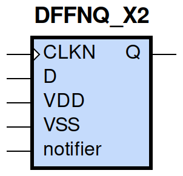

====================================
gf180mcu_fd_sc_mcu9t5v0__dffnq_x2
====================================

**gf180mcu_fd_sc_mcu9t5v0__dffnq_x2 symbol**

**gf180mcu_fd_sc_mcu9t5v0__dffnq_x2 schematic**

.. image:: sc9_sch/DFFNQ_X2_sch.png
    :height: 250px
    :width: 450 px
    :align: center
    :alt: gf180mcu_fd_sc_mcu9t5v0__dffnq_x2 schematic

**gf180mcu_fd_sc_mcu9t5v0__dffnq_x2 layout**

.. image:: sc9_lay/DFFNQ_X2_lay.png
    :height: 300px
    :width: 500 px
    :align: center
    :alt: gf180mcu_fd_sc_mcu9t5v0__dffnq_x2 layout

.. include:: images.rst
| DFFNQ_X2 is a negative edge triggered D-type flip flop with 2X drive strength

|
| Attributes

============= ======================
**Attribute** **Value**
area          87.494400 µm\ :sup:`2`
============= ======================

|

TRUTH TABLE

===== ==== ======
Input      Output
D     CLKN Q
L     ↓    L
H     ↓    H
===== ==== ======

|
| FUNCTIONAL SCHEMATIC
| |image197|
| CONSTRAINTS

================== =============== ============= ============
**Constraint Pin** **Related Pin** **setup(ns)** **hold(ns)**
D(HL)              CLKN(HL)        0.2230        0.0230
D(LH)              CLKN(HL)        0.1550        0.1030
================== =============== ============= ============

|

================== =============== ===========================
**Constraint Pin** **Related Pin** **Minimum Pulse Width(ns)**
CLKN(LHL)          CLKN(LH)        0.3330
CLKN(LHL)          CLKN(LH)        0.3020
CLKN(HLH)          CLKN(HL)        0.3580
CLKN(HLH)          CLKN(HL)        0.3780
================== =============== ===========================

|
| PIN CAPACITANCE (pf)

======= ======== ====================
**Pin** **Type** **Capacitance (pf)**
CLKN    input    0.0051
D       input    0.0039
======= ======== ====================

|
| DELAY AND OUTPUT TRANSITION TIME corresponding to min slew and load

+---------------+------------+--------------------+--------------+-------------------+----------------+---------------+
| **Input Pin** | **Output** | **When Condition** | **Tin (ns)** | **Out Load (pf)** | **Delay (ns)** | **Tout (ns)** |
+---------------+------------+--------------------+--------------+-------------------+----------------+---------------+
| CLKN(HL)      | Q(LH)      | D                  | 0.0100       | 0.0010            | 0.5765         | 0.0305        |
+---------------+------------+--------------------+--------------+-------------------+----------------+---------------+
| CLKN(HL)      | Q(HL)      | !D                 | 0.0100       | 0.0010            | 0.5219         | 0.0313        |
+---------------+------------+--------------------+--------------+-------------------+----------------+---------------+

|
| DYNAMIC ENERGY

+---------------+--------------------+--------------+------------+-------------------+---------------------+
| **Input Pin** | **When Condition** | **Tin (ns)** | **Output** | **Out Load (pf)** | **Energy (uW/MHz)** |
+---------------+--------------------+--------------+------------+-------------------+---------------------+
| CLKN          | D                  | 0.0100       | Q(LH)      | 0.0010            | 1.2661              |
+---------------+--------------------+--------------+------------+-------------------+---------------------+
| CLKN          | !D                 | 0.0100       | Q(HL)      | 0.0010            | 1.1907              |
+---------------+--------------------+--------------+------------+-------------------+---------------------+
| D(LH)         | !CLKN              | 0.0100       | n/a        | n/a               | 0.0063              |
+---------------+--------------------+--------------+------------+-------------------+---------------------+
| D(LH)         | CLKN               | 0.0100       | n/a        | n/a               | 0.2128              |
+---------------+--------------------+--------------+------------+-------------------+---------------------+
| CLKN(LH)      | !D                 | 0.0100       | n/a        | n/a               | 0.2580              |
+---------------+--------------------+--------------+------------+-------------------+---------------------+
| CLKN(LH)      | D                  | 0.0100       | n/a        | n/a               | 0.2575              |
+---------------+--------------------+--------------+------------+-------------------+---------------------+
| CLKN(HL)      | !D                 | 0.0100       | n/a        | n/a               | 0.4070              |
+---------------+--------------------+--------------+------------+-------------------+---------------------+
| CLKN(HL)      | D                  | 0.0100       | n/a        | n/a               | 0.4077              |
+---------------+--------------------+--------------+------------+-------------------+---------------------+
| D(HL)         | !CLKN              | 0.0100       | n/a        | n/a               | 0.0895              |
+---------------+--------------------+--------------+------------+-------------------+---------------------+
| D(HL)         | CLKN               | 0.0100       | n/a        | n/a               | 0.3077              |
+---------------+--------------------+--------------+------------+-------------------+---------------------+

|
| LEAKAGE POWER

================== ==============
**When Condition** **Power (nW)**
!CLKN&!D           0.5192
CLKN&!D            0.4377
!CLKN&D            0.5453
CLKN&D             0.4339
================== ==============

