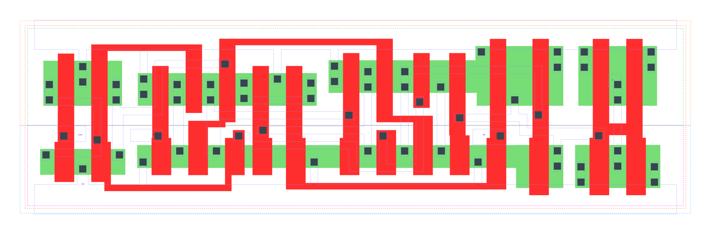

====================================
gf180mcu_fd_sc_mcu9t5v0__dffnrnq_x2
====================================

**gf180mcu_fd_sc_mcu9t5v0__dffnrnq_x2 symbol**

.. image:: sc9_sym/DFFNRNQ_X2_sym.png
    :height: 200px
    :width: 400 px
    :align: center
    :alt: gf180mcu_fd_sc_mcu9t5v0__dffnrnq_x2 symbol

**gf180mcu_fd_sc_mcu9t5v0__dffnrnq_x2 schematic**

.. image:: sc9_sch/DFFNRNQ_X2_sch.png
    :height: 250px
    :width: 450 px
    :align: center
    :alt: gf180mcu_fd_sc_mcu9t5v0__dffnrnq_x2 schematic

**gf180mcu_fd_sc_mcu9t5v0__dffnrnq_x2 layout**

.. include:: images.rst
| DFFNRNQ_X2 is a negative edge triggered D-type flip flop with active low reset and 2X drive strength

|
| Attributes

============= ======================
**Attribute** **Value**
area          98.784000 µm\ :sup:`2`
============= ======================

|

TRUTH TABLE

===== = ==== ======
Input        Output
RN    D CLKN Q
H     L ↓    L
H     H ↓    H
L     X X    L
===== = ==== ======

|
| FUNCTIONAL SCHEMATIC
| |image206|
| CONSTRAINTS

================== =============== ============= ============
**Constraint Pin** **Related Pin** **setup(ns)** **hold(ns)**
D(HL)              CLKN(HL)        0.2290        0.0800
D(LH)              CLKN(HL)        0.1320        0.1200
================== =============== ============= ============

|

================== =============== ================ ===============
**Constraint Pin** **Related Pin** **recovery(ns)** **removal(ns)**
RN(LH)             CLKN(HL)        -0.3150          0.5100
================== =============== ================ ===============

|

================== =============== ===========================
**Constraint Pin** **Related Pin** **Minimum Pulse Width(ns)**
CLKN(LHL)          CLKN(LH)        0.3570
CLKN(LHL)          CLKN(LH)        0.3150
CLKN(HLH)          CLKN(HL)        0.3290
CLKN(HLH)          CLKN(HL)        0.4460
RN(HLH)            RN(HL)          0.3780
RN(HLH)            RN(HL)          0.2410
RN(HLH)            RN(HL)          0.3780
RN(HLH)            RN(HL)          0.2410
================== =============== ===========================

|
| PIN CAPACITANCE (pf)

======= ======== ====================
**Pin** **Type** **Capacitance (pf)**
CLKN    input    0.0051
D       input    0.0041
RN      input    0.0099
======= ======== ====================

|
| DELAY AND OUTPUT TRANSITION TIME corresponding to min slew and load

+---------------+------------+--------------------+--------------+-------------------+----------------+---------------+
| **Input Pin** | **Output** | **When Condition** | **Tin (ns)** | **Out Load (pf)** | **Delay (ns)** | **Tout (ns)** |
+---------------+------------+--------------------+--------------+-------------------+----------------+---------------+
| CLKN(HL)      | Q(LH)      | D&RN               | 0.0100       | 0.0010            | 0.6941         | 0.0418        |
+---------------+------------+--------------------+--------------+-------------------+----------------+---------------+
| CLKN(HL)      | Q(HL)      | !D&RN              | 0.0100       | 0.0010            | 0.4997         | 0.0299        |
+---------------+------------+--------------------+--------------+-------------------+----------------+---------------+
| RN(HL)        | Q(HL)      | !CLKN&!D           | 0.0100       | 0.0010            | 0.1782         | 0.0309        |
+---------------+------------+--------------------+--------------+-------------------+----------------+---------------+
| RN(HL)        | Q(HL)      | CLKN&!D            | 0.0100       | 0.0010            | 0.1781         | 0.0312        |
+---------------+------------+--------------------+--------------+-------------------+----------------+---------------+
| RN(HL)        | Q(HL)      | !CLKN&D            | 0.0100       | 0.0010            | 0.1782         | 0.0309        |
+---------------+------------+--------------------+--------------+-------------------+----------------+---------------+
| RN(HL)        | Q(HL)      | CLKN&D             | 0.0100       | 0.0010            | 0.1781         | 0.0312        |
+---------------+------------+--------------------+--------------+-------------------+----------------+---------------+

|
| DYNAMIC ENERGY

+---------------+--------------------+--------------+------------+-------------------+---------------------+
| **Input Pin** | **When Condition** | **Tin (ns)** | **Output** | **Out Load (pf)** | **Energy (uW/MHz)** |
+---------------+--------------------+--------------+------------+-------------------+---------------------+
| RN            | !CLKN&!D           | 0.0100       | Q(HL)      | 0.0010            | 1.1194              |
+---------------+--------------------+--------------+------------+-------------------+---------------------+
| RN            | CLKN&!D            | 0.0100       | Q(HL)      | 0.0010            | 0.8111              |
+---------------+--------------------+--------------+------------+-------------------+---------------------+
| RN            | !CLKN&D            | 0.0100       | Q(HL)      | 0.0010            | 1.1193              |
+---------------+--------------------+--------------+------------+-------------------+---------------------+
| RN            | CLKN&D             | 0.0100       | Q(HL)      | 0.0010            | 0.8282              |
+---------------+--------------------+--------------+------------+-------------------+---------------------+
| CLKN          | D&RN               | 0.0100       | Q(LH)      | 0.0010            | 1.3158              |
+---------------+--------------------+--------------+------------+-------------------+---------------------+
| CLKN          | !D&RN              | 0.0100       | Q(HL)      | 0.0010            | 1.1261              |
+---------------+--------------------+--------------+------------+-------------------+---------------------+
| CLKN(LH)      | !D&!RN             | 0.0100       | n/a        | n/a               | 0.2790              |
+---------------+--------------------+--------------+------------+-------------------+---------------------+
| CLKN(LH)      | D&!RN              | 0.0100       | n/a        | n/a               | 0.5150              |
+---------------+--------------------+--------------+------------+-------------------+---------------------+
| CLKN(LH)      | !D&RN              | 0.0100       | n/a        | n/a               | 0.2789              |
+---------------+--------------------+--------------+------------+-------------------+---------------------+
| CLKN(LH)      | D&RN               | 0.0100       | n/a        | n/a               | 0.2803              |
+---------------+--------------------+--------------+------------+-------------------+---------------------+
| CLKN(HL)      | !D&!RN             | 0.0100       | n/a        | n/a               | 0.4374              |
+---------------+--------------------+--------------+------------+-------------------+---------------------+
| CLKN(HL)      | D&!RN              | 0.0100       | n/a        | n/a               | 0.9097              |
+---------------+--------------------+--------------+------------+-------------------+---------------------+
| CLKN(HL)      | !D&RN              | 0.0100       | n/a        | n/a               | 0.4373              |
+---------------+--------------------+--------------+------------+-------------------+---------------------+
| CLKN(HL)      | D&RN               | 0.0100       | n/a        | n/a               | 0.4271              |
+---------------+--------------------+--------------+------------+-------------------+---------------------+
| D(HL)         | !CLKN&!RN          | 0.0100       | n/a        | n/a               | 0.0883              |
+---------------+--------------------+--------------+------------+-------------------+---------------------+
| D(HL)         | CLKN&!RN           | 0.0100       | n/a        | n/a               | 0.3409              |
+---------------+--------------------+--------------+------------+-------------------+---------------------+
| D(HL)         | !CLKN&RN           | 0.0100       | n/a        | n/a               | 0.0883              |
+---------------+--------------------+--------------+------------+-------------------+---------------------+
| D(HL)         | CLKN&RN            | 0.0100       | n/a        | n/a               | 0.3233              |
+---------------+--------------------+--------------+------------+-------------------+---------------------+
| RN(HL)        | !CLKN&!D           | 0.0100       | n/a        | n/a               | 0.0989              |
+---------------+--------------------+--------------+------------+-------------------+---------------------+
| RN(HL)        | CLKN&!D            | 0.0100       | n/a        | n/a               | 0.0963              |
+---------------+--------------------+--------------+------------+-------------------+---------------------+
| RN(HL)        | !CLKN&D            | 0.0100       | n/a        | n/a               | 0.0987              |
+---------------+--------------------+--------------+------------+-------------------+---------------------+
| RN(HL)        | CLKN&D             | 0.0100       | n/a        | n/a               | 0.0960              |
+---------------+--------------------+--------------+------------+-------------------+---------------------+
| D(LH)         | !CLKN&!RN          | 0.0100       | n/a        | n/a               | 0.0062              |
+---------------+--------------------+--------------+------------+-------------------+---------------------+
| D(LH)         | CLKN&!RN           | 0.0100       | n/a        | n/a               | 0.2118              |
+---------------+--------------------+--------------+------------+-------------------+---------------------+
| D(LH)         | !CLKN&RN           | 0.0100       | n/a        | n/a               | 0.0063              |
+---------------+--------------------+--------------+------------+-------------------+---------------------+
| D(LH)         | CLKN&RN            | 0.0100       | n/a        | n/a               | 0.2236              |
+---------------+--------------------+--------------+------------+-------------------+---------------------+
| RN(LH)        | !CLKN&!D           | 0.0100       | n/a        | n/a               | -0.0916             |
+---------------+--------------------+--------------+------------+-------------------+---------------------+
| RN(LH)        | !CLKN&D            | 0.0100       | n/a        | n/a               | -0.0916             |
+---------------+--------------------+--------------+------------+-------------------+---------------------+
| RN(LH)        | CLKN&!D            | 0.0100       | n/a        | n/a               | -0.0916             |
+---------------+--------------------+--------------+------------+-------------------+---------------------+
| RN(LH)        | CLKN&D             | 0.0100       | n/a        | n/a               | -0.0867             |
+---------------+--------------------+--------------+------------+-------------------+---------------------+

|
| LEAKAGE POWER

================== ==============
**When Condition** **Power (nW)**
!CLKN&!D&!RN       0.4771
!CLKN&D&!RN        0.4799
CLKN&!D&!RN        0.4371
CLKN&D&!RN         0.4373
!CLKN&!D&RN        0.5264
CLKN&!D&RN         0.4374
CLKN&D&RN          0.5882
!CLKN&D&RN         0.6669
================== ==============

