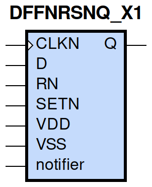
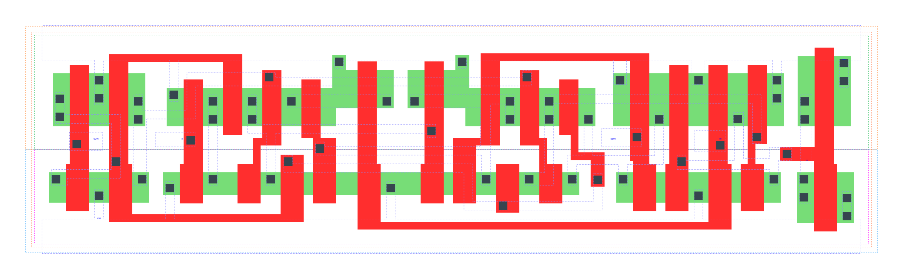

====================================
gf180mcu_fd_sc_mcu9t5v0__dffnrsnq_x1
====================================

**gf180mcu_fd_sc_mcu9t5v0__dffnrsnq_x1 symbol**

**gf180mcu_fd_sc_mcu9t5v0__dffnrsnq_x1 schematic**

.. image:: sc9_sch/DFFNRSNQ_X1_sch.png
    :height: 250px
    :width: 450 px
    :align: center
    :alt: gf180mcu_fd_sc_mcu9t5v0__dffnrsnq_x1 schematic

**gf180mcu_fd_sc_mcu9t5v0__dffnrsnq_x1 layout**

.. include:: images.rst
| DFFNRSNQ_X1 is a negative edge triggered D-type flip flop with active low set/reset and 1X drive strength

|
| Attributes

============= =======================
**Attribute** **Value**
area          107.251200 µm\ :sup:`2`
============= =======================

|

TRUTH TABLE

===== ==== = ==== ======
Input             Output
RN    SETN D CLKN Q
H     H    L ↓    L
H     H    H ↓    H
L     H    X X    L
H     L    X X    H
L     L    X X    L
===== ==== = ==== ======

|
| FUNCTIONAL SCHEMATIC
| |image212|
| CONSTRAINTS

================== =============== ============= ============
**Constraint Pin** **Related Pin** **setup(ns)** **hold(ns)**
D(HL)              CLKN(HL)        0.3090        0.0570
D(LH)              CLKN(HL)        0.1890        0.1090
SETN(LH)           RN(LH)          -0.0340       0.0970
SETN(LH)           RN(LH)          -0.0110       0.0740
SETN(LH)           RN(LH)          -0.0340       0.0970
SETN(LH)           RN(LH)          -0.0110       0.0740
RN(LH)             SETN(LH)        0.0970        -0.0340
RN(LH)             SETN(LH)        0.0740        -0.0110
RN(LH)             SETN(LH)        0.0970        -0.0340
RN(LH)             SETN(LH)        0.0740        -0.0110
================== =============== ============= ============

|

================== =============== ================ ===============
**Constraint Pin** **Related Pin** **recovery(ns)** **removal(ns)**
SETN(LH)           CLKN(HL)        0.1090           0.1490
RN(LH)             CLKN(HL)        -0.3260          0.5270
================== =============== ================ ===============

|

================== =============== ===========================
**Constraint Pin** **Related Pin** **Minimum Pulse Width(ns)**
CLKN(LHL)          CLKN(LH)        0.4430
CLKN(LHL)          CLKN(LH)        0.3690
CLKN(HLH)          CLKN(HL)        0.3780
CLKN(HLH)          CLKN(HL)        0.4170
SETN(HLH)          SETN(HL)        0.3880
SETN(HLH)          SETN(HL)        0.3100
SETN(HLH)          SETN(HL)        0.3880
SETN(HLH)          SETN(HL)        0.3000
RN(HLH)            RN(HL)          0.3880
RN(HLH)            RN(HL)          0.2800
RN(HLH)            RN(HL)          0.3880
RN(HLH)            RN(HL)          0.2800
================== =============== ===========================

|
| PIN CAPACITANCE (pf)

======= ======== ====================
**Pin** **Type** **Capacitance (pf)**
CLKN    input    0.0051
D       input    0.0039
SETN    input    0.0096
RN      input    0.0099
======= ======== ====================

|
| DELAY AND OUTPUT TRANSITION TIME corresponding to min slew and load

+---------------+------------+--------------------+--------------+-------------------+----------------+---------------+
| **Input Pin** | **Output** | **When Condition** | **Tin (ns)** | **Out Load (pf)** | **Delay (ns)** | **Tout (ns)** |
+---------------+------------+--------------------+--------------+-------------------+----------------+---------------+
| CLKN(HL)      | Q(LH)      | D&RN&SETN          | 0.0100       | 0.0010            | 0.6554         | 0.0456        |
+---------------+------------+--------------------+--------------+-------------------+----------------+---------------+
| CLKN(HL)      | Q(HL)      | !D&RN&SETN         | 0.0100       | 0.0010            | 0.5380         | 0.0372        |
+---------------+------------+--------------------+--------------+-------------------+----------------+---------------+
| SETN(HL)      | Q(LH)      | !CLKN&!D&RN        | 0.0100       | 0.0010            | 0.5526         | 0.0451        |
+---------------+------------+--------------------+--------------+-------------------+----------------+---------------+
| SETN(HL)      | Q(LH)      | CLKN&!D&RN         | 0.0100       | 0.0010            | 0.4554         | 0.0443        |
+---------------+------------+--------------------+--------------+-------------------+----------------+---------------+
| SETN(HL)      | Q(LH)      | !CLKN&D&RN         | 0.0100       | 0.0010            | 0.5526         | 0.0448        |
+---------------+------------+--------------------+--------------+-------------------+----------------+---------------+
| SETN(HL)      | Q(LH)      | CLKN&D&RN          | 0.0100       | 0.0010            | 0.4555         | 0.0446        |
+---------------+------------+--------------------+--------------+-------------------+----------------+---------------+
| RN(HL)        | Q(HL)      | !CLKN&!D&SETN      | 0.0100       | 0.0010            | 0.1792         | 0.0355        |
+---------------+------------+--------------------+--------------+-------------------+----------------+---------------+
| RN(HL)        | Q(HL)      | CLKN&!D&SETN       | 0.0100       | 0.0010            | 0.1790         | 0.0356        |
+---------------+------------+--------------------+--------------+-------------------+----------------+---------------+
| RN(HL)        | Q(HL)      | !CLKN&D&SETN       | 0.0100       | 0.0010            | 0.1791         | 0.0354        |
+---------------+------------+--------------------+--------------+-------------------+----------------+---------------+
| RN(HL)        | Q(HL)      | CLKN&D&SETN        | 0.0100       | 0.0010            | 0.1790         | 0.0355        |
+---------------+------------+--------------------+--------------+-------------------+----------------+---------------+
| RN(HL)        | Q(HL)      | !CLKN&!D&!SETN     | 0.0100       | 0.0010            | 0.1791         | 0.0350        |
+---------------+------------+--------------------+--------------+-------------------+----------------+---------------+
| RN(HL)        | Q(HL)      | !CLKN&D&!SETN      | 0.0100       | 0.0010            | 0.1791         | 0.0350        |
+---------------+------------+--------------------+--------------+-------------------+----------------+---------------+
| RN(HL)        | Q(HL)      | CLKN&!D&!SETN      | 0.0100       | 0.0010            | 0.1787         | 0.0349        |
+---------------+------------+--------------------+--------------+-------------------+----------------+---------------+
| RN(HL)        | Q(HL)      | CLKN&D&!SETN       | 0.0100       | 0.0010            | 0.1788         | 0.0349        |
+---------------+------------+--------------------+--------------+-------------------+----------------+---------------+
| RN(LH)        | Q(LH)      | !CLKN&!D&!SETN     | 0.0100       | 0.0010            | 0.2489         | 0.0434        |
+---------------+------------+--------------------+--------------+-------------------+----------------+---------------+
| RN(LH)        | Q(LH)      | !CLKN&D&!SETN      | 0.0100       | 0.0010            | 0.2489         | 0.0434        |
+---------------+------------+--------------------+--------------+-------------------+----------------+---------------+
| RN(LH)        | Q(LH)      | CLKN&!D&!SETN      | 0.0100       | 0.0010            | 0.2464         | 0.0434        |
+---------------+------------+--------------------+--------------+-------------------+----------------+---------------+
| RN(LH)        | Q(LH)      | CLKN&D&!SETN       | 0.0100       | 0.0010            | 0.2464         | 0.0434        |
+---------------+------------+--------------------+--------------+-------------------+----------------+---------------+

|
| DYNAMIC ENERGY

+---------------+--------------------+--------------+------------+-------------------+---------------------+
| **Input Pin** | **When Condition** | **Tin (ns)** | **Output** | **Out Load (pf)** | **Energy (uW/MHz)** |
+---------------+--------------------+--------------+------------+-------------------+---------------------+
| SETN          | !CLKN&!D&RN        | 0.0100       | Q(LH)      | 0.0010            | 0.8975              |
+---------------+--------------------+--------------+------------+-------------------+---------------------+
| SETN          | CLKN&!D&RN         | 0.0100       | Q(LH)      | 0.0010            | 0.7472              |
+---------------+--------------------+--------------+------------+-------------------+---------------------+
| SETN          | !CLKN&D&RN         | 0.0100       | Q(LH)      | 0.0010            | 0.8974              |
+---------------+--------------------+--------------+------------+-------------------+---------------------+
| SETN          | CLKN&D&RN          | 0.0100       | Q(LH)      | 0.0010            | 0.6115              |
+---------------+--------------------+--------------+------------+-------------------+---------------------+
| RN            | !CLKN&!D&SETN      | 0.0100       | Q(HL)      | 0.0010            | 0.8771              |
+---------------+--------------------+--------------+------------+-------------------+---------------------+
| RN            | CLKN&!D&SETN       | 0.0100       | Q(HL)      | 0.0010            | 0.5828              |
+---------------+--------------------+--------------+------------+-------------------+---------------------+
| RN            | !CLKN&D&SETN       | 0.0100       | Q(HL)      | 0.0010            | 0.8764              |
+---------------+--------------------+--------------+------------+-------------------+---------------------+
| RN            | CLKN&D&SETN        | 0.0100       | Q(HL)      | 0.0010            | 0.5832              |
+---------------+--------------------+--------------+------------+-------------------+---------------------+
| RN            | !CLKN&!D&!SETN     | 0.0100       | Q(HL)      | 0.0010            | 0.5614              |
+---------------+--------------------+--------------+------------+-------------------+---------------------+
| RN            | !CLKN&D&!SETN      | 0.0100       | Q(HL)      | 0.0010            | 0.5614              |
+---------------+--------------------+--------------+------------+-------------------+---------------------+
| RN            | CLKN&!D&!SETN      | 0.0100       | Q(HL)      | 0.0010            | 0.3843              |
+---------------+--------------------+--------------+------------+-------------------+---------------------+
| RN            | CLKN&D&!SETN       | 0.0100       | Q(HL)      | 0.0010            | 0.3821              |
+---------------+--------------------+--------------+------------+-------------------+---------------------+
| RN            | !CLKN&!D&!SETN     | 0.0100       | Q(LH)      | 0.0010            | 0.3626              |
+---------------+--------------------+--------------+------------+-------------------+---------------------+
| RN            | !CLKN&D&!SETN      | 0.0100       | Q(LH)      | 0.0010            | 0.3626              |
+---------------+--------------------+--------------+------------+-------------------+---------------------+
| RN            | CLKN&!D&!SETN      | 0.0100       | Q(LH)      | 0.0010            | 0.2217              |
+---------------+--------------------+--------------+------------+-------------------+---------------------+
| RN            | CLKN&D&!SETN       | 0.0100       | Q(LH)      | 0.0010            | 0.2240              |
+---------------+--------------------+--------------+------------+-------------------+---------------------+
| CLKN          | D&RN&SETN          | 0.0100       | Q(LH)      | 0.0010            | 1.1160              |
+---------------+--------------------+--------------+------------+-------------------+---------------------+
| CLKN          | !D&RN&SETN         | 0.0100       | Q(HL)      | 0.0010            | 0.9551              |
+---------------+--------------------+--------------+------------+-------------------+---------------------+
| SETN(HL)      | !CLKN&!D&!RN       | 0.0100       | n/a        | n/a               | 0.4287              |
+---------------+--------------------+--------------+------------+-------------------+---------------------+
| SETN(HL)      | !CLKN&D&!RN        | 0.0100       | n/a        | n/a               | 0.4287              |
+---------------+--------------------+--------------+------------+-------------------+---------------------+
| SETN(HL)      | CLKN&!D&!RN        | 0.0100       | n/a        | n/a               | 0.4264              |
+---------------+--------------------+--------------+------------+-------------------+---------------------+
| SETN(HL)      | CLKN&D&!RN         | 0.0100       | n/a        | n/a               | 0.3003              |
+---------------+--------------------+--------------+------------+-------------------+---------------------+
| SETN(HL)      | !CLKN&!D&RN        | 0.0100       | n/a        | n/a               | 0.0845              |
+---------------+--------------------+--------------+------------+-------------------+---------------------+
| SETN(HL)      | CLKN&!D&RN         | 0.0100       | n/a        | n/a               | 0.2200              |
+---------------+--------------------+--------------+------------+-------------------+---------------------+
| SETN(HL)      | !CLKN&D&RN         | 0.0100       | n/a        | n/a               | 0.0845              |
+---------------+--------------------+--------------+------------+-------------------+---------------------+
| SETN(HL)      | CLKN&D&RN          | 0.0100       | n/a        | n/a               | 0.0844              |
+---------------+--------------------+--------------+------------+-------------------+---------------------+
| CLKN(LH)      | !D&!RN&!SETN       | 0.0100       | n/a        | n/a               | 0.2901              |
+---------------+--------------------+--------------+------------+-------------------+---------------------+
| CLKN(LH)      | !D&!RN&SETN        | 0.0100       | n/a        | n/a               | 0.2845              |
+---------------+--------------------+--------------+------------+-------------------+---------------------+
| CLKN(LH)      | D&!RN&!SETN        | 0.0100       | n/a        | n/a               | 0.3963              |
+---------------+--------------------+--------------+------------+-------------------+---------------------+
| CLKN(LH)      | D&!RN&SETN         | 0.0100       | n/a        | n/a               | 0.5552              |
+---------------+--------------------+--------------+------------+-------------------+---------------------+
| CLKN(LH)      | !D&RN&!SETN        | 0.0100       | n/a        | n/a               | 0.4073              |
+---------------+--------------------+--------------+------------+-------------------+---------------------+
| CLKN(LH)      | D&RN&!SETN         | 0.0100       | n/a        | n/a               | 0.2856              |
+---------------+--------------------+--------------+------------+-------------------+---------------------+
| CLKN(LH)      | !D&RN&SETN         | 0.0100       | n/a        | n/a               | 0.2842              |
+---------------+--------------------+--------------+------------+-------------------+---------------------+
| CLKN(LH)      | D&RN&SETN          | 0.0100       | n/a        | n/a               | 0.2852              |
+---------------+--------------------+--------------+------------+-------------------+---------------------+
| CLKN(HL)      | !D&!RN&!SETN       | 0.0100       | n/a        | n/a               | 0.4665              |
+---------------+--------------------+--------------+------------+-------------------+---------------------+
| CLKN(HL)      | !D&!RN&SETN        | 0.0100       | n/a        | n/a               | 0.4449              |
+---------------+--------------------+--------------+------------+-------------------+---------------------+
| CLKN(HL)      | D&!RN&!SETN        | 0.0100       | n/a        | n/a               | 0.5947              |
+---------------+--------------------+--------------+------------+-------------------+---------------------+
| CLKN(HL)      | D&!RN&SETN         | 0.0100       | n/a        | n/a               | 0.8759              |
+---------------+--------------------+--------------+------------+-------------------+---------------------+
| CLKN(HL)      | !D&RN&!SETN        | 0.0100       | n/a        | n/a               | 0.5448              |
+---------------+--------------------+--------------+------------+-------------------+---------------------+
| CLKN(HL)      | D&RN&!SETN         | 0.0100       | n/a        | n/a               | 0.4652              |
+---------------+--------------------+--------------+------------+-------------------+---------------------+
| CLKN(HL)      | !D&RN&SETN         | 0.0100       | n/a        | n/a               | 0.4449              |
+---------------+--------------------+--------------+------------+-------------------+---------------------+
| CLKN(HL)      | D&RN&SETN          | 0.0100       | n/a        | n/a               | 0.4652              |
+---------------+--------------------+--------------+------------+-------------------+---------------------+
| D(HL)         | !CLKN&!RN&!SETN    | 0.0100       | n/a        | n/a               | 0.0893              |
+---------------+--------------------+--------------+------------+-------------------+---------------------+
| D(HL)         | !CLKN&!RN&SETN     | 0.0100       | n/a        | n/a               | 0.0893              |
+---------------+--------------------+--------------+------------+-------------------+---------------------+
| D(HL)         | CLKN&!RN&!SETN     | 0.0100       | n/a        | n/a               | 0.2157              |
+---------------+--------------------+--------------+------------+-------------------+---------------------+
| D(HL)         | CLKN&!RN&SETN      | 0.0100       | n/a        | n/a               | 0.3328              |
+---------------+--------------------+--------------+------------+-------------------+---------------------+
| D(HL)         | !CLKN&RN&!SETN     | 0.0100       | n/a        | n/a               | 0.0893              |
+---------------+--------------------+--------------+------------+-------------------+---------------------+
| D(HL)         | CLKN&RN&!SETN      | 0.0100       | n/a        | n/a               | 0.2157              |
+---------------+--------------------+--------------+------------+-------------------+---------------------+
| D(HL)         | !CLKN&RN&SETN      | 0.0100       | n/a        | n/a               | 0.0893              |
+---------------+--------------------+--------------+------------+-------------------+---------------------+
| D(HL)         | CLKN&RN&SETN       | 0.0100       | n/a        | n/a               | 0.3198              |
+---------------+--------------------+--------------+------------+-------------------+---------------------+
| RN(HL)        | !CLKN&!D&SETN      | 0.0100       | n/a        | n/a               | 0.0831              |
+---------------+--------------------+--------------+------------+-------------------+---------------------+
| RN(HL)        | CLKN&!D&SETN       | 0.0100       | n/a        | n/a               | 0.0808              |
+---------------+--------------------+--------------+------------+-------------------+---------------------+
| RN(HL)        | !CLKN&D&SETN       | 0.0100       | n/a        | n/a               | 0.0829              |
+---------------+--------------------+--------------+------------+-------------------+---------------------+
| RN(HL)        | CLKN&D&SETN        | 0.0100       | n/a        | n/a               | 0.0800              |
+---------------+--------------------+--------------+------------+-------------------+---------------------+
| D(LH)         | !CLKN&!RN&!SETN    | 0.0100       | n/a        | n/a               | 0.0063              |
+---------------+--------------------+--------------+------------+-------------------+---------------------+
| D(LH)         | !CLKN&!RN&SETN     | 0.0100       | n/a        | n/a               | 0.0063              |
+---------------+--------------------+--------------+------------+-------------------+---------------------+
| D(LH)         | CLKN&!RN&!SETN     | 0.0100       | n/a        | n/a               | 0.0847              |
+---------------+--------------------+--------------+------------+-------------------+---------------------+
| D(LH)         | CLKN&!RN&SETN      | 0.0100       | n/a        | n/a               | 0.2464              |
+---------------+--------------------+--------------+------------+-------------------+---------------------+
| D(LH)         | !CLKN&RN&!SETN     | 0.0100       | n/a        | n/a               | 0.0064              |
+---------------+--------------------+--------------+------------+-------------------+---------------------+
| D(LH)         | CLKN&RN&!SETN      | 0.0100       | n/a        | n/a               | 0.0847              |
+---------------+--------------------+--------------+------------+-------------------+---------------------+
| D(LH)         | !CLKN&RN&SETN      | 0.0100       | n/a        | n/a               | 0.0063              |
+---------------+--------------------+--------------+------------+-------------------+---------------------+
| D(LH)         | CLKN&RN&SETN       | 0.0100       | n/a        | n/a               | 0.2558              |
+---------------+--------------------+--------------+------------+-------------------+---------------------+
| RN(LH)        | !CLKN&!D&SETN      | 0.0100       | n/a        | n/a               | -0.0766             |
+---------------+--------------------+--------------+------------+-------------------+---------------------+
| RN(LH)        | !CLKN&D&SETN       | 0.0100       | n/a        | n/a               | -0.0766             |
+---------------+--------------------+--------------+------------+-------------------+---------------------+
| RN(LH)        | CLKN&!D&SETN       | 0.0100       | n/a        | n/a               | -0.0766             |
+---------------+--------------------+--------------+------------+-------------------+---------------------+
| RN(LH)        | CLKN&D&SETN        | 0.0100       | n/a        | n/a               | -0.0716             |
+---------------+--------------------+--------------+------------+-------------------+---------------------+
| SETN(LH)      | !CLKN&!D&!RN       | 0.0100       | n/a        | n/a               | 0.1882              |
+---------------+--------------------+--------------+------------+-------------------+---------------------+
| SETN(LH)      | !CLKN&D&!RN        | 0.0100       | n/a        | n/a               | 0.1882              |
+---------------+--------------------+--------------+------------+-------------------+---------------------+
| SETN(LH)      | CLKN&!D&!RN        | 0.0100       | n/a        | n/a               | 0.1977              |
+---------------+--------------------+--------------+------------+-------------------+---------------------+
| SETN(LH)      | CLKN&D&!RN         | 0.0100       | n/a        | n/a               | 0.0989              |
+---------------+--------------------+--------------+------------+-------------------+---------------------+
| SETN(LH)      | !CLKN&!D&RN        | 0.0100       | n/a        | n/a               | -0.0613             |
+---------------+--------------------+--------------+------------+-------------------+---------------------+
| SETN(LH)      | !CLKN&D&RN         | 0.0100       | n/a        | n/a               | -0.0613             |
+---------------+--------------------+--------------+------------+-------------------+---------------------+
| SETN(LH)      | CLKN&!D&RN         | 0.0100       | n/a        | n/a               | 0.0253              |
+---------------+--------------------+--------------+------------+-------------------+---------------------+
| SETN(LH)      | CLKN&D&RN          | 0.0100       | n/a        | n/a               | -0.0613             |
+---------------+--------------------+--------------+------------+-------------------+---------------------+

|
| LEAKAGE POWER

================== ==============
**When Condition** **Power (nW)**
!CLKN&!D&!RN&!SETN 0.5255
!CLKN&!D&!RN&SETN  0.5036
!CLKN&D&!RN&!SETN  0.5282
!CLKN&D&!RN&SETN   0.5063
CLKN&!D&!RN&!SETN  0.4459
CLKN&!D&!RN&SETN   0.4634
CLKN&D&!RN&!SETN   0.4477
CLKN&D&!RN&SETN    0.4774
!CLKN&D&RN&SETN    0.8012
!CLKN&!D&RN&!SETN  0.4895
!CLKN&D&RN&!SETN   0.4913
CLKN&!D&RN&!SETN   0.4324
CLKN&D&RN&!SETN    0.4340
!CLKN&!D&RN&SETN   0.5445
CLKN&!D&RN&SETN    0.6847
CLKN&D&RN&SETN     0.6512
================== ==============

