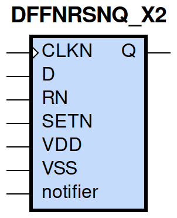
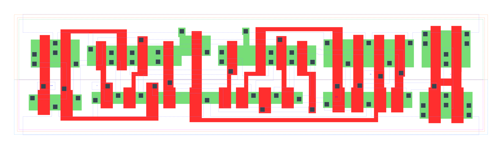

====================================
gf180mcu_fd_sc_mcu9t5v0__dffnrsnq_x2
====================================

**gf180mcu_fd_sc_mcu9t5v0__dffnrsnq_x2 symbol**

**gf180mcu_fd_sc_mcu9t5v0__dffnrsnq_x2 schematic**

.. image:: sc9_sch/DFFNRSNQ_X2_sch.png
    :height: 250px
    :width: 450 px
    :align: center
    :alt: gf180mcu_fd_sc_mcu9t5v0__dffnrsnq_x2 schematic

**gf180mcu_fd_sc_mcu9t5v0__dffnrsnq_x2 layout**

.. include:: images.rst
| DFFNRSNQ_X2 is a negative edge triggered D-type flip flop with active low set/reset and 2X drive strength

|
| Attributes

============= =======================
**Attribute** **Value**
area          112.896000 µm\ :sup:`2`
============= =======================

|

TRUTH TABLE

===== ==== = ==== ======
Input             Output
RN    SETN D CLKN Q
H     H    L ↓    L
H     H    H ↓    H
L     H    X X    L
H     L    X X    H
L     L    X X    L
===== ==== = ==== ======

|
| FUNCTIONAL SCHEMATIC
| |image215|
| CONSTRAINTS

================== =============== ============= ============
**Constraint Pin** **Related Pin** **setup(ns)** **hold(ns)**
D(HL)              CLKN(HL)        0.3150        0.0690
D(LH)              CLKN(HL)        0.1950        0.1090
SETN(LH)           RN(LH)          -0.0460       0.1260
SETN(LH)           RN(LH)          -0.0460       0.1260
SETN(LH)           RN(LH)          -0.0460       0.1260
SETN(LH)           RN(LH)          -0.0460       0.1260
RN(LH)             SETN(LH)        0.1260        -0.0460
RN(LH)             SETN(LH)        0.1260        -0.0460
RN(LH)             SETN(LH)        0.1260        -0.0460
RN(LH)             SETN(LH)        0.1260        -0.0460
================== =============== ============= ============

|

================== =============== ================ ===============
**Constraint Pin** **Related Pin** **recovery(ns)** **removal(ns)**
SETN(LH)           CLKN(HL)        0.1090           0.1490
RN(LH)             CLKN(HL)        -0.3150          0.5270
================== =============== ================ ===============

|

================== =============== ===========================
**Constraint Pin** **Related Pin** **Minimum Pulse Width(ns)**
CLKN(LHL)          CLKN(LH)        0.4490
CLKN(LHL)          CLKN(LH)        0.3760
CLKN(HLH)          CLKN(HL)        0.4070
CLKN(HLH)          CLKN(HL)        0.4760
SETN(HLH)          SETN(HL)        0.4070
SETN(HLH)          SETN(HL)        0.3490
SETN(HLH)          SETN(HL)        0.4070
SETN(HLH)          SETN(HL)        0.3490
RN(HLH)            RN(HL)          0.3980
RN(HLH)            RN(HL)          0.2800
RN(HLH)            RN(HL)          0.3980
RN(HLH)            RN(HL)          0.2800
================== =============== ===========================

|
| PIN CAPACITANCE (pf)

======= ======== ====================
**Pin** **Type** **Capacitance (pf)**
CLKN    input    0.0050
D       input    0.0040
SETN    input    0.0094
RN      input    0.0100
======= ======== ====================

|
| DELAY AND OUTPUT TRANSITION TIME corresponding to min slew and load

+---------------+------------+--------------------+--------------+-------------------+----------------+---------------+
| **Input Pin** | **Output** | **When Condition** | **Tin (ns)** | **Out Load (pf)** | **Delay (ns)** | **Tout (ns)** |
+---------------+------------+--------------------+--------------+-------------------+----------------+---------------+
| CLKN(HL)      | Q(LH)      | D&RN&SETN          | 0.0100       | 0.0010            | 0.7067         | 0.0433        |
+---------------+------------+--------------------+--------------+-------------------+----------------+---------------+
| CLKN(HL)      | Q(HL)      | !D&RN&SETN         | 0.0100       | 0.0010            | 0.5712         | 0.0378        |
+---------------+------------+--------------------+--------------+-------------------+----------------+---------------+
| SETN(HL)      | Q(LH)      | !CLKN&!D&RN        | 0.0100       | 0.0010            | 0.6039         | 0.0426        |
+---------------+------------+--------------------+--------------+-------------------+----------------+---------------+
| SETN(HL)      | Q(LH)      | CLKN&!D&RN         | 0.0100       | 0.0010            | 0.5091         | 0.0422        |
+---------------+------------+--------------------+--------------+-------------------+----------------+---------------+
| SETN(HL)      | Q(LH)      | !CLKN&D&RN         | 0.0100       | 0.0010            | 0.6041         | 0.0427        |
+---------------+------------+--------------------+--------------+-------------------+----------------+---------------+
| SETN(HL)      | Q(LH)      | CLKN&D&RN          | 0.0100       | 0.0010            | 0.5094         | 0.0422        |
+---------------+------------+--------------------+--------------+-------------------+----------------+---------------+
| RN(HL)        | Q(HL)      | !CLKN&!D&SETN      | 0.0100       | 0.0010            | 0.2072         | 0.0360        |
+---------------+------------+--------------------+--------------+-------------------+----------------+---------------+
| RN(HL)        | Q(HL)      | CLKN&!D&SETN       | 0.0100       | 0.0010            | 0.2070         | 0.0363        |
+---------------+------------+--------------------+--------------+-------------------+----------------+---------------+
| RN(HL)        | Q(HL)      | !CLKN&D&SETN       | 0.0100       | 0.0010            | 0.2071         | 0.0361        |
+---------------+------------+--------------------+--------------+-------------------+----------------+---------------+
| RN(HL)        | Q(HL)      | CLKN&D&SETN        | 0.0100       | 0.0010            | 0.2071         | 0.0363        |
+---------------+------------+--------------------+--------------+-------------------+----------------+---------------+
| RN(HL)        | Q(HL)      | !CLKN&!D&!SETN     | 0.0100       | 0.0010            | 0.2070         | 0.0356        |
+---------------+------------+--------------------+--------------+-------------------+----------------+---------------+
| RN(HL)        | Q(HL)      | !CLKN&D&!SETN      | 0.0100       | 0.0010            | 0.2070         | 0.0356        |
+---------------+------------+--------------------+--------------+-------------------+----------------+---------------+
| RN(HL)        | Q(HL)      | CLKN&!D&!SETN      | 0.0100       | 0.0010            | 0.2069         | 0.0355        |
+---------------+------------+--------------------+--------------+-------------------+----------------+---------------+
| RN(HL)        | Q(HL)      | CLKN&D&!SETN       | 0.0100       | 0.0010            | 0.2069         | 0.0355        |
+---------------+------------+--------------------+--------------+-------------------+----------------+---------------+
| RN(LH)        | Q(LH)      | !CLKN&!D&!SETN     | 0.0100       | 0.0010            | 0.2973         | 0.0416        |
+---------------+------------+--------------------+--------------+-------------------+----------------+---------------+
| RN(LH)        | Q(LH)      | !CLKN&D&!SETN      | 0.0100       | 0.0010            | 0.2973         | 0.0416        |
+---------------+------------+--------------------+--------------+-------------------+----------------+---------------+
| RN(LH)        | Q(LH)      | CLKN&!D&!SETN      | 0.0100       | 0.0010            | 0.2941         | 0.0416        |
+---------------+------------+--------------------+--------------+-------------------+----------------+---------------+
| RN(LH)        | Q(LH)      | CLKN&D&!SETN       | 0.0100       | 0.0010            | 0.2939         | 0.0415        |
+---------------+------------+--------------------+--------------+-------------------+----------------+---------------+

|
| DYNAMIC ENERGY

+---------------+--------------------+--------------+------------+-------------------+---------------------+
| **Input Pin** | **When Condition** | **Tin (ns)** | **Output** | **Out Load (pf)** | **Energy (uW/MHz)** |
+---------------+--------------------+--------------+------------+-------------------+---------------------+
| SETN          | !CLKN&!D&RN        | 0.0100       | Q(LH)      | 0.0010            | 1.1180              |
+---------------+--------------------+--------------+------------+-------------------+---------------------+
| SETN          | CLKN&!D&RN         | 0.0100       | Q(LH)      | 0.0010            | 0.9626              |
+---------------+--------------------+--------------+------------+-------------------+---------------------+
| SETN          | !CLKN&D&RN         | 0.0100       | Q(LH)      | 0.0010            | 1.1181              |
+---------------+--------------------+--------------+------------+-------------------+---------------------+
| SETN          | CLKN&D&RN          | 0.0100       | Q(LH)      | 0.0010            | 0.8286              |
+---------------+--------------------+--------------+------------+-------------------+---------------------+
| RN            | !CLKN&!D&SETN      | 0.0100       | Q(HL)      | 0.0010            | 1.1024              |
+---------------+--------------------+--------------+------------+-------------------+---------------------+
| RN            | CLKN&!D&SETN       | 0.0100       | Q(HL)      | 0.0010            | 0.7962              |
+---------------+--------------------+--------------+------------+-------------------+---------------------+
| RN            | !CLKN&D&SETN       | 0.0100       | Q(HL)      | 0.0010            | 1.1017              |
+---------------+--------------------+--------------+------------+-------------------+---------------------+
| RN            | CLKN&D&SETN        | 0.0100       | Q(HL)      | 0.0010            | 0.7968              |
+---------------+--------------------+--------------+------------+-------------------+---------------------+
| RN            | !CLKN&!D&!SETN     | 0.0100       | Q(HL)      | 0.0010            | 0.7698              |
+---------------+--------------------+--------------+------------+-------------------+---------------------+
| RN            | !CLKN&D&!SETN      | 0.0100       | Q(HL)      | 0.0010            | 0.7698              |
+---------------+--------------------+--------------+------------+-------------------+---------------------+
| RN            | CLKN&!D&!SETN      | 0.0100       | Q(HL)      | 0.0010            | 0.5871              |
+---------------+--------------------+--------------+------------+-------------------+---------------------+
| RN            | CLKN&D&!SETN       | 0.0100       | Q(HL)      | 0.0010            | 0.5849              |
+---------------+--------------------+--------------+------------+-------------------+---------------------+
| RN            | !CLKN&!D&!SETN     | 0.0100       | Q(LH)      | 0.0010            | 0.5741              |
+---------------+--------------------+--------------+------------+-------------------+---------------------+
| RN            | !CLKN&D&!SETN      | 0.0100       | Q(LH)      | 0.0010            | 0.5741              |
+---------------+--------------------+--------------+------------+-------------------+---------------------+
| RN            | CLKN&!D&!SETN      | 0.0100       | Q(LH)      | 0.0010            | 0.4282              |
+---------------+--------------------+--------------+------------+-------------------+---------------------+
| RN            | CLKN&D&!SETN       | 0.0100       | Q(LH)      | 0.0010            | 0.4303              |
+---------------+--------------------+--------------+------------+-------------------+---------------------+
| CLKN          | D&RN&SETN          | 0.0100       | Q(LH)      | 0.0010            | 1.3569              |
+---------------+--------------------+--------------+------------+-------------------+---------------------+
| CLKN          | !D&RN&SETN         | 0.0100       | Q(HL)      | 0.0010            | 1.1747              |
+---------------+--------------------+--------------+------------+-------------------+---------------------+
| SETN(HL)      | !CLKN&!D&!RN       | 0.0100       | n/a        | n/a               | 0.4344              |
+---------------+--------------------+--------------+------------+-------------------+---------------------+
| SETN(HL)      | !CLKN&D&!RN        | 0.0100       | n/a        | n/a               | 0.4344              |
+---------------+--------------------+--------------+------------+-------------------+---------------------+
| SETN(HL)      | CLKN&!D&!RN        | 0.0100       | n/a        | n/a               | 0.4305              |
+---------------+--------------------+--------------+------------+-------------------+---------------------+
| SETN(HL)      | CLKN&D&!RN         | 0.0100       | n/a        | n/a               | 0.3058              |
+---------------+--------------------+--------------+------------+-------------------+---------------------+
| SETN(HL)      | !CLKN&!D&RN        | 0.0100       | n/a        | n/a               | 0.0845              |
+---------------+--------------------+--------------+------------+-------------------+---------------------+
| SETN(HL)      | CLKN&!D&RN         | 0.0100       | n/a        | n/a               | 0.2182              |
+---------------+--------------------+--------------+------------+-------------------+---------------------+
| SETN(HL)      | !CLKN&D&RN         | 0.0100       | n/a        | n/a               | 0.0845              |
+---------------+--------------------+--------------+------------+-------------------+---------------------+
| SETN(HL)      | CLKN&D&RN          | 0.0100       | n/a        | n/a               | 0.0844              |
+---------------+--------------------+--------------+------------+-------------------+---------------------+
| CLKN(LH)      | !D&!RN&!SETN       | 0.0100       | n/a        | n/a               | 0.2867              |
+---------------+--------------------+--------------+------------+-------------------+---------------------+
| CLKN(LH)      | !D&!RN&SETN        | 0.0100       | n/a        | n/a               | 0.2811              |
+---------------+--------------------+--------------+------------+-------------------+---------------------+
| CLKN(LH)      | D&!RN&!SETN        | 0.0100       | n/a        | n/a               | 0.3923              |
+---------------+--------------------+--------------+------------+-------------------+---------------------+
| CLKN(LH)      | D&!RN&SETN         | 0.0100       | n/a        | n/a               | 0.5504              |
+---------------+--------------------+--------------+------------+-------------------+---------------------+
| CLKN(LH)      | !D&RN&!SETN        | 0.0100       | n/a        | n/a               | 0.4074              |
+---------------+--------------------+--------------+------------+-------------------+---------------------+
| CLKN(LH)      | D&RN&!SETN         | 0.0100       | n/a        | n/a               | 0.2818              |
+---------------+--------------------+--------------+------------+-------------------+---------------------+
| CLKN(LH)      | !D&RN&SETN         | 0.0100       | n/a        | n/a               | 0.2810              |
+---------------+--------------------+--------------+------------+-------------------+---------------------+
| CLKN(LH)      | D&RN&SETN          | 0.0100       | n/a        | n/a               | 0.2820              |
+---------------+--------------------+--------------+------------+-------------------+---------------------+
| CLKN(HL)      | !D&!RN&!SETN       | 0.0100       | n/a        | n/a               | 0.4634              |
+---------------+--------------------+--------------+------------+-------------------+---------------------+
| CLKN(HL)      | !D&!RN&SETN        | 0.0100       | n/a        | n/a               | 0.4399              |
+---------------+--------------------+--------------+------------+-------------------+---------------------+
| CLKN(HL)      | D&!RN&!SETN        | 0.0100       | n/a        | n/a               | 0.5951              |
+---------------+--------------------+--------------+------------+-------------------+---------------------+
| CLKN(HL)      | D&!RN&SETN         | 0.0100       | n/a        | n/a               | 0.8772              |
+---------------+--------------------+--------------+------------+-------------------+---------------------+
| CLKN(HL)      | !D&RN&!SETN        | 0.0100       | n/a        | n/a               | 0.5437              |
+---------------+--------------------+--------------+------------+-------------------+---------------------+
| CLKN(HL)      | D&RN&!SETN         | 0.0100       | n/a        | n/a               | 0.4642              |
+---------------+--------------------+--------------+------------+-------------------+---------------------+
| CLKN(HL)      | !D&RN&SETN         | 0.0100       | n/a        | n/a               | 0.4400              |
+---------------+--------------------+--------------+------------+-------------------+---------------------+
| CLKN(HL)      | D&RN&SETN          | 0.0100       | n/a        | n/a               | 0.4642              |
+---------------+--------------------+--------------+------------+-------------------+---------------------+
| D(HL)         | !CLKN&!RN&!SETN    | 0.0100       | n/a        | n/a               | 0.0856              |
+---------------+--------------------+--------------+------------+-------------------+---------------------+
| D(HL)         | !CLKN&!RN&SETN     | 0.0100       | n/a        | n/a               | 0.0856              |
+---------------+--------------------+--------------+------------+-------------------+---------------------+
| D(HL)         | CLKN&!RN&!SETN     | 0.0100       | n/a        | n/a               | 0.2157              |
+---------------+--------------------+--------------+------------+-------------------+---------------------+
| D(HL)         | CLKN&!RN&SETN      | 0.0100       | n/a        | n/a               | 0.3327              |
+---------------+--------------------+--------------+------------+-------------------+---------------------+
| D(HL)         | !CLKN&RN&!SETN     | 0.0100       | n/a        | n/a               | 0.0856              |
+---------------+--------------------+--------------+------------+-------------------+---------------------+
| D(HL)         | CLKN&RN&!SETN      | 0.0100       | n/a        | n/a               | 0.2157              |
+---------------+--------------------+--------------+------------+-------------------+---------------------+
| D(HL)         | !CLKN&RN&SETN      | 0.0100       | n/a        | n/a               | 0.0856              |
+---------------+--------------------+--------------+------------+-------------------+---------------------+
| D(HL)         | CLKN&RN&SETN       | 0.0100       | n/a        | n/a               | 0.3200              |
+---------------+--------------------+--------------+------------+-------------------+---------------------+
| RN(HL)        | !CLKN&!D&SETN      | 0.0100       | n/a        | n/a               | 0.0832              |
+---------------+--------------------+--------------+------------+-------------------+---------------------+
| RN(HL)        | CLKN&!D&SETN       | 0.0100       | n/a        | n/a               | 0.0808              |
+---------------+--------------------+--------------+------------+-------------------+---------------------+
| RN(HL)        | !CLKN&D&SETN       | 0.0100       | n/a        | n/a               | 0.0830              |
+---------------+--------------------+--------------+------------+-------------------+---------------------+
| RN(HL)        | CLKN&D&SETN        | 0.0100       | n/a        | n/a               | 0.0800              |
+---------------+--------------------+--------------+------------+-------------------+---------------------+
| D(LH)         | !CLKN&!RN&!SETN    | 0.0100       | n/a        | n/a               | 0.0062              |
+---------------+--------------------+--------------+------------+-------------------+---------------------+
| D(LH)         | !CLKN&!RN&SETN     | 0.0100       | n/a        | n/a               | 0.0063              |
+---------------+--------------------+--------------+------------+-------------------+---------------------+
| D(LH)         | CLKN&!RN&!SETN     | 0.0100       | n/a        | n/a               | 0.0847              |
+---------------+--------------------+--------------+------------+-------------------+---------------------+
| D(LH)         | CLKN&!RN&SETN      | 0.0100       | n/a        | n/a               | 0.2452              |
+---------------+--------------------+--------------+------------+-------------------+---------------------+
| D(LH)         | !CLKN&RN&!SETN     | 0.0100       | n/a        | n/a               | 0.0062              |
+---------------+--------------------+--------------+------------+-------------------+---------------------+
| D(LH)         | CLKN&RN&!SETN      | 0.0100       | n/a        | n/a               | 0.0847              |
+---------------+--------------------+--------------+------------+-------------------+---------------------+
| D(LH)         | !CLKN&RN&SETN      | 0.0100       | n/a        | n/a               | 0.0062              |
+---------------+--------------------+--------------+------------+-------------------+---------------------+
| D(LH)         | CLKN&RN&SETN       | 0.0100       | n/a        | n/a               | 0.2541              |
+---------------+--------------------+--------------+------------+-------------------+---------------------+
| RN(LH)        | !CLKN&!D&SETN      | 0.0100       | n/a        | n/a               | -0.0766             |
+---------------+--------------------+--------------+------------+-------------------+---------------------+
| RN(LH)        | !CLKN&D&SETN       | 0.0100       | n/a        | n/a               | -0.0766             |
+---------------+--------------------+--------------+------------+-------------------+---------------------+
| RN(LH)        | CLKN&!D&SETN       | 0.0100       | n/a        | n/a               | -0.0766             |
+---------------+--------------------+--------------+------------+-------------------+---------------------+
| RN(LH)        | CLKN&D&SETN        | 0.0100       | n/a        | n/a               | -0.0719             |
+---------------+--------------------+--------------+------------+-------------------+---------------------+
| SETN(LH)      | !CLKN&!D&!RN       | 0.0100       | n/a        | n/a               | 0.1882              |
+---------------+--------------------+--------------+------------+-------------------+---------------------+
| SETN(LH)      | !CLKN&D&!RN        | 0.0100       | n/a        | n/a               | 0.1882              |
+---------------+--------------------+--------------+------------+-------------------+---------------------+
| SETN(LH)      | CLKN&!D&!RN        | 0.0100       | n/a        | n/a               | 0.1976              |
+---------------+--------------------+--------------+------------+-------------------+---------------------+
| SETN(LH)      | CLKN&D&!RN         | 0.0100       | n/a        | n/a               | 0.0991              |
+---------------+--------------------+--------------+------------+-------------------+---------------------+
| SETN(LH)      | !CLKN&!D&RN        | 0.0100       | n/a        | n/a               | -0.0598             |
+---------------+--------------------+--------------+------------+-------------------+---------------------+
| SETN(LH)      | !CLKN&D&RN         | 0.0100       | n/a        | n/a               | -0.0598             |
+---------------+--------------------+--------------+------------+-------------------+---------------------+
| SETN(LH)      | CLKN&!D&RN         | 0.0100       | n/a        | n/a               | 0.0266              |
+---------------+--------------------+--------------+------------+-------------------+---------------------+
| SETN(LH)      | CLKN&D&RN          | 0.0100       | n/a        | n/a               | -0.0598             |
+---------------+--------------------+--------------+------------+-------------------+---------------------+

|
| LEAKAGE POWER

================== ==============
**When Condition** **Power (nW)**
!CLKN&!D&!RN&!SETN 0.5524
!CLKN&!D&!RN&SETN  0.5304
!CLKN&D&!RN&!SETN  0.5551
!CLKN&D&!RN&SETN   0.5331
CLKN&!D&!RN&!SETN  0.4728
CLKN&!D&!RN&SETN   0.4903
CLKN&D&!RN&!SETN   0.4745
CLKN&D&!RN&SETN    0.5042
!CLKN&D&RN&SETN    0.8548
!CLKN&!D&RN&!SETN  0.5151
!CLKN&D&RN&!SETN   0.5168
CLKN&!D&RN&!SETN   0.4580
CLKN&D&RN&!SETN    0.4595
!CLKN&!D&RN&SETN   0.5710
CLKN&!D&RN&SETN    0.7174
CLKN&D&RN&SETN     0.6848
================== ==============

