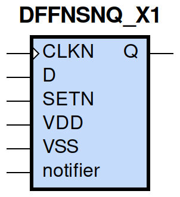
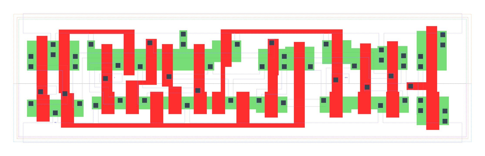

====================================
gf180mcu_fd_sc_mcu9t5v0__dffnsnq_x1
====================================

**gf180mcu_fd_sc_mcu9t5v0__dffnsnq_x1 symbol**

**gf180mcu_fd_sc_mcu9t5v0__dffnsnq_x1 schematic**

.. image:: sc9_sch/DFFNSNQ_X1_sch.png
    :height: 250px
    :width: 450 px
    :align: center
    :alt: gf180mcu_fd_sc_mcu9t5v0__dffnsnq_x1 schematic

**gf180mcu_fd_sc_mcu9t5v0__dffnsnq_x1 layout**

.. include:: images.rst
| DFFNSNQ_X1 is a negative edge triggered D-type flip flop with active low set and 1X drive strength

|
| Attributes

============= =======================
**Attribute** **Value**
area          101.606400 µm\ :sup:`2`
============= =======================

|

TRUTH TABLE

===== = ==== ======
Input        Output
SETN  D CLKN Q
H     L ↓    L
H     H ↓    H
L     X X    H
===== = ==== ======

|
| FUNCTIONAL SCHEMATIC
| |image221|
| CONSTRAINTS

================== =============== ============= ============
**Constraint Pin** **Related Pin** **setup(ns)** **hold(ns)**
D(HL)              CLKN(HL)        0.2810        -0.0110
D(LH)              CLKN(HL)        0.1770        0.0970
================== =============== ============= ============

|

================== =============== ================ ===============
**Constraint Pin** **Related Pin** **recovery(ns)** **removal(ns)**
SETN(LH)           CLKN(HL)        0.0920           0.0970
================== =============== ================ ===============

|

================== =============== ===========================
**Constraint Pin** **Related Pin** **Minimum Pulse Width(ns)**
CLKN(LHL)          CLKN(LH)        0.4000
CLKN(LHL)          CLKN(LH)        0.3270
CLKN(HLH)          CLKN(HL)        0.3980
CLKN(HLH)          CLKN(HL)        0.3580
SETN(HLH)          SETN(HL)        0.3290
SETN(HLH)          SETN(HL)        0.3000
SETN(HLH)          SETN(HL)        0.3290
SETN(HLH)          SETN(HL)        0.3000
================== =============== ===========================

|
| PIN CAPACITANCE (pf)

======= ======== ====================
**Pin** **Type** **Capacitance (pf)**
CLKN    input    0.0051
D       input    0.0039
SETN    input    0.0089
======= ======== ====================

|
| DELAY AND OUTPUT TRANSITION TIME corresponding to min slew and load

+---------------+------------+--------------------+--------------+-------------------+----------------+---------------+
| **Input Pin** | **Output** | **When Condition** | **Tin (ns)** | **Out Load (pf)** | **Delay (ns)** | **Tout (ns)** |
+---------------+------------+--------------------+--------------+-------------------+----------------+---------------+
| CLKN(HL)      | Q(LH)      | D&SETN             | 0.0100       | 0.0010            | 0.5634         | 0.0379        |
+---------------+------------+--------------------+--------------+-------------------+----------------+---------------+
| CLKN(HL)      | Q(HL)      | !D&SETN            | 0.0100       | 0.0010            | 0.5511         | 0.0389        |
+---------------+------------+--------------------+--------------+-------------------+----------------+---------------+
| SETN(HL)      | Q(LH)      | !CLKN&!D           | 0.0100       | 0.0010            | 0.4666         | 0.0375        |
+---------------+------------+--------------------+--------------+-------------------+----------------+---------------+
| SETN(HL)      | Q(LH)      | CLKN&!D            | 0.0100       | 0.0010            | 0.4174         | 0.0372        |
+---------------+------------+--------------------+--------------+-------------------+----------------+---------------+
| SETN(HL)      | Q(LH)      | !CLKN&D            | 0.0100       | 0.0010            | 0.4666         | 0.0374        |
+---------------+------------+--------------------+--------------+-------------------+----------------+---------------+
| SETN(HL)      | Q(LH)      | CLKN&D             | 0.0100       | 0.0010            | 0.4177         | 0.0373        |
+---------------+------------+--------------------+--------------+-------------------+----------------+---------------+

|
| DYNAMIC ENERGY

+---------------+--------------------+--------------+------------+-------------------+---------------------+
| **Input Pin** | **When Condition** | **Tin (ns)** | **Output** | **Out Load (pf)** | **Energy (uW/MHz)** |
+---------------+--------------------+--------------+------------+-------------------+---------------------+
| SETN          | !CLKN&!D           | 0.0100       | Q(LH)      | 0.0010            | 0.8168              |
+---------------+--------------------+--------------+------------+-------------------+---------------------+
| SETN          | CLKN&!D            | 0.0100       | Q(LH)      | 0.0010            | 0.6906              |
+---------------+--------------------+--------------+------------+-------------------+---------------------+
| SETN          | !CLKN&D            | 0.0100       | Q(LH)      | 0.0010            | 0.8167              |
+---------------+--------------------+--------------+------------+-------------------+---------------------+
| SETN          | CLKN&D             | 0.0100       | Q(LH)      | 0.0010            | 0.5786              |
+---------------+--------------------+--------------+------------+-------------------+---------------------+
| CLKN          | D&SETN             | 0.0100       | Q(LH)      | 0.0010            | 1.0104              |
+---------------+--------------------+--------------+------------+-------------------+---------------------+
| CLKN          | !D&SETN            | 0.0100       | Q(HL)      | 0.0010            | 0.8961              |
+---------------+--------------------+--------------+------------+-------------------+---------------------+
| SETN(HL)      | !CLKN&!D           | 0.0100       | n/a        | n/a               | 0.0749              |
+---------------+--------------------+--------------+------------+-------------------+---------------------+
| SETN(HL)      | CLKN&!D            | 0.0100       | n/a        | n/a               | 0.1850              |
+---------------+--------------------+--------------+------------+-------------------+---------------------+
| SETN(HL)      | !CLKN&D            | 0.0100       | n/a        | n/a               | 0.0749              |
+---------------+--------------------+--------------+------------+-------------------+---------------------+
| SETN(HL)      | CLKN&D             | 0.0100       | n/a        | n/a               | 0.0749              |
+---------------+--------------------+--------------+------------+-------------------+---------------------+
| CLKN(LH)      | !D&!SETN           | 0.0100       | n/a        | n/a               | 0.3725              |
+---------------+--------------------+--------------+------------+-------------------+---------------------+
| CLKN(LH)      | D&!SETN            | 0.0100       | n/a        | n/a               | 0.2701              |
+---------------+--------------------+--------------+------------+-------------------+---------------------+
| CLKN(LH)      | !D&SETN            | 0.0100       | n/a        | n/a               | 0.2727              |
+---------------+--------------------+--------------+------------+-------------------+---------------------+
| CLKN(LH)      | D&SETN             | 0.0100       | n/a        | n/a               | 0.2699              |
+---------------+--------------------+--------------+------------+-------------------+---------------------+
| CLKN(HL)      | !D&!SETN           | 0.0100       | n/a        | n/a               | 0.4933              |
+---------------+--------------------+--------------+------------+-------------------+---------------------+
| CLKN(HL)      | D&!SETN            | 0.0100       | n/a        | n/a               | 0.4127              |
+---------------+--------------------+--------------+------------+-------------------+---------------------+
| CLKN(HL)      | !D&SETN            | 0.0100       | n/a        | n/a               | 0.4003              |
+---------------+--------------------+--------------+------------+-------------------+---------------------+
| CLKN(HL)      | D&SETN             | 0.0100       | n/a        | n/a               | 0.4128              |
+---------------+--------------------+--------------+------------+-------------------+---------------------+
| D(HL)         | !CLKN&!SETN        | 0.0100       | n/a        | n/a               | 0.0930              |
+---------------+--------------------+--------------+------------+-------------------+---------------------+
| D(HL)         | CLKN&!SETN         | 0.0100       | n/a        | n/a               | 0.2018              |
+---------------+--------------------+--------------+------------+-------------------+---------------------+
| D(HL)         | !CLKN&SETN         | 0.0100       | n/a        | n/a               | 0.0930              |
+---------------+--------------------+--------------+------------+-------------------+---------------------+
| D(HL)         | CLKN&SETN          | 0.0100       | n/a        | n/a               | 0.3130              |
+---------------+--------------------+--------------+------------+-------------------+---------------------+
| D(LH)         | !CLKN&!SETN        | 0.0100       | n/a        | n/a               | 0.0063              |
+---------------+--------------------+--------------+------------+-------------------+---------------------+
| D(LH)         | CLKN&!SETN         | 0.0100       | n/a        | n/a               | 0.0847              |
+---------------+--------------------+--------------+------------+-------------------+---------------------+
| D(LH)         | !CLKN&SETN         | 0.0100       | n/a        | n/a               | 0.0063              |
+---------------+--------------------+--------------+------------+-------------------+---------------------+
| D(LH)         | CLKN&SETN          | 0.0100       | n/a        | n/a               | 0.2302              |
+---------------+--------------------+--------------+------------+-------------------+---------------------+
| SETN(LH)      | !CLKN&!D           | 0.0100       | n/a        | n/a               | -0.0472             |
+---------------+--------------------+--------------+------------+-------------------+---------------------+
| SETN(LH)      | !CLKN&D            | 0.0100       | n/a        | n/a               | -0.0472             |
+---------------+--------------------+--------------+------------+-------------------+---------------------+
| SETN(LH)      | CLKN&!D            | 0.0100       | n/a        | n/a               | 0.0472              |
+---------------+--------------------+--------------+------------+-------------------+---------------------+
| SETN(LH)      | CLKN&D             | 0.0100       | n/a        | n/a               | -0.0473             |
+---------------+--------------------+--------------+------------+-------------------+---------------------+

|
| LEAKAGE POWER

================== ==============
**When Condition** **Power (nW)**
!CLKN&!D&!SETN     0.4439
!CLKN&D&!SETN      0.4456
CLKN&!D&!SETN      0.4057
CLKN&D&!SETN       0.4072
!CLKN&!D&SETN      0.5442
CLKN&!D&SETN       0.6811
CLKN&D&SETN        0.6474
!CLKN&D&SETN       0.6894
================== ==============

