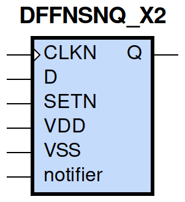
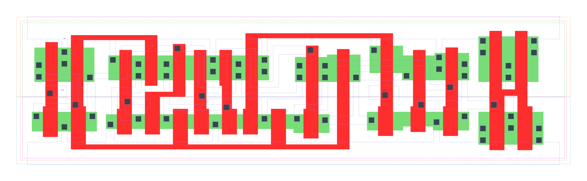

====================================
gf180mcu_fd_sc_mcu9t5v0__dffnsnq_x2
====================================

**gf180mcu_fd_sc_mcu9t5v0__dffnsnq_x2 symbol**

**gf180mcu_fd_sc_mcu9t5v0__dffnsnq_x2 schematic**

.. image:: sc9_sch/DFFNSNQ_X2_sch.png
    :height: 250px
    :width: 450 px
    :align: center
    :alt: gf180mcu_fd_sc_mcu9t5v0__dffnsnq_x2 schematic

**gf180mcu_fd_sc_mcu9t5v0__dffnsnq_x2 layout**

.. include:: images.rst
| DFFNSNQ_X2 is a negative edge triggered D-type flip flop with active low set and 2X drive strength

|
| Attributes

============= =======================
**Attribute** **Value**
area          107.251200 µm\ :sup:`2`
============= =======================

|

TRUTH TABLE

===== = ==== ======
Input        Output
SETN  D CLKN Q
H     L ↓    L
H     H ↓    H
L     X X    H
===== = ==== ======

|
| FUNCTIONAL SCHEMATIC
| |image224|
| CONSTRAINTS

================== =============== ============= ============
**Constraint Pin** **Related Pin** **setup(ns)** **hold(ns)**
D(HL)              CLKN(HL)        0.3090        0.0060
D(LH)              CLKN(HL)        0.1950        0.1030
================== =============== ============= ============

|

================== =============== ================ ===============
**Constraint Pin** **Related Pin** **recovery(ns)** **removal(ns)**
SETN(LH)           CLKN(HL)        0.1090           0.0970
================== =============== ================ ===============

|

================== =============== ===========================
**Constraint Pin** **Related Pin** **Minimum Pulse Width(ns)**
CLKN(LHL)          CLKN(LH)        0.4240
CLKN(LHL)          CLKN(LH)        0.3570
CLKN(HLH)          CLKN(HL)        0.4270
CLKN(HLH)          CLKN(HL)        0.4170
SETN(HLH)          SETN(HL)        0.3490
SETN(HLH)          SETN(HL)        0.3390
SETN(HLH)          SETN(HL)        0.3490
SETN(HLH)          SETN(HL)        0.3390
================== =============== ===========================

|
| PIN CAPACITANCE (pf)

======= ======== ====================
**Pin** **Type** **Capacitance (pf)**
CLKN    input    0.0051
D       input    0.0040
SETN    input    0.0090
======= ======== ====================

|
| DELAY AND OUTPUT TRANSITION TIME corresponding to min slew and load

+---------------+------------+--------------------+--------------+-------------------+----------------+---------------+
| **Input Pin** | **Output** | **When Condition** | **Tin (ns)** | **Out Load (pf)** | **Delay (ns)** | **Tout (ns)** |
+---------------+------------+--------------------+--------------+-------------------+----------------+---------------+
| CLKN(HL)      | Q(LH)      | D&SETN             | 0.0100       | 0.0010            | 0.6128         | 0.0342        |
+---------------+------------+--------------------+--------------+-------------------+----------------+---------------+
| CLKN(HL)      | Q(HL)      | !D&SETN            | 0.0100       | 0.0010            | 0.5928         | 0.0408        |
+---------------+------------+--------------------+--------------+-------------------+----------------+---------------+
| SETN(HL)      | Q(LH)      | !CLKN&!D           | 0.0100       | 0.0010            | 0.5102         | 0.0338        |
+---------------+------------+--------------------+--------------+-------------------+----------------+---------------+
| SETN(HL)      | Q(LH)      | CLKN&!D            | 0.0100       | 0.0010            | 0.4584         | 0.0337        |
+---------------+------------+--------------------+--------------+-------------------+----------------+---------------+
| SETN(HL)      | Q(LH)      | !CLKN&D            | 0.0100       | 0.0010            | 0.5102         | 0.0339        |
+---------------+------------+--------------------+--------------+-------------------+----------------+---------------+
| SETN(HL)      | Q(LH)      | CLKN&D             | 0.0100       | 0.0010            | 0.4585         | 0.0337        |
+---------------+------------+--------------------+--------------+-------------------+----------------+---------------+

|
| DYNAMIC ENERGY

+---------------+--------------------+--------------+------------+-------------------+---------------------+
| **Input Pin** | **When Condition** | **Tin (ns)** | **Output** | **Out Load (pf)** | **Energy (uW/MHz)** |
+---------------+--------------------+--------------+------------+-------------------+---------------------+
| SETN          | !CLKN&!D           | 0.0100       | Q(LH)      | 0.0010            | 1.0005              |
+---------------+--------------------+--------------+------------+-------------------+---------------------+
| SETN          | CLKN&!D            | 0.0100       | Q(LH)      | 0.0010            | 0.8706              |
+---------------+--------------------+--------------+------------+-------------------+---------------------+
| SETN          | !CLKN&D            | 0.0100       | Q(LH)      | 0.0010            | 1.0005              |
+---------------+--------------------+--------------+------------+-------------------+---------------------+
| SETN          | CLKN&D             | 0.0100       | Q(LH)      | 0.0010            | 0.7442              |
+---------------+--------------------+--------------+------------+-------------------+---------------------+
| CLKN          | D&SETN             | 0.0100       | Q(LH)      | 0.0010            | 1.1914              |
+---------------+--------------------+--------------+------------+-------------------+---------------------+
| CLKN          | !D&SETN            | 0.0100       | Q(HL)      | 0.0010            | 1.1314              |
+---------------+--------------------+--------------+------------+-------------------+---------------------+
| SETN(HL)      | !CLKN&!D           | 0.0100       | n/a        | n/a               | 0.0750              |
+---------------+--------------------+--------------+------------+-------------------+---------------------+
| SETN(HL)      | CLKN&!D            | 0.0100       | n/a        | n/a               | 0.1988              |
+---------------+--------------------+--------------+------------+-------------------+---------------------+
| SETN(HL)      | !CLKN&D            | 0.0100       | n/a        | n/a               | 0.0750              |
+---------------+--------------------+--------------+------------+-------------------+---------------------+
| SETN(HL)      | CLKN&D             | 0.0100       | n/a        | n/a               | 0.0749              |
+---------------+--------------------+--------------+------------+-------------------+---------------------+
| CLKN(LH)      | !D&!SETN           | 0.0100       | n/a        | n/a               | 0.4102              |
+---------------+--------------------+--------------+------------+-------------------+---------------------+
| CLKN(LH)      | D&!SETN            | 0.0100       | n/a        | n/a               | 0.3012              |
+---------------+--------------------+--------------+------------+-------------------+---------------------+
| CLKN(LH)      | !D&SETN            | 0.0100       | n/a        | n/a               | 0.3039              |
+---------------+--------------------+--------------+------------+-------------------+---------------------+
| CLKN(LH)      | D&SETN             | 0.0100       | n/a        | n/a               | 0.3011              |
+---------------+--------------------+--------------+------------+-------------------+---------------------+
| CLKN(HL)      | !D&!SETN           | 0.0100       | n/a        | n/a               | 0.4956              |
+---------------+--------------------+--------------+------------+-------------------+---------------------+
| CLKN(HL)      | D&!SETN            | 0.0100       | n/a        | n/a               | 0.4131              |
+---------------+--------------------+--------------+------------+-------------------+---------------------+
| CLKN(HL)      | !D&SETN            | 0.0100       | n/a        | n/a               | 0.3992              |
+---------------+--------------------+--------------+------------+-------------------+---------------------+
| CLKN(HL)      | D&SETN             | 0.0100       | n/a        | n/a               | 0.4131              |
+---------------+--------------------+--------------+------------+-------------------+---------------------+
| D(HL)         | !CLKN&!SETN        | 0.0100       | n/a        | n/a               | 0.0941              |
+---------------+--------------------+--------------+------------+-------------------+---------------------+
| D(HL)         | CLKN&!SETN         | 0.0100       | n/a        | n/a               | 0.2094              |
+---------------+--------------------+--------------+------------+-------------------+---------------------+
| D(HL)         | !CLKN&SETN         | 0.0100       | n/a        | n/a               | 0.0940              |
+---------------+--------------------+--------------+------------+-------------------+---------------------+
| D(HL)         | CLKN&SETN          | 0.0100       | n/a        | n/a               | 0.3138              |
+---------------+--------------------+--------------+------------+-------------------+---------------------+
| D(LH)         | !CLKN&!SETN        | 0.0100       | n/a        | n/a               | 0.0064              |
+---------------+--------------------+--------------+------------+-------------------+---------------------+
| D(LH)         | CLKN&!SETN         | 0.0100       | n/a        | n/a               | 0.0869              |
+---------------+--------------------+--------------+------------+-------------------+---------------------+
| D(LH)         | !CLKN&SETN         | 0.0100       | n/a        | n/a               | 0.0064              |
+---------------+--------------------+--------------+------------+-------------------+---------------------+
| D(LH)         | CLKN&SETN          | 0.0100       | n/a        | n/a               | 0.2463              |
+---------------+--------------------+--------------+------------+-------------------+---------------------+
| SETN(LH)      | !CLKN&!D           | 0.0100       | n/a        | n/a               | -0.0475             |
+---------------+--------------------+--------------+------------+-------------------+---------------------+
| SETN(LH)      | !CLKN&D            | 0.0100       | n/a        | n/a               | -0.0475             |
+---------------+--------------------+--------------+------------+-------------------+---------------------+
| SETN(LH)      | CLKN&!D            | 0.0100       | n/a        | n/a               | 0.0395              |
+---------------+--------------------+--------------+------------+-------------------+---------------------+
| SETN(LH)      | CLKN&D             | 0.0100       | n/a        | n/a               | -0.0475             |
+---------------+--------------------+--------------+------------+-------------------+---------------------+

|
| LEAKAGE POWER

================== ==============
**When Condition** **Power (nW)**
!CLKN&!D&!SETN     0.4695
!CLKN&D&!SETN      0.4712
CLKN&!D&!SETN      0.4313
CLKN&D&!SETN       0.4328
!CLKN&!D&SETN      0.5710
CLKN&!D&SETN       0.7055
CLKN&D&SETN        0.6718
!CLKN&D&SETN       0.7206
================== ==============

