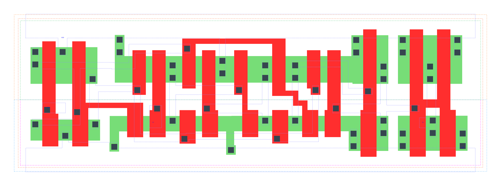

====================================
gf180mcu_fd_sc_mcu9t5v0__dffq_x2
====================================

**gf180mcu_fd_sc_mcu9t5v0__dffq_x2 symbol**

.. image:: sc9_sym/DFFQ_X2_sym.png
    :height: 200px
    :width: 400 px
    :align: center
    :alt: gf180mcu_fd_sc_mcu9t5v0__dffq_x2 symbol

**gf180mcu_fd_sc_mcu9t5v0__dffq_x2 schematic**

.. image:: sc9_sch/DFFQ_X2_sch.png
    :height: 250px
    :width: 450 px
    :align: center
    :alt: gf180mcu_fd_sc_mcu9t5v0__dffq_x2 schematic

**gf180mcu_fd_sc_mcu9t5v0__dffq_x2 layout**

.. include:: images.rst
| DFFQ_X2 is a Poisitive edge triggered D-type flip flop with 2X drive strength

|
| Attributes

============= ======================
**Attribute** **Value**
area          84.672000 µm\ :sup:`2`
============= ======================

|

TRUTH TABLE

===== === ======
Input     Output
D     CLK Q
L     ↑   L
H     ↑   H
===== === ======

|
| FUNCTIONAL SCHEMATIC
| |image233|
| CONSTRAINTS

================== =============== ============= ============
**Constraint Pin** **Related Pin** **setup(ns)** **hold(ns)**
D(LH)              CLK(LH)         0.1890        0.0170
D(HL)              CLK(LH)         0.1370        0.1200
================== =============== ============= ============

|

================== =============== ===========================
**Constraint Pin** **Related Pin** **Minimum Pulse Width(ns)**
CLK(LHL)           CLK(LH)         0.2800
CLK(LHL)           CLK(LH)         0.3490
CLK(HLH)           CLK(HL)         0.3940
CLK(HLH)           CLK(HL)         0.3150
================== =============== ===========================

|
| PIN CAPACITANCE (pf)

======= ======== ====================
**Pin** **Type** **Capacitance (pf)**
CLK     input    0.0050
D       input    0.0039
======= ======== ====================

|
| DELAY AND OUTPUT TRANSITION TIME corresponding to min slew and load

+---------------+------------+--------------------+--------------+-------------------+----------------+---------------+
| **Input Pin** | **Output** | **When Condition** | **Tin (ns)** | **Out Load (pf)** | **Delay (ns)** | **Tout (ns)** |
+---------------+------------+--------------------+--------------+-------------------+----------------+---------------+
| CLK(LH)       | Q(HL)      | !D                 | 0.0100       | 0.0010            | 0.5404         | 0.0292        |
+---------------+------------+--------------------+--------------+-------------------+----------------+---------------+
| CLK(LH)       | Q(LH)      | D                  | 0.0100       | 0.0010            | 0.5033         | 0.0290        |
+---------------+------------+--------------------+--------------+-------------------+----------------+---------------+

|
| DYNAMIC ENERGY

+---------------+--------------------+--------------+------------+-------------------+---------------------+
| **Input Pin** | **When Condition** | **Tin (ns)** | **Output** | **Out Load (pf)** | **Energy (uW/MHz)** |
+---------------+--------------------+--------------+------------+-------------------+---------------------+
| CLK           | !D                 | 0.0100       | Q(HL)      | 0.0010            | 0.9049              |
+---------------+--------------------+--------------+------------+-------------------+---------------------+
| CLK           | D                  | 0.0100       | Q(LH)      | 0.0010            | 0.8547              |
+---------------+--------------------+--------------+------------+-------------------+---------------------+
| D(LH)         | !CLK               | 0.0100       | n/a        | n/a               | 0.1496              |
+---------------+--------------------+--------------+------------+-------------------+---------------------+
| D(LH)         | CLK                | 0.0100       | n/a        | n/a               | -0.0240             |
+---------------+--------------------+--------------+------------+-------------------+---------------------+
| CLK(LH)       | !D                 | 0.0100       | n/a        | n/a               | 0.2620              |
+---------------+--------------------+--------------+------------+-------------------+---------------------+
| CLK(LH)       | D                  | 0.0100       | n/a        | n/a               | 0.2612              |
+---------------+--------------------+--------------+------------+-------------------+---------------------+
| D(HL)         | !CLK               | 0.0100       | n/a        | n/a               | 0.2364              |
+---------------+--------------------+--------------+------------+-------------------+---------------------+
| D(HL)         | CLK                | 0.0100       | n/a        | n/a               | 0.0223              |
+---------------+--------------------+--------------+------------+-------------------+---------------------+
| CLK(HL)       | !D                 | 0.0100       | n/a        | n/a               | 0.4056              |
+---------------+--------------------+--------------+------------+-------------------+---------------------+
| CLK(HL)       | D                  | 0.0100       | n/a        | n/a               | 0.4186              |
+---------------+--------------------+--------------+------------+-------------------+---------------------+

|
| LEAKAGE POWER

================== ==============
**When Condition** **Power (nW)**
!CLK&!D            0.3731
!CLK&D             0.4138
CLK&!D             0.5170
CLK&D              0.6259
================== ==============

