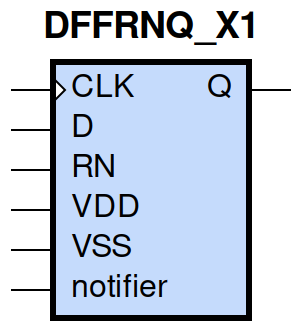
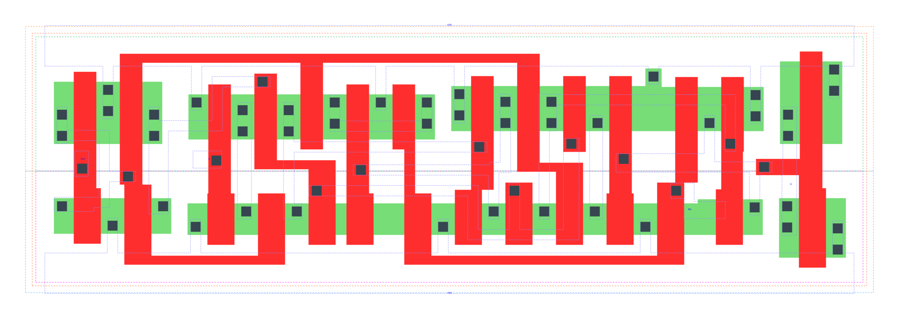

====================================
gf180mcu_fd_sc_mcu9t5v0__dffrnq_x1
====================================

**gf180mcu_fd_sc_mcu9t5v0__dffrnq_x1 symbol**

**gf180mcu_fd_sc_mcu9t5v0__dffrnq_x1 schematic**

.. image:: sc9_sch/DFFRNQ_X1_sch.png
    :height: 250px
    :width: 450 px
    :align: center
    :alt: gf180mcu_fd_sc_mcu9t5v0__dffrnq_x1 schematic

**gf180mcu_fd_sc_mcu9t5v0__dffrnq_x1 layout**

.. include:: images.rst
| DFFRNQ_X1 is a positive edge triggered D-type flip flop with active low reset and 1X drive strength

|
| Attributes

============= ======================
**Attribute** **Value**
area          90.316800 µm\ :sup:`2`
============= ======================

|

TRUTH TABLE

===== = === ======
Input       Output
RN    D CLK Q
H     L ↑   L
H     H ↑   H
L     X X   L
===== = === ======

|
| FUNCTIONAL SCHEMATIC
| |image239|
| CONSTRAINTS

================== =============== ============= ============
**Constraint Pin** **Related Pin** **setup(ns)** **hold(ns)**
D(HL)              CLK(LH)         0.1600        0.0630
D(LH)              CLK(LH)         0.2230        -0.0570
================== =============== ============= ============

|

================== =============== ================ ===============
**Constraint Pin** **Related Pin** **recovery(ns)** **removal(ns)**
RN(LH)             CLK(LH)         -0.2000          0.3550
================== =============== ================ ===============

|

================== =============== ===========================
**Constraint Pin** **Related Pin** **Minimum Pulse Width(ns)**
CLK(HLH)           CLK(HL)         0.3270
CLK(HLH)           CLK(HL)         0.3390
CLK(LHL)           CLK(LH)         0.3290
CLK(LHL)           CLK(LH)         0.3490
RN(HLH)            RN(HL)          0.3290
RN(HLH)            RN(HL)          0.3290
RN(HLH)            RN(HL)          0.3780
RN(HLH)            RN(HL)          0.3780
================== =============== ===========================

|
| PIN CAPACITANCE (pf)

======= ======== ====================
**Pin** **Type** **Capacitance (pf)**
CLK     input    0.0050
D       input    0.0041
RN      input    0.0083
======= ======== ====================

|
| DELAY AND OUTPUT TRANSITION TIME corresponding to min slew and load

+---------------+------------+--------------------+--------------+-------------------+----------------+---------------+
| **Input Pin** | **Output** | **When Condition** | **Tin (ns)** | **Out Load (pf)** | **Delay (ns)** | **Tout (ns)** |
+---------------+------------+--------------------+--------------+-------------------+----------------+---------------+
| CLK(LH)       | Q(HL)      | !D&RN              | 0.0100       | 0.0010            | 0.5526         | 0.0403        |
+---------------+------------+--------------------+--------------+-------------------+----------------+---------------+
| CLK(LH)       | Q(LH)      | D&RN               | 0.0100       | 0.0010            | 0.5626         | 0.0457        |
+---------------+------------+--------------------+--------------+-------------------+----------------+---------------+
| RN(HL)        | Q(HL)      | !CLK&!D            | 0.0100       | 0.0010            | 0.2251         | 0.0432        |
+---------------+------------+--------------------+--------------+-------------------+----------------+---------------+
| RN(HL)        | Q(HL)      | !CLK&D             | 0.0100       | 0.0010            | 0.2251         | 0.0433        |
+---------------+------------+--------------------+--------------+-------------------+----------------+---------------+
| RN(HL)        | Q(HL)      | CLK&!D             | 0.0100       | 0.0010            | 0.2251         | 0.0431        |
+---------------+------------+--------------------+--------------+-------------------+----------------+---------------+
| RN(HL)        | Q(HL)      | CLK&D              | 0.0100       | 0.0010            | 0.2251         | 0.0432        |
+---------------+------------+--------------------+--------------+-------------------+----------------+---------------+

|
| DYNAMIC ENERGY

+---------------+--------------------+--------------+------------+-------------------+---------------------+
| **Input Pin** | **When Condition** | **Tin (ns)** | **Output** | **Out Load (pf)** | **Energy (uW/MHz)** |
+---------------+--------------------+--------------+------------+-------------------+---------------------+
| CLK           | !D&RN              | 0.0100       | Q(HL)      | 0.0010            | 0.8161              |
+---------------+--------------------+--------------+------------+-------------------+---------------------+
| CLK           | D&RN               | 0.0100       | Q(LH)      | 0.0010            | 0.8200              |
+---------------+--------------------+--------------+------------+-------------------+---------------------+
| RN            | !CLK&!D            | 0.0100       | Q(HL)      | 0.0010            | 0.5646              |
+---------------+--------------------+--------------+------------+-------------------+---------------------+
| RN            | !CLK&D             | 0.0100       | Q(HL)      | 0.0010            | 0.5827              |
+---------------+--------------------+--------------+------------+-------------------+---------------------+
| RN            | CLK&!D             | 0.0100       | Q(HL)      | 0.0010            | 0.8887              |
+---------------+--------------------+--------------+------------+-------------------+---------------------+
| RN            | CLK&D              | 0.0100       | Q(HL)      | 0.0010            | 0.8887              |
+---------------+--------------------+--------------+------------+-------------------+---------------------+
| D(HL)         | !CLK&!RN           | 0.0100       | n/a        | n/a               | 0.3431              |
+---------------+--------------------+--------------+------------+-------------------+---------------------+
| D(HL)         | CLK&!RN            | 0.0100       | n/a        | n/a               | 0.0891              |
+---------------+--------------------+--------------+------------+-------------------+---------------------+
| D(HL)         | !CLK&RN            | 0.0100       | n/a        | n/a               | 0.3259              |
+---------------+--------------------+--------------+------------+-------------------+---------------------+
| D(HL)         | CLK&RN             | 0.0100       | n/a        | n/a               | 0.0890              |
+---------------+--------------------+--------------+------------+-------------------+---------------------+
| CLK(LH)       | !D&!RN             | 0.0100       | n/a        | n/a               | 0.3151              |
+---------------+--------------------+--------------+------------+-------------------+---------------------+
| CLK(LH)       | D&!RN              | 0.0100       | n/a        | n/a               | 0.6745              |
+---------------+--------------------+--------------+------------+-------------------+---------------------+
| CLK(LH)       | !D&RN              | 0.0100       | n/a        | n/a               | 0.3150              |
+---------------+--------------------+--------------+------------+-------------------+---------------------+
| CLK(LH)       | D&RN               | 0.0100       | n/a        | n/a               | 0.3044              |
+---------------+--------------------+--------------+------------+-------------------+---------------------+
| CLK(HL)       | !D&!RN             | 0.0100       | n/a        | n/a               | 0.3898              |
+---------------+--------------------+--------------+------------+-------------------+---------------------+
| CLK(HL)       | D&!RN              | 0.0100       | n/a        | n/a               | 0.5989              |
+---------------+--------------------+--------------+------------+-------------------+---------------------+
| CLK(HL)       | !D&RN              | 0.0100       | n/a        | n/a               | 0.3899              |
+---------------+--------------------+--------------+------------+-------------------+---------------------+
| CLK(HL)       | D&RN               | 0.0100       | n/a        | n/a               | 0.3913              |
+---------------+--------------------+--------------+------------+-------------------+---------------------+
| D(LH)         | !CLK&!RN           | 0.0100       | n/a        | n/a               | 0.2135              |
+---------------+--------------------+--------------+------------+-------------------+---------------------+
| D(LH)         | CLK&!RN            | 0.0100       | n/a        | n/a               | 0.0062              |
+---------------+--------------------+--------------+------------+-------------------+---------------------+
| D(LH)         | !CLK&RN            | 0.0100       | n/a        | n/a               | 0.2247              |
+---------------+--------------------+--------------+------------+-------------------+---------------------+
| D(LH)         | CLK&RN             | 0.0100       | n/a        | n/a               | 0.0063              |
+---------------+--------------------+--------------+------------+-------------------+---------------------+
| RN(HL)        | !CLK&!D            | 0.0100       | n/a        | n/a               | 0.0677              |
+---------------+--------------------+--------------+------------+-------------------+---------------------+
| RN(HL)        | !CLK&D             | 0.0100       | n/a        | n/a               | 0.0671              |
+---------------+--------------------+--------------+------------+-------------------+---------------------+
| RN(HL)        | CLK&!D             | 0.0100       | n/a        | n/a               | 0.0705              |
+---------------+--------------------+--------------+------------+-------------------+---------------------+
| RN(HL)        | CLK&D              | 0.0100       | n/a        | n/a               | 0.0702              |
+---------------+--------------------+--------------+------------+-------------------+---------------------+
| RN(LH)        | !CLK&!D            | 0.0100       | n/a        | n/a               | -0.0634             |
+---------------+--------------------+--------------+------------+-------------------+---------------------+
| RN(LH)        | !CLK&D             | 0.0100       | n/a        | n/a               | -0.0584             |
+---------------+--------------------+--------------+------------+-------------------+---------------------+
| RN(LH)        | CLK&!D             | 0.0100       | n/a        | n/a               | -0.0635             |
+---------------+--------------------+--------------+------------+-------------------+---------------------+
| RN(LH)        | CLK&D              | 0.0100       | n/a        | n/a               | -0.0635             |
+---------------+--------------------+--------------+------------+-------------------+---------------------+

|
| LEAKAGE POWER

================== ==============
**When Condition** **Power (nW)**
!CLK&!D&!RN        0.4102
!CLK&D&!RN         0.4104
CLK&!D&!RN         0.4503
CLK&D&!RN          0.4530
!CLK&!D&RN         0.4104
!CLK&D&RN          0.5585
CLK&!D&RN          0.5000
CLK&D&RN           0.6407
================== ==============

