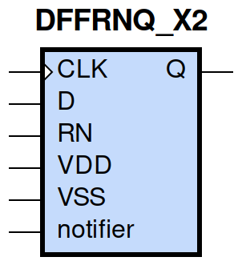
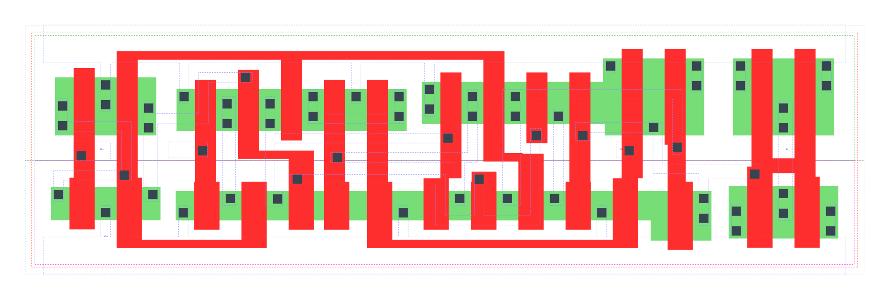

====================================
gf180mcu_fd_sc_mcu9t5v0__dffrnq_x2
====================================

**gf180mcu_fd_sc_mcu9t5v0__dffrnq_x2 symbol**

**gf180mcu_fd_sc_mcu9t5v0__dffrnq_x2 schematic**

.. image:: sc9_sch/DFFRNQ_X2_sch.png
    :height: 250px
    :width: 450 px
    :align: center
    :alt: gf180mcu_fd_sc_mcu9t5v0__dffrnq_x2 schematic

**gf180mcu_fd_sc_mcu9t5v0__dffrnq_x2 layout**

.. include:: images.rst
| DFFRNQ_X2 is a positive edge triggered D-type flip flop with active low reset and 2X drive strength

|
| Attributes

============= ======================
**Attribute** **Value**
area          95.961600 µm\ :sup:`2`
============= ======================

|

TRUTH TABLE

===== = === ======
Input       Output
RN    D CLK Q
H     L ↑   L
H     H ↑   H
L     X X   L
===== = === ======

|
| FUNCTIONAL SCHEMATIC
| |image242|
| CONSTRAINTS

================== =============== ============= ============
**Constraint Pin** **Related Pin** **setup(ns)** **hold(ns)**
D(HL)              CLK(LH)         0.1660        0.0690
D(LH)              CLK(LH)         0.2120        -0.0520
================== =============== ============= ============

|

================== =============== ================ ===============
**Constraint Pin** **Related Pin** **recovery(ns)** **removal(ns)**
RN(LH)             CLK(LH)         -0.1950          0.3380
================== =============== ================ ===============

|

================== =============== ===========================
**Constraint Pin** **Related Pin** **Minimum Pulse Width(ns)**
CLK(HLH)           CLK(HL)         0.3330
CLK(HLH)           CLK(HL)         0.3270
CLK(LHL)           CLK(LH)         0.3190
CLK(LHL)           CLK(LH)         0.4170
RN(HLH)            RN(HL)          0.2410
RN(HLH)            RN(HL)          0.2410
RN(HLH)            RN(HL)          0.3880
RN(HLH)            RN(HL)          0.3880
================== =============== ===========================

|
| PIN CAPACITANCE (pf)

======= ======== ====================
**Pin** **Type** **Capacitance (pf)**
CLK     input    0.0051
D       input    0.0041
RN      input    0.0097
======= ======== ====================

|
| DELAY AND OUTPUT TRANSITION TIME corresponding to min slew and load

+---------------+------------+--------------------+--------------+-------------------+----------------+---------------+
| **Input Pin** | **Output** | **When Condition** | **Tin (ns)** | **Out Load (pf)** | **Delay (ns)** | **Tout (ns)** |
+---------------+------------+--------------------+--------------+-------------------+----------------+---------------+
| CLK(LH)       | Q(HL)      | !D&RN              | 0.0100       | 0.0010            | 0.5351         | 0.0298        |
+---------------+------------+--------------------+--------------+-------------------+----------------+---------------+
| CLK(LH)       | Q(LH)      | D&RN               | 0.0100       | 0.0010            | 0.6368         | 0.0419        |
+---------------+------------+--------------------+--------------+-------------------+----------------+---------------+
| RN(HL)        | Q(HL)      | !CLK&!D            | 0.0100       | 0.0010            | 0.1755         | 0.0308        |
+---------------+------------+--------------------+--------------+-------------------+----------------+---------------+
| RN(HL)        | Q(HL)      | !CLK&D             | 0.0100       | 0.0010            | 0.1755         | 0.0308        |
+---------------+------------+--------------------+--------------+-------------------+----------------+---------------+
| RN(HL)        | Q(HL)      | CLK&!D             | 0.0100       | 0.0010            | 0.1756         | 0.0306        |
+---------------+------------+--------------------+--------------+-------------------+----------------+---------------+
| RN(HL)        | Q(HL)      | CLK&D              | 0.0100       | 0.0010            | 0.1756         | 0.0305        |
+---------------+------------+--------------------+--------------+-------------------+----------------+---------------+

|
| DYNAMIC ENERGY

+---------------+--------------------+--------------+------------+-------------------+---------------------+
| **Input Pin** | **When Condition** | **Tin (ns)** | **Output** | **Out Load (pf)** | **Energy (uW/MHz)** |
+---------------+--------------------+--------------+------------+-------------------+---------------------+
| CLK           | !D&RN              | 0.0100       | Q(HL)      | 0.0010            | 1.0103              |
+---------------+--------------------+--------------+------------+-------------------+---------------------+
| CLK           | D&RN               | 0.0100       | Q(LH)      | 0.0010            | 1.0971              |
+---------------+--------------------+--------------+------------+-------------------+---------------------+
| RN            | !CLK&!D            | 0.0100       | Q(HL)      | 0.0010            | 0.7846              |
+---------------+--------------------+--------------+------------+-------------------+---------------------+
| RN            | !CLK&D             | 0.0100       | Q(HL)      | 0.0010            | 0.8027              |
+---------------+--------------------+--------------+------------+-------------------+---------------------+
| RN            | CLK&!D             | 0.0100       | Q(HL)      | 0.0010            | 1.0969              |
+---------------+--------------------+--------------+------------+-------------------+---------------------+
| RN            | CLK&D              | 0.0100       | Q(HL)      | 0.0010            | 1.0969              |
+---------------+--------------------+--------------+------------+-------------------+---------------------+
| D(HL)         | !CLK&!RN           | 0.0100       | n/a        | n/a               | 0.3443              |
+---------------+--------------------+--------------+------------+-------------------+---------------------+
| D(HL)         | CLK&!RN            | 0.0100       | n/a        | n/a               | 0.0890              |
+---------------+--------------------+--------------+------------+-------------------+---------------------+
| D(HL)         | !CLK&RN            | 0.0100       | n/a        | n/a               | 0.3265              |
+---------------+--------------------+--------------+------------+-------------------+---------------------+
| D(HL)         | CLK&RN             | 0.0100       | n/a        | n/a               | 0.0890              |
+---------------+--------------------+--------------+------------+-------------------+---------------------+
| CLK(LH)       | !D&!RN             | 0.0100       | n/a        | n/a               | 0.3147              |
+---------------+--------------------+--------------+------------+-------------------+---------------------+
| CLK(LH)       | D&!RN              | 0.0100       | n/a        | n/a               | 0.6734              |
+---------------+--------------------+--------------+------------+-------------------+---------------------+
| CLK(LH)       | !D&RN              | 0.0100       | n/a        | n/a               | 0.3147              |
+---------------+--------------------+--------------+------------+-------------------+---------------------+
| CLK(LH)       | D&RN               | 0.0100       | n/a        | n/a               | 0.3042              |
+---------------+--------------------+--------------+------------+-------------------+---------------------+
| CLK(HL)       | !D&!RN             | 0.0100       | n/a        | n/a               | 0.3933              |
+---------------+--------------------+--------------+------------+-------------------+---------------------+
| CLK(HL)       | D&!RN              | 0.0100       | n/a        | n/a               | 0.6021              |
+---------------+--------------------+--------------+------------+-------------------+---------------------+
| CLK(HL)       | !D&RN              | 0.0100       | n/a        | n/a               | 0.3932              |
+---------------+--------------------+--------------+------------+-------------------+---------------------+
| CLK(HL)       | D&RN               | 0.0100       | n/a        | n/a               | 0.3949              |
+---------------+--------------------+--------------+------------+-------------------+---------------------+
| D(LH)         | !CLK&!RN           | 0.0100       | n/a        | n/a               | 0.2135              |
+---------------+--------------------+--------------+------------+-------------------+---------------------+
| D(LH)         | CLK&!RN            | 0.0100       | n/a        | n/a               | 0.0063              |
+---------------+--------------------+--------------+------------+-------------------+---------------------+
| D(LH)         | !CLK&RN            | 0.0100       | n/a        | n/a               | 0.2254              |
+---------------+--------------------+--------------+------------+-------------------+---------------------+
| D(LH)         | CLK&RN             | 0.0100       | n/a        | n/a               | 0.0063              |
+---------------+--------------------+--------------+------------+-------------------+---------------------+
| RN(HL)        | !CLK&!D            | 0.0100       | n/a        | n/a               | 0.0962              |
+---------------+--------------------+--------------+------------+-------------------+---------------------+
| RN(HL)        | !CLK&D             | 0.0100       | n/a        | n/a               | 0.0957              |
+---------------+--------------------+--------------+------------+-------------------+---------------------+
| RN(HL)        | CLK&!D             | 0.0100       | n/a        | n/a               | 0.0989              |
+---------------+--------------------+--------------+------------+-------------------+---------------------+
| RN(HL)        | CLK&D              | 0.0100       | n/a        | n/a               | 0.0987              |
+---------------+--------------------+--------------+------------+-------------------+---------------------+
| RN(LH)        | !CLK&!D            | 0.0100       | n/a        | n/a               | -0.0915             |
+---------------+--------------------+--------------+------------+-------------------+---------------------+
| RN(LH)        | !CLK&D             | 0.0100       | n/a        | n/a               | -0.0865             |
+---------------+--------------------+--------------+------------+-------------------+---------------------+
| RN(LH)        | CLK&!D             | 0.0100       | n/a        | n/a               | -0.0915             |
+---------------+--------------------+--------------+------------+-------------------+---------------------+
| RN(LH)        | CLK&D              | 0.0100       | n/a        | n/a               | -0.0915             |
+---------------+--------------------+--------------+------------+-------------------+---------------------+

|
| LEAKAGE POWER

================== ==============
**When Condition** **Power (nW)**
!CLK&!D&!RN        0.4371
!CLK&D&!RN         0.4373
CLK&!D&!RN         0.4771
CLK&D&!RN          0.4799
!CLK&!D&RN         0.4374
!CLK&D&RN          0.5853
CLK&!D&RN          0.5269
CLK&D&RN           0.6673
================== ==============

