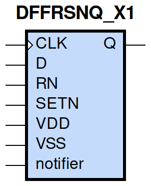

====================================
gf180mcu_fd_sc_mcu9t5v0__dffrsnq_x1
====================================

**gf180mcu_fd_sc_mcu9t5v0__dffrsnq_x1 symbol**

**gf180mcu_fd_sc_mcu9t5v0__dffrsnq_x1 schematic**

.. image:: sc9_sch/DFFRSNQ_X1_sch.png
    :height: 250px
    :width: 450 px
    :align: center
    :alt: gf180mcu_fd_sc_mcu9t5v0__dffrsnq_x1 schematic

**gf180mcu_fd_sc_mcu9t5v0__dffrsnq_x1 layout**

.. image:: sc9_lay/DFFRSNQ_X1_lay.png
    :height: 300px
    :width: 500 px
    :align: center
    :alt: gf180mcu_fd_sc_mcu9t5v0__dffrsnq_x1 layout

.. include:: images.rst
| DFFRSNQ_X1 is a positive edge triggered D-type flip flop with active low set/reset and 1X drive strength

|
| Attributes

============= =======================
**Attribute** **Value**
area          104.428800 µm\ :sup:`2`
============= =======================

|

TRUTH TABLE

===== ==== = === ======
Input            Output
RN    SETN D CLK Q
H     H    L ↑   L
H     H    H ↑   H
L     H    X X   L
H     L    X X   H
L     L    X X   L
===== ==== = === ======

|
| FUNCTIONAL SCHEMATIC
| |image248|
| CONSTRAINTS

================== =============== ============= ============
**Constraint Pin** **Related Pin** **setup(ns)** **hold(ns)**
D(HL)              CLK(LH)         0.2230        0.0740
D(LH)              CLK(LH)         0.2920        -0.0520
SETN(LH)           RN(LH)          -0.0110       0.0740
SETN(LH)           RN(LH)          -0.0400       0.0970
SETN(LH)           RN(LH)          -0.0110       0.0740
SETN(LH)           RN(LH)          -0.0400       0.0970
RN(LH)             SETN(LH)        0.0740        -0.0110
RN(LH)             SETN(LH)        0.0970        -0.0400
RN(LH)             SETN(LH)        0.0740        -0.0110
RN(LH)             SETN(LH)        0.0970        -0.0400
================== =============== ============= ============

|

================== =============== ================ ===============
**Constraint Pin** **Related Pin** **recovery(ns)** **removal(ns)**
SETN(LH)           CLK(LH)         0.0110           0.2290
RN(LH)             CLK(LH)         -0.2060          0.3550
================== =============== ================ ===============

|

================== =============== ===========================
**Constraint Pin** **Related Pin** **Minimum Pulse Width(ns)**
CLK(HLH)           CLK(HL)         0.4060
CLK(HLH)           CLK(HL)         0.4180
CLK(LHL)           CLK(LH)         0.3780
CLK(LHL)           CLK(LH)         0.3780
SETN(HLH)          SETN(HL)        0.3100
SETN(HLH)          SETN(HL)        0.3880
SETN(HLH)          SETN(HL)        0.3100
SETN(HLH)          SETN(HL)        0.3880
RN(HLH)            RN(HL)          0.2800
RN(HLH)            RN(HL)          0.3880
RN(HLH)            RN(HL)          0.2800
RN(HLH)            RN(HL)          0.3880
================== =============== ===========================

|
| PIN CAPACITANCE (pf)

======= ======== ====================
**Pin** **Type** **Capacitance (pf)**
CLK     input    0.0051
D       input    0.0039
SETN    input    0.0096
RN      input    0.0100
======= ======== ====================

|
| DELAY AND OUTPUT TRANSITION TIME corresponding to min slew and load

+---------------+------------+--------------------+--------------+-------------------+----------------+---------------+
| **Input Pin** | **Output** | **When Condition** | **Tin (ns)** | **Out Load (pf)** | **Delay (ns)** | **Tout (ns)** |
+---------------+------------+--------------------+--------------+-------------------+----------------+---------------+
| CLK(LH)       | Q(HL)      | !D&RN&SETN         | 0.0100       | 0.0010            | 0.5870         | 0.0374        |
+---------------+------------+--------------------+--------------+-------------------+----------------+---------------+
| CLK(LH)       | Q(LH)      | D&RN&SETN          | 0.0100       | 0.0010            | 0.5942         | 0.0456        |
+---------------+------------+--------------------+--------------+-------------------+----------------+---------------+
| SETN(HL)      | Q(LH)      | !CLK&!D&RN         | 0.0100       | 0.0010            | 0.4581         | 0.0445        |
+---------------+------------+--------------------+--------------+-------------------+----------------+---------------+
| SETN(HL)      | Q(LH)      | CLK&!D&RN          | 0.0100       | 0.0010            | 0.5546         | 0.0450        |
+---------------+------------+--------------------+--------------+-------------------+----------------+---------------+
| SETN(HL)      | Q(LH)      | !CLK&D&RN          | 0.0100       | 0.0010            | 0.4585         | 0.0444        |
+---------------+------------+--------------------+--------------+-------------------+----------------+---------------+
| SETN(HL)      | Q(LH)      | CLK&D&RN           | 0.0100       | 0.0010            | 0.5545         | 0.0449        |
+---------------+------------+--------------------+--------------+-------------------+----------------+---------------+
| RN(HL)        | Q(HL)      | !CLK&!D&SETN       | 0.0100       | 0.0010            | 0.1789         | 0.0355        |
+---------------+------------+--------------------+--------------+-------------------+----------------+---------------+
| RN(HL)        | Q(HL)      | CLK&!D&SETN        | 0.0100       | 0.0010            | 0.1792         | 0.0355        |
+---------------+------------+--------------------+--------------+-------------------+----------------+---------------+
| RN(HL)        | Q(HL)      | !CLK&D&SETN        | 0.0100       | 0.0010            | 0.1789         | 0.0356        |
+---------------+------------+--------------------+--------------+-------------------+----------------+---------------+
| RN(HL)        | Q(HL)      | CLK&D&SETN         | 0.0100       | 0.0010            | 0.1791         | 0.0354        |
+---------------+------------+--------------------+--------------+-------------------+----------------+---------------+
| RN(HL)        | Q(HL)      | !CLK&!D&!SETN      | 0.0100       | 0.0010            | 0.1789         | 0.0350        |
+---------------+------------+--------------------+--------------+-------------------+----------------+---------------+
| RN(HL)        | Q(HL)      | !CLK&D&!SETN       | 0.0100       | 0.0010            | 0.1789         | 0.0350        |
+---------------+------------+--------------------+--------------+-------------------+----------------+---------------+
| RN(HL)        | Q(HL)      | CLK&!D&!SETN       | 0.0100       | 0.0010            | 0.1790         | 0.0350        |
+---------------+------------+--------------------+--------------+-------------------+----------------+---------------+
| RN(HL)        | Q(HL)      | CLK&D&!SETN        | 0.0100       | 0.0010            | 0.1790         | 0.0350        |
+---------------+------------+--------------------+--------------+-------------------+----------------+---------------+
| RN(LH)        | Q(LH)      | !CLK&!D&!SETN      | 0.0100       | 0.0010            | 0.2463         | 0.0433        |
+---------------+------------+--------------------+--------------+-------------------+----------------+---------------+
| RN(LH)        | Q(LH)      | !CLK&D&!SETN       | 0.0100       | 0.0010            | 0.2463         | 0.0432        |
+---------------+------------+--------------------+--------------+-------------------+----------------+---------------+
| RN(LH)        | Q(LH)      | CLK&!D&!SETN       | 0.0100       | 0.0010            | 0.2486         | 0.0433        |
+---------------+------------+--------------------+--------------+-------------------+----------------+---------------+
| RN(LH)        | Q(LH)      | CLK&D&!SETN        | 0.0100       | 0.0010            | 0.2486         | 0.0433        |
+---------------+------------+--------------------+--------------+-------------------+----------------+---------------+

|
| DYNAMIC ENERGY

+---------------+--------------------+--------------+------------+-------------------+---------------------+
| **Input Pin** | **When Condition** | **Tin (ns)** | **Output** | **Out Load (pf)** | **Energy (uW/MHz)** |
+---------------+--------------------+--------------+------------+-------------------+---------------------+
| CLK           | !D&RN&SETN         | 0.0100       | Q(HL)      | 0.0010            | 0.8701              |
+---------------+--------------------+--------------+------------+-------------------+---------------------+
| CLK           | D&RN&SETN          | 0.0100       | Q(LH)      | 0.0010            | 0.9328              |
+---------------+--------------------+--------------+------------+-------------------+---------------------+
| SETN          | !CLK&!D&RN         | 0.0100       | Q(LH)      | 0.0010            | 0.7517              |
+---------------+--------------------+--------------+------------+-------------------+---------------------+
| SETN          | CLK&!D&RN          | 0.0100       | Q(LH)      | 0.0010            | 0.9020              |
+---------------+--------------------+--------------+------------+-------------------+---------------------+
| SETN          | !CLK&D&RN          | 0.0100       | Q(LH)      | 0.0010            | 0.6170              |
+---------------+--------------------+--------------+------------+-------------------+---------------------+
| SETN          | CLK&D&RN           | 0.0100       | Q(LH)      | 0.0010            | 0.9018              |
+---------------+--------------------+--------------+------------+-------------------+---------------------+
| RN            | !CLK&!D&SETN       | 0.0100       | Q(HL)      | 0.0010            | 0.5829              |
+---------------+--------------------+--------------+------------+-------------------+---------------------+
| RN            | CLK&!D&SETN        | 0.0100       | Q(HL)      | 0.0010            | 0.8814              |
+---------------+--------------------+--------------+------------+-------------------+---------------------+
| RN            | !CLK&D&SETN        | 0.0100       | Q(HL)      | 0.0010            | 0.5832              |
+---------------+--------------------+--------------+------------+-------------------+---------------------+
| RN            | CLK&D&SETN         | 0.0100       | Q(HL)      | 0.0010            | 0.8805              |
+---------------+--------------------+--------------+------------+-------------------+---------------------+
| RN            | !CLK&!D&!SETN      | 0.0100       | Q(HL)      | 0.0010            | 0.3843              |
+---------------+--------------------+--------------+------------+-------------------+---------------------+
| RN            | !CLK&D&!SETN       | 0.0100       | Q(HL)      | 0.0010            | 0.3820              |
+---------------+--------------------+--------------+------------+-------------------+---------------------+
| RN            | CLK&!D&!SETN       | 0.0100       | Q(HL)      | 0.0010            | 0.5651              |
+---------------+--------------------+--------------+------------+-------------------+---------------------+
| RN            | CLK&D&!SETN        | 0.0100       | Q(HL)      | 0.0010            | 0.5651              |
+---------------+--------------------+--------------+------------+-------------------+---------------------+
| RN            | !CLK&!D&!SETN      | 0.0100       | Q(LH)      | 0.0010            | 0.2217              |
+---------------+--------------------+--------------+------------+-------------------+---------------------+
| RN            | !CLK&D&!SETN       | 0.0100       | Q(LH)      | 0.0010            | 0.2238              |
+---------------+--------------------+--------------+------------+-------------------+---------------------+
| RN            | CLK&!D&!SETN       | 0.0100       | Q(LH)      | 0.0010            | 0.3623              |
+---------------+--------------------+--------------+------------+-------------------+---------------------+
| RN            | CLK&D&!SETN        | 0.0100       | Q(LH)      | 0.0010            | 0.3623              |
+---------------+--------------------+--------------+------------+-------------------+---------------------+
| SETN(HL)      | !CLK&!D&!RN        | 0.0100       | n/a        | n/a               | 0.4299              |
+---------------+--------------------+--------------+------------+-------------------+---------------------+
| SETN(HL)      | !CLK&D&!RN         | 0.0100       | n/a        | n/a               | 0.3055              |
+---------------+--------------------+--------------+------------+-------------------+---------------------+
| SETN(HL)      | CLK&!D&!RN         | 0.0100       | n/a        | n/a               | 0.4315              |
+---------------+--------------------+--------------+------------+-------------------+---------------------+
| SETN(HL)      | CLK&D&!RN          | 0.0100       | n/a        | n/a               | 0.4315              |
+---------------+--------------------+--------------+------------+-------------------+---------------------+
| SETN(HL)      | !CLK&!D&RN         | 0.0100       | n/a        | n/a               | 0.2186              |
+---------------+--------------------+--------------+------------+-------------------+---------------------+
| SETN(HL)      | CLK&!D&RN          | 0.0100       | n/a        | n/a               | 0.0845              |
+---------------+--------------------+--------------+------------+-------------------+---------------------+
| SETN(HL)      | !CLK&D&RN          | 0.0100       | n/a        | n/a               | 0.0844              |
+---------------+--------------------+--------------+------------+-------------------+---------------------+
| SETN(HL)      | CLK&D&RN           | 0.0100       | n/a        | n/a               | 0.0845              |
+---------------+--------------------+--------------+------------+-------------------+---------------------+
| D(HL)         | !CLK&!RN&!SETN     | 0.0100       | n/a        | n/a               | 0.2144              |
+---------------+--------------------+--------------+------------+-------------------+---------------------+
| D(HL)         | !CLK&!RN&SETN      | 0.0100       | n/a        | n/a               | 0.3317              |
+---------------+--------------------+--------------+------------+-------------------+---------------------+
| D(HL)         | CLK&!RN&!SETN      | 0.0100       | n/a        | n/a               | 0.0840              |
+---------------+--------------------+--------------+------------+-------------------+---------------------+
| D(HL)         | CLK&!RN&SETN       | 0.0100       | n/a        | n/a               | 0.0840              |
+---------------+--------------------+--------------+------------+-------------------+---------------------+
| D(HL)         | !CLK&RN&!SETN      | 0.0100       | n/a        | n/a               | 0.2144              |
+---------------+--------------------+--------------+------------+-------------------+---------------------+
| D(HL)         | CLK&RN&!SETN       | 0.0100       | n/a        | n/a               | 0.0840              |
+---------------+--------------------+--------------+------------+-------------------+---------------------+
| D(HL)         | !CLK&RN&SETN       | 0.0100       | n/a        | n/a               | 0.3187              |
+---------------+--------------------+--------------+------------+-------------------+---------------------+
| D(HL)         | CLK&RN&SETN        | 0.0100       | n/a        | n/a               | 0.0840              |
+---------------+--------------------+--------------+------------+-------------------+---------------------+
| CLK(LH)       | !D&!RN&!SETN       | 0.0100       | n/a        | n/a               | 0.3344              |
+---------------+--------------------+--------------+------------+-------------------+---------------------+
| CLK(LH)       | !D&!RN&SETN        | 0.0100       | n/a        | n/a               | 0.3154              |
+---------------+--------------------+--------------+------------+-------------------+---------------------+
| CLK(LH)       | D&!RN&!SETN        | 0.0100       | n/a        | n/a               | 0.4537              |
+---------------+--------------------+--------------+------------+-------------------+---------------------+
| CLK(LH)       | D&!RN&SETN         | 0.0100       | n/a        | n/a               | 0.6578              |
+---------------+--------------------+--------------+------------+-------------------+---------------------+
| CLK(LH)       | !D&RN&!SETN        | 0.0100       | n/a        | n/a               | 0.4254              |
+---------------+--------------------+--------------+------------+-------------------+---------------------+
| CLK(LH)       | D&RN&!SETN         | 0.0100       | n/a        | n/a               | 0.3360              |
+---------------+--------------------+--------------+------------+-------------------+---------------------+
| CLK(LH)       | !D&RN&SETN         | 0.0100       | n/a        | n/a               | 0.3154              |
+---------------+--------------------+--------------+------------+-------------------+---------------------+
| CLK(LH)       | D&RN&SETN          | 0.0100       | n/a        | n/a               | 0.3362              |
+---------------+--------------------+--------------+------------+-------------------+---------------------+
| CLK(HL)       | !D&!RN&!SETN       | 0.0100       | n/a        | n/a               | 0.4175              |
+---------------+--------------------+--------------+------------+-------------------+---------------------+
| CLK(HL)       | !D&!RN&SETN        | 0.0100       | n/a        | n/a               | 0.4108              |
+---------------+--------------------+--------------+------------+-------------------+---------------------+
| CLK(HL)       | D&!RN&!SETN        | 0.0100       | n/a        | n/a               | 0.4931              |
+---------------+--------------------+--------------+------------+-------------------+---------------------+
| CLK(HL)       | D&!RN&SETN         | 0.0100       | n/a        | n/a               | 0.6499              |
+---------------+--------------------+--------------+------------+-------------------+---------------------+
| CLK(HL)       | !D&RN&!SETN        | 0.0100       | n/a        | n/a               | 0.5879              |
+---------------+--------------------+--------------+------------+-------------------+---------------------+
| CLK(HL)       | D&RN&!SETN         | 0.0100       | n/a        | n/a               | 0.4119              |
+---------------+--------------------+--------------+------------+-------------------+---------------------+
| CLK(HL)       | !D&RN&SETN         | 0.0100       | n/a        | n/a               | 0.4108              |
+---------------+--------------------+--------------+------------+-------------------+---------------------+
| CLK(HL)       | D&RN&SETN          | 0.0100       | n/a        | n/a               | 0.4118              |
+---------------+--------------------+--------------+------------+-------------------+---------------------+
| D(LH)         | !CLK&!RN&!SETN     | 0.0100       | n/a        | n/a               | 0.0847              |
+---------------+--------------------+--------------+------------+-------------------+---------------------+
| D(LH)         | !CLK&!RN&SETN      | 0.0100       | n/a        | n/a               | 0.2448              |
+---------------+--------------------+--------------+------------+-------------------+---------------------+
| D(LH)         | CLK&!RN&!SETN      | 0.0100       | n/a        | n/a               | 0.0063              |
+---------------+--------------------+--------------+------------+-------------------+---------------------+
| D(LH)         | CLK&!RN&SETN       | 0.0100       | n/a        | n/a               | 0.0063              |
+---------------+--------------------+--------------+------------+-------------------+---------------------+
| D(LH)         | !CLK&RN&!SETN      | 0.0100       | n/a        | n/a               | 0.0847              |
+---------------+--------------------+--------------+------------+-------------------+---------------------+
| D(LH)         | CLK&RN&!SETN       | 0.0100       | n/a        | n/a               | 0.0063              |
+---------------+--------------------+--------------+------------+-------------------+---------------------+
| D(LH)         | !CLK&RN&SETN       | 0.0100       | n/a        | n/a               | 0.2545              |
+---------------+--------------------+--------------+------------+-------------------+---------------------+
| D(LH)         | CLK&RN&SETN        | 0.0100       | n/a        | n/a               | 0.0063              |
+---------------+--------------------+--------------+------------+-------------------+---------------------+
| RN(HL)        | !CLK&!D&SETN       | 0.0100       | n/a        | n/a               | 0.0808              |
+---------------+--------------------+--------------+------------+-------------------+---------------------+
| RN(HL)        | CLK&!D&SETN        | 0.0100       | n/a        | n/a               | 0.0831              |
+---------------+--------------------+--------------+------------+-------------------+---------------------+
| RN(HL)        | !CLK&D&SETN        | 0.0100       | n/a        | n/a               | 0.0799              |
+---------------+--------------------+--------------+------------+-------------------+---------------------+
| RN(HL)        | CLK&D&SETN         | 0.0100       | n/a        | n/a               | 0.0829              |
+---------------+--------------------+--------------+------------+-------------------+---------------------+
| RN(LH)        | !CLK&!D&SETN       | 0.0100       | n/a        | n/a               | -0.0766             |
+---------------+--------------------+--------------+------------+-------------------+---------------------+
| RN(LH)        | !CLK&D&SETN        | 0.0100       | n/a        | n/a               | -0.0716             |
+---------------+--------------------+--------------+------------+-------------------+---------------------+
| RN(LH)        | CLK&!D&SETN        | 0.0100       | n/a        | n/a               | -0.0766             |
+---------------+--------------------+--------------+------------+-------------------+---------------------+
| RN(LH)        | CLK&D&SETN         | 0.0100       | n/a        | n/a               | -0.0766             |
+---------------+--------------------+--------------+------------+-------------------+---------------------+
| SETN(LH)      | !CLK&!D&!RN        | 0.0100       | n/a        | n/a               | 0.1979              |
+---------------+--------------------+--------------+------------+-------------------+---------------------+
| SETN(LH)      | !CLK&D&!RN         | 0.0100       | n/a        | n/a               | 0.0989              |
+---------------+--------------------+--------------+------------+-------------------+---------------------+
| SETN(LH)      | CLK&!D&!RN         | 0.0100       | n/a        | n/a               | 0.1882              |
+---------------+--------------------+--------------+------------+-------------------+---------------------+
| SETN(LH)      | CLK&D&!RN          | 0.0100       | n/a        | n/a               | 0.1882              |
+---------------+--------------------+--------------+------------+-------------------+---------------------+
| SETN(LH)      | !CLK&!D&RN         | 0.0100       | n/a        | n/a               | 0.0252              |
+---------------+--------------------+--------------+------------+-------------------+---------------------+
| SETN(LH)      | !CLK&D&RN          | 0.0100       | n/a        | n/a               | -0.0613             |
+---------------+--------------------+--------------+------------+-------------------+---------------------+
| SETN(LH)      | CLK&!D&RN          | 0.0100       | n/a        | n/a               | -0.0613             |
+---------------+--------------------+--------------+------------+-------------------+---------------------+
| SETN(LH)      | CLK&D&RN           | 0.0100       | n/a        | n/a               | -0.0613             |
+---------------+--------------------+--------------+------------+-------------------+---------------------+

|
| LEAKAGE POWER

================== ==============
**When Condition** **Power (nW)**
!CLK&!D&!RN&!SETN  0.4459
!CLK&!D&!RN&SETN   0.4634
!CLK&D&!RN&!SETN   0.4477
!CLK&D&!RN&SETN    0.4774
CLK&!D&!RN&!SETN   0.5255
CLK&!D&!RN&SETN    0.5036
CLK&D&!RN&!SETN    0.5282
CLK&D&!RN&SETN     0.5063
CLK&D&RN&SETN      0.8019
!CLK&!D&RN&!SETN   0.4324
!CLK&D&RN&!SETN    0.4340
CLK&!D&RN&!SETN    0.4895
CLK&D&RN&!SETN     0.4913
!CLK&!D&RN&SETN    0.6846
!CLK&D&RN&SETN     0.6512
CLK&!D&RN&SETN     0.5444
================== ==============

