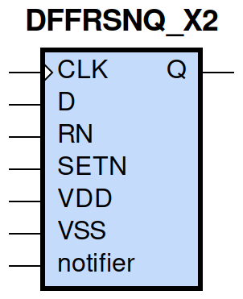
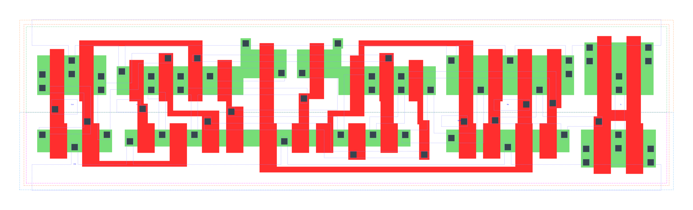

====================================
gf180mcu_fd_sc_mcu9t5v0__dffrsnq_x2
====================================

**gf180mcu_fd_sc_mcu9t5v0__dffrsnq_x2 symbol**

**gf180mcu_fd_sc_mcu9t5v0__dffrsnq_x2 schematic**

.. image:: sc9_sch/DFFRSNQ_X2_sch.png
    :height: 250px
    :width: 450 px
    :align: center
    :alt: gf180mcu_fd_sc_mcu9t5v0__dffrsnq_x2 schematic

**gf180mcu_fd_sc_mcu9t5v0__dffrsnq_x2 layout**

.. include:: images.rst
| DFFRSNQ_X2 is a positive edge triggered D-type flip flop with active low set/reset and 2X drive strength

|
| Attributes

============= =======================
**Attribute** **Value**
area          110.073600 µm\ :sup:`2`
============= =======================

|

TRUTH TABLE

===== ==== = === ======
Input            Output
RN    SETN D CLK Q
H     H    L ↑   L
H     H    H ↑   H
L     H    X X   L
H     L    X X   H
L     L    X X   L
===== ==== = === ======

|
| FUNCTIONAL SCHEMATIC
| |image251|
| CONSTRAINTS

================== =============== ============= ============
**Constraint Pin** **Related Pin** **setup(ns)** **hold(ns)**
D(HL)              CLK(LH)         0.2230        0.0800
D(LH)              CLK(LH)         0.2980        -0.0520
SETN(LH)           RN(LH)          -0.0460       0.1260
SETN(LH)           RN(LH)          -0.0460       0.1260
SETN(LH)           RN(LH)          -0.0460       0.1260
SETN(LH)           RN(LH)          -0.0460       0.1260
RN(LH)             SETN(LH)        0.1260        -0.0460
RN(LH)             SETN(LH)        0.1260        -0.0460
RN(LH)             SETN(LH)        0.1260        -0.0460
RN(LH)             SETN(LH)        0.1260        -0.0460
================== =============== ============= ============

|

================== =============== ================ ===============
**Constraint Pin** **Related Pin** **recovery(ns)** **removal(ns)**
SETN(LH)           CLK(LH)         0.0170           0.2290
RN(LH)             CLK(LH)         -0.1890          0.3550
================== =============== ================ ===============

|

================== =============== ===========================
**Constraint Pin** **Related Pin** **Minimum Pulse Width(ns)**
CLK(HLH)           CLK(HL)         0.4060
CLK(HLH)           CLK(HL)         0.4310
CLK(LHL)           CLK(LH)         0.4270
CLK(LHL)           CLK(LH)         0.4170
SETN(HLH)          SETN(HL)        0.3490
SETN(HLH)          SETN(HL)        0.4070
SETN(HLH)          SETN(HL)        0.3490
SETN(HLH)          SETN(HL)        0.4070
RN(HLH)            RN(HL)          0.2800
RN(HLH)            RN(HL)          0.3880
RN(HLH)            RN(HL)          0.2800
RN(HLH)            RN(HL)          0.3880
================== =============== ===========================

|
| PIN CAPACITANCE (pf)

======= ======== ====================
**Pin** **Type** **Capacitance (pf)**
CLK     input    0.0051
D       input    0.0039
SETN    input    0.0095
RN      input    0.0100
======= ======== ====================

|
| DELAY AND OUTPUT TRANSITION TIME corresponding to min slew and load

+---------------+------------+--------------------+--------------+-------------------+----------------+---------------+
| **Input Pin** | **Output** | **When Condition** | **Tin (ns)** | **Out Load (pf)** | **Delay (ns)** | **Tout (ns)** |
+---------------+------------+--------------------+--------------+-------------------+----------------+---------------+
| CLK(LH)       | Q(HL)      | !D&RN&SETN         | 0.0100       | 0.0010            | 0.6201         | 0.0376        |
+---------------+------------+--------------------+--------------+-------------------+----------------+---------------+
| CLK(LH)       | Q(LH)      | D&RN&SETN          | 0.0100       | 0.0010            | 0.6464         | 0.0430        |
+---------------+------------+--------------------+--------------+-------------------+----------------+---------------+
| SETN(HL)      | Q(LH)      | !CLK&!D&RN         | 0.0100       | 0.0010            | 0.5079         | 0.0419        |
+---------------+------------+--------------------+--------------+-------------------+----------------+---------------+
| SETN(HL)      | Q(LH)      | CLK&!D&RN          | 0.0100       | 0.0010            | 0.6039         | 0.0426        |
+---------------+------------+--------------------+--------------+-------------------+----------------+---------------+
| SETN(HL)      | Q(LH)      | !CLK&D&RN          | 0.0100       | 0.0010            | 0.5081         | 0.0419        |
+---------------+------------+--------------------+--------------+-------------------+----------------+---------------+
| SETN(HL)      | Q(LH)      | CLK&D&RN           | 0.0100       | 0.0010            | 0.6039         | 0.0426        |
+---------------+------------+--------------------+--------------+-------------------+----------------+---------------+
| RN(HL)        | Q(HL)      | !CLK&!D&SETN       | 0.0100       | 0.0010            | 0.2068         | 0.0359        |
+---------------+------------+--------------------+--------------+-------------------+----------------+---------------+
| RN(HL)        | Q(HL)      | CLK&!D&SETN        | 0.0100       | 0.0010            | 0.2068         | 0.0358        |
+---------------+------------+--------------------+--------------+-------------------+----------------+---------------+
| RN(HL)        | Q(HL)      | !CLK&D&SETN        | 0.0100       | 0.0010            | 0.2068         | 0.0359        |
+---------------+------------+--------------------+--------------+-------------------+----------------+---------------+
| RN(HL)        | Q(HL)      | CLK&D&SETN         | 0.0100       | 0.0010            | 0.2068         | 0.0359        |
+---------------+------------+--------------------+--------------+-------------------+----------------+---------------+
| RN(HL)        | Q(HL)      | !CLK&!D&!SETN      | 0.0100       | 0.0010            | 0.2066         | 0.0353        |
+---------------+------------+--------------------+--------------+-------------------+----------------+---------------+
| RN(HL)        | Q(HL)      | !CLK&D&!SETN       | 0.0100       | 0.0010            | 0.2066         | 0.0353        |
+---------------+------------+--------------------+--------------+-------------------+----------------+---------------+
| RN(HL)        | Q(HL)      | CLK&!D&!SETN       | 0.0100       | 0.0010            | 0.2066         | 0.0352        |
+---------------+------------+--------------------+--------------+-------------------+----------------+---------------+
| RN(HL)        | Q(HL)      | CLK&D&!SETN        | 0.0100       | 0.0010            | 0.2066         | 0.0352        |
+---------------+------------+--------------------+--------------+-------------------+----------------+---------------+
| RN(LH)        | Q(LH)      | !CLK&!D&!SETN      | 0.0100       | 0.0010            | 0.2935         | 0.0413        |
+---------------+------------+--------------------+--------------+-------------------+----------------+---------------+
| RN(LH)        | Q(LH)      | !CLK&D&!SETN       | 0.0100       | 0.0010            | 0.2935         | 0.0413        |
+---------------+------------+--------------------+--------------+-------------------+----------------+---------------+
| RN(LH)        | Q(LH)      | CLK&!D&!SETN       | 0.0100       | 0.0010            | 0.2968         | 0.0416        |
+---------------+------------+--------------------+--------------+-------------------+----------------+---------------+
| RN(LH)        | Q(LH)      | CLK&D&!SETN        | 0.0100       | 0.0010            | 0.2968         | 0.0416        |
+---------------+------------+--------------------+--------------+-------------------+----------------+---------------+

|
| DYNAMIC ENERGY

+---------------+--------------------+--------------+------------+-------------------+---------------------+
| **Input Pin** | **When Condition** | **Tin (ns)** | **Output** | **Out Load (pf)** | **Energy (uW/MHz)** |
+---------------+--------------------+--------------+------------+-------------------+---------------------+
| CLK           | !D&RN&SETN         | 0.0100       | Q(HL)      | 0.0010            | 1.0945              |
+---------------+--------------------+--------------+------------+-------------------+---------------------+
| CLK           | D&RN&SETN          | 0.0100       | Q(LH)      | 0.0010            | 1.1630              |
+---------------+--------------------+--------------+------------+-------------------+---------------------+
| SETN          | !CLK&!D&RN         | 0.0100       | Q(LH)      | 0.0010            | 0.9563              |
+---------------+--------------------+--------------+------------+-------------------+---------------------+
| SETN          | CLK&!D&RN          | 0.0100       | Q(LH)      | 0.0010            | 1.1079              |
+---------------+--------------------+--------------+------------+-------------------+---------------------+
| SETN          | !CLK&D&RN          | 0.0100       | Q(LH)      | 0.0010            | 0.8242              |
+---------------+--------------------+--------------+------------+-------------------+---------------------+
| SETN          | CLK&D&RN           | 0.0100       | Q(LH)      | 0.0010            | 1.1080              |
+---------------+--------------------+--------------+------------+-------------------+---------------------+
| RN            | !CLK&!D&SETN       | 0.0100       | Q(HL)      | 0.0010            | 0.7971              |
+---------------+--------------------+--------------+------------+-------------------+---------------------+
| RN            | CLK&!D&SETN        | 0.0100       | Q(HL)      | 0.0010            | 1.1042              |
+---------------+--------------------+--------------+------------+-------------------+---------------------+
| RN            | !CLK&D&SETN        | 0.0100       | Q(HL)      | 0.0010            | 0.7974              |
+---------------+--------------------+--------------+------------+-------------------+---------------------+
| RN            | CLK&D&SETN         | 0.0100       | Q(HL)      | 0.0010            | 1.1034              |
+---------------+--------------------+--------------+------------+-------------------+---------------------+
| RN            | !CLK&!D&!SETN      | 0.0100       | Q(HL)      | 0.0010            | 0.5875              |
+---------------+--------------------+--------------+------------+-------------------+---------------------+
| RN            | !CLK&D&!SETN       | 0.0100       | Q(HL)      | 0.0010            | 0.5852              |
+---------------+--------------------+--------------+------------+-------------------+---------------------+
| RN            | CLK&!D&!SETN       | 0.0100       | Q(HL)      | 0.0010            | 0.7703              |
+---------------+--------------------+--------------+------------+-------------------+---------------------+
| RN            | CLK&D&!SETN        | 0.0100       | Q(HL)      | 0.0010            | 0.7703              |
+---------------+--------------------+--------------+------------+-------------------+---------------------+
| RN            | !CLK&!D&!SETN      | 0.0100       | Q(LH)      | 0.0010            | 0.4268              |
+---------------+--------------------+--------------+------------+-------------------+---------------------+
| RN            | !CLK&D&!SETN       | 0.0100       | Q(LH)      | 0.0010            | 0.4290              |
+---------------+--------------------+--------------+------------+-------------------+---------------------+
| RN            | CLK&!D&!SETN       | 0.0100       | Q(LH)      | 0.0010            | 0.5683              |
+---------------+--------------------+--------------+------------+-------------------+---------------------+
| RN            | CLK&D&!SETN        | 0.0100       | Q(LH)      | 0.0010            | 0.5683              |
+---------------+--------------------+--------------+------------+-------------------+---------------------+
| SETN(HL)      | !CLK&!D&!RN        | 0.0100       | n/a        | n/a               | 0.4256              |
+---------------+--------------------+--------------+------------+-------------------+---------------------+
| SETN(HL)      | !CLK&D&!RN         | 0.0100       | n/a        | n/a               | 0.3033              |
+---------------+--------------------+--------------+------------+-------------------+---------------------+
| SETN(HL)      | CLK&!D&!RN         | 0.0100       | n/a        | n/a               | 0.4277              |
+---------------+--------------------+--------------+------------+-------------------+---------------------+
| SETN(HL)      | CLK&D&!RN          | 0.0100       | n/a        | n/a               | 0.4277              |
+---------------+--------------------+--------------+------------+-------------------+---------------------+
| SETN(HL)      | !CLK&!D&RN         | 0.0100       | n/a        | n/a               | 0.2164              |
+---------------+--------------------+--------------+------------+-------------------+---------------------+
| SETN(HL)      | CLK&!D&RN          | 0.0100       | n/a        | n/a               | 0.0845              |
+---------------+--------------------+--------------+------------+-------------------+---------------------+
| SETN(HL)      | !CLK&D&RN          | 0.0100       | n/a        | n/a               | 0.0844              |
+---------------+--------------------+--------------+------------+-------------------+---------------------+
| SETN(HL)      | CLK&D&RN           | 0.0100       | n/a        | n/a               | 0.0845              |
+---------------+--------------------+--------------+------------+-------------------+---------------------+
| D(HL)         | !CLK&!RN&!SETN     | 0.0100       | n/a        | n/a               | 0.2131              |
+---------------+--------------------+--------------+------------+-------------------+---------------------+
| D(HL)         | !CLK&!RN&SETN      | 0.0100       | n/a        | n/a               | 0.3301              |
+---------------+--------------------+--------------+------------+-------------------+---------------------+
| D(HL)         | CLK&!RN&!SETN      | 0.0100       | n/a        | n/a               | 0.0837              |
+---------------+--------------------+--------------+------------+-------------------+---------------------+
| D(HL)         | CLK&!RN&SETN       | 0.0100       | n/a        | n/a               | 0.0837              |
+---------------+--------------------+--------------+------------+-------------------+---------------------+
| D(HL)         | !CLK&RN&!SETN      | 0.0100       | n/a        | n/a               | 0.2131              |
+---------------+--------------------+--------------+------------+-------------------+---------------------+
| D(HL)         | CLK&RN&!SETN       | 0.0100       | n/a        | n/a               | 0.0837              |
+---------------+--------------------+--------------+------------+-------------------+---------------------+
| D(HL)         | !CLK&RN&SETN       | 0.0100       | n/a        | n/a               | 0.3172              |
+---------------+--------------------+--------------+------------+-------------------+---------------------+
| D(HL)         | CLK&RN&SETN        | 0.0100       | n/a        | n/a               | 0.0837              |
+---------------+--------------------+--------------+------------+-------------------+---------------------+
| CLK(LH)       | !D&!RN&!SETN       | 0.0100       | n/a        | n/a               | 0.3346              |
+---------------+--------------------+--------------+------------+-------------------+---------------------+
| CLK(LH)       | !D&!RN&SETN        | 0.0100       | n/a        | n/a               | 0.3148              |
+---------------+--------------------+--------------+------------+-------------------+---------------------+
| CLK(LH)       | D&!RN&!SETN        | 0.0100       | n/a        | n/a               | 0.4529              |
+---------------+--------------------+--------------+------------+-------------------+---------------------+
| CLK(LH)       | D&!RN&SETN         | 0.0100       | n/a        | n/a               | 0.6564              |
+---------------+--------------------+--------------+------------+-------------------+---------------------+
| CLK(LH)       | !D&RN&!SETN        | 0.0100       | n/a        | n/a               | 0.4248              |
+---------------+--------------------+--------------+------------+-------------------+---------------------+
| CLK(LH)       | D&RN&!SETN         | 0.0100       | n/a        | n/a               | 0.3356              |
+---------------+--------------------+--------------+------------+-------------------+---------------------+
| CLK(LH)       | !D&RN&SETN         | 0.0100       | n/a        | n/a               | 0.3146              |
+---------------+--------------------+--------------+------------+-------------------+---------------------+
| CLK(LH)       | D&RN&SETN          | 0.0100       | n/a        | n/a               | 0.3354              |
+---------------+--------------------+--------------+------------+-------------------+---------------------+
| CLK(HL)       | !D&!RN&!SETN       | 0.0100       | n/a        | n/a               | 0.4178              |
+---------------+--------------------+--------------+------------+-------------------+---------------------+
| CLK(HL)       | !D&!RN&SETN        | 0.0100       | n/a        | n/a               | 0.4111              |
+---------------+--------------------+--------------+------------+-------------------+---------------------+
| CLK(HL)       | D&!RN&!SETN        | 0.0100       | n/a        | n/a               | 0.4934              |
+---------------+--------------------+--------------+------------+-------------------+---------------------+
| CLK(HL)       | D&!RN&SETN         | 0.0100       | n/a        | n/a               | 0.6481              |
+---------------+--------------------+--------------+------------+-------------------+---------------------+
| CLK(HL)       | !D&RN&!SETN        | 0.0100       | n/a        | n/a               | 0.5874              |
+---------------+--------------------+--------------+------------+-------------------+---------------------+
| CLK(HL)       | D&RN&!SETN         | 0.0100       | n/a        | n/a               | 0.4123              |
+---------------+--------------------+--------------+------------+-------------------+---------------------+
| CLK(HL)       | !D&RN&SETN         | 0.0100       | n/a        | n/a               | 0.4110              |
+---------------+--------------------+--------------+------------+-------------------+---------------------+
| CLK(HL)       | D&RN&SETN          | 0.0100       | n/a        | n/a               | 0.4123              |
+---------------+--------------------+--------------+------------+-------------------+---------------------+
| D(LH)         | !CLK&!RN&!SETN     | 0.0100       | n/a        | n/a               | 0.0846              |
+---------------+--------------------+--------------+------------+-------------------+---------------------+
| D(LH)         | !CLK&!RN&SETN      | 0.0100       | n/a        | n/a               | 0.2426              |
+---------------+--------------------+--------------+------------+-------------------+---------------------+
| D(LH)         | CLK&!RN&!SETN      | 0.0100       | n/a        | n/a               | 0.0062              |
+---------------+--------------------+--------------+------------+-------------------+---------------------+
| D(LH)         | CLK&!RN&SETN       | 0.0100       | n/a        | n/a               | 0.0062              |
+---------------+--------------------+--------------+------------+-------------------+---------------------+
| D(LH)         | !CLK&RN&!SETN      | 0.0100       | n/a        | n/a               | 0.0846              |
+---------------+--------------------+--------------+------------+-------------------+---------------------+
| D(LH)         | CLK&RN&!SETN       | 0.0100       | n/a        | n/a               | 0.0062              |
+---------------+--------------------+--------------+------------+-------------------+---------------------+
| D(LH)         | !CLK&RN&SETN       | 0.0100       | n/a        | n/a               | 0.2522              |
+---------------+--------------------+--------------+------------+-------------------+---------------------+
| D(LH)         | CLK&RN&SETN        | 0.0100       | n/a        | n/a               | 0.0062              |
+---------------+--------------------+--------------+------------+-------------------+---------------------+
| RN(HL)        | !CLK&!D&SETN       | 0.0100       | n/a        | n/a               | 0.0808              |
+---------------+--------------------+--------------+------------+-------------------+---------------------+
| RN(HL)        | CLK&!D&SETN        | 0.0100       | n/a        | n/a               | 0.0831              |
+---------------+--------------------+--------------+------------+-------------------+---------------------+
| RN(HL)        | !CLK&D&SETN        | 0.0100       | n/a        | n/a               | 0.0796              |
+---------------+--------------------+--------------+------------+-------------------+---------------------+
| RN(HL)        | CLK&D&SETN         | 0.0100       | n/a        | n/a               | 0.0829              |
+---------------+--------------------+--------------+------------+-------------------+---------------------+
| RN(LH)        | !CLK&!D&SETN       | 0.0100       | n/a        | n/a               | -0.0766             |
+---------------+--------------------+--------------+------------+-------------------+---------------------+
| RN(LH)        | !CLK&D&SETN        | 0.0100       | n/a        | n/a               | -0.0714             |
+---------------+--------------------+--------------+------------+-------------------+---------------------+
| RN(LH)        | CLK&!D&SETN        | 0.0100       | n/a        | n/a               | -0.0766             |
+---------------+--------------------+--------------+------------+-------------------+---------------------+
| RN(LH)        | CLK&D&SETN         | 0.0100       | n/a        | n/a               | -0.0766             |
+---------------+--------------------+--------------+------------+-------------------+---------------------+
| SETN(LH)      | !CLK&!D&!RN        | 0.0100       | n/a        | n/a               | 0.1977              |
+---------------+--------------------+--------------+------------+-------------------+---------------------+
| SETN(LH)      | !CLK&D&!RN         | 0.0100       | n/a        | n/a               | 0.0989              |
+---------------+--------------------+--------------+------------+-------------------+---------------------+
| SETN(LH)      | CLK&!D&!RN         | 0.0100       | n/a        | n/a               | 0.1881              |
+---------------+--------------------+--------------+------------+-------------------+---------------------+
| SETN(LH)      | CLK&D&!RN          | 0.0100       | n/a        | n/a               | 0.1881              |
+---------------+--------------------+--------------+------------+-------------------+---------------------+
| SETN(LH)      | !CLK&!D&RN         | 0.0100       | n/a        | n/a               | 0.0252              |
+---------------+--------------------+--------------+------------+-------------------+---------------------+
| SETN(LH)      | !CLK&D&RN          | 0.0100       | n/a        | n/a               | -0.0613             |
+---------------+--------------------+--------------+------------+-------------------+---------------------+
| SETN(LH)      | CLK&!D&RN          | 0.0100       | n/a        | n/a               | -0.0613             |
+---------------+--------------------+--------------+------------+-------------------+---------------------+
| SETN(LH)      | CLK&D&RN           | 0.0100       | n/a        | n/a               | -0.0613             |
+---------------+--------------------+--------------+------------+-------------------+---------------------+

|
| LEAKAGE POWER

================== ==============
**When Condition** **Power (nW)**
!CLK&!D&!RN&!SETN  0.4728
!CLK&!D&!RN&SETN   0.4903
!CLK&D&!RN&!SETN   0.4745
!CLK&D&!RN&SETN    0.5042
CLK&!D&!RN&!SETN   0.5524
CLK&!D&!RN&SETN    0.5304
CLK&D&!RN&!SETN    0.5551
CLK&D&!RN&SETN     0.5331
CLK&D&RN&SETN      0.8286
!CLK&!D&RN&!SETN   0.4580
!CLK&D&RN&!SETN    0.4595
CLK&!D&RN&!SETN    0.5151
CLK&D&RN&!SETN     0.5168
!CLK&!D&RN&SETN    0.7100
!CLK&D&RN&SETN     0.6766
CLK&!D&RN&SETN     0.5713
================== ==============

