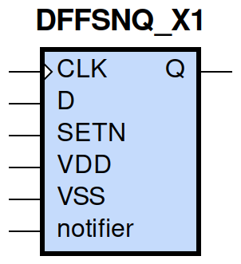
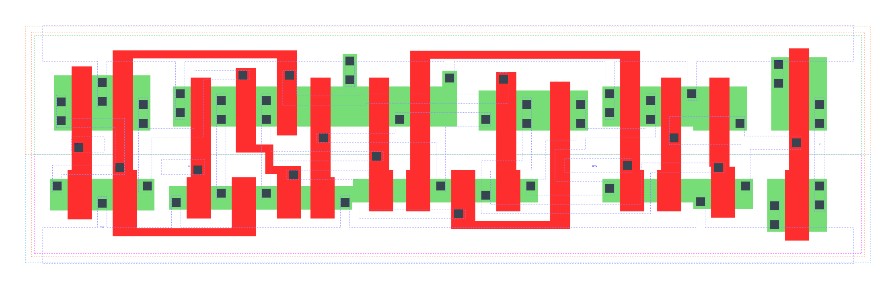

====================================
gf180mcu_fd_sc_mcu9t5v0__dffsnq_x1
====================================

**gf180mcu_fd_sc_mcu9t5v0__dffsnq_x1 symbol**

**gf180mcu_fd_sc_mcu9t5v0__dffsnq_x1 schematic**

.. image:: sc9_sch/DFFSNQ_X1_sch.png
    :height: 250px
    :width: 450 px
    :align: center
    :alt: gf180mcu_fd_sc_mcu9t5v0__dffsnq_x1 schematic

**gf180mcu_fd_sc_mcu9t5v0__dffsnq_x1 layout**

.. include:: images.rst
| DFFSNQ_X1 is a positive edge triggered D-type flip flop with active low set and 1X drive strength

|
| Attributes

============= =======================
**Attribute** **Value**
area          101.606400 µm\ :sup:`2`
============= =======================

|

TRUTH TABLE

===== = === ======
Input       Output
SETN  D CLK Q
H     L ↑   L
H     H ↑   H
L     X X   H
===== = === ======

|
| FUNCTIONAL SCHEMATIC
| |image257|
| CONSTRAINTS

================== =============== ============= ============
**Constraint Pin** **Related Pin** **setup(ns)** **hold(ns)**
D(HL)              CLK(LH)         0.2060        0.0400
D(LH)              CLK(LH)         0.2750        -0.0520
================== =============== ============= ============

|

================== =============== ================ ===============
**Constraint Pin** **Related Pin** **recovery(ns)** **removal(ns)**
SETN(LH)           CLK(LH)         0.0060           0.1720
================== =============== ================ ===============

|

================== =============== ===========================
**Constraint Pin** **Related Pin** **Minimum Pulse Width(ns)**
CLK(HLH)           CLK(HL)         0.3820
CLK(HLH)           CLK(HL)         0.3760
CLK(LHL)           CLK(LH)         0.3980
CLK(LHL)           CLK(LH)         0.3290
SETN(HLH)          SETN(HL)        0.3100
SETN(HLH)          SETN(HL)        0.3100
SETN(HLH)          SETN(HL)        0.3290
SETN(HLH)          SETN(HL)        0.3290
================== =============== ===========================

|
| PIN CAPACITANCE (pf)

======= ======== ====================
**Pin** **Type** **Capacitance (pf)**
CLK     input    0.0050
D       input    0.0040
SETN    input    0.0087
======= ======== ====================

|
| DELAY AND OUTPUT TRANSITION TIME corresponding to min slew and load

+---------------+------------+--------------------+--------------+-------------------+----------------+---------------+
| **Input Pin** | **Output** | **When Condition** | **Tin (ns)** | **Out Load (pf)** | **Delay (ns)** | **Tout (ns)** |
+---------------+------------+--------------------+--------------+-------------------+----------------+---------------+
| CLK(LH)       | Q(HL)      | !D&SETN            | 0.0100       | 0.0010            | 0.5916         | 0.0383        |
+---------------+------------+--------------------+--------------+-------------------+----------------+---------------+
| CLK(LH)       | Q(LH)      | D&SETN             | 0.0100       | 0.0010            | 0.5058         | 0.0364        |
+---------------+------------+--------------------+--------------+-------------------+----------------+---------------+
| SETN(HL)      | Q(LH)      | !CLK&!D            | 0.0100       | 0.0010            | 0.4289         | 0.0365        |
+---------------+------------+--------------------+--------------+-------------------+----------------+---------------+
| SETN(HL)      | Q(LH)      | !CLK&D             | 0.0100       | 0.0010            | 0.4292         | 0.0366        |
+---------------+------------+--------------------+--------------+-------------------+----------------+---------------+
| SETN(HL)      | Q(LH)      | CLK&!D             | 0.0100       | 0.0010            | 0.4614         | 0.0368        |
+---------------+------------+--------------------+--------------+-------------------+----------------+---------------+
| SETN(HL)      | Q(LH)      | CLK&D              | 0.0100       | 0.0010            | 0.4613         | 0.0368        |
+---------------+------------+--------------------+--------------+-------------------+----------------+---------------+

|
| DYNAMIC ENERGY

+---------------+--------------------+--------------+------------+-------------------+---------------------+
| **Input Pin** | **When Condition** | **Tin (ns)** | **Output** | **Out Load (pf)** | **Energy (uW/MHz)** |
+---------------+--------------------+--------------+------------+-------------------+---------------------+
| CLK           | !D&SETN            | 0.0100       | Q(HL)      | 0.0010            | 0.8127              |
+---------------+--------------------+--------------+------------+-------------------+---------------------+
| CLK           | D&SETN             | 0.0100       | Q(LH)      | 0.0010            | 0.8308              |
+---------------+--------------------+--------------+------------+-------------------+---------------------+
| SETN          | !CLK&!D            | 0.0100       | Q(LH)      | 0.0010            | 0.6899              |
+---------------+--------------------+--------------+------------+-------------------+---------------------+
| SETN          | !CLK&D             | 0.0100       | Q(LH)      | 0.0010            | 0.5737              |
+---------------+--------------------+--------------+------------+-------------------+---------------------+
| SETN          | CLK&!D             | 0.0100       | Q(LH)      | 0.0010            | 0.8156              |
+---------------+--------------------+--------------+------------+-------------------+---------------------+
| SETN          | CLK&D              | 0.0100       | Q(LH)      | 0.0010            | 0.8156              |
+---------------+--------------------+--------------+------------+-------------------+---------------------+
| SETN(HL)      | !CLK&!D            | 0.0100       | n/a        | n/a               | 0.1851              |
+---------------+--------------------+--------------+------------+-------------------+---------------------+
| SETN(HL)      | !CLK&D             | 0.0100       | n/a        | n/a               | 0.0708              |
+---------------+--------------------+--------------+------------+-------------------+---------------------+
| SETN(HL)      | CLK&!D             | 0.0100       | n/a        | n/a               | 0.0708              |
+---------------+--------------------+--------------+------------+-------------------+---------------------+
| SETN(HL)      | CLK&D              | 0.0100       | n/a        | n/a               | 0.0708              |
+---------------+--------------------+--------------+------------+-------------------+---------------------+
| D(HL)         | !CLK&!SETN         | 0.0100       | n/a        | n/a               | 0.2045              |
+---------------+--------------------+--------------+------------+-------------------+---------------------+
| D(HL)         | CLK&!SETN          | 0.0100       | n/a        | n/a               | 0.0853              |
+---------------+--------------------+--------------+------------+-------------------+---------------------+
| D(HL)         | !CLK&SETN          | 0.0100       | n/a        | n/a               | 0.3081              |
+---------------+--------------------+--------------+------------+-------------------+---------------------+
| D(HL)         | CLK&SETN           | 0.0100       | n/a        | n/a               | 0.0853              |
+---------------+--------------------+--------------+------------+-------------------+---------------------+
| CLK(LH)       | !D&!SETN           | 0.0100       | n/a        | n/a               | 0.3986              |
+---------------+--------------------+--------------+------------+-------------------+---------------------+
| CLK(LH)       | D&!SETN            | 0.0100       | n/a        | n/a               | 0.3067              |
+---------------+--------------------+--------------+------------+-------------------+---------------------+
| CLK(LH)       | !D&SETN            | 0.0100       | n/a        | n/a               | 0.2935              |
+---------------+--------------------+--------------+------------+-------------------+---------------------+
| CLK(LH)       | D&SETN             | 0.0100       | n/a        | n/a               | 0.3066              |
+---------------+--------------------+--------------+------------+-------------------+---------------------+
| CLK(HL)       | !D&!SETN           | 0.0100       | n/a        | n/a               | 0.5658              |
+---------------+--------------------+--------------+------------+-------------------+---------------------+
| CLK(HL)       | D&!SETN            | 0.0100       | n/a        | n/a               | 0.3921              |
+---------------+--------------------+--------------+------------+-------------------+---------------------+
| CLK(HL)       | !D&SETN            | 0.0100       | n/a        | n/a               | 0.3926              |
+---------------+--------------------+--------------+------------+-------------------+---------------------+
| CLK(HL)       | D&SETN             | 0.0100       | n/a        | n/a               | 0.3921              |
+---------------+--------------------+--------------+------------+-------------------+---------------------+
| D(LH)         | !CLK&!SETN         | 0.0100       | n/a        | n/a               | 0.0868              |
+---------------+--------------------+--------------+------------+-------------------+---------------------+
| D(LH)         | CLK&!SETN          | 0.0100       | n/a        | n/a               | 0.0085              |
+---------------+--------------------+--------------+------------+-------------------+---------------------+
| D(LH)         | !CLK&SETN          | 0.0100       | n/a        | n/a               | 0.2381              |
+---------------+--------------------+--------------+------------+-------------------+---------------------+
| D(LH)         | CLK&SETN           | 0.0100       | n/a        | n/a               | 0.0086              |
+---------------+--------------------+--------------+------------+-------------------+---------------------+
| SETN(LH)      | !CLK&!D            | 0.0100       | n/a        | n/a               | 0.0368              |
+---------------+--------------------+--------------+------------+-------------------+---------------------+
| SETN(LH)      | !CLK&D             | 0.0100       | n/a        | n/a               | -0.0486             |
+---------------+--------------------+--------------+------------+-------------------+---------------------+
| SETN(LH)      | CLK&!D             | 0.0100       | n/a        | n/a               | -0.0486             |
+---------------+--------------------+--------------+------------+-------------------+---------------------+
| SETN(LH)      | CLK&D              | 0.0100       | n/a        | n/a               | -0.0486             |
+---------------+--------------------+--------------+------------+-------------------+---------------------+

|
| LEAKAGE POWER

================== ==============
**When Condition** **Power (nW)**
!CLK&!D&!SETN      0.4057
!CLK&D&!SETN       0.4072
CLK&!D&!SETN       0.4439
CLK&D&!SETN        0.4457
!CLK&!D&SETN       0.6405
!CLK&D&SETN        0.6125
CLK&!D&SETN        0.5440
CLK&D&SETN         0.6538
================== ==============

