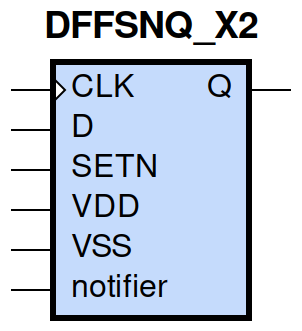
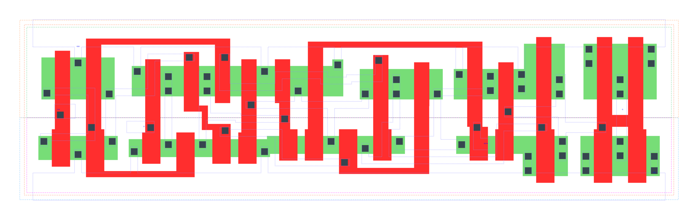

====================================
gf180mcu_fd_sc_mcu9t5v0__dffsnq_x2
====================================

**gf180mcu_fd_sc_mcu9t5v0__dffsnq_x2 symbol**

**gf180mcu_fd_sc_mcu9t5v0__dffsnq_x2 schematic**

.. image:: sc9_sch/DFFSNQ_X2_sch.png
    :height: 250px
    :width: 450 px
    :align: center
    :alt: gf180mcu_fd_sc_mcu9t5v0__dffsnq_x2 schematic

**gf180mcu_fd_sc_mcu9t5v0__dffsnq_x2 layout**

.. include:: images.rst
| DFFSNQ_X2 is a positivee edge triggered D-type flip flop with active low set and 2X drive strength

|
| Attributes

============= =======================
**Attribute** **Value**
area          104.428800 µm\ :sup:`2`
============= =======================

|

TRUTH TABLE

===== = === ======
Input       Output
SETN  D CLK Q
H     L ↑   L
H     H ↑   H
L     X X   H
===== = === ======

|
| FUNCTIONAL SCHEMATIC
| |image260|
| CONSTRAINTS

================== =============== ============= ============
**Constraint Pin** **Related Pin** **setup(ns)** **hold(ns)**
D(HL)              CLK(LH)         0.2180        0.0400
D(LH)              CLK(LH)         0.2690        -0.0400
================== =============== ============= ============

|

================== =============== ================ ===============
**Constraint Pin** **Related Pin** **recovery(ns)** **removal(ns)**
SETN(LH)           CLK(LH)         0.0110           0.1600
================== =============== ================ ===============

|

================== =============== ===========================
**Constraint Pin** **Related Pin** **Minimum Pulse Width(ns)**
CLK(HLH)           CLK(HL)         0.3880
CLK(HLH)           CLK(HL)         0.3760
CLK(LHL)           CLK(LH)         0.4170
CLK(LHL)           CLK(LH)         0.3580
SETN(HLH)          SETN(HL)        0.3390
SETN(HLH)          SETN(HL)        0.3390
SETN(HLH)          SETN(HL)        0.3490
SETN(HLH)          SETN(HL)        0.3490
================== =============== ===========================

|
| PIN CAPACITANCE (pf)

======= ======== ====================
**Pin** **Type** **Capacitance (pf)**
CLK     input    0.0049
D       input    0.0039
SETN    input    0.0085
======= ======== ====================

|
| DELAY AND OUTPUT TRANSITION TIME corresponding to min slew and load

+---------------+------------+--------------------+--------------+-------------------+----------------+---------------+
| **Input Pin** | **Output** | **When Condition** | **Tin (ns)** | **Out Load (pf)** | **Delay (ns)** | **Tout (ns)** |
+---------------+------------+--------------------+--------------+-------------------+----------------+---------------+
| CLK(LH)       | Q(HL)      | !D&SETN            | 0.0100       | 0.0010            | 0.6091         | 0.0321        |
+---------------+------------+--------------------+--------------+-------------------+----------------+---------------+
| CLK(LH)       | Q(LH)      | D&SETN             | 0.0100       | 0.0010            | 0.5219         | 0.0293        |
+---------------+------------+--------------------+--------------+-------------------+----------------+---------------+
| SETN(HL)      | Q(LH)      | !CLK&!D            | 0.0100       | 0.0010            | 0.4355         | 0.0291        |
+---------------+------------+--------------------+--------------+-------------------+----------------+---------------+
| SETN(HL)      | Q(LH)      | !CLK&D             | 0.0100       | 0.0010            | 0.4358         | 0.0295        |
+---------------+------------+--------------------+--------------+-------------------+----------------+---------------+
| SETN(HL)      | Q(LH)      | CLK&!D             | 0.0100       | 0.0010            | 0.4725         | 0.0294        |
+---------------+------------+--------------------+--------------+-------------------+----------------+---------------+
| SETN(HL)      | Q(LH)      | CLK&D              | 0.0100       | 0.0010            | 0.4725         | 0.0293        |
+---------------+------------+--------------------+--------------+-------------------+----------------+---------------+

|
| DYNAMIC ENERGY

+---------------+--------------------+--------------+------------+-------------------+---------------------+
| **Input Pin** | **When Condition** | **Tin (ns)** | **Output** | **Out Load (pf)** | **Energy (uW/MHz)** |
+---------------+--------------------+--------------+------------+-------------------+---------------------+
| CLK           | !D&SETN            | 0.0100       | Q(HL)      | 0.0010            | 1.0691              |
+---------------+--------------------+--------------+------------+-------------------+---------------------+
| CLK           | D&SETN             | 0.0100       | Q(LH)      | 0.0010            | 1.0378              |
+---------------+--------------------+--------------+------------+-------------------+---------------------+
| SETN          | !CLK&!D            | 0.0100       | Q(LH)      | 0.0010            | 0.8980              |
+---------------+--------------------+--------------+------------+-------------------+---------------------+
| SETN          | !CLK&D             | 0.0100       | Q(LH)      | 0.0010            | 0.7866              |
+---------------+--------------------+--------------+------------+-------------------+---------------------+
| SETN          | CLK&!D             | 0.0100       | Q(LH)      | 0.0010            | 1.0320              |
+---------------+--------------------+--------------+------------+-------------------+---------------------+
| SETN          | CLK&D              | 0.0100       | Q(LH)      | 0.0010            | 1.0322              |
+---------------+--------------------+--------------+------------+-------------------+---------------------+
| SETN(HL)      | !CLK&!D            | 0.0100       | n/a        | n/a               | 0.1804              |
+---------------+--------------------+--------------+------------+-------------------+---------------------+
| SETN(HL)      | !CLK&D             | 0.0100       | n/a        | n/a               | 0.0707              |
+---------------+--------------------+--------------+------------+-------------------+---------------------+
| SETN(HL)      | CLK&!D             | 0.0100       | n/a        | n/a               | 0.0708              |
+---------------+--------------------+--------------+------------+-------------------+---------------------+
| SETN(HL)      | CLK&D              | 0.0100       | n/a        | n/a               | 0.0708              |
+---------------+--------------------+--------------+------------+-------------------+---------------------+
| D(HL)         | !CLK&!SETN         | 0.0100       | n/a        | n/a               | 0.2056              |
+---------------+--------------------+--------------+------------+-------------------+---------------------+
| D(HL)         | CLK&!SETN          | 0.0100       | n/a        | n/a               | 0.0841              |
+---------------+--------------------+--------------+------------+-------------------+---------------------+
| D(HL)         | !CLK&SETN          | 0.0100       | n/a        | n/a               | 0.3109              |
+---------------+--------------------+--------------+------------+-------------------+---------------------+
| D(HL)         | CLK&SETN           | 0.0100       | n/a        | n/a               | 0.0841              |
+---------------+--------------------+--------------+------------+-------------------+---------------------+
| CLK(LH)       | !D&!SETN           | 0.0100       | n/a        | n/a               | 0.3922              |
+---------------+--------------------+--------------+------------+-------------------+---------------------+
| CLK(LH)       | D&!SETN            | 0.0100       | n/a        | n/a               | 0.3007              |
+---------------+--------------------+--------------+------------+-------------------+---------------------+
| CLK(LH)       | !D&SETN            | 0.0100       | n/a        | n/a               | 0.2873              |
+---------------+--------------------+--------------+------------+-------------------+---------------------+
| CLK(LH)       | D&SETN             | 0.0100       | n/a        | n/a               | 0.3004              |
+---------------+--------------------+--------------+------------+-------------------+---------------------+
| CLK(HL)       | !D&!SETN           | 0.0100       | n/a        | n/a               | 0.5616              |
+---------------+--------------------+--------------+------------+-------------------+---------------------+
| CLK(HL)       | D&!SETN            | 0.0100       | n/a        | n/a               | 0.3872              |
+---------------+--------------------+--------------+------------+-------------------+---------------------+
| CLK(HL)       | !D&SETN            | 0.0100       | n/a        | n/a               | 0.3877              |
+---------------+--------------------+--------------+------------+-------------------+---------------------+
| CLK(HL)       | D&SETN             | 0.0100       | n/a        | n/a               | 0.3872              |
+---------------+--------------------+--------------+------------+-------------------+---------------------+
| D(LH)         | !CLK&!SETN         | 0.0100       | n/a        | n/a               | 0.0900              |
+---------------+--------------------+--------------+------------+-------------------+---------------------+
| D(LH)         | CLK&!SETN          | 0.0100       | n/a        | n/a               | 0.0118              |
+---------------+--------------------+--------------+------------+-------------------+---------------------+
| D(LH)         | !CLK&SETN          | 0.0100       | n/a        | n/a               | 0.2357              |
+---------------+--------------------+--------------+------------+-------------------+---------------------+
| D(LH)         | CLK&SETN           | 0.0100       | n/a        | n/a               | 0.0117              |
+---------------+--------------------+--------------+------------+-------------------+---------------------+
| SETN(LH)      | !CLK&!D            | 0.0100       | n/a        | n/a               | 0.0370              |
+---------------+--------------------+--------------+------------+-------------------+---------------------+
| SETN(LH)      | !CLK&D             | 0.0100       | n/a        | n/a               | -0.0508             |
+---------------+--------------------+--------------+------------+-------------------+---------------------+
| SETN(LH)      | CLK&!D             | 0.0100       | n/a        | n/a               | -0.0507             |
+---------------+--------------------+--------------+------------+-------------------+---------------------+
| SETN(LH)      | CLK&D              | 0.0100       | n/a        | n/a               | -0.0507             |
+---------------+--------------------+--------------+------------+-------------------+---------------------+

|
| LEAKAGE POWER

================== ==============
**When Condition** **Power (nW)**
!CLK&!D&!SETN      0.4317
!CLK&D&!SETN       0.4332
CLK&!D&!SETN       0.4699
CLK&D&!SETN        0.4717
!CLK&!D&SETN       0.6615
!CLK&D&SETN        0.6273
CLK&!D&SETN        0.5716
CLK&D&SETN         0.6760
================== ==============

