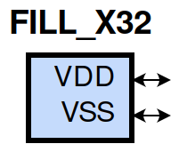

====================================
gf180mcu_fd_sc_mcu9t5v0__fill_x32
====================================

**gf180mcu_fd_sc_mcu9t5v0__fill_x32 symbol**

**gf180mcu_fd_sc_mcu9t5v0__fill_x32 schematic**

.. image:: sc9_sch/FILL_X32_sch.png
    :height: 250px
    :width: 450 px
    :align: center
    :alt: gf180mcu_fd_sc_mcu9t5v0__fill_x32 schematic

**gf180mcu_fd_sc_mcu9t5v0__fill_x32 layout**

.. include:: images.rst
| FILL_X32 is a filler whose cell width is 17.92um

|
| Attributes

============= ======================
**Attribute** **Value**
area          90.316800 µm\ :sup:`2`
============= ======================

|
| FUNCTIONAL SCHEMATIC
| |image332|
| LEAKAGE POWER

================== ==============
**When Condition** **Power (nW)**
default            0.0500
================== ==============

