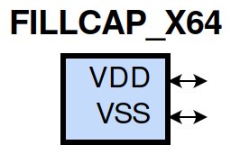
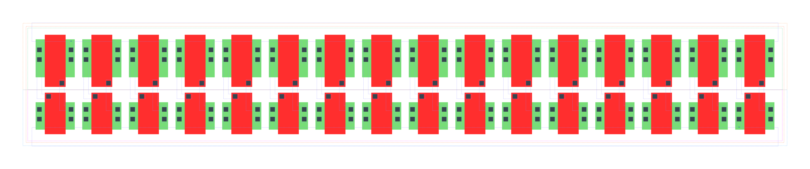

====================================
gf180mcu_fd_sc_mcu9t5v0__fillcap_x64
====================================

**gf180mcu_fd_sc_mcu9t5v0__fillcap_x64 symbol**

**gf180mcu_fd_sc_mcu9t5v0__fillcap_x64 schematic**

.. image:: sc9_sch/FILLCAP_X64_sch.png
    :height: 250px
    :width: 450 px
    :align: center
    :alt: gf180mcu_fd_sc_mcu9t5v0__fillcap_x64 schematic

**gf180mcu_fd_sc_mcu9t5v0__fillcap_x64 layout**

.. include:: images.rst
| FILLCAP_X64 is a filler whose cell width is 35.84um with decoupling cap between VDD and VSS

|
| Attributes

============= =======================
**Attribute** **Value**
area          180.633600 µm\ :sup:`2`
============= =======================

|
| FUNCTIONAL SCHEMATIC
| |image314|
| LEAKAGE POWER

================== ==============
**When Condition** **Power (nW)**
default            0.0500
================== ==============

