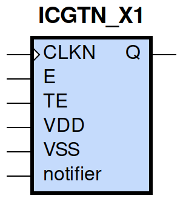
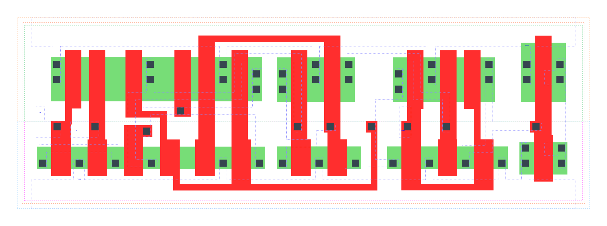

====================================
gf180mcu_fd_sc_mcu9t5v0__icgtn_x1
====================================

**gf180mcu_fd_sc_mcu9t5v0__icgtn_x1 symbol**

**gf180mcu_fd_sc_mcu9t5v0__icgtn_x1 schematic**

.. image:: sc9_sch/ICGTN_X1_sch.png
    :height: 250px
    :width: 450 px
    :align: center
    :alt: gf180mcu_fd_sc_mcu9t5v0__icgtn_x1 schematic

**gf180mcu_fd_sc_mcu9t5v0__icgtn_x1 layout**

.. include:: images.rst
| ICGTN_X1 is a negative-edge triggered clock-gating latch with 1X drive strength

|
| Attributes

============= =====================================
**Attribute** **Value**
area          true µm\ :sup:`2`
area          latch_negedge_precontrol µm\ :sup:`2`
area          true µm\ :sup:`2`
area          true µm\ :sup:`2`
area          84.672000 µm\ :sup:`2`
area          true µm\ :sup:`2`
============= =====================================

|

TRUTH TABLE

== = ==== ======== ======
TE E CLKN QDN(n+1) Q(n+1)
L  L H    H        H
L  H H    L        H
H  L H    L        H
H  H H    L        H
X  X L    QDN(n)   QDN(n)
== = ==== ======== ======

|
| FUNCTIONAL SCHEMATIC
| |image347|
| CONSTRAINTS

================== =============== ============= ============
**Constraint Pin** **Related Pin** **setup(ns)** **hold(ns)**
TE(LH)             CLKN(HL)        0.5100        -0.0690
TE(HL)             CLKN(HL)        0.4350        -0.4180
E(LH)              CLKN(HL)        0.4870        -0.0630
E(HL)              CLKN(HL)        0.4180        -0.3950
================== =============== ============= ============

|

================== =============== ===========================
**Constraint Pin** **Related Pin** **Minimum Pulse Width(ns)**
CLKN(LHL)          CLKN(LH)        0.4370
CLKN(LHL)          CLKN(LH)        0.6990
CLKN(LHL)          CLKN(LH)        0.6690
CLKN(LHL)          CLKN(LH)        0.6320
================== =============== ===========================

|
| PIN CAPACITANCE (pf)

======= ======== ====================
**Pin** **Type** **Capacitance (pf)**
TE      input    0.0047
E       input    0.0046
CLKN    input    0.0098
======= ======== ====================

|
| DELAY AND OUTPUT TRANSITION TIME corresponding to min slew and load

+---------------+------------+--------------------+--------------+-------------------+----------------+---------------+
| **Input Pin** | **Output** | **When Condition** | **Tin (ns)** | **Out Load (pf)** | **Delay (ns)** | **Tout (ns)** |
+---------------+------------+--------------------+--------------+-------------------+----------------+---------------+
| CLKN(HL)      | Q(HL)      | !E&TE              | 0.0100       | 0.0010            | 0.2061         | 0.0412        |
+---------------+------------+--------------------+--------------+-------------------+----------------+---------------+
| CLKN(HL)      | Q(HL)      | E&!TE              | 0.0100       | 0.0010            | 0.2061         | 0.0412        |
+---------------+------------+--------------------+--------------+-------------------+----------------+---------------+
| CLKN(HL)      | Q(HL)      | E&TE               | 0.0100       | 0.0010            | 0.2061         | 0.0412        |
+---------------+------------+--------------------+--------------+-------------------+----------------+---------------+
| CLKN(LH)      | Q(LH)      | !E&!TE             | 0.0100       | 0.0010            | 0.1338         | 0.0320        |
+---------------+------------+--------------------+--------------+-------------------+----------------+---------------+
| CLKN(LH)      | Q(LH)      | !E&TE              | 0.0100       | 0.0010            | 0.1340         | 0.0320        |
+---------------+------------+--------------------+--------------+-------------------+----------------+---------------+
| CLKN(LH)      | Q(LH)      | E&!TE              | 0.0100       | 0.0010            | 0.1340         | 0.0320        |
+---------------+------------+--------------------+--------------+-------------------+----------------+---------------+
| CLKN(LH)      | Q(LH)      | E&TE               | 0.0100       | 0.0010            | 0.1340         | 0.0320        |
+---------------+------------+--------------------+--------------+-------------------+----------------+---------------+

|
| DYNAMIC ENERGY

+---------------+--------------------+--------------+------------+-------------------+---------------------+
| **Input Pin** | **When Condition** | **Tin (ns)** | **Output** | **Out Load (pf)** | **Energy (uW/MHz)** |
+---------------+--------------------+--------------+------------+-------------------+---------------------+
| CLKN          | !E&TE              | 0.0100       | Q(HL)      | 0.0010            | 0.5986              |
+---------------+--------------------+--------------+------------+-------------------+---------------------+
| CLKN          | E&!TE              | 0.0100       | Q(HL)      | 0.0010            | 0.5977              |
+---------------+--------------------+--------------+------------+-------------------+---------------------+
| CLKN          | E&TE               | 0.0100       | Q(HL)      | 0.0010            | 0.5977              |
+---------------+--------------------+--------------+------------+-------------------+---------------------+
| CLKN          | !E&!TE             | 0.0100       | Q(LH)      | 0.0010            | 0.8947              |
+---------------+--------------------+--------------+------------+-------------------+---------------------+
| CLKN          | !E&TE              | 0.0100       | Q(LH)      | 0.0010            | 0.3300              |
+---------------+--------------------+--------------+------------+-------------------+---------------------+
| CLKN          | E&!TE              | 0.0100       | Q(LH)      | 0.0010            | 0.3306              |
+---------------+--------------------+--------------+------------+-------------------+---------------------+
| CLKN          | E&TE               | 0.0100       | Q(LH)      | 0.0010            | 0.3306              |
+---------------+--------------------+--------------+------------+-------------------+---------------------+
| E(LH)         | !CLKN&!TE          | 0.0100       | n/a        | n/a               | -0.0438             |
+---------------+--------------------+--------------+------------+-------------------+---------------------+
| E(LH)         | !CLKN&TE           | 0.0100       | n/a        | n/a               | -0.0176             |
+---------------+--------------------+--------------+------------+-------------------+---------------------+
| E(LH)         | CLKN&!TE           | 0.0100       | n/a        | n/a               | 0.4176              |
+---------------+--------------------+--------------+------------+-------------------+---------------------+
| E(LH)         | CLKN&TE            | 0.0100       | n/a        | n/a               | -0.0131             |
+---------------+--------------------+--------------+------------+-------------------+---------------------+
| CLKN(LH)      | !E&!TE             | 0.0100       | n/a        | n/a               | 0.1919              |
+---------------+--------------------+--------------+------------+-------------------+---------------------+
| CLKN(LH)      | !E&TE              | 0.0100       | n/a        | n/a               | 0.6679              |
+---------------+--------------------+--------------+------------+-------------------+---------------------+
| CLKN(LH)      | E&!TE              | 0.0100       | n/a        | n/a               | 0.6418              |
+---------------+--------------------+--------------+------------+-------------------+---------------------+
| CLKN(LH)      | E&TE               | 0.0100       | n/a        | n/a               | 0.6354              |
+---------------+--------------------+--------------+------------+-------------------+---------------------+
| TE(HL)        | !CLKN&!E           | 0.0100       | n/a        | n/a               | 0.0796              |
+---------------+--------------------+--------------+------------+-------------------+---------------------+
| TE(HL)        | CLKN&!E            | 0.0100       | n/a        | n/a               | 0.6644              |
+---------------+--------------------+--------------+------------+-------------------+---------------------+
| TE(HL)        | CLKN&E             | 0.0100       | n/a        | n/a               | 0.0445              |
+---------------+--------------------+--------------+------------+-------------------+---------------------+
| TE(HL)        | !CLKN&E            | 0.0100       | n/a        | n/a               | 0.0445              |
+---------------+--------------------+--------------+------------+-------------------+---------------------+
| CLKN(HL)      | !E&!TE             | 0.0100       | n/a        | n/a               | 0.3625              |
+---------------+--------------------+--------------+------------+-------------------+---------------------+
| E(HL)         | !CLKN&!TE          | 0.0100       | n/a        | n/a               | 0.0482              |
+---------------+--------------------+--------------+------------+-------------------+---------------------+
| E(HL)         | !CLKN&TE           | 0.0100       | n/a        | n/a               | 0.0188              |
+---------------+--------------------+--------------+------------+-------------------+---------------------+
| E(HL)         | CLKN&!TE           | 0.0100       | n/a        | n/a               | 0.6322              |
+---------------+--------------------+--------------+------------+-------------------+---------------------+
| E(HL)         | CLKN&TE            | 0.0100       | n/a        | n/a               | 0.0225              |
+---------------+--------------------+--------------+------------+-------------------+---------------------+
| TE(LH)        | !CLKN&!E           | 0.0100       | n/a        | n/a               | -0.0392             |
+---------------+--------------------+--------------+------------+-------------------+---------------------+
| TE(LH)        | CLKN&!E            | 0.0100       | n/a        | n/a               | 0.4409              |
+---------------+--------------------+--------------+------------+-------------------+---------------------+
| TE(LH)        | CLKN&E             | 0.0100       | n/a        | n/a               | -0.0390             |
+---------------+--------------------+--------------+------------+-------------------+---------------------+
| TE(LH)        | !CLKN&E            | 0.0100       | n/a        | n/a               | -0.0426             |
+---------------+--------------------+--------------+------------+-------------------+---------------------+

|
| LEAKAGE POWER

================== ==============
**When Condition** **Power (nW)**
!CLKN&!E&!TE       0.4793
!CLKN&!E&TE        0.4325
!CLKN&E&!TE        0.4069
!CLKN&E&TE         0.4069
CLKN&!E&!TE        0.3170
CLKN&!E&TE         0.3302
CLKN&E&!TE         0.2949
CLKN&E&TE          0.2949
================== ==============

