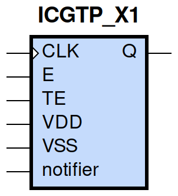
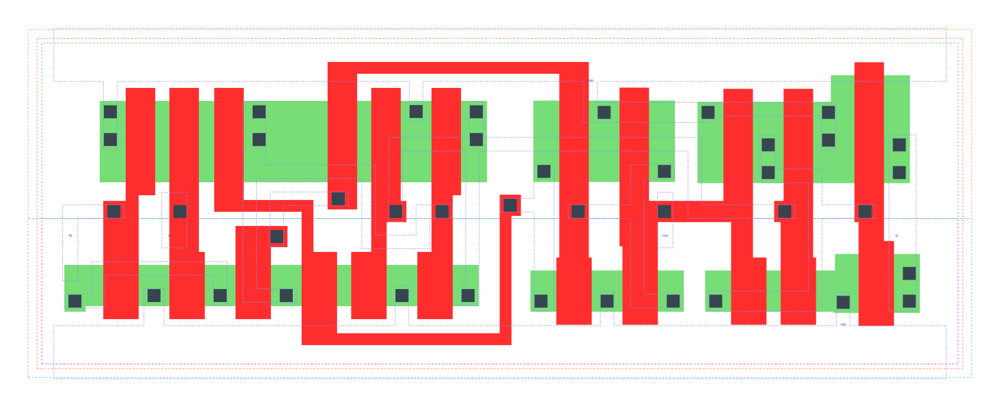

====================================
gf180mcu_fd_sc_mcu9t5v0__icgtp_x1
====================================

**gf180mcu_fd_sc_mcu9t5v0__icgtp_x1 symbol**

**gf180mcu_fd_sc_mcu9t5v0__icgtp_x1 schematic**

.. image:: sc9_sch/ICGTP_X1_sch.png
    :height: 250px
    :width: 450 px
    :align: center
    :alt: gf180mcu_fd_sc_mcu9t5v0__icgtp_x1 schematic

**gf180mcu_fd_sc_mcu9t5v0__icgtp_x1 layout**

.. include:: images.rst
| ICGTP_X1 is a positive-edge triggered clock-gating latch with 1X drive strength

|
| Attributes

============= =====================================
**Attribute** **Value**
area          76.204800 µm\ :sup:`2`
area          true µm\ :sup:`2`
area          true µm\ :sup:`2`
area          true µm\ :sup:`2`
area          true µm\ :sup:`2`
area          latch_posedge_precontrol µm\ :sup:`2`
============= =====================================

|

TRUTH TABLE

== = === ======= ======
TE E CLK QD(n+1) Q(n+1)
L  L L   L       L
L  H L   H       L
H  L L   H       L
H  H L   H       L
X  X H   QD(n)   QD(n)
== = === ======= ======

|
| FUNCTIONAL SCHEMATIC
| |image356|
| CONSTRAINTS

================== =============== ============= ============
**Constraint Pin** **Related Pin** **setup(ns)** **hold(ns)**
TE(HL)             CLK(LH)         0.3090        -0.2460
TE(LH)             CLK(LH)         0.4580        -0.2060
E(HL)              CLK(LH)         0.2920        -0.2290
E(LH)              CLK(LH)         0.4240        -0.1770
================== =============== ============= ============

|

================== =============== ===========================
**Constraint Pin** **Related Pin** **Minimum Pulse Width(ns)**
CLK(HLH)           CLK(HL)         0.4460
CLK(HLH)           CLK(HL)         0.5530
CLK(HLH)           CLK(HL)         0.5100
CLK(HLH)           CLK(HL)         0.4850
================== =============== ===========================

|
| PIN CAPACITANCE (pf)

======= ======== ====================
**Pin** **Type** **Capacitance (pf)**
TE      input    0.0048
E       input    0.0046
CLK     input    0.0097
======= ======== ====================

|
| DELAY AND OUTPUT TRANSITION TIME corresponding to min slew and load

+---------------+------------+--------------------+--------------+-------------------+----------------+---------------+
| **Input Pin** | **Output** | **When Condition** | **Tin (ns)** | **Out Load (pf)** | **Delay (ns)** | **Tout (ns)** |
+---------------+------------+--------------------+--------------+-------------------+----------------+---------------+
| CLK(LH)       | Q(LH)      | !E&TE              | 0.0100       | 0.0010            | 0.1815         | 0.0381        |
+---------------+------------+--------------------+--------------+-------------------+----------------+---------------+
| CLK(LH)       | Q(LH)      | E&!TE              | 0.0100       | 0.0010            | 0.1815         | 0.0381        |
+---------------+------------+--------------------+--------------+-------------------+----------------+---------------+
| CLK(LH)       | Q(LH)      | E&TE               | 0.0100       | 0.0010            | 0.1815         | 0.0381        |
+---------------+------------+--------------------+--------------+-------------------+----------------+---------------+
| CLK(HL)       | Q(HL)      | !E&!TE             | 0.0100       | 0.0010            | 0.1387         | 0.0292        |
+---------------+------------+--------------------+--------------+-------------------+----------------+---------------+
| CLK(HL)       | Q(HL)      | !E&TE              | 0.0100       | 0.0010            | 0.1387         | 0.0293        |
+---------------+------------+--------------------+--------------+-------------------+----------------+---------------+
| CLK(HL)       | Q(HL)      | E&!TE              | 0.0100       | 0.0010            | 0.1387         | 0.0293        |
+---------------+------------+--------------------+--------------+-------------------+----------------+---------------+
| CLK(HL)       | Q(HL)      | E&TE               | 0.0100       | 0.0010            | 0.1387         | 0.0293        |
+---------------+------------+--------------------+--------------+-------------------+----------------+---------------+

|
| DYNAMIC ENERGY

+---------------+--------------------+--------------+------------+-------------------+---------------------+
| **Input Pin** | **When Condition** | **Tin (ns)** | **Output** | **Out Load (pf)** | **Energy (uW/MHz)** |
+---------------+--------------------+--------------+------------+-------------------+---------------------+
| CLK           | !E&TE              | 0.0100       | Q(LH)      | 0.0010            | 0.3652              |
+---------------+--------------------+--------------+------------+-------------------+---------------------+
| CLK           | E&!TE              | 0.0100       | Q(LH)      | 0.0010            | 0.3641              |
+---------------+--------------------+--------------+------------+-------------------+---------------------+
| CLK           | E&TE               | 0.0100       | Q(LH)      | 0.0010            | 0.3641              |
+---------------+--------------------+--------------+------------+-------------------+---------------------+
| CLK           | !E&!TE             | 0.0100       | Q(HL)      | 0.0010            | 0.9582              |
+---------------+--------------------+--------------+------------+-------------------+---------------------+
| CLK           | !E&TE              | 0.0100       | Q(HL)      | 0.0010            | 0.5531              |
+---------------+--------------------+--------------+------------+-------------------+---------------------+
| CLK           | E&!TE              | 0.0100       | Q(HL)      | 0.0010            | 0.5536              |
+---------------+--------------------+--------------+------------+-------------------+---------------------+
| CLK           | E&TE               | 0.0100       | Q(HL)      | 0.0010            | 0.5537              |
+---------------+--------------------+--------------+------------+-------------------+---------------------+
| E(LH)         | !CLK&!TE           | 0.0100       | n/a        | n/a               | 0.3293              |
+---------------+--------------------+--------------+------------+-------------------+---------------------+
| E(LH)         | !CLK&TE            | 0.0100       | n/a        | n/a               | -0.0128             |
+---------------+--------------------+--------------+------------+-------------------+---------------------+
| E(LH)         | CLK&!TE            | 0.0100       | n/a        | n/a               | -0.0439             |
+---------------+--------------------+--------------+------------+-------------------+---------------------+
| E(LH)         | CLK&TE             | 0.0100       | n/a        | n/a               | -0.0177             |
+---------------+--------------------+--------------+------------+-------------------+---------------------+
| CLK(LH)       | !E&!TE             | 0.0100       | n/a        | n/a               | 0.1778              |
+---------------+--------------------+--------------+------------+-------------------+---------------------+
| TE(HL)        | !CLK&!E            | 0.0100       | n/a        | n/a               | 0.4895              |
+---------------+--------------------+--------------+------------+-------------------+---------------------+
| TE(HL)        | !CLK&E             | 0.0100       | n/a        | n/a               | 0.0445              |
+---------------+--------------------+--------------+------------+-------------------+---------------------+
| TE(HL)        | CLK&!E             | 0.0100       | n/a        | n/a               | 0.0787              |
+---------------+--------------------+--------------+------------+-------------------+---------------------+
| TE(HL)        | CLK&E              | 0.0100       | n/a        | n/a               | 0.0446              |
+---------------+--------------------+--------------+------------+-------------------+---------------------+
| TE(LH)        | !CLK&!E            | 0.0100       | n/a        | n/a               | 0.3523              |
+---------------+--------------------+--------------+------------+-------------------+---------------------+
| TE(LH)        | !CLK&E             | 0.0100       | n/a        | n/a               | -0.0386             |
+---------------+--------------------+--------------+------------+-------------------+---------------------+
| TE(LH)        | CLK&!E             | 0.0100       | n/a        | n/a               | -0.0392             |
+---------------+--------------------+--------------+------------+-------------------+---------------------+
| TE(LH)        | CLK&E              | 0.0100       | n/a        | n/a               | -0.0424             |
+---------------+--------------------+--------------+------------+-------------------+---------------------+
| E(HL)         | !CLK&!TE           | 0.0100       | n/a        | n/a               | 0.4573              |
+---------------+--------------------+--------------+------------+-------------------+---------------------+
| E(HL)         | !CLK&TE            | 0.0100       | n/a        | n/a               | 0.0229              |
+---------------+--------------------+--------------+------------+-------------------+---------------------+
| E(HL)         | CLK&!TE            | 0.0100       | n/a        | n/a               | 0.0476              |
+---------------+--------------------+--------------+------------+-------------------+---------------------+
| E(HL)         | CLK&TE             | 0.0100       | n/a        | n/a               | 0.0194              |
+---------------+--------------------+--------------+------------+-------------------+---------------------+
| CLK(HL)       | !E&!TE             | 0.0100       | n/a        | n/a               | 0.3649              |
+---------------+--------------------+--------------+------------+-------------------+---------------------+
| CLK(HL)       | !E&TE              | 0.0100       | n/a        | n/a               | 0.7399              |
+---------------+--------------------+--------------+------------+-------------------+---------------------+
| CLK(HL)       | E&!TE              | 0.0100       | n/a        | n/a               | 0.7078              |
+---------------+--------------------+--------------+------------+-------------------+---------------------+
| CLK(HL)       | E&TE               | 0.0100       | n/a        | n/a               | 0.7049              |
+---------------+--------------------+--------------+------------+-------------------+---------------------+

|
| LEAKAGE POWER

================== ==============
**When Condition** **Power (nW)**
!CLK&!E&!TE        0.2913
!CLK&!E&TE         0.3038
!CLK&E&!TE         0.2685
!CLK&E&TE          0.2685
CLK&!E&!TE         0.4299
CLK&!E&TE          0.4093
CLK&E&!TE          0.3814
CLK&E&TE           0.3814
================== ==============

