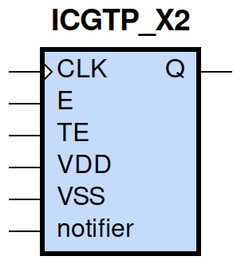
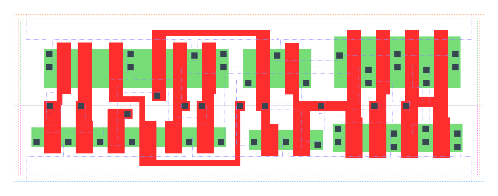

====================================
gf180mcu_fd_sc_mcu9t5v0__icgtp_x2
====================================

**gf180mcu_fd_sc_mcu9t5v0__icgtp_x2 symbol**

**gf180mcu_fd_sc_mcu9t5v0__icgtp_x2 schematic**

.. image:: sc9_sch/ICGTP_X2_sch.png
    :height: 250px
    :width: 450 px
    :align: center
    :alt: gf180mcu_fd_sc_mcu9t5v0__icgtp_x2 schematic

**gf180mcu_fd_sc_mcu9t5v0__icgtp_x2 layout**

.. include:: images.rst
| ICGTP_X2 is a positive-edge triggered clock-gating latch with 2X drive strength

|
| Attributes

============= =====================================
**Attribute** **Value**
area          true µm\ :sup:`2`
area          true µm\ :sup:`2`
area          true µm\ :sup:`2`
area          79.027200 µm\ :sup:`2`
area          true µm\ :sup:`2`
area          latch_posedge_precontrol µm\ :sup:`2`
============= =====================================

|

TRUTH TABLE

== = === ======= ======
TE E CLK QD(n+1) Q(n+1)
L  L L   L       L
L  H L   H       L
H  L L   H       L
H  H L   H       L
X  X H   QD(n)   QD(n)
== = === ======= ======

|
| FUNCTIONAL SCHEMATIC
| |image359|
| CONSTRAINTS

================== =============== ============= ============
**Constraint Pin** **Related Pin** **setup(ns)** **hold(ns)**
TE(HL)             CLK(LH)         0.3260        -0.2460
TE(LH)             CLK(LH)         0.4870        -0.2060
E(HL)              CLK(LH)         0.3090        -0.2230
E(LH)              CLK(LH)         0.4580        -0.1770
================== =============== ============= ============

|

================== =============== ===========================
**Constraint Pin** **Related Pin** **Minimum Pulse Width(ns)**
CLK(HLH)           CLK(HL)         0.4370
CLK(HLH)           CLK(HL)         0.5830
CLK(HLH)           CLK(HL)         0.5530
CLK(HLH)           CLK(HL)         0.5160
================== =============== ===========================

|
| PIN CAPACITANCE (pf)

======= ======== ====================
**Pin** **Type** **Capacitance (pf)**
TE      input    0.0047
E       input    0.0047
CLK     input    0.0112
======= ======== ====================

|
| DELAY AND OUTPUT TRANSITION TIME corresponding to min slew and load

+---------------+------------+--------------------+--------------+-------------------+----------------+---------------+
| **Input Pin** | **Output** | **When Condition** | **Tin (ns)** | **Out Load (pf)** | **Delay (ns)** | **Tout (ns)** |
+---------------+------------+--------------------+--------------+-------------------+----------------+---------------+
| CLK(LH)       | Q(LH)      | !E&TE              | 0.0100       | 0.0010            | 0.1874         | 0.0323        |
+---------------+------------+--------------------+--------------+-------------------+----------------+---------------+
| CLK(LH)       | Q(LH)      | E&!TE              | 0.0100       | 0.0010            | 0.1874         | 0.0323        |
+---------------+------------+--------------------+--------------+-------------------+----------------+---------------+
| CLK(LH)       | Q(LH)      | E&TE               | 0.0100       | 0.0010            | 0.1874         | 0.0323        |
+---------------+------------+--------------------+--------------+-------------------+----------------+---------------+
| CLK(HL)       | Q(HL)      | !E&!TE             | 0.0100       | 0.0010            | 0.1461         | 0.0255        |
+---------------+------------+--------------------+--------------+-------------------+----------------+---------------+
| CLK(HL)       | Q(HL)      | !E&TE              | 0.0100       | 0.0010            | 0.1461         | 0.0255        |
+---------------+------------+--------------------+--------------+-------------------+----------------+---------------+
| CLK(HL)       | Q(HL)      | E&!TE              | 0.0100       | 0.0010            | 0.1461         | 0.0255        |
+---------------+------------+--------------------+--------------+-------------------+----------------+---------------+
| CLK(HL)       | Q(HL)      | E&TE               | 0.0100       | 0.0010            | 0.1461         | 0.0256        |
+---------------+------------+--------------------+--------------+-------------------+----------------+---------------+

|
| DYNAMIC ENERGY

+---------------+--------------------+--------------+------------+-------------------+---------------------+
| **Input Pin** | **When Condition** | **Tin (ns)** | **Output** | **Out Load (pf)** | **Energy (uW/MHz)** |
+---------------+--------------------+--------------+------------+-------------------+---------------------+
| CLK           | !E&TE              | 0.0100       | Q(LH)      | 0.0010            | 0.5006              |
+---------------+--------------------+--------------+------------+-------------------+---------------------+
| CLK           | E&!TE              | 0.0100       | Q(LH)      | 0.0010            | 0.4996              |
+---------------+--------------------+--------------+------------+-------------------+---------------------+
| CLK           | E&TE               | 0.0100       | Q(LH)      | 0.0010            | 0.4997              |
+---------------+--------------------+--------------+------------+-------------------+---------------------+
| CLK           | !E&!TE             | 0.0100       | Q(HL)      | 0.0010            | 1.1195              |
+---------------+--------------------+--------------+------------+-------------------+---------------------+
| CLK           | !E&TE              | 0.0100       | Q(HL)      | 0.0010            | 0.7086              |
+---------------+--------------------+--------------+------------+-------------------+---------------------+
| CLK           | E&!TE              | 0.0100       | Q(HL)      | 0.0010            | 0.7092              |
+---------------+--------------------+--------------+------------+-------------------+---------------------+
| CLK           | E&TE               | 0.0100       | Q(HL)      | 0.0010            | 0.7090              |
+---------------+--------------------+--------------+------------+-------------------+---------------------+
| E(LH)         | !CLK&!TE           | 0.0100       | n/a        | n/a               | 0.3414              |
+---------------+--------------------+--------------+------------+-------------------+---------------------+
| E(LH)         | !CLK&TE            | 0.0100       | n/a        | n/a               | -0.0131             |
+---------------+--------------------+--------------+------------+-------------------+---------------------+
| E(LH)         | CLK&!TE            | 0.0100       | n/a        | n/a               | -0.0439             |
+---------------+--------------------+--------------+------------+-------------------+---------------------+
| E(LH)         | CLK&TE             | 0.0100       | n/a        | n/a               | -0.0176             |
+---------------+--------------------+--------------+------------+-------------------+---------------------+
| CLK(LH)       | !E&!TE             | 0.0100       | n/a        | n/a               | 0.1629              |
+---------------+--------------------+--------------+------------+-------------------+---------------------+
| TE(HL)        | !CLK&!E            | 0.0100       | n/a        | n/a               | 0.4953              |
+---------------+--------------------+--------------+------------+-------------------+---------------------+
| TE(HL)        | !CLK&E             | 0.0100       | n/a        | n/a               | 0.0445              |
+---------------+--------------------+--------------+------------+-------------------+---------------------+
| TE(HL)        | CLK&!E             | 0.0100       | n/a        | n/a               | 0.0795              |
+---------------+--------------------+--------------+------------+-------------------+---------------------+
| TE(HL)        | CLK&E              | 0.0100       | n/a        | n/a               | 0.0446              |
+---------------+--------------------+--------------+------------+-------------------+---------------------+
| TE(LH)        | !CLK&!E            | 0.0100       | n/a        | n/a               | 0.3638              |
+---------------+--------------------+--------------+------------+-------------------+---------------------+
| TE(LH)        | !CLK&E             | 0.0100       | n/a        | n/a               | -0.0389             |
+---------------+--------------------+--------------+------------+-------------------+---------------------+
| TE(LH)        | CLK&!E             | 0.0100       | n/a        | n/a               | -0.0392             |
+---------------+--------------------+--------------+------------+-------------------+---------------------+
| TE(LH)        | CLK&E              | 0.0100       | n/a        | n/a               | -0.0425             |
+---------------+--------------------+--------------+------------+-------------------+---------------------+
| E(HL)         | !CLK&!TE           | 0.0100       | n/a        | n/a               | 0.4633              |
+---------------+--------------------+--------------+------------+-------------------+---------------------+
| E(HL)         | !CLK&TE            | 0.0100       | n/a        | n/a               | 0.0225              |
+---------------+--------------------+--------------+------------+-------------------+---------------------+
| E(HL)         | CLK&!TE            | 0.0100       | n/a        | n/a               | 0.0482              |
+---------------+--------------------+--------------+------------+-------------------+---------------------+
| E(HL)         | CLK&TE             | 0.0100       | n/a        | n/a               | 0.0188              |
+---------------+--------------------+--------------+------------+-------------------+---------------------+
| CLK(HL)       | !E&!TE             | 0.0100       | n/a        | n/a               | 0.3764              |
+---------------+--------------------+--------------+------------+-------------------+---------------------+
| CLK(HL)       | !E&TE              | 0.0100       | n/a        | n/a               | 0.7650              |
+---------------+--------------------+--------------+------------+-------------------+---------------------+
| CLK(HL)       | E&!TE              | 0.0100       | n/a        | n/a               | 0.7331              |
+---------------+--------------------+--------------+------------+-------------------+---------------------+
| CLK(HL)       | E&TE               | 0.0100       | n/a        | n/a               | 0.7307              |
+---------------+--------------------+--------------+------------+-------------------+---------------------+

|
| LEAKAGE POWER

================== ==============
**When Condition** **Power (nW)**
!CLK&!E&!TE        0.3184
!CLK&!E&TE         0.3307
!CLK&E&!TE         0.2954
!CLK&E&TE          0.2954
CLK&!E&!TE         0.4943
CLK&!E&TE          0.4330
CLK&E&!TE          0.4072
CLK&E&TE           0.4072
================== ==============

