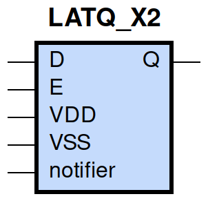
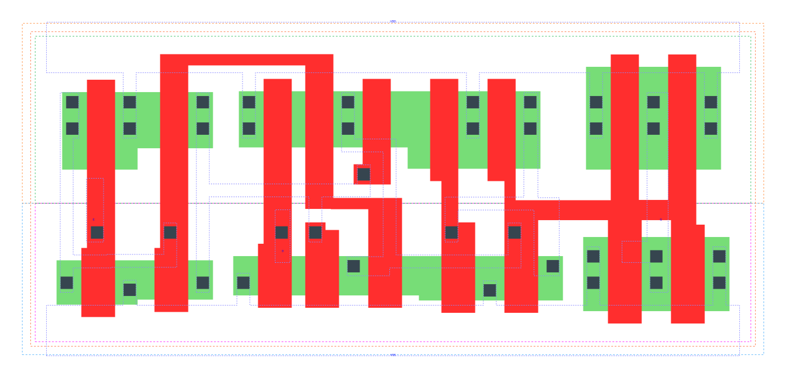

====================================
gf180mcu_fd_sc_mcu9t5v0__latq_x2
====================================

**gf180mcu_fd_sc_mcu9t5v0__latq_x2 symbol**

**gf180mcu_fd_sc_mcu9t5v0__latq_x2 schematic**

.. image:: sc9_sch/LATQ_X2_sch.png
    :height: 250px
    :width: 450 px
    :align: center
    :alt: gf180mcu_fd_sc_mcu9t5v0__latq_x2 schematic

**gf180mcu_fd_sc_mcu9t5v0__latq_x2 layout**

.. include:: images.rst
| LATQ_X2 is a positive D-latch with 2X drive strength

|
| Attributes

============= ======================
**Attribute** **Value**
area          62.092800 µm\ :sup:`2`
============= ======================

|

TRUTH TABLE

===== = ======
Input   Output
D     E Q
L     H L
H     H H
X     L Q
===== = ======

|
| FUNCTIONAL SCHEMATIC
| |image413|
| CONSTRAINTS

================== =============== ============= ============
**Constraint Pin** **Related Pin** **setup(ns)** **hold(ns)**
D(LH)              E(HL)           0.2180        -0.1430
D(HL)              E(HL)           0.5150        -0.4290
================== =============== ============= ============

|

================== =============== ===========================
**Constraint Pin** **Related Pin** **Minimum Pulse Width(ns)**
E(LHL)             E(LH)           0.5540
E(LHL)             E(LH)           0.4170
================== =============== ===========================

|
| PIN CAPACITANCE (pf)

======= ======== ====================
**Pin** **Type** **Capacitance (pf)**
E       input    0.0051
D       input    0.0040
======= ======== ====================

|
| DELAY AND OUTPUT TRANSITION TIME corresponding to min slew and load

+---------------+------------+--------------------+--------------+-------------------+----------------+---------------+
| **Input Pin** | **Output** | **When Condition** | **Tin (ns)** | **Out Load (pf)** | **Delay (ns)** | **Tout (ns)** |
+---------------+------------+--------------------+--------------+-------------------+----------------+---------------+
| E(LH)         | Q(LH)      | D                  | 0.0100       | 0.0010            | 0.5248         | 0.0467        |
+---------------+------------+--------------------+--------------+-------------------+----------------+---------------+
| E(LH)         | Q(HL)      | !D                 | 0.0100       | 0.0010            | 0.5128         | 0.0722        |
+---------------+------------+--------------------+--------------+-------------------+----------------+---------------+
| D(LH)         | Q(LH)      | E                  | 0.0100       | 0.0010            | 0.3438         | 0.0466        |
+---------------+------------+--------------------+--------------+-------------------+----------------+---------------+
| D(HL)         | Q(HL)      | E                  | 0.0100       | 0.0010            | 0.4764         | 0.0722        |
+---------------+------------+--------------------+--------------+-------------------+----------------+---------------+

|
| DYNAMIC ENERGY

+---------------+--------------------+--------------+------------+-------------------+---------------------+
| **Input Pin** | **When Condition** | **Tin (ns)** | **Output** | **Out Load (pf)** | **Energy (uW/MHz)** |
+---------------+--------------------+--------------+------------+-------------------+---------------------+
| D             | E                  | 0.0100       | Q(LH)      | 0.0010            | 0.6798              |
+---------------+--------------------+--------------+------------+-------------------+---------------------+
| D             | E                  | 0.0100       | Q(HL)      | 0.0010            | 1.1092              |
+---------------+--------------------+--------------+------------+-------------------+---------------------+
| E             | D                  | 0.0100       | Q(LH)      | 0.0010            | 0.8668              |
+---------------+--------------------+--------------+------------+-------------------+---------------------+
| E             | !D                 | 0.0100       | Q(HL)      | 0.0010            | 1.2116              |
+---------------+--------------------+--------------+------------+-------------------+---------------------+
| E(LH)         | !D                 | 0.0100       | n/a        | n/a               | 0.1654              |
+---------------+--------------------+--------------+------------+-------------------+---------------------+
| E(LH)         | D                  | 0.0100       | n/a        | n/a               | 0.1628              |
+---------------+--------------------+--------------+------------+-------------------+---------------------+
| D(LH)         | !E                 | 0.0100       | n/a        | n/a               | -0.0316             |
+---------------+--------------------+--------------+------------+-------------------+---------------------+
| E(HL)         | !D                 | 0.0100       | n/a        | n/a               | 0.3054              |
+---------------+--------------------+--------------+------------+-------------------+---------------------+
| E(HL)         | D                  | 0.0100       | n/a        | n/a               | 0.3081              |
+---------------+--------------------+--------------+------------+-------------------+---------------------+
| D(HL)         | !E                 | 0.0100       | n/a        | n/a               | 0.0343              |
+---------------+--------------------+--------------+------------+-------------------+---------------------+

|
| LEAKAGE POWER

================== ==============
**When Condition** **Power (nW)**
!D&!E              0.3640
D&!E               0.3933
!D&E               0.2730
D&E                0.2671
================== ==============

