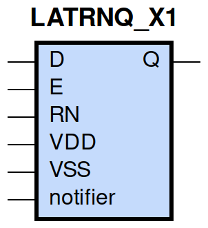
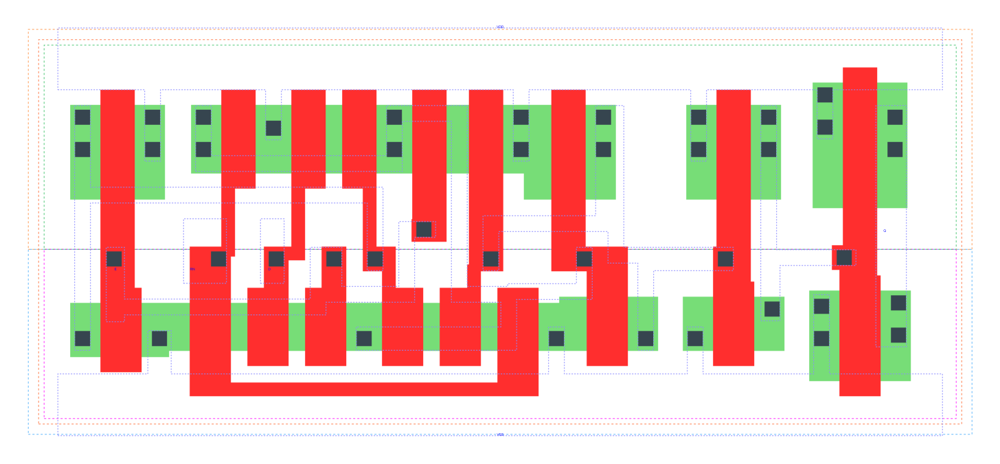

====================================
gf180mcu_fd_sc_mcu9t5v0__latrnq_x1
====================================

**gf180mcu_fd_sc_mcu9t5v0__latrnq_x1 symbol**

**gf180mcu_fd_sc_mcu9t5v0__latrnq_x1 schematic**

.. image:: sc9_sch/LATRNQ_X1_sch.png
    :height: 250px
    :width: 450 px
    :align: center
    :alt: gf180mcu_fd_sc_mcu9t5v0__latrnq_x1 schematic

**gf180mcu_fd_sc_mcu9t5v0__latrnq_x1 layout**

.. include:: images.rst
| LATRNQ_X1 is a positive D-latch with active low reset and 1X drive strength

|
| Attributes

============= ======================
**Attribute** **Value**
area          64.915200 µm\ :sup:`2`
============= ======================

|

TRUTH TABLE

===== = = ======
Input     Output
RN    D E Q
H     L H L
H     H H H
H     X L Q
L     X X L
===== = = ======

|
| FUNCTIONAL SCHEMATIC
| |image419|
| CONSTRAINTS

================== =============== ============= ============
**Constraint Pin** **Related Pin** **setup(ns)** **hold(ns)**
D(HL)              E(HL)           0.3660        -0.3150
D(LH)              E(HL)           0.3320        -0.2920
================== =============== ============= ============

|

================== =============== ================ ===============
**Constraint Pin** **Related Pin** **recovery(ns)** **removal(ns)**
RN(LH)             E(HL)           0.3430           -0.3030
================== =============== ================ ===============

|

================== =============== ===========================
**Constraint Pin** **Related Pin** **Minimum Pulse Width(ns)**
E(LHL)             E(LH)           0.4170
E(LHL)             E(LH)           0.2900
RN(HLH)            RN(HL)          0.2710
RN(HLH)            RN(HL)          0.2710
================== =============== ===========================

|
| PIN CAPACITANCE (pf)

======= ======== ====================
**Pin** **Type** **Capacitance (pf)**
E       input    0.0102
RN      input    0.0065
D       input    0.0041
======= ======== ====================

|
| DELAY AND OUTPUT TRANSITION TIME corresponding to min slew and load

+---------------+------------+--------------------+--------------+-------------------+----------------+---------------+
| **Input Pin** | **Output** | **When Condition** | **Tin (ns)** | **Out Load (pf)** | **Delay (ns)** | **Tout (ns)** |
+---------------+------------+--------------------+--------------+-------------------+----------------+---------------+
| E(LH)         | Q(LH)      | D&RN               | 0.0100       | 0.0010            | 0.4872         | 0.0332        |
+---------------+------------+--------------------+--------------+-------------------+----------------+---------------+
| E(LH)         | Q(HL)      | !D&RN              | 0.0100       | 0.0010            | 0.6260         | 0.0276        |
+---------------+------------+--------------------+--------------+-------------------+----------------+---------------+
| RN(HL)        | Q(HL)      | !D&!E              | 0.0100       | 0.0010            | 0.4574         | 0.0274        |
+---------------+------------+--------------------+--------------+-------------------+----------------+---------------+
| RN(HL)        | Q(HL)      | D&!E               | 0.0100       | 0.0010            | 0.4575         | 0.0273        |
+---------------+------------+--------------------+--------------+-------------------+----------------+---------------+
| RN(HL)        | Q(HL)      | D&E                | 0.0100       | 0.0010            | 0.4585         | 0.0275        |
+---------------+------------+--------------------+--------------+-------------------+----------------+---------------+
| RN(LH)        | Q(LH)      | D&E                | 0.0100       | 0.0010            | 0.5489         | 0.0331        |
+---------------+------------+--------------------+--------------+-------------------+----------------+---------------+
| D(LH)         | Q(LH)      | E&RN               | 0.0100       | 0.0010            | 0.5373         | 0.0332        |
+---------------+------------+--------------------+--------------+-------------------+----------------+---------------+
| D(HL)         | Q(HL)      | E&RN               | 0.0100       | 0.0010            | 0.5933         | 0.0277        |
+---------------+------------+--------------------+--------------+-------------------+----------------+---------------+

|
| DYNAMIC ENERGY

+---------------+--------------------+--------------+------------+-------------------+---------------------+
| **Input Pin** | **When Condition** | **Tin (ns)** | **Output** | **Out Load (pf)** | **Energy (uW/MHz)** |
+---------------+--------------------+--------------+------------+-------------------+---------------------+
| E             | D&RN               | 0.0100       | Q(LH)      | 0.0010            | 0.4993              |
+---------------+--------------------+--------------+------------+-------------------+---------------------+
| RN            | !D&!E              | 0.0100       | Q(HL)      | 0.0010            | 0.6339              |
+---------------+--------------------+--------------+------------+-------------------+---------------------+
| RN            | D&!E               | 0.0100       | Q(HL)      | 0.0010            | 0.6353              |
+---------------+--------------------+--------------+------------+-------------------+---------------------+
| RN            | D&E                | 0.0100       | Q(HL)      | 0.0010            | 0.6919              |
+---------------+--------------------+--------------+------------+-------------------+---------------------+
| E             | !D&RN              | 0.0100       | Q(HL)      | 0.0010            | 0.6216              |
+---------------+--------------------+--------------+------------+-------------------+---------------------+
| RN            | D&E                | 0.0100       | Q(LH)      | 0.0010            | 0.4967              |
+---------------+--------------------+--------------+------------+-------------------+---------------------+
| D             | E&RN               | 0.0100       | Q(LH)      | 0.0010            | 0.4952              |
+---------------+--------------------+--------------+------------+-------------------+---------------------+
| D             | E&RN               | 0.0100       | Q(HL)      | 0.0010            | 0.6635              |
+---------------+--------------------+--------------+------------+-------------------+---------------------+
| D(HL)         | !E&!RN             | 0.0100       | n/a        | n/a               | 0.0426              |
+---------------+--------------------+--------------+------------+-------------------+---------------------+
| D(HL)         | E&!RN              | 0.0100       | n/a        | n/a               | 0.0358              |
+---------------+--------------------+--------------+------------+-------------------+---------------------+
| D(HL)         | !E&RN              | 0.0100       | n/a        | n/a               | 0.0343              |
+---------------+--------------------+--------------+------------+-------------------+---------------------+
| E(LH)         | !D&!RN             | 0.0100       | n/a        | n/a               | 0.0095              |
+---------------+--------------------+--------------+------------+-------------------+---------------------+
| E(LH)         | D&!RN              | 0.0100       | n/a        | n/a               | 0.0429              |
+---------------+--------------------+--------------+------------+-------------------+---------------------+
| E(LH)         | !D&RN              | 0.0100       | n/a        | n/a               | -0.0020             |
+---------------+--------------------+--------------+------------+-------------------+---------------------+
| E(LH)         | D&RN               | 0.0100       | n/a        | n/a               | -0.0027             |
+---------------+--------------------+--------------+------------+-------------------+---------------------+
| D(LH)         | !E&!RN             | 0.0100       | n/a        | n/a               | -0.0316             |
+---------------+--------------------+--------------+------------+-------------------+---------------------+
| D(LH)         | E&!RN              | 0.0100       | n/a        | n/a               | -0.0259             |
+---------------+--------------------+--------------+------------+-------------------+---------------------+
| D(LH)         | !E&RN              | 0.0100       | n/a        | n/a               | -0.0315             |
+---------------+--------------------+--------------+------------+-------------------+---------------------+
| RN(HL)        | !D&!E              | 0.0100       | n/a        | n/a               | 0.0349              |
+---------------+--------------------+--------------+------------+-------------------+---------------------+
| RN(HL)        | D&!E               | 0.0100       | n/a        | n/a               | 0.0379              |
+---------------+--------------------+--------------+------------+-------------------+---------------------+
| RN(HL)        | !D&E               | 0.0100       | n/a        | n/a               | 0.0347              |
+---------------+--------------------+--------------+------------+-------------------+---------------------+
| RN(LH)        | !D&!E              | 0.0100       | n/a        | n/a               | -0.0321             |
+---------------+--------------------+--------------+------------+-------------------+---------------------+
| RN(LH)        | !D&E               | 0.0100       | n/a        | n/a               | -0.0321             |
+---------------+--------------------+--------------+------------+-------------------+---------------------+
| RN(LH)        | D&!E               | 0.0100       | n/a        | n/a               | -0.0321             |
+---------------+--------------------+--------------+------------+-------------------+---------------------+
| E(HL)         | !D&!RN             | 0.0100       | n/a        | n/a               | 0.2081              |
+---------------+--------------------+--------------+------------+-------------------+---------------------+
| E(HL)         | !D&RN              | 0.0100       | n/a        | n/a               | 0.2079              |
+---------------+--------------------+--------------+------------+-------------------+---------------------+
| E(HL)         | D&!RN              | 0.0100       | n/a        | n/a               | 0.2086              |
+---------------+--------------------+--------------+------------+-------------------+---------------------+
| E(HL)         | D&RN               | 0.0100       | n/a        | n/a               | 0.2089              |
+---------------+--------------------+--------------+------------+-------------------+---------------------+

|
| LEAKAGE POWER

================== ==============
**When Condition** **Power (nW)**
!D&!E&!RN          0.2448
!D&E&!RN           0.2460
!D&E&RN            0.2461
D&!E&!RN           0.2449
D&E&!RN            0.2853
!D&!E&RN           0.2939
D&!E&RN            0.3373
D&E&RN             0.2690
================== ==============

