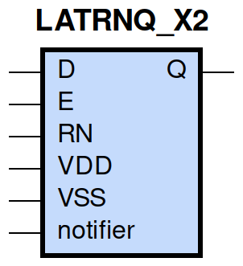
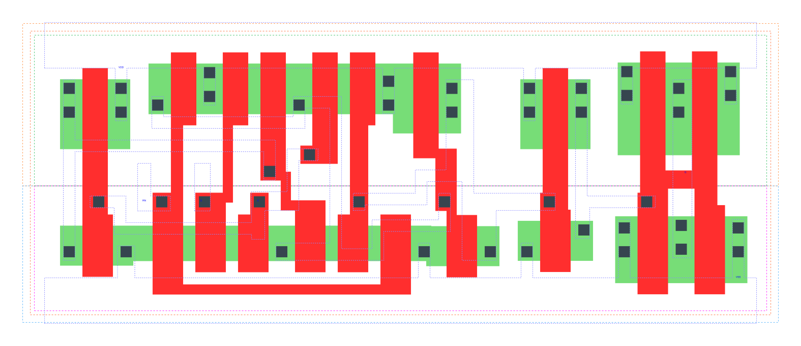

====================================
gf180mcu_fd_sc_mcu9t5v0__latrnq_x2
====================================

**gf180mcu_fd_sc_mcu9t5v0__latrnq_x2 symbol**

**gf180mcu_fd_sc_mcu9t5v0__latrnq_x2 schematic**

.. image:: sc9_sch/LATRNQ_X2_sch.png
    :height: 250px
    :width: 450 px
    :align: center
    :alt: gf180mcu_fd_sc_mcu9t5v0__latrnq_x2 schematic

**gf180mcu_fd_sc_mcu9t5v0__latrnq_x2 layout**

.. include:: images.rst
| LATRNQ_X2 is a positive D-latch with active low reset and 2X drive strength

|
| Attributes

============= ======================
**Attribute** **Value**
area          70.560000 µm\ :sup:`2`
============= ======================

|

TRUTH TABLE

===== = = ======
Input     Output
RN    D E Q
H     L H L
H     H H H
H     X L Q
L     X X L
===== = = ======

|
| FUNCTIONAL SCHEMATIC
| |image422|
| CONSTRAINTS

================== =============== ============= ============
**Constraint Pin** **Related Pin** **setup(ns)** **hold(ns)**
D(HL)              E(HL)           0.3660        -0.3150
D(LH)              E(HL)           0.3380        -0.2860
================== =============== ============= ============

|

================== =============== ================ ===============
**Constraint Pin** **Related Pin** **recovery(ns)** **removal(ns)**
RN(LH)             E(HL)           0.3490           -0.2980
================== =============== ================ ===============

|

================== =============== ===========================
**Constraint Pin** **Related Pin** **Minimum Pulse Width(ns)**
E(LHL)             E(LH)           0.4170
E(LHL)             E(LH)           0.2900
RN(HLH)            RN(HL)          0.2710
RN(HLH)            RN(HL)          0.2710
================== =============== ===========================

|
| PIN CAPACITANCE (pf)

======= ======== ====================
**Pin** **Type** **Capacitance (pf)**
E       input    0.0101
RN      input    0.0065
D       input    0.0042
======= ======== ====================

|
| DELAY AND OUTPUT TRANSITION TIME corresponding to min slew and load

+---------------+------------+--------------------+--------------+-------------------+----------------+---------------+
| **Input Pin** | **Output** | **When Condition** | **Tin (ns)** | **Out Load (pf)** | **Delay (ns)** | **Tout (ns)** |
+---------------+------------+--------------------+--------------+-------------------+----------------+---------------+
| E(LH)         | Q(LH)      | D&RN               | 0.0100       | 0.0010            | 0.5207         | 0.0290        |
+---------------+------------+--------------------+--------------+-------------------+----------------+---------------+
| E(LH)         | Q(HL)      | !D&RN              | 0.0100       | 0.0010            | 0.6525         | 0.0291        |
+---------------+------------+--------------------+--------------+-------------------+----------------+---------------+
| RN(HL)        | Q(HL)      | !D&!E              | 0.0100       | 0.0010            | 0.4879         | 0.0289        |
+---------------+------------+--------------------+--------------+-------------------+----------------+---------------+
| RN(HL)        | Q(HL)      | D&!E               | 0.0100       | 0.0010            | 0.4881         | 0.0289        |
+---------------+------------+--------------------+--------------+-------------------+----------------+---------------+
| RN(HL)        | Q(HL)      | D&E                | 0.0100       | 0.0010            | 0.4895         | 0.0290        |
+---------------+------------+--------------------+--------------+-------------------+----------------+---------------+
| RN(LH)        | Q(LH)      | D&E                | 0.0100       | 0.0010            | 0.5825         | 0.0290        |
+---------------+------------+--------------------+--------------+-------------------+----------------+---------------+
| D(LH)         | Q(LH)      | E&RN               | 0.0100       | 0.0010            | 0.5707         | 0.0290        |
+---------------+------------+--------------------+--------------+-------------------+----------------+---------------+
| D(HL)         | Q(HL)      | E&RN               | 0.0100       | 0.0010            | 0.6217         | 0.0290        |
+---------------+------------+--------------------+--------------+-------------------+----------------+---------------+

|
| DYNAMIC ENERGY

+---------------+--------------------+--------------+------------+-------------------+---------------------+
| **Input Pin** | **When Condition** | **Tin (ns)** | **Output** | **Out Load (pf)** | **Energy (uW/MHz)** |
+---------------+--------------------+--------------+------------+-------------------+---------------------+
| E             | D&RN               | 0.0100       | Q(LH)      | 0.0010            | 0.6460              |
+---------------+--------------------+--------------+------------+-------------------+---------------------+
| RN            | !D&!E              | 0.0100       | Q(HL)      | 0.0010            | 0.8005              |
+---------------+--------------------+--------------+------------+-------------------+---------------------+
| RN            | D&!E               | 0.0100       | Q(HL)      | 0.0010            | 0.8023              |
+---------------+--------------------+--------------+------------+-------------------+---------------------+
| RN            | D&E                | 0.0100       | Q(HL)      | 0.0010            | 0.8587              |
+---------------+--------------------+--------------+------------+-------------------+---------------------+
| E             | !D&RN              | 0.0100       | Q(HL)      | 0.0010            | 0.7872              |
+---------------+--------------------+--------------+------------+-------------------+---------------------+
| RN            | D&E                | 0.0100       | Q(LH)      | 0.0010            | 0.6436              |
+---------------+--------------------+--------------+------------+-------------------+---------------------+
| D             | E&RN               | 0.0100       | Q(LH)      | 0.0010            | 0.6421              |
+---------------+--------------------+--------------+------------+-------------------+---------------------+
| D             | E&RN               | 0.0100       | Q(HL)      | 0.0010            | 0.8291              |
+---------------+--------------------+--------------+------------+-------------------+---------------------+
| D(HL)         | !E&!RN             | 0.0100       | n/a        | n/a               | 0.0427              |
+---------------+--------------------+--------------+------------+-------------------+---------------------+
| D(HL)         | E&!RN              | 0.0100       | n/a        | n/a               | 0.0358              |
+---------------+--------------------+--------------+------------+-------------------+---------------------+
| D(HL)         | !E&RN              | 0.0100       | n/a        | n/a               | 0.0343              |
+---------------+--------------------+--------------+------------+-------------------+---------------------+
| E(LH)         | !D&!RN             | 0.0100       | n/a        | n/a               | 0.0095              |
+---------------+--------------------+--------------+------------+-------------------+---------------------+
| E(LH)         | D&!RN              | 0.0100       | n/a        | n/a               | 0.0428              |
+---------------+--------------------+--------------+------------+-------------------+---------------------+
| E(LH)         | !D&RN              | 0.0100       | n/a        | n/a               | -0.0019             |
+---------------+--------------------+--------------+------------+-------------------+---------------------+
| E(LH)         | D&RN               | 0.0100       | n/a        | n/a               | -0.0028             |
+---------------+--------------------+--------------+------------+-------------------+---------------------+
| D(LH)         | !E&!RN             | 0.0100       | n/a        | n/a               | -0.0316             |
+---------------+--------------------+--------------+------------+-------------------+---------------------+
| D(LH)         | E&!RN              | 0.0100       | n/a        | n/a               | -0.0259             |
+---------------+--------------------+--------------+------------+-------------------+---------------------+
| D(LH)         | !E&RN              | 0.0100       | n/a        | n/a               | -0.0315             |
+---------------+--------------------+--------------+------------+-------------------+---------------------+
| RN(HL)        | !D&!E              | 0.0100       | n/a        | n/a               | 0.0350              |
+---------------+--------------------+--------------+------------+-------------------+---------------------+
| RN(HL)        | D&!E               | 0.0100       | n/a        | n/a               | 0.0379              |
+---------------+--------------------+--------------+------------+-------------------+---------------------+
| RN(HL)        | !D&E               | 0.0100       | n/a        | n/a               | 0.0347              |
+---------------+--------------------+--------------+------------+-------------------+---------------------+
| RN(LH)        | !D&!E              | 0.0100       | n/a        | n/a               | -0.0320             |
+---------------+--------------------+--------------+------------+-------------------+---------------------+
| RN(LH)        | !D&E               | 0.0100       | n/a        | n/a               | -0.0320             |
+---------------+--------------------+--------------+------------+-------------------+---------------------+
| RN(LH)        | D&!E               | 0.0100       | n/a        | n/a               | -0.0321             |
+---------------+--------------------+--------------+------------+-------------------+---------------------+
| E(HL)         | !D&!RN             | 0.0100       | n/a        | n/a               | 0.2023              |
+---------------+--------------------+--------------+------------+-------------------+---------------------+
| E(HL)         | !D&RN              | 0.0100       | n/a        | n/a               | 0.2022              |
+---------------+--------------------+--------------+------------+-------------------+---------------------+
| E(HL)         | D&!RN              | 0.0100       | n/a        | n/a               | 0.2028              |
+---------------+--------------------+--------------+------------+-------------------+---------------------+
| E(HL)         | D&RN               | 0.0100       | n/a        | n/a               | 0.2017              |
+---------------+--------------------+--------------+------------+-------------------+---------------------+

|
| LEAKAGE POWER

================== ==============
**When Condition** **Power (nW)**
!D&!E&!RN          0.2717
!D&E&!RN           0.2728
!D&E&RN            0.2730
D&!E&!RN           0.2717
D&E&!RN            0.3122
!D&!E&RN           0.3212
D&!E&RN            0.3556
D&E&RN             0.2946
================== ==============

