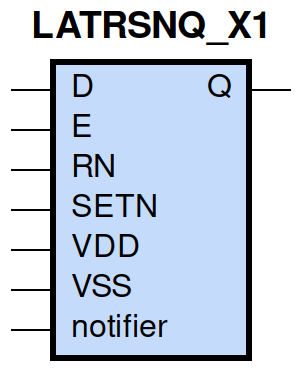

====================================
gf180mcu_fd_sc_mcu9t5v0__latrsnq_x1
====================================

**gf180mcu_fd_sc_mcu9t5v0__latrsnq_x1 symbol**

**gf180mcu_fd_sc_mcu9t5v0__latrsnq_x1 schematic**

.. image:: sc9_sch/LATRSNQ_X1_sch.png
    :height: 250px
    :width: 450 px
    :align: center
    :alt: gf180mcu_fd_sc_mcu9t5v0__latrsnq_x1 schematic

**gf180mcu_fd_sc_mcu9t5v0__latrsnq_x1 layout**

.. image:: sc9_lay/LATRSNQ_X1_lay.png
    :height: 300px
    :width: 500 px
    :align: center
    :alt: gf180mcu_fd_sc_mcu9t5v0__latrsnq_x1 layout

.. include:: images.rst
| LATRSNQ_X1 is a positive D-latch with active low set/reset and 1X drive strength

|
| Attributes

============= ======================
**Attribute** **Value**
area          67.737600 µm\ :sup:`2`
============= ======================

|

TRUTH TABLE

===== ==== = = ======
Input          Output
RN    SETN D E Q
H     H    L H L
H     H    H H H
H     H    X L Q
L     H    X X L
H     L    X X H
L     L    X X H
===== ==== = = ======

|
| FUNCTIONAL SCHEMATIC
| |image428|
| CONSTRAINTS

================== =============== ============= ============
**Constraint Pin** **Related Pin** **setup(ns)** **hold(ns)**
RN(LH)             SETN(LH)        0.0800        -0.0230
RN(LH)             SETN(LH)        0.0800        -0.0230
D(HL)              E(HL)           0.3550        -0.3030
D(LH)              E(HL)           0.3660        -0.3150
SETN(LH)           RN(LH)          -0.0230       0.0800
SETN(LH)           RN(LH)          -0.0230       0.0800
================== =============== ============= ============

|

================== =============== ================ ===============
**Constraint Pin** **Related Pin** **recovery(ns)** **removal(ns)**
RN(LH)             E(HL)           0.3780           -0.3260
SETN(LH)           E(HL)           -0.0060          0.1090
================== =============== ================ ===============

|

================== =============== ===========================
**Constraint Pin** **Related Pin** **Minimum Pulse Width(ns)**
E(LHL)             E(LH)           0.4070
E(LHL)             E(LH)           0.3190
RN(HLH)            RN(HL)          0.2710
RN(HLH)            RN(HL)          0.2710
SETN(HLH)          SETN(HL)        0.2410
SETN(HLH)          SETN(HL)        0.2410
================== =============== ===========================

|
| PIN CAPACITANCE (pf)

======= ======== ====================
**Pin** **Type** **Capacitance (pf)**
E       input    0.0102
RN      input    0.0066
D       input    0.0041
SETN    input    0.0051
======= ======== ====================

|
| DELAY AND OUTPUT TRANSITION TIME corresponding to min slew and load

+---------------+------------+--------------------+--------------+-------------------+----------------+---------------+
| **Input Pin** | **Output** | **When Condition** | **Tin (ns)** | **Out Load (pf)** | **Delay (ns)** | **Tout (ns)** |
+---------------+------------+--------------------+--------------+-------------------+----------------+---------------+
| E(LH)         | Q(LH)      | D&RN&SETN          | 0.0100       | 0.0010            | 0.5593         | 0.0338        |
+---------------+------------+--------------------+--------------+-------------------+----------------+---------------+
| E(LH)         | Q(HL)      | !D&RN&SETN         | 0.0100       | 0.0010            | 0.6447         | 0.0289        |
+---------------+------------+--------------------+--------------+-------------------+----------------+---------------+
| RN(HL)        | Q(HL)      | !D&!E&SETN         | 0.0100       | 0.0010            | 0.4940         | 0.0286        |
+---------------+------------+--------------------+--------------+-------------------+----------------+---------------+
| RN(HL)        | Q(HL)      | D&!E&SETN          | 0.0100       | 0.0010            | 0.4942         | 0.0286        |
+---------------+------------+--------------------+--------------+-------------------+----------------+---------------+
| RN(HL)        | Q(HL)      | D&E&SETN           | 0.0100       | 0.0010            | 0.4924         | 0.0288        |
+---------------+------------+--------------------+--------------+-------------------+----------------+---------------+
| RN(LH)        | Q(LH)      | D&E&SETN           | 0.0100       | 0.0010            | 0.6198         | 0.0337        |
+---------------+------------+--------------------+--------------+-------------------+----------------+---------------+
| D(LH)         | Q(LH)      | E&RN&SETN          | 0.0100       | 0.0010            | 0.6082         | 0.0338        |
+---------------+------------+--------------------+--------------+-------------------+----------------+---------------+
| D(HL)         | Q(HL)      | E&RN&SETN          | 0.0100       | 0.0010            | 0.6136         | 0.0289        |
+---------------+------------+--------------------+--------------+-------------------+----------------+---------------+
| SETN(LH)      | Q(HL)      | !D&!E&!RN          | 0.0100       | 0.0010            | 0.2901         | 0.0285        |
+---------------+------------+--------------------+--------------+-------------------+----------------+---------------+
| SETN(LH)      | Q(HL)      | !D&E&!RN           | 0.0100       | 0.0010            | 0.2963         | 0.0285        |
+---------------+------------+--------------------+--------------+-------------------+----------------+---------------+
| SETN(LH)      | Q(HL)      | !D&E&RN            | 0.0100       | 0.0010            | 0.2985         | 0.0285        |
+---------------+------------+--------------------+--------------+-------------------+----------------+---------------+
| SETN(LH)      | Q(HL)      | D&!E&!RN           | 0.0100       | 0.0010            | 0.2901         | 0.0284        |
+---------------+------------+--------------------+--------------+-------------------+----------------+---------------+
| SETN(LH)      | Q(HL)      | D&E&!RN            | 0.0100       | 0.0010            | 0.2963         | 0.0285        |
+---------------+------------+--------------------+--------------+-------------------+----------------+---------------+
| SETN(HL)      | Q(LH)      | !D&!E&RN           | 0.0100       | 0.0010            | 0.2716         | 0.0327        |
+---------------+------------+--------------------+--------------+-------------------+----------------+---------------+
| SETN(HL)      | Q(LH)      | D&!E&RN            | 0.0100       | 0.0010            | 0.2717         | 0.0327        |
+---------------+------------+--------------------+--------------+-------------------+----------------+---------------+
| SETN(HL)      | Q(LH)      | !D&!E&!RN          | 0.0100       | 0.0010            | 0.2670         | 0.0326        |
+---------------+------------+--------------------+--------------+-------------------+----------------+---------------+
| SETN(HL)      | Q(LH)      | !D&E&!RN           | 0.0100       | 0.0010            | 0.2683         | 0.0326        |
+---------------+------------+--------------------+--------------+-------------------+----------------+---------------+
| SETN(HL)      | Q(LH)      | !D&E&RN            | 0.0100       | 0.0010            | 0.2720         | 0.0327        |
+---------------+------------+--------------------+--------------+-------------------+----------------+---------------+
| SETN(HL)      | Q(LH)      | D&!E&!RN           | 0.0100       | 0.0010            | 0.2670         | 0.0326        |
+---------------+------------+--------------------+--------------+-------------------+----------------+---------------+
| SETN(HL)      | Q(LH)      | D&E&!RN            | 0.0100       | 0.0010            | 0.2686         | 0.0327        |
+---------------+------------+--------------------+--------------+-------------------+----------------+---------------+

|
| DYNAMIC ENERGY

+---------------+--------------------+--------------+------------+-------------------+---------------------+
| **Input Pin** | **When Condition** | **Tin (ns)** | **Output** | **Out Load (pf)** | **Energy (uW/MHz)** |
+---------------+--------------------+--------------+------------+-------------------+---------------------+
| SETN          | !D&!E&!RN          | 0.0100       | Q(HL)      | 0.0010            | 0.3245              |
+---------------+--------------------+--------------+------------+-------------------+---------------------+
| SETN          | !D&E&!RN           | 0.0100       | Q(HL)      | 0.0010            | 0.3392              |
+---------------+--------------------+--------------+------------+-------------------+---------------------+
| SETN          | !D&E&RN            | 0.0100       | Q(HL)      | 0.0010            | 0.3230              |
+---------------+--------------------+--------------+------------+-------------------+---------------------+
| SETN          | D&!E&!RN           | 0.0100       | Q(HL)      | 0.0010            | 0.3243              |
+---------------+--------------------+--------------+------------+-------------------+---------------------+
| SETN          | D&E&!RN            | 0.0100       | Q(HL)      | 0.0010            | 0.3393              |
+---------------+--------------------+--------------+------------+-------------------+---------------------+
| SETN          | !D&!E&RN           | 0.0100       | Q(LH)      | 0.0010            | 0.5739              |
+---------------+--------------------+--------------+------------+-------------------+---------------------+
| SETN          | D&!E&RN            | 0.0100       | Q(LH)      | 0.0010            | 0.5739              |
+---------------+--------------------+--------------+------------+-------------------+---------------------+
| SETN          | !D&!E&!RN          | 0.0100       | Q(LH)      | 0.0010            | 0.4266              |
+---------------+--------------------+--------------+------------+-------------------+---------------------+
| SETN          | !D&E&!RN           | 0.0100       | Q(LH)      | 0.0010            | 0.4277              |
+---------------+--------------------+--------------+------------+-------------------+---------------------+
| SETN          | !D&E&RN            | 0.0100       | Q(LH)      | 0.0010            | 0.4395              |
+---------------+--------------------+--------------+------------+-------------------+---------------------+
| SETN          | D&!E&!RN           | 0.0100       | Q(LH)      | 0.0010            | 0.4266              |
+---------------+--------------------+--------------+------------+-------------------+---------------------+
| SETN          | D&E&!RN            | 0.0100       | Q(LH)      | 0.0010            | 0.4280              |
+---------------+--------------------+--------------+------------+-------------------+---------------------+
| E             | D&RN&SETN          | 0.0100       | Q(LH)      | 0.0010            | 0.5393              |
+---------------+--------------------+--------------+------------+-------------------+---------------------+
| RN            | !D&!E&SETN         | 0.0100       | Q(HL)      | 0.0010            | 0.6267              |
+---------------+--------------------+--------------+------------+-------------------+---------------------+
| RN            | D&!E&SETN          | 0.0100       | Q(HL)      | 0.0010            | 0.6296              |
+---------------+--------------------+--------------+------------+-------------------+---------------------+
| RN            | D&E&SETN           | 0.0100       | Q(HL)      | 0.0010            | 0.6848              |
+---------------+--------------------+--------------+------------+-------------------+---------------------+
| E             | !D&RN&SETN         | 0.0100       | Q(HL)      | 0.0010            | 0.6036              |
+---------------+--------------------+--------------+------------+-------------------+---------------------+
| RN            | D&E&SETN           | 0.0100       | Q(LH)      | 0.0010            | 0.5353              |
+---------------+--------------------+--------------+------------+-------------------+---------------------+
| D             | E&RN&SETN          | 0.0100       | Q(LH)      | 0.0010            | 0.5341              |
+---------------+--------------------+--------------+------------+-------------------+---------------------+
| D             | E&RN&SETN          | 0.0100       | Q(HL)      | 0.0010            | 0.6454              |
+---------------+--------------------+--------------+------------+-------------------+---------------------+
| SETN(HL)      | !D&!E&RN           | 0.0100       | n/a        | n/a               | 0.0491              |
+---------------+--------------------+--------------+------------+-------------------+---------------------+
| SETN(HL)      | D&!E&RN            | 0.0100       | n/a        | n/a               | 0.0491              |
+---------------+--------------------+--------------+------------+-------------------+---------------------+
| SETN(HL)      | D&E&RN             | 0.0100       | n/a        | n/a               | 0.0490              |
+---------------+--------------------+--------------+------------+-------------------+---------------------+
| D(HL)         | !E&!RN&!SETN       | 0.0100       | n/a        | n/a               | 0.0426              |
+---------------+--------------------+--------------+------------+-------------------+---------------------+
| D(HL)         | !E&RN&!SETN        | 0.0100       | n/a        | n/a               | 0.0320              |
+---------------+--------------------+--------------+------------+-------------------+---------------------+
| D(HL)         | E&!RN&!SETN        | 0.0100       | n/a        | n/a               | 0.0357              |
+---------------+--------------------+--------------+------------+-------------------+---------------------+
| D(HL)         | E&RN&!SETN         | 0.0100       | n/a        | n/a               | 0.2529              |
+---------------+--------------------+--------------+------------+-------------------+---------------------+
| D(HL)         | !E&!RN&SETN        | 0.0100       | n/a        | n/a               | 0.0426              |
+---------------+--------------------+--------------+------------+-------------------+---------------------+
| D(HL)         | E&!RN&SETN         | 0.0100       | n/a        | n/a               | 0.0357              |
+---------------+--------------------+--------------+------------+-------------------+---------------------+
| D(HL)         | !E&RN&SETN         | 0.0100       | n/a        | n/a               | 0.0343              |
+---------------+--------------------+--------------+------------+-------------------+---------------------+
| E(LH)         | !D&!RN&!SETN       | 0.0100       | n/a        | n/a               | 0.0113              |
+---------------+--------------------+--------------+------------+-------------------+---------------------+
| E(LH)         | !D&RN&!SETN        | 0.0100       | n/a        | n/a               | 0.2058              |
+---------------+--------------------+--------------+------------+-------------------+---------------------+
| E(LH)         | D&!RN&!SETN        | 0.0100       | n/a        | n/a               | 0.0447              |
+---------------+--------------------+--------------+------------+-------------------+---------------------+
| E(LH)         | D&RN&!SETN         | 0.0100       | n/a        | n/a               | 0.0060              |
+---------------+--------------------+--------------+------------+-------------------+---------------------+
| E(LH)         | !D&!RN&SETN        | 0.0100       | n/a        | n/a               | 0.0094              |
+---------------+--------------------+--------------+------------+-------------------+---------------------+
| E(LH)         | D&!RN&SETN         | 0.0100       | n/a        | n/a               | 0.0428              |
+---------------+--------------------+--------------+------------+-------------------+---------------------+
| E(LH)         | !D&RN&SETN         | 0.0100       | n/a        | n/a               | -0.0019             |
+---------------+--------------------+--------------+------------+-------------------+---------------------+
| E(LH)         | D&RN&SETN          | 0.0100       | n/a        | n/a               | -0.0028             |
+---------------+--------------------+--------------+------------+-------------------+---------------------+
| D(LH)         | !E&!RN&!SETN       | 0.0100       | n/a        | n/a               | -0.0315             |
+---------------+--------------------+--------------+------------+-------------------+---------------------+
| D(LH)         | !E&RN&!SETN        | 0.0100       | n/a        | n/a               | -0.0275             |
+---------------+--------------------+--------------+------------+-------------------+---------------------+
| D(LH)         | E&!RN&!SETN        | 0.0100       | n/a        | n/a               | -0.0259             |
+---------------+--------------------+--------------+------------+-------------------+---------------------+
| D(LH)         | E&RN&!SETN         | 0.0100       | n/a        | n/a               | 0.0684              |
+---------------+--------------------+--------------+------------+-------------------+---------------------+
| D(LH)         | !E&!RN&SETN        | 0.0100       | n/a        | n/a               | -0.0315             |
+---------------+--------------------+--------------+------------+-------------------+---------------------+
| D(LH)         | E&!RN&SETN         | 0.0100       | n/a        | n/a               | -0.0259             |
+---------------+--------------------+--------------+------------+-------------------+---------------------+
| D(LH)         | !E&RN&SETN         | 0.0100       | n/a        | n/a               | -0.0315             |
+---------------+--------------------+--------------+------------+-------------------+---------------------+
| RN(HL)        | !D&!E&!SETN        | 0.0100       | n/a        | n/a               | 0.2341              |
+---------------+--------------------+--------------+------------+-------------------+---------------------+
| RN(HL)        | !D&E&!SETN         | 0.0100       | n/a        | n/a               | 0.0393              |
+---------------+--------------------+--------------+------------+-------------------+---------------------+
| RN(HL)        | D&!E&!SETN         | 0.0100       | n/a        | n/a               | 0.2369              |
+---------------+--------------------+--------------+------------+-------------------+---------------------+
| RN(HL)        | D&E&!SETN          | 0.0100       | n/a        | n/a               | 0.2869              |
+---------------+--------------------+--------------+------------+-------------------+---------------------+
| RN(HL)        | !D&!E&SETN         | 0.0100       | n/a        | n/a               | 0.0349              |
+---------------+--------------------+--------------+------------+-------------------+---------------------+
| RN(HL)        | D&!E&SETN          | 0.0100       | n/a        | n/a               | 0.0379              |
+---------------+--------------------+--------------+------------+-------------------+---------------------+
| RN(HL)        | !D&E&SETN          | 0.0100       | n/a        | n/a               | 0.0347              |
+---------------+--------------------+--------------+------------+-------------------+---------------------+
| RN(LH)        | !D&!E&!SETN        | 0.0100       | n/a        | n/a               | 0.1200              |
+---------------+--------------------+--------------+------------+-------------------+---------------------+
| RN(LH)        | !D&E&!SETN         | 0.0100       | n/a        | n/a               | -0.0319             |
+---------------+--------------------+--------------+------------+-------------------+---------------------+
| RN(LH)        | D&!E&!SETN         | 0.0100       | n/a        | n/a               | 0.1200              |
+---------------+--------------------+--------------+------------+-------------------+---------------------+
| RN(LH)        | D&E&!SETN          | 0.0100       | n/a        | n/a               | 0.0699              |
+---------------+--------------------+--------------+------------+-------------------+---------------------+
| RN(LH)        | !D&!E&SETN         | 0.0100       | n/a        | n/a               | -0.0321             |
+---------------+--------------------+--------------+------------+-------------------+---------------------+
| RN(LH)        | !D&E&SETN          | 0.0100       | n/a        | n/a               | -0.0321             |
+---------------+--------------------+--------------+------------+-------------------+---------------------+
| RN(LH)        | D&!E&SETN          | 0.0100       | n/a        | n/a               | -0.0321             |
+---------------+--------------------+--------------+------------+-------------------+---------------------+
| SETN(LH)      | !D&!E&RN           | 0.0100       | n/a        | n/a               | -0.0360             |
+---------------+--------------------+--------------+------------+-------------------+---------------------+
| SETN(LH)      | D&!E&RN            | 0.0100       | n/a        | n/a               | -0.0360             |
+---------------+--------------------+--------------+------------+-------------------+---------------------+
| SETN(LH)      | D&E&RN             | 0.0100       | n/a        | n/a               | -0.0360             |
+---------------+--------------------+--------------+------------+-------------------+---------------------+
| E(HL)         | !D&!RN&!SETN       | 0.0100       | n/a        | n/a               | 0.2179              |
+---------------+--------------------+--------------+------------+-------------------+---------------------+
| E(HL)         | !D&RN&!SETN        | 0.0100       | n/a        | n/a               | 0.3088              |
+---------------+--------------------+--------------+------------+-------------------+---------------------+
| E(HL)         | D&!RN&!SETN        | 0.0100       | n/a        | n/a               | 0.2183              |
+---------------+--------------------+--------------+------------+-------------------+---------------------+
| E(HL)         | D&RN&!SETN         | 0.0100       | n/a        | n/a               | 0.2051              |
+---------------+--------------------+--------------+------------+-------------------+---------------------+
| E(HL)         | D&RN&SETN          | 0.0100       | n/a        | n/a               | 0.2051              |
+---------------+--------------------+--------------+------------+-------------------+---------------------+
| E(HL)         | !D&!RN&SETN        | 0.0100       | n/a        | n/a               | 0.2048              |
+---------------+--------------------+--------------+------------+-------------------+---------------------+
| E(HL)         | !D&RN&SETN         | 0.0100       | n/a        | n/a               | 0.2047              |
+---------------+--------------------+--------------+------------+-------------------+---------------------+
| E(HL)         | D&!RN&SETN         | 0.0100       | n/a        | n/a               | 0.2052              |
+---------------+--------------------+--------------+------------+-------------------+---------------------+

|
| LEAKAGE POWER

================== ==============
**When Condition** **Power (nW)**
!D&!E&!RN&!SETN    0.2829
!D&!E&RN&!SETN     0.2676
!D&E&!RN&!SETN     0.2447
!D&E&RN&!SETN      0.2451
D&!E&!RN&!SETN     0.2830
D&!E&RN&!SETN      0.2676
D&E&!RN&!SETN      0.2841
D&E&RN&!SETN       0.2688
D&E&RN&SETN        0.3089
!D&!E&!RN&SETN     0.2712
!D&E&!RN&SETN      0.2723
!D&E&RN&SETN       0.2725
D&!E&!RN&SETN      0.2712
D&E&!RN&SETN       0.3117
!D&!E&RN&SETN      0.3206
D&!E&RN&SETN       0.3750
================== ==============

