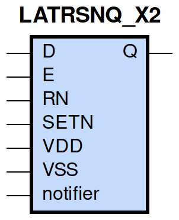
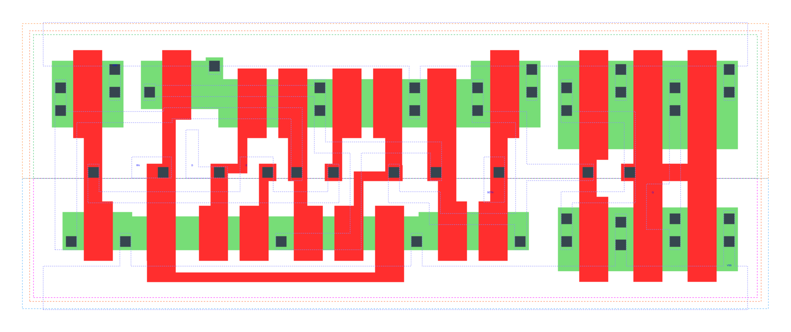

====================================
gf180mcu_fd_sc_mcu9t5v0__latrsnq_x2
====================================

**gf180mcu_fd_sc_mcu9t5v0__latrsnq_x2 symbol**

**gf180mcu_fd_sc_mcu9t5v0__latrsnq_x2 schematic**

.. image:: sc9_sch/LATRSNQ_X2_sch.png
    :height: 250px
    :width: 450 px
    :align: center
    :alt: gf180mcu_fd_sc_mcu9t5v0__latrsnq_x2 schematic

**gf180mcu_fd_sc_mcu9t5v0__latrsnq_x2 layout**

.. include:: images.rst
| LATRSNQ_X2 is a positive D-latch with active low set/reset and 2X drive strength

|
| Attributes

============= ======================
**Attribute** **Value**
area          73.382400 µm\ :sup:`2`
============= ======================

|

TRUTH TABLE

===== ==== = = ======
Input          Output
RN    SETN D E Q
H     H    L H L
H     H    H H H
H     H    X L Q
L     H    X X L
H     L    X X H
L     L    X X H
===== ==== = = ======

|
| FUNCTIONAL SCHEMATIC
| |image431|
| CONSTRAINTS

================== =============== ============= ============
**Constraint Pin** **Related Pin** **setup(ns)** **hold(ns)**
RN(LH)             SETN(LH)        0.0740        -0.0000
RN(LH)             SETN(LH)        0.0740        -0.0000
D(HL)              E(HL)           0.4410        -0.3780
D(LH)              E(HL)           0.4180        -0.3490
SETN(LH)           RN(LH)          0.0000        0.0740
SETN(LH)           RN(LH)          0.0000        0.0740
================== =============== ============= ============

|

================== =============== ================ ===============
**Constraint Pin** **Related Pin** **recovery(ns)** **removal(ns)**
RN(LH)             E(HL)           0.4290           -0.3610
SETN(LH)           E(HL)           0.0110           0.1200
================== =============== ================ ===============

|

================== =============== ===========================
**Constraint Pin** **Related Pin** **Minimum Pulse Width(ns)**
E(LHL)             E(LH)           0.4850
E(LHL)             E(LH)           0.3680
RN(HLH)            RN(HL)          0.3290
RN(HLH)            RN(HL)          0.3290
SETN(HLH)          SETN(HL)        0.2800
SETN(HLH)          SETN(HL)        0.2800
================== =============== ===========================

|
| PIN CAPACITANCE (pf)

======= ======== ====================
**Pin** **Type** **Capacitance (pf)**
E       input    0.0108
RN      input    0.0066
D       input    0.0044
SETN    input    0.0055
======= ======== ====================

|
| DELAY AND OUTPUT TRANSITION TIME corresponding to min slew and load

+---------------+------------+--------------------+--------------+-------------------+----------------+---------------+
| **Input Pin** | **Output** | **When Condition** | **Tin (ns)** | **Out Load (pf)** | **Delay (ns)** | **Tout (ns)** |
+---------------+------------+--------------------+--------------+-------------------+----------------+---------------+
| E(LH)         | Q(LH)      | D&RN&SETN          | 0.0100       | 0.0010            | 0.6405         | 0.0304        |
+---------------+------------+--------------------+--------------+-------------------+----------------+---------------+
| E(LH)         | Q(HL)      | !D&RN&SETN         | 0.0100       | 0.0010            | 0.7842         | 0.0299        |
+---------------+------------+--------------------+--------------+-------------------+----------------+---------------+
| RN(HL)        | Q(HL)      | !D&!E&SETN         | 0.0100       | 0.0010            | 0.6046         | 0.0296        |
+---------------+------------+--------------------+--------------+-------------------+----------------+---------------+
| RN(HL)        | Q(HL)      | D&!E&SETN          | 0.0100       | 0.0010            | 0.6047         | 0.0296        |
+---------------+------------+--------------------+--------------+-------------------+----------------+---------------+
| RN(HL)        | Q(HL)      | D&E&SETN           | 0.0100       | 0.0010            | 0.6068         | 0.0299        |
+---------------+------------+--------------------+--------------+-------------------+----------------+---------------+
| RN(LH)        | Q(LH)      | D&E&SETN           | 0.0100       | 0.0010            | 0.7064         | 0.0304        |
+---------------+------------+--------------------+--------------+-------------------+----------------+---------------+
| D(LH)         | Q(LH)      | E&RN&SETN          | 0.0100       | 0.0010            | 0.6931         | 0.0304        |
+---------------+------------+--------------------+--------------+-------------------+----------------+---------------+
| D(HL)         | Q(HL)      | E&RN&SETN          | 0.0100       | 0.0010            | 0.7572         | 0.0299        |
+---------------+------------+--------------------+--------------+-------------------+----------------+---------------+
| SETN(LH)      | Q(HL)      | !D&!E&!RN          | 0.0100       | 0.0010            | 0.3605         | 0.0294        |
+---------------+------------+--------------------+--------------+-------------------+----------------+---------------+
| SETN(LH)      | Q(HL)      | !D&E&!RN           | 0.0100       | 0.0010            | 0.3675         | 0.0296        |
+---------------+------------+--------------------+--------------+-------------------+----------------+---------------+
| SETN(LH)      | Q(HL)      | !D&E&RN            | 0.0100       | 0.0010            | 0.3694         | 0.0297        |
+---------------+------------+--------------------+--------------+-------------------+----------------+---------------+
| SETN(LH)      | Q(HL)      | D&!E&!RN           | 0.0100       | 0.0010            | 0.3605         | 0.0294        |
+---------------+------------+--------------------+--------------+-------------------+----------------+---------------+
| SETN(LH)      | Q(HL)      | D&E&!RN            | 0.0100       | 0.0010            | 0.3674         | 0.0296        |
+---------------+------------+--------------------+--------------+-------------------+----------------+---------------+
| SETN(HL)      | Q(LH)      | !D&!E&RN           | 0.0100       | 0.0010            | 0.3238         | 0.0289        |
+---------------+------------+--------------------+--------------+-------------------+----------------+---------------+
| SETN(HL)      | Q(LH)      | D&!E&RN            | 0.0100       | 0.0010            | 0.3238         | 0.0290        |
+---------------+------------+--------------------+--------------+-------------------+----------------+---------------+
| SETN(HL)      | Q(LH)      | !D&!E&!RN          | 0.0100       | 0.0010            | 0.3183         | 0.0290        |
+---------------+------------+--------------------+--------------+-------------------+----------------+---------------+
| SETN(HL)      | Q(LH)      | !D&E&!RN           | 0.0100       | 0.0010            | 0.3201         | 0.0291        |
+---------------+------------+--------------------+--------------+-------------------+----------------+---------------+
| SETN(HL)      | Q(LH)      | !D&E&RN            | 0.0100       | 0.0010            | 0.3242         | 0.0291        |
+---------------+------------+--------------------+--------------+-------------------+----------------+---------------+
| SETN(HL)      | Q(LH)      | D&!E&!RN           | 0.0100       | 0.0010            | 0.3183         | 0.0290        |
+---------------+------------+--------------------+--------------+-------------------+----------------+---------------+
| SETN(HL)      | Q(LH)      | D&E&!RN            | 0.0100       | 0.0010            | 0.3201         | 0.0291        |
+---------------+------------+--------------------+--------------+-------------------+----------------+---------------+

|
| DYNAMIC ENERGY

+---------------+--------------------+--------------+------------+-------------------+---------------------+
| **Input Pin** | **When Condition** | **Tin (ns)** | **Output** | **Out Load (pf)** | **Energy (uW/MHz)** |
+---------------+--------------------+--------------+------------+-------------------+---------------------+
| SETN          | !D&!E&!RN          | 0.0100       | Q(HL)      | 0.0010            | 0.5475              |
+---------------+--------------------+--------------+------------+-------------------+---------------------+
| SETN          | !D&E&!RN           | 0.0100       | Q(HL)      | 0.0010            | 0.5638              |
+---------------+--------------------+--------------+------------+-------------------+---------------------+
| SETN          | !D&E&RN            | 0.0100       | Q(HL)      | 0.0010            | 0.5466              |
+---------------+--------------------+--------------+------------+-------------------+---------------------+
| SETN          | D&!E&!RN           | 0.0100       | Q(HL)      | 0.0010            | 0.5475              |
+---------------+--------------------+--------------+------------+-------------------+---------------------+
| SETN          | D&E&!RN            | 0.0100       | Q(HL)      | 0.0010            | 0.5637              |
+---------------+--------------------+--------------+------------+-------------------+---------------------+
| SETN          | !D&!E&RN           | 0.0100       | Q(LH)      | 0.0010            | 0.7767              |
+---------------+--------------------+--------------+------------+-------------------+---------------------+
| SETN          | D&!E&RN            | 0.0100       | Q(LH)      | 0.0010            | 0.7766              |
+---------------+--------------------+--------------+------------+-------------------+---------------------+
| SETN          | !D&!E&!RN          | 0.0100       | Q(LH)      | 0.0010            | 0.6216              |
+---------------+--------------------+--------------+------------+-------------------+---------------------+
| SETN          | !D&E&!RN           | 0.0100       | Q(LH)      | 0.0010            | 0.6238              |
+---------------+--------------------+--------------+------------+-------------------+---------------------+
| SETN          | !D&E&RN            | 0.0100       | Q(LH)      | 0.0010            | 0.6360              |
+---------------+--------------------+--------------+------------+-------------------+---------------------+
| SETN          | D&!E&!RN           | 0.0100       | Q(LH)      | 0.0010            | 0.6216              |
+---------------+--------------------+--------------+------------+-------------------+---------------------+
| SETN          | D&E&!RN            | 0.0100       | Q(LH)      | 0.0010            | 0.6238              |
+---------------+--------------------+--------------+------------+-------------------+---------------------+
| E             | D&RN&SETN          | 0.0100       | Q(LH)      | 0.0010            | 0.7450              |
+---------------+--------------------+--------------+------------+-------------------+---------------------+
| RN            | !D&!E&SETN         | 0.0100       | Q(HL)      | 0.0010            | 0.8696              |
+---------------+--------------------+--------------+------------+-------------------+---------------------+
| RN            | D&!E&SETN          | 0.0100       | Q(HL)      | 0.0010            | 0.8719              |
+---------------+--------------------+--------------+------------+-------------------+---------------------+
| RN            | D&E&SETN           | 0.0100       | Q(HL)      | 0.0010            | 0.9326              |
+---------------+--------------------+--------------+------------+-------------------+---------------------+
| E             | !D&RN&SETN         | 0.0100       | Q(HL)      | 0.0010            | 0.8428              |
+---------------+--------------------+--------------+------------+-------------------+---------------------+
| RN            | D&E&SETN           | 0.0100       | Q(LH)      | 0.0010            | 0.7436              |
+---------------+--------------------+--------------+------------+-------------------+---------------------+
| D             | E&RN&SETN          | 0.0100       | Q(LH)      | 0.0010            | 0.7420              |
+---------------+--------------------+--------------+------------+-------------------+---------------------+
| D             | E&RN&SETN          | 0.0100       | Q(HL)      | 0.0010            | 0.8915              |
+---------------+--------------------+--------------+------------+-------------------+---------------------+
| SETN(HL)      | !D&!E&RN           | 0.0100       | n/a        | n/a               | 0.0546              |
+---------------+--------------------+--------------+------------+-------------------+---------------------+
| SETN(HL)      | D&!E&RN            | 0.0100       | n/a        | n/a               | 0.0546              |
+---------------+--------------------+--------------+------------+-------------------+---------------------+
| SETN(HL)      | D&E&RN             | 0.0100       | n/a        | n/a               | 0.0546              |
+---------------+--------------------+--------------+------------+-------------------+---------------------+
| D(HL)         | !E&!RN&!SETN       | 0.0100       | n/a        | n/a               | 0.0467              |
+---------------+--------------------+--------------+------------+-------------------+---------------------+
| D(HL)         | !E&RN&!SETN        | 0.0100       | n/a        | n/a               | 0.0360              |
+---------------+--------------------+--------------+------------+-------------------+---------------------+
| D(HL)         | E&!RN&!SETN        | 0.0100       | n/a        | n/a               | 0.0397              |
+---------------+--------------------+--------------+------------+-------------------+---------------------+
| D(HL)         | E&RN&!SETN         | 0.0100       | n/a        | n/a               | 0.2638              |
+---------------+--------------------+--------------+------------+-------------------+---------------------+
| D(HL)         | !E&!RN&SETN        | 0.0100       | n/a        | n/a               | 0.0467              |
+---------------+--------------------+--------------+------------+-------------------+---------------------+
| D(HL)         | E&!RN&SETN         | 0.0100       | n/a        | n/a               | 0.0397              |
+---------------+--------------------+--------------+------------+-------------------+---------------------+
| D(HL)         | !E&RN&SETN         | 0.0100       | n/a        | n/a               | 0.0382              |
+---------------+--------------------+--------------+------------+-------------------+---------------------+
| E(LH)         | !D&!RN&!SETN       | 0.0100       | n/a        | n/a               | 0.0087              |
+---------------+--------------------+--------------+------------+-------------------+---------------------+
| E(LH)         | !D&RN&!SETN        | 0.0100       | n/a        | n/a               | 0.2103              |
+---------------+--------------------+--------------+------------+-------------------+---------------------+
| E(LH)         | D&!RN&!SETN        | 0.0100       | n/a        | n/a               | 0.0456              |
+---------------+--------------------+--------------+------------+-------------------+---------------------+
| E(LH)         | D&RN&!SETN         | 0.0100       | n/a        | n/a               | 0.0031              |
+---------------+--------------------+--------------+------------+-------------------+---------------------+
| E(LH)         | !D&!RN&SETN        | 0.0100       | n/a        | n/a               | 0.0068              |
+---------------+--------------------+--------------+------------+-------------------+---------------------+
| E(LH)         | D&!RN&SETN         | 0.0100       | n/a        | n/a               | 0.0436              |
+---------------+--------------------+--------------+------------+-------------------+---------------------+
| E(LH)         | !D&RN&SETN         | 0.0100       | n/a        | n/a               | -0.0047             |
+---------------+--------------------+--------------+------------+-------------------+---------------------+
| E(LH)         | D&RN&SETN          | 0.0100       | n/a        | n/a               | -0.0055             |
+---------------+--------------------+--------------+------------+-------------------+---------------------+
| D(LH)         | !E&!RN&!SETN       | 0.0100       | n/a        | n/a               | -0.0356             |
+---------------+--------------------+--------------+------------+-------------------+---------------------+
| D(LH)         | !E&RN&!SETN        | 0.0100       | n/a        | n/a               | -0.0316             |
+---------------+--------------------+--------------+------------+-------------------+---------------------+
| D(LH)         | E&!RN&!SETN        | 0.0100       | n/a        | n/a               | -0.0264             |
+---------------+--------------------+--------------+------------+-------------------+---------------------+
| D(LH)         | E&RN&!SETN         | 0.0100       | n/a        | n/a               | 0.0711              |
+---------------+--------------------+--------------+------------+-------------------+---------------------+
| D(LH)         | !E&!RN&SETN        | 0.0100       | n/a        | n/a               | -0.0356             |
+---------------+--------------------+--------------+------------+-------------------+---------------------+
| D(LH)         | E&!RN&SETN         | 0.0100       | n/a        | n/a               | -0.0264             |
+---------------+--------------------+--------------+------------+-------------------+---------------------+
| D(LH)         | !E&RN&SETN         | 0.0100       | n/a        | n/a               | -0.0355             |
+---------------+--------------------+--------------+------------+-------------------+---------------------+
| RN(HL)        | !D&!E&!SETN        | 0.0100       | n/a        | n/a               | 0.2449              |
+---------------+--------------------+--------------+------------+-------------------+---------------------+
| RN(HL)        | !D&E&!SETN         | 0.0100       | n/a        | n/a               | 0.0434              |
+---------------+--------------------+--------------+------------+-------------------+---------------------+
| RN(HL)        | D&!E&!SETN         | 0.0100       | n/a        | n/a               | 0.2476              |
+---------------+--------------------+--------------+------------+-------------------+---------------------+
| RN(HL)        | D&E&!SETN          | 0.0100       | n/a        | n/a               | 0.3016              |
+---------------+--------------------+--------------+------------+-------------------+---------------------+
| RN(HL)        | !D&!E&SETN         | 0.0100       | n/a        | n/a               | 0.0389              |
+---------------+--------------------+--------------+------------+-------------------+---------------------+
| RN(HL)        | D&!E&SETN          | 0.0100       | n/a        | n/a               | 0.0417              |
+---------------+--------------------+--------------+------------+-------------------+---------------------+
| RN(HL)        | !D&E&SETN          | 0.0100       | n/a        | n/a               | 0.0388              |
+---------------+--------------------+--------------+------------+-------------------+---------------------+
| RN(LH)        | !D&!E&!SETN        | 0.0100       | n/a        | n/a               | 0.1217              |
+---------------+--------------------+--------------+------------+-------------------+---------------------+
| RN(LH)        | !D&E&!SETN         | 0.0100       | n/a        | n/a               | -0.0359             |
+---------------+--------------------+--------------+------------+-------------------+---------------------+
| RN(LH)        | D&!E&!SETN         | 0.0100       | n/a        | n/a               | 0.1217              |
+---------------+--------------------+--------------+------------+-------------------+---------------------+
| RN(LH)        | D&E&!SETN          | 0.0100       | n/a        | n/a               | 0.0726              |
+---------------+--------------------+--------------+------------+-------------------+---------------------+
| RN(LH)        | !D&!E&SETN         | 0.0100       | n/a        | n/a               | -0.0361             |
+---------------+--------------------+--------------+------------+-------------------+---------------------+
| RN(LH)        | !D&E&SETN          | 0.0100       | n/a        | n/a               | -0.0361             |
+---------------+--------------------+--------------+------------+-------------------+---------------------+
| RN(LH)        | D&!E&SETN          | 0.0100       | n/a        | n/a               | -0.0361             |
+---------------+--------------------+--------------+------------+-------------------+---------------------+
| SETN(LH)      | !D&!E&RN           | 0.0100       | n/a        | n/a               | -0.0416             |
+---------------+--------------------+--------------+------------+-------------------+---------------------+
| SETN(LH)      | D&!E&RN            | 0.0100       | n/a        | n/a               | -0.0416             |
+---------------+--------------------+--------------+------------+-------------------+---------------------+
| SETN(LH)      | D&E&RN             | 0.0100       | n/a        | n/a               | -0.0416             |
+---------------+--------------------+--------------+------------+-------------------+---------------------+
| E(HL)         | !D&!RN&!SETN       | 0.0100       | n/a        | n/a               | 0.2350              |
+---------------+--------------------+--------------+------------+-------------------+---------------------+
| E(HL)         | !D&RN&!SETN        | 0.0100       | n/a        | n/a               | 0.3294              |
+---------------+--------------------+--------------+------------+-------------------+---------------------+
| E(HL)         | D&!RN&!SETN        | 0.0100       | n/a        | n/a               | 0.2355              |
+---------------+--------------------+--------------+------------+-------------------+---------------------+
| E(HL)         | D&RN&!SETN         | 0.0100       | n/a        | n/a               | 0.2184              |
+---------------+--------------------+--------------+------------+-------------------+---------------------+
| E(HL)         | D&RN&SETN          | 0.0100       | n/a        | n/a               | 0.2184              |
+---------------+--------------------+--------------+------------+-------------------+---------------------+
| E(HL)         | !D&!RN&SETN        | 0.0100       | n/a        | n/a               | 0.2220              |
+---------------+--------------------+--------------+------------+-------------------+---------------------+
| E(HL)         | !D&RN&SETN         | 0.0100       | n/a        | n/a               | 0.2219              |
+---------------+--------------------+--------------+------------+-------------------+---------------------+
| E(HL)         | D&!RN&SETN         | 0.0100       | n/a        | n/a               | 0.2225              |
+---------------+--------------------+--------------+------------+-------------------+---------------------+

|
| LEAKAGE POWER

================== ==============
**When Condition** **Power (nW)**
!D&!E&!RN&!SETN    0.3086
!D&!E&RN&!SETN     0.2923
!D&E&!RN&!SETN     0.2703
!D&E&RN&!SETN      0.2706
D&!E&!RN&!SETN     0.3087
D&!E&RN&!SETN      0.2923
D&E&!RN&!SETN      0.3097
D&E&RN&!SETN       0.2933
D&E&RN&SETN        0.3334
!D&!E&!RN&SETN     0.2975
!D&E&!RN&SETN      0.2985
!D&E&RN&SETN       0.2987
D&!E&!RN&SETN      0.2976
D&E&!RN&SETN       0.3379
!D&!E&RN&SETN      0.3470
D&!E&RN&SETN       0.3963
================== ==============

