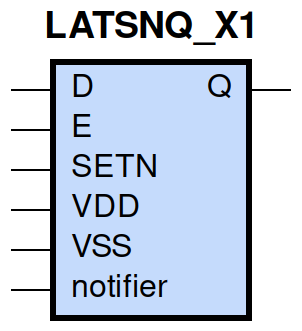
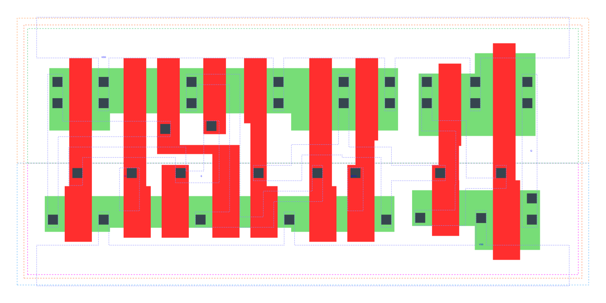

====================================
gf180mcu_fd_sc_mcu9t5v0__latsnq_x1
====================================

**gf180mcu_fd_sc_mcu9t5v0__latsnq_x1 symbol**

**gf180mcu_fd_sc_mcu9t5v0__latsnq_x1 schematic**

.. image:: sc9_sch/LATSNQ_X1_sch.png
    :height: 250px
    :width: 450 px
    :align: center
    :alt: gf180mcu_fd_sc_mcu9t5v0__latsnq_x1 schematic

**gf180mcu_fd_sc_mcu9t5v0__latsnq_x1 layout**

.. include:: images.rst
| LATSNQ_X1 is a positive D-latch with active low set and 1X drive strength

|
| Attributes

============= ======================
**Attribute** **Value**
area          59.270400 µm\ :sup:`2`
============= ======================

|

TRUTH TABLE

===== = = ======
Input     Output
SETN  D E Q
H     L H L
H     H H H
H     X L Q
L     X X H
===== = = ======

|
| FUNCTIONAL SCHEMATIC
| |image437|
| CONSTRAINTS

================== =============== ============= ============
**Constraint Pin** **Related Pin** **setup(ns)** **hold(ns)**
D(HL)              E(HL)           0.3430        -0.2980
D(LH)              E(HL)           0.2400        -0.1950
================== =============== ============= ============

|

================== =============== ================ ===============
**Constraint Pin** **Related Pin** **recovery(ns)** **removal(ns)**
SETN(LH)           E(HL)           0.0060           0.0630
================== =============== ================ ===============

|

================== =============== ===========================
**Constraint Pin** **Related Pin** **Minimum Pulse Width(ns)**
E(LHL)             E(LH)           0.3980
E(LHL)             E(LH)           0.2120
SETN(HLH)          SETN(HL)        0.2020
SETN(HLH)          SETN(HL)        0.2020
================== =============== ===========================

|
| PIN CAPACITANCE (pf)

======= ======== ====================
**Pin** **Type** **Capacitance (pf)**
E       input    0.0099
D       input    0.0040
SETN    input    0.0051
======= ======== ====================

|
| DELAY AND OUTPUT TRANSITION TIME corresponding to min slew and load

+---------------+------------+--------------------+--------------+-------------------+----------------+---------------+
| **Input Pin** | **Output** | **When Condition** | **Tin (ns)** | **Out Load (pf)** | **Delay (ns)** | **Tout (ns)** |
+---------------+------------+--------------------+--------------+-------------------+----------------+---------------+
| E(LH)         | Q(LH)      | D&SETN             | 0.0100       | 0.0010            | 0.4270         | 0.0332        |
+---------------+------------+--------------------+--------------+-------------------+----------------+---------------+
| E(LH)         | Q(HL)      | !D&SETN            | 0.0100       | 0.0010            | 0.6286         | 0.0289        |
+---------------+------------+--------------------+--------------+-------------------+----------------+---------------+
| D(LH)         | Q(LH)      | E&SETN             | 0.0100       | 0.0010            | 0.4577         | 0.0331        |
+---------------+------------+--------------------+--------------+-------------------+----------------+---------------+
| D(HL)         | Q(HL)      | E&SETN             | 0.0100       | 0.0010            | 0.5905         | 0.0289        |
+---------------+------------+--------------------+--------------+-------------------+----------------+---------------+
| SETN(LH)      | Q(HL)      | !D&E               | 0.0100       | 0.0010            | 0.2962         | 0.0286        |
+---------------+------------+--------------------+--------------+-------------------+----------------+---------------+
| SETN(HL)      | Q(LH)      | !D&!E              | 0.0100       | 0.0010            | 0.2715         | 0.0328        |
+---------------+------------+--------------------+--------------+-------------------+----------------+---------------+
| SETN(HL)      | Q(LH)      | D&!E               | 0.0100       | 0.0010            | 0.2717         | 0.0328        |
+---------------+------------+--------------------+--------------+-------------------+----------------+---------------+
| SETN(HL)      | Q(LH)      | !D&E               | 0.0100       | 0.0010            | 0.2709         | 0.0328        |
+---------------+------------+--------------------+--------------+-------------------+----------------+---------------+

|
| DYNAMIC ENERGY

+---------------+--------------------+--------------+------------+-------------------+---------------------+
| **Input Pin** | **When Condition** | **Tin (ns)** | **Output** | **Out Load (pf)** | **Energy (uW/MHz)** |
+---------------+--------------------+--------------+------------+-------------------+---------------------+
| SETN          | !D&E               | 0.0100       | Q(HL)      | 0.0010            | 0.3239              |
+---------------+--------------------+--------------+------------+-------------------+---------------------+
| SETN          | !D&!E              | 0.0100       | Q(LH)      | 0.0010            | 0.5669              |
+---------------+--------------------+--------------+------------+-------------------+---------------------+
| SETN          | D&!E               | 0.0100       | Q(LH)      | 0.0010            | 0.5672              |
+---------------+--------------------+--------------+------------+-------------------+---------------------+
| SETN          | !D&E               | 0.0100       | Q(LH)      | 0.0010            | 0.4338              |
+---------------+--------------------+--------------+------------+-------------------+---------------------+
| E             | D&SETN             | 0.0100       | Q(LH)      | 0.0010            | 0.5082              |
+---------------+--------------------+--------------+------------+-------------------+---------------------+
| E             | !D&SETN            | 0.0100       | Q(HL)      | 0.0010            | 0.5899              |
+---------------+--------------------+--------------+------------+-------------------+---------------------+
| D             | E&SETN             | 0.0100       | Q(LH)      | 0.0010            | 0.5019              |
+---------------+--------------------+--------------+------------+-------------------+---------------------+
| D             | E&SETN             | 0.0100       | Q(HL)      | 0.0010            | 0.6257              |
+---------------+--------------------+--------------+------------+-------------------+---------------------+
| SETN(HL)      | !D&!E              | 0.0100       | n/a        | n/a               | 0.0491              |
+---------------+--------------------+--------------+------------+-------------------+---------------------+
| SETN(HL)      | D&!E               | 0.0100       | n/a        | n/a               | 0.0491              |
+---------------+--------------------+--------------+------------+-------------------+---------------------+
| SETN(HL)      | D&E                | 0.0100       | n/a        | n/a               | 0.0490              |
+---------------+--------------------+--------------+------------+-------------------+---------------------+
| D(HL)         | !E&!SETN           | 0.0100       | n/a        | n/a               | 0.0321              |
+---------------+--------------------+--------------+------------+-------------------+---------------------+
| D(HL)         | E&!SETN            | 0.0100       | n/a        | n/a               | 0.2271              |
+---------------+--------------------+--------------+------------+-------------------+---------------------+
| D(HL)         | !E&SETN            | 0.0100       | n/a        | n/a               | 0.0343              |
+---------------+--------------------+--------------+------------+-------------------+---------------------+
| E(LH)         | !D&!SETN           | 0.0100       | n/a        | n/a               | 0.1855              |
+---------------+--------------------+--------------+------------+-------------------+---------------------+
| E(LH)         | D&!SETN            | 0.0100       | n/a        | n/a               | 0.0059              |
+---------------+--------------------+--------------+------------+-------------------+---------------------+
| E(LH)         | !D&SETN            | 0.0100       | n/a        | n/a               | -0.0021             |
+---------------+--------------------+--------------+------------+-------------------+---------------------+
| E(LH)         | D&SETN             | 0.0100       | n/a        | n/a               | -0.0028             |
+---------------+--------------------+--------------+------------+-------------------+---------------------+
| D(LH)         | !E&!SETN           | 0.0100       | n/a        | n/a               | -0.0276             |
+---------------+--------------------+--------------+------------+-------------------+---------------------+
| D(LH)         | E&!SETN            | 0.0100       | n/a        | n/a               | 0.0632              |
+---------------+--------------------+--------------+------------+-------------------+---------------------+
| D(LH)         | !E&SETN            | 0.0100       | n/a        | n/a               | -0.0315             |
+---------------+--------------------+--------------+------------+-------------------+---------------------+
| SETN(LH)      | !D&!E              | 0.0100       | n/a        | n/a               | -0.0360             |
+---------------+--------------------+--------------+------------+-------------------+---------------------+
| SETN(LH)      | D&!E               | 0.0100       | n/a        | n/a               | -0.0360             |
+---------------+--------------------+--------------+------------+-------------------+---------------------+
| SETN(LH)      | D&E                | 0.0100       | n/a        | n/a               | -0.0360             |
+---------------+--------------------+--------------+------------+-------------------+---------------------+
| E(HL)         | !D&!SETN           | 0.0100       | n/a        | n/a               | 0.3006              |
+---------------+--------------------+--------------+------------+-------------------+---------------------+
| E(HL)         | D&!SETN            | 0.0100       | n/a        | n/a               | 0.2013              |
+---------------+--------------------+--------------+------------+-------------------+---------------------+
| E(HL)         | D&SETN             | 0.0100       | n/a        | n/a               | 0.2013              |
+---------------+--------------------+--------------+------------+-------------------+---------------------+
| E(HL)         | !D&SETN            | 0.0100       | n/a        | n/a               | 0.1994              |
+---------------+--------------------+--------------+------------+-------------------+---------------------+

|
| LEAKAGE POWER

================== ==============
**When Condition** **Power (nW)**
!D&!E&!SETN        0.2413
!D&E&!SETN         0.2451
D&!E&!SETN         0.2413
D&E&!SETN          0.2424
D&E&SETN           0.2826
!D&!E&SETN         0.3209
D&!E&SETN          0.3570
!D&E&SETN          0.2727
================== ==============

