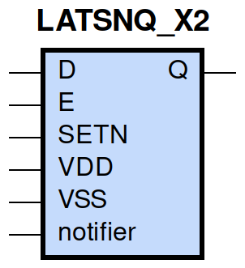
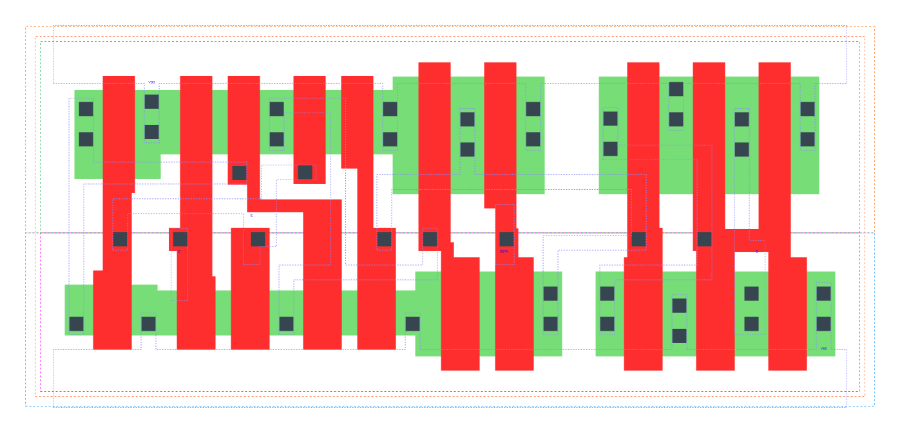

====================================
gf180mcu_fd_sc_mcu9t5v0__latsnq_x2
====================================

**gf180mcu_fd_sc_mcu9t5v0__latsnq_x2 symbol**

**gf180mcu_fd_sc_mcu9t5v0__latsnq_x2 schematic**

.. image:: sc9_sch/LATSNQ_X2_sch.png
    :height: 250px
    :width: 450 px
    :align: center
    :alt: gf180mcu_fd_sc_mcu9t5v0__latsnq_x2 schematic

**gf180mcu_fd_sc_mcu9t5v0__latsnq_x2 layout**

.. include:: images.rst
| LATSNQ_X2 is a positive D-latch with active low set and 2X drive strength

|
| Attributes

============= ======================
**Attribute** **Value**
area          62.092800 µm\ :sup:`2`
============= ======================

|

TRUTH TABLE

===== = = ======
Input     Output
SETN  D E Q
H     L H L
H     H H H
H     X L Q
L     X X H
===== = = ======

|
| FUNCTIONAL SCHEMATIC
| |image440|
| CONSTRAINTS

================== =============== ============= ============
**Constraint Pin** **Related Pin** **setup(ns)** **hold(ns)**
D(HL)              E(HL)           0.3490        -0.3030
D(LH)              E(HL)           0.2630        -0.2180
================== =============== ============= ============

|

================== =============== ================ ===============
**Constraint Pin** **Related Pin** **recovery(ns)** **removal(ns)**
SETN(LH)           E(HL)           -0.0230          0.1030
================== =============== ================ ===============

|

================== =============== ===========================
**Constraint Pin** **Related Pin** **Minimum Pulse Width(ns)**
E(LHL)             E(LH)           0.3980
E(LHL)             E(LH)           0.2320
SETN(HLH)          SETN(HL)        0.2120
SETN(HLH)          SETN(HL)        0.2120
================== =============== ===========================

|
| PIN CAPACITANCE (pf)

======= ======== ====================
**Pin** **Type** **Capacitance (pf)**
E       input    0.0098
D       input    0.0040
SETN    input    0.0070
======= ======== ====================

|
| DELAY AND OUTPUT TRANSITION TIME corresponding to min slew and load

+---------------+------------+--------------------+--------------+-------------------+----------------+---------------+
| **Input Pin** | **Output** | **When Condition** | **Tin (ns)** | **Out Load (pf)** | **Delay (ns)** | **Tout (ns)** |
+---------------+------------+--------------------+--------------+-------------------+----------------+---------------+
| E(LH)         | Q(LH)      | D&SETN             | 0.0100       | 0.0010            | 0.4351         | 0.0254        |
+---------------+------------+--------------------+--------------+-------------------+----------------+---------------+
| E(LH)         | Q(HL)      | !D&SETN            | 0.0100       | 0.0010            | 0.6310         | 0.0262        |
+---------------+------------+--------------------+--------------+-------------------+----------------+---------------+
| D(LH)         | Q(LH)      | E&SETN             | 0.0100       | 0.0010            | 0.4666         | 0.0254        |
+---------------+------------+--------------------+--------------+-------------------+----------------+---------------+
| D(HL)         | Q(HL)      | E&SETN             | 0.0100       | 0.0010            | 0.5939         | 0.0262        |
+---------------+------------+--------------------+--------------+-------------------+----------------+---------------+
| SETN(LH)      | Q(HL)      | !D&E               | 0.0100       | 0.0010            | 0.2722         | 0.0259        |
+---------------+------------+--------------------+--------------+-------------------+----------------+---------------+
| SETN(HL)      | Q(LH)      | !D&!E              | 0.0100       | 0.0010            | 0.2568         | 0.0250        |
+---------------+------------+--------------------+--------------+-------------------+----------------+---------------+
| SETN(HL)      | Q(LH)      | D&!E               | 0.0100       | 0.0010            | 0.2568         | 0.0250        |
+---------------+------------+--------------------+--------------+-------------------+----------------+---------------+
| SETN(HL)      | Q(LH)      | !D&E               | 0.0100       | 0.0010            | 0.2561         | 0.0251        |
+---------------+------------+--------------------+--------------+-------------------+----------------+---------------+

|
| DYNAMIC ENERGY

+---------------+--------------------+--------------+------------+-------------------+---------------------+
| **Input Pin** | **When Condition** | **Tin (ns)** | **Output** | **Out Load (pf)** | **Energy (uW/MHz)** |
+---------------+--------------------+--------------+------------+-------------------+---------------------+
| SETN          | !D&E               | 0.0100       | Q(HL)      | 0.0010            | 0.5154              |
+---------------+--------------------+--------------+------------+-------------------+---------------------+
| SETN          | !D&!E              | 0.0100       | Q(LH)      | 0.0010            | 0.7875              |
+---------------+--------------------+--------------+------------+-------------------+---------------------+
| SETN          | D&!E               | 0.0100       | Q(LH)      | 0.0010            | 0.7876              |
+---------------+--------------------+--------------+------------+-------------------+---------------------+
| SETN          | !D&E               | 0.0100       | Q(LH)      | 0.0010            | 0.6404              |
+---------------+--------------------+--------------+------------+-------------------+---------------------+
| E             | D&SETN             | 0.0100       | Q(LH)      | 0.0010            | 0.7502              |
+---------------+--------------------+--------------+------------+-------------------+---------------------+
| E             | !D&SETN            | 0.0100       | Q(HL)      | 0.0010            | 0.8441              |
+---------------+--------------------+--------------+------------+-------------------+---------------------+
| D             | E&SETN             | 0.0100       | Q(LH)      | 0.0010            | 0.7448              |
+---------------+--------------------+--------------+------------+-------------------+---------------------+
| D             | E&SETN             | 0.0100       | Q(HL)      | 0.0010            | 0.8810              |
+---------------+--------------------+--------------+------------+-------------------+---------------------+
| SETN(HL)      | !D&!E              | 0.0100       | n/a        | n/a               | 0.0669              |
+---------------+--------------------+--------------+------------+-------------------+---------------------+
| SETN(HL)      | D&!E               | 0.0100       | n/a        | n/a               | 0.0669              |
+---------------+--------------------+--------------+------------+-------------------+---------------------+
| SETN(HL)      | D&E                | 0.0100       | n/a        | n/a               | 0.0669              |
+---------------+--------------------+--------------+------------+-------------------+---------------------+
| D(HL)         | !E&!SETN           | 0.0100       | n/a        | n/a               | 0.0321              |
+---------------+--------------------+--------------+------------+-------------------+---------------------+
| D(HL)         | E&!SETN            | 0.0100       | n/a        | n/a               | 0.2437              |
+---------------+--------------------+--------------+------------+-------------------+---------------------+
| D(HL)         | !E&SETN            | 0.0100       | n/a        | n/a               | 0.0344              |
+---------------+--------------------+--------------+------------+-------------------+---------------------+
| E(LH)         | !D&!SETN           | 0.0100       | n/a        | n/a               | 0.2014              |
+---------------+--------------------+--------------+------------+-------------------+---------------------+
| E(LH)         | D&!SETN            | 0.0100       | n/a        | n/a               | 0.0059              |
+---------------+--------------------+--------------+------------+-------------------+---------------------+
| E(LH)         | !D&SETN            | 0.0100       | n/a        | n/a               | -0.0019             |
+---------------+--------------------+--------------+------------+-------------------+---------------------+
| E(LH)         | D&SETN             | 0.0100       | n/a        | n/a               | -0.0028             |
+---------------+--------------------+--------------+------------+-------------------+---------------------+
| D(LH)         | !E&!SETN           | 0.0100       | n/a        | n/a               | -0.0276             |
+---------------+--------------------+--------------+------------+-------------------+---------------------+
| D(LH)         | E&!SETN            | 0.0100       | n/a        | n/a               | 0.0782              |
+---------------+--------------------+--------------+------------+-------------------+---------------------+
| D(LH)         | !E&SETN            | 0.0100       | n/a        | n/a               | -0.0315             |
+---------------+--------------------+--------------+------------+-------------------+---------------------+
| SETN(LH)      | !D&!E              | 0.0100       | n/a        | n/a               | -0.0464             |
+---------------+--------------------+--------------+------------+-------------------+---------------------+
| SETN(LH)      | D&!E               | 0.0100       | n/a        | n/a               | -0.0464             |
+---------------+--------------------+--------------+------------+-------------------+---------------------+
| SETN(LH)      | D&E                | 0.0100       | n/a        | n/a               | -0.0464             |
+---------------+--------------------+--------------+------------+-------------------+---------------------+
| E(HL)         | !D&!SETN           | 0.0100       | n/a        | n/a               | 0.3140              |
+---------------+--------------------+--------------+------------+-------------------+---------------------+
| E(HL)         | D&!SETN            | 0.0100       | n/a        | n/a               | 0.2001              |
+---------------+--------------------+--------------+------------+-------------------+---------------------+
| E(HL)         | D&SETN             | 0.0100       | n/a        | n/a               | 0.2001              |
+---------------+--------------------+--------------+------------+-------------------+---------------------+
| E(HL)         | !D&SETN            | 0.0100       | n/a        | n/a               | 0.2007              |
+---------------+--------------------+--------------+------------+-------------------+---------------------+

|
| LEAKAGE POWER

================== ==============
**When Condition** **Power (nW)**
!D&!E&!SETN        0.2672
!D&E&!SETN         0.2711
D&!E&!SETN         0.2672
D&E&!SETN          0.2683
D&E&SETN           0.3084
!D&!E&SETN         0.3485
D&!E&SETN          0.3697
!D&E&SETN          0.3002
================== ==============

