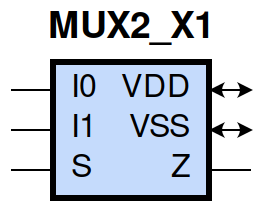
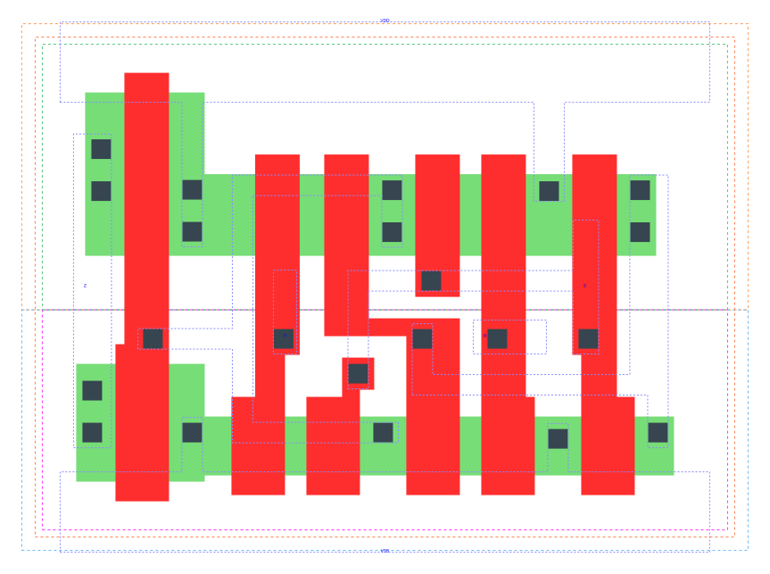

====================================
gf180mcu_fd_sc_mcu9t5v0__mux2_x1
====================================

**gf180mcu_fd_sc_mcu9t5v0__mux2_x1 symbol**

**gf180mcu_fd_sc_mcu9t5v0__mux2_x1 schematic**

**gf180mcu_fd_sc_mcu9t5v0__mux2_x1 layout**

.. include:: images.rst
| MUX2_X1 is a 2-to-1 multiplexer with 1X drive strength

|
| Attributes

============= ======================
**Attribute** **Value**
area          36.691200 µm\ :sup:`2`
============= ======================

|
| OUTPUT FUNCTIONS

============== ==================
**Output Pin** **Function**
Z              ((I0&(!S))|(I1&S))
============== ==================

|
| TRUTH TABLE FOR Z

====== ====== ===== =====
**I0** **I1** **S** **Z**
1      ?      0     1
?      1      1     1
0      ?      0     0
?      0      1     0
====== ====== ===== =====

|
| FUNCTIONAL SCHEMATIC

| |image446|

| PIN CAPACITANCE (pf)

======= ======== ====================
**Pin** **Type** **Capacitance (pf)**
I1      input    0.0037
S       input    0.0083
I0      input    0.0039
======= ======== ====================

|
| DELAY AND OUTPUT TRANSITION TIME corresponding to min slew and load

+---------------+------------+--------------------+--------------+-------------------+----------------+---------------+
| **Input Pin** | **Output** | **When Condition** | **Tin (ns)** | **Out Load (pf)** | **Delay (ns)** | **Tout (ns)** |
+---------------+------------+--------------------+--------------+-------------------+----------------+---------------+
| I1(HL)        | Z(HL)      | !I0&S              | 0.0100       | 0.0010            | 0.3339         | 0.0568        |
+---------------+------------+--------------------+--------------+-------------------+----------------+---------------+
| I1(HL)        | Z(HL)      | I0&S               | 0.0100       | 0.0010            | 0.3338         | 0.0568        |
+---------------+------------+--------------------+--------------+-------------------+----------------+---------------+
| I1(LH)        | Z(LH)      | !I0&S              | 0.0100       | 0.0010            | 0.2359         | 0.0426        |
+---------------+------------+--------------------+--------------+-------------------+----------------+---------------+
| I1(LH)        | Z(LH)      | I0&S               | 0.0100       | 0.0010            | 0.2359         | 0.0426        |
+---------------+------------+--------------------+--------------+-------------------+----------------+---------------+
| S(LH)         | Z(HL)      | I0&!I1             | 0.0100       | 0.0010            | 0.3680         | 0.0570        |
+---------------+------------+--------------------+--------------+-------------------+----------------+---------------+
| S(HL)         | Z(HL)      | !I0&I1             | 0.0100       | 0.0010            | 0.2721         | 0.0550        |
+---------------+------------+--------------------+--------------+-------------------+----------------+---------------+
| S(LH)         | Z(LH)      | !I0&I1             | 0.0100       | 0.0010            | 0.2017         | 0.0422        |
+---------------+------------+--------------------+--------------+-------------------+----------------+---------------+
| S(HL)         | Z(LH)      | I0&!I1             | 0.0100       | 0.0010            | 0.3310         | 0.0431        |
+---------------+------------+--------------------+--------------+-------------------+----------------+---------------+
| I0(HL)        | Z(HL)      | !I1&!S             | 0.0100       | 0.0010            | 0.3309         | 0.0567        |
+---------------+------------+--------------------+--------------+-------------------+----------------+---------------+
| I0(HL)        | Z(HL)      | I1&!S              | 0.0100       | 0.0010            | 0.3309         | 0.0567        |
+---------------+------------+--------------------+--------------+-------------------+----------------+---------------+
| I0(LH)        | Z(LH)      | !I1&!S             | 0.0100       | 0.0010            | 0.2399         | 0.0427        |
+---------------+------------+--------------------+--------------+-------------------+----------------+---------------+
| I0(LH)        | Z(LH)      | I1&!S              | 0.0100       | 0.0010            | 0.2399         | 0.0427        |
+---------------+------------+--------------------+--------------+-------------------+----------------+---------------+

|
| DYNAMIC ENERGY

+---------------+--------------------+--------------+------------+-------------------+---------------------+
| **Input Pin** | **When Condition** | **Tin (ns)** | **Output** | **Out Load (pf)** | **Energy (uW/MHz)** |
+---------------+--------------------+--------------+------------+-------------------+---------------------+
| I0            | !I1&!S             | 0.0100       | Z(HL)      | 0.0010            | 0.3755              |
+---------------+--------------------+--------------+------------+-------------------+---------------------+
| I0            | I1&!S              | 0.0100       | Z(HL)      | 0.0010            | 0.3756              |
+---------------+--------------------+--------------+------------+-------------------+---------------------+
| S             | I0&!I1             | 0.0100       | Z(HL)      | 0.0010            | 0.3627              |
+---------------+--------------------+--------------+------------+-------------------+---------------------+
| S             | !I0&I1             | 0.0100       | Z(HL)      | 0.0010            | 0.4708              |
+---------------+--------------------+--------------+------------+-------------------+---------------------+
| I1            | !I0&S              | 0.0100       | Z(HL)      | 0.0010            | 0.3994              |
+---------------+--------------------+--------------+------------+-------------------+---------------------+
| I1            | I0&S               | 0.0100       | Z(HL)      | 0.0010            | 0.3994              |
+---------------+--------------------+--------------+------------+-------------------+---------------------+
| I0            | !I1&!S             | 0.0100       | Z(LH)      | 0.0010            | 0.2152              |
+---------------+--------------------+--------------+------------+-------------------+---------------------+
| I0            | I1&!S              | 0.0100       | Z(LH)      | 0.0010            | 0.2152              |
+---------------+--------------------+--------------+------------+-------------------+---------------------+
| S             | !I0&I1             | 0.0100       | Z(LH)      | 0.0010            | 0.1919              |
+---------------+--------------------+--------------+------------+-------------------+---------------------+
| S             | I0&!I1             | 0.0100       | Z(LH)      | 0.0010            | 0.3943              |
+---------------+--------------------+--------------+------------+-------------------+---------------------+
| I1            | !I0&S              | 0.0100       | Z(LH)      | 0.0010            | 0.1907              |
+---------------+--------------------+--------------+------------+-------------------+---------------------+
| I1            | I0&S               | 0.0100       | Z(LH)      | 0.0010            | 0.1907              |
+---------------+--------------------+--------------+------------+-------------------+---------------------+
| I0(HL)        | !I1&S              | 0.0100       | n/a        | n/a               | 0.0327              |
+---------------+--------------------+--------------+------------+-------------------+---------------------+
| I0(HL)        | I1&S               | 0.0100       | n/a        | n/a               | 0.0293              |
+---------------+--------------------+--------------+------------+-------------------+---------------------+
| S(HL)         | !I0&!I1            | 0.0100       | n/a        | n/a               | 0.1683              |
+---------------+--------------------+--------------+------------+-------------------+---------------------+
| S(HL)         | I0&I1              | 0.0100       | n/a        | n/a               | 0.1655              |
+---------------+--------------------+--------------+------------+-------------------+---------------------+
| I0(LH)        | !I1&S              | 0.0100       | n/a        | n/a               | -0.0285             |
+---------------+--------------------+--------------+------------+-------------------+---------------------+
| I0(LH)        | I1&S               | 0.0100       | n/a        | n/a               | -0.0247             |
+---------------+--------------------+--------------+------------+-------------------+---------------------+
| S(LH)         | !I0&!I1            | 0.0100       | n/a        | n/a               | 0.0111              |
+---------------+--------------------+--------------+------------+-------------------+---------------------+
| S(LH)         | I0&I1              | 0.0100       | n/a        | n/a               | 0.0086              |
+---------------+--------------------+--------------+------------+-------------------+---------------------+
| I1(LH)        | !I0&!S             | 0.0100       | n/a        | n/a               | -0.0288             |
+---------------+--------------------+--------------+------------+-------------------+---------------------+
| I1(LH)        | I0&!S              | 0.0100       | n/a        | n/a               | -0.0252             |
+---------------+--------------------+--------------+------------+-------------------+---------------------+
| I1(HL)        | !I0&!S             | 0.0100       | n/a        | n/a               | 0.0327              |
+---------------+--------------------+--------------+------------+-------------------+---------------------+
| I1(HL)        | I0&!S              | 0.0100       | n/a        | n/a               | 0.0293              |
+---------------+--------------------+--------------+------------+-------------------+---------------------+

|
| LEAKAGE POWER

================== ==============
**When Condition** **Power (nW)**
!I0&!I1&!S         0.1930
!I0&!I1&S          0.1938
!I0&I1&!S          0.1932
I0&!I1&S           0.1941
!I0&I1&S           0.1903
I0&!I1&!S          0.1894
I0&I1&!S           0.1894
I0&I1&S            0.1903
================== ==============

