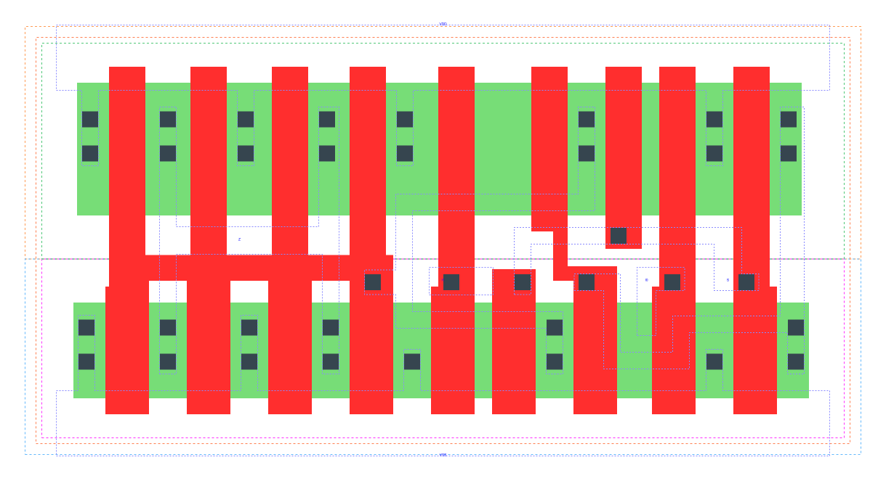

====================================
gf180mcu_fd_sc_mcu9t5v0__mux2_x4
====================================

**gf180mcu_fd_sc_mcu9t5v0__mux2_x4 symbol**

.. image:: sc9_sym/MUX2_X4_sym.png
    :height: 200px
    :width: 400 px
    :align: center
    :alt: gf180mcu_fd_sc_mcu9t5v0__mux2_x4 symbol

**gf180mcu_fd_sc_mcu9t5v0__mux2_x4 schematic**

.. image:: sc9_sch/MUX2_X4_sch.png
    :height: 250px
    :width: 450 px
    :align: center
    :alt: gf180mcu_fd_sc_mcu9t5v0__mux2_x4 schematic

**gf180mcu_fd_sc_mcu9t5v0__mux2_x4 layout**

.. include:: images.rst
| MUX2_X4 is a 2-to-1 multiplexer with 4X drive strength

|
| Attributes

============= ======================
**Attribute** **Value**
area          53.625600 µm\ :sup:`2`
============= ======================

|
| OUTPUT FUNCTIONS

============== ==================
**Output Pin** **Function**
Z              ((I0&(!S))|(I1&S))
============== ==================

|
| TRUTH TABLE FOR Z

====== ====== ===== =====
**I0** **I1** **S** **Z**
1      ?      0     1
?      1      1     1
0      ?      0     0
?      0      1     0
====== ====== ===== =====

|
| FUNCTIONAL SCHEMATIC

| |image452|

| PIN CAPACITANCE (pf)

======= ======== ====================
**Pin** **Type** **Capacitance (pf)**
I1      input    0.0066
S       input    0.0143
I0      input    0.0068
======= ======== ====================

|
| DELAY AND OUTPUT TRANSITION TIME corresponding to min slew and load

+---------------+------------+--------------------+--------------+-------------------+----------------+---------------+
| **Input Pin** | **Output** | **When Condition** | **Tin (ns)** | **Out Load (pf)** | **Delay (ns)** | **Tout (ns)** |
+---------------+------------+--------------------+--------------+-------------------+----------------+---------------+
| I1(HL)        | Z(HL)      | !I0&S              | 0.0100       | 0.0010            | 0.4077         | 0.0619        |
+---------------+------------+--------------------+--------------+-------------------+----------------+---------------+
| I1(HL)        | Z(HL)      | I0&S               | 0.0100       | 0.0010            | 0.4077         | 0.0619        |
+---------------+------------+--------------------+--------------+-------------------+----------------+---------------+
| I1(LH)        | Z(LH)      | !I0&S              | 0.0100       | 0.0010            | 0.2941         | 0.0411        |
+---------------+------------+--------------------+--------------+-------------------+----------------+---------------+
| I1(LH)        | Z(LH)      | I0&S               | 0.0100       | 0.0010            | 0.2941         | 0.0411        |
+---------------+------------+--------------------+--------------+-------------------+----------------+---------------+
| S(LH)         | Z(HL)      | I0&!I1             | 0.0100       | 0.0010            | 0.4221         | 0.0619        |
+---------------+------------+--------------------+--------------+-------------------+----------------+---------------+
| S(HL)         | Z(HL)      | !I0&I1             | 0.0100       | 0.0010            | 0.3443         | 0.0619        |
+---------------+------------+--------------------+--------------+-------------------+----------------+---------------+
| S(LH)         | Z(LH)      | !I0&I1             | 0.0100       | 0.0010            | 0.2583         | 0.0408        |
+---------------+------------+--------------------+--------------+-------------------+----------------+---------------+
| S(HL)         | Z(LH)      | I0&!I1             | 0.0100       | 0.0010            | 0.3614         | 0.0410        |
+---------------+------------+--------------------+--------------+-------------------+----------------+---------------+
| I0(HL)        | Z(HL)      | !I1&!S             | 0.0100       | 0.0010            | 0.4037         | 0.0622        |
+---------------+------------+--------------------+--------------+-------------------+----------------+---------------+
| I0(HL)        | Z(HL)      | I1&!S              | 0.0100       | 0.0010            | 0.4037         | 0.0622        |
+---------------+------------+--------------------+--------------+-------------------+----------------+---------------+
| I0(LH)        | Z(LH)      | !I1&!S             | 0.0100       | 0.0010            | 0.2948         | 0.0408        |
+---------------+------------+--------------------+--------------+-------------------+----------------+---------------+
| I0(LH)        | Z(LH)      | I1&!S              | 0.0100       | 0.0010            | 0.2948         | 0.0408        |
+---------------+------------+--------------------+--------------+-------------------+----------------+---------------+

|
| DYNAMIC ENERGY

+---------------+--------------------+--------------+------------+-------------------+---------------------+
| **Input Pin** | **When Condition** | **Tin (ns)** | **Output** | **Out Load (pf)** | **Energy (uW/MHz)** |
+---------------+--------------------+--------------+------------+-------------------+---------------------+
| I0            | !I1&!S             | 0.0100       | Z(HL)      | 0.0010            | 1.4438              |
+---------------+--------------------+--------------+------------+-------------------+---------------------+
| I0            | I1&!S              | 0.0100       | Z(HL)      | 0.0010            | 1.4438              |
+---------------+--------------------+--------------+------------+-------------------+---------------------+
| S             | I0&!I1             | 0.0100       | Z(HL)      | 0.0010            | 1.3969              |
+---------------+--------------------+--------------+------------+-------------------+---------------------+
| S             | !I0&I1             | 0.0100       | Z(HL)      | 0.0010            | 1.5836              |
+---------------+--------------------+--------------+------------+-------------------+---------------------+
| I1            | !I0&S              | 0.0100       | Z(HL)      | 0.0010            | 1.4834              |
+---------------+--------------------+--------------+------------+-------------------+---------------------+
| I1            | I0&S               | 0.0100       | Z(HL)      | 0.0010            | 1.4834              |
+---------------+--------------------+--------------+------------+-------------------+---------------------+
| I0            | !I1&!S             | 0.0100       | Z(LH)      | 0.0010            | 0.8483              |
+---------------+--------------------+--------------+------------+-------------------+---------------------+
| I0            | I1&!S              | 0.0100       | Z(LH)      | 0.0010            | 0.8483              |
+---------------+--------------------+--------------+------------+-------------------+---------------------+
| S             | !I0&I1             | 0.0100       | Z(LH)      | 0.0010            | 0.8168              |
+---------------+--------------------+--------------+------------+-------------------+---------------------+
| S             | I0&!I1             | 0.0100       | Z(LH)      | 0.0010            | 1.1440              |
+---------------+--------------------+--------------+------------+-------------------+---------------------+
| I1            | !I0&S              | 0.0100       | Z(LH)      | 0.0010            | 0.8169              |
+---------------+--------------------+--------------+------------+-------------------+---------------------+
| I1            | I0&S               | 0.0100       | Z(LH)      | 0.0010            | 0.8169              |
+---------------+--------------------+--------------+------------+-------------------+---------------------+
| I0(HL)        | !I1&S              | 0.0100       | n/a        | n/a               | 0.0666              |
+---------------+--------------------+--------------+------------+-------------------+---------------------+
| I0(HL)        | I1&S               | 0.0100       | n/a        | n/a               | 0.0596              |
+---------------+--------------------+--------------+------------+-------------------+---------------------+
| S(HL)         | !I0&!I1            | 0.0100       | n/a        | n/a               | 0.2864              |
+---------------+--------------------+--------------+------------+-------------------+---------------------+
| S(HL)         | I0&I1              | 0.0100       | n/a        | n/a               | 0.2747              |
+---------------+--------------------+--------------+------------+-------------------+---------------------+
| I0(LH)        | !I1&S              | 0.0100       | n/a        | n/a               | -0.0578             |
+---------------+--------------------+--------------+------------+-------------------+---------------------+
| I0(LH)        | I1&S               | 0.0100       | n/a        | n/a               | -0.0501             |
+---------------+--------------------+--------------+------------+-------------------+---------------------+
| S(LH)         | !I0&!I1            | 0.0100       | n/a        | n/a               | 0.0165              |
+---------------+--------------------+--------------+------------+-------------------+---------------------+
| S(LH)         | I0&I1              | 0.0100       | n/a        | n/a               | 0.0245              |
+---------------+--------------------+--------------+------------+-------------------+---------------------+
| I1(LH)        | !I0&!S             | 0.0100       | n/a        | n/a               | -0.0583             |
+---------------+--------------------+--------------+------------+-------------------+---------------------+
| I1(LH)        | I0&!S              | 0.0100       | n/a        | n/a               | -0.0505             |
+---------------+--------------------+--------------+------------+-------------------+---------------------+
| I1(HL)        | !I0&!S             | 0.0100       | n/a        | n/a               | 0.0662              |
+---------------+--------------------+--------------+------------+-------------------+---------------------+
| I1(HL)        | I0&!S              | 0.0100       | n/a        | n/a               | 0.0595              |
+---------------+--------------------+--------------+------------+-------------------+---------------------+

|
| LEAKAGE POWER

================== ==============
**When Condition** **Power (nW)**
!I0&!I1&!S         0.2736
!I0&!I1&S          0.2749
!I0&I1&!S          0.2739
I0&!I1&S           0.2752
!I0&I1&S           0.2684
I0&!I1&!S          0.2671
I0&I1&!S           0.2671
I0&I1&S            0.2684
================== ==============

