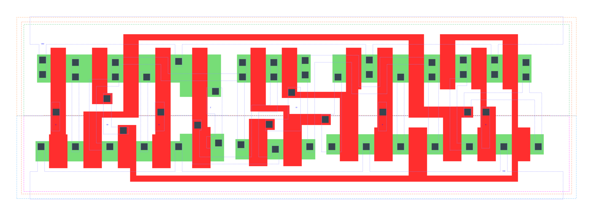

====================================
gf180mcu_fd_sc_mcu9t5v0__mux4_x1
====================================

**gf180mcu_fd_sc_mcu9t5v0__mux4_x1 symbol**

.. image:: sc9_sym/MUX4_X1_sym.png
    :height: 200px
    :width: 400 px
    :align: center
    :alt: gf180mcu_fd_sc_mcu9t5v0__mux4_x1 symbol

**gf180mcu_fd_sc_mcu9t5v0__mux4_x1 schematic**

.. image:: sc9_sch/MUX4_X1_sch.png
    :height: 250px
    :width: 450 px
    :align: center
    :alt: gf180mcu_fd_sc_mcu9t5v0__mux4_x1 schematic

**gf180mcu_fd_sc_mcu9t5v0__mux4_x1 layout**

.. include:: images.rst
| MUX4_X1 is a 4-to-1 multiplexer with 1X drive strength

|
| Attributes

============= ======================
**Attribute** **Value**
area          87.494400 µm\ :sup:`2`
============= ======================

|
| OUTPUT FUNCTIONS

============== =========================================================
**Output Pin** **Function**
Z              ((I0&(!S0)&(!S1))|(I1&S0&(!S1))|(I2&(!S0)&S1)|(I3&S0&S1))
============== =========================================================

|
| TRUTH TABLE FOR Z

====== ====== ====== ====== ====== ====== =====
**I0** **I1** **I2** **I3** **S0** **S1** **Z**
1      ?      ?      ?      0      0      1
?      1      ?      ?      1      0      1
?      ?      1      ?      0      1      1
?      ?      ?      1      1      1      1
0      ?      ?      ?      0      0      0
?      0      ?      ?      1      0      0
?      ?      0      ?      0      1      0
?      ?      ?      0      1      1      0
====== ====== ====== ====== ====== ====== =====

|
| FUNCTIONAL SCHEMATIC

| |image455|

| PIN CAPACITANCE (pf)

======= ======== ====================
**Pin** **Type** **Capacitance (pf)**
I2      input    0.0039
S0      input    0.0137
I3      input    0.0040
S1      input    0.0084
I1      input    0.0039
I0      input    0.0040
======= ======== ====================

|
| DELAY AND OUTPUT TRANSITION TIME corresponding to min slew and load

+---------------+------------+---------------------+--------------+-------------------+----------------+---------------+
| **Input Pin** | **Output** | **When Condition**  | **Tin (ns)** | **Out Load (pf)** | **Delay (ns)** | **Tout (ns)** |
+---------------+------------+---------------------+--------------+-------------------+----------------+---------------+
| I2(HL)        | Z(HL)      | !I0&!I1&!I3&!S0&S1  | 0.0100       | 0.0010            | 0.3839         | 0.0734        |
+---------------+------------+---------------------+--------------+-------------------+----------------+---------------+
| I2(HL)        | Z(HL)      | !I0&!I1&I3&!S0&S1   | 0.0100       | 0.0010            | 0.3839         | 0.0734        |
+---------------+------------+---------------------+--------------+-------------------+----------------+---------------+
| I2(HL)        | Z(HL)      | !I0&I1&!I3&!S0&S1   | 0.0100       | 0.0010            | 0.3839         | 0.0734        |
+---------------+------------+---------------------+--------------+-------------------+----------------+---------------+
| I2(HL)        | Z(HL)      | !I0&I1&I3&!S0&S1    | 0.0100       | 0.0010            | 0.3839         | 0.0735        |
+---------------+------------+---------------------+--------------+-------------------+----------------+---------------+
| I2(HL)        | Z(HL)      | I0&!I1&!I3&!S0&S1   | 0.0100       | 0.0010            | 0.3839         | 0.0734        |
+---------------+------------+---------------------+--------------+-------------------+----------------+---------------+
| I2(HL)        | Z(HL)      | I0&!I1&I3&!S0&S1    | 0.0100       | 0.0010            | 0.3838         | 0.0736        |
+---------------+------------+---------------------+--------------+-------------------+----------------+---------------+
| I2(HL)        | Z(HL)      | I0&I1&!I3&!S0&S1    | 0.0100       | 0.0010            | 0.3839         | 0.0734        |
+---------------+------------+---------------------+--------------+-------------------+----------------+---------------+
| I2(HL)        | Z(HL)      | I0&I1&I3&!S0&S1     | 0.0100       | 0.0010            | 0.3838         | 0.0736        |
+---------------+------------+---------------------+--------------+-------------------+----------------+---------------+
| I2(LH)        | Z(LH)      | !I0&!I1&!I3&!S0&S1  | 0.0100       | 0.0010            | 0.3603         | 0.0543        |
+---------------+------------+---------------------+--------------+-------------------+----------------+---------------+
| I2(LH)        | Z(LH)      | !I0&!I1&I3&!S0&S1   | 0.0100       | 0.0010            | 0.3603         | 0.0543        |
+---------------+------------+---------------------+--------------+-------------------+----------------+---------------+
| I2(LH)        | Z(LH)      | !I0&I1&!I3&!S0&S1   | 0.0100       | 0.0010            | 0.3603         | 0.0543        |
+---------------+------------+---------------------+--------------+-------------------+----------------+---------------+
| I2(LH)        | Z(LH)      | !I0&I1&I3&!S0&S1    | 0.0100       | 0.0010            | 0.3603         | 0.0543        |
+---------------+------------+---------------------+--------------+-------------------+----------------+---------------+
| I2(LH)        | Z(LH)      | I0&!I1&!I3&!S0&S1   | 0.0100       | 0.0010            | 0.3603         | 0.0543        |
+---------------+------------+---------------------+--------------+-------------------+----------------+---------------+
| I2(LH)        | Z(LH)      | I0&!I1&I3&!S0&S1    | 0.0100       | 0.0010            | 0.3603         | 0.0543        |
+---------------+------------+---------------------+--------------+-------------------+----------------+---------------+
| I2(LH)        | Z(LH)      | I0&I1&!I3&!S0&S1    | 0.0100       | 0.0010            | 0.3603         | 0.0543        |
+---------------+------------+---------------------+--------------+-------------------+----------------+---------------+
| I2(LH)        | Z(LH)      | I0&I1&I3&!S0&S1     | 0.0100       | 0.0010            | 0.3603         | 0.0543        |
+---------------+------------+---------------------+--------------+-------------------+----------------+---------------+
| S0(HL)        | Z(LH)      | !I0&!I1&I2&!I3&S1   | 0.0100       | 0.0010            | 0.4495         | 0.0553        |
+---------------+------------+---------------------+--------------+-------------------+----------------+---------------+
| S0(HL)        | Z(LH)      | !I0&I1&I2&!I3&S1    | 0.0100       | 0.0010            | 0.4373         | 0.0546        |
+---------------+------------+---------------------+--------------+-------------------+----------------+---------------+
| S0(HL)        | Z(LH)      | I0&!I1&!I2&!I3&!S1  | 0.0100       | 0.0010            | 0.4518         | 0.0552        |
+---------------+------------+---------------------+--------------+-------------------+----------------+---------------+
| S0(HL)        | Z(LH)      | I0&!I1&!I2&I3&!S1   | 0.0100       | 0.0010            | 0.4396         | 0.0547        |
+---------------+------------+---------------------+--------------+-------------------+----------------+---------------+
| S0(HL)        | Z(LH)      | I0&!I1&I2&!I3&!S1   | 0.0100       | 0.0010            | 0.4610         | 0.0552        |
+---------------+------------+---------------------+--------------+-------------------+----------------+---------------+
| S0(HL)        | Z(LH)      | I0&!I1&I2&!I3&S1    | 0.0100       | 0.0010            | 0.4583         | 0.0551        |
+---------------+------------+---------------------+--------------+-------------------+----------------+---------------+
| S0(HL)        | Z(LH)      | I0&!I1&I2&I3&!S1    | 0.0100       | 0.0010            | 0.4493         | 0.0549        |
+---------------+------------+---------------------+--------------+-------------------+----------------+---------------+
| S0(HL)        | Z(LH)      | I0&I1&I2&!I3&S1     | 0.0100       | 0.0010            | 0.4467         | 0.0548        |
+---------------+------------+---------------------+--------------+-------------------+----------------+---------------+
| S0(HL)        | Z(HL)      | !I0&!I1&!I2&I3&S1   | 0.0100       | 0.0010            | 0.3947         | 0.0725        |
+---------------+------------+---------------------+--------------+-------------------+----------------+---------------+
| S0(HL)        | Z(HL)      | !I0&I1&!I2&!I3&!S1  | 0.0100       | 0.0010            | 0.3974         | 0.0723        |
+---------------+------------+---------------------+--------------+-------------------+----------------+---------------+
| S0(HL)        | Z(HL)      | !I0&I1&!I2&I3&!S1   | 0.0100       | 0.0010            | 0.3890         | 0.0721        |
+---------------+------------+---------------------+--------------+-------------------+----------------+---------------+
| S0(HL)        | Z(HL)      | !I0&I1&!I2&I3&S1    | 0.0100       | 0.0010            | 0.3866         | 0.0721        |
+---------------+------------+---------------------+--------------+-------------------+----------------+---------------+
| S0(HL)        | Z(HL)      | !I0&I1&I2&!I3&!S1   | 0.0100       | 0.0010            | 0.4039         | 0.0732        |
+---------------+------------+---------------------+--------------+-------------------+----------------+---------------+
| S0(HL)        | Z(HL)      | !I0&I1&I2&I3&!S1    | 0.0100       | 0.0010            | 0.3959         | 0.0726        |
+---------------+------------+---------------------+--------------+-------------------+----------------+---------------+
| S0(HL)        | Z(HL)      | I0&!I1&!I2&I3&S1    | 0.0100       | 0.0010            | 0.4005         | 0.0730        |
+---------------+------------+---------------------+--------------+-------------------+----------------+---------------+
| S0(HL)        | Z(HL)      | I0&I1&!I2&I3&S1     | 0.0100       | 0.0010            | 0.3931         | 0.0726        |
+---------------+------------+---------------------+--------------+-------------------+----------------+---------------+
| S0(LH)        | Z(LH)      | !I0&!I1&!I2&I3&S1   | 0.0100       | 0.0010            | 0.3235         | 0.0534        |
+---------------+------------+---------------------+--------------+-------------------+----------------+---------------+
| S0(LH)        | Z(LH)      | !I0&I1&!I2&!I3&!S1  | 0.0100       | 0.0010            | 0.3305         | 0.0535        |
+---------------+------------+---------------------+--------------+-------------------+----------------+---------------+
| S0(LH)        | Z(LH)      | !I0&I1&!I2&I3&!S1   | 0.0100       | 0.0010            | 0.3301         | 0.0536        |
+---------------+------------+---------------------+--------------+-------------------+----------------+---------------+
| S0(LH)        | Z(LH)      | !I0&I1&!I2&I3&S1    | 0.0100       | 0.0010            | 0.3230         | 0.0534        |
+---------------+------------+---------------------+--------------+-------------------+----------------+---------------+
| S0(LH)        | Z(LH)      | !I0&I1&I2&!I3&!S1   | 0.0100       | 0.0010            | 0.3306         | 0.0533        |
+---------------+------------+---------------------+--------------+-------------------+----------------+---------------+
| S0(LH)        | Z(LH)      | !I0&I1&I2&I3&!S1    | 0.0100       | 0.0010            | 0.3304         | 0.0535        |
+---------------+------------+---------------------+--------------+-------------------+----------------+---------------+
| S0(LH)        | Z(LH)      | I0&!I1&!I2&I3&S1    | 0.0100       | 0.0010            | 0.3237         | 0.0533        |
+---------------+------------+---------------------+--------------+-------------------+----------------+---------------+
| S0(LH)        | Z(LH)      | I0&I1&!I2&I3&S1     | 0.0100       | 0.0010            | 0.3236         | 0.0534        |
+---------------+------------+---------------------+--------------+-------------------+----------------+---------------+
| S0(LH)        | Z(HL)      | !I0&!I1&I2&!I3&S1   | 0.0100       | 0.0010            | 0.3649         | 0.0740        |
+---------------+------------+---------------------+--------------+-------------------+----------------+---------------+
| S0(LH)        | Z(HL)      | !I0&I1&I2&!I3&S1    | 0.0100       | 0.0010            | 0.3605         | 0.0736        |
+---------------+------------+---------------------+--------------+-------------------+----------------+---------------+
| S0(LH)        | Z(HL)      | I0&!I1&!I2&!I3&!S1  | 0.0100       | 0.0010            | 0.3653         | 0.0737        |
+---------------+------------+---------------------+--------------+-------------------+----------------+---------------+
| S0(LH)        | Z(HL)      | I0&!I1&!I2&I3&!S1   | 0.0100       | 0.0010            | 0.3606         | 0.0735        |
+---------------+------------+---------------------+--------------+-------------------+----------------+---------------+
| S0(LH)        | Z(HL)      | I0&!I1&I2&!I3&!S1   | 0.0100       | 0.0010            | 0.3671         | 0.0740        |
+---------------+------------+---------------------+--------------+-------------------+----------------+---------------+
| S0(LH)        | Z(HL)      | I0&!I1&I2&!I3&S1    | 0.0100       | 0.0010            | 0.3670         | 0.0739        |
+---------------+------------+---------------------+--------------+-------------------+----------------+---------------+
| S0(LH)        | Z(HL)      | I0&!I1&I2&I3&!S1    | 0.0100       | 0.0010            | 0.3654         | 0.0739        |
+---------------+------------+---------------------+--------------+-------------------+----------------+---------------+
| S0(LH)        | Z(HL)      | I0&I1&I2&!I3&S1     | 0.0100       | 0.0010            | 0.3651         | 0.0739        |
+---------------+------------+---------------------+--------------+-------------------+----------------+---------------+
| I3(LH)        | Z(LH)      | !I0&!I1&!I2&S0&S1   | 0.0100       | 0.0010            | 0.3534         | 0.0538        |
+---------------+------------+---------------------+--------------+-------------------+----------------+---------------+
| I3(LH)        | Z(LH)      | !I0&!I1&I2&S0&S1    | 0.0100       | 0.0010            | 0.3532         | 0.0536        |
+---------------+------------+---------------------+--------------+-------------------+----------------+---------------+
| I3(LH)        | Z(LH)      | !I0&I1&!I2&S0&S1    | 0.0100       | 0.0010            | 0.3534         | 0.0536        |
+---------------+------------+---------------------+--------------+-------------------+----------------+---------------+
| I3(LH)        | Z(LH)      | !I0&I1&I2&S0&S1     | 0.0100       | 0.0010            | 0.3534         | 0.0539        |
+---------------+------------+---------------------+--------------+-------------------+----------------+---------------+
| I3(LH)        | Z(LH)      | I0&!I1&!I2&S0&S1    | 0.0100       | 0.0010            | 0.3534         | 0.0539        |
+---------------+------------+---------------------+--------------+-------------------+----------------+---------------+
| I3(LH)        | Z(LH)      | I0&!I1&I2&S0&S1     | 0.0100       | 0.0010            | 0.3532         | 0.0536        |
+---------------+------------+---------------------+--------------+-------------------+----------------+---------------+
| I3(LH)        | Z(LH)      | I0&I1&!I2&S0&S1     | 0.0100       | 0.0010            | 0.3534         | 0.0537        |
+---------------+------------+---------------------+--------------+-------------------+----------------+---------------+
| I3(LH)        | Z(LH)      | I0&I1&I2&S0&S1      | 0.0100       | 0.0010            | 0.3534         | 0.0539        |
+---------------+------------+---------------------+--------------+-------------------+----------------+---------------+
| I3(HL)        | Z(HL)      | !I0&!I1&!I2&S0&S1   | 0.0100       | 0.0010            | 0.3820         | 0.0736        |
+---------------+------------+---------------------+--------------+-------------------+----------------+---------------+
| I3(HL)        | Z(HL)      | !I0&!I1&I2&S0&S1    | 0.0100       | 0.0010            | 0.3820         | 0.0737        |
+---------------+------------+---------------------+--------------+-------------------+----------------+---------------+
| I3(HL)        | Z(HL)      | !I0&I1&!I2&S0&S1    | 0.0100       | 0.0010            | 0.3820         | 0.0737        |
+---------------+------------+---------------------+--------------+-------------------+----------------+---------------+
| I3(HL)        | Z(HL)      | !I0&I1&I2&S0&S1     | 0.0100       | 0.0010            | 0.3820         | 0.0737        |
+---------------+------------+---------------------+--------------+-------------------+----------------+---------------+
| I3(HL)        | Z(HL)      | I0&!I1&!I2&S0&S1    | 0.0100       | 0.0010            | 0.3820         | 0.0736        |
+---------------+------------+---------------------+--------------+-------------------+----------------+---------------+
| I3(HL)        | Z(HL)      | I0&!I1&I2&S0&S1     | 0.0100       | 0.0010            | 0.3820         | 0.0736        |
+---------------+------------+---------------------+--------------+-------------------+----------------+---------------+
| I3(HL)        | Z(HL)      | I0&I1&!I2&S0&S1     | 0.0100       | 0.0010            | 0.3820         | 0.0737        |
+---------------+------------+---------------------+--------------+-------------------+----------------+---------------+
| I3(HL)        | Z(HL)      | I0&I1&I2&S0&S1      | 0.0100       | 0.0010            | 0.3820         | 0.0737        |
+---------------+------------+---------------------+--------------+-------------------+----------------+---------------+
| S1(LH)        | Z(HL)      | !I0&I1&!I2&!I3&S0   | 0.0100       | 0.0010            | 0.2127         | 0.0599        |
+---------------+------------+---------------------+--------------+-------------------+----------------+---------------+
| S1(LH)        | Z(HL)      | !I0&I1&I2&!I3&S0    | 0.0100       | 0.0010            | 0.2127         | 0.0599        |
+---------------+------------+---------------------+--------------+-------------------+----------------+---------------+
| S1(LH)        | Z(HL)      | I0&!I1&!I2&!I3&!S0  | 0.0100       | 0.0010            | 0.2131         | 0.0601        |
+---------------+------------+---------------------+--------------+-------------------+----------------+---------------+
| S1(LH)        | Z(HL)      | I0&!I1&!I2&I3&!S0   | 0.0100       | 0.0010            | 0.2131         | 0.0601        |
+---------------+------------+---------------------+--------------+-------------------+----------------+---------------+
| S1(LH)        | Z(HL)      | I0&I1&!I2&!I3&!S0   | 0.0100       | 0.0010            | 0.2131         | 0.0601        |
+---------------+------------+---------------------+--------------+-------------------+----------------+---------------+
| S1(LH)        | Z(HL)      | I0&I1&!I2&!I3&S0    | 0.0100       | 0.0010            | 0.2127         | 0.0599        |
+---------------+------------+---------------------+--------------+-------------------+----------------+---------------+
| S1(LH)        | Z(HL)      | I0&I1&!I2&I3&!S0    | 0.0100       | 0.0010            | 0.2131         | 0.0601        |
+---------------+------------+---------------------+--------------+-------------------+----------------+---------------+
| S1(LH)        | Z(HL)      | I0&I1&I2&!I3&S0     | 0.0100       | 0.0010            | 0.2127         | 0.0599        |
+---------------+------------+---------------------+--------------+-------------------+----------------+---------------+
| S1(LH)        | Z(LH)      | !I0&!I1&!I2&I3&S0   | 0.0100       | 0.0010            | 0.1977         | 0.0510        |
+---------------+------------+---------------------+--------------+-------------------+----------------+---------------+
| S1(LH)        | Z(LH)      | !I0&!I1&I2&!I3&!S0  | 0.0100       | 0.0010            | 0.1973         | 0.0511        |
+---------------+------------+---------------------+--------------+-------------------+----------------+---------------+
| S1(LH)        | Z(LH)      | !I0&!I1&I2&I3&!S0   | 0.0100       | 0.0010            | 0.1973         | 0.0511        |
+---------------+------------+---------------------+--------------+-------------------+----------------+---------------+
| S1(LH)        | Z(LH)      | !I0&!I1&I2&I3&S0    | 0.0100       | 0.0010            | 0.1977         | 0.0510        |
+---------------+------------+---------------------+--------------+-------------------+----------------+---------------+
| S1(LH)        | Z(LH)      | !I0&I1&I2&!I3&!S0   | 0.0100       | 0.0010            | 0.1973         | 0.0511        |
+---------------+------------+---------------------+--------------+-------------------+----------------+---------------+
| S1(LH)        | Z(LH)      | !I0&I1&I2&I3&!S0    | 0.0100       | 0.0010            | 0.1973         | 0.0510        |
+---------------+------------+---------------------+--------------+-------------------+----------------+---------------+
| S1(LH)        | Z(LH)      | I0&!I1&!I2&I3&S0    | 0.0100       | 0.0010            | 0.1977         | 0.0510        |
+---------------+------------+---------------------+--------------+-------------------+----------------+---------------+
| S1(LH)        | Z(LH)      | I0&!I1&I2&I3&S0     | 0.0100       | 0.0010            | 0.1977         | 0.0512        |
+---------------+------------+---------------------+--------------+-------------------+----------------+---------------+
| S1(HL)        | Z(HL)      | !I0&!I1&!I2&I3&S0   | 0.0100       | 0.0010            | 0.2241         | 0.0532        |
+---------------+------------+---------------------+--------------+-------------------+----------------+---------------+
| S1(HL)        | Z(HL)      | !I0&!I1&I2&!I3&!S0  | 0.0100       | 0.0010            | 0.2240         | 0.0533        |
+---------------+------------+---------------------+--------------+-------------------+----------------+---------------+
| S1(HL)        | Z(HL)      | !I0&!I1&I2&I3&!S0   | 0.0100       | 0.0010            | 0.2240         | 0.0533        |
+---------------+------------+---------------------+--------------+-------------------+----------------+---------------+
| S1(HL)        | Z(HL)      | !I0&!I1&I2&I3&S0    | 0.0100       | 0.0010            | 0.2241         | 0.0532        |
+---------------+------------+---------------------+--------------+-------------------+----------------+---------------+
| S1(HL)        | Z(HL)      | !I0&I1&I2&!I3&!S0   | 0.0100       | 0.0010            | 0.2239         | 0.0532        |
+---------------+------------+---------------------+--------------+-------------------+----------------+---------------+
| S1(HL)        | Z(HL)      | !I0&I1&I2&I3&!S0    | 0.0100       | 0.0010            | 0.2239         | 0.0532        |
+---------------+------------+---------------------+--------------+-------------------+----------------+---------------+
| S1(HL)        | Z(HL)      | I0&!I1&!I2&I3&S0    | 0.0100       | 0.0010            | 0.2241         | 0.0532        |
+---------------+------------+---------------------+--------------+-------------------+----------------+---------------+
| S1(HL)        | Z(HL)      | I0&!I1&I2&I3&S0     | 0.0100       | 0.0010            | 0.2241         | 0.0532        |
+---------------+------------+---------------------+--------------+-------------------+----------------+---------------+
| S1(HL)        | Z(LH)      | !I0&I1&!I2&!I3&S0   | 0.0100       | 0.0010            | 0.2789         | 0.0513        |
+---------------+------------+---------------------+--------------+-------------------+----------------+---------------+
| S1(HL)        | Z(LH)      | !I0&I1&I2&!I3&S0    | 0.0100       | 0.0010            | 0.2789         | 0.0513        |
+---------------+------------+---------------------+--------------+-------------------+----------------+---------------+
| S1(HL)        | Z(LH)      | I0&!I1&!I2&!I3&!S0  | 0.0100       | 0.0010            | 0.2785         | 0.0510        |
+---------------+------------+---------------------+--------------+-------------------+----------------+---------------+
| S1(HL)        | Z(LH)      | I0&!I1&!I2&I3&!S0   | 0.0100       | 0.0010            | 0.2785         | 0.0510        |
+---------------+------------+---------------------+--------------+-------------------+----------------+---------------+
| S1(HL)        | Z(LH)      | I0&I1&!I2&!I3&!S0   | 0.0100       | 0.0010            | 0.2786         | 0.0512        |
+---------------+------------+---------------------+--------------+-------------------+----------------+---------------+
| S1(HL)        | Z(LH)      | I0&I1&!I2&!I3&S0    | 0.0100       | 0.0010            | 0.2789         | 0.0513        |
+---------------+------------+---------------------+--------------+-------------------+----------------+---------------+
| S1(HL)        | Z(LH)      | I0&I1&!I2&I3&!S0    | 0.0100       | 0.0010            | 0.2786         | 0.0512        |
+---------------+------------+---------------------+--------------+-------------------+----------------+---------------+
| S1(HL)        | Z(LH)      | I0&I1&I2&!I3&S0     | 0.0100       | 0.0010            | 0.2789         | 0.0513        |
+---------------+------------+---------------------+--------------+-------------------+----------------+---------------+
| I1(LH)        | Z(LH)      | !I0&!I2&!I3&S0&!S1  | 0.0100       | 0.0010            | 0.3561         | 0.0540        |
+---------------+------------+---------------------+--------------+-------------------+----------------+---------------+
| I1(LH)        | Z(LH)      | !I0&!I2&I3&S0&!S1   | 0.0100       | 0.0010            | 0.3562         | 0.0539        |
+---------------+------------+---------------------+--------------+-------------------+----------------+---------------+
| I1(LH)        | Z(LH)      | !I0&I2&!I3&S0&!S1   | 0.0100       | 0.0010            | 0.3561         | 0.0540        |
+---------------+------------+---------------------+--------------+-------------------+----------------+---------------+
| I1(LH)        | Z(LH)      | !I0&I2&I3&S0&!S1    | 0.0100       | 0.0010            | 0.3563         | 0.0538        |
+---------------+------------+---------------------+--------------+-------------------+----------------+---------------+
| I1(LH)        | Z(LH)      | I0&!I2&!I3&S0&!S1   | 0.0100       | 0.0010            | 0.3561         | 0.0540        |
+---------------+------------+---------------------+--------------+-------------------+----------------+---------------+
| I1(LH)        | Z(LH)      | I0&!I2&I3&S0&!S1    | 0.0100       | 0.0010            | 0.3561         | 0.0540        |
+---------------+------------+---------------------+--------------+-------------------+----------------+---------------+
| I1(LH)        | Z(LH)      | I0&I2&!I3&S0&!S1    | 0.0100       | 0.0010            | 0.3561         | 0.0539        |
+---------------+------------+---------------------+--------------+-------------------+----------------+---------------+
| I1(LH)        | Z(LH)      | I0&I2&I3&S0&!S1     | 0.0100       | 0.0010            | 0.3561         | 0.0540        |
+---------------+------------+---------------------+--------------+-------------------+----------------+---------------+
| I1(HL)        | Z(HL)      | !I0&!I2&!I3&S0&!S1  | 0.0100       | 0.0010            | 0.3811         | 0.0735        |
+---------------+------------+---------------------+--------------+-------------------+----------------+---------------+
| I1(HL)        | Z(HL)      | !I0&!I2&I3&S0&!S1   | 0.0100       | 0.0010            | 0.3811         | 0.0735        |
+---------------+------------+---------------------+--------------+-------------------+----------------+---------------+
| I1(HL)        | Z(HL)      | !I0&I2&!I3&S0&!S1   | 0.0100       | 0.0010            | 0.3811         | 0.0735        |
+---------------+------------+---------------------+--------------+-------------------+----------------+---------------+
| I1(HL)        | Z(HL)      | !I0&I2&I3&S0&!S1    | 0.0100       | 0.0010            | 0.3811         | 0.0735        |
+---------------+------------+---------------------+--------------+-------------------+----------------+---------------+
| I1(HL)        | Z(HL)      | I0&!I2&!I3&S0&!S1   | 0.0100       | 0.0010            | 0.3811         | 0.0735        |
+---------------+------------+---------------------+--------------+-------------------+----------------+---------------+
| I1(HL)        | Z(HL)      | I0&!I2&I3&S0&!S1    | 0.0100       | 0.0010            | 0.3811         | 0.0735        |
+---------------+------------+---------------------+--------------+-------------------+----------------+---------------+
| I1(HL)        | Z(HL)      | I0&I2&!I3&S0&!S1    | 0.0100       | 0.0010            | 0.3811         | 0.0735        |
+---------------+------------+---------------------+--------------+-------------------+----------------+---------------+
| I1(HL)        | Z(HL)      | I0&I2&I3&S0&!S1     | 0.0100       | 0.0010            | 0.3811         | 0.0735        |
+---------------+------------+---------------------+--------------+-------------------+----------------+---------------+
| I0(LH)        | Z(LH)      | !I1&!I2&!I3&!S0&!S1 | 0.0100       | 0.0010            | 0.3626         | 0.0542        |
+---------------+------------+---------------------+--------------+-------------------+----------------+---------------+
| I0(LH)        | Z(LH)      | !I1&!I2&I3&!S0&!S1  | 0.0100       | 0.0010            | 0.3626         | 0.0542        |
+---------------+------------+---------------------+--------------+-------------------+----------------+---------------+
| I0(LH)        | Z(LH)      | !I1&I2&!I3&!S0&!S1  | 0.0100       | 0.0010            | 0.3626         | 0.0542        |
+---------------+------------+---------------------+--------------+-------------------+----------------+---------------+
| I0(LH)        | Z(LH)      | !I1&I2&I3&!S0&!S1   | 0.0100       | 0.0010            | 0.3626         | 0.0542        |
+---------------+------------+---------------------+--------------+-------------------+----------------+---------------+
| I0(LH)        | Z(LH)      | I1&!I2&!I3&!S0&!S1  | 0.0100       | 0.0010            | 0.3626         | 0.0542        |
+---------------+------------+---------------------+--------------+-------------------+----------------+---------------+
| I0(LH)        | Z(LH)      | I1&!I2&I3&!S0&!S1   | 0.0100       | 0.0010            | 0.3626         | 0.0542        |
+---------------+------------+---------------------+--------------+-------------------+----------------+---------------+
| I0(LH)        | Z(LH)      | I1&I2&!I3&!S0&!S1   | 0.0100       | 0.0010            | 0.3626         | 0.0542        |
+---------------+------------+---------------------+--------------+-------------------+----------------+---------------+
| I0(LH)        | Z(LH)      | I1&I2&I3&!S0&!S1    | 0.0100       | 0.0010            | 0.3626         | 0.0542        |
+---------------+------------+---------------------+--------------+-------------------+----------------+---------------+
| I0(HL)        | Z(HL)      | !I1&!I2&!I3&!S0&!S1 | 0.0100       | 0.0010            | 0.3836         | 0.0735        |
+---------------+------------+---------------------+--------------+-------------------+----------------+---------------+
| I0(HL)        | Z(HL)      | !I1&!I2&I3&!S0&!S1  | 0.0100       | 0.0010            | 0.3836         | 0.0735        |
+---------------+------------+---------------------+--------------+-------------------+----------------+---------------+
| I0(HL)        | Z(HL)      | !I1&I2&!I3&!S0&!S1  | 0.0100       | 0.0010            | 0.3836         | 0.0735        |
+---------------+------------+---------------------+--------------+-------------------+----------------+---------------+
| I0(HL)        | Z(HL)      | !I1&I2&I3&!S0&!S1   | 0.0100       | 0.0010            | 0.3836         | 0.0735        |
+---------------+------------+---------------------+--------------+-------------------+----------------+---------------+
| I0(HL)        | Z(HL)      | I1&!I2&!I3&!S0&!S1  | 0.0100       | 0.0010            | 0.3836         | 0.0735        |
+---------------+------------+---------------------+--------------+-------------------+----------------+---------------+
| I0(HL)        | Z(HL)      | I1&!I2&I3&!S0&!S1   | 0.0100       | 0.0010            | 0.3836         | 0.0735        |
+---------------+------------+---------------------+--------------+-------------------+----------------+---------------+
| I0(HL)        | Z(HL)      | I1&I2&!I3&!S0&!S1   | 0.0100       | 0.0010            | 0.3836         | 0.0735        |
+---------------+------------+---------------------+--------------+-------------------+----------------+---------------+
| I0(HL)        | Z(HL)      | I1&I2&I3&!S0&!S1    | 0.0100       | 0.0010            | 0.3836         | 0.0735        |
+---------------+------------+---------------------+--------------+-------------------+----------------+---------------+

|
| DYNAMIC ENERGY

+---------------+---------------------+--------------+------------+-------------------+---------------------+
| **Input Pin** | **When Condition**  | **Tin (ns)** | **Output** | **Out Load (pf)** | **Energy (uW/MHz)** |
+---------------+---------------------+--------------+------------+-------------------+---------------------+
| S1            | !I0&I1&!I2&!I3&S0   | 0.0100       | Z(HL)      | 0.0010            | 0.3127              |
+---------------+---------------------+--------------+------------+-------------------+---------------------+
| S1            | !I0&I1&I2&!I3&S0    | 0.0100       | Z(HL)      | 0.0010            | 0.3127              |
+---------------+---------------------+--------------+------------+-------------------+---------------------+
| S1            | I0&!I1&!I2&!I3&!S0  | 0.0100       | Z(HL)      | 0.0010            | 0.3131              |
+---------------+---------------------+--------------+------------+-------------------+---------------------+
| S1            | I0&!I1&!I2&I3&!S0   | 0.0100       | Z(HL)      | 0.0010            | 0.3131              |
+---------------+---------------------+--------------+------------+-------------------+---------------------+
| S1            | I0&I1&!I2&!I3&!S0   | 0.0100       | Z(HL)      | 0.0010            | 0.3131              |
+---------------+---------------------+--------------+------------+-------------------+---------------------+
| S1            | I0&I1&!I2&!I3&S0    | 0.0100       | Z(HL)      | 0.0010            | 0.3127              |
+---------------+---------------------+--------------+------------+-------------------+---------------------+
| S1            | I0&I1&!I2&I3&!S0    | 0.0100       | Z(HL)      | 0.0010            | 0.3131              |
+---------------+---------------------+--------------+------------+-------------------+---------------------+
| S1            | I0&I1&I2&!I3&S0     | 0.0100       | Z(HL)      | 0.0010            | 0.3127              |
+---------------+---------------------+--------------+------------+-------------------+---------------------+
| S1            | !I0&!I1&!I2&I3&S0   | 0.0100       | Z(HL)      | 0.0010            | 0.3951              |
+---------------+---------------------+--------------+------------+-------------------+---------------------+
| S1            | !I0&!I1&I2&!I3&!S0  | 0.0100       | Z(HL)      | 0.0010            | 0.3951              |
+---------------+---------------------+--------------+------------+-------------------+---------------------+
| S1            | !I0&!I1&I2&I3&!S0   | 0.0100       | Z(HL)      | 0.0010            | 0.3951              |
+---------------+---------------------+--------------+------------+-------------------+---------------------+
| S1            | !I0&!I1&I2&I3&S0    | 0.0100       | Z(HL)      | 0.0010            | 0.3951              |
+---------------+---------------------+--------------+------------+-------------------+---------------------+
| S1            | !I0&I1&I2&!I3&!S0   | 0.0100       | Z(HL)      | 0.0010            | 0.3951              |
+---------------+---------------------+--------------+------------+-------------------+---------------------+
| S1            | !I0&I1&I2&I3&!S0    | 0.0100       | Z(HL)      | 0.0010            | 0.3951              |
+---------------+---------------------+--------------+------------+-------------------+---------------------+
| S1            | I0&!I1&!I2&I3&S0    | 0.0100       | Z(HL)      | 0.0010            | 0.3951              |
+---------------+---------------------+--------------+------------+-------------------+---------------------+
| S1            | I0&!I1&I2&I3&S0     | 0.0100       | Z(HL)      | 0.0010            | 0.3951              |
+---------------+---------------------+--------------+------------+-------------------+---------------------+
| S1            | !I0&!I1&!I2&I3&S0   | 0.0100       | Z(LH)      | 0.0010            | 0.1439              |
+---------------+---------------------+--------------+------------+-------------------+---------------------+
| S1            | !I0&!I1&I2&!I3&!S0  | 0.0100       | Z(LH)      | 0.0010            | 0.1439              |
+---------------+---------------------+--------------+------------+-------------------+---------------------+
| S1            | !I0&!I1&I2&I3&!S0   | 0.0100       | Z(LH)      | 0.0010            | 0.1439              |
+---------------+---------------------+--------------+------------+-------------------+---------------------+
| S1            | !I0&!I1&I2&I3&S0    | 0.0100       | Z(LH)      | 0.0010            | 0.1439              |
+---------------+---------------------+--------------+------------+-------------------+---------------------+
| S1            | !I0&I1&I2&!I3&!S0   | 0.0100       | Z(LH)      | 0.0010            | 0.1438              |
+---------------+---------------------+--------------+------------+-------------------+---------------------+
| S1            | !I0&I1&I2&I3&!S0    | 0.0100       | Z(LH)      | 0.0010            | 0.1438              |
+---------------+---------------------+--------------+------------+-------------------+---------------------+
| S1            | I0&!I1&!I2&I3&S0    | 0.0100       | Z(LH)      | 0.0010            | 0.1439              |
+---------------+---------------------+--------------+------------+-------------------+---------------------+
| S1            | I0&!I1&I2&I3&S0     | 0.0100       | Z(LH)      | 0.0010            | 0.1439              |
+---------------+---------------------+--------------+------------+-------------------+---------------------+
| S1            | !I0&I1&!I2&!I3&S0   | 0.0100       | Z(LH)      | 0.0010            | 0.3494              |
+---------------+---------------------+--------------+------------+-------------------+---------------------+
| S1            | !I0&I1&I2&!I3&S0    | 0.0100       | Z(LH)      | 0.0010            | 0.3494              |
+---------------+---------------------+--------------+------------+-------------------+---------------------+
| S1            | I0&!I1&!I2&!I3&!S0  | 0.0100       | Z(LH)      | 0.0010            | 0.3493              |
+---------------+---------------------+--------------+------------+-------------------+---------------------+
| S1            | I0&!I1&!I2&I3&!S0   | 0.0100       | Z(LH)      | 0.0010            | 0.3493              |
+---------------+---------------------+--------------+------------+-------------------+---------------------+
| S1            | I0&I1&!I2&!I3&!S0   | 0.0100       | Z(LH)      | 0.0010            | 0.3494              |
+---------------+---------------------+--------------+------------+-------------------+---------------------+
| S1            | I0&I1&!I2&!I3&S0    | 0.0100       | Z(LH)      | 0.0010            | 0.3494              |
+---------------+---------------------+--------------+------------+-------------------+---------------------+
| S1            | I0&I1&!I2&I3&!S0    | 0.0100       | Z(LH)      | 0.0010            | 0.3494              |
+---------------+---------------------+--------------+------------+-------------------+---------------------+
| S1            | I0&I1&I2&!I3&S0     | 0.0100       | Z(LH)      | 0.0010            | 0.3494              |
+---------------+---------------------+--------------+------------+-------------------+---------------------+
| I0            | !I1&!I2&!I3&!S0&!S1 | 0.0100       | Z(LH)      | 0.0010            | 0.2643              |
+---------------+---------------------+--------------+------------+-------------------+---------------------+
| I0            | !I1&!I2&I3&!S0&!S1  | 0.0100       | Z(LH)      | 0.0010            | 0.2643              |
+---------------+---------------------+--------------+------------+-------------------+---------------------+
| I0            | !I1&I2&!I3&!S0&!S1  | 0.0100       | Z(LH)      | 0.0010            | 0.2643              |
+---------------+---------------------+--------------+------------+-------------------+---------------------+
| I0            | !I1&I2&I3&!S0&!S1   | 0.0100       | Z(LH)      | 0.0010            | 0.2643              |
+---------------+---------------------+--------------+------------+-------------------+---------------------+
| I0            | I1&!I2&!I3&!S0&!S1  | 0.0100       | Z(LH)      | 0.0010            | 0.2643              |
+---------------+---------------------+--------------+------------+-------------------+---------------------+
| I0            | I1&!I2&I3&!S0&!S1   | 0.0100       | Z(LH)      | 0.0010            | 0.2643              |
+---------------+---------------------+--------------+------------+-------------------+---------------------+
| I0            | I1&I2&!I3&!S0&!S1   | 0.0100       | Z(LH)      | 0.0010            | 0.2643              |
+---------------+---------------------+--------------+------------+-------------------+---------------------+
| I0            | I1&I2&I3&!S0&!S1    | 0.0100       | Z(LH)      | 0.0010            | 0.2643              |
+---------------+---------------------+--------------+------------+-------------------+---------------------+
| I3            | !I0&!I1&!I2&S0&S1   | 0.0100       | Z(LH)      | 0.0010            | 0.2136              |
+---------------+---------------------+--------------+------------+-------------------+---------------------+
| I3            | !I0&!I1&I2&S0&S1    | 0.0100       | Z(LH)      | 0.0010            | 0.2133              |
+---------------+---------------------+--------------+------------+-------------------+---------------------+
| I3            | !I0&I1&!I2&S0&S1    | 0.0100       | Z(LH)      | 0.0010            | 0.2136              |
+---------------+---------------------+--------------+------------+-------------------+---------------------+
| I3            | !I0&I1&I2&S0&S1     | 0.0100       | Z(LH)      | 0.0010            | 0.2135              |
+---------------+---------------------+--------------+------------+-------------------+---------------------+
| I3            | I0&!I1&!I2&S0&S1    | 0.0100       | Z(LH)      | 0.0010            | 0.2135              |
+---------------+---------------------+--------------+------------+-------------------+---------------------+
| I3            | I0&!I1&I2&S0&S1     | 0.0100       | Z(LH)      | 0.0010            | 0.2133              |
+---------------+---------------------+--------------+------------+-------------------+---------------------+
| I3            | I0&I1&!I2&S0&S1     | 0.0100       | Z(LH)      | 0.0010            | 0.2136              |
+---------------+---------------------+--------------+------------+-------------------+---------------------+
| I3            | I0&I1&I2&S0&S1      | 0.0100       | Z(LH)      | 0.0010            | 0.2135              |
+---------------+---------------------+--------------+------------+-------------------+---------------------+
| I2            | !I0&!I1&!I3&!S0&S1  | 0.0100       | Z(HL)      | 0.0010            | 0.5410              |
+---------------+---------------------+--------------+------------+-------------------+---------------------+
| I2            | !I0&!I1&I3&!S0&S1   | 0.0100       | Z(HL)      | 0.0010            | 0.5410              |
+---------------+---------------------+--------------+------------+-------------------+---------------------+
| I2            | !I0&I1&!I3&!S0&S1   | 0.0100       | Z(HL)      | 0.0010            | 0.5410              |
+---------------+---------------------+--------------+------------+-------------------+---------------------+
| I2            | !I0&I1&I3&!S0&S1    | 0.0100       | Z(HL)      | 0.0010            | 0.5410              |
+---------------+---------------------+--------------+------------+-------------------+---------------------+
| I2            | I0&!I1&!I3&!S0&S1   | 0.0100       | Z(HL)      | 0.0010            | 0.5410              |
+---------------+---------------------+--------------+------------+-------------------+---------------------+
| I2            | I0&!I1&I3&!S0&S1    | 0.0100       | Z(HL)      | 0.0010            | 0.5411              |
+---------------+---------------------+--------------+------------+-------------------+---------------------+
| I2            | I0&I1&!I3&!S0&S1    | 0.0100       | Z(HL)      | 0.0010            | 0.5410              |
+---------------+---------------------+--------------+------------+-------------------+---------------------+
| I2            | I0&I1&I3&!S0&S1     | 0.0100       | Z(HL)      | 0.0010            | 0.5411              |
+---------------+---------------------+--------------+------------+-------------------+---------------------+
| I1            | !I0&!I2&!I3&S0&!S1  | 0.0100       | Z(LH)      | 0.0010            | 0.2383              |
+---------------+---------------------+--------------+------------+-------------------+---------------------+
| I1            | !I0&!I2&I3&S0&!S1   | 0.0100       | Z(LH)      | 0.0010            | 0.2384              |
+---------------+---------------------+--------------+------------+-------------------+---------------------+
| I1            | !I0&I2&!I3&S0&!S1   | 0.0100       | Z(LH)      | 0.0010            | 0.2383              |
+---------------+---------------------+--------------+------------+-------------------+---------------------+
| I1            | !I0&I2&I3&S0&!S1    | 0.0100       | Z(LH)      | 0.0010            | 0.2385              |
+---------------+---------------------+--------------+------------+-------------------+---------------------+
| I1            | I0&!I2&!I3&S0&!S1   | 0.0100       | Z(LH)      | 0.0010            | 0.2383              |
+---------------+---------------------+--------------+------------+-------------------+---------------------+
| I1            | I0&!I2&I3&S0&!S1    | 0.0100       | Z(LH)      | 0.0010            | 0.2384              |
+---------------+---------------------+--------------+------------+-------------------+---------------------+
| I1            | I0&I2&!I3&S0&!S1    | 0.0100       | Z(LH)      | 0.0010            | 0.2385              |
+---------------+---------------------+--------------+------------+-------------------+---------------------+
| I1            | I0&I2&I3&S0&!S1     | 0.0100       | Z(LH)      | 0.0010            | 0.2384              |
+---------------+---------------------+--------------+------------+-------------------+---------------------+
| I3            | !I0&!I1&!I2&S0&S1   | 0.0100       | Z(HL)      | 0.0010            | 0.5643              |
+---------------+---------------------+--------------+------------+-------------------+---------------------+
| I3            | !I0&!I1&I2&S0&S1    | 0.0100       | Z(HL)      | 0.0010            | 0.5642              |
+---------------+---------------------+--------------+------------+-------------------+---------------------+
| I3            | !I0&I1&!I2&S0&S1    | 0.0100       | Z(HL)      | 0.0010            | 0.5642              |
+---------------+---------------------+--------------+------------+-------------------+---------------------+
| I3            | !I0&I1&I2&S0&S1     | 0.0100       | Z(HL)      | 0.0010            | 0.5642              |
+---------------+---------------------+--------------+------------+-------------------+---------------------+
| I3            | I0&!I1&!I2&S0&S1    | 0.0100       | Z(HL)      | 0.0010            | 0.5643              |
+---------------+---------------------+--------------+------------+-------------------+---------------------+
| I3            | I0&!I1&I2&S0&S1     | 0.0100       | Z(HL)      | 0.0010            | 0.5643              |
+---------------+---------------------+--------------+------------+-------------------+---------------------+
| I3            | I0&I1&!I2&S0&S1     | 0.0100       | Z(HL)      | 0.0010            | 0.5642              |
+---------------+---------------------+--------------+------------+-------------------+---------------------+
| I3            | I0&I1&I2&S0&S1      | 0.0100       | Z(HL)      | 0.0010            | 0.5642              |
+---------------+---------------------+--------------+------------+-------------------+---------------------+
| I0            | !I1&!I2&!I3&!S0&!S1 | 0.0100       | Z(HL)      | 0.0010            | 0.5242              |
+---------------+---------------------+--------------+------------+-------------------+---------------------+
| I0            | !I1&!I2&I3&!S0&!S1  | 0.0100       | Z(HL)      | 0.0010            | 0.5242              |
+---------------+---------------------+--------------+------------+-------------------+---------------------+
| I0            | !I1&I2&!I3&!S0&!S1  | 0.0100       | Z(HL)      | 0.0010            | 0.5242              |
+---------------+---------------------+--------------+------------+-------------------+---------------------+
| I0            | !I1&I2&I3&!S0&!S1   | 0.0100       | Z(HL)      | 0.0010            | 0.5242              |
+---------------+---------------------+--------------+------------+-------------------+---------------------+
| I0            | I1&!I2&!I3&!S0&!S1  | 0.0100       | Z(HL)      | 0.0010            | 0.5242              |
+---------------+---------------------+--------------+------------+-------------------+---------------------+
| I0            | I1&!I2&I3&!S0&!S1   | 0.0100       | Z(HL)      | 0.0010            | 0.5242              |
+---------------+---------------------+--------------+------------+-------------------+---------------------+
| I0            | I1&I2&!I3&!S0&!S1   | 0.0100       | Z(HL)      | 0.0010            | 0.5242              |
+---------------+---------------------+--------------+------------+-------------------+---------------------+
| I0            | I1&I2&I3&!S0&!S1    | 0.0100       | Z(HL)      | 0.0010            | 0.5242              |
+---------------+---------------------+--------------+------------+-------------------+---------------------+
| S0            | !I0&!I1&I2&!I3&S1   | 0.0100       | Z(LH)      | 0.0010            | 0.5338              |
+---------------+---------------------+--------------+------------+-------------------+---------------------+
| S0            | !I0&I1&I2&!I3&S1    | 0.0100       | Z(LH)      | 0.0010            | 0.6521              |
+---------------+---------------------+--------------+------------+-------------------+---------------------+
| S0            | I0&!I1&!I2&!I3&!S1  | 0.0100       | Z(LH)      | 0.0010            | 0.5573              |
+---------------+---------------------+--------------+------------+-------------------+---------------------+
| S0            | I0&!I1&!I2&I3&!S1   | 0.0100       | Z(LH)      | 0.0010            | 0.6689              |
+---------------+---------------------+--------------+------------+-------------------+---------------------+
| S0            | I0&!I1&I2&!I3&!S1   | 0.0100       | Z(LH)      | 0.0010            | 0.6657              |
+---------------+---------------------+--------------+------------+-------------------+---------------------+
| S0            | I0&!I1&I2&!I3&S1    | 0.0100       | Z(LH)      | 0.0010            | 0.6367              |
+---------------+---------------------+--------------+------------+-------------------+---------------------+
| S0            | I0&!I1&I2&I3&!S1    | 0.0100       | Z(LH)      | 0.0010            | 0.5544              |
+---------------+---------------------+--------------+------------+-------------------+---------------------+
| S0            | I0&I1&I2&!I3&S1     | 0.0100       | Z(LH)      | 0.0010            | 0.5307              |
+---------------+---------------------+--------------+------------+-------------------+---------------------+
| S0            | !I0&!I1&!I2&I3&S1   | 0.0100       | Z(LH)      | 0.0010            | 0.1987              |
+---------------+---------------------+--------------+------------+-------------------+---------------------+
| S0            | !I0&I1&!I2&!I3&!S1  | 0.0100       | Z(LH)      | 0.0010            | 0.2242              |
+---------------+---------------------+--------------+------------+-------------------+---------------------+
| S0            | !I0&I1&!I2&I3&!S1   | 0.0100       | Z(LH)      | 0.0010            | 0.2583              |
+---------------+---------------------+--------------+------------+-------------------+---------------------+
| S0            | !I0&I1&!I2&I3&S1    | 0.0100       | Z(LH)      | 0.0010            | 0.2293              |
+---------------+---------------------+--------------+------------+-------------------+---------------------+
| S0            | !I0&I1&I2&!I3&!S1   | 0.0100       | Z(LH)      | 0.0010            | 0.4250              |
+---------------+---------------------+--------------+------------+-------------------+---------------------+
| S0            | !I0&I1&I2&I3&!S1    | 0.0100       | Z(LH)      | 0.0010            | 0.2243              |
+---------------+---------------------+--------------+------------+-------------------+---------------------+
| S0            | I0&!I1&!I2&I3&S1    | 0.0100       | Z(LH)      | 0.0010            | 0.4025              |
+---------------+---------------------+--------------+------------+-------------------+---------------------+
| S0            | I0&I1&!I2&I3&S1     | 0.0100       | Z(LH)      | 0.0010            | 0.1989              |
+---------------+---------------------+--------------+------------+-------------------+---------------------+
| I2            | !I0&!I1&!I3&!S0&S1  | 0.0100       | Z(LH)      | 0.0010            | 0.2458              |
+---------------+---------------------+--------------+------------+-------------------+---------------------+
| I2            | !I0&!I1&I3&!S0&S1   | 0.0100       | Z(LH)      | 0.0010            | 0.2458              |
+---------------+---------------------+--------------+------------+-------------------+---------------------+
| I2            | !I0&I1&!I3&!S0&S1   | 0.0100       | Z(LH)      | 0.0010            | 0.2458              |
+---------------+---------------------+--------------+------------+-------------------+---------------------+
| I2            | !I0&I1&I3&!S0&S1    | 0.0100       | Z(LH)      | 0.0010            | 0.2458              |
+---------------+---------------------+--------------+------------+-------------------+---------------------+
| I2            | I0&!I1&!I3&!S0&S1   | 0.0100       | Z(LH)      | 0.0010            | 0.2458              |
+---------------+---------------------+--------------+------------+-------------------+---------------------+
| I2            | I0&!I1&I3&!S0&S1    | 0.0100       | Z(LH)      | 0.0010            | 0.2458              |
+---------------+---------------------+--------------+------------+-------------------+---------------------+
| I2            | I0&I1&!I3&!S0&S1    | 0.0100       | Z(LH)      | 0.0010            | 0.2458              |
+---------------+---------------------+--------------+------------+-------------------+---------------------+
| I2            | I0&I1&I3&!S0&S1     | 0.0100       | Z(LH)      | 0.0010            | 0.2458              |
+---------------+---------------------+--------------+------------+-------------------+---------------------+
| S0            | !I0&!I1&!I2&I3&S1   | 0.0100       | Z(HL)      | 0.0010            | 0.7062              |
+---------------+---------------------+--------------+------------+-------------------+---------------------+
| S0            | !I0&I1&!I2&!I3&!S1  | 0.0100       | Z(HL)      | 0.0010            | 0.6845              |
+---------------+---------------------+--------------+------------+-------------------+---------------------+
| S0            | !I0&I1&!I2&I3&!S1   | 0.0100       | Z(HL)      | 0.0010            | 0.7993              |
+---------------+---------------------+--------------+------------+-------------------+---------------------+
| S0            | !I0&I1&!I2&I3&S1    | 0.0100       | Z(HL)      | 0.0010            | 0.8279              |
+---------------+---------------------+--------------+------------+-------------------+---------------------+
| S0            | !I0&I1&I2&!I3&!S1   | 0.0100       | Z(HL)      | 0.0010            | 0.7851              |
+---------------+---------------------+--------------+------------+-------------------+---------------------+
| S0            | !I0&I1&I2&I3&!S1    | 0.0100       | Z(HL)      | 0.0010            | 0.6826              |
+---------------+---------------------+--------------+------------+-------------------+---------------------+
| S0            | I0&!I1&!I2&I3&S1    | 0.0100       | Z(HL)      | 0.0010            | 0.8013              |
+---------------+---------------------+--------------+------------+-------------------+---------------------+
| S0            | I0&I1&!I2&I3&S1     | 0.0100       | Z(HL)      | 0.0010            | 0.7040              |
+---------------+---------------------+--------------+------------+-------------------+---------------------+
| S0            | !I0&!I1&I2&!I3&S1   | 0.0100       | Z(HL)      | 0.0010            | 0.5224              |
+---------------+---------------------+--------------+------------+-------------------+---------------------+
| S0            | !I0&I1&I2&!I3&S1    | 0.0100       | Z(HL)      | 0.0010            | 0.5483              |
+---------------+---------------------+--------------+------------+-------------------+---------------------+
| S0            | I0&!I1&!I2&!I3&!S1  | 0.0100       | Z(HL)      | 0.0010            | 0.4978              |
+---------------+---------------------+--------------+------------+-------------------+---------------------+
| S0            | I0&!I1&!I2&I3&!S1   | 0.0100       | Z(HL)      | 0.0010            | 0.5267              |
+---------------+---------------------+--------------+------------+-------------------+---------------------+
| S0            | I0&!I1&I2&!I3&!S1   | 0.0100       | Z(HL)      | 0.0010            | 0.7056              |
+---------------+---------------------+--------------+------------+-------------------+---------------------+
| S0            | I0&!I1&I2&!I3&S1    | 0.0100       | Z(HL)      | 0.0010            | 0.7338              |
+---------------+---------------------+--------------+------------+-------------------+---------------------+
| S0            | I0&!I1&I2&I3&!S1    | 0.0100       | Z(HL)      | 0.0010            | 0.4981              |
+---------------+---------------------+--------------+------------+-------------------+---------------------+
| S0            | I0&I1&I2&!I3&S1     | 0.0100       | Z(HL)      | 0.0010            | 0.5229              |
+---------------+---------------------+--------------+------------+-------------------+---------------------+
| I1            | !I0&!I2&!I3&S0&!S1  | 0.0100       | Z(HL)      | 0.0010            | 0.5409              |
+---------------+---------------------+--------------+------------+-------------------+---------------------+
| I1            | !I0&!I2&I3&S0&!S1   | 0.0100       | Z(HL)      | 0.0010            | 0.5409              |
+---------------+---------------------+--------------+------------+-------------------+---------------------+
| I1            | !I0&I2&!I3&S0&!S1   | 0.0100       | Z(HL)      | 0.0010            | 0.5409              |
+---------------+---------------------+--------------+------------+-------------------+---------------------+
| I1            | !I0&I2&I3&S0&!S1    | 0.0100       | Z(HL)      | 0.0010            | 0.5409              |
+---------------+---------------------+--------------+------------+-------------------+---------------------+
| I1            | I0&!I2&!I3&S0&!S1   | 0.0100       | Z(HL)      | 0.0010            | 0.5409              |
+---------------+---------------------+--------------+------------+-------------------+---------------------+
| I1            | I0&!I2&I3&S0&!S1    | 0.0100       | Z(HL)      | 0.0010            | 0.5409              |
+---------------+---------------------+--------------+------------+-------------------+---------------------+
| I1            | I0&I2&!I3&S0&!S1    | 0.0100       | Z(HL)      | 0.0010            | 0.5409              |
+---------------+---------------------+--------------+------------+-------------------+---------------------+
| I1            | I0&I2&I3&S0&!S1     | 0.0100       | Z(HL)      | 0.0010            | 0.5409              |
+---------------+---------------------+--------------+------------+-------------------+---------------------+
| I3(HL)        | !I0&!I1&!I2&!S0&!S1 | 0.0100       | n/a        | n/a               | 0.0838              |
+---------------+---------------------+--------------+------------+-------------------+---------------------+
| I3(HL)        | !I0&!I1&!I2&!S0&S1  | 0.0100       | n/a        | n/a               | 0.0838              |
+---------------+---------------------+--------------+------------+-------------------+---------------------+
| I3(HL)        | !I0&!I1&!I2&S0&!S1  | 0.0100       | n/a        | n/a               | 0.2381              |
+---------------+---------------------+--------------+------------+-------------------+---------------------+
| I3(HL)        | !I0&!I1&I2&!S0&!S1  | 0.0100       | n/a        | n/a               | 0.0839              |
+---------------+---------------------+--------------+------------+-------------------+---------------------+
| I3(HL)        | !I0&!I1&I2&S0&!S1   | 0.0100       | n/a        | n/a               | 0.2381              |
+---------------+---------------------+--------------+------------+-------------------+---------------------+
| I3(HL)        | !I0&I1&!I2&!S0&!S1  | 0.0100       | n/a        | n/a               | 0.0838              |
+---------------+---------------------+--------------+------------+-------------------+---------------------+
| I3(HL)        | !I0&I1&!I2&!S0&S1   | 0.0100       | n/a        | n/a               | 0.0838              |
+---------------+---------------------+--------------+------------+-------------------+---------------------+
| I3(HL)        | !I0&I1&I2&!S0&!S1   | 0.0100       | n/a        | n/a               | 0.0839              |
+---------------+---------------------+--------------+------------+-------------------+---------------------+
| I3(HL)        | I0&!I1&!I2&!S0&S1   | 0.0100       | n/a        | n/a               | 0.0838              |
+---------------+---------------------+--------------+------------+-------------------+---------------------+
| I3(HL)        | I0&!I1&!I2&S0&!S1   | 0.0100       | n/a        | n/a               | 0.2381              |
+---------------+---------------------+--------------+------------+-------------------+---------------------+
| I3(HL)        | I0&!I1&I2&S0&!S1    | 0.0100       | n/a        | n/a               | 0.2381              |
+---------------+---------------------+--------------+------------+-------------------+---------------------+
| I3(HL)        | I0&I1&!I2&!S0&S1    | 0.0100       | n/a        | n/a               | 0.0838              |
+---------------+---------------------+--------------+------------+-------------------+---------------------+
| I3(HL)        | !I0&!I1&I2&!S0&S1   | 0.0100       | n/a        | n/a               | 0.0838              |
+---------------+---------------------+--------------+------------+-------------------+---------------------+
| I3(HL)        | !I0&I1&!I2&S0&!S1   | 0.0100       | n/a        | n/a               | 0.2380              |
+---------------+---------------------+--------------+------------+-------------------+---------------------+
| I3(HL)        | !I0&I1&I2&!S0&S1    | 0.0100       | n/a        | n/a               | 0.0838              |
+---------------+---------------------+--------------+------------+-------------------+---------------------+
| I3(HL)        | !I0&I1&I2&S0&!S1    | 0.0100       | n/a        | n/a               | 0.2380              |
+---------------+---------------------+--------------+------------+-------------------+---------------------+
| I3(HL)        | I0&!I1&!I2&!S0&!S1  | 0.0100       | n/a        | n/a               | 0.0838              |
+---------------+---------------------+--------------+------------+-------------------+---------------------+
| I3(HL)        | I0&!I1&I2&!S0&!S1   | 0.0100       | n/a        | n/a               | 0.0838              |
+---------------+---------------------+--------------+------------+-------------------+---------------------+
| I3(HL)        | I0&!I1&I2&!S0&S1    | 0.0100       | n/a        | n/a               | 0.0838              |
+---------------+---------------------+--------------+------------+-------------------+---------------------+
| I3(HL)        | I0&I1&!I2&!S0&!S1   | 0.0100       | n/a        | n/a               | 0.0838              |
+---------------+---------------------+--------------+------------+-------------------+---------------------+
| I3(HL)        | I0&I1&!I2&S0&!S1    | 0.0100       | n/a        | n/a               | 0.2380              |
+---------------+---------------------+--------------+------------+-------------------+---------------------+
| I3(HL)        | I0&I1&I2&!S0&!S1    | 0.0100       | n/a        | n/a               | 0.0838              |
+---------------+---------------------+--------------+------------+-------------------+---------------------+
| I3(HL)        | I0&I1&I2&!S0&S1     | 0.0100       | n/a        | n/a               | 0.0838              |
+---------------+---------------------+--------------+------------+-------------------+---------------------+
| I3(HL)        | I0&I1&I2&S0&!S1     | 0.0100       | n/a        | n/a               | 0.2380              |
+---------------+---------------------+--------------+------------+-------------------+---------------------+
| I2(LH)        | !I0&!I1&!I3&!S0&!S1 | 0.0100       | n/a        | n/a               | 0.0795              |
+---------------+---------------------+--------------+------------+-------------------+---------------------+
| I2(LH)        | !I0&!I1&!I3&S0&!S1  | 0.0100       | n/a        | n/a               | 0.0095              |
+---------------+---------------------+--------------+------------+-------------------+---------------------+
| I2(LH)        | !I0&!I1&!I3&S0&S1   | 0.0100       | n/a        | n/a               | 0.0095              |
+---------------+---------------------+--------------+------------+-------------------+---------------------+
| I2(LH)        | !I0&!I1&I3&!S0&!S1  | 0.0100       | n/a        | n/a               | 0.0795              |
+---------------+---------------------+--------------+------------+-------------------+---------------------+
| I2(LH)        | !I0&!I1&I3&S0&!S1   | 0.0100       | n/a        | n/a               | 0.0095              |
+---------------+---------------------+--------------+------------+-------------------+---------------------+
| I2(LH)        | !I0&I1&!I3&!S0&!S1  | 0.0100       | n/a        | n/a               | 0.0795              |
+---------------+---------------------+--------------+------------+-------------------+---------------------+
| I2(LH)        | !I0&I1&!I3&S0&S1    | 0.0100       | n/a        | n/a               | 0.0095              |
+---------------+---------------------+--------------+------------+-------------------+---------------------+
| I2(LH)        | !I0&I1&I3&!S0&!S1   | 0.0100       | n/a        | n/a               | 0.0795              |
+---------------+---------------------+--------------+------------+-------------------+---------------------+
| I2(LH)        | I0&!I1&!I3&S0&!S1   | 0.0100       | n/a        | n/a               | 0.0095              |
+---------------+---------------------+--------------+------------+-------------------+---------------------+
| I2(LH)        | I0&!I1&!I3&S0&S1    | 0.0100       | n/a        | n/a               | 0.0095              |
+---------------+---------------------+--------------+------------+-------------------+---------------------+
| I2(LH)        | I0&!I1&I3&S0&!S1    | 0.0100       | n/a        | n/a               | 0.0095              |
+---------------+---------------------+--------------+------------+-------------------+---------------------+
| I2(LH)        | I0&I1&!I3&S0&S1     | 0.0100       | n/a        | n/a               | 0.0095              |
+---------------+---------------------+--------------+------------+-------------------+---------------------+
| I2(LH)        | !I0&!I1&I3&S0&S1    | 0.0100       | n/a        | n/a               | 0.0095              |
+---------------+---------------------+--------------+------------+-------------------+---------------------+
| I2(LH)        | !I0&I1&!I3&S0&!S1   | 0.0100       | n/a        | n/a               | 0.0095              |
+---------------+---------------------+--------------+------------+-------------------+---------------------+
| I2(LH)        | !I0&I1&I3&S0&!S1    | 0.0100       | n/a        | n/a               | 0.0095              |
+---------------+---------------------+--------------+------------+-------------------+---------------------+
| I2(LH)        | !I0&I1&I3&S0&S1     | 0.0100       | n/a        | n/a               | 0.0095              |
+---------------+---------------------+--------------+------------+-------------------+---------------------+
| I2(LH)        | I0&!I1&!I3&!S0&!S1  | 0.0100       | n/a        | n/a               | 0.0795              |
+---------------+---------------------+--------------+------------+-------------------+---------------------+
| I2(LH)        | I0&!I1&I3&!S0&!S1   | 0.0100       | n/a        | n/a               | 0.0795              |
+---------------+---------------------+--------------+------------+-------------------+---------------------+
| I2(LH)        | I0&!I1&I3&S0&S1     | 0.0100       | n/a        | n/a               | 0.0095              |
+---------------+---------------------+--------------+------------+-------------------+---------------------+
| I2(LH)        | I0&I1&!I3&!S0&!S1   | 0.0100       | n/a        | n/a               | 0.0795              |
+---------------+---------------------+--------------+------------+-------------------+---------------------+
| I2(LH)        | I0&I1&!I3&S0&!S1    | 0.0100       | n/a        | n/a               | 0.0095              |
+---------------+---------------------+--------------+------------+-------------------+---------------------+
| I2(LH)        | I0&I1&I3&!S0&!S1    | 0.0100       | n/a        | n/a               | 0.0795              |
+---------------+---------------------+--------------+------------+-------------------+---------------------+
| I2(LH)        | I0&I1&I3&S0&!S1     | 0.0100       | n/a        | n/a               | 0.0095              |
+---------------+---------------------+--------------+------------+-------------------+---------------------+
| I2(LH)        | I0&I1&I3&S0&S1      | 0.0100       | n/a        | n/a               | 0.0095              |
+---------------+---------------------+--------------+------------+-------------------+---------------------+
| I1(LH)        | !I0&!I2&!I3&!S0&!S1 | 0.0100       | n/a        | n/a               | 0.0060              |
+---------------+---------------------+--------------+------------+-------------------+---------------------+
| I1(LH)        | !I0&!I2&!I3&!S0&S1  | 0.0100       | n/a        | n/a               | 0.0060              |
+---------------+---------------------+--------------+------------+-------------------+---------------------+
| I1(LH)        | !I0&!I2&!I3&S0&S1   | 0.0100       | n/a        | n/a               | 0.0438              |
+---------------+---------------------+--------------+------------+-------------------+---------------------+
| I1(LH)        | !I0&!I2&I3&!S0&!S1  | 0.0100       | n/a        | n/a               | 0.0060              |
+---------------+---------------------+--------------+------------+-------------------+---------------------+
| I1(LH)        | !I0&!I2&I3&!S0&S1   | 0.0100       | n/a        | n/a               | 0.0060              |
+---------------+---------------------+--------------+------------+-------------------+---------------------+
| I1(LH)        | !I0&I2&!I3&!S0&!S1  | 0.0100       | n/a        | n/a               | 0.0060              |
+---------------+---------------------+--------------+------------+-------------------+---------------------+
| I1(LH)        | !I0&I2&!I3&S0&S1    | 0.0100       | n/a        | n/a               | 0.0439              |
+---------------+---------------------+--------------+------------+-------------------+---------------------+
| I1(LH)        | !I0&I2&I3&!S0&!S1   | 0.0100       | n/a        | n/a               | 0.0060              |
+---------------+---------------------+--------------+------------+-------------------+---------------------+
| I1(LH)        | I0&!I2&!I3&!S0&S1   | 0.0100       | n/a        | n/a               | 0.0060              |
+---------------+---------------------+--------------+------------+-------------------+---------------------+
| I1(LH)        | I0&!I2&!I3&S0&S1    | 0.0100       | n/a        | n/a               | 0.0438              |
+---------------+---------------------+--------------+------------+-------------------+---------------------+
| I1(LH)        | I0&!I2&I3&!S0&S1    | 0.0100       | n/a        | n/a               | 0.0060              |
+---------------+---------------------+--------------+------------+-------------------+---------------------+
| I1(LH)        | I0&I2&!I3&S0&S1     | 0.0100       | n/a        | n/a               | 0.0438              |
+---------------+---------------------+--------------+------------+-------------------+---------------------+
| I1(LH)        | !I0&!I2&I3&S0&S1    | 0.0100       | n/a        | n/a               | 0.0439              |
+---------------+---------------------+--------------+------------+-------------------+---------------------+
| I1(LH)        | !I0&I2&!I3&!S0&S1   | 0.0100       | n/a        | n/a               | 0.0060              |
+---------------+---------------------+--------------+------------+-------------------+---------------------+
| I1(LH)        | !I0&I2&I3&!S0&S1    | 0.0100       | n/a        | n/a               | 0.0060              |
+---------------+---------------------+--------------+------------+-------------------+---------------------+
| I1(LH)        | !I0&I2&I3&S0&S1     | 0.0100       | n/a        | n/a               | 0.0439              |
+---------------+---------------------+--------------+------------+-------------------+---------------------+
| I1(LH)        | I0&!I2&!I3&!S0&!S1  | 0.0100       | n/a        | n/a               | 0.0060              |
+---------------+---------------------+--------------+------------+-------------------+---------------------+
| I1(LH)        | I0&!I2&I3&!S0&!S1   | 0.0100       | n/a        | n/a               | 0.0060              |
+---------------+---------------------+--------------+------------+-------------------+---------------------+
| I1(LH)        | I0&!I2&I3&S0&S1     | 0.0100       | n/a        | n/a               | 0.0439              |
+---------------+---------------------+--------------+------------+-------------------+---------------------+
| I1(LH)        | I0&I2&!I3&!S0&!S1   | 0.0100       | n/a        | n/a               | 0.0060              |
+---------------+---------------------+--------------+------------+-------------------+---------------------+
| I1(LH)        | I0&I2&!I3&!S0&S1    | 0.0100       | n/a        | n/a               | 0.0061              |
+---------------+---------------------+--------------+------------+-------------------+---------------------+
| I1(LH)        | I0&I2&I3&!S0&!S1    | 0.0100       | n/a        | n/a               | 0.0060              |
+---------------+---------------------+--------------+------------+-------------------+---------------------+
| I1(LH)        | I0&I2&I3&!S0&S1     | 0.0100       | n/a        | n/a               | 0.0061              |
+---------------+---------------------+--------------+------------+-------------------+---------------------+
| I1(LH)        | I0&I2&I3&S0&S1      | 0.0100       | n/a        | n/a               | 0.0439              |
+---------------+---------------------+--------------+------------+-------------------+---------------------+
| S0(HL)        | !I0&!I1&!I2&!I3&!S1 | 0.0100       | n/a        | n/a               | 0.2646              |
+---------------+---------------------+--------------+------------+-------------------+---------------------+
| S0(HL)        | !I0&!I1&!I2&!I3&S1  | 0.0100       | n/a        | n/a               | 0.2647              |
+---------------+---------------------+--------------+------------+-------------------+---------------------+
| S0(HL)        | !I0&!I1&!I2&I3&!S1  | 0.0100       | n/a        | n/a               | 0.3811              |
+---------------+---------------------+--------------+------------+-------------------+---------------------+
| S0(HL)        | !I0&!I1&I2&!I3&!S1  | 0.0100       | n/a        | n/a               | 0.3668              |
+---------------+---------------------+--------------+------------+-------------------+---------------------+
| S0(HL)        | !I0&!I1&I2&I3&!S1   | 0.0100       | n/a        | n/a               | 0.2627              |
+---------------+---------------------+--------------+------------+-------------------+---------------------+
| S0(HL)        | !I0&I1&!I2&!I3&S1   | 0.0100       | n/a        | n/a               | 0.3880              |
+---------------+---------------------+--------------+------------+-------------------+---------------------+
| S0(HL)        | I0&!I1&!I2&!I3&S1   | 0.0100       | n/a        | n/a               | 0.3612              |
+---------------+---------------------+--------------+------------+-------------------+---------------------+
| S0(HL)        | I0&I1&!I2&!I3&S1    | 0.0100       | n/a        | n/a               | 0.2626              |
+---------------+---------------------+--------------+------------+-------------------+---------------------+
| S0(HL)        | !I0&!I1&I2&I3&S1    | 0.0100       | n/a        | n/a               | 0.2626              |
+---------------+---------------------+--------------+------------+-------------------+---------------------+
| S0(HL)        | !I0&I1&I2&I3&S1     | 0.0100       | n/a        | n/a               | 0.3862              |
+---------------+---------------------+--------------+------------+-------------------+---------------------+
| S0(HL)        | I0&!I1&I2&I3&S1     | 0.0100       | n/a        | n/a               | 0.3581              |
+---------------+---------------------+--------------+------------+-------------------+---------------------+
| S0(HL)        | I0&I1&!I2&!I3&!S1   | 0.0100       | n/a        | n/a               | 0.2626              |
+---------------+---------------------+--------------+------------+-------------------+---------------------+
| S0(HL)        | I0&I1&!I2&I3&!S1    | 0.0100       | n/a        | n/a               | 0.3792              |
+---------------+---------------------+--------------+------------+-------------------+---------------------+
| S0(HL)        | I0&I1&I2&!I3&!S1    | 0.0100       | n/a        | n/a               | 0.3635              |
+---------------+---------------------+--------------+------------+-------------------+---------------------+
| S0(HL)        | I0&I1&I2&I3&!S1     | 0.0100       | n/a        | n/a               | 0.2608              |
+---------------+---------------------+--------------+------------+-------------------+---------------------+
| S0(HL)        | I0&I1&I2&I3&S1      | 0.0100       | n/a        | n/a               | 0.2608              |
+---------------+---------------------+--------------+------------+-------------------+---------------------+
| I1(HL)        | !I0&!I2&!I3&!S0&!S1 | 0.0100       | n/a        | n/a               | 0.0819              |
+---------------+---------------------+--------------+------------+-------------------+---------------------+
| I1(HL)        | !I0&!I2&!I3&!S0&S1  | 0.0100       | n/a        | n/a               | 0.0819              |
+---------------+---------------------+--------------+------------+-------------------+---------------------+
| I1(HL)        | !I0&!I2&!I3&S0&S1   | 0.0100       | n/a        | n/a               | 0.2433              |
+---------------+---------------------+--------------+------------+-------------------+---------------------+
| I1(HL)        | !I0&!I2&I3&!S0&!S1  | 0.0100       | n/a        | n/a               | 0.0819              |
+---------------+---------------------+--------------+------------+-------------------+---------------------+
| I1(HL)        | !I0&!I2&I3&!S0&S1   | 0.0100       | n/a        | n/a               | 0.0819              |
+---------------+---------------------+--------------+------------+-------------------+---------------------+
| I1(HL)        | !I0&I2&!I3&!S0&!S1  | 0.0100       | n/a        | n/a               | 0.0819              |
+---------------+---------------------+--------------+------------+-------------------+---------------------+
| I1(HL)        | !I0&I2&!I3&S0&S1    | 0.0100       | n/a        | n/a               | 0.2433              |
+---------------+---------------------+--------------+------------+-------------------+---------------------+
| I1(HL)        | !I0&I2&I3&!S0&!S1   | 0.0100       | n/a        | n/a               | 0.0819              |
+---------------+---------------------+--------------+------------+-------------------+---------------------+
| I1(HL)        | I0&!I2&!I3&!S0&S1   | 0.0100       | n/a        | n/a               | 0.0818              |
+---------------+---------------------+--------------+------------+-------------------+---------------------+
| I1(HL)        | I0&!I2&!I3&S0&S1    | 0.0100       | n/a        | n/a               | 0.2433              |
+---------------+---------------------+--------------+------------+-------------------+---------------------+
| I1(HL)        | I0&!I2&I3&!S0&S1    | 0.0100       | n/a        | n/a               | 0.0818              |
+---------------+---------------------+--------------+------------+-------------------+---------------------+
| I1(HL)        | I0&I2&!I3&S0&S1     | 0.0100       | n/a        | n/a               | 0.2433              |
+---------------+---------------------+--------------+------------+-------------------+---------------------+
| I1(HL)        | !I0&!I2&I3&S0&S1    | 0.0100       | n/a        | n/a               | 0.2433              |
+---------------+---------------------+--------------+------------+-------------------+---------------------+
| I1(HL)        | !I0&I2&!I3&!S0&S1   | 0.0100       | n/a        | n/a               | 0.0818              |
+---------------+---------------------+--------------+------------+-------------------+---------------------+
| I1(HL)        | !I0&I2&I3&!S0&S1    | 0.0100       | n/a        | n/a               | 0.0818              |
+---------------+---------------------+--------------+------------+-------------------+---------------------+
| I1(HL)        | !I0&I2&I3&S0&S1     | 0.0100       | n/a        | n/a               | 0.2433              |
+---------------+---------------------+--------------+------------+-------------------+---------------------+
| I1(HL)        | I0&!I2&!I3&!S0&!S1  | 0.0100       | n/a        | n/a               | 0.0819              |
+---------------+---------------------+--------------+------------+-------------------+---------------------+
| I1(HL)        | I0&!I2&I3&!S0&!S1   | 0.0100       | n/a        | n/a               | 0.0819              |
+---------------+---------------------+--------------+------------+-------------------+---------------------+
| I1(HL)        | I0&!I2&I3&S0&S1     | 0.0100       | n/a        | n/a               | 0.2433              |
+---------------+---------------------+--------------+------------+-------------------+---------------------+
| I1(HL)        | I0&I2&!I3&!S0&!S1   | 0.0100       | n/a        | n/a               | 0.0819              |
+---------------+---------------------+--------------+------------+-------------------+---------------------+
| I1(HL)        | I0&I2&!I3&!S0&S1    | 0.0100       | n/a        | n/a               | 0.0818              |
+---------------+---------------------+--------------+------------+-------------------+---------------------+
| I1(HL)        | I0&I2&I3&!S0&!S1    | 0.0100       | n/a        | n/a               | 0.0819              |
+---------------+---------------------+--------------+------------+-------------------+---------------------+
| I1(HL)        | I0&I2&I3&!S0&S1     | 0.0100       | n/a        | n/a               | 0.0818              |
+---------------+---------------------+--------------+------------+-------------------+---------------------+
| I1(HL)        | I0&I2&I3&S0&S1      | 0.0100       | n/a        | n/a               | 0.2433              |
+---------------+---------------------+--------------+------------+-------------------+---------------------+
| I3(LH)        | !I0&!I1&!I2&!S0&!S1 | 0.0100       | n/a        | n/a               | 0.0065              |
+---------------+---------------------+--------------+------------+-------------------+---------------------+
| I3(LH)        | !I0&!I1&!I2&!S0&S1  | 0.0100       | n/a        | n/a               | 0.0065              |
+---------------+---------------------+--------------+------------+-------------------+---------------------+
| I3(LH)        | !I0&!I1&!I2&S0&!S1  | 0.0100       | n/a        | n/a               | 0.0478              |
+---------------+---------------------+--------------+------------+-------------------+---------------------+
| I3(LH)        | !I0&!I1&I2&!S0&!S1  | 0.0100       | n/a        | n/a               | 0.0065              |
+---------------+---------------------+--------------+------------+-------------------+---------------------+
| I3(LH)        | !I0&!I1&I2&S0&!S1   | 0.0100       | n/a        | n/a               | 0.0478              |
+---------------+---------------------+--------------+------------+-------------------+---------------------+
| I3(LH)        | !I0&I1&!I2&!S0&!S1  | 0.0100       | n/a        | n/a               | 0.0065              |
+---------------+---------------------+--------------+------------+-------------------+---------------------+
| I3(LH)        | !I0&I1&!I2&!S0&S1   | 0.0100       | n/a        | n/a               | 0.0065              |
+---------------+---------------------+--------------+------------+-------------------+---------------------+
| I3(LH)        | !I0&I1&I2&!S0&!S1   | 0.0100       | n/a        | n/a               | 0.0065              |
+---------------+---------------------+--------------+------------+-------------------+---------------------+
| I3(LH)        | I0&!I1&!I2&!S0&S1   | 0.0100       | n/a        | n/a               | 0.0065              |
+---------------+---------------------+--------------+------------+-------------------+---------------------+
| I3(LH)        | I0&!I1&!I2&S0&!S1   | 0.0100       | n/a        | n/a               | 0.0478              |
+---------------+---------------------+--------------+------------+-------------------+---------------------+
| I3(LH)        | I0&!I1&I2&S0&!S1    | 0.0100       | n/a        | n/a               | 0.0478              |
+---------------+---------------------+--------------+------------+-------------------+---------------------+
| I3(LH)        | I0&I1&!I2&!S0&S1    | 0.0100       | n/a        | n/a               | 0.0065              |
+---------------+---------------------+--------------+------------+-------------------+---------------------+
| I3(LH)        | !I0&!I1&I2&!S0&S1   | 0.0100       | n/a        | n/a               | 0.0065              |
+---------------+---------------------+--------------+------------+-------------------+---------------------+
| I3(LH)        | !I0&I1&!I2&S0&!S1   | 0.0100       | n/a        | n/a               | 0.0478              |
+---------------+---------------------+--------------+------------+-------------------+---------------------+
| I3(LH)        | !I0&I1&I2&!S0&S1    | 0.0100       | n/a        | n/a               | 0.0065              |
+---------------+---------------------+--------------+------------+-------------------+---------------------+
| I3(LH)        | !I0&I1&I2&S0&!S1    | 0.0100       | n/a        | n/a               | 0.0478              |
+---------------+---------------------+--------------+------------+-------------------+---------------------+
| I3(LH)        | I0&!I1&!I2&!S0&!S1  | 0.0100       | n/a        | n/a               | 0.0065              |
+---------------+---------------------+--------------+------------+-------------------+---------------------+
| I3(LH)        | I0&!I1&I2&!S0&!S1   | 0.0100       | n/a        | n/a               | 0.0065              |
+---------------+---------------------+--------------+------------+-------------------+---------------------+
| I3(LH)        | I0&!I1&I2&!S0&S1    | 0.0100       | n/a        | n/a               | 0.0065              |
+---------------+---------------------+--------------+------------+-------------------+---------------------+
| I3(LH)        | I0&I1&!I2&!S0&!S1   | 0.0100       | n/a        | n/a               | 0.0065              |
+---------------+---------------------+--------------+------------+-------------------+---------------------+
| I3(LH)        | I0&I1&!I2&S0&!S1    | 0.0100       | n/a        | n/a               | 0.0478              |
+---------------+---------------------+--------------+------------+-------------------+---------------------+
| I3(LH)        | I0&I1&I2&!S0&!S1    | 0.0100       | n/a        | n/a               | 0.0065              |
+---------------+---------------------+--------------+------------+-------------------+---------------------+
| I3(LH)        | I0&I1&I2&!S0&S1     | 0.0100       | n/a        | n/a               | 0.0065              |
+---------------+---------------------+--------------+------------+-------------------+---------------------+
| I3(LH)        | I0&I1&I2&S0&!S1     | 0.0100       | n/a        | n/a               | 0.0478              |
+---------------+---------------------+--------------+------------+-------------------+---------------------+
| I0(HL)        | !I1&!I2&!I3&!S0&S1  | 0.0100       | n/a        | n/a               | 0.2263              |
+---------------+---------------------+--------------+------------+-------------------+---------------------+
| I0(HL)        | !I1&!I2&!I3&S0&!S1  | 0.0100       | n/a        | n/a               | 0.0937              |
+---------------+---------------------+--------------+------------+-------------------+---------------------+
| I0(HL)        | !I1&!I2&!I3&S0&S1   | 0.0100       | n/a        | n/a               | 0.0937              |
+---------------+---------------------+--------------+------------+-------------------+---------------------+
| I0(HL)        | !I1&!I2&I3&!S0&S1   | 0.0100       | n/a        | n/a               | 0.2263              |
+---------------+---------------------+--------------+------------+-------------------+---------------------+
| I0(HL)        | !I1&!I2&I3&S0&!S1   | 0.0100       | n/a        | n/a               | 0.0937              |
+---------------+---------------------+--------------+------------+-------------------+---------------------+
| I0(HL)        | !I1&I2&!I3&S0&!S1   | 0.0100       | n/a        | n/a               | 0.0937              |
+---------------+---------------------+--------------+------------+-------------------+---------------------+
| I0(HL)        | !I1&I2&!I3&S0&S1    | 0.0100       | n/a        | n/a               | 0.0937              |
+---------------+---------------------+--------------+------------+-------------------+---------------------+
| I0(HL)        | !I1&I2&I3&S0&!S1    | 0.0100       | n/a        | n/a               | 0.0937              |
+---------------+---------------------+--------------+------------+-------------------+---------------------+
| I0(HL)        | I1&!I2&!I3&!S0&S1   | 0.0100       | n/a        | n/a               | 0.2263              |
+---------------+---------------------+--------------+------------+-------------------+---------------------+
| I0(HL)        | I1&!I2&!I3&S0&S1    | 0.0100       | n/a        | n/a               | 0.0937              |
+---------------+---------------------+--------------+------------+-------------------+---------------------+
| I0(HL)        | I1&!I2&I3&!S0&S1    | 0.0100       | n/a        | n/a               | 0.2263              |
+---------------+---------------------+--------------+------------+-------------------+---------------------+
| I0(HL)        | I1&I2&!I3&S0&S1     | 0.0100       | n/a        | n/a               | 0.0937              |
+---------------+---------------------+--------------+------------+-------------------+---------------------+
| I0(HL)        | !I1&!I2&I3&S0&S1    | 0.0100       | n/a        | n/a               | 0.0937              |
+---------------+---------------------+--------------+------------+-------------------+---------------------+
| I0(HL)        | !I1&I2&!I3&!S0&S1   | 0.0100       | n/a        | n/a               | 0.2263              |
+---------------+---------------------+--------------+------------+-------------------+---------------------+
| I0(HL)        | !I1&I2&I3&!S0&S1    | 0.0100       | n/a        | n/a               | 0.2263              |
+---------------+---------------------+--------------+------------+-------------------+---------------------+
| I0(HL)        | !I1&I2&I3&S0&S1     | 0.0100       | n/a        | n/a               | 0.0937              |
+---------------+---------------------+--------------+------------+-------------------+---------------------+
| I0(HL)        | I1&!I2&!I3&S0&!S1   | 0.0100       | n/a        | n/a               | 0.0937              |
+---------------+---------------------+--------------+------------+-------------------+---------------------+
| I0(HL)        | I1&!I2&I3&S0&!S1    | 0.0100       | n/a        | n/a               | 0.0937              |
+---------------+---------------------+--------------+------------+-------------------+---------------------+
| I0(HL)        | I1&!I2&I3&S0&S1     | 0.0100       | n/a        | n/a               | 0.0937              |
+---------------+---------------------+--------------+------------+-------------------+---------------------+
| I0(HL)        | I1&I2&!I3&!S0&S1    | 0.0100       | n/a        | n/a               | 0.2263              |
+---------------+---------------------+--------------+------------+-------------------+---------------------+
| I0(HL)        | I1&I2&!I3&S0&!S1    | 0.0100       | n/a        | n/a               | 0.0937              |
+---------------+---------------------+--------------+------------+-------------------+---------------------+
| I0(HL)        | I1&I2&I3&!S0&S1     | 0.0100       | n/a        | n/a               | 0.2263              |
+---------------+---------------------+--------------+------------+-------------------+---------------------+
| I0(HL)        | I1&I2&I3&S0&!S1     | 0.0100       | n/a        | n/a               | 0.0937              |
+---------------+---------------------+--------------+------------+-------------------+---------------------+
| I0(HL)        | I1&I2&I3&S0&S1      | 0.0100       | n/a        | n/a               | 0.0937              |
+---------------+---------------------+--------------+------------+-------------------+---------------------+
| S1(HL)        | !I0&!I1&!I2&!I3&!S0 | 0.0100       | n/a        | n/a               | 0.1524              |
+---------------+---------------------+--------------+------------+-------------------+---------------------+
| S1(HL)        | !I0&!I1&!I2&!I3&S0  | 0.0100       | n/a        | n/a               | 0.1524              |
+---------------+---------------------+--------------+------------+-------------------+---------------------+
| S1(HL)        | !I0&!I1&!I2&I3&!S0  | 0.0100       | n/a        | n/a               | 0.1524              |
+---------------+---------------------+--------------+------------+-------------------+---------------------+
| S1(HL)        | !I0&!I1&I2&!I3&S0   | 0.0100       | n/a        | n/a               | 0.1524              |
+---------------+---------------------+--------------+------------+-------------------+---------------------+
| S1(HL)        | !I0&I1&!I2&!I3&!S0  | 0.0100       | n/a        | n/a               | 0.1524              |
+---------------+---------------------+--------------+------------+-------------------+---------------------+
| S1(HL)        | !I0&I1&!I2&I3&!S0   | 0.0100       | n/a        | n/a               | 0.1524              |
+---------------+---------------------+--------------+------------+-------------------+---------------------+
| S1(HL)        | I0&!I1&!I2&!I3&S0   | 0.0100       | n/a        | n/a               | 0.1524              |
+---------------+---------------------+--------------+------------+-------------------+---------------------+
| S1(HL)        | I0&!I1&I2&!I3&S0    | 0.0100       | n/a        | n/a               | 0.1524              |
+---------------+---------------------+--------------+------------+-------------------+---------------------+
| S1(HL)        | !I0&I1&!I2&I3&S0    | 0.0100       | n/a        | n/a               | 0.1506              |
+---------------+---------------------+--------------+------------+-------------------+---------------------+
| S1(HL)        | !I0&I1&I2&I3&S0     | 0.0100       | n/a        | n/a               | 0.1506              |
+---------------+---------------------+--------------+------------+-------------------+---------------------+
| S1(HL)        | I0&!I1&I2&!I3&!S0   | 0.0100       | n/a        | n/a               | 0.1506              |
+---------------+---------------------+--------------+------------+-------------------+---------------------+
| S1(HL)        | I0&!I1&I2&I3&!S0    | 0.0100       | n/a        | n/a               | 0.1506              |
+---------------+---------------------+--------------+------------+-------------------+---------------------+
| S1(HL)        | I0&I1&!I2&I3&S0     | 0.0100       | n/a        | n/a               | 0.1506              |
+---------------+---------------------+--------------+------------+-------------------+---------------------+
| S1(HL)        | I0&I1&I2&!I3&!S0    | 0.0100       | n/a        | n/a               | 0.1506              |
+---------------+---------------------+--------------+------------+-------------------+---------------------+
| S1(HL)        | I0&I1&I2&I3&!S0     | 0.0100       | n/a        | n/a               | 0.1506              |
+---------------+---------------------+--------------+------------+-------------------+---------------------+
| S1(HL)        | I0&I1&I2&I3&S0      | 0.0100       | n/a        | n/a               | 0.1506              |
+---------------+---------------------+--------------+------------+-------------------+---------------------+
| I0(LH)        | !I1&!I2&!I3&!S0&S1  | 0.0100       | n/a        | n/a               | 0.0692              |
+---------------+---------------------+--------------+------------+-------------------+---------------------+
| I0(LH)        | !I1&!I2&!I3&S0&!S1  | 0.0100       | n/a        | n/a               | 0.0027              |
+---------------+---------------------+--------------+------------+-------------------+---------------------+
| I0(LH)        | !I1&!I2&!I3&S0&S1   | 0.0100       | n/a        | n/a               | 0.0027              |
+---------------+---------------------+--------------+------------+-------------------+---------------------+
| I0(LH)        | !I1&!I2&I3&!S0&S1   | 0.0100       | n/a        | n/a               | 0.0692              |
+---------------+---------------------+--------------+------------+-------------------+---------------------+
| I0(LH)        | !I1&!I2&I3&S0&!S1   | 0.0100       | n/a        | n/a               | 0.0027              |
+---------------+---------------------+--------------+------------+-------------------+---------------------+
| I0(LH)        | !I1&I2&!I3&S0&!S1   | 0.0100       | n/a        | n/a               | 0.0027              |
+---------------+---------------------+--------------+------------+-------------------+---------------------+
| I0(LH)        | !I1&I2&!I3&S0&S1    | 0.0100       | n/a        | n/a               | 0.0027              |
+---------------+---------------------+--------------+------------+-------------------+---------------------+
| I0(LH)        | !I1&I2&I3&S0&!S1    | 0.0100       | n/a        | n/a               | 0.0027              |
+---------------+---------------------+--------------+------------+-------------------+---------------------+
| I0(LH)        | I1&!I2&!I3&!S0&S1   | 0.0100       | n/a        | n/a               | 0.0692              |
+---------------+---------------------+--------------+------------+-------------------+---------------------+
| I0(LH)        | I1&!I2&!I3&S0&S1    | 0.0100       | n/a        | n/a               | 0.0027              |
+---------------+---------------------+--------------+------------+-------------------+---------------------+
| I0(LH)        | I1&!I2&I3&!S0&S1    | 0.0100       | n/a        | n/a               | 0.0692              |
+---------------+---------------------+--------------+------------+-------------------+---------------------+
| I0(LH)        | I1&I2&!I3&S0&S1     | 0.0100       | n/a        | n/a               | 0.0027              |
+---------------+---------------------+--------------+------------+-------------------+---------------------+
| I0(LH)        | !I1&!I2&I3&S0&S1    | 0.0100       | n/a        | n/a               | 0.0027              |
+---------------+---------------------+--------------+------------+-------------------+---------------------+
| I0(LH)        | !I1&I2&!I3&!S0&S1   | 0.0100       | n/a        | n/a               | 0.0692              |
+---------------+---------------------+--------------+------------+-------------------+---------------------+
| I0(LH)        | !I1&I2&I3&!S0&S1    | 0.0100       | n/a        | n/a               | 0.0692              |
+---------------+---------------------+--------------+------------+-------------------+---------------------+
| I0(LH)        | !I1&I2&I3&S0&S1     | 0.0100       | n/a        | n/a               | 0.0027              |
+---------------+---------------------+--------------+------------+-------------------+---------------------+
| I0(LH)        | I1&!I2&!I3&S0&!S1   | 0.0100       | n/a        | n/a               | 0.0027              |
+---------------+---------------------+--------------+------------+-------------------+---------------------+
| I0(LH)        | I1&!I2&I3&S0&!S1    | 0.0100       | n/a        | n/a               | 0.0027              |
+---------------+---------------------+--------------+------------+-------------------+---------------------+
| I0(LH)        | I1&!I2&I3&S0&S1     | 0.0100       | n/a        | n/a               | 0.0027              |
+---------------+---------------------+--------------+------------+-------------------+---------------------+
| I0(LH)        | I1&I2&!I3&!S0&S1    | 0.0100       | n/a        | n/a               | 0.0692              |
+---------------+---------------------+--------------+------------+-------------------+---------------------+
| I0(LH)        | I1&I2&!I3&S0&!S1    | 0.0100       | n/a        | n/a               | 0.0027              |
+---------------+---------------------+--------------+------------+-------------------+---------------------+
| I0(LH)        | I1&I2&I3&!S0&S1     | 0.0100       | n/a        | n/a               | 0.0692              |
+---------------+---------------------+--------------+------------+-------------------+---------------------+
| I0(LH)        | I1&I2&I3&S0&!S1     | 0.0100       | n/a        | n/a               | 0.0027              |
+---------------+---------------------+--------------+------------+-------------------+---------------------+
| I0(LH)        | I1&I2&I3&S0&S1      | 0.0100       | n/a        | n/a               | 0.0027              |
+---------------+---------------------+--------------+------------+-------------------+---------------------+
| S0(LH)        | !I0&!I1&!I2&!I3&!S1 | 0.0100       | n/a        | n/a               | 0.0003              |
+---------------+---------------------+--------------+------------+-------------------+---------------------+
| S0(LH)        | !I0&!I1&!I2&!I3&S1  | 0.0100       | n/a        | n/a               | 0.0003              |
+---------------+---------------------+--------------+------------+-------------------+---------------------+
| S0(LH)        | !I0&!I1&!I2&I3&!S1  | 0.0100       | n/a        | n/a               | 0.0342              |
+---------------+---------------------+--------------+------------+-------------------+---------------------+
| S0(LH)        | !I0&!I1&I2&!I3&!S1  | 0.0100       | n/a        | n/a               | 0.2049              |
+---------------+---------------------+--------------+------------+-------------------+---------------------+
| S0(LH)        | !I0&!I1&I2&I3&!S1   | 0.0100       | n/a        | n/a               | 0.0003              |
+---------------+---------------------+--------------+------------+-------------------+---------------------+
| S0(LH)        | !I0&I1&!I2&!I3&S1   | 0.0100       | n/a        | n/a               | 0.0308              |
+---------------+---------------------+--------------+------------+-------------------+---------------------+
| S0(LH)        | I0&!I1&!I2&!I3&S1   | 0.0100       | n/a        | n/a               | 0.2082              |
+---------------+---------------------+--------------+------------+-------------------+---------------------+
| S0(LH)        | I0&I1&!I2&!I3&S1    | 0.0100       | n/a        | n/a               | 0.0003              |
+---------------+---------------------+--------------+------------+-------------------+---------------------+
| S0(LH)        | !I0&!I1&I2&I3&S1    | 0.0100       | n/a        | n/a               | 0.0003              |
+---------------+---------------------+--------------+------------+-------------------+---------------------+
| S0(LH)        | !I0&I1&I2&I3&S1     | 0.0100       | n/a        | n/a               | 0.0308              |
+---------------+---------------------+--------------+------------+-------------------+---------------------+
| S0(LH)        | I0&!I1&I2&I3&S1     | 0.0100       | n/a        | n/a               | 0.2088              |
+---------------+---------------------+--------------+------------+-------------------+---------------------+
| S0(LH)        | I0&I1&!I2&!I3&!S1   | 0.0100       | n/a        | n/a               | 0.0003              |
+---------------+---------------------+--------------+------------+-------------------+---------------------+
| S0(LH)        | I0&I1&!I2&I3&!S1    | 0.0100       | n/a        | n/a               | 0.0342              |
+---------------+---------------------+--------------+------------+-------------------+---------------------+
| S0(LH)        | I0&I1&I2&!I3&!S1    | 0.0100       | n/a        | n/a               | 0.2055              |
+---------------+---------------------+--------------+------------+-------------------+---------------------+
| S0(LH)        | I0&I1&I2&I3&!S1     | 0.0100       | n/a        | n/a               | 0.0003              |
+---------------+---------------------+--------------+------------+-------------------+---------------------+
| S0(LH)        | I0&I1&I2&I3&S1      | 0.0100       | n/a        | n/a               | 0.0003              |
+---------------+---------------------+--------------+------------+-------------------+---------------------+
| I2(HL)        | !I0&!I1&!I3&!S0&!S1 | 0.0100       | n/a        | n/a               | 0.2146              |
+---------------+---------------------+--------------+------------+-------------------+---------------------+
| I2(HL)        | !I0&!I1&!I3&S0&!S1  | 0.0100       | n/a        | n/a               | 0.0892              |
+---------------+---------------------+--------------+------------+-------------------+---------------------+
| I2(HL)        | !I0&!I1&!I3&S0&S1   | 0.0100       | n/a        | n/a               | 0.0892              |
+---------------+---------------------+--------------+------------+-------------------+---------------------+
| I2(HL)        | !I0&!I1&I3&!S0&!S1  | 0.0100       | n/a        | n/a               | 0.2146              |
+---------------+---------------------+--------------+------------+-------------------+---------------------+
| I2(HL)        | !I0&!I1&I3&S0&!S1   | 0.0100       | n/a        | n/a               | 0.0892              |
+---------------+---------------------+--------------+------------+-------------------+---------------------+
| I2(HL)        | !I0&I1&!I3&!S0&!S1  | 0.0100       | n/a        | n/a               | 0.2146              |
+---------------+---------------------+--------------+------------+-------------------+---------------------+
| I2(HL)        | !I0&I1&!I3&S0&S1    | 0.0100       | n/a        | n/a               | 0.0892              |
+---------------+---------------------+--------------+------------+-------------------+---------------------+
| I2(HL)        | !I0&I1&I3&!S0&!S1   | 0.0100       | n/a        | n/a               | 0.2146              |
+---------------+---------------------+--------------+------------+-------------------+---------------------+
| I2(HL)        | I0&!I1&!I3&S0&!S1   | 0.0100       | n/a        | n/a               | 0.0892              |
+---------------+---------------------+--------------+------------+-------------------+---------------------+
| I2(HL)        | I0&!I1&!I3&S0&S1    | 0.0100       | n/a        | n/a               | 0.0892              |
+---------------+---------------------+--------------+------------+-------------------+---------------------+
| I2(HL)        | I0&!I1&I3&S0&!S1    | 0.0100       | n/a        | n/a               | 0.0892              |
+---------------+---------------------+--------------+------------+-------------------+---------------------+
| I2(HL)        | I0&I1&!I3&S0&S1     | 0.0100       | n/a        | n/a               | 0.0892              |
+---------------+---------------------+--------------+------------+-------------------+---------------------+
| I2(HL)        | !I0&!I1&I3&S0&S1    | 0.0100       | n/a        | n/a               | 0.0892              |
+---------------+---------------------+--------------+------------+-------------------+---------------------+
| I2(HL)        | !I0&I1&!I3&S0&!S1   | 0.0100       | n/a        | n/a               | 0.0892              |
+---------------+---------------------+--------------+------------+-------------------+---------------------+
| I2(HL)        | !I0&I1&I3&S0&!S1    | 0.0100       | n/a        | n/a               | 0.0892              |
+---------------+---------------------+--------------+------------+-------------------+---------------------+
| I2(HL)        | !I0&I1&I3&S0&S1     | 0.0100       | n/a        | n/a               | 0.0892              |
+---------------+---------------------+--------------+------------+-------------------+---------------------+
| I2(HL)        | I0&!I1&!I3&!S0&!S1  | 0.0100       | n/a        | n/a               | 0.2146              |
+---------------+---------------------+--------------+------------+-------------------+---------------------+
| I2(HL)        | I0&!I1&I3&!S0&!S1   | 0.0100       | n/a        | n/a               | 0.2146              |
+---------------+---------------------+--------------+------------+-------------------+---------------------+
| I2(HL)        | I0&!I1&I3&S0&S1     | 0.0100       | n/a        | n/a               | 0.0892              |
+---------------+---------------------+--------------+------------+-------------------+---------------------+
| I2(HL)        | I0&I1&!I3&!S0&!S1   | 0.0100       | n/a        | n/a               | 0.2146              |
+---------------+---------------------+--------------+------------+-------------------+---------------------+
| I2(HL)        | I0&I1&!I3&S0&!S1    | 0.0100       | n/a        | n/a               | 0.0892              |
+---------------+---------------------+--------------+------------+-------------------+---------------------+
| I2(HL)        | I0&I1&I3&!S0&!S1    | 0.0100       | n/a        | n/a               | 0.2146              |
+---------------+---------------------+--------------+------------+-------------------+---------------------+
| I2(HL)        | I0&I1&I3&S0&!S1     | 0.0100       | n/a        | n/a               | 0.0892              |
+---------------+---------------------+--------------+------------+-------------------+---------------------+
| I2(HL)        | I0&I1&I3&S0&S1      | 0.0100       | n/a        | n/a               | 0.0891              |
+---------------+---------------------+--------------+------------+-------------------+---------------------+
| S1(LH)        | !I0&!I1&!I2&!I3&!S0 | 0.0100       | n/a        | n/a               | -0.0000             |
+---------------+---------------------+--------------+------------+-------------------+---------------------+
| S1(LH)        | !I0&!I1&!I2&!I3&S0  | 0.0100       | n/a        | n/a               | -0.0000             |
+---------------+---------------------+--------------+------------+-------------------+---------------------+
| S1(LH)        | !I0&!I1&!I2&I3&!S0  | 0.0100       | n/a        | n/a               | -0.0000             |
+---------------+---------------------+--------------+------------+-------------------+---------------------+
| S1(LH)        | !I0&!I1&I2&!I3&S0   | 0.0100       | n/a        | n/a               | -0.0000             |
+---------------+---------------------+--------------+------------+-------------------+---------------------+
| S1(LH)        | !I0&I1&!I2&!I3&!S0  | 0.0100       | n/a        | n/a               | -0.0000             |
+---------------+---------------------+--------------+------------+-------------------+---------------------+
| S1(LH)        | !I0&I1&!I2&I3&!S0   | 0.0100       | n/a        | n/a               | -0.0000             |
+---------------+---------------------+--------------+------------+-------------------+---------------------+
| S1(LH)        | I0&!I1&!I2&!I3&S0   | 0.0100       | n/a        | n/a               | -0.0000             |
+---------------+---------------------+--------------+------------+-------------------+---------------------+
| S1(LH)        | I0&!I1&I2&!I3&S0    | 0.0100       | n/a        | n/a               | -0.0000             |
+---------------+---------------------+--------------+------------+-------------------+---------------------+
| S1(LH)        | !I0&I1&!I2&I3&S0    | 0.0100       | n/a        | n/a               | -0.0001             |
+---------------+---------------------+--------------+------------+-------------------+---------------------+
| S1(LH)        | !I0&I1&I2&I3&S0     | 0.0100       | n/a        | n/a               | -0.0001             |
+---------------+---------------------+--------------+------------+-------------------+---------------------+
| S1(LH)        | I0&!I1&I2&!I3&!S0   | 0.0100       | n/a        | n/a               | -0.0001             |
+---------------+---------------------+--------------+------------+-------------------+---------------------+
| S1(LH)        | I0&!I1&I2&I3&!S0    | 0.0100       | n/a        | n/a               | -0.0001             |
+---------------+---------------------+--------------+------------+-------------------+---------------------+
| S1(LH)        | I0&I1&!I2&I3&S0     | 0.0100       | n/a        | n/a               | -0.0001             |
+---------------+---------------------+--------------+------------+-------------------+---------------------+
| S1(LH)        | I0&I1&I2&!I3&!S0    | 0.0100       | n/a        | n/a               | -0.0001             |
+---------------+---------------------+--------------+------------+-------------------+---------------------+
| S1(LH)        | I0&I1&I2&I3&!S0     | 0.0100       | n/a        | n/a               | -0.0001             |
+---------------+---------------------+--------------+------------+-------------------+---------------------+
| S1(LH)        | I0&I1&I2&I3&S0      | 0.0100       | n/a        | n/a               | -0.0001             |
+---------------+---------------------+--------------+------------+-------------------+---------------------+

|
| LEAKAGE POWER

======================= ==============
**When Condition**      **Power (nW)**
!I0&!I1&!I2&!I3&!S0&!S1 0.5292
!I0&!I1&!I2&!I3&!S0&S1  0.5301
!I0&!I1&!I2&!I3&S0&!S1  0.5301
!I0&!I1&!I2&!I3&S0&S1   0.5310
!I0&!I1&!I2&I3&!S0&!S1  0.5319
!I0&!I1&!I2&I3&!S0&S1   0.5327
!I0&!I1&!I2&I3&S0&!S1   0.5345
!I0&!I1&I2&!I3&!S0&!S1  0.5336
!I0&!I1&I2&!I3&S0&!S1   0.5327
!I0&!I1&I2&!I3&S0&S1    0.5336
!I0&!I1&I2&I3&!S0&!S1   0.5353
!I0&!I1&I2&I3&S0&!S1    0.5362
!I0&I1&!I2&!I3&!S0&!S1  0.5319
!I0&I1&!I2&!I3&!S0&S1   0.5327
!I0&I1&!I2&!I3&S0&S1    0.5353
!I0&I1&!I2&I3&!S0&!S1   0.5345
!I0&I1&!I2&I3&!S0&S1    0.5353
!I0&I1&I2&!I3&!S0&!S1   0.5362
!I0&I1&I2&!I3&S0&S1     0.5380
!I0&I1&I2&I3&!S0&!S1    0.5380
I0&!I1&!I2&!I3&!S0&S1   0.5345
I0&!I1&!I2&!I3&S0&!S1   0.5327
I0&!I1&!I2&!I3&S0&S1    0.5336
I0&!I1&!I2&I3&!S0&S1    0.5371
I0&!I1&!I2&I3&S0&!S1    0.5371
I0&!I1&I2&!I3&S0&!S1    0.5353
I0&!I1&I2&!I3&S0&S1     0.5362
I0&!I1&I2&I3&S0&!S1     0.5388
I0&I1&!I2&!I3&!S0&S1    0.5362
I0&I1&!I2&!I3&S0&S1     0.5371
I0&I1&!I2&I3&!S0&S1     0.5388
I0&I1&I2&!I3&S0&S1      0.5397
!I0&!I1&!I2&I3&S0&S1    0.5342
!I0&!I1&I2&!I3&!S0&S1   0.5334
!I0&!I1&I2&I3&!S0&S1    0.5351
!I0&!I1&I2&I3&S0&S1     0.5359
!I0&I1&!I2&!I3&S0&!S1   0.5334
!I0&I1&!I2&I3&S0&!S1    0.5368
!I0&I1&!I2&I3&S0&S1     0.5377
!I0&I1&I2&!I3&!S0&S1    0.5360
!I0&I1&I2&!I3&S0&!S1    0.5360
!I0&I1&I2&I3&!S0&S1     0.5377
!I0&I1&I2&I3&S0&!S1     0.5386
!I0&I1&I2&I3&S0&S1      0.5394
I0&!I1&!I2&!I3&!S0&!S1  0.5325
I0&!I1&!I2&I3&!S0&!S1   0.5352
I0&!I1&!I2&I3&S0&S1     0.5368
I0&!I1&I2&!I3&!S0&!S1   0.5360
I0&!I1&I2&!I3&!S0&S1    0.5368
I0&!I1&I2&I3&!S0&!S1    0.5377
I0&!I1&I2&I3&!S0&S1     0.5386
I0&!I1&I2&I3&S0&S1      0.5386
I0&I1&!I2&!I3&!S0&!S1   0.5342
I0&I1&!I2&!I3&S0&!S1    0.5351
I0&I1&!I2&I3&!S0&!S1    0.5368
I0&I1&!I2&I3&S0&!S1     0.5386
I0&I1&!I2&I3&S0&S1      0.5394
I0&I1&I2&!I3&!S0&!S1    0.5377
I0&I1&I2&!I3&!S0&S1     0.5386
I0&I1&I2&!I3&S0&!S1     0.5377
I0&I1&I2&I3&!S0&!S1     0.5394
I0&I1&I2&I3&!S0&S1      0.5403
I0&I1&I2&I3&S0&!S1      0.5403
I0&I1&I2&I3&S0&S1       0.5411
======================= ==============

