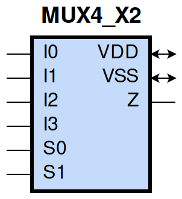
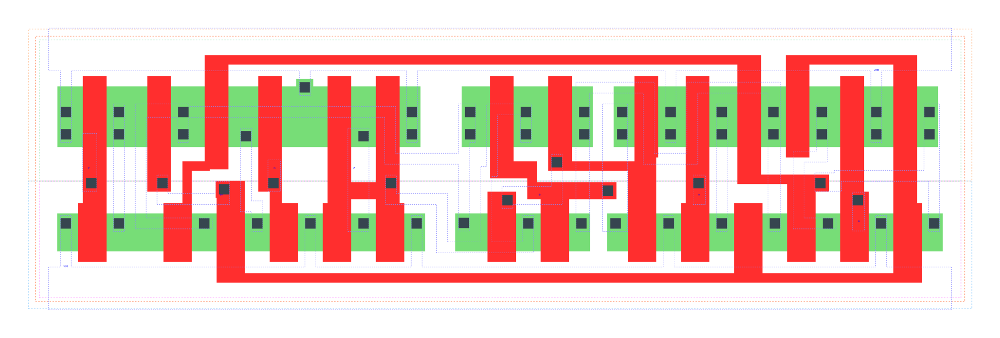

====================================
gf180mcu_fd_sc_mcu9t5v0__mux4_x2
====================================

**gf180mcu_fd_sc_mcu9t5v0__mux4_x2 symbol**

**gf180mcu_fd_sc_mcu9t5v0__mux4_x2 schematic**

.. image:: sc9_sch/MUX4_X2_sch.png
    :height: 250px
    :width: 450 px
    :align: center
    :alt: gf180mcu_fd_sc_mcu9t5v0__mux4_x2 schematic

**gf180mcu_fd_sc_mcu9t5v0__mux4_x2 layout**

.. include:: images.rst
| MUX4_X2 is a 4-to-1 multiplexer with 2X drive strength

|
| Attributes

============= ======================
**Attribute** **Value**
area          95.961600 µm\ :sup:`2`
============= ======================

|
| OUTPUT FUNCTIONS

============== =========================================================
**Output Pin** **Function**
Z              ((I0&(!S0)&(!S1))|(I1&S0&(!S1))|(I2&(!S0)&S1)|(I3&S0&S1))
============== =========================================================

|
| TRUTH TABLE FOR Z

====== ====== ====== ====== ====== ====== =====
**I0** **I1** **I2** **I3** **S0** **S1** **Z**
1      ?      ?      ?      0      0      1
?      1      ?      ?      1      0      1
?      ?      1      ?      0      1      1
?      ?      ?      1      1      1      1
0      ?      ?      ?      0      0      0
?      0      ?      ?      1      0      0
?      ?      0      ?      0      1      0
?      ?      ?      0      1      1      0
====== ====== ====== ====== ====== ====== =====

|
| FUNCTIONAL SCHEMATIC

| |image458|

| PIN CAPACITANCE (pf)

======= ======== ====================
**Pin** **Type** **Capacitance (pf)**
I2      input    0.0048
S0      input    0.0169
I3      input    0.0047
S1      input    0.0098
I1      input    0.0048
I0      input    0.0048
======= ======== ====================

|
| DELAY AND OUTPUT TRANSITION TIME corresponding to min slew and load

+---------------+------------+---------------------+--------------+-------------------+----------------+---------------+
| **Input Pin** | **Output** | **When Condition**  | **Tin (ns)** | **Out Load (pf)** | **Delay (ns)** | **Tout (ns)** |
+---------------+------------+---------------------+--------------+-------------------+----------------+---------------+
| I2(HL)        | Z(HL)      | !I0&!I1&!I3&!S0&S1  | 0.0100       | 0.0010            | 0.3799         | 0.0643        |
+---------------+------------+---------------------+--------------+-------------------+----------------+---------------+
| I2(HL)        | Z(HL)      | !I0&!I1&I3&!S0&S1   | 0.0100       | 0.0010            | 0.3799         | 0.0645        |
+---------------+------------+---------------------+--------------+-------------------+----------------+---------------+
| I2(HL)        | Z(HL)      | !I0&I1&!I3&!S0&S1   | 0.0100       | 0.0010            | 0.3799         | 0.0644        |
+---------------+------------+---------------------+--------------+-------------------+----------------+---------------+
| I2(HL)        | Z(HL)      | !I0&I1&I3&!S0&S1    | 0.0100       | 0.0010            | 0.3799         | 0.0644        |
+---------------+------------+---------------------+--------------+-------------------+----------------+---------------+
| I2(HL)        | Z(HL)      | I0&!I1&!I3&!S0&S1   | 0.0100       | 0.0010            | 0.3799         | 0.0643        |
+---------------+------------+---------------------+--------------+-------------------+----------------+---------------+
| I2(HL)        | Z(HL)      | I0&!I1&I3&!S0&S1    | 0.0100       | 0.0010            | 0.3800         | 0.0644        |
+---------------+------------+---------------------+--------------+-------------------+----------------+---------------+
| I2(HL)        | Z(HL)      | I0&I1&!I3&!S0&S1    | 0.0100       | 0.0010            | 0.3800         | 0.0646        |
+---------------+------------+---------------------+--------------+-------------------+----------------+---------------+
| I2(HL)        | Z(HL)      | I0&I1&I3&!S0&S1     | 0.0100       | 0.0010            | 0.3799         | 0.0643        |
+---------------+------------+---------------------+--------------+-------------------+----------------+---------------+
| I2(LH)        | Z(LH)      | !I0&!I1&!I3&!S0&S1  | 0.0100       | 0.0010            | 0.3914         | 0.0490        |
+---------------+------------+---------------------+--------------+-------------------+----------------+---------------+
| I2(LH)        | Z(LH)      | !I0&!I1&I3&!S0&S1   | 0.0100       | 0.0010            | 0.3914         | 0.0490        |
+---------------+------------+---------------------+--------------+-------------------+----------------+---------------+
| I2(LH)        | Z(LH)      | !I0&I1&!I3&!S0&S1   | 0.0100       | 0.0010            | 0.3914         | 0.0490        |
+---------------+------------+---------------------+--------------+-------------------+----------------+---------------+
| I2(LH)        | Z(LH)      | !I0&I1&I3&!S0&S1    | 0.0100       | 0.0010            | 0.3914         | 0.0490        |
+---------------+------------+---------------------+--------------+-------------------+----------------+---------------+
| I2(LH)        | Z(LH)      | I0&!I1&!I3&!S0&S1   | 0.0100       | 0.0010            | 0.3913         | 0.0490        |
+---------------+------------+---------------------+--------------+-------------------+----------------+---------------+
| I2(LH)        | Z(LH)      | I0&!I1&I3&!S0&S1    | 0.0100       | 0.0010            | 0.3913         | 0.0490        |
+---------------+------------+---------------------+--------------+-------------------+----------------+---------------+
| I2(LH)        | Z(LH)      | I0&I1&!I3&!S0&S1    | 0.0100       | 0.0010            | 0.3913         | 0.0490        |
+---------------+------------+---------------------+--------------+-------------------+----------------+---------------+
| I2(LH)        | Z(LH)      | I0&I1&I3&!S0&S1     | 0.0100       | 0.0010            | 0.3913         | 0.0490        |
+---------------+------------+---------------------+--------------+-------------------+----------------+---------------+
| S0(HL)        | Z(LH)      | !I0&!I1&I2&!I3&S1   | 0.0100       | 0.0010            | 0.4447         | 0.0495        |
+---------------+------------+---------------------+--------------+-------------------+----------------+---------------+
| S0(HL)        | Z(LH)      | !I0&I1&I2&!I3&S1    | 0.0100       | 0.0010            | 0.4331         | 0.0493        |
+---------------+------------+---------------------+--------------+-------------------+----------------+---------------+
| S0(HL)        | Z(LH)      | I0&!I1&!I2&!I3&!S1  | 0.0100       | 0.0010            | 0.4413         | 0.0487        |
+---------------+------------+---------------------+--------------+-------------------+----------------+---------------+
| S0(HL)        | Z(LH)      | I0&!I1&!I2&I3&!S1   | 0.0100       | 0.0010            | 0.4298         | 0.0482        |
+---------------+------------+---------------------+--------------+-------------------+----------------+---------------+
| S0(HL)        | Z(LH)      | I0&!I1&I2&!I3&!S1   | 0.0100       | 0.0010            | 0.4491         | 0.0487        |
+---------------+------------+---------------------+--------------+-------------------+----------------+---------------+
| S0(HL)        | Z(LH)      | I0&!I1&I2&!I3&S1    | 0.0100       | 0.0010            | 0.4521         | 0.0497        |
+---------------+------------+---------------------+--------------+-------------------+----------------+---------------+
| S0(HL)        | Z(LH)      | I0&!I1&I2&I3&!S1    | 0.0100       | 0.0010            | 0.4377         | 0.0487        |
+---------------+------------+---------------------+--------------+-------------------+----------------+---------------+
| S0(HL)        | Z(LH)      | I0&I1&I2&!I3&S1     | 0.0100       | 0.0010            | 0.4409         | 0.0496        |
+---------------+------------+---------------------+--------------+-------------------+----------------+---------------+
| S0(HL)        | Z(HL)      | !I0&!I1&!I2&I3&S1   | 0.0100       | 0.0010            | 0.3750         | 0.0629        |
+---------------+------------+---------------------+--------------+-------------------+----------------+---------------+
| S0(HL)        | Z(HL)      | !I0&I1&!I2&!I3&!S1  | 0.0100       | 0.0010            | 0.3726         | 0.0622        |
+---------------+------------+---------------------+--------------+-------------------+----------------+---------------+
| S0(HL)        | Z(HL)      | !I0&I1&!I2&I3&!S1   | 0.0100       | 0.0010            | 0.3648         | 0.0617        |
+---------------+------------+---------------------+--------------+-------------------+----------------+---------------+
| S0(HL)        | Z(HL)      | !I0&I1&!I2&I3&S1    | 0.0100       | 0.0010            | 0.3673         | 0.0629        |
+---------------+------------+---------------------+--------------+-------------------+----------------+---------------+
| S0(HL)        | Z(HL)      | !I0&I1&I2&!I3&!S1   | 0.0100       | 0.0010            | 0.3782         | 0.0627        |
+---------------+------------+---------------------+--------------+-------------------+----------------+---------------+
| S0(HL)        | Z(HL)      | !I0&I1&I2&I3&!S1    | 0.0100       | 0.0010            | 0.3706         | 0.0623        |
+---------------+------------+---------------------+--------------+-------------------+----------------+---------------+
| S0(HL)        | Z(HL)      | I0&!I1&!I2&I3&S1    | 0.0100       | 0.0010            | 0.3801         | 0.0636        |
+---------------+------------+---------------------+--------------+-------------------+----------------+---------------+
| S0(HL)        | Z(HL)      | I0&I1&!I2&I3&S1     | 0.0100       | 0.0010            | 0.3728         | 0.0632        |
+---------------+------------+---------------------+--------------+-------------------+----------------+---------------+
| S0(LH)        | Z(LH)      | !I0&!I1&!I2&I3&S1   | 0.0100       | 0.0010            | 0.3516         | 0.0483        |
+---------------+------------+---------------------+--------------+-------------------+----------------+---------------+
| S0(LH)        | Z(LH)      | !I0&I1&!I2&!I3&!S1  | 0.0100       | 0.0010            | 0.3519         | 0.0477        |
+---------------+------------+---------------------+--------------+-------------------+----------------+---------------+
| S0(LH)        | Z(LH)      | !I0&I1&!I2&I3&!S1   | 0.0100       | 0.0010            | 0.3508         | 0.0479        |
+---------------+------------+---------------------+--------------+-------------------+----------------+---------------+
| S0(LH)        | Z(LH)      | !I0&I1&!I2&I3&S1    | 0.0100       | 0.0010            | 0.3504         | 0.0483        |
+---------------+------------+---------------------+--------------+-------------------+----------------+---------------+
| S0(LH)        | Z(LH)      | !I0&I1&I2&!I3&!S1   | 0.0100       | 0.0010            | 0.3521         | 0.0479        |
+---------------+------------+---------------------+--------------+-------------------+----------------+---------------+
| S0(LH)        | Z(LH)      | !I0&I1&I2&I3&!S1    | 0.0100       | 0.0010            | 0.3519         | 0.0477        |
+---------------+------------+---------------------+--------------+-------------------+----------------+---------------+
| S0(LH)        | Z(LH)      | I0&!I1&!I2&I3&S1    | 0.0100       | 0.0010            | 0.3522         | 0.0483        |
+---------------+------------+---------------------+--------------+-------------------+----------------+---------------+
| S0(LH)        | Z(LH)      | I0&I1&!I2&I3&S1     | 0.0100       | 0.0010            | 0.3514         | 0.0485        |
+---------------+------------+---------------------+--------------+-------------------+----------------+---------------+
| S0(LH)        | Z(HL)      | !I0&!I1&I2&!I3&S1   | 0.0100       | 0.0010            | 0.3642         | 0.0641        |
+---------------+------------+---------------------+--------------+-------------------+----------------+---------------+
| S0(LH)        | Z(HL)      | !I0&I1&I2&!I3&S1    | 0.0100       | 0.0010            | 0.3595         | 0.0639        |
+---------------+------------+---------------------+--------------+-------------------+----------------+---------------+
| S0(LH)        | Z(HL)      | I0&!I1&!I2&!I3&!S1  | 0.0100       | 0.0010            | 0.3590         | 0.0633        |
+---------------+------------+---------------------+--------------+-------------------+----------------+---------------+
| S0(LH)        | Z(HL)      | I0&!I1&!I2&I3&!S1   | 0.0100       | 0.0010            | 0.3543         | 0.0631        |
+---------------+------------+---------------------+--------------+-------------------+----------------+---------------+
| S0(LH)        | Z(HL)      | I0&!I1&I2&!I3&!S1   | 0.0100       | 0.0010            | 0.3606         | 0.0634        |
+---------------+------------+---------------------+--------------+-------------------+----------------+---------------+
| S0(LH)        | Z(HL)      | I0&!I1&I2&!I3&S1    | 0.0100       | 0.0010            | 0.3660         | 0.0643        |
+---------------+------------+---------------------+--------------+-------------------+----------------+---------------+
| S0(LH)        | Z(HL)      | I0&!I1&I2&I3&!S1    | 0.0100       | 0.0010            | 0.3587         | 0.0632        |
+---------------+------------+---------------------+--------------+-------------------+----------------+---------------+
| S0(LH)        | Z(HL)      | I0&I1&I2&!I3&S1     | 0.0100       | 0.0010            | 0.3638         | 0.0640        |
+---------------+------------+---------------------+--------------+-------------------+----------------+---------------+
| I3(LH)        | Z(LH)      | !I0&!I1&!I2&S0&S1   | 0.0100       | 0.0010            | 0.3792         | 0.0487        |
+---------------+------------+---------------------+--------------+-------------------+----------------+---------------+
| I3(LH)        | Z(LH)      | !I0&!I1&I2&S0&S1    | 0.0100       | 0.0010            | 0.3792         | 0.0487        |
+---------------+------------+---------------------+--------------+-------------------+----------------+---------------+
| I3(LH)        | Z(LH)      | !I0&I1&!I2&S0&S1    | 0.0100       | 0.0010            | 0.3792         | 0.0487        |
+---------------+------------+---------------------+--------------+-------------------+----------------+---------------+
| I3(LH)        | Z(LH)      | !I0&I1&I2&S0&S1     | 0.0100       | 0.0010            | 0.3792         | 0.0487        |
+---------------+------------+---------------------+--------------+-------------------+----------------+---------------+
| I3(LH)        | Z(LH)      | I0&!I1&!I2&S0&S1    | 0.0100       | 0.0010            | 0.3792         | 0.0487        |
+---------------+------------+---------------------+--------------+-------------------+----------------+---------------+
| I3(LH)        | Z(LH)      | I0&!I1&I2&S0&S1     | 0.0100       | 0.0010            | 0.3792         | 0.0487        |
+---------------+------------+---------------------+--------------+-------------------+----------------+---------------+
| I3(LH)        | Z(LH)      | I0&I1&!I2&S0&S1     | 0.0100       | 0.0010            | 0.3792         | 0.0487        |
+---------------+------------+---------------------+--------------+-------------------+----------------+---------------+
| I3(LH)        | Z(LH)      | I0&I1&I2&S0&S1      | 0.0100       | 0.0010            | 0.3792         | 0.0487        |
+---------------+------------+---------------------+--------------+-------------------+----------------+---------------+
| I3(HL)        | Z(HL)      | !I0&!I1&!I2&S0&S1   | 0.0100       | 0.0010            | 0.3719         | 0.0639        |
+---------------+------------+---------------------+--------------+-------------------+----------------+---------------+
| I3(HL)        | Z(HL)      | !I0&!I1&I2&S0&S1    | 0.0100       | 0.0010            | 0.3718         | 0.0639        |
+---------------+------------+---------------------+--------------+-------------------+----------------+---------------+
| I3(HL)        | Z(HL)      | !I0&I1&!I2&S0&S1    | 0.0100       | 0.0010            | 0.3718         | 0.0639        |
+---------------+------------+---------------------+--------------+-------------------+----------------+---------------+
| I3(HL)        | Z(HL)      | !I0&I1&I2&S0&S1     | 0.0100       | 0.0010            | 0.3718         | 0.0639        |
+---------------+------------+---------------------+--------------+-------------------+----------------+---------------+
| I3(HL)        | Z(HL)      | I0&!I1&!I2&S0&S1    | 0.0100       | 0.0010            | 0.3719         | 0.0639        |
+---------------+------------+---------------------+--------------+-------------------+----------------+---------------+
| I3(HL)        | Z(HL)      | I0&!I1&I2&S0&S1     | 0.0100       | 0.0010            | 0.3718         | 0.0639        |
+---------------+------------+---------------------+--------------+-------------------+----------------+---------------+
| I3(HL)        | Z(HL)      | I0&I1&!I2&S0&S1     | 0.0100       | 0.0010            | 0.3718         | 0.0639        |
+---------------+------------+---------------------+--------------+-------------------+----------------+---------------+
| I3(HL)        | Z(HL)      | I0&I1&I2&S0&S1      | 0.0100       | 0.0010            | 0.3718         | 0.0639        |
+---------------+------------+---------------------+--------------+-------------------+----------------+---------------+
| S1(LH)        | Z(HL)      | !I0&I1&!I2&!I3&S0   | 0.0100       | 0.0010            | 0.2141         | 0.0525        |
+---------------+------------+---------------------+--------------+-------------------+----------------+---------------+
| S1(LH)        | Z(HL)      | !I0&I1&I2&!I3&S0    | 0.0100       | 0.0010            | 0.2141         | 0.0527        |
+---------------+------------+---------------------+--------------+-------------------+----------------+---------------+
| S1(LH)        | Z(HL)      | I0&!I1&!I2&!I3&!S0  | 0.0100       | 0.0010            | 0.2139         | 0.0525        |
+---------------+------------+---------------------+--------------+-------------------+----------------+---------------+
| S1(LH)        | Z(HL)      | I0&!I1&!I2&I3&!S0   | 0.0100       | 0.0010            | 0.2139         | 0.0526        |
+---------------+------------+---------------------+--------------+-------------------+----------------+---------------+
| S1(LH)        | Z(HL)      | I0&I1&!I2&!I3&!S0   | 0.0100       | 0.0010            | 0.2139         | 0.0527        |
+---------------+------------+---------------------+--------------+-------------------+----------------+---------------+
| S1(LH)        | Z(HL)      | I0&I1&!I2&!I3&S0    | 0.0100       | 0.0010            | 0.2142         | 0.0526        |
+---------------+------------+---------------------+--------------+-------------------+----------------+---------------+
| S1(LH)        | Z(HL)      | I0&I1&!I2&I3&!S0    | 0.0100       | 0.0010            | 0.2139         | 0.0526        |
+---------------+------------+---------------------+--------------+-------------------+----------------+---------------+
| S1(LH)        | Z(HL)      | I0&I1&I2&!I3&S0     | 0.0100       | 0.0010            | 0.2142         | 0.0527        |
+---------------+------------+---------------------+--------------+-------------------+----------------+---------------+
| S1(LH)        | Z(LH)      | !I0&!I1&!I2&I3&S0   | 0.0100       | 0.0010            | 0.2140         | 0.0462        |
+---------------+------------+---------------------+--------------+-------------------+----------------+---------------+
| S1(LH)        | Z(LH)      | !I0&!I1&I2&!I3&!S0  | 0.0100       | 0.0010            | 0.2131         | 0.0462        |
+---------------+------------+---------------------+--------------+-------------------+----------------+---------------+
| S1(LH)        | Z(LH)      | !I0&!I1&I2&I3&!S0   | 0.0100       | 0.0010            | 0.2131         | 0.0462        |
+---------------+------------+---------------------+--------------+-------------------+----------------+---------------+
| S1(LH)        | Z(LH)      | !I0&!I1&I2&I3&S0    | 0.0100       | 0.0010            | 0.2140         | 0.0462        |
+---------------+------------+---------------------+--------------+-------------------+----------------+---------------+
| S1(LH)        | Z(LH)      | !I0&I1&I2&!I3&!S0   | 0.0100       | 0.0010            | 0.2131         | 0.0462        |
+---------------+------------+---------------------+--------------+-------------------+----------------+---------------+
| S1(LH)        | Z(LH)      | !I0&I1&I2&I3&!S0    | 0.0100       | 0.0010            | 0.2131         | 0.0462        |
+---------------+------------+---------------------+--------------+-------------------+----------------+---------------+
| S1(LH)        | Z(LH)      | I0&!I1&!I2&I3&S0    | 0.0100       | 0.0010            | 0.2140         | 0.0462        |
+---------------+------------+---------------------+--------------+-------------------+----------------+---------------+
| S1(LH)        | Z(LH)      | I0&!I1&I2&I3&S0     | 0.0100       | 0.0010            | 0.2140         | 0.0462        |
+---------------+------------+---------------------+--------------+-------------------+----------------+---------------+
| S1(HL)        | Z(HL)      | !I0&!I1&!I2&I3&S0   | 0.0100       | 0.0010            | 0.2161         | 0.0472        |
+---------------+------------+---------------------+--------------+-------------------+----------------+---------------+
| S1(HL)        | Z(HL)      | !I0&!I1&I2&!I3&!S0  | 0.0100       | 0.0010            | 0.2161         | 0.0472        |
+---------------+------------+---------------------+--------------+-------------------+----------------+---------------+
| S1(HL)        | Z(HL)      | !I0&!I1&I2&I3&!S0   | 0.0100       | 0.0010            | 0.2161         | 0.0472        |
+---------------+------------+---------------------+--------------+-------------------+----------------+---------------+
| S1(HL)        | Z(HL)      | !I0&!I1&I2&I3&S0    | 0.0100       | 0.0010            | 0.2161         | 0.0472        |
+---------------+------------+---------------------+--------------+-------------------+----------------+---------------+
| S1(HL)        | Z(HL)      | !I0&I1&I2&!I3&!S0   | 0.0100       | 0.0010            | 0.2161         | 0.0472        |
+---------------+------------+---------------------+--------------+-------------------+----------------+---------------+
| S1(HL)        | Z(HL)      | !I0&I1&I2&I3&!S0    | 0.0100       | 0.0010            | 0.2161         | 0.0472        |
+---------------+------------+---------------------+--------------+-------------------+----------------+---------------+
| S1(HL)        | Z(HL)      | I0&!I1&!I2&I3&S0    | 0.0100       | 0.0010            | 0.2161         | 0.0472        |
+---------------+------------+---------------------+--------------+-------------------+----------------+---------------+
| S1(HL)        | Z(HL)      | I0&!I1&I2&I3&S0     | 0.0100       | 0.0010            | 0.2161         | 0.0471        |
+---------------+------------+---------------------+--------------+-------------------+----------------+---------------+
| S1(HL)        | Z(LH)      | !I0&I1&!I2&!I3&S0   | 0.0100       | 0.0010            | 0.2810         | 0.0462        |
+---------------+------------+---------------------+--------------+-------------------+----------------+---------------+
| S1(HL)        | Z(LH)      | !I0&I1&I2&!I3&S0    | 0.0100       | 0.0010            | 0.2810         | 0.0462        |
+---------------+------------+---------------------+--------------+-------------------+----------------+---------------+
| S1(HL)        | Z(LH)      | I0&!I1&!I2&!I3&!S0  | 0.0100       | 0.0010            | 0.2807         | 0.0461        |
+---------------+------------+---------------------+--------------+-------------------+----------------+---------------+
| S1(HL)        | Z(LH)      | I0&!I1&!I2&I3&!S0   | 0.0100       | 0.0010            | 0.2807         | 0.0461        |
+---------------+------------+---------------------+--------------+-------------------+----------------+---------------+
| S1(HL)        | Z(LH)      | I0&I1&!I2&!I3&!S0   | 0.0100       | 0.0010            | 0.2807         | 0.0461        |
+---------------+------------+---------------------+--------------+-------------------+----------------+---------------+
| S1(HL)        | Z(LH)      | I0&I1&!I2&!I3&S0    | 0.0100       | 0.0010            | 0.2810         | 0.0462        |
+---------------+------------+---------------------+--------------+-------------------+----------------+---------------+
| S1(HL)        | Z(LH)      | I0&I1&!I2&I3&!S0    | 0.0100       | 0.0010            | 0.2807         | 0.0461        |
+---------------+------------+---------------------+--------------+-------------------+----------------+---------------+
| S1(HL)        | Z(LH)      | I0&I1&I2&!I3&S0     | 0.0100       | 0.0010            | 0.2810         | 0.0462        |
+---------------+------------+---------------------+--------------+-------------------+----------------+---------------+
| I1(LH)        | Z(LH)      | !I0&!I2&!I3&S0&!S1  | 0.0100       | 0.0010            | 0.3773         | 0.0478        |
+---------------+------------+---------------------+--------------+-------------------+----------------+---------------+
| I1(LH)        | Z(LH)      | !I0&!I2&I3&S0&!S1   | 0.0100       | 0.0010            | 0.3773         | 0.0478        |
+---------------+------------+---------------------+--------------+-------------------+----------------+---------------+
| I1(LH)        | Z(LH)      | !I0&I2&!I3&S0&!S1   | 0.0100       | 0.0010            | 0.3773         | 0.0479        |
+---------------+------------+---------------------+--------------+-------------------+----------------+---------------+
| I1(LH)        | Z(LH)      | !I0&I2&I3&S0&!S1    | 0.0100       | 0.0010            | 0.3773         | 0.0479        |
+---------------+------------+---------------------+--------------+-------------------+----------------+---------------+
| I1(LH)        | Z(LH)      | I0&!I2&!I3&S0&!S1   | 0.0100       | 0.0010            | 0.3773         | 0.0478        |
+---------------+------------+---------------------+--------------+-------------------+----------------+---------------+
| I1(LH)        | Z(LH)      | I0&!I2&I3&S0&!S1    | 0.0100       | 0.0010            | 0.3773         | 0.0478        |
+---------------+------------+---------------------+--------------+-------------------+----------------+---------------+
| I1(LH)        | Z(LH)      | I0&I2&!I3&S0&!S1    | 0.0100       | 0.0010            | 0.3773         | 0.0479        |
+---------------+------------+---------------------+--------------+-------------------+----------------+---------------+
| I1(LH)        | Z(LH)      | I0&I2&I3&S0&!S1     | 0.0100       | 0.0010            | 0.3773         | 0.0479        |
+---------------+------------+---------------------+--------------+-------------------+----------------+---------------+
| I1(HL)        | Z(HL)      | !I0&!I2&!I3&S0&!S1  | 0.0100       | 0.0010            | 0.3668         | 0.0633        |
+---------------+------------+---------------------+--------------+-------------------+----------------+---------------+
| I1(HL)        | Z(HL)      | !I0&!I2&I3&S0&!S1   | 0.0100       | 0.0010            | 0.3667         | 0.0633        |
+---------------+------------+---------------------+--------------+-------------------+----------------+---------------+
| I1(HL)        | Z(HL)      | !I0&I2&!I3&S0&!S1   | 0.0100       | 0.0010            | 0.3668         | 0.0633        |
+---------------+------------+---------------------+--------------+-------------------+----------------+---------------+
| I1(HL)        | Z(HL)      | !I0&I2&I3&S0&!S1    | 0.0100       | 0.0010            | 0.3667         | 0.0633        |
+---------------+------------+---------------------+--------------+-------------------+----------------+---------------+
| I1(HL)        | Z(HL)      | I0&!I2&!I3&S0&!S1   | 0.0100       | 0.0010            | 0.3667         | 0.0633        |
+---------------+------------+---------------------+--------------+-------------------+----------------+---------------+
| I1(HL)        | Z(HL)      | I0&!I2&I3&S0&!S1    | 0.0100       | 0.0010            | 0.3667         | 0.0632        |
+---------------+------------+---------------------+--------------+-------------------+----------------+---------------+
| I1(HL)        | Z(HL)      | I0&I2&!I3&S0&!S1    | 0.0100       | 0.0010            | 0.3667         | 0.0633        |
+---------------+------------+---------------------+--------------+-------------------+----------------+---------------+
| I1(HL)        | Z(HL)      | I0&I2&I3&S0&!S1     | 0.0100       | 0.0010            | 0.3667         | 0.0632        |
+---------------+------------+---------------------+--------------+-------------------+----------------+---------------+
| I0(LH)        | Z(LH)      | !I1&!I2&!I3&!S0&!S1 | 0.0100       | 0.0010            | 0.3820         | 0.0482        |
+---------------+------------+---------------------+--------------+-------------------+----------------+---------------+
| I0(LH)        | Z(LH)      | !I1&!I2&I3&!S0&!S1  | 0.0100       | 0.0010            | 0.3820         | 0.0482        |
+---------------+------------+---------------------+--------------+-------------------+----------------+---------------+
| I0(LH)        | Z(LH)      | !I1&I2&!I3&!S0&!S1  | 0.0100       | 0.0010            | 0.3820         | 0.0482        |
+---------------+------------+---------------------+--------------+-------------------+----------------+---------------+
| I0(LH)        | Z(LH)      | !I1&I2&I3&!S0&!S1   | 0.0100       | 0.0010            | 0.3820         | 0.0482        |
+---------------+------------+---------------------+--------------+-------------------+----------------+---------------+
| I0(LH)        | Z(LH)      | I1&!I2&!I3&!S0&!S1  | 0.0100       | 0.0010            | 0.3820         | 0.0481        |
+---------------+------------+---------------------+--------------+-------------------+----------------+---------------+
| I0(LH)        | Z(LH)      | I1&!I2&I3&!S0&!S1   | 0.0100       | 0.0010            | 0.3820         | 0.0481        |
+---------------+------------+---------------------+--------------+-------------------+----------------+---------------+
| I0(LH)        | Z(LH)      | I1&I2&!I3&!S0&!S1   | 0.0100       | 0.0010            | 0.3820         | 0.0481        |
+---------------+------------+---------------------+--------------+-------------------+----------------+---------------+
| I0(LH)        | Z(LH)      | I1&I2&I3&!S0&!S1    | 0.0100       | 0.0010            | 0.3820         | 0.0481        |
+---------------+------------+---------------------+--------------+-------------------+----------------+---------------+
| I0(HL)        | Z(HL)      | !I1&!I2&!I3&!S0&!S1 | 0.0100       | 0.0010            | 0.3671         | 0.0631        |
+---------------+------------+---------------------+--------------+-------------------+----------------+---------------+
| I0(HL)        | Z(HL)      | !I1&!I2&I3&!S0&!S1  | 0.0100       | 0.0010            | 0.3671         | 0.0631        |
+---------------+------------+---------------------+--------------+-------------------+----------------+---------------+
| I0(HL)        | Z(HL)      | !I1&I2&!I3&!S0&!S1  | 0.0100       | 0.0010            | 0.3671         | 0.0631        |
+---------------+------------+---------------------+--------------+-------------------+----------------+---------------+
| I0(HL)        | Z(HL)      | !I1&I2&I3&!S0&!S1   | 0.0100       | 0.0010            | 0.3671         | 0.0631        |
+---------------+------------+---------------------+--------------+-------------------+----------------+---------------+
| I0(HL)        | Z(HL)      | I1&!I2&!I3&!S0&!S1  | 0.0100       | 0.0010            | 0.3671         | 0.0631        |
+---------------+------------+---------------------+--------------+-------------------+----------------+---------------+
| I0(HL)        | Z(HL)      | I1&!I2&I3&!S0&!S1   | 0.0100       | 0.0010            | 0.3671         | 0.0631        |
+---------------+------------+---------------------+--------------+-------------------+----------------+---------------+
| I0(HL)        | Z(HL)      | I1&I2&!I3&!S0&!S1   | 0.0100       | 0.0010            | 0.3671         | 0.0631        |
+---------------+------------+---------------------+--------------+-------------------+----------------+---------------+
| I0(HL)        | Z(HL)      | I1&I2&I3&!S0&!S1    | 0.0100       | 0.0010            | 0.3671         | 0.0631        |
+---------------+------------+---------------------+--------------+-------------------+----------------+---------------+

|
| DYNAMIC ENERGY

+---------------+---------------------+--------------+------------+-------------------+---------------------+
| **Input Pin** | **When Condition**  | **Tin (ns)** | **Output** | **Out Load (pf)** | **Energy (uW/MHz)** |
+---------------+---------------------+--------------+------------+-------------------+---------------------+
| S1            | !I0&I1&!I2&!I3&S0   | 0.0100       | Z(HL)      | 0.0010            | 0.4941              |
+---------------+---------------------+--------------+------------+-------------------+---------------------+
| S1            | !I0&I1&I2&!I3&S0    | 0.0100       | Z(HL)      | 0.0010            | 0.4943              |
+---------------+---------------------+--------------+------------+-------------------+---------------------+
| S1            | I0&!I1&!I2&!I3&!S0  | 0.0100       | Z(HL)      | 0.0010            | 0.4942              |
+---------------+---------------------+--------------+------------+-------------------+---------------------+
| S1            | I0&!I1&!I2&I3&!S0   | 0.0100       | Z(HL)      | 0.0010            | 0.4942              |
+---------------+---------------------+--------------+------------+-------------------+---------------------+
| S1            | I0&I1&!I2&!I3&!S0   | 0.0100       | Z(HL)      | 0.0010            | 0.4943              |
+---------------+---------------------+--------------+------------+-------------------+---------------------+
| S1            | I0&I1&!I2&!I3&S0    | 0.0100       | Z(HL)      | 0.0010            | 0.4942              |
+---------------+---------------------+--------------+------------+-------------------+---------------------+
| S1            | I0&I1&!I2&I3&!S0    | 0.0100       | Z(HL)      | 0.0010            | 0.4942              |
+---------------+---------------------+--------------+------------+-------------------+---------------------+
| S1            | I0&I1&I2&!I3&S0     | 0.0100       | Z(HL)      | 0.0010            | 0.4942              |
+---------------+---------------------+--------------+------------+-------------------+---------------------+
| S1            | !I0&!I1&!I2&I3&S0   | 0.0100       | Z(HL)      | 0.0010            | 0.5934              |
+---------------+---------------------+--------------+------------+-------------------+---------------------+
| S1            | !I0&!I1&I2&!I3&!S0  | 0.0100       | Z(HL)      | 0.0010            | 0.5934              |
+---------------+---------------------+--------------+------------+-------------------+---------------------+
| S1            | !I0&!I1&I2&I3&!S0   | 0.0100       | Z(HL)      | 0.0010            | 0.5934              |
+---------------+---------------------+--------------+------------+-------------------+---------------------+
| S1            | !I0&!I1&I2&I3&S0    | 0.0100       | Z(HL)      | 0.0010            | 0.5934              |
+---------------+---------------------+--------------+------------+-------------------+---------------------+
| S1            | !I0&I1&I2&!I3&!S0   | 0.0100       | Z(HL)      | 0.0010            | 0.5934              |
+---------------+---------------------+--------------+------------+-------------------+---------------------+
| S1            | !I0&I1&I2&I3&!S0    | 0.0100       | Z(HL)      | 0.0010            | 0.5934              |
+---------------+---------------------+--------------+------------+-------------------+---------------------+
| S1            | I0&!I1&!I2&I3&S0    | 0.0100       | Z(HL)      | 0.0010            | 0.5934              |
+---------------+---------------------+--------------+------------+-------------------+---------------------+
| S1            | I0&!I1&I2&I3&S0     | 0.0100       | Z(HL)      | 0.0010            | 0.5935              |
+---------------+---------------------+--------------+------------+-------------------+---------------------+
| S1            | !I0&!I1&!I2&I3&S0   | 0.0100       | Z(LH)      | 0.0010            | 0.2707              |
+---------------+---------------------+--------------+------------+-------------------+---------------------+
| S1            | !I0&!I1&I2&!I3&!S0  | 0.0100       | Z(LH)      | 0.0010            | 0.2707              |
+---------------+---------------------+--------------+------------+-------------------+---------------------+
| S1            | !I0&!I1&I2&I3&!S0   | 0.0100       | Z(LH)      | 0.0010            | 0.2707              |
+---------------+---------------------+--------------+------------+-------------------+---------------------+
| S1            | !I0&!I1&I2&I3&S0    | 0.0100       | Z(LH)      | 0.0010            | 0.2707              |
+---------------+---------------------+--------------+------------+-------------------+---------------------+
| S1            | !I0&I1&I2&!I3&!S0   | 0.0100       | Z(LH)      | 0.0010            | 0.2707              |
+---------------+---------------------+--------------+------------+-------------------+---------------------+
| S1            | !I0&I1&I2&I3&!S0    | 0.0100       | Z(LH)      | 0.0010            | 0.2707              |
+---------------+---------------------+--------------+------------+-------------------+---------------------+
| S1            | I0&!I1&!I2&I3&S0    | 0.0100       | Z(LH)      | 0.0010            | 0.2707              |
+---------------+---------------------+--------------+------------+-------------------+---------------------+
| S1            | I0&!I1&I2&I3&S0     | 0.0100       | Z(LH)      | 0.0010            | 0.2707              |
+---------------+---------------------+--------------+------------+-------------------+---------------------+
| S1            | !I0&I1&!I2&!I3&S0   | 0.0100       | Z(LH)      | 0.0010            | 0.5297              |
+---------------+---------------------+--------------+------------+-------------------+---------------------+
| S1            | !I0&I1&I2&!I3&S0    | 0.0100       | Z(LH)      | 0.0010            | 0.5297              |
+---------------+---------------------+--------------+------------+-------------------+---------------------+
| S1            | I0&!I1&!I2&!I3&!S0  | 0.0100       | Z(LH)      | 0.0010            | 0.5296              |
+---------------+---------------------+--------------+------------+-------------------+---------------------+
| S1            | I0&!I1&!I2&I3&!S0   | 0.0100       | Z(LH)      | 0.0010            | 0.5296              |
+---------------+---------------------+--------------+------------+-------------------+---------------------+
| S1            | I0&I1&!I2&!I3&!S0   | 0.0100       | Z(LH)      | 0.0010            | 0.5296              |
+---------------+---------------------+--------------+------------+-------------------+---------------------+
| S1            | I0&I1&!I2&!I3&S0    | 0.0100       | Z(LH)      | 0.0010            | 0.5297              |
+---------------+---------------------+--------------+------------+-------------------+---------------------+
| S1            | I0&I1&!I2&I3&!S0    | 0.0100       | Z(LH)      | 0.0010            | 0.5296              |
+---------------+---------------------+--------------+------------+-------------------+---------------------+
| S1            | I0&I1&I2&!I3&S0     | 0.0100       | Z(LH)      | 0.0010            | 0.5297              |
+---------------+---------------------+--------------+------------+-------------------+---------------------+
| I0            | !I1&!I2&!I3&!S0&!S1 | 0.0100       | Z(LH)      | 0.0010            | 0.4381              |
+---------------+---------------------+--------------+------------+-------------------+---------------------+
| I0            | !I1&!I2&I3&!S0&!S1  | 0.0100       | Z(LH)      | 0.0010            | 0.4381              |
+---------------+---------------------+--------------+------------+-------------------+---------------------+
| I0            | !I1&I2&!I3&!S0&!S1  | 0.0100       | Z(LH)      | 0.0010            | 0.4381              |
+---------------+---------------------+--------------+------------+-------------------+---------------------+
| I0            | !I1&I2&I3&!S0&!S1   | 0.0100       | Z(LH)      | 0.0010            | 0.4381              |
+---------------+---------------------+--------------+------------+-------------------+---------------------+
| I0            | I1&!I2&!I3&!S0&!S1  | 0.0100       | Z(LH)      | 0.0010            | 0.4381              |
+---------------+---------------------+--------------+------------+-------------------+---------------------+
| I0            | I1&!I2&I3&!S0&!S1   | 0.0100       | Z(LH)      | 0.0010            | 0.4381              |
+---------------+---------------------+--------------+------------+-------------------+---------------------+
| I0            | I1&I2&!I3&!S0&!S1   | 0.0100       | Z(LH)      | 0.0010            | 0.4381              |
+---------------+---------------------+--------------+------------+-------------------+---------------------+
| I0            | I1&I2&I3&!S0&!S1    | 0.0100       | Z(LH)      | 0.0010            | 0.4381              |
+---------------+---------------------+--------------+------------+-------------------+---------------------+
| I3            | !I0&!I1&!I2&S0&S1   | 0.0100       | Z(LH)      | 0.0010            | 0.3851              |
+---------------+---------------------+--------------+------------+-------------------+---------------------+
| I3            | !I0&!I1&I2&S0&S1    | 0.0100       | Z(LH)      | 0.0010            | 0.3851              |
+---------------+---------------------+--------------+------------+-------------------+---------------------+
| I3            | !I0&I1&!I2&S0&S1    | 0.0100       | Z(LH)      | 0.0010            | 0.3851              |
+---------------+---------------------+--------------+------------+-------------------+---------------------+
| I3            | !I0&I1&I2&S0&S1     | 0.0100       | Z(LH)      | 0.0010            | 0.3851              |
+---------------+---------------------+--------------+------------+-------------------+---------------------+
| I3            | I0&!I1&!I2&S0&S1    | 0.0100       | Z(LH)      | 0.0010            | 0.3851              |
+---------------+---------------------+--------------+------------+-------------------+---------------------+
| I3            | I0&!I1&I2&S0&S1     | 0.0100       | Z(LH)      | 0.0010            | 0.3851              |
+---------------+---------------------+--------------+------------+-------------------+---------------------+
| I3            | I0&I1&!I2&S0&S1     | 0.0100       | Z(LH)      | 0.0010            | 0.3851              |
+---------------+---------------------+--------------+------------+-------------------+---------------------+
| I3            | I0&I1&I2&S0&S1      | 0.0100       | Z(LH)      | 0.0010            | 0.3851              |
+---------------+---------------------+--------------+------------+-------------------+---------------------+
| I2            | !I0&!I1&!I3&!S0&S1  | 0.0100       | Z(HL)      | 0.0010            | 0.8167              |
+---------------+---------------------+--------------+------------+-------------------+---------------------+
| I2            | !I0&!I1&I3&!S0&S1   | 0.0100       | Z(HL)      | 0.0010            | 0.8168              |
+---------------+---------------------+--------------+------------+-------------------+---------------------+
| I2            | !I0&I1&!I3&!S0&S1   | 0.0100       | Z(HL)      | 0.0010            | 0.8167              |
+---------------+---------------------+--------------+------------+-------------------+---------------------+
| I2            | !I0&I1&I3&!S0&S1    | 0.0100       | Z(HL)      | 0.0010            | 0.8167              |
+---------------+---------------------+--------------+------------+-------------------+---------------------+
| I2            | I0&!I1&!I3&!S0&S1   | 0.0100       | Z(HL)      | 0.0010            | 0.8167              |
+---------------+---------------------+--------------+------------+-------------------+---------------------+
| I2            | I0&!I1&I3&!S0&S1    | 0.0100       | Z(HL)      | 0.0010            | 0.8166              |
+---------------+---------------------+--------------+------------+-------------------+---------------------+
| I2            | I0&I1&!I3&!S0&S1    | 0.0100       | Z(HL)      | 0.0010            | 0.8166              |
+---------------+---------------------+--------------+------------+-------------------+---------------------+
| I2            | I0&I1&I3&!S0&S1     | 0.0100       | Z(HL)      | 0.0010            | 0.8167              |
+---------------+---------------------+--------------+------------+-------------------+---------------------+
| I1            | !I0&!I2&!I3&S0&!S1  | 0.0100       | Z(LH)      | 0.0010            | 0.4041              |
+---------------+---------------------+--------------+------------+-------------------+---------------------+
| I1            | !I0&!I2&I3&S0&!S1   | 0.0100       | Z(LH)      | 0.0010            | 0.4041              |
+---------------+---------------------+--------------+------------+-------------------+---------------------+
| I1            | !I0&I2&!I3&S0&!S1   | 0.0100       | Z(LH)      | 0.0010            | 0.4041              |
+---------------+---------------------+--------------+------------+-------------------+---------------------+
| I1            | !I0&I2&I3&S0&!S1    | 0.0100       | Z(LH)      | 0.0010            | 0.4041              |
+---------------+---------------------+--------------+------------+-------------------+---------------------+
| I1            | I0&!I2&!I3&S0&!S1   | 0.0100       | Z(LH)      | 0.0010            | 0.4041              |
+---------------+---------------------+--------------+------------+-------------------+---------------------+
| I1            | I0&!I2&I3&S0&!S1    | 0.0100       | Z(LH)      | 0.0010            | 0.4041              |
+---------------+---------------------+--------------+------------+-------------------+---------------------+
| I1            | I0&I2&!I3&S0&!S1    | 0.0100       | Z(LH)      | 0.0010            | 0.4041              |
+---------------+---------------------+--------------+------------+-------------------+---------------------+
| I1            | I0&I2&I3&S0&!S1     | 0.0100       | Z(LH)      | 0.0010            | 0.4041              |
+---------------+---------------------+--------------+------------+-------------------+---------------------+
| I3            | !I0&!I1&!I2&S0&S1   | 0.0100       | Z(HL)      | 0.0010            | 0.8265              |
+---------------+---------------------+--------------+------------+-------------------+---------------------+
| I3            | !I0&!I1&I2&S0&S1    | 0.0100       | Z(HL)      | 0.0010            | 0.8265              |
+---------------+---------------------+--------------+------------+-------------------+---------------------+
| I3            | !I0&I1&!I2&S0&S1    | 0.0100       | Z(HL)      | 0.0010            | 0.8265              |
+---------------+---------------------+--------------+------------+-------------------+---------------------+
| I3            | !I0&I1&I2&S0&S1     | 0.0100       | Z(HL)      | 0.0010            | 0.8265              |
+---------------+---------------------+--------------+------------+-------------------+---------------------+
| I3            | I0&!I1&!I2&S0&S1    | 0.0100       | Z(HL)      | 0.0010            | 0.8265              |
+---------------+---------------------+--------------+------------+-------------------+---------------------+
| I3            | I0&!I1&I2&S0&S1     | 0.0100       | Z(HL)      | 0.0010            | 0.8265              |
+---------------+---------------------+--------------+------------+-------------------+---------------------+
| I3            | I0&I1&!I2&S0&S1     | 0.0100       | Z(HL)      | 0.0010            | 0.8265              |
+---------------+---------------------+--------------+------------+-------------------+---------------------+
| I3            | I0&I1&I2&S0&S1      | 0.0100       | Z(HL)      | 0.0010            | 0.8265              |
+---------------+---------------------+--------------+------------+-------------------+---------------------+
| I0            | !I1&!I2&!I3&!S0&!S1 | 0.0100       | Z(HL)      | 0.0010            | 0.7643              |
+---------------+---------------------+--------------+------------+-------------------+---------------------+
| I0            | !I1&!I2&I3&!S0&!S1  | 0.0100       | Z(HL)      | 0.0010            | 0.7643              |
+---------------+---------------------+--------------+------------+-------------------+---------------------+
| I0            | !I1&I2&!I3&!S0&!S1  | 0.0100       | Z(HL)      | 0.0010            | 0.7643              |
+---------------+---------------------+--------------+------------+-------------------+---------------------+
| I0            | !I1&I2&I3&!S0&!S1   | 0.0100       | Z(HL)      | 0.0010            | 0.7643              |
+---------------+---------------------+--------------+------------+-------------------+---------------------+
| I0            | I1&!I2&!I3&!S0&!S1  | 0.0100       | Z(HL)      | 0.0010            | 0.7643              |
+---------------+---------------------+--------------+------------+-------------------+---------------------+
| I0            | I1&!I2&I3&!S0&!S1   | 0.0100       | Z(HL)      | 0.0010            | 0.7643              |
+---------------+---------------------+--------------+------------+-------------------+---------------------+
| I0            | I1&I2&!I3&!S0&!S1   | 0.0100       | Z(HL)      | 0.0010            | 0.7643              |
+---------------+---------------------+--------------+------------+-------------------+---------------------+
| I0            | I1&I2&I3&!S0&!S1    | 0.0100       | Z(HL)      | 0.0010            | 0.7643              |
+---------------+---------------------+--------------+------------+-------------------+---------------------+
| S0            | !I0&!I1&I2&!I3&S1   | 0.0100       | Z(LH)      | 0.0010            | 0.7567              |
+---------------+---------------------+--------------+------------+-------------------+---------------------+
| S0            | !I0&I1&I2&!I3&S1    | 0.0100       | Z(LH)      | 0.0010            | 0.8973              |
+---------------+---------------------+--------------+------------+-------------------+---------------------+
| S0            | I0&!I1&!I2&!I3&!S1  | 0.0100       | Z(LH)      | 0.0010            | 0.7738              |
+---------------+---------------------+--------------+------------+-------------------+---------------------+
| S0            | I0&!I1&!I2&I3&!S1   | 0.0100       | Z(LH)      | 0.0010            | 0.9133              |
+---------------+---------------------+--------------+------------+-------------------+---------------------+
| S0            | I0&!I1&I2&!I3&!S1   | 0.0100       | Z(LH)      | 0.0010            | 0.9162              |
+---------------+---------------------+--------------+------------+-------------------+---------------------+
| S0            | I0&!I1&I2&!I3&S1    | 0.0100       | Z(LH)      | 0.0010            | 0.8828              |
+---------------+---------------------+--------------+------------+-------------------+---------------------+
| S0            | I0&!I1&I2&I3&!S1    | 0.0100       | Z(LH)      | 0.0010            | 0.7662              |
+---------------+---------------------+--------------+------------+-------------------+---------------------+
| S0            | I0&I1&I2&!I3&S1     | 0.0100       | Z(LH)      | 0.0010            | 0.7487              |
+---------------+---------------------+--------------+------------+-------------------+---------------------+
| S0            | !I0&!I1&!I2&I3&S1   | 0.0100       | Z(LH)      | 0.0010            | 0.3610              |
+---------------+---------------------+--------------+------------+-------------------+---------------------+
| S0            | !I0&I1&!I2&!I3&!S1  | 0.0100       | Z(LH)      | 0.0010            | 0.3813              |
+---------------+---------------------+--------------+------------+-------------------+---------------------+
| S0            | !I0&I1&!I2&I3&!S1   | 0.0100       | Z(LH)      | 0.0010            | 0.4346              |
+---------------+---------------------+--------------+------------+-------------------+---------------------+
| S0            | !I0&I1&!I2&I3&S1    | 0.0100       | Z(LH)      | 0.0010            | 0.4007              |
+---------------+---------------------+--------------+------------+-------------------+---------------------+
| S0            | !I0&I1&I2&!I3&!S1   | 0.0100       | Z(LH)      | 0.0010            | 0.6303              |
+---------------+---------------------+--------------+------------+-------------------+---------------------+
| S0            | !I0&I1&I2&I3&!S1    | 0.0100       | Z(LH)      | 0.0010            | 0.3815              |
+---------------+---------------------+--------------+------------+-------------------+---------------------+
| S0            | I0&!I1&!I2&I3&S1    | 0.0100       | Z(LH)      | 0.0010            | 0.6073              |
+---------------+---------------------+--------------+------------+-------------------+---------------------+
| S0            | I0&I1&!I2&I3&S1     | 0.0100       | Z(LH)      | 0.0010            | 0.3613              |
+---------------+---------------------+--------------+------------+-------------------+---------------------+
| I2            | !I0&!I1&!I3&!S0&S1  | 0.0100       | Z(LH)      | 0.0010            | 0.4247              |
+---------------+---------------------+--------------+------------+-------------------+---------------------+
| I2            | !I0&!I1&I3&!S0&S1   | 0.0100       | Z(LH)      | 0.0010            | 0.4246              |
+---------------+---------------------+--------------+------------+-------------------+---------------------+
| I2            | !I0&I1&!I3&!S0&S1   | 0.0100       | Z(LH)      | 0.0010            | 0.4246              |
+---------------+---------------------+--------------+------------+-------------------+---------------------+
| I2            | !I0&I1&I3&!S0&S1    | 0.0100       | Z(LH)      | 0.0010            | 0.4246              |
+---------------+---------------------+--------------+------------+-------------------+---------------------+
| I2            | I0&!I1&!I3&!S0&S1   | 0.0100       | Z(LH)      | 0.0010            | 0.4247              |
+---------------+---------------------+--------------+------------+-------------------+---------------------+
| I2            | I0&!I1&I3&!S0&S1    | 0.0100       | Z(LH)      | 0.0010            | 0.4247              |
+---------------+---------------------+--------------+------------+-------------------+---------------------+
| I2            | I0&I1&!I3&!S0&S1    | 0.0100       | Z(LH)      | 0.0010            | 0.4247              |
+---------------+---------------------+--------------+------------+-------------------+---------------------+
| I2            | I0&I1&I3&!S0&S1     | 0.0100       | Z(LH)      | 0.0010            | 0.4247              |
+---------------+---------------------+--------------+------------+-------------------+---------------------+
| S0            | !I0&!I1&!I2&I3&S1   | 0.0100       | Z(HL)      | 0.0010            | 0.9817              |
+---------------+---------------------+--------------+------------+-------------------+---------------------+
| S0            | !I0&I1&!I2&!I3&!S1  | 0.0100       | Z(HL)      | 0.0010            | 0.9421              |
+---------------+---------------------+--------------+------------+-------------------+---------------------+
| S0            | !I0&I1&!I2&I3&!S1   | 0.0100       | Z(HL)      | 0.0010            | 1.0862              |
+---------------+---------------------+--------------+------------+-------------------+---------------------+
| S0            | !I0&I1&!I2&I3&S1    | 0.0100       | Z(HL)      | 0.0010            | 1.1272              |
+---------------+---------------------+--------------+------------+-------------------+---------------------+
| S0            | !I0&I1&I2&!I3&!S1   | 0.0100       | Z(HL)      | 0.0010            | 1.0750              |
+---------------+---------------------+--------------+------------+-------------------+---------------------+
| S0            | !I0&I1&I2&I3&!S1    | 0.0100       | Z(HL)      | 0.0010            | 0.9365              |
+---------------+---------------------+--------------+------------+-------------------+---------------------+
| S0            | I0&!I1&!I2&I3&S1    | 0.0100       | Z(HL)      | 0.0010            | 1.0986              |
+---------------+---------------------+--------------+------------+-------------------+---------------------+
| S0            | I0&I1&!I2&I3&S1     | 0.0100       | Z(HL)      | 0.0010            | 0.9760              |
+---------------+---------------------+--------------+------------+-------------------+---------------------+
| S0            | !I0&!I1&I2&!I3&S1   | 0.0100       | Z(HL)      | 0.0010            | 0.7718              |
+---------------+---------------------+--------------+------------+-------------------+---------------------+
| S0            | !I0&I1&I2&!I3&S1    | 0.0100       | Z(HL)      | 0.0010            | 0.8049              |
+---------------+---------------------+--------------+------------+-------------------+---------------------+
| S0            | I0&!I1&!I2&!I3&!S1  | 0.0100       | Z(HL)      | 0.0010            | 0.7287              |
+---------------+---------------------+--------------+------------+-------------------+---------------------+
| S0            | I0&!I1&!I2&I3&!S1   | 0.0100       | Z(HL)      | 0.0010            | 0.7754              |
+---------------+---------------------+--------------+------------+-------------------+---------------------+
| S0            | I0&!I1&I2&!I3&!S1   | 0.0100       | Z(HL)      | 0.0010            | 0.9860              |
+---------------+---------------------+--------------+------------+-------------------+---------------------+
| S0            | I0&!I1&I2&!I3&S1    | 0.0100       | Z(HL)      | 0.0010            | 1.0267              |
+---------------+---------------------+--------------+------------+-------------------+---------------------+
| S0            | I0&!I1&I2&I3&!S1    | 0.0100       | Z(HL)      | 0.0010            | 0.7284              |
+---------------+---------------------+--------------+------------+-------------------+---------------------+
| S0            | I0&I1&I2&!I3&S1     | 0.0100       | Z(HL)      | 0.0010            | 0.7714              |
+---------------+---------------------+--------------+------------+-------------------+---------------------+
| I1            | !I0&!I2&!I3&S0&!S1  | 0.0100       | Z(HL)      | 0.0010            | 0.7913              |
+---------------+---------------------+--------------+------------+-------------------+---------------------+
| I1            | !I0&!I2&I3&S0&!S1   | 0.0100       | Z(HL)      | 0.0010            | 0.7914              |
+---------------+---------------------+--------------+------------+-------------------+---------------------+
| I1            | !I0&I2&!I3&S0&!S1   | 0.0100       | Z(HL)      | 0.0010            | 0.7913              |
+---------------+---------------------+--------------+------------+-------------------+---------------------+
| I1            | !I0&I2&I3&S0&!S1    | 0.0100       | Z(HL)      | 0.0010            | 0.7914              |
+---------------+---------------------+--------------+------------+-------------------+---------------------+
| I1            | I0&!I2&!I3&S0&!S1   | 0.0100       | Z(HL)      | 0.0010            | 0.7914              |
+---------------+---------------------+--------------+------------+-------------------+---------------------+
| I1            | I0&!I2&I3&S0&!S1    | 0.0100       | Z(HL)      | 0.0010            | 0.7915              |
+---------------+---------------------+--------------+------------+-------------------+---------------------+
| I1            | I0&I2&!I3&S0&!S1    | 0.0100       | Z(HL)      | 0.0010            | 0.7914              |
+---------------+---------------------+--------------+------------+-------------------+---------------------+
| I1            | I0&I2&I3&S0&!S1     | 0.0100       | Z(HL)      | 0.0010            | 0.7915              |
+---------------+---------------------+--------------+------------+-------------------+---------------------+
| I3(HL)        | !I0&!I1&!I2&!S0&!S1 | 0.0100       | n/a        | n/a               | 0.1004              |
+---------------+---------------------+--------------+------------+-------------------+---------------------+
| I3(HL)        | !I0&!I1&!I2&!S0&S1  | 0.0100       | n/a        | n/a               | 0.1004              |
+---------------+---------------------+--------------+------------+-------------------+---------------------+
| I3(HL)        | !I0&!I1&!I2&S0&!S1  | 0.0100       | n/a        | n/a               | 0.2965              |
+---------------+---------------------+--------------+------------+-------------------+---------------------+
| I3(HL)        | !I0&!I1&I2&!S0&!S1  | 0.0100       | n/a        | n/a               | 0.1004              |
+---------------+---------------------+--------------+------------+-------------------+---------------------+
| I3(HL)        | !I0&!I1&I2&S0&!S1   | 0.0100       | n/a        | n/a               | 0.2965              |
+---------------+---------------------+--------------+------------+-------------------+---------------------+
| I3(HL)        | !I0&I1&!I2&!S0&!S1  | 0.0100       | n/a        | n/a               | 0.1004              |
+---------------+---------------------+--------------+------------+-------------------+---------------------+
| I3(HL)        | !I0&I1&!I2&!S0&S1   | 0.0100       | n/a        | n/a               | 0.1004              |
+---------------+---------------------+--------------+------------+-------------------+---------------------+
| I3(HL)        | !I0&I1&I2&!S0&!S1   | 0.0100       | n/a        | n/a               | 0.1004              |
+---------------+---------------------+--------------+------------+-------------------+---------------------+
| I3(HL)        | I0&!I1&!I2&!S0&S1   | 0.0100       | n/a        | n/a               | 0.1004              |
+---------------+---------------------+--------------+------------+-------------------+---------------------+
| I3(HL)        | I0&!I1&!I2&S0&!S1   | 0.0100       | n/a        | n/a               | 0.2965              |
+---------------+---------------------+--------------+------------+-------------------+---------------------+
| I3(HL)        | I0&!I1&I2&S0&!S1    | 0.0100       | n/a        | n/a               | 0.2965              |
+---------------+---------------------+--------------+------------+-------------------+---------------------+
| I3(HL)        | I0&I1&!I2&!S0&S1    | 0.0100       | n/a        | n/a               | 0.1004              |
+---------------+---------------------+--------------+------------+-------------------+---------------------+
| I3(HL)        | !I0&!I1&I2&!S0&S1   | 0.0100       | n/a        | n/a               | 0.1005              |
+---------------+---------------------+--------------+------------+-------------------+---------------------+
| I3(HL)        | !I0&I1&!I2&S0&!S1   | 0.0100       | n/a        | n/a               | 0.2965              |
+---------------+---------------------+--------------+------------+-------------------+---------------------+
| I3(HL)        | !I0&I1&I2&!S0&S1    | 0.0100       | n/a        | n/a               | 0.1005              |
+---------------+---------------------+--------------+------------+-------------------+---------------------+
| I3(HL)        | !I0&I1&I2&S0&!S1    | 0.0100       | n/a        | n/a               | 0.2965              |
+---------------+---------------------+--------------+------------+-------------------+---------------------+
| I3(HL)        | I0&!I1&!I2&!S0&!S1  | 0.0100       | n/a        | n/a               | 0.1005              |
+---------------+---------------------+--------------+------------+-------------------+---------------------+
| I3(HL)        | I0&!I1&I2&!S0&!S1   | 0.0100       | n/a        | n/a               | 0.1005              |
+---------------+---------------------+--------------+------------+-------------------+---------------------+
| I3(HL)        | I0&!I1&I2&!S0&S1    | 0.0100       | n/a        | n/a               | 0.1005              |
+---------------+---------------------+--------------+------------+-------------------+---------------------+
| I3(HL)        | I0&I1&!I2&!S0&!S1   | 0.0100       | n/a        | n/a               | 0.1005              |
+---------------+---------------------+--------------+------------+-------------------+---------------------+
| I3(HL)        | I0&I1&!I2&S0&!S1    | 0.0100       | n/a        | n/a               | 0.2965              |
+---------------+---------------------+--------------+------------+-------------------+---------------------+
| I3(HL)        | I0&I1&I2&!S0&!S1    | 0.0100       | n/a        | n/a               | 0.1005              |
+---------------+---------------------+--------------+------------+-------------------+---------------------+
| I3(HL)        | I0&I1&I2&!S0&S1     | 0.0100       | n/a        | n/a               | 0.1005              |
+---------------+---------------------+--------------+------------+-------------------+---------------------+
| I3(HL)        | I0&I1&I2&S0&!S1     | 0.0100       | n/a        | n/a               | 0.2965              |
+---------------+---------------------+--------------+------------+-------------------+---------------------+
| I2(LH)        | !I0&!I1&!I3&!S0&!S1 | 0.0100       | n/a        | n/a               | 0.1116              |
+---------------+---------------------+--------------+------------+-------------------+---------------------+
| I2(LH)        | !I0&!I1&!I3&S0&!S1  | 0.0100       | n/a        | n/a               | 0.0110              |
+---------------+---------------------+--------------+------------+-------------------+---------------------+
| I2(LH)        | !I0&!I1&!I3&S0&S1   | 0.0100       | n/a        | n/a               | 0.0110              |
+---------------+---------------------+--------------+------------+-------------------+---------------------+
| I2(LH)        | !I0&!I1&I3&!S0&!S1  | 0.0100       | n/a        | n/a               | 0.1116              |
+---------------+---------------------+--------------+------------+-------------------+---------------------+
| I2(LH)        | !I0&!I1&I3&S0&!S1   | 0.0100       | n/a        | n/a               | 0.0110              |
+---------------+---------------------+--------------+------------+-------------------+---------------------+
| I2(LH)        | !I0&I1&!I3&!S0&!S1  | 0.0100       | n/a        | n/a               | 0.1116              |
+---------------+---------------------+--------------+------------+-------------------+---------------------+
| I2(LH)        | !I0&I1&!I3&S0&S1    | 0.0100       | n/a        | n/a               | 0.0110              |
+---------------+---------------------+--------------+------------+-------------------+---------------------+
| I2(LH)        | !I0&I1&I3&!S0&!S1   | 0.0100       | n/a        | n/a               | 0.1116              |
+---------------+---------------------+--------------+------------+-------------------+---------------------+
| I2(LH)        | I0&!I1&!I3&S0&!S1   | 0.0100       | n/a        | n/a               | 0.0110              |
+---------------+---------------------+--------------+------------+-------------------+---------------------+
| I2(LH)        | I0&!I1&!I3&S0&S1    | 0.0100       | n/a        | n/a               | 0.0110              |
+---------------+---------------------+--------------+------------+-------------------+---------------------+
| I2(LH)        | I0&!I1&I3&S0&!S1    | 0.0100       | n/a        | n/a               | 0.0110              |
+---------------+---------------------+--------------+------------+-------------------+---------------------+
| I2(LH)        | I0&I1&!I3&S0&S1     | 0.0100       | n/a        | n/a               | 0.0110              |
+---------------+---------------------+--------------+------------+-------------------+---------------------+
| I2(LH)        | !I0&!I1&I3&S0&S1    | 0.0100       | n/a        | n/a               | 0.0110              |
+---------------+---------------------+--------------+------------+-------------------+---------------------+
| I2(LH)        | !I0&I1&!I3&S0&!S1   | 0.0100       | n/a        | n/a               | 0.0110              |
+---------------+---------------------+--------------+------------+-------------------+---------------------+
| I2(LH)        | !I0&I1&I3&S0&!S1    | 0.0100       | n/a        | n/a               | 0.0110              |
+---------------+---------------------+--------------+------------+-------------------+---------------------+
| I2(LH)        | !I0&I1&I3&S0&S1     | 0.0100       | n/a        | n/a               | 0.0110              |
+---------------+---------------------+--------------+------------+-------------------+---------------------+
| I2(LH)        | I0&!I1&!I3&!S0&!S1  | 0.0100       | n/a        | n/a               | 0.1117              |
+---------------+---------------------+--------------+------------+-------------------+---------------------+
| I2(LH)        | I0&!I1&I3&!S0&!S1   | 0.0100       | n/a        | n/a               | 0.1116              |
+---------------+---------------------+--------------+------------+-------------------+---------------------+
| I2(LH)        | I0&!I1&I3&S0&S1     | 0.0100       | n/a        | n/a               | 0.0110              |
+---------------+---------------------+--------------+------------+-------------------+---------------------+
| I2(LH)        | I0&I1&!I3&!S0&!S1   | 0.0100       | n/a        | n/a               | 0.1117              |
+---------------+---------------------+--------------+------------+-------------------+---------------------+
| I2(LH)        | I0&I1&!I3&S0&!S1    | 0.0100       | n/a        | n/a               | 0.0110              |
+---------------+---------------------+--------------+------------+-------------------+---------------------+
| I2(LH)        | I0&I1&I3&!S0&!S1    | 0.0100       | n/a        | n/a               | 0.1116              |
+---------------+---------------------+--------------+------------+-------------------+---------------------+
| I2(LH)        | I0&I1&I3&S0&!S1     | 0.0100       | n/a        | n/a               | 0.0110              |
+---------------+---------------------+--------------+------------+-------------------+---------------------+
| I2(LH)        | I0&I1&I3&S0&S1      | 0.0100       | n/a        | n/a               | 0.0110              |
+---------------+---------------------+--------------+------------+-------------------+---------------------+
| I1(LH)        | !I0&!I2&!I3&!S0&!S1 | 0.0100       | n/a        | n/a               | 0.0087              |
+---------------+---------------------+--------------+------------+-------------------+---------------------+
| I1(LH)        | !I0&!I2&!I3&!S0&S1  | 0.0100       | n/a        | n/a               | 0.0087              |
+---------------+---------------------+--------------+------------+-------------------+---------------------+
| I1(LH)        | !I0&!I2&!I3&S0&S1   | 0.0100       | n/a        | n/a               | 0.0592              |
+---------------+---------------------+--------------+------------+-------------------+---------------------+
| I1(LH)        | !I0&!I2&I3&!S0&!S1  | 0.0100       | n/a        | n/a               | 0.0087              |
+---------------+---------------------+--------------+------------+-------------------+---------------------+
| I1(LH)        | !I0&!I2&I3&!S0&S1   | 0.0100       | n/a        | n/a               | 0.0087              |
+---------------+---------------------+--------------+------------+-------------------+---------------------+
| I1(LH)        | !I0&I2&!I3&!S0&!S1  | 0.0100       | n/a        | n/a               | 0.0087              |
+---------------+---------------------+--------------+------------+-------------------+---------------------+
| I1(LH)        | !I0&I2&!I3&S0&S1    | 0.0100       | n/a        | n/a               | 0.0592              |
+---------------+---------------------+--------------+------------+-------------------+---------------------+
| I1(LH)        | !I0&I2&I3&!S0&!S1   | 0.0100       | n/a        | n/a               | 0.0087              |
+---------------+---------------------+--------------+------------+-------------------+---------------------+
| I1(LH)        | I0&!I2&!I3&!S0&S1   | 0.0100       | n/a        | n/a               | 0.0087              |
+---------------+---------------------+--------------+------------+-------------------+---------------------+
| I1(LH)        | I0&!I2&!I3&S0&S1    | 0.0100       | n/a        | n/a               | 0.0592              |
+---------------+---------------------+--------------+------------+-------------------+---------------------+
| I1(LH)        | I0&!I2&I3&!S0&S1    | 0.0100       | n/a        | n/a               | 0.0087              |
+---------------+---------------------+--------------+------------+-------------------+---------------------+
| I1(LH)        | I0&I2&!I3&S0&S1     | 0.0100       | n/a        | n/a               | 0.0592              |
+---------------+---------------------+--------------+------------+-------------------+---------------------+
| I1(LH)        | !I0&!I2&I3&S0&S1    | 0.0100       | n/a        | n/a               | 0.0592              |
+---------------+---------------------+--------------+------------+-------------------+---------------------+
| I1(LH)        | !I0&I2&!I3&!S0&S1   | 0.0100       | n/a        | n/a               | 0.0087              |
+---------------+---------------------+--------------+------------+-------------------+---------------------+
| I1(LH)        | !I0&I2&I3&!S0&S1    | 0.0100       | n/a        | n/a               | 0.0087              |
+---------------+---------------------+--------------+------------+-------------------+---------------------+
| I1(LH)        | !I0&I2&I3&S0&S1     | 0.0100       | n/a        | n/a               | 0.0592              |
+---------------+---------------------+--------------+------------+-------------------+---------------------+
| I1(LH)        | I0&!I2&!I3&!S0&!S1  | 0.0100       | n/a        | n/a               | 0.0087              |
+---------------+---------------------+--------------+------------+-------------------+---------------------+
| I1(LH)        | I0&!I2&I3&!S0&!S1   | 0.0100       | n/a        | n/a               | 0.0087              |
+---------------+---------------------+--------------+------------+-------------------+---------------------+
| I1(LH)        | I0&!I2&I3&S0&S1     | 0.0100       | n/a        | n/a               | 0.0592              |
+---------------+---------------------+--------------+------------+-------------------+---------------------+
| I1(LH)        | I0&I2&!I3&!S0&!S1   | 0.0100       | n/a        | n/a               | 0.0087              |
+---------------+---------------------+--------------+------------+-------------------+---------------------+
| I1(LH)        | I0&I2&!I3&!S0&S1    | 0.0100       | n/a        | n/a               | 0.0087              |
+---------------+---------------------+--------------+------------+-------------------+---------------------+
| I1(LH)        | I0&I2&I3&!S0&!S1    | 0.0100       | n/a        | n/a               | 0.0087              |
+---------------+---------------------+--------------+------------+-------------------+---------------------+
| I1(LH)        | I0&I2&I3&!S0&S1     | 0.0100       | n/a        | n/a               | 0.0087              |
+---------------+---------------------+--------------+------------+-------------------+---------------------+
| I1(LH)        | I0&I2&I3&S0&S1      | 0.0100       | n/a        | n/a               | 0.0592              |
+---------------+---------------------+--------------+------------+-------------------+---------------------+
| S0(HL)        | !I0&!I1&!I2&!I3&!S1 | 0.0100       | n/a        | n/a               | 0.3090              |
+---------------+---------------------+--------------+------------+-------------------+---------------------+
| S0(HL)        | !I0&!I1&!I2&!I3&S1  | 0.0100       | n/a        | n/a               | 0.3091              |
+---------------+---------------------+--------------+------------+-------------------+---------------------+
| S0(HL)        | !I0&!I1&!I2&I3&!S1  | 0.0100       | n/a        | n/a               | 0.4555              |
+---------------+---------------------+--------------+------------+-------------------+---------------------+
| S0(HL)        | !I0&!I1&I2&!I3&!S1  | 0.0100       | n/a        | n/a               | 0.4443              |
+---------------+---------------------+--------------+------------+-------------------+---------------------+
| S0(HL)        | !I0&!I1&I2&I3&!S1   | 0.0100       | n/a        | n/a               | 0.3036              |
+---------------+---------------------+--------------+------------+-------------------+---------------------+
| S0(HL)        | !I0&I1&!I2&!I3&S1   | 0.0100       | n/a        | n/a               | 0.4568              |
+---------------+---------------------+--------------+------------+-------------------+---------------------+
| S0(HL)        | I0&!I1&!I2&!I3&S1   | 0.0100       | n/a        | n/a               | 0.4280              |
+---------------+---------------------+--------------+------------+-------------------+---------------------+
| S0(HL)        | I0&I1&!I2&!I3&S1    | 0.0100       | n/a        | n/a               | 0.3033              |
+---------------+---------------------+--------------+------------+-------------------+---------------------+
| S0(HL)        | !I0&!I1&I2&I3&S1    | 0.0100       | n/a        | n/a               | 0.3034              |
+---------------+---------------------+--------------+------------+-------------------+---------------------+
| S0(HL)        | !I0&I1&I2&I3&S1     | 0.0100       | n/a        | n/a               | 0.4515              |
+---------------+---------------------+--------------+------------+-------------------+---------------------+
| S0(HL)        | I0&!I1&I2&I3&S1     | 0.0100       | n/a        | n/a               | 0.4205              |
+---------------+---------------------+--------------+------------+-------------------+---------------------+
| S0(HL)        | I0&I1&!I2&!I3&!S1   | 0.0100       | n/a        | n/a               | 0.3033              |
+---------------+---------------------+--------------+------------+-------------------+---------------------+
| S0(HL)        | I0&I1&!I2&I3&!S1    | 0.0100       | n/a        | n/a               | 0.4500              |
+---------------+---------------------+--------------+------------+-------------------+---------------------+
| S0(HL)        | I0&I1&I2&!I3&!S1    | 0.0100       | n/a        | n/a               | 0.4364              |
+---------------+---------------------+--------------+------------+-------------------+---------------------+
| S0(HL)        | I0&I1&I2&I3&!S1     | 0.0100       | n/a        | n/a               | 0.2980              |
+---------------+---------------------+--------------+------------+-------------------+---------------------+
| S0(HL)        | I0&I1&I2&I3&S1      | 0.0100       | n/a        | n/a               | 0.2980              |
+---------------+---------------------+--------------+------------+-------------------+---------------------+
| I1(HL)        | !I0&!I2&!I3&!S0&!S1 | 0.0100       | n/a        | n/a               | 0.1039              |
+---------------+---------------------+--------------+------------+-------------------+---------------------+
| I1(HL)        | !I0&!I2&!I3&!S0&S1  | 0.0100       | n/a        | n/a               | 0.1039              |
+---------------+---------------------+--------------+------------+-------------------+---------------------+
| I1(HL)        | !I0&!I2&!I3&S0&S1   | 0.0100       | n/a        | n/a               | 0.3017              |
+---------------+---------------------+--------------+------------+-------------------+---------------------+
| I1(HL)        | !I0&!I2&I3&!S0&!S1  | 0.0100       | n/a        | n/a               | 0.1039              |
+---------------+---------------------+--------------+------------+-------------------+---------------------+
| I1(HL)        | !I0&!I2&I3&!S0&S1   | 0.0100       | n/a        | n/a               | 0.1039              |
+---------------+---------------------+--------------+------------+-------------------+---------------------+
| I1(HL)        | !I0&I2&!I3&!S0&!S1  | 0.0100       | n/a        | n/a               | 0.1039              |
+---------------+---------------------+--------------+------------+-------------------+---------------------+
| I1(HL)        | !I0&I2&!I3&S0&S1    | 0.0100       | n/a        | n/a               | 0.3017              |
+---------------+---------------------+--------------+------------+-------------------+---------------------+
| I1(HL)        | !I0&I2&I3&!S0&!S1   | 0.0100       | n/a        | n/a               | 0.1039              |
+---------------+---------------------+--------------+------------+-------------------+---------------------+
| I1(HL)        | I0&!I2&!I3&!S0&S1   | 0.0100       | n/a        | n/a               | 0.1039              |
+---------------+---------------------+--------------+------------+-------------------+---------------------+
| I1(HL)        | I0&!I2&!I3&S0&S1    | 0.0100       | n/a        | n/a               | 0.3017              |
+---------------+---------------------+--------------+------------+-------------------+---------------------+
| I1(HL)        | I0&!I2&I3&!S0&S1    | 0.0100       | n/a        | n/a               | 0.1039              |
+---------------+---------------------+--------------+------------+-------------------+---------------------+
| I1(HL)        | I0&I2&!I3&S0&S1     | 0.0100       | n/a        | n/a               | 0.3017              |
+---------------+---------------------+--------------+------------+-------------------+---------------------+
| I1(HL)        | !I0&!I2&I3&S0&S1    | 0.0100       | n/a        | n/a               | 0.3016              |
+---------------+---------------------+--------------+------------+-------------------+---------------------+
| I1(HL)        | !I0&I2&!I3&!S0&S1   | 0.0100       | n/a        | n/a               | 0.1039              |
+---------------+---------------------+--------------+------------+-------------------+---------------------+
| I1(HL)        | !I0&I2&I3&!S0&S1    | 0.0100       | n/a        | n/a               | 0.1039              |
+---------------+---------------------+--------------+------------+-------------------+---------------------+
| I1(HL)        | !I0&I2&I3&S0&S1     | 0.0100       | n/a        | n/a               | 0.3016              |
+---------------+---------------------+--------------+------------+-------------------+---------------------+
| I1(HL)        | I0&!I2&!I3&!S0&!S1  | 0.0100       | n/a        | n/a               | 0.1039              |
+---------------+---------------------+--------------+------------+-------------------+---------------------+
| I1(HL)        | I0&!I2&I3&!S0&!S1   | 0.0100       | n/a        | n/a               | 0.1039              |
+---------------+---------------------+--------------+------------+-------------------+---------------------+
| I1(HL)        | I0&!I2&I3&S0&S1     | 0.0100       | n/a        | n/a               | 0.3016              |
+---------------+---------------------+--------------+------------+-------------------+---------------------+
| I1(HL)        | I0&I2&!I3&!S0&!S1   | 0.0100       | n/a        | n/a               | 0.1039              |
+---------------+---------------------+--------------+------------+-------------------+---------------------+
| I1(HL)        | I0&I2&!I3&!S0&S1    | 0.0100       | n/a        | n/a               | 0.1039              |
+---------------+---------------------+--------------+------------+-------------------+---------------------+
| I1(HL)        | I0&I2&I3&!S0&!S1    | 0.0100       | n/a        | n/a               | 0.1039              |
+---------------+---------------------+--------------+------------+-------------------+---------------------+
| I1(HL)        | I0&I2&I3&!S0&S1     | 0.0100       | n/a        | n/a               | 0.1039              |
+---------------+---------------------+--------------+------------+-------------------+---------------------+
| I1(HL)        | I0&I2&I3&S0&S1      | 0.0100       | n/a        | n/a               | 0.3016              |
+---------------+---------------------+--------------+------------+-------------------+---------------------+
| I3(LH)        | !I0&!I1&!I2&!S0&!S1 | 0.0100       | n/a        | n/a               | 0.0096              |
+---------------+---------------------+--------------+------------+-------------------+---------------------+
| I3(LH)        | !I0&!I1&!I2&!S0&S1  | 0.0100       | n/a        | n/a               | 0.0096              |
+---------------+---------------------+--------------+------------+-------------------+---------------------+
| I3(LH)        | !I0&!I1&!I2&S0&!S1  | 0.0100       | n/a        | n/a               | 0.0741              |
+---------------+---------------------+--------------+------------+-------------------+---------------------+
| I3(LH)        | !I0&!I1&I2&!S0&!S1  | 0.0100       | n/a        | n/a               | 0.0096              |
+---------------+---------------------+--------------+------------+-------------------+---------------------+
| I3(LH)        | !I0&!I1&I2&S0&!S1   | 0.0100       | n/a        | n/a               | 0.0741              |
+---------------+---------------------+--------------+------------+-------------------+---------------------+
| I3(LH)        | !I0&I1&!I2&!S0&!S1  | 0.0100       | n/a        | n/a               | 0.0096              |
+---------------+---------------------+--------------+------------+-------------------+---------------------+
| I3(LH)        | !I0&I1&!I2&!S0&S1   | 0.0100       | n/a        | n/a               | 0.0096              |
+---------------+---------------------+--------------+------------+-------------------+---------------------+
| I3(LH)        | !I0&I1&I2&!S0&!S1   | 0.0100       | n/a        | n/a               | 0.0096              |
+---------------+---------------------+--------------+------------+-------------------+---------------------+
| I3(LH)        | I0&!I1&!I2&!S0&S1   | 0.0100       | n/a        | n/a               | 0.0096              |
+---------------+---------------------+--------------+------------+-------------------+---------------------+
| I3(LH)        | I0&!I1&!I2&S0&!S1   | 0.0100       | n/a        | n/a               | 0.0741              |
+---------------+---------------------+--------------+------------+-------------------+---------------------+
| I3(LH)        | I0&!I1&I2&S0&!S1    | 0.0100       | n/a        | n/a               | 0.0741              |
+---------------+---------------------+--------------+------------+-------------------+---------------------+
| I3(LH)        | I0&I1&!I2&!S0&S1    | 0.0100       | n/a        | n/a               | 0.0096              |
+---------------+---------------------+--------------+------------+-------------------+---------------------+
| I3(LH)        | !I0&!I1&I2&!S0&S1   | 0.0100       | n/a        | n/a               | 0.0096              |
+---------------+---------------------+--------------+------------+-------------------+---------------------+
| I3(LH)        | !I0&I1&!I2&S0&!S1   | 0.0100       | n/a        | n/a               | 0.0741              |
+---------------+---------------------+--------------+------------+-------------------+---------------------+
| I3(LH)        | !I0&I1&I2&!S0&S1    | 0.0100       | n/a        | n/a               | 0.0096              |
+---------------+---------------------+--------------+------------+-------------------+---------------------+
| I3(LH)        | !I0&I1&I2&S0&!S1    | 0.0100       | n/a        | n/a               | 0.0741              |
+---------------+---------------------+--------------+------------+-------------------+---------------------+
| I3(LH)        | I0&!I1&!I2&!S0&!S1  | 0.0100       | n/a        | n/a               | 0.0096              |
+---------------+---------------------+--------------+------------+-------------------+---------------------+
| I3(LH)        | I0&!I1&I2&!S0&!S1   | 0.0100       | n/a        | n/a               | 0.0096              |
+---------------+---------------------+--------------+------------+-------------------+---------------------+
| I3(LH)        | I0&!I1&I2&!S0&S1    | 0.0100       | n/a        | n/a               | 0.0096              |
+---------------+---------------------+--------------+------------+-------------------+---------------------+
| I3(LH)        | I0&I1&!I2&!S0&!S1   | 0.0100       | n/a        | n/a               | 0.0096              |
+---------------+---------------------+--------------+------------+-------------------+---------------------+
| I3(LH)        | I0&I1&!I2&S0&!S1    | 0.0100       | n/a        | n/a               | 0.0741              |
+---------------+---------------------+--------------+------------+-------------------+---------------------+
| I3(LH)        | I0&I1&I2&!S0&!S1    | 0.0100       | n/a        | n/a               | 0.0096              |
+---------------+---------------------+--------------+------------+-------------------+---------------------+
| I3(LH)        | I0&I1&I2&!S0&S1     | 0.0100       | n/a        | n/a               | 0.0096              |
+---------------+---------------------+--------------+------------+-------------------+---------------------+
| I3(LH)        | I0&I1&I2&S0&!S1     | 0.0100       | n/a        | n/a               | 0.0741              |
+---------------+---------------------+--------------+------------+-------------------+---------------------+
| I0(HL)        | !I1&!I2&!I3&!S0&S1  | 0.0100       | n/a        | n/a               | 0.2747              |
+---------------+---------------------+--------------+------------+-------------------+---------------------+
| I0(HL)        | !I1&!I2&!I3&S0&!S1  | 0.0100       | n/a        | n/a               | 0.1134              |
+---------------+---------------------+--------------+------------+-------------------+---------------------+
| I0(HL)        | !I1&!I2&!I3&S0&S1   | 0.0100       | n/a        | n/a               | 0.1134              |
+---------------+---------------------+--------------+------------+-------------------+---------------------+
| I0(HL)        | !I1&!I2&I3&!S0&S1   | 0.0100       | n/a        | n/a               | 0.2747              |
+---------------+---------------------+--------------+------------+-------------------+---------------------+
| I0(HL)        | !I1&!I2&I3&S0&!S1   | 0.0100       | n/a        | n/a               | 0.1134              |
+---------------+---------------------+--------------+------------+-------------------+---------------------+
| I0(HL)        | !I1&I2&!I3&S0&!S1   | 0.0100       | n/a        | n/a               | 0.1134              |
+---------------+---------------------+--------------+------------+-------------------+---------------------+
| I0(HL)        | !I1&I2&!I3&S0&S1    | 0.0100       | n/a        | n/a               | 0.1134              |
+---------------+---------------------+--------------+------------+-------------------+---------------------+
| I0(HL)        | !I1&I2&I3&S0&!S1    | 0.0100       | n/a        | n/a               | 0.1134              |
+---------------+---------------------+--------------+------------+-------------------+---------------------+
| I0(HL)        | I1&!I2&!I3&!S0&S1   | 0.0100       | n/a        | n/a               | 0.2747              |
+---------------+---------------------+--------------+------------+-------------------+---------------------+
| I0(HL)        | I1&!I2&!I3&S0&S1    | 0.0100       | n/a        | n/a               | 0.1134              |
+---------------+---------------------+--------------+------------+-------------------+---------------------+
| I0(HL)        | I1&!I2&I3&!S0&S1    | 0.0100       | n/a        | n/a               | 0.2747              |
+---------------+---------------------+--------------+------------+-------------------+---------------------+
| I0(HL)        | I1&I2&!I3&S0&S1     | 0.0100       | n/a        | n/a               | 0.1134              |
+---------------+---------------------+--------------+------------+-------------------+---------------------+
| I0(HL)        | !I1&!I2&I3&S0&S1    | 0.0100       | n/a        | n/a               | 0.1134              |
+---------------+---------------------+--------------+------------+-------------------+---------------------+
| I0(HL)        | !I1&I2&!I3&!S0&S1   | 0.0100       | n/a        | n/a               | 0.2747              |
+---------------+---------------------+--------------+------------+-------------------+---------------------+
| I0(HL)        | !I1&I2&I3&!S0&S1    | 0.0100       | n/a        | n/a               | 0.2747              |
+---------------+---------------------+--------------+------------+-------------------+---------------------+
| I0(HL)        | !I1&I2&I3&S0&S1     | 0.0100       | n/a        | n/a               | 0.1134              |
+---------------+---------------------+--------------+------------+-------------------+---------------------+
| I0(HL)        | I1&!I2&!I3&S0&!S1   | 0.0100       | n/a        | n/a               | 0.1134              |
+---------------+---------------------+--------------+------------+-------------------+---------------------+
| I0(HL)        | I1&!I2&I3&S0&!S1    | 0.0100       | n/a        | n/a               | 0.1134              |
+---------------+---------------------+--------------+------------+-------------------+---------------------+
| I0(HL)        | I1&!I2&I3&S0&S1     | 0.0100       | n/a        | n/a               | 0.1134              |
+---------------+---------------------+--------------+------------+-------------------+---------------------+
| I0(HL)        | I1&I2&!I3&!S0&S1    | 0.0100       | n/a        | n/a               | 0.2747              |
+---------------+---------------------+--------------+------------+-------------------+---------------------+
| I0(HL)        | I1&I2&!I3&S0&!S1    | 0.0100       | n/a        | n/a               | 0.1134              |
+---------------+---------------------+--------------+------------+-------------------+---------------------+
| I0(HL)        | I1&I2&I3&!S0&S1     | 0.0100       | n/a        | n/a               | 0.2747              |
+---------------+---------------------+--------------+------------+-------------------+---------------------+
| I0(HL)        | I1&I2&I3&S0&!S1     | 0.0100       | n/a        | n/a               | 0.1134              |
+---------------+---------------------+--------------+------------+-------------------+---------------------+
| I0(HL)        | I1&I2&I3&S0&S1      | 0.0100       | n/a        | n/a               | 0.1134              |
+---------------+---------------------+--------------+------------+-------------------+---------------------+
| S1(HL)        | !I0&!I1&!I2&!I3&!S0 | 0.0100       | n/a        | n/a               | 0.1908              |
+---------------+---------------------+--------------+------------+-------------------+---------------------+
| S1(HL)        | !I0&!I1&!I2&!I3&S0  | 0.0100       | n/a        | n/a               | 0.1907              |
+---------------+---------------------+--------------+------------+-------------------+---------------------+
| S1(HL)        | !I0&!I1&!I2&I3&!S0  | 0.0100       | n/a        | n/a               | 0.1908              |
+---------------+---------------------+--------------+------------+-------------------+---------------------+
| S1(HL)        | !I0&!I1&I2&!I3&S0   | 0.0100       | n/a        | n/a               | 0.1907              |
+---------------+---------------------+--------------+------------+-------------------+---------------------+
| S1(HL)        | !I0&I1&!I2&!I3&!S0  | 0.0100       | n/a        | n/a               | 0.1907              |
+---------------+---------------------+--------------+------------+-------------------+---------------------+
| S1(HL)        | !I0&I1&!I2&I3&!S0   | 0.0100       | n/a        | n/a               | 0.1907              |
+---------------+---------------------+--------------+------------+-------------------+---------------------+
| S1(HL)        | I0&!I1&!I2&!I3&S0   | 0.0100       | n/a        | n/a               | 0.1907              |
+---------------+---------------------+--------------+------------+-------------------+---------------------+
| S1(HL)        | I0&!I1&I2&!I3&S0    | 0.0100       | n/a        | n/a               | 0.1907              |
+---------------+---------------------+--------------+------------+-------------------+---------------------+
| S1(HL)        | !I0&I1&!I2&I3&S0    | 0.0100       | n/a        | n/a               | 0.1853              |
+---------------+---------------------+--------------+------------+-------------------+---------------------+
| S1(HL)        | !I0&I1&I2&I3&S0     | 0.0100       | n/a        | n/a               | 0.1853              |
+---------------+---------------------+--------------+------------+-------------------+---------------------+
| S1(HL)        | I0&!I1&I2&!I3&!S0   | 0.0100       | n/a        | n/a               | 0.1853              |
+---------------+---------------------+--------------+------------+-------------------+---------------------+
| S1(HL)        | I0&!I1&I2&I3&!S0    | 0.0100       | n/a        | n/a               | 0.1853              |
+---------------+---------------------+--------------+------------+-------------------+---------------------+
| S1(HL)        | I0&I1&!I2&I3&S0     | 0.0100       | n/a        | n/a               | 0.1853              |
+---------------+---------------------+--------------+------------+-------------------+---------------------+
| S1(HL)        | I0&I1&I2&!I3&!S0    | 0.0100       | n/a        | n/a               | 0.1853              |
+---------------+---------------------+--------------+------------+-------------------+---------------------+
| S1(HL)        | I0&I1&I2&I3&!S0     | 0.0100       | n/a        | n/a               | 0.1853              |
+---------------+---------------------+--------------+------------+-------------------+---------------------+
| S1(HL)        | I0&I1&I2&I3&S0      | 0.0100       | n/a        | n/a               | 0.1853              |
+---------------+---------------------+--------------+------------+-------------------+---------------------+
| I0(LH)        | !I1&!I2&!I3&!S0&S1  | 0.0100       | n/a        | n/a               | 0.0922              |
+---------------+---------------------+--------------+------------+-------------------+---------------------+
| I0(LH)        | !I1&!I2&!I3&S0&!S1  | 0.0100       | n/a        | n/a               | 0.0053              |
+---------------+---------------------+--------------+------------+-------------------+---------------------+
| I0(LH)        | !I1&!I2&!I3&S0&S1   | 0.0100       | n/a        | n/a               | 0.0053              |
+---------------+---------------------+--------------+------------+-------------------+---------------------+
| I0(LH)        | !I1&!I2&I3&!S0&S1   | 0.0100       | n/a        | n/a               | 0.0922              |
+---------------+---------------------+--------------+------------+-------------------+---------------------+
| I0(LH)        | !I1&!I2&I3&S0&!S1   | 0.0100       | n/a        | n/a               | 0.0053              |
+---------------+---------------------+--------------+------------+-------------------+---------------------+
| I0(LH)        | !I1&I2&!I3&S0&!S1   | 0.0100       | n/a        | n/a               | 0.0053              |
+---------------+---------------------+--------------+------------+-------------------+---------------------+
| I0(LH)        | !I1&I2&!I3&S0&S1    | 0.0100       | n/a        | n/a               | 0.0053              |
+---------------+---------------------+--------------+------------+-------------------+---------------------+
| I0(LH)        | !I1&I2&I3&S0&!S1    | 0.0100       | n/a        | n/a               | 0.0053              |
+---------------+---------------------+--------------+------------+-------------------+---------------------+
| I0(LH)        | I1&!I2&!I3&!S0&S1   | 0.0100       | n/a        | n/a               | 0.0922              |
+---------------+---------------------+--------------+------------+-------------------+---------------------+
| I0(LH)        | I1&!I2&!I3&S0&S1    | 0.0100       | n/a        | n/a               | 0.0053              |
+---------------+---------------------+--------------+------------+-------------------+---------------------+
| I0(LH)        | I1&!I2&I3&!S0&S1    | 0.0100       | n/a        | n/a               | 0.0922              |
+---------------+---------------------+--------------+------------+-------------------+---------------------+
| I0(LH)        | I1&I2&!I3&S0&S1     | 0.0100       | n/a        | n/a               | 0.0053              |
+---------------+---------------------+--------------+------------+-------------------+---------------------+
| I0(LH)        | !I1&!I2&I3&S0&S1    | 0.0100       | n/a        | n/a               | 0.0053              |
+---------------+---------------------+--------------+------------+-------------------+---------------------+
| I0(LH)        | !I1&I2&!I3&!S0&S1   | 0.0100       | n/a        | n/a               | 0.0922              |
+---------------+---------------------+--------------+------------+-------------------+---------------------+
| I0(LH)        | !I1&I2&I3&!S0&S1    | 0.0100       | n/a        | n/a               | 0.0922              |
+---------------+---------------------+--------------+------------+-------------------+---------------------+
| I0(LH)        | !I1&I2&I3&S0&S1     | 0.0100       | n/a        | n/a               | 0.0053              |
+---------------+---------------------+--------------+------------+-------------------+---------------------+
| I0(LH)        | I1&!I2&!I3&S0&!S1   | 0.0100       | n/a        | n/a               | 0.0053              |
+---------------+---------------------+--------------+------------+-------------------+---------------------+
| I0(LH)        | I1&!I2&I3&S0&!S1    | 0.0100       | n/a        | n/a               | 0.0053              |
+---------------+---------------------+--------------+------------+-------------------+---------------------+
| I0(LH)        | I1&!I2&I3&S0&S1     | 0.0100       | n/a        | n/a               | 0.0053              |
+---------------+---------------------+--------------+------------+-------------------+---------------------+
| I0(LH)        | I1&I2&!I3&!S0&S1    | 0.0100       | n/a        | n/a               | 0.0922              |
+---------------+---------------------+--------------+------------+-------------------+---------------------+
| I0(LH)        | I1&I2&!I3&S0&!S1    | 0.0100       | n/a        | n/a               | 0.0053              |
+---------------+---------------------+--------------+------------+-------------------+---------------------+
| I0(LH)        | I1&I2&I3&!S0&S1     | 0.0100       | n/a        | n/a               | 0.0922              |
+---------------+---------------------+--------------+------------+-------------------+---------------------+
| I0(LH)        | I1&I2&I3&S0&!S1     | 0.0100       | n/a        | n/a               | 0.0053              |
+---------------+---------------------+--------------+------------+-------------------+---------------------+
| I0(LH)        | I1&I2&I3&S0&S1      | 0.0100       | n/a        | n/a               | 0.0053              |
+---------------+---------------------+--------------+------------+-------------------+---------------------+
| S0(LH)        | !I0&!I1&!I2&!I3&!S1 | 0.0100       | n/a        | n/a               | -0.0014             |
+---------------+---------------------+--------------+------------+-------------------+---------------------+
| S0(LH)        | !I0&!I1&!I2&!I3&S1  | 0.0100       | n/a        | n/a               | -0.0012             |
+---------------+---------------------+--------------+------------+-------------------+---------------------+
| S0(LH)        | !I0&!I1&!I2&I3&!S1  | 0.0100       | n/a        | n/a               | 0.0519              |
+---------------+---------------------+--------------+------------+-------------------+---------------------+
| S0(LH)        | !I0&!I1&I2&!I3&!S1  | 0.0100       | n/a        | n/a               | 0.2528              |
+---------------+---------------------+--------------+------------+-------------------+---------------------+
| S0(LH)        | !I0&!I1&I2&I3&!S1   | 0.0100       | n/a        | n/a               | -0.0013             |
+---------------+---------------------+--------------+------------+-------------------+---------------------+
| S0(LH)        | !I0&I1&!I2&!I3&S1   | 0.0100       | n/a        | n/a               | 0.0381              |
+---------------+---------------------+--------------+------------+-------------------+---------------------+
| S0(LH)        | I0&!I1&!I2&!I3&S1   | 0.0100       | n/a        | n/a               | 0.2501              |
+---------------+---------------------+--------------+------------+-------------------+---------------------+
| S0(LH)        | I0&I1&!I2&!I3&S1    | 0.0100       | n/a        | n/a               | -0.0013             |
+---------------+---------------------+--------------+------------+-------------------+---------------------+
| S0(LH)        | !I0&!I1&I2&I3&S1    | 0.0100       | n/a        | n/a               | -0.0014             |
+---------------+---------------------+--------------+------------+-------------------+---------------------+
| S0(LH)        | !I0&I1&I2&I3&S1     | 0.0100       | n/a        | n/a               | 0.0379              |
+---------------+---------------------+--------------+------------+-------------------+---------------------+
| S0(LH)        | I0&!I1&I2&I3&S1     | 0.0100       | n/a        | n/a               | 0.2503              |
+---------------+---------------------+--------------+------------+-------------------+---------------------+
| S0(LH)        | I0&I1&!I2&!I3&!S1   | 0.0100       | n/a        | n/a               | -0.0013             |
+---------------+---------------------+--------------+------------+-------------------+---------------------+
| S0(LH)        | I0&I1&!I2&I3&!S1    | 0.0100       | n/a        | n/a               | 0.0519              |
+---------------+---------------------+--------------+------------+-------------------+---------------------+
| S0(LH)        | I0&I1&I2&!I3&!S1    | 0.0100       | n/a        | n/a               | 0.2528              |
+---------------+---------------------+--------------+------------+-------------------+---------------------+
| S0(LH)        | I0&I1&I2&I3&!S1     | 0.0100       | n/a        | n/a               | -0.0013             |
+---------------+---------------------+--------------+------------+-------------------+---------------------+
| S0(LH)        | I0&I1&I2&I3&S1      | 0.0100       | n/a        | n/a               | -0.0012             |
+---------------+---------------------+--------------+------------+-------------------+---------------------+
| I2(HL)        | !I0&!I1&!I3&!S0&!S1 | 0.0100       | n/a        | n/a               | 0.2841              |
+---------------+---------------------+--------------+------------+-------------------+---------------------+
| I2(HL)        | !I0&!I1&!I3&S0&!S1  | 0.0100       | n/a        | n/a               | 0.1249              |
+---------------+---------------------+--------------+------------+-------------------+---------------------+
| I2(HL)        | !I0&!I1&!I3&S0&S1   | 0.0100       | n/a        | n/a               | 0.1249              |
+---------------+---------------------+--------------+------------+-------------------+---------------------+
| I2(HL)        | !I0&!I1&I3&!S0&!S1  | 0.0100       | n/a        | n/a               | 0.2840              |
+---------------+---------------------+--------------+------------+-------------------+---------------------+
| I2(HL)        | !I0&!I1&I3&S0&!S1   | 0.0100       | n/a        | n/a               | 0.1249              |
+---------------+---------------------+--------------+------------+-------------------+---------------------+
| I2(HL)        | !I0&I1&!I3&!S0&!S1  | 0.0100       | n/a        | n/a               | 0.2841              |
+---------------+---------------------+--------------+------------+-------------------+---------------------+
| I2(HL)        | !I0&I1&!I3&S0&S1    | 0.0100       | n/a        | n/a               | 0.1249              |
+---------------+---------------------+--------------+------------+-------------------+---------------------+
| I2(HL)        | !I0&I1&I3&!S0&!S1   | 0.0100       | n/a        | n/a               | 0.2840              |
+---------------+---------------------+--------------+------------+-------------------+---------------------+
| I2(HL)        | I0&!I1&!I3&S0&!S1   | 0.0100       | n/a        | n/a               | 0.1249              |
+---------------+---------------------+--------------+------------+-------------------+---------------------+
| I2(HL)        | I0&!I1&!I3&S0&S1    | 0.0100       | n/a        | n/a               | 0.1249              |
+---------------+---------------------+--------------+------------+-------------------+---------------------+
| I2(HL)        | I0&!I1&I3&S0&!S1    | 0.0100       | n/a        | n/a               | 0.1249              |
+---------------+---------------------+--------------+------------+-------------------+---------------------+
| I2(HL)        | I0&I1&!I3&S0&S1     | 0.0100       | n/a        | n/a               | 0.1249              |
+---------------+---------------------+--------------+------------+-------------------+---------------------+
| I2(HL)        | !I0&!I1&I3&S0&S1    | 0.0100       | n/a        | n/a               | 0.1249              |
+---------------+---------------------+--------------+------------+-------------------+---------------------+
| I2(HL)        | !I0&I1&!I3&S0&!S1   | 0.0100       | n/a        | n/a               | 0.1249              |
+---------------+---------------------+--------------+------------+-------------------+---------------------+
| I2(HL)        | !I0&I1&I3&S0&!S1    | 0.0100       | n/a        | n/a               | 0.1249              |
+---------------+---------------------+--------------+------------+-------------------+---------------------+
| I2(HL)        | !I0&I1&I3&S0&S1     | 0.0100       | n/a        | n/a               | 0.1249              |
+---------------+---------------------+--------------+------------+-------------------+---------------------+
| I2(HL)        | I0&!I1&!I3&!S0&!S1  | 0.0100       | n/a        | n/a               | 0.2840              |
+---------------+---------------------+--------------+------------+-------------------+---------------------+
| I2(HL)        | I0&!I1&I3&!S0&!S1   | 0.0100       | n/a        | n/a               | 0.2840              |
+---------------+---------------------+--------------+------------+-------------------+---------------------+
| I2(HL)        | I0&!I1&I3&S0&S1     | 0.0100       | n/a        | n/a               | 0.1250              |
+---------------+---------------------+--------------+------------+-------------------+---------------------+
| I2(HL)        | I0&I1&!I3&!S0&!S1   | 0.0100       | n/a        | n/a               | 0.2840              |
+---------------+---------------------+--------------+------------+-------------------+---------------------+
| I2(HL)        | I0&I1&!I3&S0&!S1    | 0.0100       | n/a        | n/a               | 0.1249              |
+---------------+---------------------+--------------+------------+-------------------+---------------------+
| I2(HL)        | I0&I1&I3&!S0&!S1    | 0.0100       | n/a        | n/a               | 0.2840              |
+---------------+---------------------+--------------+------------+-------------------+---------------------+
| I2(HL)        | I0&I1&I3&S0&!S1     | 0.0100       | n/a        | n/a               | 0.1249              |
+---------------+---------------------+--------------+------------+-------------------+---------------------+
| I2(HL)        | I0&I1&I3&S0&S1      | 0.0100       | n/a        | n/a               | 0.1249              |
+---------------+---------------------+--------------+------------+-------------------+---------------------+
| S1(LH)        | !I0&!I1&!I2&!I3&!S0 | 0.0100       | n/a        | n/a               | -0.0016             |
+---------------+---------------------+--------------+------------+-------------------+---------------------+
| S1(LH)        | !I0&!I1&!I2&!I3&S0  | 0.0100       | n/a        | n/a               | -0.0016             |
+---------------+---------------------+--------------+------------+-------------------+---------------------+
| S1(LH)        | !I0&!I1&!I2&I3&!S0  | 0.0100       | n/a        | n/a               | -0.0016             |
+---------------+---------------------+--------------+------------+-------------------+---------------------+
| S1(LH)        | !I0&!I1&I2&!I3&S0   | 0.0100       | n/a        | n/a               | -0.0016             |
+---------------+---------------------+--------------+------------+-------------------+---------------------+
| S1(LH)        | !I0&I1&!I2&!I3&!S0  | 0.0100       | n/a        | n/a               | -0.0016             |
+---------------+---------------------+--------------+------------+-------------------+---------------------+
| S1(LH)        | !I0&I1&!I2&I3&!S0   | 0.0100       | n/a        | n/a               | -0.0016             |
+---------------+---------------------+--------------+------------+-------------------+---------------------+
| S1(LH)        | I0&!I1&!I2&!I3&S0   | 0.0100       | n/a        | n/a               | -0.0016             |
+---------------+---------------------+--------------+------------+-------------------+---------------------+
| S1(LH)        | I0&!I1&I2&!I3&S0    | 0.0100       | n/a        | n/a               | -0.0016             |
+---------------+---------------------+--------------+------------+-------------------+---------------------+
| S1(LH)        | !I0&I1&!I2&I3&S0    | 0.0100       | n/a        | n/a               | -0.0017             |
+---------------+---------------------+--------------+------------+-------------------+---------------------+
| S1(LH)        | !I0&I1&I2&I3&S0     | 0.0100       | n/a        | n/a               | -0.0017             |
+---------------+---------------------+--------------+------------+-------------------+---------------------+
| S1(LH)        | I0&!I1&I2&!I3&!S0   | 0.0100       | n/a        | n/a               | -0.0017             |
+---------------+---------------------+--------------+------------+-------------------+---------------------+
| S1(LH)        | I0&!I1&I2&I3&!S0    | 0.0100       | n/a        | n/a               | -0.0017             |
+---------------+---------------------+--------------+------------+-------------------+---------------------+
| S1(LH)        | I0&I1&!I2&I3&S0     | 0.0100       | n/a        | n/a               | -0.0017             |
+---------------+---------------------+--------------+------------+-------------------+---------------------+
| S1(LH)        | I0&I1&I2&!I3&!S0    | 0.0100       | n/a        | n/a               | -0.0017             |
+---------------+---------------------+--------------+------------+-------------------+---------------------+
| S1(LH)        | I0&I1&I2&I3&!S0     | 0.0100       | n/a        | n/a               | -0.0017             |
+---------------+---------------------+--------------+------------+-------------------+---------------------+
| S1(LH)        | I0&I1&I2&I3&S0      | 0.0100       | n/a        | n/a               | -0.0017             |
+---------------+---------------------+--------------+------------+-------------------+---------------------+

|
| LEAKAGE POWER

======================= ==============
**When Condition**      **Power (nW)**
!I0&!I1&!I2&!I3&!S0&!S1 0.5557
!I0&!I1&!I2&!I3&!S0&S1  0.5568
!I0&!I1&!I2&!I3&S0&!S1  0.5568
!I0&!I1&!I2&!I3&S0&S1   0.5579
!I0&!I1&!I2&I3&!S0&!S1  0.5588
!I0&!I1&!I2&I3&!S0&S1   0.5599
!I0&!I1&!I2&I3&S0&!S1   0.5618
!I0&!I1&I2&!I3&!S0&!S1  0.5607
!I0&!I1&I2&!I3&S0&!S1   0.5599
!I0&!I1&I2&!I3&S0&S1    0.5609
!I0&!I1&I2&I3&!S0&!S1   0.5629
!I0&!I1&I2&I3&S0&!S1    0.5640
!I0&I1&!I2&!I3&!S0&!S1  0.5588
!I0&I1&!I2&!I3&!S0&S1   0.5599
!I0&I1&!I2&!I3&S0&S1    0.5629
!I0&I1&!I2&I3&!S0&!S1   0.5618
!I0&I1&!I2&I3&!S0&S1    0.5629
!I0&I1&I2&!I3&!S0&!S1   0.5638
!I0&I1&I2&!I3&S0&S1     0.5660
!I0&I1&I2&I3&!S0&!S1    0.5660
I0&!I1&!I2&!I3&!S0&S1   0.5618
I0&!I1&!I2&!I3&S0&!S1   0.5599
I0&!I1&!I2&!I3&S0&S1    0.5609
I0&!I1&!I2&I3&!S0&S1    0.5649
I0&!I1&!I2&I3&S0&!S1    0.5649
I0&!I1&I2&!I3&S0&!S1    0.5629
I0&!I1&I2&!I3&S0&S1     0.5640
I0&!I1&I2&I3&S0&!S1     0.5671
I0&I1&!I2&!I3&!S0&S1    0.5640
I0&I1&!I2&!I3&S0&S1     0.5651
I0&I1&!I2&I3&!S0&S1     0.5671
I0&I1&I2&!I3&S0&S1      0.5681
!I0&!I1&!I2&I3&S0&S1    0.5607
!I0&!I1&I2&!I3&!S0&S1   0.5597
!I0&!I1&I2&I3&!S0&S1    0.5618
!I0&!I1&I2&I3&S0&S1     0.5629
!I0&I1&!I2&!I3&S0&!S1   0.5597
!I0&I1&!I2&I3&S0&!S1    0.5638
!I0&I1&!I2&I3&S0&S1     0.5649
!I0&I1&I2&!I3&!S0&S1    0.5628
!I0&I1&I2&!I3&S0&!S1    0.5628
!I0&I1&I2&I3&!S0&S1     0.5649
!I0&I1&I2&I3&S0&!S1     0.5660
!I0&I1&I2&I3&S0&S1      0.5670
I0&!I1&!I2&!I3&!S0&!S1  0.5586
I0&!I1&!I2&I3&!S0&!S1   0.5616
I0&!I1&!I2&I3&S0&S1     0.5638
I0&!I1&I2&!I3&!S0&!S1   0.5628
I0&!I1&I2&!I3&!S0&S1    0.5638
I0&!I1&I2&I3&!S0&!S1    0.5649
I0&!I1&I2&I3&!S0&S1     0.5660
I0&!I1&I2&I3&S0&S1      0.5660
I0&I1&!I2&!I3&!S0&!S1   0.5607
I0&I1&!I2&!I3&S0&!S1    0.5618
I0&I1&!I2&I3&!S0&!S1    0.5638
I0&I1&!I2&I3&S0&!S1     0.5660
I0&I1&!I2&I3&S0&S1      0.5670
I0&I1&I2&!I3&!S0&!S1    0.5649
I0&I1&I2&!I3&!S0&S1     0.5660
I0&I1&I2&!I3&S0&!S1     0.5649
I0&I1&I2&I3&!S0&!S1     0.5670
I0&I1&I2&I3&!S0&S1      0.5681
I0&I1&I2&I3&S0&!S1      0.5681
I0&I1&I2&I3&S0&S1       0.5692
======================= ==============

