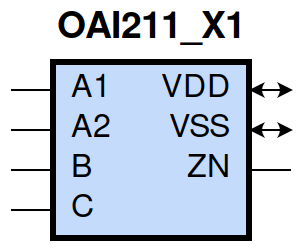
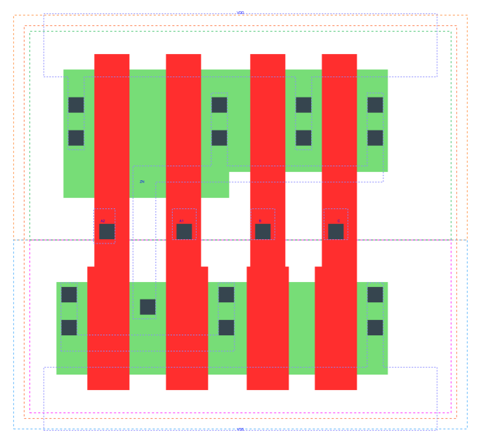

====================================
gf180mcu_fd_sc_mcu9t5v0__oai211_x1
====================================

**gf180mcu_fd_sc_mcu9t5v0__oai211_x1 symbol**

**gf180mcu_fd_sc_mcu9t5v0__oai211_x1 schematic**

.. image:: sc9_sch/OAI211_X1_sch.png
    :height: 250px
    :width: 450 px
    :align: center
    :alt: gf180mcu_fd_sc_mcu9t5v0__oai211_x1 schematic

**gf180mcu_fd_sc_mcu9t5v0__oai211_x1 layout**

.. include:: images.rst
| OAI211_X1 is a 2-input OR into 3-input NAND with 1X drive strength

|
| Attributes

============= ======================
**Attribute** **Value**
area          28.224000 µm\ :sup:`2`
============= ======================

|
| OUTPUT FUNCTIONS

============== =========================
**Output Pin** **Function**
ZN             (((!A1)&(!A2))|(!B)|(!C))
============== =========================

|
| TRUTH TABLE FOR ZN

====== ====== ===== ===== ======
**A1** **A2** **B** **C** **ZN**
0      0      ?     ?     1
?      ?      0     ?     1
?      ?      ?     0     1
1      ?      1     1     0
?      1      1     1     0
====== ====== ===== ===== ======

|
| FUNCTIONAL SCHEMATIC

| |image518|

| PIN CAPACITANCE (pf)

======= ======== ====================
**Pin** **Type** **Capacitance (pf)**
A2      input    0.0066
A1      input    0.0069
B       input    0.0061
C       input    0.0060
======= ======== ====================

|
| DELAY AND OUTPUT TRANSITION TIME corresponding to min slew and load

+---------------+------------+--------------------+--------------+-------------------+----------------+---------------+
| **Input Pin** | **Output** | **When Condition** | **Tin (ns)** | **Out Load (pf)** | **Delay (ns)** | **Tout (ns)** |
+---------------+------------+--------------------+--------------+-------------------+----------------+---------------+
| A2(HL)        | ZN(LH)     | !A1&B&C            | 0.0100       | 0.0010            | 0.1399         | 0.0873        |
+---------------+------------+--------------------+--------------+-------------------+----------------+---------------+
| A2(LH)        | ZN(HL)     | !A1&B&C            | 0.0100       | 0.0010            | 0.1041         | 0.0780        |
+---------------+------------+--------------------+--------------+-------------------+----------------+---------------+
| A1(HL)        | ZN(LH)     | !A2&B&C            | 0.0100       | 0.0010            | 0.1163         | 0.0871        |
+---------------+------------+--------------------+--------------+-------------------+----------------+---------------+
| A1(LH)        | ZN(HL)     | !A2&B&C            | 0.0100       | 0.0010            | 0.0772         | 0.0557        |
+---------------+------------+--------------------+--------------+-------------------+----------------+---------------+
| B(LH)         | ZN(HL)     | !A1&A2&C           | 0.0100       | 0.0010            | 0.1407         | 0.0783        |
+---------------+------------+--------------------+--------------+-------------------+----------------+---------------+
| B(LH)         | ZN(HL)     | A1&!A2&C           | 0.0100       | 0.0010            | 0.1105         | 0.0572        |
+---------------+------------+--------------------+--------------+-------------------+----------------+---------------+
| B(LH)         | ZN(HL)     | A1&A2&C            | 0.0100       | 0.0010            | 0.0984         | 0.0609        |
+---------------+------------+--------------------+--------------+-------------------+----------------+---------------+
| B(HL)         | ZN(LH)     | !A1&A2&C           | 0.0100       | 0.0010            | 0.1336         | 0.1160        |
+---------------+------------+--------------------+--------------+-------------------+----------------+---------------+
| B(HL)         | ZN(LH)     | A1&!A2&C           | 0.0100       | 0.0010            | 0.1267         | 0.0891        |
+---------------+------------+--------------------+--------------+-------------------+----------------+---------------+
| B(HL)         | ZN(LH)     | A1&A2&C            | 0.0100       | 0.0010            | 0.1440         | 0.1015        |
+---------------+------------+--------------------+--------------+-------------------+----------------+---------------+
| C(HL)         | ZN(LH)     | !A1&A2&B           | 0.0100       | 0.0010            | 0.1508         | 0.1360        |
+---------------+------------+--------------------+--------------+-------------------+----------------+---------------+
| C(HL)         | ZN(LH)     | A1&!A2&B           | 0.0100       | 0.0010            | 0.1426         | 0.1066        |
+---------------+------------+--------------------+--------------+-------------------+----------------+---------------+
| C(HL)         | ZN(LH)     | A1&A2&B            | 0.0100       | 0.0010            | 0.1625         | 0.1199        |
+---------------+------------+--------------------+--------------+-------------------+----------------+---------------+
| C(LH)         | ZN(HL)     | !A1&A2&B           | 0.0100       | 0.0010            | 0.1515         | 0.0783        |
+---------------+------------+--------------------+--------------+-------------------+----------------+---------------+
| C(LH)         | ZN(HL)     | A1&!A2&B           | 0.0100       | 0.0010            | 0.1214         | 0.0572        |
+---------------+------------+--------------------+--------------+-------------------+----------------+---------------+
| C(LH)         | ZN(HL)     | A1&A2&B            | 0.0100       | 0.0010            | 0.1093         | 0.0609        |
+---------------+------------+--------------------+--------------+-------------------+----------------+---------------+

|
| DYNAMIC ENERGY

+---------------+--------------------+--------------+------------+-------------------+---------------------+
| **Input Pin** | **When Condition** | **Tin (ns)** | **Output** | **Out Load (pf)** | **Energy (uW/MHz)** |
+---------------+--------------------+--------------+------------+-------------------+---------------------+
| C             | !A1&A2&B           | 0.0100       | ZN(LH)     | 0.0010            | 0.3918              |
+---------------+--------------------+--------------+------------+-------------------+---------------------+
| C             | A1&!A2&B           | 0.0100       | ZN(LH)     | 0.0010            | 0.3472              |
+---------------+--------------------+--------------+------------+-------------------+---------------------+
| C             | A1&A2&B            | 0.0100       | ZN(LH)     | 0.0010            | 0.3824              |
+---------------+--------------------+--------------+------------+-------------------+---------------------+
| C             | !A1&A2&B           | 0.0100       | ZN(HL)     | 0.0010            | 0.0741              |
+---------------+--------------------+--------------+------------+-------------------+---------------------+
| C             | A1&!A2&B           | 0.0100       | ZN(HL)     | 0.0010            | 0.0379              |
+---------------+--------------------+--------------+------------+-------------------+---------------------+
| C             | A1&A2&B            | 0.0100       | ZN(HL)     | 0.0010            | 0.0379              |
+---------------+--------------------+--------------+------------+-------------------+---------------------+
| A1            | !A2&B&C            | 0.0100       | ZN(LH)     | 0.0010            | 0.1884              |
+---------------+--------------------+--------------+------------+-------------------+---------------------+
| B             | !A1&A2&C           | 0.0100       | ZN(HL)     | 0.0010            | 0.0741              |
+---------------+--------------------+--------------+------------+-------------------+---------------------+
| B             | A1&!A2&C           | 0.0100       | ZN(HL)     | 0.0010            | 0.0378              |
+---------------+--------------------+--------------+------------+-------------------+---------------------+
| B             | A1&A2&C            | 0.0100       | ZN(HL)     | 0.0010            | 0.0378              |
+---------------+--------------------+--------------+------------+-------------------+---------------------+
| A2            | !A1&B&C            | 0.0100       | ZN(LH)     | 0.0010            | 0.2332              |
+---------------+--------------------+--------------+------------+-------------------+---------------------+
| A1            | !A2&B&C            | 0.0100       | ZN(HL)     | 0.0010            | 0.0343              |
+---------------+--------------------+--------------+------------+-------------------+---------------------+
| B             | !A1&A2&C           | 0.0100       | ZN(LH)     | 0.0010            | 0.3363              |
+---------------+--------------------+--------------+------------+-------------------+---------------------+
| B             | A1&!A2&C           | 0.0100       | ZN(LH)     | 0.0010            | 0.2922              |
+---------------+--------------------+--------------+------------+-------------------+---------------------+
| B             | A1&A2&C            | 0.0100       | ZN(LH)     | 0.0010            | 0.3282              |
+---------------+--------------------+--------------+------------+-------------------+---------------------+
| A2            | !A1&B&C            | 0.0100       | ZN(HL)     | 0.0010            | 0.0654              |
+---------------+--------------------+--------------+------------+-------------------+---------------------+
| B(HL)         | !A1&!A2&!C         | 0.0100       | n/a        | n/a               | 0.0761              |
+---------------+--------------------+--------------+------------+-------------------+---------------------+
| B(HL)         | !A1&!A2&C          | 0.0100       | n/a        | n/a               | 0.0617              |
+---------------+--------------------+--------------+------------+-------------------+---------------------+
| B(HL)         | !A1&A2&!C          | 0.0100       | n/a        | n/a               | 0.0521              |
+---------------+--------------------+--------------+------------+-------------------+---------------------+
| B(HL)         | A1&!A2&!C          | 0.0100       | n/a        | n/a               | 0.0523              |
+---------------+--------------------+--------------+------------+-------------------+---------------------+
| B(HL)         | A1&A2&!C           | 0.0100       | n/a        | n/a               | 0.0521              |
+---------------+--------------------+--------------+------------+-------------------+---------------------+
| A2(LH)        | !A1&!B&!C          | 0.0100       | n/a        | n/a               | 0.0043              |
+---------------+--------------------+--------------+------------+-------------------+---------------------+
| A2(LH)        | !A1&!B&C           | 0.0100       | n/a        | n/a               | 0.0044              |
+---------------+--------------------+--------------+------------+-------------------+---------------------+
| A2(LH)        | !A1&B&!C           | 0.0100       | n/a        | n/a               | 0.0682              |
+---------------+--------------------+--------------+------------+-------------------+---------------------+
| A2(LH)        | A1&!B&!C           | 0.0100       | n/a        | n/a               | -0.0649             |
+---------------+--------------------+--------------+------------+-------------------+---------------------+
| A2(LH)        | A1&!B&C            | 0.0100       | n/a        | n/a               | -0.0649             |
+---------------+--------------------+--------------+------------+-------------------+---------------------+
| A2(LH)        | A1&B&!C            | 0.0100       | n/a        | n/a               | -0.0649             |
+---------------+--------------------+--------------+------------+-------------------+---------------------+
| A2(LH)        | A1&B&C             | 0.0100       | n/a        | n/a               | -0.0498             |
+---------------+--------------------+--------------+------------+-------------------+---------------------+
| A1(LH)        | !A2&!B&!C          | 0.0100       | n/a        | n/a               | 0.0038              |
+---------------+--------------------+--------------+------------+-------------------+---------------------+
| A1(LH)        | !A2&!B&C           | 0.0100       | n/a        | n/a               | 0.0038              |
+---------------+--------------------+--------------+------------+-------------------+---------------------+
| A1(LH)        | !A2&B&!C           | 0.0100       | n/a        | n/a               | 0.0677              |
+---------------+--------------------+--------------+------------+-------------------+---------------------+
| A1(LH)        | A2&!B&!C           | 0.0100       | n/a        | n/a               | -0.0658             |
+---------------+--------------------+--------------+------------+-------------------+---------------------+
| A1(LH)        | A2&!B&C            | 0.0100       | n/a        | n/a               | -0.0657             |
+---------------+--------------------+--------------+------------+-------------------+---------------------+
| A1(LH)        | A2&B&!C            | 0.0100       | n/a        | n/a               | -0.0657             |
+---------------+--------------------+--------------+------------+-------------------+---------------------+
| A1(LH)        | A2&B&C             | 0.0100       | n/a        | n/a               | -0.0168             |
+---------------+--------------------+--------------+------------+-------------------+---------------------+
| C(HL)         | !A1&!A2&!B         | 0.0100       | n/a        | n/a               | 0.0476              |
+---------------+--------------------+--------------+------------+-------------------+---------------------+
| C(HL)         | !A1&!A2&B          | 0.0100       | n/a        | n/a               | 0.0506              |
+---------------+--------------------+--------------+------------+-------------------+---------------------+
| C(HL)         | !A1&A2&!B          | 0.0100       | n/a        | n/a               | 0.0499              |
+---------------+--------------------+--------------+------------+-------------------+---------------------+
| C(HL)         | A1&!A2&!B          | 0.0100       | n/a        | n/a               | 0.0499              |
+---------------+--------------------+--------------+------------+-------------------+---------------------+
| C(HL)         | A1&A2&!B           | 0.0100       | n/a        | n/a               | 0.0498              |
+---------------+--------------------+--------------+------------+-------------------+---------------------+
| A2(HL)        | !A1&!B&!C          | 0.0100       | n/a        | n/a               | 0.0670              |
+---------------+--------------------+--------------+------------+-------------------+---------------------+
| A2(HL)        | !A1&!B&C           | 0.0100       | n/a        | n/a               | 0.0670              |
+---------------+--------------------+--------------+------------+-------------------+---------------------+
| A2(HL)        | !A1&B&!C           | 0.0100       | n/a        | n/a               | 0.0670              |
+---------------+--------------------+--------------+------------+-------------------+---------------------+
| A2(HL)        | A1&!B&!C           | 0.0100       | n/a        | n/a               | 0.0704              |
+---------------+--------------------+--------------+------------+-------------------+---------------------+
| A2(HL)        | A1&!B&C            | 0.0100       | n/a        | n/a               | 0.0704              |
+---------------+--------------------+--------------+------------+-------------------+---------------------+
| A2(HL)        | A1&B&!C            | 0.0100       | n/a        | n/a               | 0.0700              |
+---------------+--------------------+--------------+------------+-------------------+---------------------+
| A2(HL)        | A1&B&C             | 0.0100       | n/a        | n/a               | 0.0596              |
+---------------+--------------------+--------------+------------+-------------------+---------------------+
| B(LH)         | !A1&!A2&!C         | 0.0100       | n/a        | n/a               | -0.0477             |
+---------------+--------------------+--------------+------------+-------------------+---------------------+
| B(LH)         | !A1&!A2&C          | 0.0100       | n/a        | n/a               | -0.0475             |
+---------------+--------------------+--------------+------------+-------------------+---------------------+
| B(LH)         | !A1&A2&!C          | 0.0100       | n/a        | n/a               | -0.0375             |
+---------------+--------------------+--------------+------------+-------------------+---------------------+
| B(LH)         | A1&!A2&!C          | 0.0100       | n/a        | n/a               | -0.0375             |
+---------------+--------------------+--------------+------------+-------------------+---------------------+
| B(LH)         | A1&A2&!C           | 0.0100       | n/a        | n/a               | -0.0376             |
+---------------+--------------------+--------------+------------+-------------------+---------------------+
| A1(HL)        | !A2&!B&!C          | 0.0100       | n/a        | n/a               | 0.0673              |
+---------------+--------------------+--------------+------------+-------------------+---------------------+
| A1(HL)        | !A2&!B&C           | 0.0100       | n/a        | n/a               | 0.0674              |
+---------------+--------------------+--------------+------------+-------------------+---------------------+
| A1(HL)        | !A2&B&!C           | 0.0100       | n/a        | n/a               | 0.0674              |
+---------------+--------------------+--------------+------------+-------------------+---------------------+
| A1(HL)        | A2&!B&!C           | 0.0100       | n/a        | n/a               | 0.0707              |
+---------------+--------------------+--------------+------------+-------------------+---------------------+
| A1(HL)        | A2&!B&C            | 0.0100       | n/a        | n/a               | 0.0707              |
+---------------+--------------------+--------------+------------+-------------------+---------------------+
| A1(HL)        | A2&B&!C            | 0.0100       | n/a        | n/a               | 0.0703              |
+---------------+--------------------+--------------+------------+-------------------+---------------------+
| A1(HL)        | A2&B&C             | 0.0100       | n/a        | n/a               | 0.0384              |
+---------------+--------------------+--------------+------------+-------------------+---------------------+
| C(LH)         | !A1&!A2&!B         | 0.0100       | n/a        | n/a               | -0.0477             |
+---------------+--------------------+--------------+------------+-------------------+---------------------+
| C(LH)         | !A1&!A2&B          | 0.0100       | n/a        | n/a               | -0.0476             |
+---------------+--------------------+--------------+------------+-------------------+---------------------+
| C(LH)         | !A1&A2&!B          | 0.0100       | n/a        | n/a               | -0.0476             |
+---------------+--------------------+--------------+------------+-------------------+---------------------+
| C(LH)         | A1&!A2&!B          | 0.0100       | n/a        | n/a               | -0.0477             |
+---------------+--------------------+--------------+------------+-------------------+---------------------+
| C(LH)         | A1&A2&!B           | 0.0100       | n/a        | n/a               | -0.0477             |
+---------------+--------------------+--------------+------------+-------------------+---------------------+

|
| LEAKAGE POWER

================== ==============
**When Condition** **Power (nW)**
!A1&!A2&!B&!C      0.1004
!A1&!A2&!B&C       0.1004
!A1&!A2&B&!C       0.1005
!A1&!A2&B&C        0.1012
!A1&A2&!B&!C       0.1600
!A1&A2&!B&C        0.1602
!A1&A2&B&!C        0.1992
A1&!A2&!B&!C       0.1600
A1&!A2&!B&C        0.1602
A1&!A2&B&!C        0.1992
A1&A2&!B&!C        0.1603
A1&A2&!B&C         0.1605
A1&A2&B&!C         0.1995
!A1&A2&B&C         0.1656
A1&!A2&B&C         0.1301
A1&A2&B&C          0.1301
================== ==============

