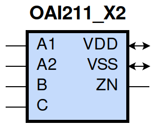
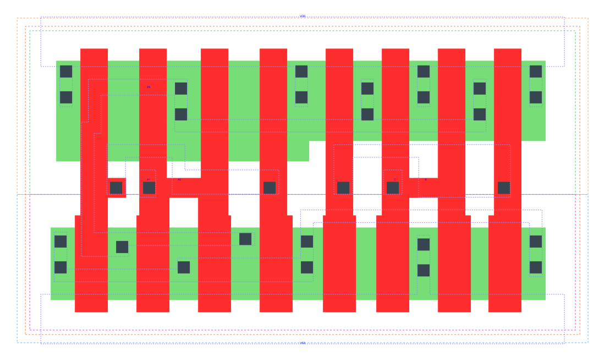

====================================
gf180mcu_fd_sc_mcu9t5v0__oai211_x2
====================================

**gf180mcu_fd_sc_mcu9t5v0__oai211_x2 symbol**

**gf180mcu_fd_sc_mcu9t5v0__oai211_x2 schematic**

.. image:: sc9_sch/OAI211_X2_sch.png
    :height: 250px
    :width: 450 px
    :align: center
    :alt: gf180mcu_fd_sc_mcu9t5v0__oai211_x2 schematic

**gf180mcu_fd_sc_mcu9t5v0__oai211_x2 layout**

.. include:: images.rst
| OAI211_X2 is a 2-input OR into 3-input NAND with 2X drive strength

|
| Attributes

============= ======================
**Attribute** **Value**
area          47.980800 µm\ :sup:`2`
============= ======================

|
| OUTPUT FUNCTIONS

============== =========================
**Output Pin** **Function**
ZN             (((!A1)&(!A2))|(!B)|(!C))
============== =========================

|
| TRUTH TABLE FOR ZN

====== ====== ===== ===== ======
**A1** **A2** **B** **C** **ZN**
0      0      ?     ?     1
?      ?      0     ?     1
?      ?      ?     0     1
1      ?      1     1     0
?      1      1     1     0
====== ====== ===== ===== ======

|
| FUNCTIONAL SCHEMATIC

| |image521|

| PIN CAPACITANCE (pf)

======= ======== ====================
**Pin** **Type** **Capacitance (pf)**
A2      input    0.0140
A1      input    0.0135
B       input    0.0131
C       input    0.0121
======= ======== ====================

|
| DELAY AND OUTPUT TRANSITION TIME corresponding to min slew and load

+---------------+------------+--------------------+--------------+-------------------+----------------+---------------+
| **Input Pin** | **Output** | **When Condition** | **Tin (ns)** | **Out Load (pf)** | **Delay (ns)** | **Tout (ns)** |
+---------------+------------+--------------------+--------------+-------------------+----------------+---------------+
| A2(HL)        | ZN(LH)     | !A1&B&C            | 0.0100       | 0.0010            | 0.1284         | 0.0775        |
+---------------+------------+--------------------+--------------+-------------------+----------------+---------------+
| A2(LH)        | ZN(HL)     | !A1&B&C            | 0.0100       | 0.0010            | 0.0952         | 0.0721        |
+---------------+------------+--------------------+--------------+-------------------+----------------+---------------+
| A1(HL)        | ZN(LH)     | !A2&B&C            | 0.0100       | 0.0010            | 0.1044         | 0.0772        |
+---------------+------------+--------------------+--------------+-------------------+----------------+---------------+
| A1(LH)        | ZN(HL)     | !A2&B&C            | 0.0100       | 0.0010            | 0.0686         | 0.0491        |
+---------------+------------+--------------------+--------------+-------------------+----------------+---------------+
| B(LH)         | ZN(HL)     | !A1&A2&C           | 0.0100       | 0.0010            | 0.1348         | 0.0722        |
+---------------+------------+--------------------+--------------+-------------------+----------------+---------------+
| B(LH)         | ZN(HL)     | A1&!A2&C           | 0.0100       | 0.0010            | 0.1047         | 0.0514        |
+---------------+------------+--------------------+--------------+-------------------+----------------+---------------+
| B(LH)         | ZN(HL)     | A1&A2&C            | 0.0100       | 0.0010            | 0.0935         | 0.0567        |
+---------------+------------+--------------------+--------------+-------------------+----------------+---------------+
| B(HL)         | ZN(LH)     | !A1&A2&C           | 0.0100       | 0.0010            | 0.1283         | 0.1116        |
+---------------+------------+--------------------+--------------+-------------------+----------------+---------------+
| B(HL)         | ZN(LH)     | A1&!A2&C           | 0.0100       | 0.0010            | 0.1211         | 0.0840        |
+---------------+------------+--------------------+--------------+-------------------+----------------+---------------+
| B(HL)         | ZN(LH)     | A1&A2&C            | 0.0100       | 0.0010            | 0.1390         | 0.0966        |
+---------------+------------+--------------------+--------------+-------------------+----------------+---------------+
| C(HL)         | ZN(LH)     | !A1&A2&B           | 0.0100       | 0.0010            | 0.1450         | 0.1314        |
+---------------+------------+--------------------+--------------+-------------------+----------------+---------------+
| C(HL)         | ZN(LH)     | A1&!A2&B           | 0.0100       | 0.0010            | 0.1364         | 0.1009        |
+---------------+------------+--------------------+--------------+-------------------+----------------+---------------+
| C(HL)         | ZN(LH)     | A1&A2&B            | 0.0100       | 0.0010            | 0.1572         | 0.1146        |
+---------------+------------+--------------------+--------------+-------------------+----------------+---------------+
| C(LH)         | ZN(HL)     | !A1&A2&B           | 0.0100       | 0.0010            | 0.1457         | 0.0721        |
+---------------+------------+--------------------+--------------+-------------------+----------------+---------------+
| C(LH)         | ZN(HL)     | A1&!A2&B           | 0.0100       | 0.0010            | 0.1156         | 0.0515        |
+---------------+------------+--------------------+--------------+-------------------+----------------+---------------+
| C(LH)         | ZN(HL)     | A1&A2&B            | 0.0100       | 0.0010            | 0.1043         | 0.0566        |
+---------------+------------+--------------------+--------------+-------------------+----------------+---------------+

|
| DYNAMIC ENERGY

+---------------+--------------------+--------------+------------+-------------------+---------------------+
| **Input Pin** | **When Condition** | **Tin (ns)** | **Output** | **Out Load (pf)** | **Energy (uW/MHz)** |
+---------------+--------------------+--------------+------------+-------------------+---------------------+
| C             | !A1&A2&B           | 0.0100       | ZN(LH)     | 0.0010            | 0.8032              |
+---------------+--------------------+--------------+------------+-------------------+---------------------+
| C             | A1&!A2&B           | 0.0100       | ZN(LH)     | 0.0010            | 0.7134              |
+---------------+--------------------+--------------+------------+-------------------+---------------------+
| C             | A1&A2&B            | 0.0100       | ZN(LH)     | 0.0010            | 0.7845              |
+---------------+--------------------+--------------+------------+-------------------+---------------------+
| C             | !A1&A2&B           | 0.0100       | ZN(HL)     | 0.0010            | 0.1190              |
+---------------+--------------------+--------------+------------+-------------------+---------------------+
| C             | A1&!A2&B           | 0.0100       | ZN(HL)     | 0.0010            | 0.0441              |
+---------------+--------------------+--------------+------------+-------------------+---------------------+
| C             | A1&A2&B            | 0.0100       | ZN(HL)     | 0.0010            | 0.0443              |
+---------------+--------------------+--------------+------------+-------------------+---------------------+
| A1            | !A2&B&C            | 0.0100       | ZN(LH)     | 0.0010            | 0.3795              |
+---------------+--------------------+--------------+------------+-------------------+---------------------+
| B             | !A1&A2&C           | 0.0100       | ZN(HL)     | 0.0010            | 0.1190              |
+---------------+--------------------+--------------+------------+-------------------+---------------------+
| B             | A1&!A2&C           | 0.0100       | ZN(HL)     | 0.0010            | 0.0441              |
+---------------+--------------------+--------------+------------+-------------------+---------------------+
| B             | A1&A2&C            | 0.0100       | ZN(HL)     | 0.0010            | 0.0441              |
+---------------+--------------------+--------------+------------+-------------------+---------------------+
| A2            | !A1&B&C            | 0.0100       | ZN(LH)     | 0.0010            | 0.4690              |
+---------------+--------------------+--------------+------------+-------------------+---------------------+
| A1            | !A2&B&C            | 0.0100       | ZN(HL)     | 0.0010            | 0.0365              |
+---------------+--------------------+--------------+------------+-------------------+---------------------+
| B             | !A1&A2&C           | 0.0100       | ZN(LH)     | 0.0010            | 0.6933              |
+---------------+--------------------+--------------+------------+-------------------+---------------------+
| B             | A1&!A2&C           | 0.0100       | ZN(LH)     | 0.0010            | 0.6036              |
+---------------+--------------------+--------------+------------+-------------------+---------------------+
| B             | A1&A2&C            | 0.0100       | ZN(LH)     | 0.0010            | 0.6767              |
+---------------+--------------------+--------------+------------+-------------------+---------------------+
| A2            | !A1&B&C            | 0.0100       | ZN(HL)     | 0.0010            | 0.1023              |
+---------------+--------------------+--------------+------------+-------------------+---------------------+
| B(HL)         | !A1&!A2&!C         | 0.0100       | n/a        | n/a               | 0.1517              |
+---------------+--------------------+--------------+------------+-------------------+---------------------+
| B(HL)         | !A1&!A2&C          | 0.0100       | n/a        | n/a               | 0.1233              |
+---------------+--------------------+--------------+------------+-------------------+---------------------+
| B(HL)         | !A1&A2&!C          | 0.0100       | n/a        | n/a               | 0.1030              |
+---------------+--------------------+--------------+------------+-------------------+---------------------+
| B(HL)         | A1&!A2&!C          | 0.0100       | n/a        | n/a               | 0.1035              |
+---------------+--------------------+--------------+------------+-------------------+---------------------+
| B(HL)         | A1&A2&!C           | 0.0100       | n/a        | n/a               | 0.1032              |
+---------------+--------------------+--------------+------------+-------------------+---------------------+
| A2(LH)        | !A1&!B&!C          | 0.0100       | n/a        | n/a               | 0.0240              |
+---------------+--------------------+--------------+------------+-------------------+---------------------+
| A2(LH)        | !A1&!B&C           | 0.0100       | n/a        | n/a               | 0.0241              |
+---------------+--------------------+--------------+------------+-------------------+---------------------+
| A2(LH)        | !A1&B&!C           | 0.0100       | n/a        | n/a               | 0.1508              |
+---------------+--------------------+--------------+------------+-------------------+---------------------+
| A2(LH)        | A1&!B&!C           | 0.0100       | n/a        | n/a               | -0.1299             |
+---------------+--------------------+--------------+------------+-------------------+---------------------+
| A2(LH)        | A1&!B&C            | 0.0100       | n/a        | n/a               | -0.1298             |
+---------------+--------------------+--------------+------------+-------------------+---------------------+
| A2(LH)        | A1&B&!C            | 0.0100       | n/a        | n/a               | -0.1298             |
+---------------+--------------------+--------------+------------+-------------------+---------------------+
| A2(LH)        | A1&B&C             | 0.0100       | n/a        | n/a               | -0.0995             |
+---------------+--------------------+--------------+------------+-------------------+---------------------+
| A1(LH)        | !A2&!B&!C          | 0.0100       | n/a        | n/a               | 0.0229              |
+---------------+--------------------+--------------+------------+-------------------+---------------------+
| A1(LH)        | !A2&!B&C           | 0.0100       | n/a        | n/a               | 0.0230              |
+---------------+--------------------+--------------+------------+-------------------+---------------------+
| A1(LH)        | !A2&B&!C           | 0.0100       | n/a        | n/a               | 0.1497              |
+---------------+--------------------+--------------+------------+-------------------+---------------------+
| A1(LH)        | A2&!B&!C           | 0.0100       | n/a        | n/a               | -0.1316             |
+---------------+--------------------+--------------+------------+-------------------+---------------------+
| A1(LH)        | A2&!B&C            | 0.0100       | n/a        | n/a               | -0.1313             |
+---------------+--------------------+--------------+------------+-------------------+---------------------+
| A1(LH)        | A2&B&!C            | 0.0100       | n/a        | n/a               | -0.1313             |
+---------------+--------------------+--------------+------------+-------------------+---------------------+
| A1(LH)        | A2&B&C             | 0.0100       | n/a        | n/a               | -0.0337             |
+---------------+--------------------+--------------+------------+-------------------+---------------------+
| C(HL)         | !A1&!A2&!B         | 0.0100       | n/a        | n/a               | 0.0952              |
+---------------+--------------------+--------------+------------+-------------------+---------------------+
| C(HL)         | !A1&!A2&B          | 0.0100       | n/a        | n/a               | 0.1003              |
+---------------+--------------------+--------------+------------+-------------------+---------------------+
| C(HL)         | !A1&A2&!B          | 0.0100       | n/a        | n/a               | 0.0990              |
+---------------+--------------------+--------------+------------+-------------------+---------------------+
| C(HL)         | A1&!A2&!B          | 0.0100       | n/a        | n/a               | 0.0990              |
+---------------+--------------------+--------------+------------+-------------------+---------------------+
| C(HL)         | A1&A2&!B           | 0.0100       | n/a        | n/a               | 0.0988              |
+---------------+--------------------+--------------+------------+-------------------+---------------------+
| A2(HL)        | !A1&!B&!C          | 0.0100       | n/a        | n/a               | 0.1340              |
+---------------+--------------------+--------------+------------+-------------------+---------------------+
| A2(HL)        | !A1&!B&C           | 0.0100       | n/a        | n/a               | 0.1341              |
+---------------+--------------------+--------------+------------+-------------------+---------------------+
| A2(HL)        | !A1&B&!C           | 0.0100       | n/a        | n/a               | 0.1340              |
+---------------+--------------------+--------------+------------+-------------------+---------------------+
| A2(HL)        | A1&!B&!C           | 0.0100       | n/a        | n/a               | 0.1400              |
+---------------+--------------------+--------------+------------+-------------------+---------------------+
| A2(HL)        | A1&!B&C            | 0.0100       | n/a        | n/a               | 0.1401              |
+---------------+--------------------+--------------+------------+-------------------+---------------------+
| A2(HL)        | A1&B&!C            | 0.0100       | n/a        | n/a               | 0.1396              |
+---------------+--------------------+--------------+------------+-------------------+---------------------+
| A2(HL)        | A1&B&C             | 0.0100       | n/a        | n/a               | 0.1189              |
+---------------+--------------------+--------------+------------+-------------------+---------------------+
| B(LH)         | !A1&!A2&!C         | 0.0100       | n/a        | n/a               | -0.0952             |
+---------------+--------------------+--------------+------------+-------------------+---------------------+
| B(LH)         | !A1&!A2&C          | 0.0100       | n/a        | n/a               | -0.0948             |
+---------------+--------------------+--------------+------------+-------------------+---------------------+
| B(LH)         | !A1&A2&!C          | 0.0100       | n/a        | n/a               | -0.0769             |
+---------------+--------------------+--------------+------------+-------------------+---------------------+
| B(LH)         | A1&!A2&!C          | 0.0100       | n/a        | n/a               | -0.0770             |
+---------------+--------------------+--------------+------------+-------------------+---------------------+
| B(LH)         | A1&A2&!C           | 0.0100       | n/a        | n/a               | -0.0771             |
+---------------+--------------------+--------------+------------+-------------------+---------------------+
| A1(HL)        | !A2&!B&!C          | 0.0100       | n/a        | n/a               | 0.1344              |
+---------------+--------------------+--------------+------------+-------------------+---------------------+
| A1(HL)        | !A2&!B&C           | 0.0100       | n/a        | n/a               | 0.1344              |
+---------------+--------------------+--------------+------------+-------------------+---------------------+
| A1(HL)        | !A2&B&!C           | 0.0100       | n/a        | n/a               | 0.1344              |
+---------------+--------------------+--------------+------------+-------------------+---------------------+
| A1(HL)        | A2&!B&!C           | 0.0100       | n/a        | n/a               | 0.1400              |
+---------------+--------------------+--------------+------------+-------------------+---------------------+
| A1(HL)        | A2&!B&C            | 0.0100       | n/a        | n/a               | 0.1400              |
+---------------+--------------------+--------------+------------+-------------------+---------------------+
| A1(HL)        | A2&B&!C            | 0.0100       | n/a        | n/a               | 0.1395              |
+---------------+--------------------+--------------+------------+-------------------+---------------------+
| A1(HL)        | A2&B&C             | 0.0100       | n/a        | n/a               | 0.0794              |
+---------------+--------------------+--------------+------------+-------------------+---------------------+
| C(LH)         | !A1&!A2&!B         | 0.0100       | n/a        | n/a               | -0.0952             |
+---------------+--------------------+--------------+------------+-------------------+---------------------+
| C(LH)         | !A1&!A2&B          | 0.0100       | n/a        | n/a               | -0.0948             |
+---------------+--------------------+--------------+------------+-------------------+---------------------+
| C(LH)         | !A1&A2&!B          | 0.0100       | n/a        | n/a               | -0.0950             |
+---------------+--------------------+--------------+------------+-------------------+---------------------+
| C(LH)         | A1&!A2&!B          | 0.0100       | n/a        | n/a               | -0.0952             |
+---------------+--------------------+--------------+------------+-------------------+---------------------+
| C(LH)         | A1&A2&!B           | 0.0100       | n/a        | n/a               | -0.0952             |
+---------------+--------------------+--------------+------------+-------------------+---------------------+

|
| LEAKAGE POWER

================== ==============
**When Condition** **Power (nW)**
!A1&!A2&!B&!C      0.1509
!A1&!A2&!B&C       0.1509
!A1&!A2&B&!C       0.1511
!A1&!A2&B&C        0.1523
!A1&A2&!B&!C       0.2695
!A1&A2&!B&C        0.2699
!A1&A2&B&!C        0.3480
A1&!A2&!B&!C       0.2695
A1&!A2&!B&C        0.2699
A1&!A2&B&!C        0.3480
A1&A2&!B&!C        0.2701
A1&A2&!B&C         0.2705
A1&A2&B&!C         0.3487
!A1&A2&B&C         0.2812
A1&!A2&B&C         0.2103
A1&A2&B&C          0.2103
================== ==============

