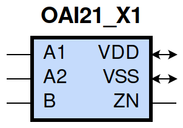
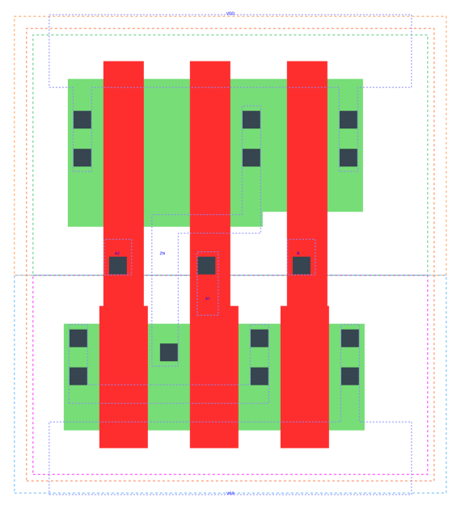

====================================
gf180mcu_fd_sc_mcu9t5v0__oai21_x1
====================================

**gf180mcu_fd_sc_mcu9t5v0__oai21_x1 symbol**

**gf180mcu_fd_sc_mcu9t5v0__oai21_x1 schematic**

.. image:: sc9_sch/OAI21_X1_sch.png
    :height: 250px
    :width: 450 px
    :align: center
    :alt: gf180mcu_fd_sc_mcu9t5v0__oai21_x1 schematic

**gf180mcu_fd_sc_mcu9t5v0__oai21_x1 layout**

.. include:: images.rst
| OAI21_X1 is a 2-input OR into 2-input NAND with 1X drive strength

|
| Attributes

============= ======================
**Attribute** **Value**
area          22.579200 µm\ :sup:`2`
============= ======================

|
| OUTPUT FUNCTIONS

============== ====================
**Output Pin** **Function**
ZN             (((!A1)&(!A2))|(!B))
============== ====================

|
| TRUTH TABLE FOR ZN

====== ====== ===== ======
**A1** **A2** **B** **ZN**
0      0      ?     1
?      ?      0     1
1      ?      1     0
?      1      1     0
====== ====== ===== ======

|
| FUNCTIONAL SCHEMATIC

| |image527|

| PIN CAPACITANCE (pf)

======= ======== ====================
**Pin** **Type** **Capacitance (pf)**
A2      input    0.0066
A1      input    0.0070
B       input    0.0064
======= ======== ====================

|
| DELAY AND OUTPUT TRANSITION TIME corresponding to min slew and load

+---------------+------------+--------------------+--------------+-------------------+----------------+---------------+
| **Input Pin** | **Output** | **When Condition** | **Tin (ns)** | **Out Load (pf)** | **Delay (ns)** | **Tout (ns)** |
+---------------+------------+--------------------+--------------+-------------------+----------------+---------------+
| A2(HL)        | ZN(LH)     | !A1&B              | 0.0100       | 0.0010            | 0.1196         | 0.0704        |
+---------------+------------+--------------------+--------------+-------------------+----------------+---------------+
| A2(LH)        | ZN(HL)     | !A1&B              | 0.0100       | 0.0010            | 0.0729         | 0.0465        |
+---------------+------------+--------------------+--------------+-------------------+----------------+---------------+
| A1(HL)        | ZN(LH)     | !A2&B              | 0.0100       | 0.0010            | 0.0956         | 0.0700        |
+---------------+------------+--------------------+--------------+-------------------+----------------+---------------+
| A1(LH)        | ZN(HL)     | !A2&B              | 0.0100       | 0.0010            | 0.0542         | 0.0310        |
+---------------+------------+--------------------+--------------+-------------------+----------------+---------------+
| B(LH)         | ZN(HL)     | !A1&A2             | 0.0100       | 0.0010            | 0.0957         | 0.0461        |
+---------------+------------+--------------------+--------------+-------------------+----------------+---------------+
| B(LH)         | ZN(HL)     | A1&!A2             | 0.0100       | 0.0010            | 0.0747         | 0.0315        |
+---------------+------------+--------------------+--------------+-------------------+----------------+---------------+
| B(LH)         | ZN(HL)     | A1&A2              | 0.0100       | 0.0010            | 0.0651         | 0.0308        |
+---------------+------------+--------------------+--------------+-------------------+----------------+---------------+
| B(HL)         | ZN(LH)     | !A1&A2             | 0.0100       | 0.0010            | 0.1030         | 0.0913        |
+---------------+------------+--------------------+--------------+-------------------+----------------+---------------+
| B(HL)         | ZN(LH)     | A1&!A2             | 0.0100       | 0.0010            | 0.0968         | 0.0681        |
+---------------+------------+--------------------+--------------+-------------------+----------------+---------------+
| B(HL)         | ZN(LH)     | A1&A2              | 0.0100       | 0.0010            | 0.1129         | 0.0793        |
+---------------+------------+--------------------+--------------+-------------------+----------------+---------------+

|
| DYNAMIC ENERGY

+---------------+--------------------+--------------+------------+-------------------+---------------------+
| **Input Pin** | **When Condition** | **Tin (ns)** | **Output** | **Out Load (pf)** | **Energy (uW/MHz)** |
+---------------+--------------------+--------------+------------+-------------------+---------------------+
| A1            | !A2&B              | 0.0100       | ZN(LH)     | 0.0010            | 0.1655              |
+---------------+--------------------+--------------+------------+-------------------+---------------------+
| B             | !A1&A2             | 0.0100       | ZN(HL)     | 0.0010            | 0.0475              |
+---------------+--------------------+--------------+------------+-------------------+---------------------+
| B             | A1&!A2             | 0.0100       | ZN(HL)     | 0.0010            | 0.0097              |
+---------------+--------------------+--------------+------------+-------------------+---------------------+
| B             | A1&A2              | 0.0100       | ZN(HL)     | 0.0010            | 0.0098              |
+---------------+--------------------+--------------+------------+-------------------+---------------------+
| A2            | !A1&B              | 0.0100       | ZN(LH)     | 0.0010            | 0.2102              |
+---------------+--------------------+--------------+------------+-------------------+---------------------+
| A1            | !A2&B              | 0.0100       | ZN(HL)     | 0.0010            | 0.0098              |
+---------------+--------------------+--------------+------------+-------------------+---------------------+
| B             | !A1&A2             | 0.0100       | ZN(LH)     | 0.0010            | 0.3149              |
+---------------+--------------------+--------------+------------+-------------------+---------------------+
| B             | A1&!A2             | 0.0100       | ZN(LH)     | 0.0010            | 0.2704              |
+---------------+--------------------+--------------+------------+-------------------+---------------------+
| B             | A1&A2              | 0.0100       | ZN(LH)     | 0.0010            | 0.3065              |
+---------------+--------------------+--------------+------------+-------------------+---------------------+
| A2            | !A1&B              | 0.0100       | ZN(HL)     | 0.0010            | 0.0429              |
+---------------+--------------------+--------------+------------+-------------------+---------------------+
| B(HL)         | !A1&!A2            | 0.0100       | n/a        | n/a               | 0.0621              |
+---------------+--------------------+--------------+------------+-------------------+---------------------+
| A2(LH)        | !A1&!B             | 0.0100       | n/a        | n/a               | 0.0041              |
+---------------+--------------------+--------------+------------+-------------------+---------------------+
| A2(LH)        | A1&!B              | 0.0100       | n/a        | n/a               | -0.0649             |
+---------------+--------------------+--------------+------------+-------------------+---------------------+
| A2(LH)        | A1&B               | 0.0100       | n/a        | n/a               | -0.0498             |
+---------------+--------------------+--------------+------------+-------------------+---------------------+
| A1(LH)        | !A2&!B             | 0.0100       | n/a        | n/a               | 0.0036              |
+---------------+--------------------+--------------+------------+-------------------+---------------------+
| A1(LH)        | A2&!B              | 0.0100       | n/a        | n/a               | -0.0657             |
+---------------+--------------------+--------------+------------+-------------------+---------------------+
| A1(LH)        | A2&B               | 0.0100       | n/a        | n/a               | -0.0169             |
+---------------+--------------------+--------------+------------+-------------------+---------------------+
| A2(HL)        | !A1&!B             | 0.0100       | n/a        | n/a               | 0.0670              |
+---------------+--------------------+--------------+------------+-------------------+---------------------+
| A2(HL)        | A1&!B              | 0.0100       | n/a        | n/a               | 0.0705              |
+---------------+--------------------+--------------+------------+-------------------+---------------------+
| A2(HL)        | A1&B               | 0.0100       | n/a        | n/a               | 0.0596              |
+---------------+--------------------+--------------+------------+-------------------+---------------------+
| B(LH)         | !A1&!A2            | 0.0100       | n/a        | n/a               | -0.0539             |
+---------------+--------------------+--------------+------------+-------------------+---------------------+
| A1(HL)        | !A2&!B             | 0.0100       | n/a        | n/a               | 0.0674              |
+---------------+--------------------+--------------+------------+-------------------+---------------------+
| A1(HL)        | A2&!B              | 0.0100       | n/a        | n/a               | 0.0707              |
+---------------+--------------------+--------------+------------+-------------------+---------------------+
| A1(HL)        | A2&B               | 0.0100       | n/a        | n/a               | 0.0397              |
+---------------+--------------------+--------------+------------+-------------------+---------------------+

|
| LEAKAGE POWER

================== ==============
**When Condition** **Power (nW)**
!A1&!A2&!B         0.1004
!A1&!A2&B          0.1012
!A1&A2&!B          0.1602
A1&!A2&!B          0.1602
A1&A2&!B           0.1605
!A1&A2&B           0.1391
A1&!A2&B           0.1036
A1&A2&B            0.1036
================== ==============

