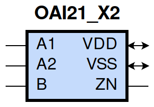
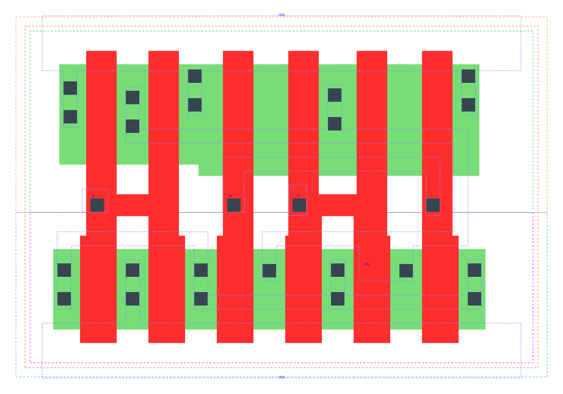

====================================
gf180mcu_fd_sc_mcu9t5v0__oai21_x2
====================================

**gf180mcu_fd_sc_mcu9t5v0__oai21_x2 symbol**

**gf180mcu_fd_sc_mcu9t5v0__oai21_x2 schematic**

.. image:: sc9_sch/OAI21_X2_sch.png
    :height: 250px
    :width: 450 px
    :align: center
    :alt: gf180mcu_fd_sc_mcu9t5v0__oai21_x2 schematic

**gf180mcu_fd_sc_mcu9t5v0__oai21_x2 layout**

.. include:: images.rst
| OAI21_X2 is a 2-input OR into 2-input NAND with 2X drive strength

|
| Attributes

============= ======================
**Attribute** **Value**
area          39.513600 µm\ :sup:`2`
============= ======================

|
| OUTPUT FUNCTIONS

============== ====================
**Output Pin** **Function**
ZN             (((!A1)&(!A2))|(!B))
============== ====================

|
| TRUTH TABLE FOR ZN

====== ====== ===== ======
**A1** **A2** **B** **ZN**
0      0      ?     1
?      ?      0     1
1      ?      1     0
?      1      1     0
====== ====== ===== ======

|
| FUNCTIONAL SCHEMATIC

| |image530|

| PIN CAPACITANCE (pf)

======= ======== ====================
**Pin** **Type** **Capacitance (pf)**
B       input    0.0127
A2      input    0.0139
A1      input    0.0135
======= ======== ====================

|
| DELAY AND OUTPUT TRANSITION TIME corresponding to min slew and load

+---------------+------------+--------------------+--------------+-------------------+----------------+---------------+
| **Input Pin** | **Output** | **When Condition** | **Tin (ns)** | **Out Load (pf)** | **Delay (ns)** | **Tout (ns)** |
+---------------+------------+--------------------+--------------+-------------------+----------------+---------------+
| B(LH)         | ZN(HL)     | !A1&A2             | 0.0100       | 0.0010            | 0.0942         | 0.0443        |
+---------------+------------+--------------------+--------------+-------------------+----------------+---------------+
| B(LH)         | ZN(HL)     | A1&!A2             | 0.0100       | 0.0010            | 0.0733         | 0.0301        |
+---------------+------------+--------------------+--------------+-------------------+----------------+---------------+
| B(LH)         | ZN(HL)     | A1&A2              | 0.0100       | 0.0010            | 0.0641         | 0.0298        |
+---------------+------------+--------------------+--------------+-------------------+----------------+---------------+
| B(HL)         | ZN(LH)     | !A1&A2             | 0.0100       | 0.0010            | 0.1015         | 0.0900        |
+---------------+------------+--------------------+--------------+-------------------+----------------+---------------+
| B(HL)         | ZN(LH)     | A1&!A2             | 0.0100       | 0.0010            | 0.0955         | 0.0667        |
+---------------+------------+--------------------+--------------+-------------------+----------------+---------------+
| B(HL)         | ZN(LH)     | A1&A2              | 0.0100       | 0.0010            | 0.1116         | 0.0779        |
+---------------+------------+--------------------+--------------+-------------------+----------------+---------------+
| A2(HL)        | ZN(LH)     | !A1&B              | 0.0100       | 0.0010            | 0.1154         | 0.0669        |
+---------------+------------+--------------------+--------------+-------------------+----------------+---------------+
| A2(LH)        | ZN(HL)     | !A1&B              | 0.0100       | 0.0010            | 0.0705         | 0.0448        |
+---------------+------------+--------------------+--------------+-------------------+----------------+---------------+
| A1(HL)        | ZN(LH)     | !A2&B              | 0.0100       | 0.0010            | 0.0918         | 0.0664        |
+---------------+------------+--------------------+--------------+-------------------+----------------+---------------+
| A1(LH)        | ZN(HL)     | !A2&B              | 0.0100       | 0.0010            | 0.0521         | 0.0295        |
+---------------+------------+--------------------+--------------+-------------------+----------------+---------------+

|
| DYNAMIC ENERGY

+---------------+--------------------+--------------+------------+-------------------+---------------------+
| **Input Pin** | **When Condition** | **Tin (ns)** | **Output** | **Out Load (pf)** | **Energy (uW/MHz)** |
+---------------+--------------------+--------------+------------+-------------------+---------------------+
| A1            | !A2&B              | 0.0100       | ZN(LH)     | 0.0010            | 0.3472              |
+---------------+--------------------+--------------+------------+-------------------+---------------------+
| B             | !A1&A2             | 0.0100       | ZN(HL)     | 0.0010            | 0.0848              |
+---------------+--------------------+--------------+------------+-------------------+---------------------+
| B             | A1&!A2             | 0.0100       | ZN(HL)     | 0.0010            | 0.0090              |
+---------------+--------------------+--------------+------------+-------------------+---------------------+
| B             | A1&A2              | 0.0100       | ZN(HL)     | 0.0010            | 0.0093              |
+---------------+--------------------+--------------+------------+-------------------+---------------------+
| A2            | !A1&B              | 0.0100       | ZN(LH)     | 0.0010            | 0.4357              |
+---------------+--------------------+--------------+------------+-------------------+---------------------+
| A1            | !A2&B              | 0.0100       | ZN(HL)     | 0.0010            | 0.0092              |
+---------------+--------------------+--------------+------------+-------------------+---------------------+
| B             | !A1&A2             | 0.0100       | ZN(LH)     | 0.0010            | 0.6530              |
+---------------+--------------------+--------------+------------+-------------------+---------------------+
| B             | A1&!A2             | 0.0100       | ZN(LH)     | 0.0010            | 0.5643              |
+---------------+--------------------+--------------+------------+-------------------+---------------------+
| B             | A1&A2              | 0.0100       | ZN(LH)     | 0.0010            | 0.6367              |
+---------------+--------------------+--------------+------------+-------------------+---------------------+
| A2            | !A1&B              | 0.0100       | ZN(HL)     | 0.0010            | 0.0758              |
+---------------+--------------------+--------------+------------+-------------------+---------------------+
| B(HL)         | !A1&!A2            | 0.0100       | n/a        | n/a               | 0.1242              |
+---------------+--------------------+--------------+------------+-------------------+---------------------+
| A2(LH)        | !A1&!B             | 0.0100       | n/a        | n/a               | 0.0147              |
+---------------+--------------------+--------------+------------+-------------------+---------------------+
| A2(LH)        | A1&!B              | 0.0100       | n/a        | n/a               | -0.1299             |
+---------------+--------------------+--------------+------------+-------------------+---------------------+
| A2(LH)        | A1&B               | 0.0100       | n/a        | n/a               | -0.0995             |
+---------------+--------------------+--------------+------------+-------------------+---------------------+
| A1(LH)        | !A2&!B             | 0.0100       | n/a        | n/a               | 0.0136              |
+---------------+--------------------+--------------+------------+-------------------+---------------------+
| A1(LH)        | A2&!B              | 0.0100       | n/a        | n/a               | -0.1315             |
+---------------+--------------------+--------------+------------+-------------------+---------------------+
| A1(LH)        | A2&B               | 0.0100       | n/a        | n/a               | -0.0338             |
+---------------+--------------------+--------------+------------+-------------------+---------------------+
| A2(HL)        | !A1&!B             | 0.0100       | n/a        | n/a               | 0.1340              |
+---------------+--------------------+--------------+------------+-------------------+---------------------+
| A2(HL)        | A1&!B              | 0.0100       | n/a        | n/a               | 0.1406              |
+---------------+--------------------+--------------+------------+-------------------+---------------------+
| A2(HL)        | A1&B               | 0.0100       | n/a        | n/a               | 0.1189              |
+---------------+--------------------+--------------+------------+-------------------+---------------------+
| B(LH)         | !A1&!A2            | 0.0100       | n/a        | n/a               | -0.1073             |
+---------------+--------------------+--------------+------------+-------------------+---------------------+
| A1(HL)        | !A2&!B             | 0.0100       | n/a        | n/a               | 0.1344              |
+---------------+--------------------+--------------+------------+-------------------+---------------------+
| A1(HL)        | A2&!B              | 0.0100       | n/a        | n/a               | 0.1406              |
+---------------+--------------------+--------------+------------+-------------------+---------------------+
| A1(HL)        | A2&B               | 0.0100       | n/a        | n/a               | 0.0794              |
+---------------+--------------------+--------------+------------+-------------------+---------------------+

|
| LEAKAGE POWER

================== ==============
**When Condition** **Power (nW)**
!A1&!A2&!B         0.1509
!A1&!A2&B          0.1523
!A1&A2&!B          0.2703
A1&!A2&!B          0.2703
A1&A2&!B           0.2709
!A1&A2&B           0.2281
A1&!A2&B           0.1572
A1&A2&B            0.1572
================== ==============

