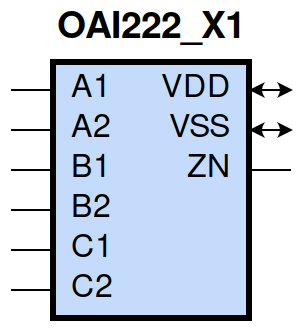
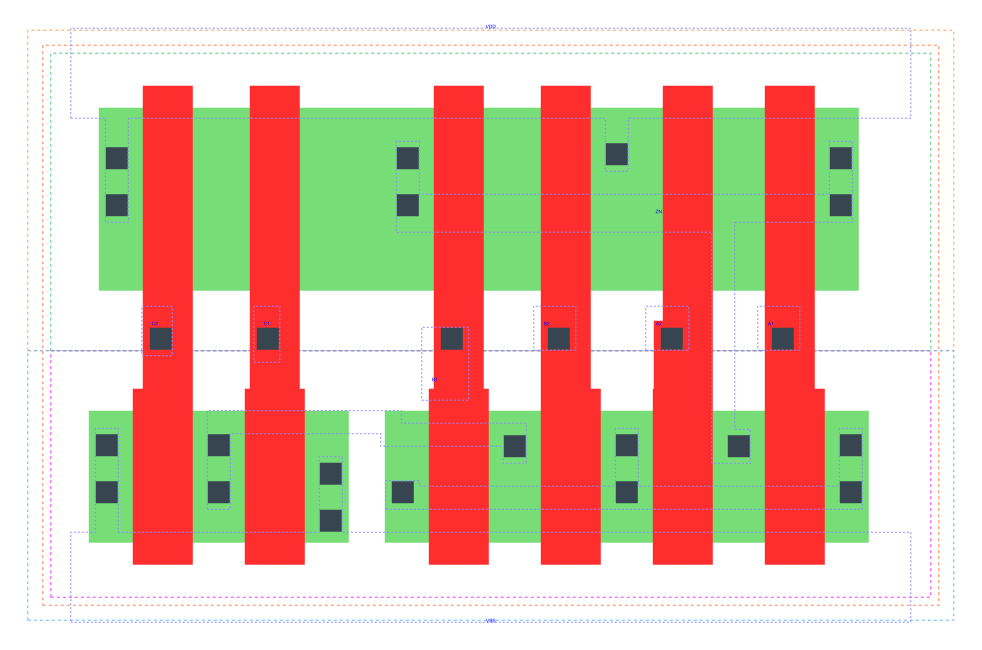

====================================
gf180mcu_fd_sc_mcu9t5v0__oai222_x1
====================================

**gf180mcu_fd_sc_mcu9t5v0__oai222_x1 symbol**

**gf180mcu_fd_sc_mcu9t5v0__oai222_x1 schematic**

.. image:: sc9_sch/OAI222_X1_sch.png
    :height: 250px
    :width: 450 px
    :align: center
    :alt: gf180mcu_fd_sc_mcu9t5v0__oai222_x1 schematic

**gf180mcu_fd_sc_mcu9t5v0__oai222_x1 layout**

.. include:: images.rst
| OAI222_X1 is a three 2-input OR into 3-input NAND with 1X drive strength

|
| Attributes

============= ======================
**Attribute** **Value**
area          42.336000 µm\ :sup:`2`
============= ======================

|
| OUTPUT FUNCTIONS

============== ===========================================
**Output Pin** **Function**
ZN             (((!A1)&(!A2))|((!B1)&(!B2))|((!C1)&(!C2)))
============== ===========================================

|
| TRUTH TABLE FOR ZN

====== ====== ====== ====== ====== ====== ======
**A1** **A2** **B1** **B2** **C1** **C2** **ZN**
0      0      ?      ?      ?      ?      1
?      ?      0      0      ?      ?      1
?      ?      ?      ?      0      0      1
1      ?      1      ?      1      ?      0
1      ?      1      ?      ?      1      0
1      ?      ?      1      1      ?      0
1      ?      ?      1      ?      1      0
?      1      1      ?      1      ?      0
?      1      1      ?      ?      1      0
?      1      ?      1      1      ?      0
?      1      ?      1      ?      1      0
====== ====== ====== ====== ====== ====== ======

|
| FUNCTIONAL SCHEMATIC

| |image545|

| PIN CAPACITANCE (pf)

======= ======== ====================
**Pin** **Type** **Capacitance (pf)**
C2      input    0.0065
C1      input    0.0066
B1      input    0.0068
B2      input    0.0065
A2      input    0.0067
A1      input    0.0068
======= ======== ====================

|
| DELAY AND OUTPUT TRANSITION TIME corresponding to min slew and load

+---------------+------------+--------------------+--------------+-------------------+----------------+---------------+
| **Input Pin** | **Output** | **When Condition** | **Tin (ns)** | **Out Load (pf)** | **Delay (ns)** | **Tout (ns)** |
+---------------+------------+--------------------+--------------+-------------------+----------------+---------------+
| C2(LH)        | ZN(HL)     | !A1&A2&!B1&B2&!C1  | 0.0100       | 0.0010            | 0.2524         | 0.1309        |
+---------------+------------+--------------------+--------------+-------------------+----------------+---------------+
| C2(LH)        | ZN(HL)     | !A1&A2&B1&!B2&!C1  | 0.0100       | 0.0010            | 0.2188         | 0.1097        |
+---------------+------------+--------------------+--------------+-------------------+----------------+---------------+
| C2(LH)        | ZN(HL)     | !A1&A2&B1&B2&!C1   | 0.0100       | 0.0010            | 0.1966         | 0.0920        |
+---------------+------------+--------------------+--------------+-------------------+----------------+---------------+
| C2(LH)        | ZN(HL)     | A1&!A2&!B1&B2&!C1  | 0.0100       | 0.0010            | 0.2192         | 0.1100        |
+---------------+------------+--------------------+--------------+-------------------+----------------+---------------+
| C2(LH)        | ZN(HL)     | A1&!A2&B1&!B2&!C1  | 0.0100       | 0.0010            | 0.1866         | 0.0892        |
+---------------+------------+--------------------+--------------+-------------------+----------------+---------------+
| C2(LH)        | ZN(HL)     | A1&!A2&B1&B2&!C1   | 0.0100       | 0.0010            | 0.1691         | 0.0750        |
+---------------+------------+--------------------+--------------+-------------------+----------------+---------------+
| C2(LH)        | ZN(HL)     | A1&A2&!B1&B2&!C1   | 0.0100       | 0.0010            | 0.1917         | 0.1085        |
+---------------+------------+--------------------+--------------+-------------------+----------------+---------------+
| C2(LH)        | ZN(HL)     | A1&A2&B1&!B2&!C1   | 0.0100       | 0.0010            | 0.1647         | 0.0904        |
+---------------+------------+--------------------+--------------+-------------------+----------------+---------------+
| C2(LH)        | ZN(HL)     | A1&A2&B1&B2&!C1    | 0.0100       | 0.0010            | 0.1426         | 0.0722        |
+---------------+------------+--------------------+--------------+-------------------+----------------+---------------+
| C2(HL)        | ZN(LH)     | !A1&A2&!B1&B2&!C1  | 0.0100       | 0.0010            | 0.3243         | 0.3063        |
+---------------+------------+--------------------+--------------+-------------------+----------------+---------------+
| C2(HL)        | ZN(LH)     | !A1&A2&B1&!B2&!C1  | 0.0100       | 0.0010            | 0.3075         | 0.2603        |
+---------------+------------+--------------------+--------------+-------------------+----------------+---------------+
| C2(HL)        | ZN(LH)     | !A1&A2&B1&B2&!C1   | 0.0100       | 0.0010            | 0.3268         | 0.2749        |
+---------------+------------+--------------------+--------------+-------------------+----------------+---------------+
| C2(HL)        | ZN(LH)     | A1&!A2&!B1&B2&!C1  | 0.0100       | 0.0010            | 0.3076         | 0.2612        |
+---------------+------------+--------------------+--------------+-------------------+----------------+---------------+
| C2(HL)        | ZN(LH)     | A1&!A2&B1&!B2&!C1  | 0.0100       | 0.0010            | 0.2921         | 0.2140        |
+---------------+------------+--------------------+--------------+-------------------+----------------+---------------+
| C2(HL)        | ZN(LH)     | A1&!A2&B1&B2&!C1   | 0.0100       | 0.0010            | 0.3109         | 0.2281        |
+---------------+------------+--------------------+--------------+-------------------+----------------+---------------+
| C2(HL)        | ZN(LH)     | A1&A2&!B1&B2&!C1   | 0.0100       | 0.0010            | 0.3371         | 0.2798        |
+---------------+------------+--------------------+--------------+-------------------+----------------+---------------+
| C2(HL)        | ZN(LH)     | A1&A2&B1&!B2&!C1   | 0.0100       | 0.0010            | 0.3231         | 0.2346        |
+---------------+------------+--------------------+--------------+-------------------+----------------+---------------+
| C2(HL)        | ZN(LH)     | A1&A2&B1&B2&!C1    | 0.0100       | 0.0010            | 0.3438         | 0.2496        |
+---------------+------------+--------------------+--------------+-------------------+----------------+---------------+
| C1(LH)        | ZN(HL)     | !A1&A2&!B1&B2&!C2  | 0.0100       | 0.0010            | 0.2221         | 0.1096        |
+---------------+------------+--------------------+--------------+-------------------+----------------+---------------+
| C1(LH)        | ZN(HL)     | !A1&A2&B1&!B2&!C2  | 0.0100       | 0.0010            | 0.1894         | 0.0886        |
+---------------+------------+--------------------+--------------+-------------------+----------------+---------------+
| C1(LH)        | ZN(HL)     | !A1&A2&B1&B2&!C2   | 0.0100       | 0.0010            | 0.1716         | 0.0744        |
+---------------+------------+--------------------+--------------+-------------------+----------------+---------------+
| C1(LH)        | ZN(HL)     | A1&!A2&!B1&B2&!C2  | 0.0100       | 0.0010            | 0.1898         | 0.0890        |
+---------------+------------+--------------------+--------------+-------------------+----------------+---------------+
| C1(LH)        | ZN(HL)     | A1&!A2&B1&!B2&!C2  | 0.0100       | 0.0010            | 0.1586         | 0.0678        |
+---------------+------------+--------------------+--------------+-------------------+----------------+---------------+
| C1(LH)        | ZN(HL)     | A1&!A2&B1&B2&!C2   | 0.0100       | 0.0010            | 0.1455         | 0.0576        |
+---------------+------------+--------------------+--------------+-------------------+----------------+---------------+
| C1(LH)        | ZN(HL)     | A1&A2&!B1&B2&!C2   | 0.0100       | 0.0010            | 0.1674         | 0.0904        |
+---------------+------------+--------------------+--------------+-------------------+----------------+---------------+
| C1(LH)        | ZN(HL)     | A1&A2&B1&!B2&!C2   | 0.0100       | 0.0010            | 0.1418         | 0.0722        |
+---------------+------------+--------------------+--------------+-------------------+----------------+---------------+
| C1(LH)        | ZN(HL)     | A1&A2&B1&B2&!C2    | 0.0100       | 0.0010            | 0.1247         | 0.0579        |
+---------------+------------+--------------------+--------------+-------------------+----------------+---------------+
| C1(HL)        | ZN(LH)     | !A1&A2&!B1&B2&!C2  | 0.0100       | 0.0010            | 0.3005         | 0.3066        |
+---------------+------------+--------------------+--------------+-------------------+----------------+---------------+
| C1(HL)        | ZN(LH)     | !A1&A2&B1&!B2&!C2  | 0.0100       | 0.0010            | 0.2837         | 0.2603        |
+---------------+------------+--------------------+--------------+-------------------+----------------+---------------+
| C1(HL)        | ZN(LH)     | !A1&A2&B1&B2&!C2   | 0.0100       | 0.0010            | 0.3030         | 0.2750        |
+---------------+------------+--------------------+--------------+-------------------+----------------+---------------+
| C1(HL)        | ZN(LH)     | A1&!A2&!B1&B2&!C2  | 0.0100       | 0.0010            | 0.2839         | 0.2612        |
+---------------+------------+--------------------+--------------+-------------------+----------------+---------------+
| C1(HL)        | ZN(LH)     | A1&!A2&B1&!B2&!C2  | 0.0100       | 0.0010            | 0.2684         | 0.2144        |
+---------------+------------+--------------------+--------------+-------------------+----------------+---------------+
| C1(HL)        | ZN(LH)     | A1&!A2&B1&B2&!C2   | 0.0100       | 0.0010            | 0.2871         | 0.2285        |
+---------------+------------+--------------------+--------------+-------------------+----------------+---------------+
| C1(HL)        | ZN(LH)     | A1&A2&!B1&B2&!C2   | 0.0100       | 0.0010            | 0.3133         | 0.2798        |
+---------------+------------+--------------------+--------------+-------------------+----------------+---------------+
| C1(HL)        | ZN(LH)     | A1&A2&B1&!B2&!C2   | 0.0100       | 0.0010            | 0.2993         | 0.2347        |
+---------------+------------+--------------------+--------------+-------------------+----------------+---------------+
| C1(HL)        | ZN(LH)     | A1&A2&B1&B2&!C2    | 0.0100       | 0.0010            | 0.3199         | 0.2498        |
+---------------+------------+--------------------+--------------+-------------------+----------------+---------------+
| B1(LH)        | ZN(HL)     | !A1&A2&!B2&!C1&C2  | 0.0100       | 0.0010            | 0.1980         | 0.1096        |
+---------------+------------+--------------------+--------------+-------------------+----------------+---------------+
| B1(LH)        | ZN(HL)     | !A1&A2&!B2&C1&!C2  | 0.0100       | 0.0010            | 0.1652         | 0.0889        |
+---------------+------------+--------------------+--------------+-------------------+----------------+---------------+
| B1(LH)        | ZN(HL)     | !A1&A2&!B2&C1&C2   | 0.0100       | 0.0010            | 0.1439         | 0.0732        |
+---------------+------------+--------------------+--------------+-------------------+----------------+---------------+
| B1(LH)        | ZN(HL)     | A1&!A2&!B2&!C1&C2  | 0.0100       | 0.0010            | 0.1657         | 0.0889        |
+---------------+------------+--------------------+--------------+-------------------+----------------+---------------+
| B1(LH)        | ZN(HL)     | A1&!A2&!B2&C1&!C2  | 0.0100       | 0.0010            | 0.1344         | 0.0677        |
+---------------+------------+--------------------+--------------+-------------------+----------------+---------------+
| B1(LH)        | ZN(HL)     | A1&!A2&!B2&C1&C2   | 0.0100       | 0.0010            | 0.1180         | 0.0554        |
+---------------+------------+--------------------+--------------+-------------------+----------------+---------------+
| B1(LH)        | ZN(HL)     | A1&A2&!B2&!C1&C2   | 0.0100       | 0.0010            | 0.1431         | 0.0905        |
+---------------+------------+--------------------+--------------+-------------------+----------------+---------------+
| B1(LH)        | ZN(HL)     | A1&A2&!B2&C1&!C2   | 0.0100       | 0.0010            | 0.1175         | 0.0719        |
+---------------+------------+--------------------+--------------+-------------------+----------------+---------------+
| B1(LH)        | ZN(HL)     | A1&A2&!B2&C1&C2    | 0.0100       | 0.0010            | 0.1014         | 0.0550        |
+---------------+------------+--------------------+--------------+-------------------+----------------+---------------+
| B1(HL)        | ZN(LH)     | !A1&A2&!B2&!C1&C2  | 0.0100       | 0.0010            | 0.2397         | 0.2520        |
+---------------+------------+--------------------+--------------+-------------------+----------------+---------------+
| B1(HL)        | ZN(LH)     | !A1&A2&!B2&C1&!C2  | 0.0100       | 0.0010            | 0.2262         | 0.2084        |
+---------------+------------+--------------------+--------------+-------------------+----------------+---------------+
| B1(HL)        | ZN(LH)     | !A1&A2&!B2&C1&C2   | 0.0100       | 0.0010            | 0.2247         | 0.2085        |
+---------------+------------+--------------------+--------------+-------------------+----------------+---------------+
| B1(HL)        | ZN(LH)     | A1&!A2&!B2&!C1&C2  | 0.0100       | 0.0010            | 0.2262         | 0.2092        |
+---------------+------------+--------------------+--------------+-------------------+----------------+---------------+
| B1(HL)        | ZN(LH)     | A1&!A2&!B2&C1&!C2  | 0.0100       | 0.0010            | 0.2142         | 0.1659        |
+---------------+------------+--------------------+--------------+-------------------+----------------+---------------+
| B1(HL)        | ZN(LH)     | A1&!A2&!B2&C1&C2   | 0.0100       | 0.0010            | 0.2127         | 0.1659        |
+---------------+------------+--------------------+--------------+-------------------+----------------+---------------+
| B1(HL)        | ZN(LH)     | A1&A2&!B2&!C1&C2   | 0.0100       | 0.0010            | 0.2509         | 0.2271        |
+---------------+------------+--------------------+--------------+-------------------+----------------+---------------+
| B1(HL)        | ZN(LH)     | A1&A2&!B2&C1&!C2   | 0.0100       | 0.0010            | 0.2394         | 0.1845        |
+---------------+------------+--------------------+--------------+-------------------+----------------+---------------+
| B1(HL)        | ZN(LH)     | A1&A2&!B2&C1&C2    | 0.0100       | 0.0010            | 0.2378         | 0.1843        |
+---------------+------------+--------------------+--------------+-------------------+----------------+---------------+
| B2(HL)        | ZN(LH)     | !A1&A2&!B1&!C1&C2  | 0.0100       | 0.0010            | 0.2638         | 0.2520        |
+---------------+------------+--------------------+--------------+-------------------+----------------+---------------+
| B2(HL)        | ZN(LH)     | !A1&A2&!B1&C1&!C2  | 0.0100       | 0.0010            | 0.2501         | 0.2084        |
+---------------+------------+--------------------+--------------+-------------------+----------------+---------------+
| B2(HL)        | ZN(LH)     | !A1&A2&!B1&C1&C2   | 0.0100       | 0.0010            | 0.2487         | 0.2084        |
+---------------+------------+--------------------+--------------+-------------------+----------------+---------------+
| B2(HL)        | ZN(LH)     | A1&!A2&!B1&!C1&C2  | 0.0100       | 0.0010            | 0.2502         | 0.2092        |
+---------------+------------+--------------------+--------------+-------------------+----------------+---------------+
| B2(HL)        | ZN(LH)     | A1&!A2&!B1&C1&!C2  | 0.0100       | 0.0010            | 0.2383         | 0.1658        |
+---------------+------------+--------------------+--------------+-------------------+----------------+---------------+
| B2(HL)        | ZN(LH)     | A1&!A2&!B1&C1&C2   | 0.0100       | 0.0010            | 0.2370         | 0.1658        |
+---------------+------------+--------------------+--------------+-------------------+----------------+---------------+
| B2(HL)        | ZN(LH)     | A1&A2&!B1&!C1&C2   | 0.0100       | 0.0010            | 0.2750         | 0.2271        |
+---------------+------------+--------------------+--------------+-------------------+----------------+---------------+
| B2(HL)        | ZN(LH)     | A1&A2&!B1&C1&!C2   | 0.0100       | 0.0010            | 0.2633         | 0.1845        |
+---------------+------------+--------------------+--------------+-------------------+----------------+---------------+
| B2(HL)        | ZN(LH)     | A1&A2&!B1&C1&C2    | 0.0100       | 0.0010            | 0.2618         | 0.1844        |
+---------------+------------+--------------------+--------------+-------------------+----------------+---------------+
| B2(LH)        | ZN(HL)     | !A1&A2&!B1&!C1&C2  | 0.0100       | 0.0010            | 0.2282         | 0.1309        |
+---------------+------------+--------------------+--------------+-------------------+----------------+---------------+
| B2(LH)        | ZN(HL)     | !A1&A2&!B1&C1&!C2  | 0.0100       | 0.0010            | 0.1944         | 0.1095        |
+---------------+------------+--------------------+--------------+-------------------+----------------+---------------+
| B2(LH)        | ZN(HL)     | !A1&A2&!B1&C1&C2   | 0.0100       | 0.0010            | 0.1688         | 0.0910        |
+---------------+------------+--------------------+--------------+-------------------+----------------+---------------+
| B2(LH)        | ZN(HL)     | A1&!A2&!B1&!C1&C2  | 0.0100       | 0.0010            | 0.1950         | 0.1102        |
+---------------+------------+--------------------+--------------+-------------------+----------------+---------------+
| B2(LH)        | ZN(HL)     | A1&!A2&!B1&C1&!C2  | 0.0100       | 0.0010            | 0.1624         | 0.0893        |
+---------------+------------+--------------------+--------------+-------------------+----------------+---------------+
| B2(LH)        | ZN(HL)     | A1&!A2&!B1&C1&C2   | 0.0100       | 0.0010            | 0.1413         | 0.0731        |
+---------------+------------+--------------------+--------------+-------------------+----------------+---------------+
| B2(LH)        | ZN(HL)     | A1&A2&!B1&!C1&C2   | 0.0100       | 0.0010            | 0.1675         | 0.1084        |
+---------------+------------+--------------------+--------------+-------------------+----------------+---------------+
| B2(LH)        | ZN(HL)     | A1&A2&!B1&C1&!C2   | 0.0100       | 0.0010            | 0.1403         | 0.0903        |
+---------------+------------+--------------------+--------------+-------------------+----------------+---------------+
| B2(LH)        | ZN(HL)     | A1&A2&!B1&C1&C2    | 0.0100       | 0.0010            | 0.1193         | 0.0697        |
+---------------+------------+--------------------+--------------+-------------------+----------------+---------------+
| A2(HL)        | ZN(LH)     | !A1&!B1&B2&!C1&C2  | 0.0100       | 0.0010            | 0.1727         | 0.1829        |
+---------------+------------+--------------------+--------------+-------------------+----------------+---------------+
| A2(HL)        | ZN(LH)     | !A1&!B1&B2&C1&!C2  | 0.0100       | 0.0010            | 0.1622         | 0.1406        |
+---------------+------------+--------------------+--------------+-------------------+----------------+---------------+
| A2(HL)        | ZN(LH)     | !A1&!B1&B2&C1&C2   | 0.0100       | 0.0010            | 0.1620         | 0.1406        |
+---------------+------------+--------------------+--------------+-------------------+----------------+---------------+
| A2(HL)        | ZN(LH)     | !A1&B1&!B2&!C1&C2  | 0.0100       | 0.0010            | 0.1620         | 0.1403        |
+---------------+------------+--------------------+--------------+-------------------+----------------+---------------+
| A2(HL)        | ZN(LH)     | !A1&B1&!B2&C1&!C2  | 0.0100       | 0.0010            | 0.1531         | 0.1007        |
+---------------+------------+--------------------+--------------+-------------------+----------------+---------------+
| A2(HL)        | ZN(LH)     | !A1&B1&!B2&C1&C2   | 0.0100       | 0.0010            | 0.1530         | 0.1007        |
+---------------+------------+--------------------+--------------+-------------------+----------------+---------------+
| A2(HL)        | ZN(LH)     | !A1&B1&B2&!C1&C2   | 0.0100       | 0.0010            | 0.1614         | 0.1405        |
+---------------+------------+--------------------+--------------+-------------------+----------------+---------------+
| A2(HL)        | ZN(LH)     | !A1&B1&B2&C1&!C2   | 0.0100       | 0.0010            | 0.1523         | 0.1006        |
+---------------+------------+--------------------+--------------+-------------------+----------------+---------------+
| A2(HL)        | ZN(LH)     | !A1&B1&B2&C1&C2    | 0.0100       | 0.0010            | 0.1521         | 0.1007        |
+---------------+------------+--------------------+--------------+-------------------+----------------+---------------+
| A2(LH)        | ZN(HL)     | !A1&!B1&B2&!C1&C2  | 0.0100       | 0.0010            | 0.1764         | 0.1307        |
+---------------+------------+--------------------+--------------+-------------------+----------------+---------------+
| A2(LH)        | ZN(HL)     | !A1&!B1&B2&C1&!C2  | 0.0100       | 0.0010            | 0.1428         | 0.1091        |
+---------------+------------+--------------------+--------------+-------------------+----------------+---------------+
| A2(LH)        | ZN(HL)     | !A1&!B1&B2&C1&C2   | 0.0100       | 0.0010            | 0.1289         | 0.0909        |
+---------------+------------+--------------------+--------------+-------------------+----------------+---------------+
| A2(LH)        | ZN(HL)     | !A1&B1&!B2&!C1&C2  | 0.0100       | 0.0010            | 0.1429         | 0.1091        |
+---------------+------------+--------------------+--------------+-------------------+----------------+---------------+
| A2(LH)        | ZN(HL)     | !A1&B1&!B2&C1&!C2  | 0.0100       | 0.0010            | 0.1103         | 0.0871        |
+---------------+------------+--------------------+--------------+-------------------+----------------+---------------+
| A2(LH)        | ZN(HL)     | !A1&B1&!B2&C1&C2   | 0.0100       | 0.0010            | 0.1011         | 0.0726        |
+---------------+------------+--------------------+--------------+-------------------+----------------+---------------+
| A2(LH)        | ZN(HL)     | !A1&B1&B2&!C1&C2   | 0.0100       | 0.0010            | 0.1234         | 0.0905        |
+---------------+------------+--------------------+--------------+-------------------+----------------+---------------+
| A2(LH)        | ZN(HL)     | !A1&B1&B2&C1&!C2   | 0.0100       | 0.0010            | 0.0958         | 0.0720        |
+---------------+------------+--------------------+--------------+-------------------+----------------+---------------+
| A2(LH)        | ZN(HL)     | !A1&B1&B2&C1&C2    | 0.0100       | 0.0010            | 0.0870         | 0.0583        |
+---------------+------------+--------------------+--------------+-------------------+----------------+---------------+
| A1(HL)        | ZN(LH)     | !A2&!B1&B2&!C1&C2  | 0.0100       | 0.0010            | 0.1492         | 0.1828        |
+---------------+------------+--------------------+--------------+-------------------+----------------+---------------+
| A1(HL)        | ZN(LH)     | !A2&!B1&B2&C1&!C2  | 0.0100       | 0.0010            | 0.1386         | 0.1401        |
+---------------+------------+--------------------+--------------+-------------------+----------------+---------------+
| A1(HL)        | ZN(LH)     | !A2&!B1&B2&C1&C2   | 0.0100       | 0.0010            | 0.1386         | 0.1404        |
+---------------+------------+--------------------+--------------+-------------------+----------------+---------------+
| A1(HL)        | ZN(LH)     | !A2&B1&!B2&!C1&C2  | 0.0100       | 0.0010            | 0.1388         | 0.1401        |
+---------------+------------+--------------------+--------------+-------------------+----------------+---------------+
| A1(HL)        | ZN(LH)     | !A2&B1&!B2&C1&!C2  | 0.0100       | 0.0010            | 0.1297         | 0.1004        |
+---------------+------------+--------------------+--------------+-------------------+----------------+---------------+
| A1(HL)        | ZN(LH)     | !A2&B1&!B2&C1&C2   | 0.0100       | 0.0010            | 0.1296         | 0.1005        |
+---------------+------------+--------------------+--------------+-------------------+----------------+---------------+
| A1(HL)        | ZN(LH)     | !A2&B1&B2&!C1&C2   | 0.0100       | 0.0010            | 0.1377         | 0.1402        |
+---------------+------------+--------------------+--------------+-------------------+----------------+---------------+
| A1(HL)        | ZN(LH)     | !A2&B1&B2&C1&!C2   | 0.0100       | 0.0010            | 0.1288         | 0.1005        |
+---------------+------------+--------------------+--------------+-------------------+----------------+---------------+
| A1(HL)        | ZN(LH)     | !A2&B1&B2&C1&C2    | 0.0100       | 0.0010            | 0.1285         | 0.1005        |
+---------------+------------+--------------------+--------------+-------------------+----------------+---------------+
| A1(LH)        | ZN(HL)     | !A2&!B1&B2&!C1&C2  | 0.0100       | 0.0010            | 0.1469         | 0.1095        |
+---------------+------------+--------------------+--------------+-------------------+----------------+---------------+
| A1(LH)        | ZN(HL)     | !A2&!B1&B2&C1&!C2  | 0.0100       | 0.0010            | 0.1140         | 0.0875        |
+---------------+------------+--------------------+--------------+-------------------+----------------+---------------+
| A1(LH)        | ZN(HL)     | !A2&!B1&B2&C1&C2   | 0.0100       | 0.0010            | 0.1044         | 0.0730        |
+---------------+------------+--------------------+--------------+-------------------+----------------+---------------+
| A1(LH)        | ZN(HL)     | !A2&B1&!B2&!C1&C2  | 0.0100       | 0.0010            | 0.1140         | 0.0875        |
+---------------+------------+--------------------+--------------+-------------------+----------------+---------------+
| A1(LH)        | ZN(HL)     | !A2&B1&!B2&C1&!C2  | 0.0100       | 0.0010            | 0.0838         | 0.0644        |
+---------------+------------+--------------------+--------------+-------------------+----------------+---------------+
| A1(LH)        | ZN(HL)     | !A2&B1&!B2&C1&C2   | 0.0100       | 0.0010            | 0.0785         | 0.0544        |
+---------------+------------+--------------------+--------------+-------------------+----------------+---------------+
| A1(LH)        | ZN(HL)     | !A2&B1&B2&!C1&C2   | 0.0100       | 0.0010            | 0.0991         | 0.0720        |
+---------------+------------+--------------------+--------------+-------------------+----------------+---------------+
| A1(LH)        | ZN(HL)     | !A2&B1&B2&C1&!C2   | 0.0100       | 0.0010            | 0.0740         | 0.0524        |
+---------------+------------+--------------------+--------------+-------------------+----------------+---------------+
| A1(LH)        | ZN(HL)     | !A2&B1&B2&C1&C2    | 0.0100       | 0.0010            | 0.0689         | 0.0434        |
+---------------+------------+--------------------+--------------+-------------------+----------------+---------------+

|
| DYNAMIC ENERGY

+---------------+---------------------+--------------+------------+-------------------+---------------------+
| **Input Pin** | **When Condition**  | **Tin (ns)** | **Output** | **Out Load (pf)** | **Energy (uW/MHz)** |
+---------------+---------------------+--------------+------------+-------------------+---------------------+
| A1            | !A2&!B1&B2&!C1&C2   | 0.0100       | ZN(LH)     | 0.0010            | 0.2818              |
+---------------+---------------------+--------------+------------+-------------------+---------------------+
| A1            | !A2&!B1&B2&C1&!C2   | 0.0100       | ZN(LH)     | 0.0010            | 0.2375              |
+---------------+---------------------+--------------+------------+-------------------+---------------------+
| A1            | !A2&!B1&B2&C1&C2    | 0.0100       | ZN(LH)     | 0.0010            | 0.2374              |
+---------------+---------------------+--------------+------------+-------------------+---------------------+
| A1            | !A2&B1&!B2&!C1&C2   | 0.0100       | ZN(LH)     | 0.0010            | 0.2373              |
+---------------+---------------------+--------------+------------+-------------------+---------------------+
| A1            | !A2&B1&!B2&C1&!C2   | 0.0100       | ZN(LH)     | 0.0010            | 0.1930              |
+---------------+---------------------+--------------+------------+-------------------+---------------------+
| A1            | !A2&B1&!B2&C1&C2    | 0.0100       | ZN(LH)     | 0.0010            | 0.1929              |
+---------------+---------------------+--------------+------------+-------------------+---------------------+
| A1            | !A2&B1&B2&!C1&C2    | 0.0100       | ZN(LH)     | 0.0010            | 0.2362              |
+---------------+---------------------+--------------+------------+-------------------+---------------------+
| A1            | !A2&B1&B2&C1&!C2    | 0.0100       | ZN(LH)     | 0.0010            | 0.1919              |
+---------------+---------------------+--------------+------------+-------------------+---------------------+
| A1            | !A2&B1&B2&C1&C2     | 0.0100       | ZN(LH)     | 0.0010            | 0.1917              |
+---------------+---------------------+--------------+------------+-------------------+---------------------+
| B2            | !A1&A2&!B1&!C1&C2   | 0.0100       | ZN(LH)     | 0.0010            | 0.4757              |
+---------------+---------------------+--------------+------------+-------------------+---------------------+
| B2            | !A1&A2&!B1&C1&!C2   | 0.0100       | ZN(LH)     | 0.0010            | 0.4313              |
+---------------+---------------------+--------------+------------+-------------------+---------------------+
| B2            | !A1&A2&!B1&C1&C2    | 0.0100       | ZN(LH)     | 0.0010            | 0.4296              |
+---------------+---------------------+--------------+------------+-------------------+---------------------+
| B2            | A1&!A2&!B1&!C1&C2   | 0.0100       | ZN(LH)     | 0.0010            | 0.4315              |
+---------------+---------------------+--------------+------------+-------------------+---------------------+
| B2            | A1&!A2&!B1&C1&!C2   | 0.0100       | ZN(LH)     | 0.0010            | 0.3874              |
+---------------+---------------------+--------------+------------+-------------------+---------------------+
| B2            | A1&!A2&!B1&C1&C2    | 0.0100       | ZN(LH)     | 0.0010            | 0.3856              |
+---------------+---------------------+--------------+------------+-------------------+---------------------+
| B2            | A1&A2&!B1&!C1&C2    | 0.0100       | ZN(LH)     | 0.0010            | 0.4678              |
+---------------+---------------------+--------------+------------+-------------------+---------------------+
| B2            | A1&A2&!B1&C1&!C2    | 0.0100       | ZN(LH)     | 0.0010            | 0.4235              |
+---------------+---------------------+--------------+------------+-------------------+---------------------+
| B2            | A1&A2&!B1&C1&C2     | 0.0100       | ZN(LH)     | 0.0010            | 0.4217              |
+---------------+---------------------+--------------+------------+-------------------+---------------------+
| B1            | !A1&A2&!B2&!C1&C2   | 0.0100       | ZN(HL)     | 0.0010            | 0.1375              |
+---------------+---------------------+--------------+------------+-------------------+---------------------+
| B1            | !A1&A2&!B2&C1&!C2   | 0.0100       | ZN(HL)     | 0.0010            | 0.1004              |
+---------------+---------------------+--------------+------------+-------------------+---------------------+
| B1            | !A1&A2&!B2&C1&C2    | 0.0100       | ZN(HL)     | 0.0010            | 0.1004              |
+---------------+---------------------+--------------+------------+-------------------+---------------------+
| B1            | A1&!A2&!B2&!C1&C2   | 0.0100       | ZN(HL)     | 0.0010            | 0.1015              |
+---------------+---------------------+--------------+------------+-------------------+---------------------+
| B1            | A1&!A2&!B2&C1&!C2   | 0.0100       | ZN(HL)     | 0.0010            | 0.0642              |
+---------------+---------------------+--------------+------------+-------------------+---------------------+
| B1            | A1&!A2&!B2&C1&C2    | 0.0100       | ZN(HL)     | 0.0010            | 0.0641              |
+---------------+---------------------+--------------+------------+-------------------+---------------------+
| B1            | A1&A2&!B2&!C1&C2    | 0.0100       | ZN(HL)     | 0.0010            | 0.1017              |
+---------------+---------------------+--------------+------------+-------------------+---------------------+
| B1            | A1&A2&!B2&C1&!C2    | 0.0100       | ZN(HL)     | 0.0010            | 0.0643              |
+---------------+---------------------+--------------+------------+-------------------+---------------------+
| B1            | A1&A2&!B2&C1&C2     | 0.0100       | ZN(HL)     | 0.0010            | 0.0643              |
+---------------+---------------------+--------------+------------+-------------------+---------------------+
| A2            | !A1&!B1&B2&!C1&C2   | 0.0100       | ZN(LH)     | 0.0010            | 0.3264              |
+---------------+---------------------+--------------+------------+-------------------+---------------------+
| A2            | !A1&!B1&B2&C1&!C2   | 0.0100       | ZN(LH)     | 0.0010            | 0.2821              |
+---------------+---------------------+--------------+------------+-------------------+---------------------+
| A2            | !A1&!B1&B2&C1&C2    | 0.0100       | ZN(LH)     | 0.0010            | 0.2820              |
+---------------+---------------------+--------------+------------+-------------------+---------------------+
| A2            | !A1&B1&!B2&!C1&C2   | 0.0100       | ZN(LH)     | 0.0010            | 0.2819              |
+---------------+---------------------+--------------+------------+-------------------+---------------------+
| A2            | !A1&B1&!B2&C1&!C2   | 0.0100       | ZN(LH)     | 0.0010            | 0.2377              |
+---------------+---------------------+--------------+------------+-------------------+---------------------+
| A2            | !A1&B1&!B2&C1&C2    | 0.0100       | ZN(LH)     | 0.0010            | 0.2375              |
+---------------+---------------------+--------------+------------+-------------------+---------------------+
| A2            | !A1&B1&B2&!C1&C2    | 0.0100       | ZN(LH)     | 0.0010            | 0.2809              |
+---------------+---------------------+--------------+------------+-------------------+---------------------+
| A2            | !A1&B1&B2&C1&!C2    | 0.0100       | ZN(LH)     | 0.0010            | 0.2366              |
+---------------+---------------------+--------------+------------+-------------------+---------------------+
| A2            | !A1&B1&B2&C1&C2     | 0.0100       | ZN(LH)     | 0.0010            | 0.2365              |
+---------------+---------------------+--------------+------------+-------------------+---------------------+
| B1            | !A1&A2&!B2&!C1&C2   | 0.0100       | ZN(LH)     | 0.0010            | 0.4309              |
+---------------+---------------------+--------------+------------+-------------------+---------------------+
| B1            | !A1&A2&!B2&C1&!C2   | 0.0100       | ZN(LH)     | 0.0010            | 0.3867              |
+---------------+---------------------+--------------+------------+-------------------+---------------------+
| B1            | !A1&A2&!B2&C1&C2    | 0.0100       | ZN(LH)     | 0.0010            | 0.3849              |
+---------------+---------------------+--------------+------------+-------------------+---------------------+
| B1            | A1&!A2&!B2&!C1&C2   | 0.0100       | ZN(LH)     | 0.0010            | 0.3868              |
+---------------+---------------------+--------------+------------+-------------------+---------------------+
| B1            | A1&!A2&!B2&C1&!C2   | 0.0100       | ZN(LH)     | 0.0010            | 0.3425              |
+---------------+---------------------+--------------+------------+-------------------+---------------------+
| B1            | A1&!A2&!B2&C1&C2    | 0.0100       | ZN(LH)     | 0.0010            | 0.3407              |
+---------------+---------------------+--------------+------------+-------------------+---------------------+
| B1            | A1&A2&!B2&!C1&C2    | 0.0100       | ZN(LH)     | 0.0010            | 0.4229              |
+---------------+---------------------+--------------+------------+-------------------+---------------------+
| B1            | A1&A2&!B2&C1&!C2    | 0.0100       | ZN(LH)     | 0.0010            | 0.3787              |
+---------------+---------------------+--------------+------------+-------------------+---------------------+
| B1            | A1&A2&!B2&C1&C2     | 0.0100       | ZN(LH)     | 0.0010            | 0.3768              |
+---------------+---------------------+--------------+------------+-------------------+---------------------+
| C1            | !A1&A2&!B1&B2&!C2   | 0.0100       | ZN(HL)     | 0.0010            | 0.1378              |
+---------------+---------------------+--------------+------------+-------------------+---------------------+
| C1            | !A1&A2&B1&!B2&!C2   | 0.0100       | ZN(HL)     | 0.0010            | 0.1006              |
+---------------+---------------------+--------------+------------+-------------------+---------------------+
| C1            | !A1&A2&B1&B2&!C2    | 0.0100       | ZN(HL)     | 0.0010            | 0.1006              |
+---------------+---------------------+--------------+------------+-------------------+---------------------+
| C1            | A1&!A2&!B1&B2&!C2   | 0.0100       | ZN(HL)     | 0.0010            | 0.1018              |
+---------------+---------------------+--------------+------------+-------------------+---------------------+
| C1            | A1&!A2&B1&!B2&!C2   | 0.0100       | ZN(HL)     | 0.0010            | 0.0644              |
+---------------+---------------------+--------------+------------+-------------------+---------------------+
| C1            | A1&!A2&B1&B2&!C2    | 0.0100       | ZN(HL)     | 0.0010            | 0.0645              |
+---------------+---------------------+--------------+------------+-------------------+---------------------+
| C1            | A1&A2&!B1&B2&!C2    | 0.0100       | ZN(HL)     | 0.0010            | 0.1018              |
+---------------+---------------------+--------------+------------+-------------------+---------------------+
| C1            | A1&A2&B1&!B2&!C2    | 0.0100       | ZN(HL)     | 0.0010            | 0.0645              |
+---------------+---------------------+--------------+------------+-------------------+---------------------+
| C1            | A1&A2&B1&B2&!C2     | 0.0100       | ZN(HL)     | 0.0010            | 0.0644              |
+---------------+---------------------+--------------+------------+-------------------+---------------------+
| A2            | !A1&!B1&B2&!C1&C2   | 0.0100       | ZN(HL)     | 0.0010            | 0.1693              |
+---------------+---------------------+--------------+------------+-------------------+---------------------+
| A2            | !A1&!B1&B2&C1&!C2   | 0.0100       | ZN(HL)     | 0.0010            | 0.1323              |
+---------------+---------------------+--------------+------------+-------------------+---------------------+
| A2            | !A1&!B1&B2&C1&C2    | 0.0100       | ZN(HL)     | 0.0010            | 0.1324              |
+---------------+---------------------+--------------+------------+-------------------+---------------------+
| A2            | !A1&B1&!B2&!C1&C2   | 0.0100       | ZN(HL)     | 0.0010            | 0.1323              |
+---------------+---------------------+--------------+------------+-------------------+---------------------+
| A2            | !A1&B1&!B2&C1&!C2   | 0.0100       | ZN(HL)     | 0.0010            | 0.0953              |
+---------------+---------------------+--------------+------------+-------------------+---------------------+
| A2            | !A1&B1&!B2&C1&C2    | 0.0100       | ZN(HL)     | 0.0010            | 0.0952              |
+---------------+---------------------+--------------+------------+-------------------+---------------------+
| A2            | !A1&B1&B2&!C1&C2    | 0.0100       | ZN(HL)     | 0.0010            | 0.1324              |
+---------------+---------------------+--------------+------------+-------------------+---------------------+
| A2            | !A1&B1&B2&C1&!C2    | 0.0100       | ZN(HL)     | 0.0010            | 0.0954              |
+---------------+---------------------+--------------+------------+-------------------+---------------------+
| A2            | !A1&B1&B2&C1&C2     | 0.0100       | ZN(HL)     | 0.0010            | 0.0952              |
+---------------+---------------------+--------------+------------+-------------------+---------------------+
| C2            | !A1&A2&!B1&B2&!C1   | 0.0100       | ZN(HL)     | 0.0010            | 0.1689              |
+---------------+---------------------+--------------+------------+-------------------+---------------------+
| C2            | !A1&A2&B1&!B2&!C1   | 0.0100       | ZN(HL)     | 0.0010            | 0.1317              |
+---------------+---------------------+--------------+------------+-------------------+---------------------+
| C2            | !A1&A2&B1&B2&!C1    | 0.0100       | ZN(HL)     | 0.0010            | 0.1318              |
+---------------+---------------------+--------------+------------+-------------------+---------------------+
| C2            | A1&!A2&!B1&B2&!C1   | 0.0100       | ZN(HL)     | 0.0010            | 0.1330              |
+---------------+---------------------+--------------+------------+-------------------+---------------------+
| C2            | A1&!A2&B1&!B2&!C1   | 0.0100       | ZN(HL)     | 0.0010            | 0.0962              |
+---------------+---------------------+--------------+------------+-------------------+---------------------+
| C2            | A1&!A2&B1&B2&!C1    | 0.0100       | ZN(HL)     | 0.0010            | 0.0960              |
+---------------+---------------------+--------------+------------+-------------------+---------------------+
| C2            | A1&A2&!B1&B2&!C1    | 0.0100       | ZN(HL)     | 0.0010            | 0.1331              |
+---------------+---------------------+--------------+------------+-------------------+---------------------+
| C2            | A1&A2&B1&!B2&!C1    | 0.0100       | ZN(HL)     | 0.0010            | 0.0961              |
+---------------+---------------------+--------------+------------+-------------------+---------------------+
| C2            | A1&A2&B1&B2&!C1     | 0.0100       | ZN(HL)     | 0.0010            | 0.0960              |
+---------------+---------------------+--------------+------------+-------------------+---------------------+
| C1            | !A1&A2&!B1&B2&!C2   | 0.0100       | ZN(LH)     | 0.0010            | 0.5444              |
+---------------+---------------------+--------------+------------+-------------------+---------------------+
| C1            | !A1&A2&B1&!B2&!C2   | 0.0100       | ZN(LH)     | 0.0010            | 0.4999              |
+---------------+---------------------+--------------+------------+-------------------+---------------------+
| C1            | !A1&A2&B1&B2&!C2    | 0.0100       | ZN(LH)     | 0.0010            | 0.5348              |
+---------------+---------------------+--------------+------------+-------------------+---------------------+
| C1            | A1&!A2&!B1&B2&!C2   | 0.0100       | ZN(LH)     | 0.0010            | 0.5003              |
+---------------+---------------------+--------------+------------+-------------------+---------------------+
| C1            | A1&!A2&B1&!B2&!C2   | 0.0100       | ZN(LH)     | 0.0010            | 0.4558              |
+---------------+---------------------+--------------+------------+-------------------+---------------------+
| C1            | A1&!A2&B1&B2&!C2    | 0.0100       | ZN(LH)     | 0.0010            | 0.4907              |
+---------------+---------------------+--------------+------------+-------------------+---------------------+
| C1            | A1&A2&!B1&B2&!C2    | 0.0100       | ZN(LH)     | 0.0010            | 0.5358              |
+---------------+---------------------+--------------+------------+-------------------+---------------------+
| C1            | A1&A2&B1&!B2&!C2    | 0.0100       | ZN(LH)     | 0.0010            | 0.4913              |
+---------------+---------------------+--------------+------------+-------------------+---------------------+
| C1            | A1&A2&B1&B2&!C2     | 0.0100       | ZN(LH)     | 0.0010            | 0.5262              |
+---------------+---------------------+--------------+------------+-------------------+---------------------+
| C2            | !A1&A2&!B1&B2&!C1   | 0.0100       | ZN(LH)     | 0.0010            | 0.5888              |
+---------------+---------------------+--------------+------------+-------------------+---------------------+
| C2            | !A1&A2&B1&!B2&!C1   | 0.0100       | ZN(LH)     | 0.0010            | 0.5442              |
+---------------+---------------------+--------------+------------+-------------------+---------------------+
| C2            | !A1&A2&B1&B2&!C1    | 0.0100       | ZN(LH)     | 0.0010            | 0.5792              |
+---------------+---------------------+--------------+------------+-------------------+---------------------+
| C2            | A1&!A2&!B1&B2&!C1   | 0.0100       | ZN(LH)     | 0.0010            | 0.5446              |
+---------------+---------------------+--------------+------------+-------------------+---------------------+
| C2            | A1&!A2&B1&!B2&!C1   | 0.0100       | ZN(LH)     | 0.0010            | 0.5002              |
+---------------+---------------------+--------------+------------+-------------------+---------------------+
| C2            | A1&!A2&B1&B2&!C1    | 0.0100       | ZN(LH)     | 0.0010            | 0.5352              |
+---------------+---------------------+--------------+------------+-------------------+---------------------+
| C2            | A1&A2&!B1&B2&!C1    | 0.0100       | ZN(LH)     | 0.0010            | 0.5801              |
+---------------+---------------------+--------------+------------+-------------------+---------------------+
| C2            | A1&A2&B1&!B2&!C1    | 0.0100       | ZN(LH)     | 0.0010            | 0.5354              |
+---------------+---------------------+--------------+------------+-------------------+---------------------+
| C2            | A1&A2&B1&B2&!C1     | 0.0100       | ZN(LH)     | 0.0010            | 0.5704              |
+---------------+---------------------+--------------+------------+-------------------+---------------------+
| A1            | !A2&!B1&B2&!C1&C2   | 0.0100       | ZN(HL)     | 0.0010            | 0.1395              |
+---------------+---------------------+--------------+------------+-------------------+---------------------+
| A1            | !A2&!B1&B2&C1&!C2   | 0.0100       | ZN(HL)     | 0.0010            | 0.1022              |
+---------------+---------------------+--------------+------------+-------------------+---------------------+
| A1            | !A2&!B1&B2&C1&C2    | 0.0100       | ZN(HL)     | 0.0010            | 0.1023              |
+---------------+---------------------+--------------+------------+-------------------+---------------------+
| A1            | !A2&B1&!B2&!C1&C2   | 0.0100       | ZN(HL)     | 0.0010            | 0.1022              |
+---------------+---------------------+--------------+------------+-------------------+---------------------+
| A1            | !A2&B1&!B2&C1&!C2   | 0.0100       | ZN(HL)     | 0.0010            | 0.0649              |
+---------------+---------------------+--------------+------------+-------------------+---------------------+
| A1            | !A2&B1&!B2&C1&C2    | 0.0100       | ZN(HL)     | 0.0010            | 0.0649              |
+---------------+---------------------+--------------+------------+-------------------+---------------------+
| A1            | !A2&B1&B2&!C1&C2    | 0.0100       | ZN(HL)     | 0.0010            | 0.1022              |
+---------------+---------------------+--------------+------------+-------------------+---------------------+
| A1            | !A2&B1&B2&C1&!C2    | 0.0100       | ZN(HL)     | 0.0010            | 0.0648              |
+---------------+---------------------+--------------+------------+-------------------+---------------------+
| A1            | !A2&B1&B2&C1&C2     | 0.0100       | ZN(HL)     | 0.0010            | 0.0647              |
+---------------+---------------------+--------------+------------+-------------------+---------------------+
| B2            | !A1&A2&!B1&!C1&C2   | 0.0100       | ZN(HL)     | 0.0010            | 0.1688              |
+---------------+---------------------+--------------+------------+-------------------+---------------------+
| B2            | !A1&A2&!B1&C1&!C2   | 0.0100       | ZN(HL)     | 0.0010            | 0.1317              |
+---------------+---------------------+--------------+------------+-------------------+---------------------+
| B2            | !A1&A2&!B1&C1&C2    | 0.0100       | ZN(HL)     | 0.0010            | 0.1318              |
+---------------+---------------------+--------------+------------+-------------------+---------------------+
| B2            | A1&!A2&!B1&!C1&C2   | 0.0100       | ZN(HL)     | 0.0010            | 0.1328              |
+---------------+---------------------+--------------+------------+-------------------+---------------------+
| B2            | A1&!A2&!B1&C1&!C2   | 0.0100       | ZN(HL)     | 0.0010            | 0.0960              |
+---------------+---------------------+--------------+------------+-------------------+---------------------+
| B2            | A1&!A2&!B1&C1&C2    | 0.0100       | ZN(HL)     | 0.0010            | 0.0959              |
+---------------+---------------------+--------------+------------+-------------------+---------------------+
| B2            | A1&A2&!B1&!C1&C2    | 0.0100       | ZN(HL)     | 0.0010            | 0.1329              |
+---------------+---------------------+--------------+------------+-------------------+---------------------+
| B2            | A1&A2&!B1&C1&!C2    | 0.0100       | ZN(HL)     | 0.0010            | 0.0960              |
+---------------+---------------------+--------------+------------+-------------------+---------------------+
| B2            | A1&A2&!B1&C1&C2     | 0.0100       | ZN(HL)     | 0.0010            | 0.0959              |
+---------------+---------------------+--------------+------------+-------------------+---------------------+
| B2(LH)        | !A1&!A2&!B1&!C1&!C2 | 0.0100       | n/a        | n/a               | -0.0595             |
+---------------+---------------------+--------------+------------+-------------------+---------------------+
| B2(LH)        | !A1&!A2&!B1&!C1&C2  | 0.0100       | n/a        | n/a               | -0.0595             |
+---------------+---------------------+--------------+------------+-------------------+---------------------+
| B2(LH)        | !A1&!A2&!B1&C1&!C2  | 0.0100       | n/a        | n/a               | -0.0595             |
+---------------+---------------------+--------------+------------+-------------------+---------------------+
| B2(LH)        | !A1&!A2&!B1&C1&C2   | 0.0100       | n/a        | n/a               | -0.0595             |
+---------------+---------------------+--------------+------------+-------------------+---------------------+
| B2(LH)        | !A1&!A2&B1&!C1&!C2  | 0.0100       | n/a        | n/a               | -0.0577             |
+---------------+---------------------+--------------+------------+-------------------+---------------------+
| B2(LH)        | !A1&!A2&B1&!C1&C2   | 0.0100       | n/a        | n/a               | -0.0576             |
+---------------+---------------------+--------------+------------+-------------------+---------------------+
| B2(LH)        | !A1&!A2&B1&C1&!C2   | 0.0100       | n/a        | n/a               | -0.0576             |
+---------------+---------------------+--------------+------------+-------------------+---------------------+
| B2(LH)        | !A1&!A2&B1&C1&C2    | 0.0100       | n/a        | n/a               | -0.0576             |
+---------------+---------------------+--------------+------------+-------------------+---------------------+
| B2(LH)        | !A1&A2&!B1&!C1&!C2  | 0.0100       | n/a        | n/a               | 0.0040              |
+---------------+---------------------+--------------+------------+-------------------+---------------------+
| B2(LH)        | !A1&A2&B1&!C1&!C2   | 0.0100       | n/a        | n/a               | -0.0576             |
+---------------+---------------------+--------------+------------+-------------------+---------------------+
| B2(LH)        | A1&!A2&!B1&!C1&!C2  | 0.0100       | n/a        | n/a               | 0.0040              |
+---------------+---------------------+--------------+------------+-------------------+---------------------+
| B2(LH)        | A1&!A2&B1&!C1&!C2   | 0.0100       | n/a        | n/a               | -0.0577             |
+---------------+---------------------+--------------+------------+-------------------+---------------------+
| B2(LH)        | A1&A2&!B1&!C1&!C2   | 0.0100       | n/a        | n/a               | 0.0041              |
+---------------+---------------------+--------------+------------+-------------------+---------------------+
| B2(LH)        | A1&A2&B1&!C1&!C2    | 0.0100       | n/a        | n/a               | -0.0576             |
+---------------+---------------------+--------------+------------+-------------------+---------------------+
| B2(LH)        | !A1&A2&B1&!C1&C2    | 0.0100       | n/a        | n/a               | -0.0497             |
+---------------+---------------------+--------------+------------+-------------------+---------------------+
| B2(LH)        | !A1&A2&B1&C1&!C2    | 0.0100       | n/a        | n/a               | -0.0497             |
+---------------+---------------------+--------------+------------+-------------------+---------------------+
| B2(LH)        | !A1&A2&B1&C1&C2     | 0.0100       | n/a        | n/a               | -0.0497             |
+---------------+---------------------+--------------+------------+-------------------+---------------------+
| B2(LH)        | A1&!A2&B1&!C1&C2    | 0.0100       | n/a        | n/a               | -0.0497             |
+---------------+---------------------+--------------+------------+-------------------+---------------------+
| B2(LH)        | A1&!A2&B1&C1&!C2    | 0.0100       | n/a        | n/a               | -0.0497             |
+---------------+---------------------+--------------+------------+-------------------+---------------------+
| B2(LH)        | A1&!A2&B1&C1&C2     | 0.0100       | n/a        | n/a               | -0.0497             |
+---------------+---------------------+--------------+------------+-------------------+---------------------+
| B2(LH)        | A1&A2&B1&!C1&C2     | 0.0100       | n/a        | n/a               | -0.0497             |
+---------------+---------------------+--------------+------------+-------------------+---------------------+
| B2(LH)        | A1&A2&B1&C1&!C2     | 0.0100       | n/a        | n/a               | -0.0497             |
+---------------+---------------------+--------------+------------+-------------------+---------------------+
| B2(LH)        | A1&A2&B1&C1&C2      | 0.0100       | n/a        | n/a               | -0.0497             |
+---------------+---------------------+--------------+------------+-------------------+---------------------+
| C2(HL)        | !A1&!A2&!B1&!B2&!C1 | 0.0100       | n/a        | n/a               | 0.0599              |
+---------------+---------------------+--------------+------------+-------------------+---------------------+
| C2(HL)        | !A1&!A2&!B1&!B2&C1  | 0.0100       | n/a        | n/a               | 0.0597              |
+---------------+---------------------+--------------+------------+-------------------+---------------------+
| C2(HL)        | !A1&!A2&!B1&B2&!C1  | 0.0100       | n/a        | n/a               | 0.0601              |
+---------------+---------------------+--------------+------------+-------------------+---------------------+
| C2(HL)        | !A1&!A2&!B1&B2&C1   | 0.0100       | n/a        | n/a               | 0.0596              |
+---------------+---------------------+--------------+------------+-------------------+---------------------+
| C2(HL)        | !A1&!A2&B1&!B2&!C1  | 0.0100       | n/a        | n/a               | 0.0601              |
+---------------+---------------------+--------------+------------+-------------------+---------------------+
| C2(HL)        | !A1&!A2&B1&!B2&C1   | 0.0100       | n/a        | n/a               | 0.0596              |
+---------------+---------------------+--------------+------------+-------------------+---------------------+
| C2(HL)        | !A1&!A2&B1&B2&!C1   | 0.0100       | n/a        | n/a               | 0.0600              |
+---------------+---------------------+--------------+------------+-------------------+---------------------+
| C2(HL)        | !A1&!A2&B1&B2&C1    | 0.0100       | n/a        | n/a               | 0.0595              |
+---------------+---------------------+--------------+------------+-------------------+---------------------+
| C2(HL)        | !A1&A2&!B1&!B2&!C1  | 0.0100       | n/a        | n/a               | 0.0610              |
+---------------+---------------------+--------------+------------+-------------------+---------------------+
| C2(HL)        | !A1&A2&!B1&!B2&C1   | 0.0100       | n/a        | n/a               | 0.0597              |
+---------------+---------------------+--------------+------------+-------------------+---------------------+
| C2(HL)        | A1&!A2&!B1&!B2&!C1  | 0.0100       | n/a        | n/a               | 0.0610              |
+---------------+---------------------+--------------+------------+-------------------+---------------------+
| C2(HL)        | A1&!A2&!B1&!B2&C1   | 0.0100       | n/a        | n/a               | 0.0597              |
+---------------+---------------------+--------------+------------+-------------------+---------------------+
| C2(HL)        | A1&A2&!B1&!B2&!C1   | 0.0100       | n/a        | n/a               | 0.0609              |
+---------------+---------------------+--------------+------------+-------------------+---------------------+
| C2(HL)        | A1&A2&!B1&!B2&C1    | 0.0100       | n/a        | n/a               | 0.0597              |
+---------------+---------------------+--------------+------------+-------------------+---------------------+
| C2(HL)        | !A1&A2&!B1&B2&C1    | 0.0100       | n/a        | n/a               | 0.0597              |
+---------------+---------------------+--------------+------------+-------------------+---------------------+
| C2(HL)        | !A1&A2&B1&!B2&C1    | 0.0100       | n/a        | n/a               | 0.0597              |
+---------------+---------------------+--------------+------------+-------------------+---------------------+
| C2(HL)        | !A1&A2&B1&B2&C1     | 0.0100       | n/a        | n/a               | 0.0595              |
+---------------+---------------------+--------------+------------+-------------------+---------------------+
| C2(HL)        | A1&!A2&!B1&B2&C1    | 0.0100       | n/a        | n/a               | 0.0597              |
+---------------+---------------------+--------------+------------+-------------------+---------------------+
| C2(HL)        | A1&!A2&B1&!B2&C1    | 0.0100       | n/a        | n/a               | 0.0597              |
+---------------+---------------------+--------------+------------+-------------------+---------------------+
| C2(HL)        | A1&!A2&B1&B2&C1     | 0.0100       | n/a        | n/a               | 0.0595              |
+---------------+---------------------+--------------+------------+-------------------+---------------------+
| C2(HL)        | A1&A2&!B1&B2&C1     | 0.0100       | n/a        | n/a               | 0.0597              |
+---------------+---------------------+--------------+------------+-------------------+---------------------+
| C2(HL)        | A1&A2&B1&!B2&C1     | 0.0100       | n/a        | n/a               | 0.0597              |
+---------------+---------------------+--------------+------------+-------------------+---------------------+
| C2(HL)        | A1&A2&B1&B2&C1      | 0.0100       | n/a        | n/a               | 0.0595              |
+---------------+---------------------+--------------+------------+-------------------+---------------------+
| B2(HL)        | !A1&!A2&!B1&!C1&!C2 | 0.0100       | n/a        | n/a               | 0.0788              |
+---------------+---------------------+--------------+------------+-------------------+---------------------+
| B2(HL)        | !A1&!A2&!B1&!C1&C2  | 0.0100       | n/a        | n/a               | 0.0708              |
+---------------+---------------------+--------------+------------+-------------------+---------------------+
| B2(HL)        | !A1&!A2&!B1&C1&!C2  | 0.0100       | n/a        | n/a               | 0.0708              |
+---------------+---------------------+--------------+------------+-------------------+---------------------+
| B2(HL)        | !A1&!A2&!B1&C1&C2   | 0.0100       | n/a        | n/a               | 0.0694              |
+---------------+---------------------+--------------+------------+-------------------+---------------------+
| B2(HL)        | !A1&!A2&B1&!C1&!C2  | 0.0100       | n/a        | n/a               | 0.0807              |
+---------------+---------------------+--------------+------------+-------------------+---------------------+
| B2(HL)        | !A1&!A2&B1&!C1&C2   | 0.0100       | n/a        | n/a               | 0.0596              |
+---------------+---------------------+--------------+------------+-------------------+---------------------+
| B2(HL)        | !A1&!A2&B1&C1&!C2   | 0.0100       | n/a        | n/a               | 0.0596              |
+---------------+---------------------+--------------+------------+-------------------+---------------------+
| B2(HL)        | !A1&!A2&B1&C1&C2    | 0.0100       | n/a        | n/a               | 0.0596              |
+---------------+---------------------+--------------+------------+-------------------+---------------------+
| B2(HL)        | !A1&A2&!B1&!C1&!C2  | 0.0100       | n/a        | n/a               | 0.0625              |
+---------------+---------------------+--------------+------------+-------------------+---------------------+
| B2(HL)        | !A1&A2&B1&!C1&!C2   | 0.0100       | n/a        | n/a               | 0.0645              |
+---------------+---------------------+--------------+------------+-------------------+---------------------+
| B2(HL)        | A1&!A2&!B1&!C1&!C2  | 0.0100       | n/a        | n/a               | 0.0625              |
+---------------+---------------------+--------------+------------+-------------------+---------------------+
| B2(HL)        | A1&!A2&B1&!C1&!C2   | 0.0100       | n/a        | n/a               | 0.0645              |
+---------------+---------------------+--------------+------------+-------------------+---------------------+
| B2(HL)        | A1&A2&!B1&!C1&!C2   | 0.0100       | n/a        | n/a               | 0.0624              |
+---------------+---------------------+--------------+------------+-------------------+---------------------+
| B2(HL)        | A1&A2&B1&!C1&!C2    | 0.0100       | n/a        | n/a               | 0.0643              |
+---------------+---------------------+--------------+------------+-------------------+---------------------+
| B2(HL)        | !A1&A2&B1&!C1&C2    | 0.0100       | n/a        | n/a               | 0.0596              |
+---------------+---------------------+--------------+------------+-------------------+---------------------+
| B2(HL)        | !A1&A2&B1&C1&!C2    | 0.0100       | n/a        | n/a               | 0.0596              |
+---------------+---------------------+--------------+------------+-------------------+---------------------+
| B2(HL)        | !A1&A2&B1&C1&C2     | 0.0100       | n/a        | n/a               | 0.0595              |
+---------------+---------------------+--------------+------------+-------------------+---------------------+
| B2(HL)        | A1&!A2&B1&!C1&C2    | 0.0100       | n/a        | n/a               | 0.0596              |
+---------------+---------------------+--------------+------------+-------------------+---------------------+
| B2(HL)        | A1&!A2&B1&C1&!C2    | 0.0100       | n/a        | n/a               | 0.0596              |
+---------------+---------------------+--------------+------------+-------------------+---------------------+
| B2(HL)        | A1&!A2&B1&C1&C2     | 0.0100       | n/a        | n/a               | 0.0596              |
+---------------+---------------------+--------------+------------+-------------------+---------------------+
| B2(HL)        | A1&A2&B1&!C1&C2     | 0.0100       | n/a        | n/a               | 0.0595              |
+---------------+---------------------+--------------+------------+-------------------+---------------------+
| B2(HL)        | A1&A2&B1&C1&!C2     | 0.0100       | n/a        | n/a               | 0.0595              |
+---------------+---------------------+--------------+------------+-------------------+---------------------+
| B2(HL)        | A1&A2&B1&C1&C2      | 0.0100       | n/a        | n/a               | 0.0595              |
+---------------+---------------------+--------------+------------+-------------------+---------------------+
| C2(LH)        | !A1&!A2&!B1&!B2&!C1 | 0.0100       | n/a        | n/a               | -0.0596             |
+---------------+---------------------+--------------+------------+-------------------+---------------------+
| C2(LH)        | !A1&!A2&!B1&!B2&C1  | 0.0100       | n/a        | n/a               | -0.0577             |
+---------------+---------------------+--------------+------------+-------------------+---------------------+
| C2(LH)        | !A1&!A2&!B1&B2&!C1  | 0.0100       | n/a        | n/a               | -0.0596             |
+---------------+---------------------+--------------+------------+-------------------+---------------------+
| C2(LH)        | !A1&!A2&!B1&B2&C1   | 0.0100       | n/a        | n/a               | -0.0577             |
+---------------+---------------------+--------------+------------+-------------------+---------------------+
| C2(LH)        | !A1&!A2&B1&!B2&!C1  | 0.0100       | n/a        | n/a               | -0.0596             |
+---------------+---------------------+--------------+------------+-------------------+---------------------+
| C2(LH)        | !A1&!A2&B1&!B2&C1   | 0.0100       | n/a        | n/a               | -0.0577             |
+---------------+---------------------+--------------+------------+-------------------+---------------------+
| C2(LH)        | !A1&!A2&B1&B2&!C1   | 0.0100       | n/a        | n/a               | -0.0595             |
+---------------+---------------------+--------------+------------+-------------------+---------------------+
| C2(LH)        | !A1&!A2&B1&B2&C1    | 0.0100       | n/a        | n/a               | -0.0577             |
+---------------+---------------------+--------------+------------+-------------------+---------------------+
| C2(LH)        | !A1&A2&!B1&!B2&!C1  | 0.0100       | n/a        | n/a               | -0.0596             |
+---------------+---------------------+--------------+------------+-------------------+---------------------+
| C2(LH)        | !A1&A2&!B1&!B2&C1   | 0.0100       | n/a        | n/a               | -0.0577             |
+---------------+---------------------+--------------+------------+-------------------+---------------------+
| C2(LH)        | A1&!A2&!B1&!B2&!C1  | 0.0100       | n/a        | n/a               | -0.0596             |
+---------------+---------------------+--------------+------------+-------------------+---------------------+
| C2(LH)        | A1&!A2&!B1&!B2&C1   | 0.0100       | n/a        | n/a               | -0.0577             |
+---------------+---------------------+--------------+------------+-------------------+---------------------+
| C2(LH)        | A1&A2&!B1&!B2&!C1   | 0.0100       | n/a        | n/a               | -0.0596             |
+---------------+---------------------+--------------+------------+-------------------+---------------------+
| C2(LH)        | A1&A2&!B1&!B2&C1    | 0.0100       | n/a        | n/a               | -0.0577             |
+---------------+---------------------+--------------+------------+-------------------+---------------------+
| C2(LH)        | !A1&A2&!B1&B2&C1    | 0.0100       | n/a        | n/a               | -0.0498             |
+---------------+---------------------+--------------+------------+-------------------+---------------------+
| C2(LH)        | !A1&A2&B1&!B2&C1    | 0.0100       | n/a        | n/a               | -0.0498             |
+---------------+---------------------+--------------+------------+-------------------+---------------------+
| C2(LH)        | !A1&A2&B1&B2&C1     | 0.0100       | n/a        | n/a               | -0.0498             |
+---------------+---------------------+--------------+------------+-------------------+---------------------+
| C2(LH)        | A1&!A2&!B1&B2&C1    | 0.0100       | n/a        | n/a               | -0.0498             |
+---------------+---------------------+--------------+------------+-------------------+---------------------+
| C2(LH)        | A1&!A2&B1&!B2&C1    | 0.0100       | n/a        | n/a               | -0.0498             |
+---------------+---------------------+--------------+------------+-------------------+---------------------+
| C2(LH)        | A1&!A2&B1&B2&C1     | 0.0100       | n/a        | n/a               | -0.0498             |
+---------------+---------------------+--------------+------------+-------------------+---------------------+
| C2(LH)        | A1&A2&!B1&B2&C1     | 0.0100       | n/a        | n/a               | -0.0498             |
+---------------+---------------------+--------------+------------+-------------------+---------------------+
| C2(LH)        | A1&A2&B1&!B2&C1     | 0.0100       | n/a        | n/a               | -0.0498             |
+---------------+---------------------+--------------+------------+-------------------+---------------------+
| C2(LH)        | A1&A2&B1&B2&C1      | 0.0100       | n/a        | n/a               | -0.0498             |
+---------------+---------------------+--------------+------------+-------------------+---------------------+
| A2(LH)        | !A1&!B1&!B2&!C1&!C2 | 0.0100       | n/a        | n/a               | 0.0386              |
+---------------+---------------------+--------------+------------+-------------------+---------------------+
| A2(LH)        | !A1&!B1&!B2&!C1&C2  | 0.0100       | n/a        | n/a               | 0.0387              |
+---------------+---------------------+--------------+------------+-------------------+---------------------+
| A2(LH)        | !A1&!B1&!B2&C1&!C2  | 0.0100       | n/a        | n/a               | 0.0387              |
+---------------+---------------------+--------------+------------+-------------------+---------------------+
| A2(LH)        | !A1&!B1&!B2&C1&C2   | 0.0100       | n/a        | n/a               | 0.0387              |
+---------------+---------------------+--------------+------------+-------------------+---------------------+
| A2(LH)        | !A1&!B1&B2&!C1&!C2  | 0.0100       | n/a        | n/a               | 0.1577              |
+---------------+---------------------+--------------+------------+-------------------+---------------------+
| A2(LH)        | !A1&B1&!B2&!C1&!C2  | 0.0100       | n/a        | n/a               | 0.1576              |
+---------------+---------------------+--------------+------------+-------------------+---------------------+
| A2(LH)        | !A1&B1&B2&!C1&!C2   | 0.0100       | n/a        | n/a               | 0.1914              |
+---------------+---------------------+--------------+------------+-------------------+---------------------+
| A2(LH)        | A1&!B1&!B2&!C1&!C2  | 0.0100       | n/a        | n/a               | -0.0650             |
+---------------+---------------------+--------------+------------+-------------------+---------------------+
| A2(LH)        | A1&!B1&!B2&!C1&C2   | 0.0100       | n/a        | n/a               | -0.0650             |
+---------------+---------------------+--------------+------------+-------------------+---------------------+
| A2(LH)        | A1&!B1&!B2&C1&!C2   | 0.0100       | n/a        | n/a               | -0.0650             |
+---------------+---------------------+--------------+------------+-------------------+---------------------+
| A2(LH)        | A1&!B1&!B2&C1&C2    | 0.0100       | n/a        | n/a               | -0.0650             |
+---------------+---------------------+--------------+------------+-------------------+---------------------+
| A2(LH)        | A1&!B1&B2&!C1&!C2   | 0.0100       | n/a        | n/a               | -0.0650             |
+---------------+---------------------+--------------+------------+-------------------+---------------------+
| A2(LH)        | A1&B1&!B2&!C1&!C2   | 0.0100       | n/a        | n/a               | -0.0650             |
+---------------+---------------------+--------------+------------+-------------------+---------------------+
| A2(LH)        | A1&B1&B2&!C1&!C2    | 0.0100       | n/a        | n/a               | -0.0650             |
+---------------+---------------------+--------------+------------+-------------------+---------------------+
| A2(LH)        | A1&!B1&B2&!C1&C2    | 0.0100       | n/a        | n/a               | -0.0499             |
+---------------+---------------------+--------------+------------+-------------------+---------------------+
| A2(LH)        | A1&!B1&B2&C1&!C2    | 0.0100       | n/a        | n/a               | -0.0499             |
+---------------+---------------------+--------------+------------+-------------------+---------------------+
| A2(LH)        | A1&!B1&B2&C1&C2     | 0.0100       | n/a        | n/a               | -0.0498             |
+---------------+---------------------+--------------+------------+-------------------+---------------------+
| A2(LH)        | A1&B1&!B2&!C1&C2    | 0.0100       | n/a        | n/a               | -0.0499             |
+---------------+---------------------+--------------+------------+-------------------+---------------------+
| A2(LH)        | A1&B1&!B2&C1&!C2    | 0.0100       | n/a        | n/a               | -0.0499             |
+---------------+---------------------+--------------+------------+-------------------+---------------------+
| A2(LH)        | A1&B1&!B2&C1&C2     | 0.0100       | n/a        | n/a               | -0.0499             |
+---------------+---------------------+--------------+------------+-------------------+---------------------+
| A2(LH)        | A1&B1&B2&!C1&C2     | 0.0100       | n/a        | n/a               | -0.0498             |
+---------------+---------------------+--------------+------------+-------------------+---------------------+
| A2(LH)        | A1&B1&B2&C1&!C2     | 0.0100       | n/a        | n/a               | -0.0498             |
+---------------+---------------------+--------------+------------+-------------------+---------------------+
| A2(LH)        | A1&B1&B2&C1&C2      | 0.0100       | n/a        | n/a               | -0.0498             |
+---------------+---------------------+--------------+------------+-------------------+---------------------+
| A1(LH)        | !A2&!B1&!B2&!C1&!C2 | 0.0100       | n/a        | n/a               | 0.0379              |
+---------------+---------------------+--------------+------------+-------------------+---------------------+
| A1(LH)        | !A2&!B1&!B2&!C1&C2  | 0.0100       | n/a        | n/a               | 0.0380              |
+---------------+---------------------+--------------+------------+-------------------+---------------------+
| A1(LH)        | !A2&!B1&!B2&C1&!C2  | 0.0100       | n/a        | n/a               | 0.0380              |
+---------------+---------------------+--------------+------------+-------------------+---------------------+
| A1(LH)        | !A2&!B1&!B2&C1&C2   | 0.0100       | n/a        | n/a               | 0.0380              |
+---------------+---------------------+--------------+------------+-------------------+---------------------+
| A1(LH)        | !A2&!B1&B2&!C1&!C2  | 0.0100       | n/a        | n/a               | 0.1571              |
+---------------+---------------------+--------------+------------+-------------------+---------------------+
| A1(LH)        | !A2&B1&!B2&!C1&!C2  | 0.0100       | n/a        | n/a               | 0.1570              |
+---------------+---------------------+--------------+------------+-------------------+---------------------+
| A1(LH)        | !A2&B1&B2&!C1&!C2   | 0.0100       | n/a        | n/a               | 0.1908              |
+---------------+---------------------+--------------+------------+-------------------+---------------------+
| A1(LH)        | A2&!B1&!B2&!C1&!C2  | 0.0100       | n/a        | n/a               | -0.0657             |
+---------------+---------------------+--------------+------------+-------------------+---------------------+
| A1(LH)        | A2&!B1&!B2&!C1&C2   | 0.0100       | n/a        | n/a               | -0.0656             |
+---------------+---------------------+--------------+------------+-------------------+---------------------+
| A1(LH)        | A2&!B1&!B2&C1&!C2   | 0.0100       | n/a        | n/a               | -0.0656             |
+---------------+---------------------+--------------+------------+-------------------+---------------------+
| A1(LH)        | A2&!B1&!B2&C1&C2    | 0.0100       | n/a        | n/a               | -0.0656             |
+---------------+---------------------+--------------+------------+-------------------+---------------------+
| A1(LH)        | A2&!B1&B2&!C1&!C2   | 0.0100       | n/a        | n/a               | -0.0656             |
+---------------+---------------------+--------------+------------+-------------------+---------------------+
| A1(LH)        | A2&B1&!B2&!C1&!C2   | 0.0100       | n/a        | n/a               | -0.0656             |
+---------------+---------------------+--------------+------------+-------------------+---------------------+
| A1(LH)        | A2&B1&B2&!C1&!C2    | 0.0100       | n/a        | n/a               | -0.0656             |
+---------------+---------------------+--------------+------------+-------------------+---------------------+
| A1(LH)        | A2&!B1&B2&!C1&C2    | 0.0100       | n/a        | n/a               | -0.0168             |
+---------------+---------------------+--------------+------------+-------------------+---------------------+
| A1(LH)        | A2&!B1&B2&C1&!C2    | 0.0100       | n/a        | n/a               | -0.0168             |
+---------------+---------------------+--------------+------------+-------------------+---------------------+
| A1(LH)        | A2&!B1&B2&C1&C2     | 0.0100       | n/a        | n/a               | -0.0168             |
+---------------+---------------------+--------------+------------+-------------------+---------------------+
| A1(LH)        | A2&B1&!B2&!C1&C2    | 0.0100       | n/a        | n/a               | -0.0168             |
+---------------+---------------------+--------------+------------+-------------------+---------------------+
| A1(LH)        | A2&B1&!B2&C1&!C2    | 0.0100       | n/a        | n/a               | -0.0168             |
+---------------+---------------------+--------------+------------+-------------------+---------------------+
| A1(LH)        | A2&B1&!B2&C1&C2     | 0.0100       | n/a        | n/a               | -0.0168             |
+---------------+---------------------+--------------+------------+-------------------+---------------------+
| A1(LH)        | A2&B1&B2&!C1&C2     | 0.0100       | n/a        | n/a               | -0.0168             |
+---------------+---------------------+--------------+------------+-------------------+---------------------+
| A1(LH)        | A2&B1&B2&C1&!C2     | 0.0100       | n/a        | n/a               | -0.0168             |
+---------------+---------------------+--------------+------------+-------------------+---------------------+
| A1(LH)        | A2&B1&B2&C1&C2      | 0.0100       | n/a        | n/a               | -0.0168             |
+---------------+---------------------+--------------+------------+-------------------+---------------------+
| C1(LH)        | !A1&!A2&!B1&!B2&!C2 | 0.0100       | n/a        | n/a               | -0.0600             |
+---------------+---------------------+--------------+------------+-------------------+---------------------+
| C1(LH)        | !A1&!A2&!B1&!B2&C2  | 0.0100       | n/a        | n/a               | -0.0584             |
+---------------+---------------------+--------------+------------+-------------------+---------------------+
| C1(LH)        | !A1&!A2&!B1&B2&!C2  | 0.0100       | n/a        | n/a               | -0.0601             |
+---------------+---------------------+--------------+------------+-------------------+---------------------+
| C1(LH)        | !A1&!A2&!B1&B2&C2   | 0.0100       | n/a        | n/a               | -0.0583             |
+---------------+---------------------+--------------+------------+-------------------+---------------------+
| C1(LH)        | !A1&!A2&B1&!B2&!C2  | 0.0100       | n/a        | n/a               | -0.0601             |
+---------------+---------------------+--------------+------------+-------------------+---------------------+
| C1(LH)        | !A1&!A2&B1&!B2&C2   | 0.0100       | n/a        | n/a               | -0.0583             |
+---------------+---------------------+--------------+------------+-------------------+---------------------+
| C1(LH)        | !A1&!A2&B1&B2&!C2   | 0.0100       | n/a        | n/a               | -0.0601             |
+---------------+---------------------+--------------+------------+-------------------+---------------------+
| C1(LH)        | !A1&!A2&B1&B2&C2    | 0.0100       | n/a        | n/a               | -0.0583             |
+---------------+---------------------+--------------+------------+-------------------+---------------------+
| C1(LH)        | !A1&A2&!B1&!B2&!C2  | 0.0100       | n/a        | n/a               | -0.0601             |
+---------------+---------------------+--------------+------------+-------------------+---------------------+
| C1(LH)        | !A1&A2&!B1&!B2&C2   | 0.0100       | n/a        | n/a               | -0.0583             |
+---------------+---------------------+--------------+------------+-------------------+---------------------+
| C1(LH)        | A1&!A2&!B1&!B2&!C2  | 0.0100       | n/a        | n/a               | -0.0601             |
+---------------+---------------------+--------------+------------+-------------------+---------------------+
| C1(LH)        | A1&!A2&!B1&!B2&C2   | 0.0100       | n/a        | n/a               | -0.0583             |
+---------------+---------------------+--------------+------------+-------------------+---------------------+
| C1(LH)        | A1&A2&!B1&!B2&!C2   | 0.0100       | n/a        | n/a               | -0.0601             |
+---------------+---------------------+--------------+------------+-------------------+---------------------+
| C1(LH)        | A1&A2&!B1&!B2&C2    | 0.0100       | n/a        | n/a               | -0.0583             |
+---------------+---------------------+--------------+------------+-------------------+---------------------+
| C1(LH)        | !A1&A2&!B1&B2&C2    | 0.0100       | n/a        | n/a               | -0.0169             |
+---------------+---------------------+--------------+------------+-------------------+---------------------+
| C1(LH)        | !A1&A2&B1&!B2&C2    | 0.0100       | n/a        | n/a               | -0.0169             |
+---------------+---------------------+--------------+------------+-------------------+---------------------+
| C1(LH)        | !A1&A2&B1&B2&C2     | 0.0100       | n/a        | n/a               | -0.0169             |
+---------------+---------------------+--------------+------------+-------------------+---------------------+
| C1(LH)        | A1&!A2&!B1&B2&C2    | 0.0100       | n/a        | n/a               | -0.0169             |
+---------------+---------------------+--------------+------------+-------------------+---------------------+
| C1(LH)        | A1&!A2&B1&!B2&C2    | 0.0100       | n/a        | n/a               | -0.0169             |
+---------------+---------------------+--------------+------------+-------------------+---------------------+
| C1(LH)        | A1&!A2&B1&B2&C2     | 0.0100       | n/a        | n/a               | -0.0169             |
+---------------+---------------------+--------------+------------+-------------------+---------------------+
| C1(LH)        | A1&A2&!B1&B2&C2     | 0.0100       | n/a        | n/a               | -0.0169             |
+---------------+---------------------+--------------+------------+-------------------+---------------------+
| C1(LH)        | A1&A2&B1&!B2&C2     | 0.0100       | n/a        | n/a               | -0.0169             |
+---------------+---------------------+--------------+------------+-------------------+---------------------+
| C1(LH)        | A1&A2&B1&B2&C2      | 0.0100       | n/a        | n/a               | -0.0169             |
+---------------+---------------------+--------------+------------+-------------------+---------------------+
| A2(HL)        | !A1&!B1&!B2&!C1&!C2 | 0.0100       | n/a        | n/a               | 0.0671              |
+---------------+---------------------+--------------+------------+-------------------+---------------------+
| A2(HL)        | !A1&!B1&!B2&!C1&C2  | 0.0100       | n/a        | n/a               | 0.0671              |
+---------------+---------------------+--------------+------------+-------------------+---------------------+
| A2(HL)        | !A1&!B1&!B2&C1&!C2  | 0.0100       | n/a        | n/a               | 0.0671              |
+---------------+---------------------+--------------+------------+-------------------+---------------------+
| A2(HL)        | !A1&!B1&!B2&C1&C2   | 0.0100       | n/a        | n/a               | 0.0671              |
+---------------+---------------------+--------------+------------+-------------------+---------------------+
| A2(HL)        | !A1&!B1&B2&!C1&!C2  | 0.0100       | n/a        | n/a               | 0.0670              |
+---------------+---------------------+--------------+------------+-------------------+---------------------+
| A2(HL)        | !A1&B1&!B2&!C1&!C2  | 0.0100       | n/a        | n/a               | 0.0670              |
+---------------+---------------------+--------------+------------+-------------------+---------------------+
| A2(HL)        | !A1&B1&B2&!C1&!C2   | 0.0100       | n/a        | n/a               | 0.0670              |
+---------------+---------------------+--------------+------------+-------------------+---------------------+
| A2(HL)        | A1&!B1&!B2&!C1&!C2  | 0.0100       | n/a        | n/a               | 0.0686              |
+---------------+---------------------+--------------+------------+-------------------+---------------------+
| A2(HL)        | A1&!B1&!B2&!C1&C2   | 0.0100       | n/a        | n/a               | 0.0687              |
+---------------+---------------------+--------------+------------+-------------------+---------------------+
| A2(HL)        | A1&!B1&!B2&C1&!C2   | 0.0100       | n/a        | n/a               | 0.0686              |
+---------------+---------------------+--------------+------------+-------------------+---------------------+
| A2(HL)        | A1&!B1&!B2&C1&C2    | 0.0100       | n/a        | n/a               | 0.0686              |
+---------------+---------------------+--------------+------------+-------------------+---------------------+
| A2(HL)        | A1&!B1&B2&!C1&!C2   | 0.0100       | n/a        | n/a               | 0.0689              |
+---------------+---------------------+--------------+------------+-------------------+---------------------+
| A2(HL)        | A1&B1&!B2&!C1&!C2   | 0.0100       | n/a        | n/a               | 0.0689              |
+---------------+---------------------+--------------+------------+-------------------+---------------------+
| A2(HL)        | A1&B1&B2&!C1&!C2    | 0.0100       | n/a        | n/a               | 0.0686              |
+---------------+---------------------+--------------+------------+-------------------+---------------------+
| A2(HL)        | A1&!B1&B2&!C1&C2    | 0.0100       | n/a        | n/a               | 0.0596              |
+---------------+---------------------+--------------+------------+-------------------+---------------------+
| A2(HL)        | A1&!B1&B2&C1&!C2    | 0.0100       | n/a        | n/a               | 0.0596              |
+---------------+---------------------+--------------+------------+-------------------+---------------------+
| A2(HL)        | A1&!B1&B2&C1&C2     | 0.0100       | n/a        | n/a               | 0.0596              |
+---------------+---------------------+--------------+------------+-------------------+---------------------+
| A2(HL)        | A1&B1&!B2&!C1&C2    | 0.0100       | n/a        | n/a               | 0.0596              |
+---------------+---------------------+--------------+------------+-------------------+---------------------+
| A2(HL)        | A1&B1&!B2&C1&!C2    | 0.0100       | n/a        | n/a               | 0.0596              |
+---------------+---------------------+--------------+------------+-------------------+---------------------+
| A2(HL)        | A1&B1&!B2&C1&C2     | 0.0100       | n/a        | n/a               | 0.0596              |
+---------------+---------------------+--------------+------------+-------------------+---------------------+
| A2(HL)        | A1&B1&B2&!C1&C2     | 0.0100       | n/a        | n/a               | 0.0597              |
+---------------+---------------------+--------------+------------+-------------------+---------------------+
| A2(HL)        | A1&B1&B2&C1&!C2     | 0.0100       | n/a        | n/a               | 0.0597              |
+---------------+---------------------+--------------+------------+-------------------+---------------------+
| A2(HL)        | A1&B1&B2&C1&C2      | 0.0100       | n/a        | n/a               | 0.0597              |
+---------------+---------------------+--------------+------------+-------------------+---------------------+
| B1(HL)        | !A1&!A2&!B2&!C1&!C2 | 0.0100       | n/a        | n/a               | 0.0790              |
+---------------+---------------------+--------------+------------+-------------------+---------------------+
| B1(HL)        | !A1&!A2&!B2&!C1&C2  | 0.0100       | n/a        | n/a               | 0.0710              |
+---------------+---------------------+--------------+------------+-------------------+---------------------+
| B1(HL)        | !A1&!A2&!B2&C1&!C2  | 0.0100       | n/a        | n/a               | 0.0710              |
+---------------+---------------------+--------------+------------+-------------------+---------------------+
| B1(HL)        | !A1&!A2&!B2&C1&C2   | 0.0100       | n/a        | n/a               | 0.0696              |
+---------------+---------------------+--------------+------------+-------------------+---------------------+
| B1(HL)        | !A1&!A2&B2&!C1&!C2  | 0.0100       | n/a        | n/a               | 0.0807              |
+---------------+---------------------+--------------+------------+-------------------+---------------------+
| B1(HL)        | !A1&!A2&B2&!C1&C2   | 0.0100       | n/a        | n/a               | 0.0600              |
+---------------+---------------------+--------------+------------+-------------------+---------------------+
| B1(HL)        | !A1&!A2&B2&C1&!C2   | 0.0100       | n/a        | n/a               | 0.0599              |
+---------------+---------------------+--------------+------------+-------------------+---------------------+
| B1(HL)        | !A1&!A2&B2&C1&C2    | 0.0100       | n/a        | n/a               | 0.0599              |
+---------------+---------------------+--------------+------------+-------------------+---------------------+
| B1(HL)        | !A1&A2&!B2&!C1&!C2  | 0.0100       | n/a        | n/a               | 0.0628              |
+---------------+---------------------+--------------+------------+-------------------+---------------------+
| B1(HL)        | !A1&A2&B2&!C1&!C2   | 0.0100       | n/a        | n/a               | 0.0650              |
+---------------+---------------------+--------------+------------+-------------------+---------------------+
| B1(HL)        | A1&!A2&!B2&!C1&!C2  | 0.0100       | n/a        | n/a               | 0.0628              |
+---------------+---------------------+--------------+------------+-------------------+---------------------+
| B1(HL)        | A1&!A2&B2&!C1&!C2   | 0.0100       | n/a        | n/a               | 0.0649              |
+---------------+---------------------+--------------+------------+-------------------+---------------------+
| B1(HL)        | A1&A2&!B2&!C1&!C2   | 0.0100       | n/a        | n/a               | 0.0627              |
+---------------+---------------------+--------------+------------+-------------------+---------------------+
| B1(HL)        | A1&A2&B2&!C1&!C2    | 0.0100       | n/a        | n/a               | 0.0648              |
+---------------+---------------------+--------------+------------+-------------------+---------------------+
| B1(HL)        | !A1&A2&B2&!C1&C2    | 0.0100       | n/a        | n/a               | 0.0397              |
+---------------+---------------------+--------------+------------+-------------------+---------------------+
| B1(HL)        | !A1&A2&B2&C1&!C2    | 0.0100       | n/a        | n/a               | 0.0397              |
+---------------+---------------------+--------------+------------+-------------------+---------------------+
| B1(HL)        | !A1&A2&B2&C1&C2     | 0.0100       | n/a        | n/a               | 0.0397              |
+---------------+---------------------+--------------+------------+-------------------+---------------------+
| B1(HL)        | A1&!A2&B2&!C1&C2    | 0.0100       | n/a        | n/a               | 0.0397              |
+---------------+---------------------+--------------+------------+-------------------+---------------------+
| B1(HL)        | A1&!A2&B2&C1&!C2    | 0.0100       | n/a        | n/a               | 0.0397              |
+---------------+---------------------+--------------+------------+-------------------+---------------------+
| B1(HL)        | A1&!A2&B2&C1&C2     | 0.0100       | n/a        | n/a               | 0.0397              |
+---------------+---------------------+--------------+------------+-------------------+---------------------+
| B1(HL)        | A1&A2&B2&!C1&C2     | 0.0100       | n/a        | n/a               | 0.0397              |
+---------------+---------------------+--------------+------------+-------------------+---------------------+
| B1(HL)        | A1&A2&B2&C1&!C2     | 0.0100       | n/a        | n/a               | 0.0397              |
+---------------+---------------------+--------------+------------+-------------------+---------------------+
| B1(HL)        | A1&A2&B2&C1&C2      | 0.0100       | n/a        | n/a               | 0.0397              |
+---------------+---------------------+--------------+------------+-------------------+---------------------+
| C1(HL)        | !A1&!A2&!B1&!B2&!C2 | 0.0100       | n/a        | n/a               | 0.0601              |
+---------------+---------------------+--------------+------------+-------------------+---------------------+
| C1(HL)        | !A1&!A2&!B1&!B2&C2  | 0.0100       | n/a        | n/a               | 0.0599              |
+---------------+---------------------+--------------+------------+-------------------+---------------------+
| C1(HL)        | !A1&!A2&!B1&B2&!C2  | 0.0100       | n/a        | n/a               | 0.0604              |
+---------------+---------------------+--------------+------------+-------------------+---------------------+
| C1(HL)        | !A1&!A2&!B1&B2&C2   | 0.0100       | n/a        | n/a               | 0.0600              |
+---------------+---------------------+--------------+------------+-------------------+---------------------+
| C1(HL)        | !A1&!A2&B1&!B2&!C2  | 0.0100       | n/a        | n/a               | 0.0604              |
+---------------+---------------------+--------------+------------+-------------------+---------------------+
| C1(HL)        | !A1&!A2&B1&!B2&C2   | 0.0100       | n/a        | n/a               | 0.0600              |
+---------------+---------------------+--------------+------------+-------------------+---------------------+
| C1(HL)        | !A1&!A2&B1&B2&!C2   | 0.0100       | n/a        | n/a               | 0.0603              |
+---------------+---------------------+--------------+------------+-------------------+---------------------+
| C1(HL)        | !A1&!A2&B1&B2&C2    | 0.0100       | n/a        | n/a               | 0.0599              |
+---------------+---------------------+--------------+------------+-------------------+---------------------+
| C1(HL)        | !A1&A2&!B1&!B2&!C2  | 0.0100       | n/a        | n/a               | 0.0612              |
+---------------+---------------------+--------------+------------+-------------------+---------------------+
| C1(HL)        | !A1&A2&!B1&!B2&C2   | 0.0100       | n/a        | n/a               | 0.0600              |
+---------------+---------------------+--------------+------------+-------------------+---------------------+
| C1(HL)        | A1&!A2&!B1&!B2&!C2  | 0.0100       | n/a        | n/a               | 0.0612              |
+---------------+---------------------+--------------+------------+-------------------+---------------------+
| C1(HL)        | A1&!A2&!B1&!B2&C2   | 0.0100       | n/a        | n/a               | 0.0600              |
+---------------+---------------------+--------------+------------+-------------------+---------------------+
| C1(HL)        | A1&A2&!B1&!B2&!C2   | 0.0100       | n/a        | n/a               | 0.0612              |
+---------------+---------------------+--------------+------------+-------------------+---------------------+
| C1(HL)        | A1&A2&!B1&!B2&C2    | 0.0100       | n/a        | n/a               | 0.0599              |
+---------------+---------------------+--------------+------------+-------------------+---------------------+
| C1(HL)        | !A1&A2&!B1&B2&C2    | 0.0100       | n/a        | n/a               | 0.0397              |
+---------------+---------------------+--------------+------------+-------------------+---------------------+
| C1(HL)        | !A1&A2&B1&!B2&C2    | 0.0100       | n/a        | n/a               | 0.0397              |
+---------------+---------------------+--------------+------------+-------------------+---------------------+
| C1(HL)        | !A1&A2&B1&B2&C2     | 0.0100       | n/a        | n/a               | 0.0397              |
+---------------+---------------------+--------------+------------+-------------------+---------------------+
| C1(HL)        | A1&!A2&!B1&B2&C2    | 0.0100       | n/a        | n/a               | 0.0397              |
+---------------+---------------------+--------------+------------+-------------------+---------------------+
| C1(HL)        | A1&!A2&B1&!B2&C2    | 0.0100       | n/a        | n/a               | 0.0397              |
+---------------+---------------------+--------------+------------+-------------------+---------------------+
| C1(HL)        | A1&!A2&B1&B2&C2     | 0.0100       | n/a        | n/a               | 0.0397              |
+---------------+---------------------+--------------+------------+-------------------+---------------------+
| C1(HL)        | A1&A2&!B1&B2&C2     | 0.0100       | n/a        | n/a               | 0.0397              |
+---------------+---------------------+--------------+------------+-------------------+---------------------+
| C1(HL)        | A1&A2&B1&!B2&C2     | 0.0100       | n/a        | n/a               | 0.0397              |
+---------------+---------------------+--------------+------------+-------------------+---------------------+
| C1(HL)        | A1&A2&B1&B2&C2      | 0.0100       | n/a        | n/a               | 0.0397              |
+---------------+---------------------+--------------+------------+-------------------+---------------------+
| A1(HL)        | !A2&!B1&!B2&!C1&!C2 | 0.0100       | n/a        | n/a               | 0.0674              |
+---------------+---------------------+--------------+------------+-------------------+---------------------+
| A1(HL)        | !A2&!B1&!B2&!C1&C2  | 0.0100       | n/a        | n/a               | 0.0673              |
+---------------+---------------------+--------------+------------+-------------------+---------------------+
| A1(HL)        | !A2&!B1&!B2&C1&!C2  | 0.0100       | n/a        | n/a               | 0.0673              |
+---------------+---------------------+--------------+------------+-------------------+---------------------+
| A1(HL)        | !A2&!B1&!B2&C1&C2   | 0.0100       | n/a        | n/a               | 0.0673              |
+---------------+---------------------+--------------+------------+-------------------+---------------------+
| A1(HL)        | !A2&!B1&B2&!C1&!C2  | 0.0100       | n/a        | n/a               | 0.0674              |
+---------------+---------------------+--------------+------------+-------------------+---------------------+
| A1(HL)        | !A2&B1&!B2&!C1&!C2  | 0.0100       | n/a        | n/a               | 0.0674              |
+---------------+---------------------+--------------+------------+-------------------+---------------------+
| A1(HL)        | !A2&B1&B2&!C1&!C2   | 0.0100       | n/a        | n/a               | 0.0674              |
+---------------+---------------------+--------------+------------+-------------------+---------------------+
| A1(HL)        | A2&!B1&!B2&!C1&!C2  | 0.0100       | n/a        | n/a               | 0.0688              |
+---------------+---------------------+--------------+------------+-------------------+---------------------+
| A1(HL)        | A2&!B1&!B2&!C1&C2   | 0.0100       | n/a        | n/a               | 0.0689              |
+---------------+---------------------+--------------+------------+-------------------+---------------------+
| A1(HL)        | A2&!B1&!B2&C1&!C2   | 0.0100       | n/a        | n/a               | 0.0689              |
+---------------+---------------------+--------------+------------+-------------------+---------------------+
| A1(HL)        | A2&!B1&!B2&C1&C2    | 0.0100       | n/a        | n/a               | 0.0689              |
+---------------+---------------------+--------------+------------+-------------------+---------------------+
| A1(HL)        | A2&!B1&B2&!C1&!C2   | 0.0100       | n/a        | n/a               | 0.0690              |
+---------------+---------------------+--------------+------------+-------------------+---------------------+
| A1(HL)        | A2&B1&!B2&!C1&!C2   | 0.0100       | n/a        | n/a               | 0.0690              |
+---------------+---------------------+--------------+------------+-------------------+---------------------+
| A1(HL)        | A2&B1&B2&!C1&!C2    | 0.0100       | n/a        | n/a               | 0.0688              |
+---------------+---------------------+--------------+------------+-------------------+---------------------+
| A1(HL)        | A2&!B1&B2&!C1&C2    | 0.0100       | n/a        | n/a               | 0.0384              |
+---------------+---------------------+--------------+------------+-------------------+---------------------+
| A1(HL)        | A2&!B1&B2&C1&!C2    | 0.0100       | n/a        | n/a               | 0.0384              |
+---------------+---------------------+--------------+------------+-------------------+---------------------+
| A1(HL)        | A2&!B1&B2&C1&C2     | 0.0100       | n/a        | n/a               | 0.0384              |
+---------------+---------------------+--------------+------------+-------------------+---------------------+
| A1(HL)        | A2&B1&!B2&!C1&C2    | 0.0100       | n/a        | n/a               | 0.0384              |
+---------------+---------------------+--------------+------------+-------------------+---------------------+
| A1(HL)        | A2&B1&!B2&C1&!C2    | 0.0100       | n/a        | n/a               | 0.0384              |
+---------------+---------------------+--------------+------------+-------------------+---------------------+
| A1(HL)        | A2&B1&!B2&C1&C2     | 0.0100       | n/a        | n/a               | 0.0384              |
+---------------+---------------------+--------------+------------+-------------------+---------------------+
| A1(HL)        | A2&B1&B2&!C1&C2     | 0.0100       | n/a        | n/a               | 0.0384              |
+---------------+---------------------+--------------+------------+-------------------+---------------------+
| A1(HL)        | A2&B1&B2&C1&!C2     | 0.0100       | n/a        | n/a               | 0.0384              |
+---------------+---------------------+--------------+------------+-------------------+---------------------+
| A1(HL)        | A2&B1&B2&C1&C2      | 0.0100       | n/a        | n/a               | 0.0384              |
+---------------+---------------------+--------------+------------+-------------------+---------------------+
| B1(LH)        | !A1&!A2&!B2&!C1&!C2 | 0.0100       | n/a        | n/a               | -0.0601             |
+---------------+---------------------+--------------+------------+-------------------+---------------------+
| B1(LH)        | !A1&!A2&!B2&!C1&C2  | 0.0100       | n/a        | n/a               | -0.0601             |
+---------------+---------------------+--------------+------------+-------------------+---------------------+
| B1(LH)        | !A1&!A2&!B2&C1&!C2  | 0.0100       | n/a        | n/a               | -0.0600             |
+---------------+---------------------+--------------+------------+-------------------+---------------------+
| B1(LH)        | !A1&!A2&!B2&C1&C2   | 0.0100       | n/a        | n/a               | -0.0601             |
+---------------+---------------------+--------------+------------+-------------------+---------------------+
| B1(LH)        | !A1&!A2&B2&!C1&!C2  | 0.0100       | n/a        | n/a               | -0.0584             |
+---------------+---------------------+--------------+------------+-------------------+---------------------+
| B1(LH)        | !A1&!A2&B2&!C1&C2   | 0.0100       | n/a        | n/a               | -0.0583             |
+---------------+---------------------+--------------+------------+-------------------+---------------------+
| B1(LH)        | !A1&!A2&B2&C1&!C2   | 0.0100       | n/a        | n/a               | -0.0583             |
+---------------+---------------------+--------------+------------+-------------------+---------------------+
| B1(LH)        | !A1&!A2&B2&C1&C2    | 0.0100       | n/a        | n/a               | -0.0583             |
+---------------+---------------------+--------------+------------+-------------------+---------------------+
| B1(LH)        | !A1&A2&!B2&!C1&!C2  | 0.0100       | n/a        | n/a               | 0.0035              |
+---------------+---------------------+--------------+------------+-------------------+---------------------+
| B1(LH)        | !A1&A2&B2&!C1&!C2   | 0.0100       | n/a        | n/a               | -0.0583             |
+---------------+---------------------+--------------+------------+-------------------+---------------------+
| B1(LH)        | A1&!A2&!B2&!C1&!C2  | 0.0100       | n/a        | n/a               | 0.0035              |
+---------------+---------------------+--------------+------------+-------------------+---------------------+
| B1(LH)        | A1&!A2&B2&!C1&!C2   | 0.0100       | n/a        | n/a               | -0.0583             |
+---------------+---------------------+--------------+------------+-------------------+---------------------+
| B1(LH)        | A1&A2&!B2&!C1&!C2   | 0.0100       | n/a        | n/a               | 0.0036              |
+---------------+---------------------+--------------+------------+-------------------+---------------------+
| B1(LH)        | A1&A2&B2&!C1&!C2    | 0.0100       | n/a        | n/a               | -0.0583             |
+---------------+---------------------+--------------+------------+-------------------+---------------------+
| B1(LH)        | !A1&A2&B2&!C1&C2    | 0.0100       | n/a        | n/a               | -0.0169             |
+---------------+---------------------+--------------+------------+-------------------+---------------------+
| B1(LH)        | !A1&A2&B2&C1&!C2    | 0.0100       | n/a        | n/a               | -0.0169             |
+---------------+---------------------+--------------+------------+-------------------+---------------------+
| B1(LH)        | !A1&A2&B2&C1&C2     | 0.0100       | n/a        | n/a               | -0.0169             |
+---------------+---------------------+--------------+------------+-------------------+---------------------+
| B1(LH)        | A1&!A2&B2&!C1&C2    | 0.0100       | n/a        | n/a               | -0.0169             |
+---------------+---------------------+--------------+------------+-------------------+---------------------+
| B1(LH)        | A1&!A2&B2&C1&!C2    | 0.0100       | n/a        | n/a               | -0.0169             |
+---------------+---------------------+--------------+------------+-------------------+---------------------+
| B1(LH)        | A1&!A2&B2&C1&C2     | 0.0100       | n/a        | n/a               | -0.0169             |
+---------------+---------------------+--------------+------------+-------------------+---------------------+
| B1(LH)        | A1&A2&B2&!C1&C2     | 0.0100       | n/a        | n/a               | -0.0169             |
+---------------+---------------------+--------------+------------+-------------------+---------------------+
| B1(LH)        | A1&A2&B2&C1&!C2     | 0.0100       | n/a        | n/a               | -0.0169             |
+---------------+---------------------+--------------+------------+-------------------+---------------------+
| B1(LH)        | A1&A2&B2&C1&C2      | 0.0100       | n/a        | n/a               | -0.0169             |
+---------------+---------------------+--------------+------------+-------------------+---------------------+

|
| LEAKAGE POWER

======================= ==============
**When Condition**      **Power (nW)**
!A1&!A2&!B1&!B2&!C1&!C2 0.1005
!A1&!A2&!B1&!B2&!C1&C2  0.1005
!A1&!A2&!B1&!B2&C1&!C2  0.1005
!A1&!A2&!B1&!B2&C1&C2   0.1005
!A1&!A2&!B1&B2&!C1&!C2  0.1007
!A1&!A2&!B1&B2&!C1&C2   0.1012
!A1&!A2&!B1&B2&C1&!C2   0.1012
!A1&!A2&!B1&B2&C1&C2    0.1012
!A1&!A2&B1&!B2&!C1&!C2  0.1007
!A1&!A2&B1&!B2&!C1&C2   0.1012
!A1&!A2&B1&!B2&C1&!C2   0.1012
!A1&!A2&B1&!B2&C1&C2    0.1012
!A1&!A2&B1&B2&!C1&!C2   0.1007
!A1&!A2&B1&B2&!C1&C2    0.1012
!A1&!A2&B1&B2&C1&!C2    0.1012
!A1&!A2&B1&B2&C1&C2     0.1012
!A1&A2&!B1&!B2&!C1&!C2  0.1800
!A1&A2&!B1&!B2&!C1&C2   0.1804
!A1&A2&!B1&!B2&C1&!C2   0.1804
!A1&A2&!B1&!B2&C1&C2    0.1804
!A1&A2&!B1&B2&!C1&!C2   0.2581
!A1&A2&B1&!B2&!C1&!C2   0.2581
!A1&A2&B1&B2&!C1&!C2    0.2584
A1&!A2&!B1&!B2&!C1&!C2  0.1800
A1&!A2&!B1&!B2&!C1&C2   0.1804
A1&!A2&!B1&!B2&C1&!C2   0.1804
A1&!A2&!B1&!B2&C1&C2    0.1804
A1&!A2&!B1&B2&!C1&!C2   0.2581
A1&!A2&B1&!B2&!C1&!C2   0.2581
A1&!A2&B1&B2&!C1&!C2    0.2584
A1&A2&!B1&!B2&!C1&!C2   0.1804
A1&A2&!B1&!B2&!C1&C2    0.1808
A1&A2&!B1&!B2&C1&!C2    0.1808
A1&A2&!B1&!B2&C1&C2     0.1808
A1&A2&!B1&B2&!C1&!C2    0.2585
A1&A2&B1&!B2&!C1&!C2    0.2585
A1&A2&B1&B2&!C1&!C2     0.2589
!A1&A2&!B1&B2&!C1&C2    0.2369
!A1&A2&!B1&B2&C1&!C2    0.2015
!A1&A2&!B1&B2&C1&C2     0.2015
!A1&A2&B1&!B2&!C1&C2    0.2015
!A1&A2&B1&!B2&C1&!C2    0.1660
!A1&A2&B1&!B2&C1&C2     0.1660
!A1&A2&B1&B2&!C1&C2     0.2015
!A1&A2&B1&B2&C1&!C2     0.1660
!A1&A2&B1&B2&C1&C2      0.1660
A1&!A2&!B1&B2&!C1&C2    0.2015
A1&!A2&!B1&B2&C1&!C2    0.1660
A1&!A2&!B1&B2&C1&C2     0.1660
A1&!A2&B1&!B2&!C1&C2    0.1660
A1&!A2&B1&!B2&C1&!C2    0.1306
A1&!A2&B1&!B2&C1&C2     0.1306
A1&!A2&B1&B2&!C1&C2     0.1660
A1&!A2&B1&B2&C1&!C2     0.1306
A1&!A2&B1&B2&C1&C2      0.1306
A1&A2&!B1&B2&!C1&C2     0.2015
A1&A2&!B1&B2&C1&!C2     0.1660
A1&A2&!B1&B2&C1&C2      0.1660
A1&A2&B1&!B2&!C1&C2     0.1660
A1&A2&B1&!B2&C1&!C2     0.1306
A1&A2&B1&!B2&C1&C2      0.1306
A1&A2&B1&B2&!C1&C2      0.1660
A1&A2&B1&B2&C1&!C2      0.1306
A1&A2&B1&B2&C1&C2       0.1306
======================= ==============

