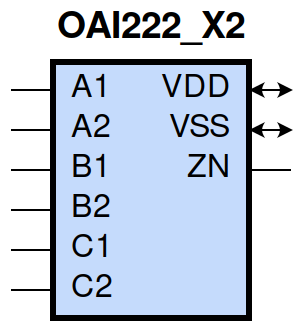
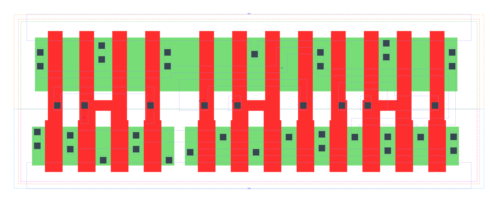

====================================
gf180mcu_fd_sc_mcu9t5v0__oai222_x2
====================================

**gf180mcu_fd_sc_mcu9t5v0__oai222_x2 symbol**

**gf180mcu_fd_sc_mcu9t5v0__oai222_x2 schematic**

.. image:: sc9_sch/OAI222_X2_sch.png
    :height: 250px
    :width: 450 px
    :align: center
    :alt: gf180mcu_fd_sc_mcu9t5v0__oai222_x2 schematic

**gf180mcu_fd_sc_mcu9t5v0__oai222_x2 layout**

.. include:: images.rst
| OAI222_X2 is a three 2-input OR into 3-input NAND with 2X drive strength

|
| Attributes

============= ======================
**Attribute** **Value**
area          76.204800 µm\ :sup:`2`
============= ======================

|
| OUTPUT FUNCTIONS

============== ===========================================
**Output Pin** **Function**
ZN             (((!A1)&(!A2))|((!B1)&(!B2))|((!C1)&(!C2)))
============== ===========================================

|
| TRUTH TABLE FOR ZN

====== ====== ====== ====== ====== ====== ======
**A1** **A2** **B1** **B2** **C1** **C2** **ZN**
0      0      ?      ?      ?      ?      1
?      ?      0      0      ?      ?      1
?      ?      ?      ?      0      0      1
1      ?      1      ?      1      ?      0
1      ?      1      ?      ?      1      0
1      ?      ?      1      1      ?      0
1      ?      ?      1      ?      1      0
?      1      1      ?      1      ?      0
?      1      1      ?      ?      1      0
?      1      ?      1      1      ?      0
?      1      ?      1      ?      1      0
====== ====== ====== ====== ====== ====== ======

|
| FUNCTIONAL SCHEMATIC

| |image548|

| PIN CAPACITANCE (pf)

======= ======== ====================
**Pin** **Type** **Capacitance (pf)**
C1      input    0.0140
C2      input    0.0129
B1      input    0.0142
B2      input    0.0127
A1      input    0.0144
A2      input    0.0132
======= ======== ====================

|
| DELAY AND OUTPUT TRANSITION TIME corresponding to min slew and load

+---------------+------------+--------------------+--------------+-------------------+----------------+---------------+
| **Input Pin** | **Output** | **When Condition** | **Tin (ns)** | **Out Load (pf)** | **Delay (ns)** | **Tout (ns)** |
+---------------+------------+--------------------+--------------+-------------------+----------------+---------------+
| C1(LH)        | ZN(HL)     | !A1&A2&!B1&B2&!C2  | 0.0100       | 0.0010            | 0.2197         | 0.1088        |
+---------------+------------+--------------------+--------------+-------------------+----------------+---------------+
| C1(LH)        | ZN(HL)     | !A1&A2&B1&!B2&!C2  | 0.0100       | 0.0010            | 0.1861         | 0.0874        |
+---------------+------------+--------------------+--------------+-------------------+----------------+---------------+
| C1(LH)        | ZN(HL)     | !A1&A2&B1&B2&!C2   | 0.0100       | 0.0010            | 0.1690         | 0.0734        |
+---------------+------------+--------------------+--------------+-------------------+----------------+---------------+
| C1(LH)        | ZN(HL)     | A1&!A2&!B1&B2&!C2  | 0.0100       | 0.0010            | 0.1861         | 0.0874        |
+---------------+------------+--------------------+--------------+-------------------+----------------+---------------+
| C1(LH)        | ZN(HL)     | A1&!A2&B1&!B2&!C2  | 0.0100       | 0.0010            | 0.1545         | 0.0658        |
+---------------+------------+--------------------+--------------+-------------------+----------------+---------------+
| C1(LH)        | ZN(HL)     | A1&!A2&B1&B2&!C2   | 0.0100       | 0.0010            | 0.1421         | 0.0560        |
+---------------+------------+--------------------+--------------+-------------------+----------------+---------------+
| C1(LH)        | ZN(HL)     | A1&A2&!B1&B2&!C2   | 0.0100       | 0.0010            | 0.1645         | 0.0888        |
+---------------+------------+--------------------+--------------+-------------------+----------------+---------------+
| C1(LH)        | ZN(HL)     | A1&A2&B1&!B2&!C2   | 0.0100       | 0.0010            | 0.1385         | 0.0700        |
+---------------+------------+--------------------+--------------+-------------------+----------------+---------------+
| C1(LH)        | ZN(HL)     | A1&A2&B1&B2&!C2    | 0.0100       | 0.0010            | 0.1222         | 0.0565        |
+---------------+------------+--------------------+--------------+-------------------+----------------+---------------+
| C1(HL)        | ZN(LH)     | !A1&A2&!B1&B2&!C2  | 0.0100       | 0.0010            | 0.2951         | 0.3038        |
+---------------+------------+--------------------+--------------+-------------------+----------------+---------------+
| C1(HL)        | ZN(LH)     | !A1&A2&B1&!B2&!C2  | 0.0100       | 0.0010            | 0.2782         | 0.2573        |
+---------------+------------+--------------------+--------------+-------------------+----------------+---------------+
| C1(HL)        | ZN(LH)     | !A1&A2&B1&B2&!C2   | 0.0100       | 0.0010            | 0.2976         | 0.2717        |
+---------------+------------+--------------------+--------------+-------------------+----------------+---------------+
| C1(HL)        | ZN(LH)     | A1&!A2&!B1&B2&!C2  | 0.0100       | 0.0010            | 0.2782         | 0.2570        |
+---------------+------------+--------------------+--------------+-------------------+----------------+---------------+
| C1(HL)        | ZN(LH)     | A1&!A2&B1&!B2&!C2  | 0.0100       | 0.0010            | 0.2630         | 0.2096        |
+---------------+------------+--------------------+--------------+-------------------+----------------+---------------+
| C1(HL)        | ZN(LH)     | A1&!A2&B1&B2&!C2   | 0.0100       | 0.0010            | 0.2816         | 0.2235        |
+---------------+------------+--------------------+--------------+-------------------+----------------+---------------+
| C1(HL)        | ZN(LH)     | A1&A2&!B1&B2&!C2   | 0.0100       | 0.0010            | 0.3075         | 0.2755        |
+---------------+------------+--------------------+--------------+-------------------+----------------+---------------+
| C1(HL)        | ZN(LH)     | A1&A2&B1&!B2&!C2   | 0.0100       | 0.0010            | 0.2934         | 0.2297        |
+---------------+------------+--------------------+--------------+-------------------+----------------+---------------+
| C1(HL)        | ZN(LH)     | A1&A2&B1&B2&!C2    | 0.0100       | 0.0010            | 0.3143         | 0.2449        |
+---------------+------------+--------------------+--------------+-------------------+----------------+---------------+
| C2(LH)        | ZN(HL)     | !A1&A2&!B1&B2&!C1  | 0.0100       | 0.0010            | 0.2507         | 0.1305        |
+---------------+------------+--------------------+--------------+-------------------+----------------+---------------+
| C2(LH)        | ZN(HL)     | !A1&A2&B1&!B2&!C1  | 0.0100       | 0.0010            | 0.2162         | 0.1088        |
+---------------+------------+--------------------+--------------+-------------------+----------------+---------------+
| C2(LH)        | ZN(HL)     | !A1&A2&B1&B2&!C1   | 0.0100       | 0.0010            | 0.1948         | 0.0915        |
+---------------+------------+--------------------+--------------+-------------------+----------------+---------------+
| C2(LH)        | ZN(HL)     | A1&!A2&!B1&B2&!C1  | 0.0100       | 0.0010            | 0.2163         | 0.1088        |
+---------------+------------+--------------------+--------------+-------------------+----------------+---------------+
| C2(LH)        | ZN(HL)     | A1&!A2&B1&!B2&!C1  | 0.0100       | 0.0010            | 0.1829         | 0.0877        |
+---------------+------------+--------------------+--------------+-------------------+----------------+---------------+
| C2(LH)        | ZN(HL)     | A1&!A2&B1&B2&!C1   | 0.0100       | 0.0010            | 0.1663         | 0.0737        |
+---------------+------------+--------------------+--------------+-------------------+----------------+---------------+
| C2(LH)        | ZN(HL)     | A1&A2&!B1&B2&!C1   | 0.0100       | 0.0010            | 0.1895         | 0.1071        |
+---------------+------------+--------------------+--------------+-------------------+----------------+---------------+
| C2(LH)        | ZN(HL)     | A1&A2&B1&!B2&!C1   | 0.0100       | 0.0010            | 0.1618         | 0.0888        |
+---------------+------------+--------------------+--------------+-------------------+----------------+---------------+
| C2(LH)        | ZN(HL)     | A1&A2&B1&B2&!C1    | 0.0100       | 0.0010            | 0.1405         | 0.0711        |
+---------------+------------+--------------------+--------------+-------------------+----------------+---------------+
| C2(HL)        | ZN(LH)     | !A1&A2&!B1&B2&!C1  | 0.0100       | 0.0010            | 0.3193         | 0.3038        |
+---------------+------------+--------------------+--------------+-------------------+----------------+---------------+
| C2(HL)        | ZN(LH)     | !A1&A2&B1&!B2&!C1  | 0.0100       | 0.0010            | 0.3025         | 0.2573        |
+---------------+------------+--------------------+--------------+-------------------+----------------+---------------+
| C2(HL)        | ZN(LH)     | !A1&A2&B1&B2&!C1   | 0.0100       | 0.0010            | 0.3219         | 0.2718        |
+---------------+------------+--------------------+--------------+-------------------+----------------+---------------+
| C2(HL)        | ZN(LH)     | A1&!A2&!B1&B2&!C1  | 0.0100       | 0.0010            | 0.3025         | 0.2571        |
+---------------+------------+--------------------+--------------+-------------------+----------------+---------------+
| C2(HL)        | ZN(LH)     | A1&!A2&B1&!B2&!C1  | 0.0100       | 0.0010            | 0.2871         | 0.2092        |
+---------------+------------+--------------------+--------------+-------------------+----------------+---------------+
| C2(HL)        | ZN(LH)     | A1&!A2&B1&B2&!C1   | 0.0100       | 0.0010            | 0.3058         | 0.2234        |
+---------------+------------+--------------------+--------------+-------------------+----------------+---------------+
| C2(HL)        | ZN(LH)     | A1&A2&!B1&B2&!C1   | 0.0100       | 0.0010            | 0.3318         | 0.2755        |
+---------------+------------+--------------------+--------------+-------------------+----------------+---------------+
| C2(HL)        | ZN(LH)     | A1&A2&B1&!B2&!C1   | 0.0100       | 0.0010            | 0.3178         | 0.2296        |
+---------------+------------+--------------------+--------------+-------------------+----------------+---------------+
| C2(HL)        | ZN(LH)     | A1&A2&B1&B2&!C1    | 0.0100       | 0.0010            | 0.3385         | 0.2447        |
+---------------+------------+--------------------+--------------+-------------------+----------------+---------------+
| B1(LH)        | ZN(HL)     | !A1&A2&!B2&!C1&C2  | 0.0100       | 0.0010            | 0.1948         | 0.1090        |
+---------------+------------+--------------------+--------------+-------------------+----------------+---------------+
| B1(LH)        | ZN(HL)     | !A1&A2&!B2&C1&!C2  | 0.0100       | 0.0010            | 0.1613         | 0.0873        |
+---------------+------------+--------------------+--------------+-------------------+----------------+---------------+
| B1(LH)        | ZN(HL)     | !A1&A2&!B2&C1&C2   | 0.0100       | 0.0010            | 0.1406         | 0.0723        |
+---------------+------------+--------------------+--------------+-------------------+----------------+---------------+
| B1(LH)        | ZN(HL)     | A1&!A2&!B2&!C1&C2  | 0.0100       | 0.0010            | 0.1611         | 0.0873        |
+---------------+------------+--------------------+--------------+-------------------+----------------+---------------+
| B1(LH)        | ZN(HL)     | A1&!A2&!B2&C1&!C2  | 0.0100       | 0.0010            | 0.1298         | 0.0657        |
+---------------+------------+--------------------+--------------+-------------------+----------------+---------------+
| B1(LH)        | ZN(HL)     | A1&!A2&!B2&C1&C2   | 0.0100       | 0.0010            | 0.1140         | 0.0538        |
+---------------+------------+--------------------+--------------+-------------------+----------------+---------------+
| B1(LH)        | ZN(HL)     | A1&A2&!B2&!C1&C2   | 0.0100       | 0.0010            | 0.1394         | 0.0886        |
+---------------+------------+--------------------+--------------+-------------------+----------------+---------------+
| B1(LH)        | ZN(HL)     | A1&A2&!B2&C1&!C2   | 0.0100       | 0.0010            | 0.1136         | 0.0698        |
+---------------+------------+--------------------+--------------+-------------------+----------------+---------------+
| B1(LH)        | ZN(HL)     | A1&A2&!B2&C1&C2    | 0.0100       | 0.0010            | 0.0981         | 0.0535        |
+---------------+------------+--------------------+--------------+-------------------+----------------+---------------+
| B1(HL)        | ZN(LH)     | !A1&A2&!B2&!C1&C2  | 0.0100       | 0.0010            | 0.2326         | 0.2480        |
+---------------+------------+--------------------+--------------+-------------------+----------------+---------------+
| B1(HL)        | ZN(LH)     | !A1&A2&!B2&C1&!C2  | 0.0100       | 0.0010            | 0.2191         | 0.2040        |
+---------------+------------+--------------------+--------------+-------------------+----------------+---------------+
| B1(HL)        | ZN(LH)     | !A1&A2&!B2&C1&C2   | 0.0100       | 0.0010            | 0.2176         | 0.2041        |
+---------------+------------+--------------------+--------------+-------------------+----------------+---------------+
| B1(HL)        | ZN(LH)     | A1&!A2&!B2&!C1&C2  | 0.0100       | 0.0010            | 0.2191         | 0.2036        |
+---------------+------------+--------------------+--------------+-------------------+----------------+---------------+
| B1(HL)        | ZN(LH)     | A1&!A2&!B2&C1&!C2  | 0.0100       | 0.0010            | 0.2074         | 0.1603        |
+---------------+------------+--------------------+--------------+-------------------+----------------+---------------+
| B1(HL)        | ZN(LH)     | A1&!A2&!B2&C1&C2   | 0.0100       | 0.0010            | 0.2058         | 0.1600        |
+---------------+------------+--------------------+--------------+-------------------+----------------+---------------+
| B1(HL)        | ZN(LH)     | A1&A2&!B2&!C1&C2   | 0.0100       | 0.0010            | 0.2436         | 0.2215        |
+---------------+------------+--------------------+--------------+-------------------+----------------+---------------+
| B1(HL)        | ZN(LH)     | A1&A2&!B2&C1&!C2   | 0.0100       | 0.0010            | 0.2320         | 0.1784        |
+---------------+------------+--------------------+--------------+-------------------+----------------+---------------+
| B1(HL)        | ZN(LH)     | A1&A2&!B2&C1&C2    | 0.0100       | 0.0010            | 0.2307         | 0.1784        |
+---------------+------------+--------------------+--------------+-------------------+----------------+---------------+
| B2(HL)        | ZN(LH)     | !A1&A2&!B1&!C1&C2  | 0.0100       | 0.0010            | 0.2573         | 0.2480        |
+---------------+------------+--------------------+--------------+-------------------+----------------+---------------+
| B2(HL)        | ZN(LH)     | !A1&A2&!B1&C1&!C2  | 0.0100       | 0.0010            | 0.2439         | 0.2039        |
+---------------+------------+--------------------+--------------+-------------------+----------------+---------------+
| B2(HL)        | ZN(LH)     | !A1&A2&!B1&C1&C2   | 0.0100       | 0.0010            | 0.2423         | 0.2040        |
+---------------+------------+--------------------+--------------+-------------------+----------------+---------------+
| B2(HL)        | ZN(LH)     | A1&!A2&!B1&!C1&C2  | 0.0100       | 0.0010            | 0.2437         | 0.2036        |
+---------------+------------+--------------------+--------------+-------------------+----------------+---------------+
| B2(HL)        | ZN(LH)     | A1&!A2&!B1&C1&!C2  | 0.0100       | 0.0010            | 0.2319         | 0.1600        |
+---------------+------------+--------------------+--------------+-------------------+----------------+---------------+
| B2(HL)        | ZN(LH)     | A1&!A2&!B1&C1&C2   | 0.0100       | 0.0010            | 0.2305         | 0.1600        |
+---------------+------------+--------------------+--------------+-------------------+----------------+---------------+
| B2(HL)        | ZN(LH)     | A1&A2&!B1&!C1&C2   | 0.0100       | 0.0010            | 0.2682         | 0.2215        |
+---------------+------------+--------------------+--------------+-------------------+----------------+---------------+
| B2(HL)        | ZN(LH)     | A1&A2&!B1&C1&!C2   | 0.0100       | 0.0010            | 0.2566         | 0.1784        |
+---------------+------------+--------------------+--------------+-------------------+----------------+---------------+
| B2(HL)        | ZN(LH)     | A1&A2&!B1&C1&C2    | 0.0100       | 0.0010            | 0.2553         | 0.1785        |
+---------------+------------+--------------------+--------------+-------------------+----------------+---------------+
| B2(LH)        | ZN(HL)     | !A1&A2&!B1&!C1&C2  | 0.0100       | 0.0010            | 0.2258         | 0.1305        |
+---------------+------------+--------------------+--------------+-------------------+----------------+---------------+
| B2(LH)        | ZN(HL)     | !A1&A2&!B1&C1&!C2  | 0.0100       | 0.0010            | 0.1916         | 0.1090        |
+---------------+------------+--------------------+--------------+-------------------+----------------+---------------+
| B2(LH)        | ZN(HL)     | !A1&A2&!B1&C1&C2   | 0.0100       | 0.0010            | 0.1663         | 0.0905        |
+---------------+------------+--------------------+--------------+-------------------+----------------+---------------+
| B2(LH)        | ZN(HL)     | A1&!A2&!B1&!C1&C2  | 0.0100       | 0.0010            | 0.1914         | 0.1089        |
+---------------+------------+--------------------+--------------+-------------------+----------------+---------------+
| B2(LH)        | ZN(HL)     | A1&!A2&!B1&C1&!C2  | 0.0100       | 0.0010            | 0.1582         | 0.0877        |
+---------------+------------+--------------------+--------------+-------------------+----------------+---------------+
| B2(LH)        | ZN(HL)     | A1&!A2&!B1&C1&C2   | 0.0100       | 0.0010            | 0.1378         | 0.0719        |
+---------------+------------+--------------------+--------------+-------------------+----------------+---------------+
| B2(LH)        | ZN(HL)     | A1&A2&!B1&!C1&C2   | 0.0100       | 0.0010            | 0.1645         | 0.1070        |
+---------------+------------+--------------------+--------------+-------------------+----------------+---------------+
| B2(LH)        | ZN(HL)     | A1&A2&!B1&C1&!C2   | 0.0100       | 0.0010            | 0.1369         | 0.0888        |
+---------------+------------+--------------------+--------------+-------------------+----------------+---------------+
| B2(LH)        | ZN(HL)     | A1&A2&!B1&C1&C2    | 0.0100       | 0.0010            | 0.1164         | 0.0685        |
+---------------+------------+--------------------+--------------+-------------------+----------------+---------------+
| A1(HL)        | ZN(LH)     | !A2&!B1&B2&!C1&C2  | 0.0100       | 0.0010            | 0.1462         | 0.1811        |
+---------------+------------+--------------------+--------------+-------------------+----------------+---------------+
| A1(HL)        | ZN(LH)     | !A2&!B1&B2&C1&!C2  | 0.0100       | 0.0010            | 0.1358         | 0.1383        |
+---------------+------------+--------------------+--------------+-------------------+----------------+---------------+
| A1(HL)        | ZN(LH)     | !A2&!B1&B2&C1&C2   | 0.0100       | 0.0010            | 0.1356         | 0.1380        |
+---------------+------------+--------------------+--------------+-------------------+----------------+---------------+
| A1(HL)        | ZN(LH)     | !A2&B1&!B2&!C1&C2  | 0.0100       | 0.0010            | 0.1357         | 0.1380        |
+---------------+------------+--------------------+--------------+-------------------+----------------+---------------+
| A1(HL)        | ZN(LH)     | !A2&B1&!B2&C1&!C2  | 0.0100       | 0.0010            | 0.1267         | 0.0980        |
+---------------+------------+--------------------+--------------+-------------------+----------------+---------------+
| A1(HL)        | ZN(LH)     | !A2&B1&!B2&C1&C2   | 0.0100       | 0.0010            | 0.1266         | 0.0980        |
+---------------+------------+--------------------+--------------+-------------------+----------------+---------------+
| A1(HL)        | ZN(LH)     | !A2&B1&B2&!C1&C2   | 0.0100       | 0.0010            | 0.1350         | 0.1379        |
+---------------+------------+--------------------+--------------+-------------------+----------------+---------------+
| A1(HL)        | ZN(LH)     | !A2&B1&B2&C1&!C2   | 0.0100       | 0.0010            | 0.1259         | 0.0980        |
+---------------+------------+--------------------+--------------+-------------------+----------------+---------------+
| A1(HL)        | ZN(LH)     | !A2&B1&B2&C1&C2    | 0.0100       | 0.0010            | 0.1257         | 0.0979        |
+---------------+------------+--------------------+--------------+-------------------+----------------+---------------+
| A1(LH)        | ZN(HL)     | !A2&!B1&B2&!C1&C2  | 0.0100       | 0.0010            | 0.1459         | 0.1084        |
+---------------+------------+--------------------+--------------+-------------------+----------------+---------------+
| A1(LH)        | ZN(HL)     | !A2&!B1&B2&C1&!C2  | 0.0100       | 0.0010            | 0.1127         | 0.0861        |
+---------------+------------+--------------------+--------------+-------------------+----------------+---------------+
| A1(LH)        | ZN(HL)     | !A2&!B1&B2&C1&C2   | 0.0100       | 0.0010            | 0.1030         | 0.0719        |
+---------------+------------+--------------------+--------------+-------------------+----------------+---------------+
| A1(LH)        | ZN(HL)     | !A2&B1&!B2&!C1&C2  | 0.0100       | 0.0010            | 0.1124         | 0.0862        |
+---------------+------------+--------------------+--------------+-------------------+----------------+---------------+
| A1(LH)        | ZN(HL)     | !A2&B1&!B2&C1&!C2  | 0.0100       | 0.0010            | 0.0819         | 0.0628        |
+---------------+------------+--------------------+--------------+-------------------+----------------+---------------+
| A1(LH)        | ZN(HL)     | !A2&B1&!B2&C1&C2   | 0.0100       | 0.0010            | 0.0768         | 0.0526        |
+---------------+------------+--------------------+--------------+-------------------+----------------+---------------+
| A1(LH)        | ZN(HL)     | !A2&B1&B2&!C1&C2   | 0.0100       | 0.0010            | 0.0975         | 0.0711        |
+---------------+------------+--------------------+--------------+-------------------+----------------+---------------+
| A1(LH)        | ZN(HL)     | !A2&B1&B2&C1&!C2   | 0.0100       | 0.0010            | 0.0722         | 0.0510        |
+---------------+------------+--------------------+--------------+-------------------+----------------+---------------+
| A1(LH)        | ZN(HL)     | !A2&B1&B2&C1&C2    | 0.0100       | 0.0010            | 0.0673         | 0.0422        |
+---------------+------------+--------------------+--------------+-------------------+----------------+---------------+
| A2(HL)        | ZN(LH)     | !A1&!B1&B2&!C1&C2  | 0.0100       | 0.0010            | 0.1712         | 0.1814        |
+---------------+------------+--------------------+--------------+-------------------+----------------+---------------+
| A2(HL)        | ZN(LH)     | !A1&!B1&B2&C1&!C2  | 0.0100       | 0.0010            | 0.1607         | 0.1383        |
+---------------+------------+--------------------+--------------+-------------------+----------------+---------------+
| A2(HL)        | ZN(LH)     | !A1&!B1&B2&C1&C2   | 0.0100       | 0.0010            | 0.1606         | 0.1383        |
+---------------+------------+--------------------+--------------+-------------------+----------------+---------------+
| A2(HL)        | ZN(LH)     | !A1&B1&!B2&!C1&C2  | 0.0100       | 0.0010            | 0.1607         | 0.1380        |
+---------------+------------+--------------------+--------------+-------------------+----------------+---------------+
| A2(HL)        | ZN(LH)     | !A1&B1&!B2&C1&!C2  | 0.0100       | 0.0010            | 0.1518         | 0.0981        |
+---------------+------------+--------------------+--------------+-------------------+----------------+---------------+
| A2(HL)        | ZN(LH)     | !A1&B1&!B2&C1&C2   | 0.0100       | 0.0010            | 0.1517         | 0.0981        |
+---------------+------------+--------------------+--------------+-------------------+----------------+---------------+
| A2(HL)        | ZN(LH)     | !A1&B1&B2&!C1&C2   | 0.0100       | 0.0010            | 0.1598         | 0.1381        |
+---------------+------------+--------------------+--------------+-------------------+----------------+---------------+
| A2(HL)        | ZN(LH)     | !A1&B1&B2&C1&!C2   | 0.0100       | 0.0010            | 0.1508         | 0.0982        |
+---------------+------------+--------------------+--------------+-------------------+----------------+---------------+
| A2(HL)        | ZN(LH)     | !A1&B1&B2&C1&C2    | 0.0100       | 0.0010            | 0.1506         | 0.0982        |
+---------------+------------+--------------------+--------------+-------------------+----------------+---------------+
| A2(LH)        | ZN(HL)     | !A1&!B1&B2&!C1&C2  | 0.0100       | 0.0010            | 0.1772         | 0.1305        |
+---------------+------------+--------------------+--------------+-------------------+----------------+---------------+
| A2(LH)        | ZN(HL)     | !A1&!B1&B2&C1&!C2  | 0.0100       | 0.0010            | 0.1429         | 0.1084        |
+---------------+------------+--------------------+--------------+-------------------+----------------+---------------+
| A2(LH)        | ZN(HL)     | !A1&!B1&B2&C1&C2   | 0.0100       | 0.0010            | 0.1288         | 0.0902        |
+---------------+------------+--------------------+--------------+-------------------+----------------+---------------+
| A2(LH)        | ZN(HL)     | !A1&B1&!B2&!C1&C2  | 0.0100       | 0.0010            | 0.1427         | 0.1084        |
+---------------+------------+--------------------+--------------+-------------------+----------------+---------------+
| A2(LH)        | ZN(HL)     | !A1&B1&!B2&C1&!C2  | 0.0100       | 0.0010            | 0.1096         | 0.0862        |
+---------------+------------+--------------------+--------------+-------------------+----------------+---------------+
| A2(LH)        | ZN(HL)     | !A1&B1&!B2&C1&C2   | 0.0100       | 0.0010            | 0.1003         | 0.0721        |
+---------------+------------+--------------------+--------------+-------------------+----------------+---------------+
| A2(LH)        | ZN(HL)     | !A1&B1&B2&!C1&C2   | 0.0100       | 0.0010            | 0.1230         | 0.0903        |
+---------------+------------+--------------------+--------------+-------------------+----------------+---------------+
| A2(LH)        | ZN(HL)     | !A1&B1&B2&C1&!C2   | 0.0100       | 0.0010            | 0.0950         | 0.0711        |
+---------------+------------+--------------------+--------------+-------------------+----------------+---------------+
| A2(LH)        | ZN(HL)     | !A1&B1&B2&C1&C2    | 0.0100       | 0.0010            | 0.0861         | 0.0577        |
+---------------+------------+--------------------+--------------+-------------------+----------------+---------------+

|
| DYNAMIC ENERGY

+---------------+---------------------+--------------+------------+-------------------+---------------------+
| **Input Pin** | **When Condition**  | **Tin (ns)** | **Output** | **Out Load (pf)** | **Energy (uW/MHz)** |
+---------------+---------------------+--------------+------------+-------------------+---------------------+
| A1            | !A2&!B1&B2&!C1&C2   | 0.0100       | ZN(LH)     | 0.0010            | 0.5989              |
+---------------+---------------------+--------------+------------+-------------------+---------------------+
| A1            | !A2&!B1&B2&C1&!C2   | 0.0100       | ZN(LH)     | 0.0010            | 0.5100              |
+---------------+---------------------+--------------+------------+-------------------+---------------------+
| A1            | !A2&!B1&B2&C1&C2    | 0.0100       | ZN(LH)     | 0.0010            | 0.5099              |
+---------------+---------------------+--------------+------------+-------------------+---------------------+
| A1            | !A2&B1&!B2&!C1&C2   | 0.0100       | ZN(LH)     | 0.0010            | 0.5103              |
+---------------+---------------------+--------------+------------+-------------------+---------------------+
| A1            | !A2&B1&!B2&C1&!C2   | 0.0100       | ZN(LH)     | 0.0010            | 0.4214              |
+---------------+---------------------+--------------+------------+-------------------+---------------------+
| A1            | !A2&B1&!B2&C1&C2    | 0.0100       | ZN(LH)     | 0.0010            | 0.4211              |
+---------------+---------------------+--------------+------------+-------------------+---------------------+
| A1            | !A2&B1&B2&!C1&C2    | 0.0100       | ZN(LH)     | 0.0010            | 0.5080              |
+---------------+---------------------+--------------+------------+-------------------+---------------------+
| A1            | !A2&B1&B2&C1&!C2    | 0.0100       | ZN(LH)     | 0.0010            | 0.4191              |
+---------------+---------------------+--------------+------------+-------------------+---------------------+
| A1            | !A2&B1&B2&C1&C2     | 0.0100       | ZN(LH)     | 0.0010            | 0.4186              |
+---------------+---------------------+--------------+------------+-------------------+---------------------+
| B2            | !A1&A2&!B1&!C1&C2   | 0.0100       | ZN(LH)     | 0.0010            | 0.9714              |
+---------------+---------------------+--------------+------------+-------------------+---------------------+
| B2            | !A1&A2&!B1&C1&!C2   | 0.0100       | ZN(LH)     | 0.0010            | 0.8826              |
+---------------+---------------------+--------------+------------+-------------------+---------------------+
| B2            | !A1&A2&!B1&C1&C2    | 0.0100       | ZN(LH)     | 0.0010            | 0.8790              |
+---------------+---------------------+--------------+------------+-------------------+---------------------+
| B2            | A1&!A2&!B1&!C1&C2   | 0.0100       | ZN(LH)     | 0.0010            | 0.8821              |
+---------------+---------------------+--------------+------------+-------------------+---------------------+
| B2            | A1&!A2&!B1&C1&!C2   | 0.0100       | ZN(LH)     | 0.0010            | 0.7932              |
+---------------+---------------------+--------------+------------+-------------------+---------------------+
| B2            | A1&!A2&!B1&C1&C2    | 0.0100       | ZN(LH)     | 0.0010            | 0.7899              |
+---------------+---------------------+--------------+------------+-------------------+---------------------+
| B2            | A1&A2&!B1&!C1&C2    | 0.0100       | ZN(LH)     | 0.0010            | 0.9544              |
+---------------+---------------------+--------------+------------+-------------------+---------------------+
| B2            | A1&A2&!B1&C1&!C2    | 0.0100       | ZN(LH)     | 0.0010            | 0.8652              |
+---------------+---------------------+--------------+------------+-------------------+---------------------+
| B2            | A1&A2&!B1&C1&C2     | 0.0100       | ZN(LH)     | 0.0010            | 0.8621              |
+---------------+---------------------+--------------+------------+-------------------+---------------------+
| B1            | !A1&A2&!B2&!C1&C2   | 0.0100       | ZN(HL)     | 0.0010            | 0.2564              |
+---------------+---------------------+--------------+------------+-------------------+---------------------+
| B1            | !A1&A2&!B2&C1&!C2   | 0.0100       | ZN(HL)     | 0.0010            | 0.1806              |
+---------------+---------------------+--------------+------------+-------------------+---------------------+
| B1            | !A1&A2&!B2&C1&C2    | 0.0100       | ZN(HL)     | 0.0010            | 0.1808              |
+---------------+---------------------+--------------+------------+-------------------+---------------------+
| B1            | A1&!A2&!B2&!C1&C2   | 0.0100       | ZN(HL)     | 0.0010            | 0.1794              |
+---------------+---------------------+--------------+------------+-------------------+---------------------+
| B1            | A1&!A2&!B2&C1&!C2   | 0.0100       | ZN(HL)     | 0.0010            | 0.1035              |
+---------------+---------------------+--------------+------------+-------------------+---------------------+
| B1            | A1&!A2&!B2&C1&C2    | 0.0100       | ZN(HL)     | 0.0010            | 0.1034              |
+---------------+---------------------+--------------+------------+-------------------+---------------------+
| B1            | A1&A2&!B2&!C1&C2    | 0.0100       | ZN(HL)     | 0.0010            | 0.1798              |
+---------------+---------------------+--------------+------------+-------------------+---------------------+
| B1            | A1&A2&!B2&C1&!C2    | 0.0100       | ZN(HL)     | 0.0010            | 0.1037              |
+---------------+---------------------+--------------+------------+-------------------+---------------------+
| B1            | A1&A2&!B2&C1&C2     | 0.0100       | ZN(HL)     | 0.0010            | 0.1034              |
+---------------+---------------------+--------------+------------+-------------------+---------------------+
| A2            | !A1&!B1&B2&!C1&C2   | 0.0100       | ZN(LH)     | 0.0010            | 0.6890              |
+---------------+---------------------+--------------+------------+-------------------+---------------------+
| A2            | !A1&!B1&B2&C1&!C2   | 0.0100       | ZN(LH)     | 0.0010            | 0.6003              |
+---------------+---------------------+--------------+------------+-------------------+---------------------+
| A2            | !A1&!B1&B2&C1&C2    | 0.0100       | ZN(LH)     | 0.0010            | 0.6000              |
+---------------+---------------------+--------------+------------+-------------------+---------------------+
| A2            | !A1&B1&!B2&!C1&C2   | 0.0100       | ZN(LH)     | 0.0010            | 0.6006              |
+---------------+---------------------+--------------+------------+-------------------+---------------------+
| A2            | !A1&B1&!B2&C1&!C2   | 0.0100       | ZN(LH)     | 0.0010            | 0.5116              |
+---------------+---------------------+--------------+------------+-------------------+---------------------+
| A2            | !A1&B1&!B2&C1&C2    | 0.0100       | ZN(LH)     | 0.0010            | 0.5113              |
+---------------+---------------------+--------------+------------+-------------------+---------------------+
| A2            | !A1&B1&B2&!C1&C2    | 0.0100       | ZN(LH)     | 0.0010            | 0.5987              |
+---------------+---------------------+--------------+------------+-------------------+---------------------+
| A2            | !A1&B1&B2&C1&!C2    | 0.0100       | ZN(LH)     | 0.0010            | 0.5095              |
+---------------+---------------------+--------------+------------+-------------------+---------------------+
| A2            | !A1&B1&B2&C1&C2     | 0.0100       | ZN(LH)     | 0.0010            | 0.5092              |
+---------------+---------------------+--------------+------------+-------------------+---------------------+
| B1            | !A1&A2&!B2&!C1&C2   | 0.0100       | ZN(LH)     | 0.0010            | 0.8820              |
+---------------+---------------------+--------------+------------+-------------------+---------------------+
| B1            | !A1&A2&!B2&C1&!C2   | 0.0100       | ZN(LH)     | 0.0010            | 0.7932              |
+---------------+---------------------+--------------+------------+-------------------+---------------------+
| B1            | !A1&A2&!B2&C1&C2    | 0.0100       | ZN(LH)     | 0.0010            | 0.7898              |
+---------------+---------------------+--------------+------------+-------------------+---------------------+
| B1            | A1&!A2&!B2&!C1&C2   | 0.0100       | ZN(LH)     | 0.0010            | 0.7929              |
+---------------+---------------------+--------------+------------+-------------------+---------------------+
| B1            | A1&!A2&!B2&C1&!C2   | 0.0100       | ZN(LH)     | 0.0010            | 0.7037              |
+---------------+---------------------+--------------+------------+-------------------+---------------------+
| B1            | A1&!A2&!B2&C1&C2    | 0.0100       | ZN(LH)     | 0.0010            | 0.7004              |
+---------------+---------------------+--------------+------------+-------------------+---------------------+
| B1            | A1&A2&!B2&!C1&C2    | 0.0100       | ZN(LH)     | 0.0010            | 0.8654              |
+---------------+---------------------+--------------+------------+-------------------+---------------------+
| B1            | A1&A2&!B2&C1&!C2    | 0.0100       | ZN(LH)     | 0.0010            | 0.7760              |
+---------------+---------------------+--------------+------------+-------------------+---------------------+
| B1            | A1&A2&!B2&C1&C2     | 0.0100       | ZN(LH)     | 0.0010            | 0.7727              |
+---------------+---------------------+--------------+------------+-------------------+---------------------+
| C1            | !A1&A2&!B1&B2&!C2   | 0.0100       | ZN(HL)     | 0.0010            | 0.2583              |
+---------------+---------------------+--------------+------------+-------------------+---------------------+
| C1            | !A1&A2&B1&!B2&!C2   | 0.0100       | ZN(HL)     | 0.0010            | 0.1812              |
+---------------+---------------------+--------------+------------+-------------------+---------------------+
| C1            | !A1&A2&B1&B2&!C2    | 0.0100       | ZN(HL)     | 0.0010            | 0.1809              |
+---------------+---------------------+--------------+------------+-------------------+---------------------+
| C1            | A1&!A2&!B1&B2&!C2   | 0.0100       | ZN(HL)     | 0.0010            | 0.1813              |
+---------------+---------------------+--------------+------------+-------------------+---------------------+
| C1            | A1&!A2&B1&!B2&!C2   | 0.0100       | ZN(HL)     | 0.0010            | 0.1039              |
+---------------+---------------------+--------------+------------+-------------------+---------------------+
| C1            | A1&!A2&B1&B2&!C2    | 0.0100       | ZN(HL)     | 0.0010            | 0.1040              |
+---------------+---------------------+--------------+------------+-------------------+---------------------+
| C1            | A1&A2&!B1&B2&!C2    | 0.0100       | ZN(HL)     | 0.0010            | 0.1813              |
+---------------+---------------------+--------------+------------+-------------------+---------------------+
| C1            | A1&A2&B1&!B2&!C2    | 0.0100       | ZN(HL)     | 0.0010            | 0.1039              |
+---------------+---------------------+--------------+------------+-------------------+---------------------+
| C1            | A1&A2&B1&B2&!C2     | 0.0100       | ZN(HL)     | 0.0010            | 0.1040              |
+---------------+---------------------+--------------+------------+-------------------+---------------------+
| A2            | !A1&!B1&B2&!C1&C2   | 0.0100       | ZN(HL)     | 0.0010            | 0.3227              |
+---------------+---------------------+--------------+------------+-------------------+---------------------+
| A2            | !A1&!B1&B2&C1&!C2   | 0.0100       | ZN(HL)     | 0.0010            | 0.2472              |
+---------------+---------------------+--------------+------------+-------------------+---------------------+
| A2            | !A1&!B1&B2&C1&C2    | 0.0100       | ZN(HL)     | 0.0010            | 0.2474              |
+---------------+---------------------+--------------+------------+-------------------+---------------------+
| A2            | !A1&B1&!B2&!C1&C2   | 0.0100       | ZN(HL)     | 0.0010            | 0.2460              |
+---------------+---------------------+--------------+------------+-------------------+---------------------+
| A2            | !A1&B1&!B2&C1&!C2   | 0.0100       | ZN(HL)     | 0.0010            | 0.1710              |
+---------------+---------------------+--------------+------------+-------------------+---------------------+
| A2            | !A1&B1&!B2&C1&C2    | 0.0100       | ZN(HL)     | 0.0010            | 0.1710              |
+---------------+---------------------+--------------+------------+-------------------+---------------------+
| A2            | !A1&B1&B2&!C1&C2    | 0.0100       | ZN(HL)     | 0.0010            | 0.2463              |
+---------------+---------------------+--------------+------------+-------------------+---------------------+
| A2            | !A1&B1&B2&C1&!C2    | 0.0100       | ZN(HL)     | 0.0010            | 0.1708              |
+---------------+---------------------+--------------+------------+-------------------+---------------------+
| A2            | !A1&B1&B2&C1&C2     | 0.0100       | ZN(HL)     | 0.0010            | 0.1706              |
+---------------+---------------------+--------------+------------+-------------------+---------------------+
| C2            | !A1&A2&!B1&B2&!C1   | 0.0100       | ZN(HL)     | 0.0010            | 0.3217              |
+---------------+---------------------+--------------+------------+-------------------+---------------------+
| C2            | !A1&A2&B1&!B2&!C1   | 0.0100       | ZN(HL)     | 0.0010            | 0.2451              |
+---------------+---------------------+--------------+------------+-------------------+---------------------+
| C2            | !A1&A2&B1&B2&!C1    | 0.0100       | ZN(HL)     | 0.0010            | 0.2452              |
+---------------+---------------------+--------------+------------+-------------------+---------------------+
| C2            | A1&!A2&!B1&B2&!C1   | 0.0100       | ZN(HL)     | 0.0010            | 0.2451              |
+---------------+---------------------+--------------+------------+-------------------+---------------------+
| C2            | A1&!A2&B1&!B2&!C1   | 0.0100       | ZN(HL)     | 0.0010            | 0.1689              |
+---------------+---------------------+--------------+------------+-------------------+---------------------+
| C2            | A1&!A2&B1&B2&!C1    | 0.0100       | ZN(HL)     | 0.0010            | 0.1685              |
+---------------+---------------------+--------------+------------+-------------------+---------------------+
| C2            | A1&A2&!B1&B2&!C1    | 0.0100       | ZN(HL)     | 0.0010            | 0.2450              |
+---------------+---------------------+--------------+------------+-------------------+---------------------+
| C2            | A1&A2&B1&!B2&!C1    | 0.0100       | ZN(HL)     | 0.0010            | 0.1687              |
+---------------+---------------------+--------------+------------+-------------------+---------------------+
| C2            | A1&A2&B1&B2&!C1     | 0.0100       | ZN(HL)     | 0.0010            | 0.1685              |
+---------------+---------------------+--------------+------------+-------------------+---------------------+
| C1            | !A1&A2&!B1&B2&!C2   | 0.0100       | ZN(LH)     | 0.0010            | 1.1140              |
+---------------+---------------------+--------------+------------+-------------------+---------------------+
| C1            | !A1&A2&B1&!B2&!C2   | 0.0100       | ZN(LH)     | 0.0010            | 1.0250              |
+---------------+---------------------+--------------+------------+-------------------+---------------------+
| C1            | !A1&A2&B1&B2&!C2    | 0.0100       | ZN(LH)     | 0.0010            | 1.0949              |
+---------------+---------------------+--------------+------------+-------------------+---------------------+
| C1            | A1&!A2&!B1&B2&!C2   | 0.0100       | ZN(LH)     | 0.0010            | 1.0243              |
+---------------+---------------------+--------------+------------+-------------------+---------------------+
| C1            | A1&!A2&B1&!B2&!C2   | 0.0100       | ZN(LH)     | 0.0010            | 0.9357              |
+---------------+---------------------+--------------+------------+-------------------+---------------------+
| C1            | A1&!A2&B1&B2&!C2    | 0.0100       | ZN(LH)     | 0.0010            | 1.0056              |
+---------------+---------------------+--------------+------------+-------------------+---------------------+
| C1            | A1&A2&!B1&B2&!C2    | 0.0100       | ZN(LH)     | 0.0010            | 1.0951              |
+---------------+---------------------+--------------+------------+-------------------+---------------------+
| C1            | A1&A2&B1&!B2&!C2    | 0.0100       | ZN(LH)     | 0.0010            | 1.0063              |
+---------------+---------------------+--------------+------------+-------------------+---------------------+
| C1            | A1&A2&B1&B2&!C2     | 0.0100       | ZN(LH)     | 0.0010            | 1.0769              |
+---------------+---------------------+--------------+------------+-------------------+---------------------+
| C2            | !A1&A2&!B1&B2&!C1   | 0.0100       | ZN(LH)     | 0.0010            | 1.2033              |
+---------------+---------------------+--------------+------------+-------------------+---------------------+
| C2            | !A1&A2&B1&!B2&!C1   | 0.0100       | ZN(LH)     | 0.0010            | 1.1144              |
+---------------+---------------------+--------------+------------+-------------------+---------------------+
| C2            | !A1&A2&B1&B2&!C1    | 0.0100       | ZN(LH)     | 0.0010            | 1.1843              |
+---------------+---------------------+--------------+------------+-------------------+---------------------+
| C2            | A1&!A2&!B1&B2&!C1   | 0.0100       | ZN(LH)     | 0.0010            | 1.1138              |
+---------------+---------------------+--------------+------------+-------------------+---------------------+
| C2            | A1&!A2&B1&!B2&!C1   | 0.0100       | ZN(LH)     | 0.0010            | 1.0254              |
+---------------+---------------------+--------------+------------+-------------------+---------------------+
| C2            | A1&!A2&B1&B2&!C1    | 0.0100       | ZN(LH)     | 0.0010            | 1.0951              |
+---------------+---------------------+--------------+------------+-------------------+---------------------+
| C2            | A1&A2&!B1&B2&!C1    | 0.0100       | ZN(LH)     | 0.0010            | 1.1848              |
+---------------+---------------------+--------------+------------+-------------------+---------------------+
| C2            | A1&A2&B1&!B2&!C1    | 0.0100       | ZN(LH)     | 0.0010            | 1.0961              |
+---------------+---------------------+--------------+------------+-------------------+---------------------+
| C2            | A1&A2&B1&B2&!C1     | 0.0100       | ZN(LH)     | 0.0010            | 1.1657              |
+---------------+---------------------+--------------+------------+-------------------+---------------------+
| A1            | !A2&!B1&B2&!C1&C2   | 0.0100       | ZN(HL)     | 0.0010            | 0.2577              |
+---------------+---------------------+--------------+------------+-------------------+---------------------+
| A1            | !A2&!B1&B2&C1&!C2   | 0.0100       | ZN(HL)     | 0.0010            | 0.1817              |
+---------------+---------------------+--------------+------------+-------------------+---------------------+
| A1            | !A2&!B1&B2&C1&C2    | 0.0100       | ZN(HL)     | 0.0010            | 0.1819              |
+---------------+---------------------+--------------+------------+-------------------+---------------------+
| A1            | !A2&B1&!B2&!C1&C2   | 0.0100       | ZN(HL)     | 0.0010            | 0.1807              |
+---------------+---------------------+--------------+------------+-------------------+---------------------+
| A1            | !A2&B1&!B2&C1&!C2   | 0.0100       | ZN(HL)     | 0.0010            | 0.1047              |
+---------------+---------------------+--------------+------------+-------------------+---------------------+
| A1            | !A2&B1&!B2&C1&C2    | 0.0100       | ZN(HL)     | 0.0010            | 0.1044              |
+---------------+---------------------+--------------+------------+-------------------+---------------------+
| A1            | !A2&B1&B2&!C1&C2    | 0.0100       | ZN(HL)     | 0.0010            | 0.1807              |
+---------------+---------------------+--------------+------------+-------------------+---------------------+
| A1            | !A2&B1&B2&C1&!C2    | 0.0100       | ZN(HL)     | 0.0010            | 0.1045              |
+---------------+---------------------+--------------+------------+-------------------+---------------------+
| A1            | !A2&B1&B2&C1&C2     | 0.0100       | ZN(HL)     | 0.0010            | 0.1043              |
+---------------+---------------------+--------------+------------+-------------------+---------------------+
| B2            | !A1&A2&!B1&!C1&C2   | 0.0100       | ZN(HL)     | 0.0010            | 0.3213              |
+---------------+---------------------+--------------+------------+-------------------+---------------------+
| B2            | !A1&A2&!B1&C1&!C2   | 0.0100       | ZN(HL)     | 0.0010            | 0.2461              |
+---------------+---------------------+--------------+------------+-------------------+---------------------+
| B2            | !A1&A2&!B1&C1&C2    | 0.0100       | ZN(HL)     | 0.0010            | 0.2461              |
+---------------+---------------------+--------------+------------+-------------------+---------------------+
| B2            | A1&!A2&!B1&!C1&C2   | 0.0100       | ZN(HL)     | 0.0010            | 0.2449              |
+---------------+---------------------+--------------+------------+-------------------+---------------------+
| B2            | A1&!A2&!B1&C1&!C2   | 0.0100       | ZN(HL)     | 0.0010            | 0.1700              |
+---------------+---------------------+--------------+------------+-------------------+---------------------+
| B2            | A1&!A2&!B1&C1&C2    | 0.0100       | ZN(HL)     | 0.0010            | 0.1698              |
+---------------+---------------------+--------------+------------+-------------------+---------------------+
| B2            | A1&A2&!B1&!C1&C2    | 0.0100       | ZN(HL)     | 0.0010            | 0.2449              |
+---------------+---------------------+--------------+------------+-------------------+---------------------+
| B2            | A1&A2&!B1&C1&!C2    | 0.0100       | ZN(HL)     | 0.0010            | 0.1699              |
+---------------+---------------------+--------------+------------+-------------------+---------------------+
| B2            | A1&A2&!B1&C1&C2     | 0.0100       | ZN(HL)     | 0.0010            | 0.1697              |
+---------------+---------------------+--------------+------------+-------------------+---------------------+
| B2(LH)        | !A1&!A2&!B1&!C1&!C2 | 0.0100       | n/a        | n/a               | -0.1189             |
+---------------+---------------------+--------------+------------+-------------------+---------------------+
| B2(LH)        | !A1&!A2&!B1&!C1&C2  | 0.0100       | n/a        | n/a               | -0.1189             |
+---------------+---------------------+--------------+------------+-------------------+---------------------+
| B2(LH)        | !A1&!A2&!B1&C1&!C2  | 0.0100       | n/a        | n/a               | -0.1189             |
+---------------+---------------------+--------------+------------+-------------------+---------------------+
| B2(LH)        | !A1&!A2&!B1&C1&C2   | 0.0100       | n/a        | n/a               | -0.1190             |
+---------------+---------------------+--------------+------------+-------------------+---------------------+
| B2(LH)        | !A1&!A2&B1&!C1&!C2  | 0.0100       | n/a        | n/a               | -0.1155             |
+---------------+---------------------+--------------+------------+-------------------+---------------------+
| B2(LH)        | !A1&!A2&B1&!C1&C2   | 0.0100       | n/a        | n/a               | -0.1155             |
+---------------+---------------------+--------------+------------+-------------------+---------------------+
| B2(LH)        | !A1&!A2&B1&C1&!C2   | 0.0100       | n/a        | n/a               | -0.1155             |
+---------------+---------------------+--------------+------------+-------------------+---------------------+
| B2(LH)        | !A1&!A2&B1&C1&C2    | 0.0100       | n/a        | n/a               | -0.1154             |
+---------------+---------------------+--------------+------------+-------------------+---------------------+
| B2(LH)        | !A1&A2&!B1&!C1&!C2  | 0.0100       | n/a        | n/a               | 0.0133              |
+---------------+---------------------+--------------+------------+-------------------+---------------------+
| B2(LH)        | !A1&A2&B1&!C1&!C2   | 0.0100       | n/a        | n/a               | -0.1155             |
+---------------+---------------------+--------------+------------+-------------------+---------------------+
| B2(LH)        | A1&!A2&!B1&!C1&!C2  | 0.0100       | n/a        | n/a               | 0.0133              |
+---------------+---------------------+--------------+------------+-------------------+---------------------+
| B2(LH)        | A1&!A2&B1&!C1&!C2   | 0.0100       | n/a        | n/a               | -0.1155             |
+---------------+---------------------+--------------+------------+-------------------+---------------------+
| B2(LH)        | A1&A2&!B1&!C1&!C2   | 0.0100       | n/a        | n/a               | 0.0134              |
+---------------+---------------------+--------------+------------+-------------------+---------------------+
| B2(LH)        | A1&A2&B1&!C1&!C2    | 0.0100       | n/a        | n/a               | -0.1155             |
+---------------+---------------------+--------------+------------+-------------------+---------------------+
| B2(LH)        | !A1&A2&B1&!C1&C2    | 0.0100       | n/a        | n/a               | -0.0996             |
+---------------+---------------------+--------------+------------+-------------------+---------------------+
| B2(LH)        | !A1&A2&B1&C1&!C2    | 0.0100       | n/a        | n/a               | -0.0996             |
+---------------+---------------------+--------------+------------+-------------------+---------------------+
| B2(LH)        | !A1&A2&B1&C1&C2     | 0.0100       | n/a        | n/a               | -0.0995             |
+---------------+---------------------+--------------+------------+-------------------+---------------------+
| B2(LH)        | A1&!A2&B1&!C1&C2    | 0.0100       | n/a        | n/a               | -0.0996             |
+---------------+---------------------+--------------+------------+-------------------+---------------------+
| B2(LH)        | A1&!A2&B1&C1&!C2    | 0.0100       | n/a        | n/a               | -0.0996             |
+---------------+---------------------+--------------+------------+-------------------+---------------------+
| B2(LH)        | A1&!A2&B1&C1&C2     | 0.0100       | n/a        | n/a               | -0.0995             |
+---------------+---------------------+--------------+------------+-------------------+---------------------+
| B2(LH)        | A1&A2&B1&!C1&C2     | 0.0100       | n/a        | n/a               | -0.0996             |
+---------------+---------------------+--------------+------------+-------------------+---------------------+
| B2(LH)        | A1&A2&B1&C1&!C2     | 0.0100       | n/a        | n/a               | -0.0996             |
+---------------+---------------------+--------------+------------+-------------------+---------------------+
| B2(LH)        | A1&A2&B1&C1&C2      | 0.0100       | n/a        | n/a               | -0.0995             |
+---------------+---------------------+--------------+------------+-------------------+---------------------+
| C2(HL)        | !A1&!A2&!B1&!B2&!C1 | 0.0100       | n/a        | n/a               | 0.1196              |
+---------------+---------------------+--------------+------------+-------------------+---------------------+
| C2(HL)        | !A1&!A2&!B1&!B2&C1  | 0.0100       | n/a        | n/a               | 0.1192              |
+---------------+---------------------+--------------+------------+-------------------+---------------------+
| C2(HL)        | !A1&!A2&!B1&B2&!C1  | 0.0100       | n/a        | n/a               | 0.1202              |
+---------------+---------------------+--------------+------------+-------------------+---------------------+
| C2(HL)        | !A1&!A2&!B1&B2&C1   | 0.0100       | n/a        | n/a               | 0.1192              |
+---------------+---------------------+--------------+------------+-------------------+---------------------+
| C2(HL)        | !A1&!A2&B1&!B2&!C1  | 0.0100       | n/a        | n/a               | 0.1202              |
+---------------+---------------------+--------------+------------+-------------------+---------------------+
| C2(HL)        | !A1&!A2&B1&!B2&C1   | 0.0100       | n/a        | n/a               | 0.1192              |
+---------------+---------------------+--------------+------------+-------------------+---------------------+
| C2(HL)        | !A1&!A2&B1&B2&!C1   | 0.0100       | n/a        | n/a               | 0.1200              |
+---------------+---------------------+--------------+------------+-------------------+---------------------+
| C2(HL)        | !A1&!A2&B1&B2&C1    | 0.0100       | n/a        | n/a               | 0.1192              |
+---------------+---------------------+--------------+------------+-------------------+---------------------+
| C2(HL)        | !A1&A2&!B1&!B2&!C1  | 0.0100       | n/a        | n/a               | 0.1225              |
+---------------+---------------------+--------------+------------+-------------------+---------------------+
| C2(HL)        | !A1&A2&!B1&!B2&C1   | 0.0100       | n/a        | n/a               | 0.1192              |
+---------------+---------------------+--------------+------------+-------------------+---------------------+
| C2(HL)        | A1&!A2&!B1&!B2&!C1  | 0.0100       | n/a        | n/a               | 0.1225              |
+---------------+---------------------+--------------+------------+-------------------+---------------------+
| C2(HL)        | A1&!A2&!B1&!B2&C1   | 0.0100       | n/a        | n/a               | 0.1192              |
+---------------+---------------------+--------------+------------+-------------------+---------------------+
| C2(HL)        | A1&A2&!B1&!B2&!C1   | 0.0100       | n/a        | n/a               | 0.1224              |
+---------------+---------------------+--------------+------------+-------------------+---------------------+
| C2(HL)        | A1&A2&!B1&!B2&C1    | 0.0100       | n/a        | n/a               | 0.1192              |
+---------------+---------------------+--------------+------------+-------------------+---------------------+
| C2(HL)        | !A1&A2&!B1&B2&C1    | 0.0100       | n/a        | n/a               | 0.1192              |
+---------------+---------------------+--------------+------------+-------------------+---------------------+
| C2(HL)        | !A1&A2&B1&!B2&C1    | 0.0100       | n/a        | n/a               | 0.1192              |
+---------------+---------------------+--------------+------------+-------------------+---------------------+
| C2(HL)        | !A1&A2&B1&B2&C1     | 0.0100       | n/a        | n/a               | 0.1192              |
+---------------+---------------------+--------------+------------+-------------------+---------------------+
| C2(HL)        | A1&!A2&!B1&B2&C1    | 0.0100       | n/a        | n/a               | 0.1192              |
+---------------+---------------------+--------------+------------+-------------------+---------------------+
| C2(HL)        | A1&!A2&B1&!B2&C1    | 0.0100       | n/a        | n/a               | 0.1192              |
+---------------+---------------------+--------------+------------+-------------------+---------------------+
| C2(HL)        | A1&!A2&B1&B2&C1     | 0.0100       | n/a        | n/a               | 0.1192              |
+---------------+---------------------+--------------+------------+-------------------+---------------------+
| C2(HL)        | A1&A2&!B1&B2&C1     | 0.0100       | n/a        | n/a               | 0.1192              |
+---------------+---------------------+--------------+------------+-------------------+---------------------+
| C2(HL)        | A1&A2&B1&!B2&C1     | 0.0100       | n/a        | n/a               | 0.1192              |
+---------------+---------------------+--------------+------------+-------------------+---------------------+
| C2(HL)        | A1&A2&B1&B2&C1      | 0.0100       | n/a        | n/a               | 0.1192              |
+---------------+---------------------+--------------+------------+-------------------+---------------------+
| B2(HL)        | !A1&!A2&!B1&!C1&!C2 | 0.0100       | n/a        | n/a               | 0.1585              |
+---------------+---------------------+--------------+------------+-------------------+---------------------+
| B2(HL)        | !A1&!A2&!B1&!C1&C2  | 0.0100       | n/a        | n/a               | 0.1420              |
+---------------+---------------------+--------------+------------+-------------------+---------------------+
| B2(HL)        | !A1&!A2&!B1&C1&!C2  | 0.0100       | n/a        | n/a               | 0.1421              |
+---------------+---------------------+--------------+------------+-------------------+---------------------+
| B2(HL)        | !A1&!A2&!B1&C1&C2   | 0.0100       | n/a        | n/a               | 0.1392              |
+---------------+---------------------+--------------+------------+-------------------+---------------------+
| B2(HL)        | !A1&!A2&B1&!C1&!C2  | 0.0100       | n/a        | n/a               | 0.1626              |
+---------------+---------------------+--------------+------------+-------------------+---------------------+
| B2(HL)        | !A1&!A2&B1&!C1&C2   | 0.0100       | n/a        | n/a               | 0.1194              |
+---------------+---------------------+--------------+------------+-------------------+---------------------+
| B2(HL)        | !A1&!A2&B1&C1&!C2   | 0.0100       | n/a        | n/a               | 0.1194              |
+---------------+---------------------+--------------+------------+-------------------+---------------------+
| B2(HL)        | !A1&!A2&B1&C1&C2    | 0.0100       | n/a        | n/a               | 0.1192              |
+---------------+---------------------+--------------+------------+-------------------+---------------------+
| B2(HL)        | !A1&A2&!B1&!C1&!C2  | 0.0100       | n/a        | n/a               | 0.1259              |
+---------------+---------------------+--------------+------------+-------------------+---------------------+
| B2(HL)        | !A1&A2&B1&!C1&!C2   | 0.0100       | n/a        | n/a               | 0.1298              |
+---------------+---------------------+--------------+------------+-------------------+---------------------+
| B2(HL)        | A1&!A2&!B1&!C1&!C2  | 0.0100       | n/a        | n/a               | 0.1259              |
+---------------+---------------------+--------------+------------+-------------------+---------------------+
| B2(HL)        | A1&!A2&B1&!C1&!C2   | 0.0100       | n/a        | n/a               | 0.1298              |
+---------------+---------------------+--------------+------------+-------------------+---------------------+
| B2(HL)        | A1&A2&!B1&!C1&!C2   | 0.0100       | n/a        | n/a               | 0.1257              |
+---------------+---------------------+--------------+------------+-------------------+---------------------+
| B2(HL)        | A1&A2&B1&!C1&!C2    | 0.0100       | n/a        | n/a               | 0.1295              |
+---------------+---------------------+--------------+------------+-------------------+---------------------+
| B2(HL)        | !A1&A2&B1&!C1&C2    | 0.0100       | n/a        | n/a               | 0.1192              |
+---------------+---------------------+--------------+------------+-------------------+---------------------+
| B2(HL)        | !A1&A2&B1&C1&!C2    | 0.0100       | n/a        | n/a               | 0.1192              |
+---------------+---------------------+--------------+------------+-------------------+---------------------+
| B2(HL)        | !A1&A2&B1&C1&C2     | 0.0100       | n/a        | n/a               | 0.1192              |
+---------------+---------------------+--------------+------------+-------------------+---------------------+
| B2(HL)        | A1&!A2&B1&!C1&C2    | 0.0100       | n/a        | n/a               | 0.1192              |
+---------------+---------------------+--------------+------------+-------------------+---------------------+
| B2(HL)        | A1&!A2&B1&C1&!C2    | 0.0100       | n/a        | n/a               | 0.1192              |
+---------------+---------------------+--------------+------------+-------------------+---------------------+
| B2(HL)        | A1&!A2&B1&C1&C2     | 0.0100       | n/a        | n/a               | 0.1192              |
+---------------+---------------------+--------------+------------+-------------------+---------------------+
| B2(HL)        | A1&A2&B1&!C1&C2     | 0.0100       | n/a        | n/a               | 0.1192              |
+---------------+---------------------+--------------+------------+-------------------+---------------------+
| B2(HL)        | A1&A2&B1&C1&!C2     | 0.0100       | n/a        | n/a               | 0.1192              |
+---------------+---------------------+--------------+------------+-------------------+---------------------+
| B2(HL)        | A1&A2&B1&C1&C2      | 0.0100       | n/a        | n/a               | 0.1192              |
+---------------+---------------------+--------------+------------+-------------------+---------------------+
| C2(LH)        | !A1&!A2&!B1&!B2&!C1 | 0.0100       | n/a        | n/a               | -0.1190             |
+---------------+---------------------+--------------+------------+-------------------+---------------------+
| C2(LH)        | !A1&!A2&!B1&!B2&C1  | 0.0100       | n/a        | n/a               | -0.1154             |
+---------------+---------------------+--------------+------------+-------------------+---------------------+
| C2(LH)        | !A1&!A2&!B1&B2&!C1  | 0.0100       | n/a        | n/a               | -0.1190             |
+---------------+---------------------+--------------+------------+-------------------+---------------------+
| C2(LH)        | !A1&!A2&!B1&B2&C1   | 0.0100       | n/a        | n/a               | -0.1154             |
+---------------+---------------------+--------------+------------+-------------------+---------------------+
| C2(LH)        | !A1&!A2&B1&!B2&!C1  | 0.0100       | n/a        | n/a               | -0.1189             |
+---------------+---------------------+--------------+------------+-------------------+---------------------+
| C2(LH)        | !A1&!A2&B1&!B2&C1   | 0.0100       | n/a        | n/a               | -0.1154             |
+---------------+---------------------+--------------+------------+-------------------+---------------------+
| C2(LH)        | !A1&!A2&B1&B2&!C1   | 0.0100       | n/a        | n/a               | -0.1189             |
+---------------+---------------------+--------------+------------+-------------------+---------------------+
| C2(LH)        | !A1&!A2&B1&B2&C1    | 0.0100       | n/a        | n/a               | -0.1154             |
+---------------+---------------------+--------------+------------+-------------------+---------------------+
| C2(LH)        | !A1&A2&!B1&!B2&!C1  | 0.0100       | n/a        | n/a               | -0.1190             |
+---------------+---------------------+--------------+------------+-------------------+---------------------+
| C2(LH)        | !A1&A2&!B1&!B2&C1   | 0.0100       | n/a        | n/a               | -0.1154             |
+---------------+---------------------+--------------+------------+-------------------+---------------------+
| C2(LH)        | A1&!A2&!B1&!B2&!C1  | 0.0100       | n/a        | n/a               | -0.1190             |
+---------------+---------------------+--------------+------------+-------------------+---------------------+
| C2(LH)        | A1&!A2&!B1&!B2&C1   | 0.0100       | n/a        | n/a               | -0.1154             |
+---------------+---------------------+--------------+------------+-------------------+---------------------+
| C2(LH)        | A1&A2&!B1&!B2&!C1   | 0.0100       | n/a        | n/a               | -0.1190             |
+---------------+---------------------+--------------+------------+-------------------+---------------------+
| C2(LH)        | A1&A2&!B1&!B2&C1    | 0.0100       | n/a        | n/a               | -0.1154             |
+---------------+---------------------+--------------+------------+-------------------+---------------------+
| C2(LH)        | !A1&A2&!B1&B2&C1    | 0.0100       | n/a        | n/a               | -0.0995             |
+---------------+---------------------+--------------+------------+-------------------+---------------------+
| C2(LH)        | !A1&A2&B1&!B2&C1    | 0.0100       | n/a        | n/a               | -0.0995             |
+---------------+---------------------+--------------+------------+-------------------+---------------------+
| C2(LH)        | !A1&A2&B1&B2&C1     | 0.0100       | n/a        | n/a               | -0.0995             |
+---------------+---------------------+--------------+------------+-------------------+---------------------+
| C2(LH)        | A1&!A2&!B1&B2&C1    | 0.0100       | n/a        | n/a               | -0.0995             |
+---------------+---------------------+--------------+------------+-------------------+---------------------+
| C2(LH)        | A1&!A2&B1&!B2&C1    | 0.0100       | n/a        | n/a               | -0.0995             |
+---------------+---------------------+--------------+------------+-------------------+---------------------+
| C2(LH)        | A1&!A2&B1&B2&C1     | 0.0100       | n/a        | n/a               | -0.0995             |
+---------------+---------------------+--------------+------------+-------------------+---------------------+
| C2(LH)        | A1&A2&!B1&B2&C1     | 0.0100       | n/a        | n/a               | -0.0995             |
+---------------+---------------------+--------------+------------+-------------------+---------------------+
| C2(LH)        | A1&A2&B1&!B2&C1     | 0.0100       | n/a        | n/a               | -0.0995             |
+---------------+---------------------+--------------+------------+-------------------+---------------------+
| C2(LH)        | A1&A2&B1&B2&C1      | 0.0100       | n/a        | n/a               | -0.0995             |
+---------------+---------------------+--------------+------------+-------------------+---------------------+
| A2(LH)        | !A1&!B1&!B2&!C1&!C2 | 0.0100       | n/a        | n/a               | 0.0611              |
+---------------+---------------------+--------------+------------+-------------------+---------------------+
| A2(LH)        | !A1&!B1&!B2&!C1&C2  | 0.0100       | n/a        | n/a               | 0.0612              |
+---------------+---------------------+--------------+------------+-------------------+---------------------+
| A2(LH)        | !A1&!B1&!B2&C1&!C2  | 0.0100       | n/a        | n/a               | 0.0612              |
+---------------+---------------------+--------------+------------+-------------------+---------------------+
| A2(LH)        | !A1&!B1&!B2&C1&C2   | 0.0100       | n/a        | n/a               | 0.0612              |
+---------------+---------------------+--------------+------------+-------------------+---------------------+
| A2(LH)        | !A1&!B1&B2&!C1&!C2  | 0.0100       | n/a        | n/a               | 0.3041              |
+---------------+---------------------+--------------+------------+-------------------+---------------------+
| A2(LH)        | !A1&B1&!B2&!C1&!C2  | 0.0100       | n/a        | n/a               | 0.3041              |
+---------------+---------------------+--------------+------------+-------------------+---------------------+
| A2(LH)        | !A1&B1&B2&!C1&!C2   | 0.0100       | n/a        | n/a               | 0.3716              |
+---------------+---------------------+--------------+------------+-------------------+---------------------+
| A2(LH)        | A1&!B1&!B2&!C1&!C2  | 0.0100       | n/a        | n/a               | -0.1299             |
+---------------+---------------------+--------------+------------+-------------------+---------------------+
| A2(LH)        | A1&!B1&!B2&!C1&C2   | 0.0100       | n/a        | n/a               | -0.1299             |
+---------------+---------------------+--------------+------------+-------------------+---------------------+
| A2(LH)        | A1&!B1&!B2&C1&!C2   | 0.0100       | n/a        | n/a               | -0.1299             |
+---------------+---------------------+--------------+------------+-------------------+---------------------+
| A2(LH)        | A1&!B1&!B2&C1&C2    | 0.0100       | n/a        | n/a               | -0.1299             |
+---------------+---------------------+--------------+------------+-------------------+---------------------+
| A2(LH)        | A1&!B1&B2&!C1&!C2   | 0.0100       | n/a        | n/a               | -0.1299             |
+---------------+---------------------+--------------+------------+-------------------+---------------------+
| A2(LH)        | A1&B1&!B2&!C1&!C2   | 0.0100       | n/a        | n/a               | -0.1299             |
+---------------+---------------------+--------------+------------+-------------------+---------------------+
| A2(LH)        | A1&B1&B2&!C1&!C2    | 0.0100       | n/a        | n/a               | -0.1299             |
+---------------+---------------------+--------------+------------+-------------------+---------------------+
| A2(LH)        | A1&!B1&B2&!C1&C2    | 0.0100       | n/a        | n/a               | -0.0994             |
+---------------+---------------------+--------------+------------+-------------------+---------------------+
| A2(LH)        | A1&!B1&B2&C1&!C2    | 0.0100       | n/a        | n/a               | -0.0994             |
+---------------+---------------------+--------------+------------+-------------------+---------------------+
| A2(LH)        | A1&!B1&B2&C1&C2     | 0.0100       | n/a        | n/a               | -0.0994             |
+---------------+---------------------+--------------+------------+-------------------+---------------------+
| A2(LH)        | A1&B1&!B2&!C1&C2    | 0.0100       | n/a        | n/a               | -0.0994             |
+---------------+---------------------+--------------+------------+-------------------+---------------------+
| A2(LH)        | A1&B1&!B2&C1&!C2    | 0.0100       | n/a        | n/a               | -0.0994             |
+---------------+---------------------+--------------+------------+-------------------+---------------------+
| A2(LH)        | A1&B1&!B2&C1&C2     | 0.0100       | n/a        | n/a               | -0.0994             |
+---------------+---------------------+--------------+------------+-------------------+---------------------+
| A2(LH)        | A1&B1&B2&!C1&C2     | 0.0100       | n/a        | n/a               | -0.0994             |
+---------------+---------------------+--------------+------------+-------------------+---------------------+
| A2(LH)        | A1&B1&B2&C1&!C2     | 0.0100       | n/a        | n/a               | -0.0994             |
+---------------+---------------------+--------------+------------+-------------------+---------------------+
| A2(LH)        | A1&B1&B2&C1&C2      | 0.0100       | n/a        | n/a               | -0.0994             |
+---------------+---------------------+--------------+------------+-------------------+---------------------+
| A1(LH)        | !A2&!B1&!B2&!C1&!C2 | 0.0100       | n/a        | n/a               | 0.0603              |
+---------------+---------------------+--------------+------------+-------------------+---------------------+
| A1(LH)        | !A2&!B1&!B2&!C1&C2  | 0.0100       | n/a        | n/a               | 0.0603              |
+---------------+---------------------+--------------+------------+-------------------+---------------------+
| A1(LH)        | !A2&!B1&!B2&C1&!C2  | 0.0100       | n/a        | n/a               | 0.0603              |
+---------------+---------------------+--------------+------------+-------------------+---------------------+
| A1(LH)        | !A2&!B1&!B2&C1&C2   | 0.0100       | n/a        | n/a               | 0.0603              |
+---------------+---------------------+--------------+------------+-------------------+---------------------+
| A1(LH)        | !A2&!B1&B2&!C1&!C2  | 0.0100       | n/a        | n/a               | 0.3029              |
+---------------+---------------------+--------------+------------+-------------------+---------------------+
| A1(LH)        | !A2&B1&!B2&!C1&!C2  | 0.0100       | n/a        | n/a               | 0.3029              |
+---------------+---------------------+--------------+------------+-------------------+---------------------+
| A1(LH)        | !A2&B1&B2&!C1&!C2   | 0.0100       | n/a        | n/a               | 0.3706              |
+---------------+---------------------+--------------+------------+-------------------+---------------------+
| A1(LH)        | A2&!B1&!B2&!C1&!C2  | 0.0100       | n/a        | n/a               | -0.1312             |
+---------------+---------------------+--------------+------------+-------------------+---------------------+
| A1(LH)        | A2&!B1&!B2&!C1&C2   | 0.0100       | n/a        | n/a               | -0.1309             |
+---------------+---------------------+--------------+------------+-------------------+---------------------+
| A1(LH)        | A2&!B1&!B2&C1&!C2   | 0.0100       | n/a        | n/a               | -0.1309             |
+---------------+---------------------+--------------+------------+-------------------+---------------------+
| A1(LH)        | A2&!B1&!B2&C1&C2    | 0.0100       | n/a        | n/a               | -0.1309             |
+---------------+---------------------+--------------+------------+-------------------+---------------------+
| A1(LH)        | A2&!B1&B2&!C1&!C2   | 0.0100       | n/a        | n/a               | -0.1309             |
+---------------+---------------------+--------------+------------+-------------------+---------------------+
| A1(LH)        | A2&B1&!B2&!C1&!C2   | 0.0100       | n/a        | n/a               | -0.1309             |
+---------------+---------------------+--------------+------------+-------------------+---------------------+
| A1(LH)        | A2&B1&B2&!C1&!C2    | 0.0100       | n/a        | n/a               | -0.1309             |
+---------------+---------------------+--------------+------------+-------------------+---------------------+
| A1(LH)        | A2&!B1&B2&!C1&C2    | 0.0100       | n/a        | n/a               | -0.0338             |
+---------------+---------------------+--------------+------------+-------------------+---------------------+
| A1(LH)        | A2&!B1&B2&C1&!C2    | 0.0100       | n/a        | n/a               | -0.0338             |
+---------------+---------------------+--------------+------------+-------------------+---------------------+
| A1(LH)        | A2&!B1&B2&C1&C2     | 0.0100       | n/a        | n/a               | -0.0338             |
+---------------+---------------------+--------------+------------+-------------------+---------------------+
| A1(LH)        | A2&B1&!B2&!C1&C2    | 0.0100       | n/a        | n/a               | -0.0338             |
+---------------+---------------------+--------------+------------+-------------------+---------------------+
| A1(LH)        | A2&B1&!B2&C1&!C2    | 0.0100       | n/a        | n/a               | -0.0338             |
+---------------+---------------------+--------------+------------+-------------------+---------------------+
| A1(LH)        | A2&B1&!B2&C1&C2     | 0.0100       | n/a        | n/a               | -0.0338             |
+---------------+---------------------+--------------+------------+-------------------+---------------------+
| A1(LH)        | A2&B1&B2&!C1&C2     | 0.0100       | n/a        | n/a               | -0.0338             |
+---------------+---------------------+--------------+------------+-------------------+---------------------+
| A1(LH)        | A2&B1&B2&C1&!C2     | 0.0100       | n/a        | n/a               | -0.0338             |
+---------------+---------------------+--------------+------------+-------------------+---------------------+
| A1(LH)        | A2&B1&B2&C1&C2      | 0.0100       | n/a        | n/a               | -0.0338             |
+---------------+---------------------+--------------+------------+-------------------+---------------------+
| C1(LH)        | !A1&!A2&!B1&!B2&!C2 | 0.0100       | n/a        | n/a               | -0.1198             |
+---------------+---------------------+--------------+------------+-------------------+---------------------+
| C1(LH)        | !A1&!A2&!B1&!B2&C2  | 0.0100       | n/a        | n/a               | -0.1167             |
+---------------+---------------------+--------------+------------+-------------------+---------------------+
| C1(LH)        | !A1&!A2&!B1&B2&!C2  | 0.0100       | n/a        | n/a               | -0.1198             |
+---------------+---------------------+--------------+------------+-------------------+---------------------+
| C1(LH)        | !A1&!A2&!B1&B2&C2   | 0.0100       | n/a        | n/a               | -0.1165             |
+---------------+---------------------+--------------+------------+-------------------+---------------------+
| C1(LH)        | !A1&!A2&B1&!B2&!C2  | 0.0100       | n/a        | n/a               | -0.1198             |
+---------------+---------------------+--------------+------------+-------------------+---------------------+
| C1(LH)        | !A1&!A2&B1&!B2&C2   | 0.0100       | n/a        | n/a               | -0.1165             |
+---------------+---------------------+--------------+------------+-------------------+---------------------+
| C1(LH)        | !A1&!A2&B1&B2&!C2   | 0.0100       | n/a        | n/a               | -0.1198             |
+---------------+---------------------+--------------+------------+-------------------+---------------------+
| C1(LH)        | !A1&!A2&B1&B2&C2    | 0.0100       | n/a        | n/a               | -0.1165             |
+---------------+---------------------+--------------+------------+-------------------+---------------------+
| C1(LH)        | !A1&A2&!B1&!B2&!C2  | 0.0100       | n/a        | n/a               | -0.1198             |
+---------------+---------------------+--------------+------------+-------------------+---------------------+
| C1(LH)        | !A1&A2&!B1&!B2&C2   | 0.0100       | n/a        | n/a               | -0.1165             |
+---------------+---------------------+--------------+------------+-------------------+---------------------+
| C1(LH)        | A1&!A2&!B1&!B2&!C2  | 0.0100       | n/a        | n/a               | -0.1198             |
+---------------+---------------------+--------------+------------+-------------------+---------------------+
| C1(LH)        | A1&!A2&!B1&!B2&C2   | 0.0100       | n/a        | n/a               | -0.1165             |
+---------------+---------------------+--------------+------------+-------------------+---------------------+
| C1(LH)        | A1&A2&!B1&!B2&!C2   | 0.0100       | n/a        | n/a               | -0.1198             |
+---------------+---------------------+--------------+------------+-------------------+---------------------+
| C1(LH)        | A1&A2&!B1&!B2&C2    | 0.0100       | n/a        | n/a               | -0.1165             |
+---------------+---------------------+--------------+------------+-------------------+---------------------+
| C1(LH)        | !A1&A2&!B1&B2&C2    | 0.0100       | n/a        | n/a               | -0.0338             |
+---------------+---------------------+--------------+------------+-------------------+---------------------+
| C1(LH)        | !A1&A2&B1&!B2&C2    | 0.0100       | n/a        | n/a               | -0.0338             |
+---------------+---------------------+--------------+------------+-------------------+---------------------+
| C1(LH)        | !A1&A2&B1&B2&C2     | 0.0100       | n/a        | n/a               | -0.0339             |
+---------------+---------------------+--------------+------------+-------------------+---------------------+
| C1(LH)        | A1&!A2&!B1&B2&C2    | 0.0100       | n/a        | n/a               | -0.0338             |
+---------------+---------------------+--------------+------------+-------------------+---------------------+
| C1(LH)        | A1&!A2&B1&!B2&C2    | 0.0100       | n/a        | n/a               | -0.0339             |
+---------------+---------------------+--------------+------------+-------------------+---------------------+
| C1(LH)        | A1&!A2&B1&B2&C2     | 0.0100       | n/a        | n/a               | -0.0338             |
+---------------+---------------------+--------------+------------+-------------------+---------------------+
| C1(LH)        | A1&A2&!B1&B2&C2     | 0.0100       | n/a        | n/a               | -0.0338             |
+---------------+---------------------+--------------+------------+-------------------+---------------------+
| C1(LH)        | A1&A2&B1&!B2&C2     | 0.0100       | n/a        | n/a               | -0.0338             |
+---------------+---------------------+--------------+------------+-------------------+---------------------+
| C1(LH)        | A1&A2&B1&B2&C2      | 0.0100       | n/a        | n/a               | -0.0338             |
+---------------+---------------------+--------------+------------+-------------------+---------------------+
| A2(HL)        | !A1&!B1&!B2&!C1&!C2 | 0.0100       | n/a        | n/a               | 0.1340              |
+---------------+---------------------+--------------+------------+-------------------+---------------------+
| A2(HL)        | !A1&!B1&!B2&!C1&C2  | 0.0100       | n/a        | n/a               | 0.1340              |
+---------------+---------------------+--------------+------------+-------------------+---------------------+
| A2(HL)        | !A1&!B1&!B2&C1&!C2  | 0.0100       | n/a        | n/a               | 0.1339              |
+---------------+---------------------+--------------+------------+-------------------+---------------------+
| A2(HL)        | !A1&!B1&!B2&C1&C2   | 0.0100       | n/a        | n/a               | 0.1339              |
+---------------+---------------------+--------------+------------+-------------------+---------------------+
| A2(HL)        | !A1&!B1&B2&!C1&!C2  | 0.0100       | n/a        | n/a               | 0.1339              |
+---------------+---------------------+--------------+------------+-------------------+---------------------+
| A2(HL)        | !A1&B1&!B2&!C1&!C2  | 0.0100       | n/a        | n/a               | 0.1339              |
+---------------+---------------------+--------------+------------+-------------------+---------------------+
| A2(HL)        | !A1&B1&B2&!C1&!C2   | 0.0100       | n/a        | n/a               | 0.1339              |
+---------------+---------------------+--------------+------------+-------------------+---------------------+
| A2(HL)        | A1&!B1&!B2&!C1&!C2  | 0.0100       | n/a        | n/a               | 0.1382              |
+---------------+---------------------+--------------+------------+-------------------+---------------------+
| A2(HL)        | A1&!B1&!B2&!C1&C2   | 0.0100       | n/a        | n/a               | 0.1382              |
+---------------+---------------------+--------------+------------+-------------------+---------------------+
| A2(HL)        | A1&!B1&!B2&C1&!C2   | 0.0100       | n/a        | n/a               | 0.1382              |
+---------------+---------------------+--------------+------------+-------------------+---------------------+
| A2(HL)        | A1&!B1&!B2&C1&C2    | 0.0100       | n/a        | n/a               | 0.1382              |
+---------------+---------------------+--------------+------------+-------------------+---------------------+
| A2(HL)        | A1&!B1&B2&!C1&!C2   | 0.0100       | n/a        | n/a               | 0.1383              |
+---------------+---------------------+--------------+------------+-------------------+---------------------+
| A2(HL)        | A1&B1&!B2&!C1&!C2   | 0.0100       | n/a        | n/a               | 0.1383              |
+---------------+---------------------+--------------+------------+-------------------+---------------------+
| A2(HL)        | A1&B1&B2&!C1&!C2    | 0.0100       | n/a        | n/a               | 0.1377              |
+---------------+---------------------+--------------+------------+-------------------+---------------------+
| A2(HL)        | A1&!B1&B2&!C1&C2    | 0.0100       | n/a        | n/a               | 0.1191              |
+---------------+---------------------+--------------+------------+-------------------+---------------------+
| A2(HL)        | A1&!B1&B2&C1&!C2    | 0.0100       | n/a        | n/a               | 0.1191              |
+---------------+---------------------+--------------+------------+-------------------+---------------------+
| A2(HL)        | A1&!B1&B2&C1&C2     | 0.0100       | n/a        | n/a               | 0.1191              |
+---------------+---------------------+--------------+------------+-------------------+---------------------+
| A2(HL)        | A1&B1&!B2&!C1&C2    | 0.0100       | n/a        | n/a               | 0.1191              |
+---------------+---------------------+--------------+------------+-------------------+---------------------+
| A2(HL)        | A1&B1&!B2&C1&!C2    | 0.0100       | n/a        | n/a               | 0.1191              |
+---------------+---------------------+--------------+------------+-------------------+---------------------+
| A2(HL)        | A1&B1&!B2&C1&C2     | 0.0100       | n/a        | n/a               | 0.1191              |
+---------------+---------------------+--------------+------------+-------------------+---------------------+
| A2(HL)        | A1&B1&B2&!C1&C2     | 0.0100       | n/a        | n/a               | 0.1192              |
+---------------+---------------------+--------------+------------+-------------------+---------------------+
| A2(HL)        | A1&B1&B2&C1&!C2     | 0.0100       | n/a        | n/a               | 0.1192              |
+---------------+---------------------+--------------+------------+-------------------+---------------------+
| A2(HL)        | A1&B1&B2&C1&C2      | 0.0100       | n/a        | n/a               | 0.1192              |
+---------------+---------------------+--------------+------------+-------------------+---------------------+
| B1(HL)        | !A1&!A2&!B2&!C1&!C2 | 0.0100       | n/a        | n/a               | 0.1588              |
+---------------+---------------------+--------------+------------+-------------------+---------------------+
| B1(HL)        | !A1&!A2&!B2&!C1&C2  | 0.0100       | n/a        | n/a               | 0.1423              |
+---------------+---------------------+--------------+------------+-------------------+---------------------+
| B1(HL)        | !A1&!A2&!B2&C1&!C2  | 0.0100       | n/a        | n/a               | 0.1424              |
+---------------+---------------------+--------------+------------+-------------------+---------------------+
| B1(HL)        | !A1&!A2&!B2&C1&C2   | 0.0100       | n/a        | n/a               | 0.1396              |
+---------------+---------------------+--------------+------------+-------------------+---------------------+
| B1(HL)        | !A1&!A2&B2&!C1&!C2  | 0.0100       | n/a        | n/a               | 0.1622              |
+---------------+---------------------+--------------+------------+-------------------+---------------------+
| B1(HL)        | !A1&!A2&B2&!C1&C2   | 0.0100       | n/a        | n/a               | 0.1196              |
+---------------+---------------------+--------------+------------+-------------------+---------------------+
| B1(HL)        | !A1&!A2&B2&C1&!C2   | 0.0100       | n/a        | n/a               | 0.1196              |
+---------------+---------------------+--------------+------------+-------------------+---------------------+
| B1(HL)        | !A1&!A2&B2&C1&C2    | 0.0100       | n/a        | n/a               | 0.1195              |
+---------------+---------------------+--------------+------------+-------------------+---------------------+
| B1(HL)        | !A1&A2&!B2&!C1&!C2  | 0.0100       | n/a        | n/a               | 0.1263              |
+---------------+---------------------+--------------+------------+-------------------+---------------------+
| B1(HL)        | !A1&A2&B2&!C1&!C2   | 0.0100       | n/a        | n/a               | 0.1302              |
+---------------+---------------------+--------------+------------+-------------------+---------------------+
| B1(HL)        | A1&!A2&!B2&!C1&!C2  | 0.0100       | n/a        | n/a               | 0.1263              |
+---------------+---------------------+--------------+------------+-------------------+---------------------+
| B1(HL)        | A1&!A2&B2&!C1&!C2   | 0.0100       | n/a        | n/a               | 0.1302              |
+---------------+---------------------+--------------+------------+-------------------+---------------------+
| B1(HL)        | A1&A2&!B2&!C1&!C2   | 0.0100       | n/a        | n/a               | 0.1261              |
+---------------+---------------------+--------------+------------+-------------------+---------------------+
| B1(HL)        | A1&A2&B2&!C1&!C2    | 0.0100       | n/a        | n/a               | 0.1299              |
+---------------+---------------------+--------------+------------+-------------------+---------------------+
| B1(HL)        | !A1&A2&B2&!C1&C2    | 0.0100       | n/a        | n/a               | 0.0819              |
+---------------+---------------------+--------------+------------+-------------------+---------------------+
| B1(HL)        | !A1&A2&B2&C1&!C2    | 0.0100       | n/a        | n/a               | 0.0819              |
+---------------+---------------------+--------------+------------+-------------------+---------------------+
| B1(HL)        | !A1&A2&B2&C1&C2     | 0.0100       | n/a        | n/a               | 0.0819              |
+---------------+---------------------+--------------+------------+-------------------+---------------------+
| B1(HL)        | A1&!A2&B2&!C1&C2    | 0.0100       | n/a        | n/a               | 0.0820              |
+---------------+---------------------+--------------+------------+-------------------+---------------------+
| B1(HL)        | A1&!A2&B2&C1&!C2    | 0.0100       | n/a        | n/a               | 0.0819              |
+---------------+---------------------+--------------+------------+-------------------+---------------------+
| B1(HL)        | A1&!A2&B2&C1&C2     | 0.0100       | n/a        | n/a               | 0.0819              |
+---------------+---------------------+--------------+------------+-------------------+---------------------+
| B1(HL)        | A1&A2&B2&!C1&C2     | 0.0100       | n/a        | n/a               | 0.0819              |
+---------------+---------------------+--------------+------------+-------------------+---------------------+
| B1(HL)        | A1&A2&B2&C1&!C2     | 0.0100       | n/a        | n/a               | 0.0819              |
+---------------+---------------------+--------------+------------+-------------------+---------------------+
| B1(HL)        | A1&A2&B2&C1&C2      | 0.0100       | n/a        | n/a               | 0.0819              |
+---------------+---------------------+--------------+------------+-------------------+---------------------+
| C1(HL)        | !A1&!A2&!B1&!B2&!C2 | 0.0100       | n/a        | n/a               | 0.1200              |
+---------------+---------------------+--------------+------------+-------------------+---------------------+
| C1(HL)        | !A1&!A2&!B1&!B2&C2  | 0.0100       | n/a        | n/a               | 0.1196              |
+---------------+---------------------+--------------+------------+-------------------+---------------------+
| C1(HL)        | !A1&!A2&!B1&B2&!C2  | 0.0100       | n/a        | n/a               | 0.1205              |
+---------------+---------------------+--------------+------------+-------------------+---------------------+
| C1(HL)        | !A1&!A2&!B1&B2&C2   | 0.0100       | n/a        | n/a               | 0.1196              |
+---------------+---------------------+--------------+------------+-------------------+---------------------+
| C1(HL)        | !A1&!A2&B1&!B2&!C2  | 0.0100       | n/a        | n/a               | 0.1206              |
+---------------+---------------------+--------------+------------+-------------------+---------------------+
| C1(HL)        | !A1&!A2&B1&!B2&C2   | 0.0100       | n/a        | n/a               | 0.1196              |
+---------------+---------------------+--------------+------------+-------------------+---------------------+
| C1(HL)        | !A1&!A2&B1&B2&!C2   | 0.0100       | n/a        | n/a               | 0.1203              |
+---------------+---------------------+--------------+------------+-------------------+---------------------+
| C1(HL)        | !A1&!A2&B1&B2&C2    | 0.0100       | n/a        | n/a               | 0.1196              |
+---------------+---------------------+--------------+------------+-------------------+---------------------+
| C1(HL)        | !A1&A2&!B1&!B2&!C2  | 0.0100       | n/a        | n/a               | 0.1228              |
+---------------+---------------------+--------------+------------+-------------------+---------------------+
| C1(HL)        | !A1&A2&!B1&!B2&C2   | 0.0100       | n/a        | n/a               | 0.1196              |
+---------------+---------------------+--------------+------------+-------------------+---------------------+
| C1(HL)        | A1&!A2&!B1&!B2&!C2  | 0.0100       | n/a        | n/a               | 0.1228              |
+---------------+---------------------+--------------+------------+-------------------+---------------------+
| C1(HL)        | A1&!A2&!B1&!B2&C2   | 0.0100       | n/a        | n/a               | 0.1196              |
+---------------+---------------------+--------------+------------+-------------------+---------------------+
| C1(HL)        | A1&A2&!B1&!B2&!C2   | 0.0100       | n/a        | n/a               | 0.1227              |
+---------------+---------------------+--------------+------------+-------------------+---------------------+
| C1(HL)        | A1&A2&!B1&!B2&C2    | 0.0100       | n/a        | n/a               | 0.1196              |
+---------------+---------------------+--------------+------------+-------------------+---------------------+
| C1(HL)        | !A1&A2&!B1&B2&C2    | 0.0100       | n/a        | n/a               | 0.0805              |
+---------------+---------------------+--------------+------------+-------------------+---------------------+
| C1(HL)        | !A1&A2&B1&!B2&C2    | 0.0100       | n/a        | n/a               | 0.0805              |
+---------------+---------------------+--------------+------------+-------------------+---------------------+
| C1(HL)        | !A1&A2&B1&B2&C2     | 0.0100       | n/a        | n/a               | 0.0806              |
+---------------+---------------------+--------------+------------+-------------------+---------------------+
| C1(HL)        | A1&!A2&!B1&B2&C2    | 0.0100       | n/a        | n/a               | 0.0805              |
+---------------+---------------------+--------------+------------+-------------------+---------------------+
| C1(HL)        | A1&!A2&B1&!B2&C2    | 0.0100       | n/a        | n/a               | 0.0805              |
+---------------+---------------------+--------------+------------+-------------------+---------------------+
| C1(HL)        | A1&!A2&B1&B2&C2     | 0.0100       | n/a        | n/a               | 0.0806              |
+---------------+---------------------+--------------+------------+-------------------+---------------------+
| C1(HL)        | A1&A2&!B1&B2&C2     | 0.0100       | n/a        | n/a               | 0.0805              |
+---------------+---------------------+--------------+------------+-------------------+---------------------+
| C1(HL)        | A1&A2&B1&!B2&C2     | 0.0100       | n/a        | n/a               | 0.0805              |
+---------------+---------------------+--------------+------------+-------------------+---------------------+
| C1(HL)        | A1&A2&B1&B2&C2      | 0.0100       | n/a        | n/a               | 0.0806              |
+---------------+---------------------+--------------+------------+-------------------+---------------------+
| A1(HL)        | !A2&!B1&!B2&!C1&!C2 | 0.0100       | n/a        | n/a               | 0.1344              |
+---------------+---------------------+--------------+------------+-------------------+---------------------+
| A1(HL)        | !A2&!B1&!B2&!C1&C2  | 0.0100       | n/a        | n/a               | 0.1344              |
+---------------+---------------------+--------------+------------+-------------------+---------------------+
| A1(HL)        | !A2&!B1&!B2&C1&!C2  | 0.0100       | n/a        | n/a               | 0.1344              |
+---------------+---------------------+--------------+------------+-------------------+---------------------+
| A1(HL)        | !A2&!B1&!B2&C1&C2   | 0.0100       | n/a        | n/a               | 0.1344              |
+---------------+---------------------+--------------+------------+-------------------+---------------------+
| A1(HL)        | !A2&!B1&B2&!C1&!C2  | 0.0100       | n/a        | n/a               | 0.1344              |
+---------------+---------------------+--------------+------------+-------------------+---------------------+
| A1(HL)        | !A2&B1&!B2&!C1&!C2  | 0.0100       | n/a        | n/a               | 0.1344              |
+---------------+---------------------+--------------+------------+-------------------+---------------------+
| A1(HL)        | !A2&B1&B2&!C1&!C2   | 0.0100       | n/a        | n/a               | 0.1344              |
+---------------+---------------------+--------------+------------+-------------------+---------------------+
| A1(HL)        | A2&!B1&!B2&!C1&!C2  | 0.0100       | n/a        | n/a               | 0.1384              |
+---------------+---------------------+--------------+------------+-------------------+---------------------+
| A1(HL)        | A2&!B1&!B2&!C1&C2   | 0.0100       | n/a        | n/a               | 0.1384              |
+---------------+---------------------+--------------+------------+-------------------+---------------------+
| A1(HL)        | A2&!B1&!B2&C1&!C2   | 0.0100       | n/a        | n/a               | 0.1383              |
+---------------+---------------------+--------------+------------+-------------------+---------------------+
| A1(HL)        | A2&!B1&!B2&C1&C2    | 0.0100       | n/a        | n/a               | 0.1383              |
+---------------+---------------------+--------------+------------+-------------------+---------------------+
| A1(HL)        | A2&!B1&B2&!C1&!C2   | 0.0100       | n/a        | n/a               | 0.1385              |
+---------------+---------------------+--------------+------------+-------------------+---------------------+
| A1(HL)        | A2&B1&!B2&!C1&!C2   | 0.0100       | n/a        | n/a               | 0.1385              |
+---------------+---------------------+--------------+------------+-------------------+---------------------+
| A1(HL)        | A2&B1&B2&!C1&!C2    | 0.0100       | n/a        | n/a               | 0.1378              |
+---------------+---------------------+--------------+------------+-------------------+---------------------+
| A1(HL)        | A2&!B1&B2&!C1&C2    | 0.0100       | n/a        | n/a               | 0.0818              |
+---------------+---------------------+--------------+------------+-------------------+---------------------+
| A1(HL)        | A2&!B1&B2&C1&!C2    | 0.0100       | n/a        | n/a               | 0.0818              |
+---------------+---------------------+--------------+------------+-------------------+---------------------+
| A1(HL)        | A2&!B1&B2&C1&C2     | 0.0100       | n/a        | n/a               | 0.0818              |
+---------------+---------------------+--------------+------------+-------------------+---------------------+
| A1(HL)        | A2&B1&!B2&!C1&C2    | 0.0100       | n/a        | n/a               | 0.0818              |
+---------------+---------------------+--------------+------------+-------------------+---------------------+
| A1(HL)        | A2&B1&!B2&C1&!C2    | 0.0100       | n/a        | n/a               | 0.0818              |
+---------------+---------------------+--------------+------------+-------------------+---------------------+
| A1(HL)        | A2&B1&!B2&C1&C2     | 0.0100       | n/a        | n/a               | 0.0818              |
+---------------+---------------------+--------------+------------+-------------------+---------------------+
| A1(HL)        | A2&B1&B2&!C1&C2     | 0.0100       | n/a        | n/a               | 0.0818              |
+---------------+---------------------+--------------+------------+-------------------+---------------------+
| A1(HL)        | A2&B1&B2&C1&!C2     | 0.0100       | n/a        | n/a               | 0.0818              |
+---------------+---------------------+--------------+------------+-------------------+---------------------+
| A1(HL)        | A2&B1&B2&C1&C2      | 0.0100       | n/a        | n/a               | 0.0818              |
+---------------+---------------------+--------------+------------+-------------------+---------------------+
| B1(LH)        | !A1&!A2&!B2&!C1&!C2 | 0.0100       | n/a        | n/a               | -0.1199             |
+---------------+---------------------+--------------+------------+-------------------+---------------------+
| B1(LH)        | !A1&!A2&!B2&!C1&C2  | 0.0100       | n/a        | n/a               | -0.1198             |
+---------------+---------------------+--------------+------------+-------------------+---------------------+
| B1(LH)        | !A1&!A2&!B2&C1&!C2  | 0.0100       | n/a        | n/a               | -0.1198             |
+---------------+---------------------+--------------+------------+-------------------+---------------------+
| B1(LH)        | !A1&!A2&!B2&C1&C2   | 0.0100       | n/a        | n/a               | -0.1199             |
+---------------+---------------------+--------------+------------+-------------------+---------------------+
| B1(LH)        | !A1&!A2&B2&!C1&!C2  | 0.0100       | n/a        | n/a               | -0.1168             |
+---------------+---------------------+--------------+------------+-------------------+---------------------+
| B1(LH)        | !A1&!A2&B2&!C1&C2   | 0.0100       | n/a        | n/a               | -0.1165             |
+---------------+---------------------+--------------+------------+-------------------+---------------------+
| B1(LH)        | !A1&!A2&B2&C1&!C2   | 0.0100       | n/a        | n/a               | -0.1165             |
+---------------+---------------------+--------------+------------+-------------------+---------------------+
| B1(LH)        | !A1&!A2&B2&C1&C2    | 0.0100       | n/a        | n/a               | -0.1165             |
+---------------+---------------------+--------------+------------+-------------------+---------------------+
| B1(LH)        | !A1&A2&!B2&!C1&!C2  | 0.0100       | n/a        | n/a               | 0.0126              |
+---------------+---------------------+--------------+------------+-------------------+---------------------+
| B1(LH)        | !A1&A2&B2&!C1&!C2   | 0.0100       | n/a        | n/a               | -0.1165             |
+---------------+---------------------+--------------+------------+-------------------+---------------------+
| B1(LH)        | A1&!A2&!B2&!C1&!C2  | 0.0100       | n/a        | n/a               | 0.0125              |
+---------------+---------------------+--------------+------------+-------------------+---------------------+
| B1(LH)        | A1&!A2&B2&!C1&!C2   | 0.0100       | n/a        | n/a               | -0.1165             |
+---------------+---------------------+--------------+------------+-------------------+---------------------+
| B1(LH)        | A1&A2&!B2&!C1&!C2   | 0.0100       | n/a        | n/a               | 0.0127              |
+---------------+---------------------+--------------+------------+-------------------+---------------------+
| B1(LH)        | A1&A2&B2&!C1&!C2    | 0.0100       | n/a        | n/a               | -0.1165             |
+---------------+---------------------+--------------+------------+-------------------+---------------------+
| B1(LH)        | !A1&A2&B2&!C1&C2    | 0.0100       | n/a        | n/a               | -0.0340             |
+---------------+---------------------+--------------+------------+-------------------+---------------------+
| B1(LH)        | !A1&A2&B2&C1&!C2    | 0.0100       | n/a        | n/a               | -0.0340             |
+---------------+---------------------+--------------+------------+-------------------+---------------------+
| B1(LH)        | !A1&A2&B2&C1&C2     | 0.0100       | n/a        | n/a               | -0.0340             |
+---------------+---------------------+--------------+------------+-------------------+---------------------+
| B1(LH)        | A1&!A2&B2&!C1&C2    | 0.0100       | n/a        | n/a               | -0.0340             |
+---------------+---------------------+--------------+------------+-------------------+---------------------+
| B1(LH)        | A1&!A2&B2&C1&!C2    | 0.0100       | n/a        | n/a               | -0.0340             |
+---------------+---------------------+--------------+------------+-------------------+---------------------+
| B1(LH)        | A1&!A2&B2&C1&C2     | 0.0100       | n/a        | n/a               | -0.0340             |
+---------------+---------------------+--------------+------------+-------------------+---------------------+
| B1(LH)        | A1&A2&B2&!C1&C2     | 0.0100       | n/a        | n/a               | -0.0340             |
+---------------+---------------------+--------------+------------+-------------------+---------------------+
| B1(LH)        | A1&A2&B2&C1&!C2     | 0.0100       | n/a        | n/a               | -0.0340             |
+---------------+---------------------+--------------+------------+-------------------+---------------------+
| B1(LH)        | A1&A2&B2&C1&C2      | 0.0100       | n/a        | n/a               | -0.0339             |
+---------------+---------------------+--------------+------------+-------------------+---------------------+

|
| LEAKAGE POWER

======================= ==============
**When Condition**      **Power (nW)**
!A1&!A2&!B1&!B2&!C1&!C2 0.1510
!A1&!A2&!B1&!B2&!C1&C2  0.1510
!A1&!A2&!B1&!B2&C1&!C2  0.1510
!A1&!A2&!B1&!B2&C1&C2   0.1510
!A1&!A2&!B1&B2&!C1&!C2  0.1513
!A1&!A2&!B1&B2&!C1&C2   0.1523
!A1&!A2&!B1&B2&C1&!C2   0.1523
!A1&!A2&!B1&B2&C1&C2    0.1523
!A1&!A2&B1&!B2&!C1&!C2  0.1513
!A1&!A2&B1&!B2&!C1&C2   0.1523
!A1&!A2&B1&!B2&C1&!C2   0.1523
!A1&!A2&B1&!B2&C1&C2    0.1523
!A1&!A2&B1&B2&!C1&!C2   0.1513
!A1&!A2&B1&B2&!C1&C2    0.1523
!A1&!A2&B1&B2&C1&!C2    0.1523
!A1&!A2&B1&B2&C1&C2     0.1523
!A1&A2&!B1&!B2&!C1&!C2  0.3096
!A1&A2&!B1&!B2&!C1&C2   0.3105
!A1&A2&!B1&!B2&C1&!C2   0.3105
!A1&A2&!B1&!B2&C1&C2    0.3105
!A1&A2&!B1&B2&!C1&!C2   0.4658
!A1&A2&B1&!B2&!C1&!C2   0.4658
!A1&A2&B1&B2&!C1&!C2    0.4664
A1&!A2&!B1&!B2&!C1&!C2  0.3096
A1&!A2&!B1&!B2&!C1&C2   0.3105
A1&!A2&!B1&!B2&C1&!C2   0.3105
A1&!A2&!B1&!B2&C1&C2    0.3105
A1&!A2&!B1&B2&!C1&!C2   0.4658
A1&!A2&B1&!B2&!C1&!C2   0.4658
A1&!A2&B1&B2&!C1&!C2    0.4664
A1&A2&!B1&!B2&!C1&!C2   0.3103
A1&A2&!B1&!B2&!C1&C2    0.3113
A1&A2&!B1&!B2&C1&!C2    0.3113
A1&A2&!B1&!B2&C1&C2     0.3113
A1&A2&!B1&B2&!C1&!C2    0.4667
A1&A2&B1&!B2&!C1&!C2    0.4667
A1&A2&B1&B2&!C1&!C2     0.4674
!A1&A2&!B1&B2&!C1&C2    0.4239
!A1&A2&!B1&B2&C1&!C2    0.3530
!A1&A2&!B1&B2&C1&C2     0.3530
!A1&A2&B1&!B2&!C1&C2    0.3530
!A1&A2&B1&!B2&C1&!C2    0.2821
!A1&A2&B1&!B2&C1&C2     0.2821
!A1&A2&B1&B2&!C1&C2     0.3530
!A1&A2&B1&B2&C1&!C2     0.2820
!A1&A2&B1&B2&C1&C2      0.2820
A1&!A2&!B1&B2&!C1&C2    0.3530
A1&!A2&!B1&B2&C1&!C2    0.2821
A1&!A2&!B1&B2&C1&C2     0.2821
A1&!A2&B1&!B2&!C1&C2    0.2821
A1&!A2&B1&!B2&C1&!C2    0.2111
A1&!A2&B1&!B2&C1&C2     0.2111
A1&!A2&B1&B2&!C1&C2     0.2821
A1&!A2&B1&B2&C1&!C2     0.2111
A1&!A2&B1&B2&C1&C2      0.2111
A1&A2&!B1&B2&!C1&C2     0.3530
A1&A2&!B1&B2&C1&!C2     0.2820
A1&A2&!B1&B2&C1&C2      0.2820
A1&A2&B1&!B2&!C1&C2     0.2820
A1&A2&B1&!B2&C1&!C2     0.2111
A1&A2&B1&!B2&C1&C2      0.2111
A1&A2&B1&B2&!C1&C2      0.2820
A1&A2&B1&B2&C1&!C2      0.2111
A1&A2&B1&B2&C1&C2       0.2111
======================= ==============

