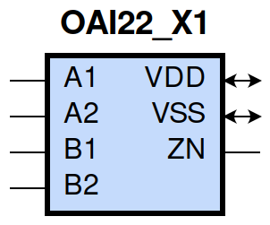
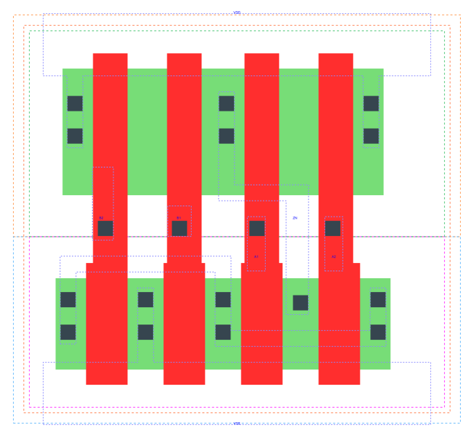

====================================
gf180mcu_fd_sc_mcu9t5v0__oai22_x1
====================================

**gf180mcu_fd_sc_mcu9t5v0__oai22_x1 symbol**

**gf180mcu_fd_sc_mcu9t5v0__oai22_x1 schematic**

**gf180mcu_fd_sc_mcu9t5v0__oai22_x1 layout**

.. include:: images.rst
| OAI22_X1 is a two 2-input OR into 2-input NAND with 1X drive strength

|
| Attributes

============= ======================
**Attribute** **Value**
area          28.224000 µm\ :sup:`2`
============= ======================

|
| OUTPUT FUNCTIONS

============== =============================
**Output Pin** **Function**
ZN             (((!A1)&(!A2))|((!B1)&(!B2)))
============== =============================

|
| TRUTH TABLE FOR ZN

====== ====== ====== ====== ======
**A1** **A2** **B1** **B2** **ZN**
0      0      ?      ?      1
?      ?      0      0      1
1      ?      1      ?      0
1      ?      ?      1      0
?      1      1      ?      0
?      1      ?      1      0
====== ====== ====== ====== ======

|
| FUNCTIONAL SCHEMATIC

| |image554|

| PIN CAPACITANCE (pf)

======= ======== ====================
**Pin** **Type** **Capacitance (pf)**
B2      input    0.0066
B1      input    0.0067
A1      input    0.0070
A2      input    0.0066
======= ======== ====================

|
| DELAY AND OUTPUT TRANSITION TIME corresponding to min slew and load

+---------------+------------+--------------------+--------------+-------------------+----------------+---------------+
| **Input Pin** | **Output** | **When Condition** | **Tin (ns)** | **Out Load (pf)** | **Delay (ns)** | **Tout (ns)** |
+---------------+------------+--------------------+--------------+-------------------+----------------+---------------+
| B2(HL)        | ZN(LH)     | !A1&A2&!B1         | 0.0100       | 0.0010            | 0.2130         | 0.1791        |
+---------------+------------+--------------------+--------------+-------------------+----------------+---------------+
| B2(HL)        | ZN(LH)     | A1&!A2&!B1         | 0.0100       | 0.0010            | 0.2010         | 0.1349        |
+---------------+------------+--------------------+--------------+-------------------+----------------+---------------+
| B2(HL)        | ZN(LH)     | A1&A2&!B1          | 0.0100       | 0.0010            | 0.2268         | 0.1537        |
+---------------+------------+--------------------+--------------+-------------------+----------------+---------------+
| B2(LH)        | ZN(HL)     | !A1&A2&!B1         | 0.0100       | 0.0010            | 0.1273         | 0.0613        |
+---------------+------------+--------------------+--------------+-------------------+----------------+---------------+
| B2(LH)        | ZN(HL)     | A1&!A2&!B1         | 0.0100       | 0.0010            | 0.1035         | 0.0465        |
+---------------+------------+--------------------+--------------+-------------------+----------------+---------------+
| B2(LH)        | ZN(HL)     | A1&A2&!B1          | 0.0100       | 0.0010            | 0.0870         | 0.0436        |
+---------------+------------+--------------------+--------------+-------------------+----------------+---------------+
| B1(HL)        | ZN(LH)     | !A1&A2&!B2         | 0.0100       | 0.0010            | 0.1890         | 0.1789        |
+---------------+------------+--------------------+--------------+-------------------+----------------+---------------+
| B1(HL)        | ZN(LH)     | A1&!A2&!B2         | 0.0100       | 0.0010            | 0.1770         | 0.1353        |
+---------------+------------+--------------------+--------------+-------------------+----------------+---------------+
| B1(HL)        | ZN(LH)     | A1&A2&!B2          | 0.0100       | 0.0010            | 0.2029         | 0.1537        |
+---------------+------------+--------------------+--------------+-------------------+----------------+---------------+
| B1(LH)        | ZN(HL)     | !A1&A2&!B2         | 0.0100       | 0.0010            | 0.1057         | 0.0466        |
+---------------+------------+--------------------+--------------+-------------------+----------------+---------------+
| B1(LH)        | ZN(HL)     | A1&!A2&!B2         | 0.0100       | 0.0010            | 0.0843         | 0.0321        |
+---------------+------------+--------------------+--------------+-------------------+----------------+---------------+
| B1(LH)        | ZN(HL)     | A1&A2&!B2          | 0.0100       | 0.0010            | 0.0729         | 0.0324        |
+---------------+------------+--------------------+--------------+-------------------+----------------+---------------+
| A1(HL)        | ZN(LH)     | !A2&!B1&B2         | 0.0100       | 0.0010            | 0.1031         | 0.1080        |
+---------------+------------+--------------------+--------------+-------------------+----------------+---------------+
| A1(HL)        | ZN(LH)     | !A2&B1&!B2         | 0.0100       | 0.0010            | 0.0949         | 0.0697        |
+---------------+------------+--------------------+--------------+-------------------+----------------+---------------+
| A1(HL)        | ZN(LH)     | !A2&B1&B2          | 0.0100       | 0.0010            | 0.0938         | 0.0697        |
+---------------+------------+--------------------+--------------+-------------------+----------------+---------------+
| A1(LH)        | ZN(HL)     | !A2&!B1&B2         | 0.0100       | 0.0010            | 0.0736         | 0.0460        |
+---------------+------------+--------------------+--------------+-------------------+----------------+---------------+
| A1(LH)        | ZN(HL)     | !A2&B1&!B2         | 0.0100       | 0.0010            | 0.0527         | 0.0309        |
+---------------+------------+--------------------+--------------+-------------------+----------------+---------------+
| A1(LH)        | ZN(HL)     | !A2&B1&B2          | 0.0100       | 0.0010            | 0.0463         | 0.0242        |
+---------------+------------+--------------------+--------------+-------------------+----------------+---------------+
| A2(HL)        | ZN(LH)     | !A1&!B1&B2         | 0.0100       | 0.0010            | 0.1273         | 0.1084        |
+---------------+------------+--------------------+--------------+-------------------+----------------+---------------+
| A2(HL)        | ZN(LH)     | !A1&B1&!B2         | 0.0100       | 0.0010            | 0.1188         | 0.0703        |
+---------------+------------+--------------------+--------------+-------------------+----------------+---------------+
| A2(HL)        | ZN(LH)     | !A1&B1&B2          | 0.0100       | 0.0010            | 0.1180         | 0.0702        |
+---------------+------------+--------------------+--------------+-------------------+----------------+---------------+
| A2(LH)        | ZN(HL)     | !A1&!B1&B2         | 0.0100       | 0.0010            | 0.0952         | 0.0613        |
+---------------+------------+--------------------+--------------+-------------------+----------------+---------------+
| A2(LH)        | ZN(HL)     | !A1&B1&!B2         | 0.0100       | 0.0010            | 0.0713         | 0.0465        |
+---------------+------------+--------------------+--------------+-------------------+----------------+---------------+
| A2(LH)        | ZN(HL)     | !A1&B1&B2          | 0.0100       | 0.0010            | 0.0603         | 0.0360        |
+---------------+------------+--------------------+--------------+-------------------+----------------+---------------+

|
| DYNAMIC ENERGY

+---------------+--------------------+--------------+------------+-------------------+---------------------+
| **Input Pin** | **When Condition** | **Tin (ns)** | **Output** | **Out Load (pf)** | **Energy (uW/MHz)** |
+---------------+--------------------+--------------+------------+-------------------+---------------------+
| A1            | !A2&!B1&B2         | 0.0100       | ZN(LH)     | 0.0010            | 0.2102              |
+---------------+--------------------+--------------+------------+-------------------+---------------------+
| A1            | !A2&B1&!B2         | 0.0100       | ZN(LH)     | 0.0010            | 0.1659              |
+---------------+--------------------+--------------+------------+-------------------+---------------------+
| A1            | !A2&B1&B2          | 0.0100       | ZN(LH)     | 0.0010            | 0.1646              |
+---------------+--------------------+--------------+------------+-------------------+---------------------+
| B2            | !A1&A2&!B1         | 0.0100       | ZN(LH)     | 0.0010            | 0.4040              |
+---------------+--------------------+--------------+------------+-------------------+---------------------+
| B2            | A1&!A2&!B1         | 0.0100       | ZN(LH)     | 0.0010            | 0.3596              |
+---------------+--------------------+--------------+------------+-------------------+---------------------+
| B2            | A1&A2&!B1          | 0.0100       | ZN(LH)     | 0.0010            | 0.3954              |
+---------------+--------------------+--------------+------------+-------------------+---------------------+
| B1            | !A1&A2&!B2         | 0.0100       | ZN(LH)     | 0.0010            | 0.3596              |
+---------------+--------------------+--------------+------------+-------------------+---------------------+
| B1            | A1&!A2&!B2         | 0.0100       | ZN(LH)     | 0.0010            | 0.3151              |
+---------------+--------------------+--------------+------------+-------------------+---------------------+
| B1            | A1&A2&!B2          | 0.0100       | ZN(LH)     | 0.0010            | 0.3511              |
+---------------+--------------------+--------------+------------+-------------------+---------------------+
| A2            | !A1&!B1&B2         | 0.0100       | ZN(LH)     | 0.0010            | 0.2551              |
+---------------+--------------------+--------------+------------+-------------------+---------------------+
| A2            | !A1&B1&!B2         | 0.0100       | ZN(LH)     | 0.0010            | 0.2108              |
+---------------+--------------------+--------------+------------+-------------------+---------------------+
| A2            | !A1&B1&B2          | 0.0100       | ZN(LH)     | 0.0010            | 0.2096              |
+---------------+--------------------+--------------+------------+-------------------+---------------------+
| B1            | !A1&A2&!B2         | 0.0100       | ZN(HL)     | 0.0010            | 0.0460              |
+---------------+--------------------+--------------+------------+-------------------+---------------------+
| B1            | A1&!A2&!B2         | 0.0100       | ZN(HL)     | 0.0010            | 0.0076              |
+---------------+--------------------+--------------+------------+-------------------+---------------------+
| B1            | A1&A2&!B2          | 0.0100       | ZN(HL)     | 0.0010            | 0.0079              |
+---------------+--------------------+--------------+------------+-------------------+---------------------+
| A1            | !A2&!B1&B2         | 0.0100       | ZN(HL)     | 0.0010            | 0.0462              |
+---------------+--------------------+--------------+------------+-------------------+---------------------+
| A1            | !A2&B1&!B2         | 0.0100       | ZN(HL)     | 0.0010            | 0.0083              |
+---------------+--------------------+--------------+------------+-------------------+---------------------+
| A1            | !A2&B1&B2          | 0.0100       | ZN(HL)     | 0.0010            | 0.0083              |
+---------------+--------------------+--------------+------------+-------------------+---------------------+
| B2            | !A1&A2&!B1         | 0.0100       | ZN(HL)     | 0.0010            | 0.0780              |
+---------------+--------------------+--------------+------------+-------------------+---------------------+
| B2            | A1&!A2&!B1         | 0.0100       | ZN(HL)     | 0.0010            | 0.0410              |
+---------------+--------------------+--------------+------------+-------------------+---------------------+
| B2            | A1&A2&!B1          | 0.0100       | ZN(HL)     | 0.0010            | 0.0410              |
+---------------+--------------------+--------------+------------+-------------------+---------------------+
| A2            | !A1&!B1&B2         | 0.0100       | ZN(HL)     | 0.0010            | 0.0786              |
+---------------+--------------------+--------------+------------+-------------------+---------------------+
| A2            | !A1&B1&!B2         | 0.0100       | ZN(HL)     | 0.0010            | 0.0413              |
+---------------+--------------------+--------------+------------+-------------------+---------------------+
| A2            | !A1&B1&B2          | 0.0100       | ZN(HL)     | 0.0010            | 0.0414              |
+---------------+--------------------+--------------+------------+-------------------+---------------------+
| A1(LH)        | !A2&!B1&!B2        | 0.0100       | n/a        | n/a               | 0.0403              |
+---------------+--------------------+--------------+------------+-------------------+---------------------+
| A1(LH)        | A2&!B1&!B2         | 0.0100       | n/a        | n/a               | -0.0656             |
+---------------+--------------------+--------------+------------+-------------------+---------------------+
| A1(LH)        | A2&!B1&B2          | 0.0100       | n/a        | n/a               | -0.0169             |
+---------------+--------------------+--------------+------------+-------------------+---------------------+
| A1(LH)        | A2&B1&!B2          | 0.0100       | n/a        | n/a               | -0.0169             |
+---------------+--------------------+--------------+------------+-------------------+---------------------+
| A1(LH)        | A2&B1&B2           | 0.0100       | n/a        | n/a               | -0.0169             |
+---------------+--------------------+--------------+------------+-------------------+---------------------+
| B2(LH)        | !A1&!A2&!B1        | 0.0100       | n/a        | n/a               | -0.0596             |
+---------------+--------------------+--------------+------------+-------------------+---------------------+
| B2(LH)        | !A1&!A2&B1         | 0.0100       | n/a        | n/a               | -0.0577             |
+---------------+--------------------+--------------+------------+-------------------+---------------------+
| B2(LH)        | !A1&A2&B1          | 0.0100       | n/a        | n/a               | -0.0498             |
+---------------+--------------------+--------------+------------+-------------------+---------------------+
| B2(LH)        | A1&!A2&B1          | 0.0100       | n/a        | n/a               | -0.0498             |
+---------------+--------------------+--------------+------------+-------------------+---------------------+
| B2(LH)        | A1&A2&B1           | 0.0100       | n/a        | n/a               | -0.0498             |
+---------------+--------------------+--------------+------------+-------------------+---------------------+
| A2(HL)        | !A1&!B1&!B2        | 0.0100       | n/a        | n/a               | 0.0670              |
+---------------+--------------------+--------------+------------+-------------------+---------------------+
| A2(HL)        | A1&!B1&!B2         | 0.0100       | n/a        | n/a               | 0.0685              |
+---------------+--------------------+--------------+------------+-------------------+---------------------+
| A2(HL)        | A1&!B1&B2          | 0.0100       | n/a        | n/a               | 0.0595              |
+---------------+--------------------+--------------+------------+-------------------+---------------------+
| A2(HL)        | A1&B1&!B2          | 0.0100       | n/a        | n/a               | 0.0595              |
+---------------+--------------------+--------------+------------+-------------------+---------------------+
| A2(HL)        | A1&B1&B2           | 0.0100       | n/a        | n/a               | 0.0595              |
+---------------+--------------------+--------------+------------+-------------------+---------------------+
| B1(HL)        | !A1&!A2&!B2        | 0.0100       | n/a        | n/a               | 0.0665              |
+---------------+--------------------+--------------+------------+-------------------+---------------------+
| B1(HL)        | !A1&!A2&B2         | 0.0100       | n/a        | n/a               | 0.0599              |
+---------------+--------------------+--------------+------------+-------------------+---------------------+
| B1(HL)        | !A1&A2&B2          | 0.0100       | n/a        | n/a               | 0.0397              |
+---------------+--------------------+--------------+------------+-------------------+---------------------+
| B1(HL)        | A1&!A2&B2          | 0.0100       | n/a        | n/a               | 0.0397              |
+---------------+--------------------+--------------+------------+-------------------+---------------------+
| B1(HL)        | A1&A2&B2           | 0.0100       | n/a        | n/a               | 0.0397              |
+---------------+--------------------+--------------+------------+-------------------+---------------------+
| B2(HL)        | !A1&!A2&!B1        | 0.0100       | n/a        | n/a               | 0.0662              |
+---------------+--------------------+--------------+------------+-------------------+---------------------+
| B2(HL)        | !A1&!A2&B1         | 0.0100       | n/a        | n/a               | 0.0595              |
+---------------+--------------------+--------------+------------+-------------------+---------------------+
| B2(HL)        | !A1&A2&B1          | 0.0100       | n/a        | n/a               | 0.0595              |
+---------------+--------------------+--------------+------------+-------------------+---------------------+
| B2(HL)        | A1&!A2&B1          | 0.0100       | n/a        | n/a               | 0.0595              |
+---------------+--------------------+--------------+------------+-------------------+---------------------+
| B2(HL)        | A1&A2&B1           | 0.0100       | n/a        | n/a               | 0.0595              |
+---------------+--------------------+--------------+------------+-------------------+---------------------+
| A1(HL)        | !A2&!B1&!B2        | 0.0100       | n/a        | n/a               | 0.0674              |
+---------------+--------------------+--------------+------------+-------------------+---------------------+
| A1(HL)        | A2&!B1&!B2         | 0.0100       | n/a        | n/a               | 0.0687              |
+---------------+--------------------+--------------+------------+-------------------+---------------------+
| A1(HL)        | A2&!B1&B2          | 0.0100       | n/a        | n/a               | 0.0397              |
+---------------+--------------------+--------------+------------+-------------------+---------------------+
| A1(HL)        | A2&B1&!B2          | 0.0100       | n/a        | n/a               | 0.0397              |
+---------------+--------------------+--------------+------------+-------------------+---------------------+
| A1(HL)        | A2&B1&B2           | 0.0100       | n/a        | n/a               | 0.0397              |
+---------------+--------------------+--------------+------------+-------------------+---------------------+
| B1(LH)        | !A1&!A2&!B2        | 0.0100       | n/a        | n/a               | -0.0601             |
+---------------+--------------------+--------------+------------+-------------------+---------------------+
| B1(LH)        | !A1&!A2&B2         | 0.0100       | n/a        | n/a               | -0.0584             |
+---------------+--------------------+--------------+------------+-------------------+---------------------+
| B1(LH)        | !A1&A2&B2          | 0.0100       | n/a        | n/a               | -0.0169             |
+---------------+--------------------+--------------+------------+-------------------+---------------------+
| B1(LH)        | A1&!A2&B2          | 0.0100       | n/a        | n/a               | -0.0169             |
+---------------+--------------------+--------------+------------+-------------------+---------------------+
| B1(LH)        | A1&A2&B2           | 0.0100       | n/a        | n/a               | -0.0169             |
+---------------+--------------------+--------------+------------+-------------------+---------------------+
| A2(LH)        | !A1&!B1&!B2        | 0.0100       | n/a        | n/a               | 0.0410              |
+---------------+--------------------+--------------+------------+-------------------+---------------------+
| A2(LH)        | A1&!B1&!B2         | 0.0100       | n/a        | n/a               | -0.0649             |
+---------------+--------------------+--------------+------------+-------------------+---------------------+
| A2(LH)        | A1&!B1&B2          | 0.0100       | n/a        | n/a               | -0.0497             |
+---------------+--------------------+--------------+------------+-------------------+---------------------+
| A2(LH)        | A1&B1&!B2          | 0.0100       | n/a        | n/a               | -0.0497             |
+---------------+--------------------+--------------+------------+-------------------+---------------------+
| A2(LH)        | A1&B1&B2           | 0.0100       | n/a        | n/a               | -0.0497             |
+---------------+--------------------+--------------+------------+-------------------+---------------------+

|
| LEAKAGE POWER

================== ==============
**When Condition** **Power (nW)**
!A1&!A2&!B1&!B2    0.1005
!A1&!A2&!B1&B2     0.1012
!A1&!A2&B1&!B2     0.1012
!A1&!A2&B1&B2      0.1012
!A1&A2&!B1&!B2     0.1804
A1&!A2&!B1&!B2     0.1804
A1&A2&!B1&!B2      0.1808
!A1&A2&!B1&B2      0.1746
!A1&A2&B1&!B2      0.1392
!A1&A2&B1&B2       0.1392
A1&!A2&!B1&B2      0.1392
A1&!A2&B1&!B2      0.1037
A1&!A2&B1&B2       0.1037
A1&A2&!B1&B2       0.1392
A1&A2&B1&!B2       0.1037
A1&A2&B1&B2        0.1037
================== ==============

