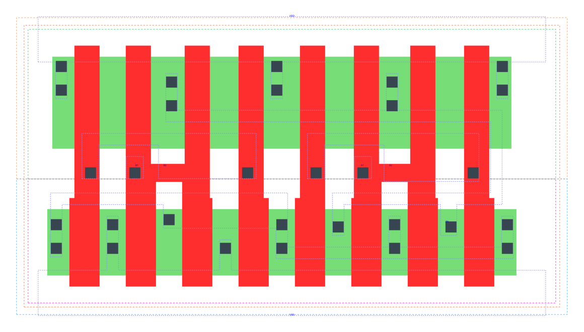

====================================
gf180mcu_fd_sc_mcu9t5v0__oai22_x2
====================================

**gf180mcu_fd_sc_mcu9t5v0__oai22_x2 symbol**

.. image:: sc9_sym/OAI22_X2_sym.png
    :height: 200px
    :width: 400 px
    :align: center
    :alt: gf180mcu_fd_sc_mcu9t5v0__oai22_x2 symbol

**gf180mcu_fd_sc_mcu9t5v0__oai22_x2 schematic**

.. image:: sc9_sch/OAI22_X2_sch.png
    :height: 250px
    :width: 450 px
    :align: center
    :alt: gf180mcu_fd_sc_mcu9t5v0__oai22_x2 schematic

**gf180mcu_fd_sc_mcu9t5v0__oai22_x2 layout**

.. include:: images.rst
| OAI22_X2 is a two 2-input OR into 2-input NAND with 2X drive strength

|
| Attributes

============= ======================
**Attribute** **Value**
area          50.803200 µm\ :sup:`2`
============= ======================

|
| OUTPUT FUNCTIONS

============== =============================
**Output Pin** **Function**
ZN             (((!A1)&(!A2))|((!B1)&(!B2)))
============== =============================

|
| TRUTH TABLE FOR ZN

====== ====== ====== ====== ======
**A1** **A2** **B1** **B2** **ZN**
0      0      ?      ?      1
?      ?      0      0      1
1      ?      1      ?      0
1      ?      ?      1      0
?      1      1      ?      0
?      1      ?      1      0
====== ====== ====== ====== ======

|
| FUNCTIONAL SCHEMATIC

| |image557|

| PIN CAPACITANCE (pf)

======= ======== ====================
**Pin** **Type** **Capacitance (pf)**
B2      input    0.0139
B1      input    0.0134
A2      input    0.0142
A1      input    0.0135
======= ======== ====================

|
| DELAY AND OUTPUT TRANSITION TIME corresponding to min slew and load

+---------------+------------+--------------------+--------------+-------------------+----------------+---------------+
| **Input Pin** | **Output** | **When Condition** | **Tin (ns)** | **Out Load (pf)** | **Delay (ns)** | **Tout (ns)** |
+---------------+------------+--------------------+--------------+-------------------+----------------+---------------+
| B2(HL)        | ZN(LH)     | !A1&A2&!B1         | 0.0100       | 0.0010            | 0.2077         | 0.1747        |
+---------------+------------+--------------------+--------------+-------------------+----------------+---------------+
| B2(HL)        | ZN(LH)     | A1&!A2&!B1         | 0.0100       | 0.0010            | 0.1961         | 0.1316        |
+---------------+------------+--------------------+--------------+-------------------+----------------+---------------+
| B2(HL)        | ZN(LH)     | A1&A2&!B1          | 0.0100       | 0.0010            | 0.2213         | 0.1497        |
+---------------+------------+--------------------+--------------+-------------------+----------------+---------------+
| B2(LH)        | ZN(HL)     | !A1&A2&!B1         | 0.0100       | 0.0010            | 0.1252         | 0.0612        |
+---------------+------------+--------------------+--------------+-------------------+----------------+---------------+
| B2(LH)        | ZN(HL)     | A1&!A2&!B1         | 0.0100       | 0.0010            | 0.1016         | 0.0466        |
+---------------+------------+--------------------+--------------+-------------------+----------------+---------------+
| B2(LH)        | ZN(HL)     | A1&A2&!B1          | 0.0100       | 0.0010            | 0.0853         | 0.0433        |
+---------------+------------+--------------------+--------------+-------------------+----------------+---------------+
| B1(HL)        | ZN(LH)     | !A1&A2&!B2         | 0.0100       | 0.0010            | 0.1840         | 0.1745        |
+---------------+------------+--------------------+--------------+-------------------+----------------+---------------+
| B1(HL)        | ZN(LH)     | A1&!A2&!B2         | 0.0100       | 0.0010            | 0.1725         | 0.1314        |
+---------------+------------+--------------------+--------------+-------------------+----------------+---------------+
| B1(HL)        | ZN(LH)     | A1&A2&!B2          | 0.0100       | 0.0010            | 0.1977         | 0.1498        |
+---------------+------------+--------------------+--------------+-------------------+----------------+---------------+
| B1(LH)        | ZN(HL)     | !A1&A2&!B2         | 0.0100       | 0.0010            | 0.1040         | 0.0465        |
+---------------+------------+--------------------+--------------+-------------------+----------------+---------------+
| B1(LH)        | ZN(HL)     | A1&!A2&!B2         | 0.0100       | 0.0010            | 0.0827         | 0.0321        |
+---------------+------------+--------------------+--------------+-------------------+----------------+---------------+
| B1(LH)        | ZN(HL)     | A1&A2&!B2          | 0.0100       | 0.0010            | 0.0715         | 0.0321        |
+---------------+------------+--------------------+--------------+-------------------+----------------+---------------+
| A2(HL)        | ZN(LH)     | !A1&!B1&B2         | 0.0100       | 0.0010            | 0.1275         | 0.1085        |
+---------------+------------+--------------------+--------------+-------------------+----------------+---------------+
| A2(HL)        | ZN(LH)     | !A1&B1&!B2         | 0.0100       | 0.0010            | 0.1194         | 0.0705        |
+---------------+------------+--------------------+--------------+-------------------+----------------+---------------+
| A2(HL)        | ZN(LH)     | !A1&B1&B2          | 0.0100       | 0.0010            | 0.1184         | 0.0705        |
+---------------+------------+--------------------+--------------+-------------------+----------------+---------------+
| A2(LH)        | ZN(HL)     | !A1&!B1&B2         | 0.0100       | 0.0010            | 0.0955         | 0.0612        |
+---------------+------------+--------------------+--------------+-------------------+----------------+---------------+
| A2(LH)        | ZN(HL)     | !A1&B1&!B2         | 0.0100       | 0.0010            | 0.0720         | 0.0467        |
+---------------+------------+--------------------+--------------+-------------------+----------------+---------------+
| A2(LH)        | ZN(HL)     | !A1&B1&B2          | 0.0100       | 0.0010            | 0.0606         | 0.0360        |
+---------------+------------+--------------------+--------------+-------------------+----------------+---------------+
| A1(HL)        | ZN(LH)     | !A2&!B1&B2         | 0.0100       | 0.0010            | 0.1038         | 0.1082        |
+---------------+------------+--------------------+--------------+-------------------+----------------+---------------+
| A1(HL)        | ZN(LH)     | !A2&B1&!B2         | 0.0100       | 0.0010            | 0.0955         | 0.0701        |
+---------------+------------+--------------------+--------------+-------------------+----------------+---------------+
| A1(HL)        | ZN(LH)     | !A2&B1&B2          | 0.0100       | 0.0010            | 0.0943         | 0.0701        |
+---------------+------------+--------------------+--------------+-------------------+----------------+---------------+
| A1(LH)        | ZN(HL)     | !A2&!B1&B2         | 0.0100       | 0.0010            | 0.0742         | 0.0463        |
+---------------+------------+--------------------+--------------+-------------------+----------------+---------------+
| A1(LH)        | ZN(HL)     | !A2&B1&!B2         | 0.0100       | 0.0010            | 0.0535         | 0.0312        |
+---------------+------------+--------------------+--------------+-------------------+----------------+---------------+
| A1(LH)        | ZN(HL)     | !A2&B1&B2          | 0.0100       | 0.0010            | 0.0467         | 0.0244        |
+---------------+------------+--------------------+--------------+-------------------+----------------+---------------+

|
| DYNAMIC ENERGY

+---------------+--------------------+--------------+------------+-------------------+---------------------+
| **Input Pin** | **When Condition** | **Tin (ns)** | **Output** | **Out Load (pf)** | **Energy (uW/MHz)** |
+---------------+--------------------+--------------+------------+-------------------+---------------------+
| A1            | !A2&!B1&B2         | 0.0100       | ZN(LH)     | 0.0010            | 0.4460              |
+---------------+--------------------+--------------+------------+-------------------+---------------------+
| A1            | !A2&B1&!B2         | 0.0100       | ZN(LH)     | 0.0010            | 0.3572              |
+---------------+--------------------+--------------+------------+-------------------+---------------------+
| A1            | !A2&B1&B2          | 0.0100       | ZN(LH)     | 0.0010            | 0.3541              |
+---------------+--------------------+--------------+------------+-------------------+---------------------+
| B2            | !A1&A2&!B1         | 0.0100       | ZN(LH)     | 0.0010            | 0.8121              |
+---------------+--------------------+--------------+------------+-------------------+---------------------+
| B2            | A1&!A2&!B1         | 0.0100       | ZN(LH)     | 0.0010            | 0.7236              |
+---------------+--------------------+--------------+------------+-------------------+---------------------+
| B2            | A1&A2&!B1          | 0.0100       | ZN(LH)     | 0.0010            | 0.7957              |
+---------------+--------------------+--------------+------------+-------------------+---------------------+
| B1            | !A1&A2&!B2         | 0.0100       | ZN(LH)     | 0.0010            | 0.7228              |
+---------------+--------------------+--------------+------------+-------------------+---------------------+
| B1            | A1&!A2&!B2         | 0.0100       | ZN(LH)     | 0.0010            | 0.6346              |
+---------------+--------------------+--------------+------------+-------------------+---------------------+
| B1            | A1&A2&!B2          | 0.0100       | ZN(LH)     | 0.0010            | 0.7066              |
+---------------+--------------------+--------------+------------+-------------------+---------------------+
| A2            | !A1&!B1&B2         | 0.0100       | ZN(LH)     | 0.0010            | 0.5349              |
+---------------+--------------------+--------------+------------+-------------------+---------------------+
| A2            | !A1&B1&!B2         | 0.0100       | ZN(LH)     | 0.0010            | 0.4461              |
+---------------+--------------------+--------------+------------+-------------------+---------------------+
| A2            | !A1&B1&B2          | 0.0100       | ZN(LH)     | 0.0010            | 0.4437              |
+---------------+--------------------+--------------+------------+-------------------+---------------------+
| B1            | !A1&A2&!B2         | 0.0100       | ZN(HL)     | 0.0010            | 0.0937              |
+---------------+--------------------+--------------+------------+-------------------+---------------------+
| B1            | A1&!A2&!B2         | 0.0100       | ZN(HL)     | 0.0010            | 0.0170              |
+---------------+--------------------+--------------+------------+-------------------+---------------------+
| B1            | A1&A2&!B2          | 0.0100       | ZN(HL)     | 0.0010            | 0.0174              |
+---------------+--------------------+--------------+------------+-------------------+---------------------+
| A1            | !A2&!B1&B2         | 0.0100       | ZN(HL)     | 0.0010            | 0.0928              |
+---------------+--------------------+--------------+------------+-------------------+---------------------+
| A1            | !A2&B1&!B2         | 0.0100       | ZN(HL)     | 0.0010            | 0.0181              |
+---------------+--------------------+--------------+------------+-------------------+---------------------+
| A1            | !A2&B1&B2          | 0.0100       | ZN(HL)     | 0.0010            | 0.0182              |
+---------------+--------------------+--------------+------------+-------------------+---------------------+
| B2            | !A1&A2&!B1         | 0.0100       | ZN(HL)     | 0.0010            | 0.1565              |
+---------------+--------------------+--------------+------------+-------------------+---------------------+
| B2            | A1&!A2&!B1         | 0.0100       | ZN(HL)     | 0.0010            | 0.0826              |
+---------------+--------------------+--------------+------------+-------------------+---------------------+
| B2            | A1&A2&!B1          | 0.0100       | ZN(HL)     | 0.0010            | 0.0823              |
+---------------+--------------------+--------------+------------+-------------------+---------------------+
| A2            | !A1&!B1&B2         | 0.0100       | ZN(HL)     | 0.0010            | 0.1576              |
+---------------+--------------------+--------------+------------+-------------------+---------------------+
| A2            | !A1&B1&!B2         | 0.0100       | ZN(HL)     | 0.0010            | 0.0843              |
+---------------+--------------------+--------------+------------+-------------------+---------------------+
| A2            | !A1&B1&B2          | 0.0100       | ZN(HL)     | 0.0010            | 0.0846              |
+---------------+--------------------+--------------+------------+-------------------+---------------------+
| A1(LH)        | !A2&!B1&!B2        | 0.0100       | n/a        | n/a               | 0.0606              |
+---------------+--------------------+--------------+------------+-------------------+---------------------+
| A1(LH)        | A2&!B1&!B2         | 0.0100       | n/a        | n/a               | -0.1312             |
+---------------+--------------------+--------------+------------+-------------------+---------------------+
| A1(LH)        | A2&!B1&B2          | 0.0100       | n/a        | n/a               | -0.0338             |
+---------------+--------------------+--------------+------------+-------------------+---------------------+
| A1(LH)        | A2&B1&!B2          | 0.0100       | n/a        | n/a               | -0.0338             |
+---------------+--------------------+--------------+------------+-------------------+---------------------+
| A1(LH)        | A2&B1&B2           | 0.0100       | n/a        | n/a               | -0.0338             |
+---------------+--------------------+--------------+------------+-------------------+---------------------+
| B2(LH)        | !A1&!A2&!B1        | 0.0100       | n/a        | n/a               | -0.1190             |
+---------------+--------------------+--------------+------------+-------------------+---------------------+
| B2(LH)        | !A1&!A2&B1         | 0.0100       | n/a        | n/a               | -0.1154             |
+---------------+--------------------+--------------+------------+-------------------+---------------------+
| B2(LH)        | !A1&A2&B1          | 0.0100       | n/a        | n/a               | -0.0996             |
+---------------+--------------------+--------------+------------+-------------------+---------------------+
| B2(LH)        | A1&!A2&B1          | 0.0100       | n/a        | n/a               | -0.0995             |
+---------------+--------------------+--------------+------------+-------------------+---------------------+
| B2(LH)        | A1&A2&B1           | 0.0100       | n/a        | n/a               | -0.0995             |
+---------------+--------------------+--------------+------------+-------------------+---------------------+
| A2(HL)        | !A1&!B1&!B2        | 0.0100       | n/a        | n/a               | 0.1339              |
+---------------+--------------------+--------------+------------+-------------------+---------------------+
| A2(HL)        | A1&!B1&!B2         | 0.0100       | n/a        | n/a               | 0.1381              |
+---------------+--------------------+--------------+------------+-------------------+---------------------+
| A2(HL)        | A1&!B1&B2          | 0.0100       | n/a        | n/a               | 0.1189              |
+---------------+--------------------+--------------+------------+-------------------+---------------------+
| A2(HL)        | A1&B1&!B2          | 0.0100       | n/a        | n/a               | 0.1189              |
+---------------+--------------------+--------------+------------+-------------------+---------------------+
| A2(HL)        | A1&B1&B2           | 0.0100       | n/a        | n/a               | 0.1189              |
+---------------+--------------------+--------------+------------+-------------------+---------------------+
| B1(HL)        | !A1&!A2&!B2        | 0.0100       | n/a        | n/a               | 0.1336              |
+---------------+--------------------+--------------+------------+-------------------+---------------------+
| B1(HL)        | !A1&!A2&B2         | 0.0100       | n/a        | n/a               | 0.1195              |
+---------------+--------------------+--------------+------------+-------------------+---------------------+
| B1(HL)        | !A1&A2&B2          | 0.0100       | n/a        | n/a               | 0.0781              |
+---------------+--------------------+--------------+------------+-------------------+---------------------+
| B1(HL)        | A1&!A2&B2          | 0.0100       | n/a        | n/a               | 0.0781              |
+---------------+--------------------+--------------+------------+-------------------+---------------------+
| B1(HL)        | A1&A2&B2           | 0.0100       | n/a        | n/a               | 0.0781              |
+---------------+--------------------+--------------+------------+-------------------+---------------------+
| B2(HL)        | !A1&!A2&!B1        | 0.0100       | n/a        | n/a               | 0.1330              |
+---------------+--------------------+--------------+------------+-------------------+---------------------+
| B2(HL)        | !A1&!A2&B1         | 0.0100       | n/a        | n/a               | 0.1190              |
+---------------+--------------------+--------------+------------+-------------------+---------------------+
| B2(HL)        | !A1&A2&B1          | 0.0100       | n/a        | n/a               | 0.1189              |
+---------------+--------------------+--------------+------------+-------------------+---------------------+
| B2(HL)        | A1&!A2&B1          | 0.0100       | n/a        | n/a               | 0.1189              |
+---------------+--------------------+--------------+------------+-------------------+---------------------+
| B2(HL)        | A1&A2&B1           | 0.0100       | n/a        | n/a               | 0.1189              |
+---------------+--------------------+--------------+------------+-------------------+---------------------+
| A1(HL)        | !A2&!B1&!B2        | 0.0100       | n/a        | n/a               | 0.1344              |
+---------------+--------------------+--------------+------------+-------------------+---------------------+
| A1(HL)        | A2&!B1&!B2         | 0.0100       | n/a        | n/a               | 0.1382              |
+---------------+--------------------+--------------+------------+-------------------+---------------------+
| A1(HL)        | A2&!B1&B2          | 0.0100       | n/a        | n/a               | 0.0794              |
+---------------+--------------------+--------------+------------+-------------------+---------------------+
| A1(HL)        | A2&B1&!B2          | 0.0100       | n/a        | n/a               | 0.0794              |
+---------------+--------------------+--------------+------------+-------------------+---------------------+
| A1(HL)        | A2&B1&B2           | 0.0100       | n/a        | n/a               | 0.0794              |
+---------------+--------------------+--------------+------------+-------------------+---------------------+
| B1(LH)        | !A1&!A2&!B2        | 0.0100       | n/a        | n/a               | -0.1199             |
+---------------+--------------------+--------------+------------+-------------------+---------------------+
| B1(LH)        | !A1&!A2&B2         | 0.0100       | n/a        | n/a               | -0.1166             |
+---------------+--------------------+--------------+------------+-------------------+---------------------+
| B1(LH)        | !A1&A2&B2          | 0.0100       | n/a        | n/a               | -0.0337             |
+---------------+--------------------+--------------+------------+-------------------+---------------------+
| B1(LH)        | A1&!A2&B2          | 0.0100       | n/a        | n/a               | -0.0337             |
+---------------+--------------------+--------------+------------+-------------------+---------------------+
| B1(LH)        | A1&A2&B2           | 0.0100       | n/a        | n/a               | -0.0337             |
+---------------+--------------------+--------------+------------+-------------------+---------------------+
| A2(LH)        | !A1&!B1&!B2        | 0.0100       | n/a        | n/a               | 0.0618              |
+---------------+--------------------+--------------+------------+-------------------+---------------------+
| A2(LH)        | A1&!B1&!B2         | 0.0100       | n/a        | n/a               | -0.1299             |
+---------------+--------------------+--------------+------------+-------------------+---------------------+
| A2(LH)        | A1&!B1&B2          | 0.0100       | n/a        | n/a               | -0.0996             |
+---------------+--------------------+--------------+------------+-------------------+---------------------+
| A2(LH)        | A1&B1&!B2          | 0.0100       | n/a        | n/a               | -0.0996             |
+---------------+--------------------+--------------+------------+-------------------+---------------------+
| A2(LH)        | A1&B1&B2           | 0.0100       | n/a        | n/a               | -0.0995             |
+---------------+--------------------+--------------+------------+-------------------+---------------------+

|
| LEAKAGE POWER

================== ==============
**When Condition** **Power (nW)**
!A1&!A2&!B1&!B2    0.1510
!A1&!A2&!B1&B2     0.1523
!A1&!A2&B1&!B2     0.1523
!A1&!A2&B1&B2      0.1523
!A1&A2&!B1&!B2     0.3105
A1&!A2&!B1&!B2     0.3105
A1&A2&!B1&!B2      0.3113
!A1&A2&!B1&B2      0.2993
!A1&A2&B1&!B2      0.2283
!A1&A2&B1&B2       0.2283
A1&!A2&!B1&B2      0.2283
A1&!A2&B1&!B2      0.1574
A1&!A2&B1&B2       0.1574
A1&A2&!B1&B2       0.2283
A1&A2&B1&!B2       0.1574
A1&A2&B1&B2        0.1574
================== ==============

