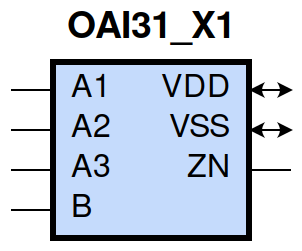
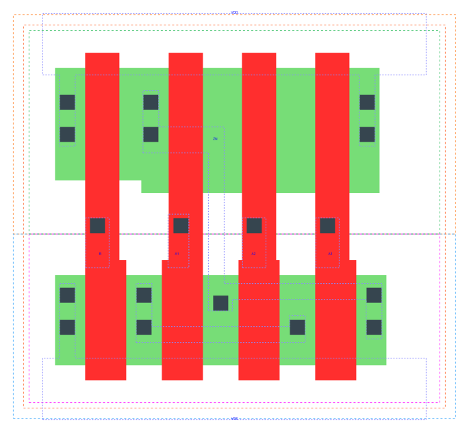

====================================
gf180mcu_fd_sc_mcu9t5v0__oai31_x1
====================================

**gf180mcu_fd_sc_mcu9t5v0__oai31_x1 symbol**

**gf180mcu_fd_sc_mcu9t5v0__oai31_x1 schematic**

.. image:: sc9_sch/OAI31_X1_sch.png
    :height: 250px
    :width: 450 px
    :align: center
    :alt: gf180mcu_fd_sc_mcu9t5v0__oai31_x1 schematic

**gf180mcu_fd_sc_mcu9t5v0__oai31_x1 layout**

.. include:: images.rst
| OAI31_X1 is a 3-input OR into 2-input NAND with 1X drive strength

|
| Attributes

============= ======================
**Attribute** **Value**
area          28.224000 µm\ :sup:`2`
============= ======================

|
| OUTPUT FUNCTIONS

============== ==========================
**Output Pin** **Function**
ZN             (((!A1)&(!A2)&(!A3))|(!B))
============== ==========================

|
| TRUTH TABLE FOR ZN

====== ====== ====== ===== ======
**A1** **A2** **A3** **B** **ZN**
0      0      0      ?     1
?      ?      ?      0     1
1      ?      ?      1     0
?      1      ?      1     0
?      ?      1      1     0
====== ====== ====== ===== ======

|
| FUNCTIONAL SCHEMATIC

| |image563|

| PIN CAPACITANCE (pf)

======= ======== ====================
**Pin** **Type** **Capacitance (pf)**
B       input    0.0064
A1      input    0.0070
A2      input    0.0066
A3      input    0.0066
======= ======== ====================

|
| DELAY AND OUTPUT TRANSITION TIME corresponding to min slew and load

+---------------+------------+--------------------+--------------+-------------------+----------------+---------------+
| **Input Pin** | **Output** | **When Condition** | **Tin (ns)** | **Out Load (pf)** | **Delay (ns)** | **Tout (ns)** |
+---------------+------------+--------------------+--------------+-------------------+----------------+---------------+
| B(LH)         | ZN(HL)     | !A1&!A2&A3         | 0.0100       | 0.0010            | 0.1163         | 0.0660        |
+---------------+------------+--------------------+--------------+-------------------+----------------+---------------+
| B(LH)         | ZN(HL)     | !A1&A2&!A3         | 0.0100       | 0.0010            | 0.1077         | 0.0550        |
+---------------+------------+--------------------+--------------+-------------------+----------------+---------------+
| B(LH)         | ZN(HL)     | !A1&A2&A3          | 0.0100       | 0.0010            | 0.0896         | 0.0488        |
+---------------+------------+--------------------+--------------+-------------------+----------------+---------------+
| B(LH)         | ZN(HL)     | A1&!A2&!A3         | 0.0100       | 0.0010            | 0.0859         | 0.0399        |
+---------------+------------+--------------------+--------------+-------------------+----------------+---------------+
| B(LH)         | ZN(HL)     | A1&!A2&A3          | 0.0100       | 0.0010            | 0.0738         | 0.0374        |
+---------------+------------+--------------------+--------------+-------------------+----------------+---------------+
| B(LH)         | ZN(HL)     | A1&A2&!A3          | 0.0100       | 0.0010            | 0.0738         | 0.0374        |
+---------------+------------+--------------------+--------------+-------------------+----------------+---------------+
| B(LH)         | ZN(HL)     | A1&A2&A3           | 0.0100       | 0.0010            | 0.0726         | 0.0428        |
+---------------+------------+--------------------+--------------+-------------------+----------------+---------------+
| B(HL)         | ZN(LH)     | !A1&!A2&A3         | 0.0100       | 0.0010            | 0.1201         | 0.1109        |
+---------------+------------+--------------------+--------------+-------------------+----------------+---------------+
| B(HL)         | ZN(LH)     | !A1&A2&!A3         | 0.0100       | 0.0010            | 0.1202         | 0.1051        |
+---------------+------------+--------------------+--------------+-------------------+----------------+---------------+
| B(HL)         | ZN(LH)     | !A1&A2&A3          | 0.0100       | 0.0010            | 0.1357         | 0.1160        |
+---------------+------------+--------------------+--------------+-------------------+----------------+---------------+
| B(HL)         | ZN(LH)     | A1&!A2&!A3         | 0.0100       | 0.0010            | 0.1139         | 0.0811        |
+---------------+------------+--------------------+--------------+-------------------+----------------+---------------+
| B(HL)         | ZN(LH)     | A1&!A2&A3          | 0.0100       | 0.0010            | 0.1298         | 0.0922        |
+---------------+------------+--------------------+--------------+-------------------+----------------+---------------+
| B(HL)         | ZN(LH)     | A1&A2&!A3          | 0.0100       | 0.0010            | 0.1298         | 0.0922        |
+---------------+------------+--------------------+--------------+-------------------+----------------+---------------+
| B(HL)         | ZN(LH)     | A1&A2&A3           | 0.0100       | 0.0010            | 0.1438         | 0.1030        |
+---------------+------------+--------------------+--------------+-------------------+----------------+---------------+
| A1(HL)        | ZN(LH)     | !A2&!A3&B          | 0.0100       | 0.0010            | 0.1557         | 0.1358        |
+---------------+------------+--------------------+--------------+-------------------+----------------+---------------+
| A1(LH)        | ZN(HL)     | !A2&!A3&B          | 0.0100       | 0.0010            | 0.0637         | 0.0395        |
+---------------+------------+--------------------+--------------+-------------------+----------------+---------------+
| A2(HL)        | ZN(LH)     | !A1&!A3&B          | 0.0100       | 0.0010            | 0.2116         | 0.1375        |
+---------------+------------+--------------------+--------------+-------------------+----------------+---------------+
| A2(LH)        | ZN(HL)     | !A1&!A3&B          | 0.0100       | 0.0010            | 0.0845         | 0.0553        |
+---------------+------------+--------------------+--------------+-------------------+----------------+---------------+
| A3(LH)        | ZN(HL)     | !A1&!A2&B          | 0.0100       | 0.0010            | 0.0904         | 0.0684        |
+---------------+------------+--------------------+--------------+-------------------+----------------+---------------+
| A3(HL)        | ZN(LH)     | !A1&!A2&B          | 0.0100       | 0.0010            | 0.2345         | 0.1376        |
+---------------+------------+--------------------+--------------+-------------------+----------------+---------------+

|
| DYNAMIC ENERGY

+---------------+--------------------+--------------+------------+-------------------+---------------------+
| **Input Pin** | **When Condition** | **Tin (ns)** | **Output** | **Out Load (pf)** | **Energy (uW/MHz)** |
+---------------+--------------------+--------------+------------+-------------------+---------------------+
| A1            | !A2&!A3&B          | 0.0100       | ZN(LH)     | 0.0010            | 0.2121              |
+---------------+--------------------+--------------+------------+-------------------+---------------------+
| B             | !A1&!A2&A3         | 0.0100       | ZN(HL)     | 0.0010            | 0.0850              |
+---------------+--------------------+--------------+------------+-------------------+---------------------+
| B             | !A1&A2&!A3         | 0.0100       | ZN(HL)     | 0.0010            | 0.0484              |
+---------------+--------------------+--------------+------------+-------------------+---------------------+
| B             | !A1&A2&A3          | 0.0100       | ZN(HL)     | 0.0010            | 0.0485              |
+---------------+--------------------+--------------+------------+-------------------+---------------------+
| B             | A1&!A2&!A3         | 0.0100       | ZN(HL)     | 0.0010            | 0.0109              |
+---------------+--------------------+--------------+------------+-------------------+---------------------+
| B             | A1&!A2&A3          | 0.0100       | ZN(HL)     | 0.0010            | 0.0109              |
+---------------+--------------------+--------------+------------+-------------------+---------------------+
| B             | A1&A2&!A3          | 0.0100       | ZN(HL)     | 0.0010            | 0.0109              |
+---------------+--------------------+--------------+------------+-------------------+---------------------+
| B             | A1&A2&A3           | 0.0100       | ZN(HL)     | 0.0010            | 0.0109              |
+---------------+--------------------+--------------+------------+-------------------+---------------------+
| A2            | !A1&!A3&B          | 0.0100       | ZN(LH)     | 0.0010            | 0.2572              |
+---------------+--------------------+--------------+------------+-------------------+---------------------+
| A3            | !A1&!A2&B          | 0.0100       | ZN(HL)     | 0.0010            | 0.0799              |
+---------------+--------------------+--------------+------------+-------------------+---------------------+
| A1            | !A2&!A3&B          | 0.0100       | ZN(HL)     | 0.0010            | 0.0115              |
+---------------+--------------------+--------------+------------+-------------------+---------------------+
| B             | !A1&!A2&A3         | 0.0100       | ZN(LH)     | 0.0010            | 0.4129              |
+---------------+--------------------+--------------+------------+-------------------+---------------------+
| B             | !A1&A2&!A3         | 0.0100       | ZN(LH)     | 0.0010            | 0.3691              |
+---------------+--------------------+--------------+------------+-------------------+---------------------+
| B             | !A1&A2&A3          | 0.0100       | ZN(LH)     | 0.0010            | 0.4053              |
+---------------+--------------------+--------------+------------+-------------------+---------------------+
| B             | A1&!A2&!A3         | 0.0100       | ZN(LH)     | 0.0010            | 0.3242              |
+---------------+--------------------+--------------+------------+-------------------+---------------------+
| B             | A1&!A2&A3          | 0.0100       | ZN(LH)     | 0.0010            | 0.3604              |
+---------------+--------------------+--------------+------------+-------------------+---------------------+
| B             | A1&A2&!A3          | 0.0100       | ZN(LH)     | 0.0010            | 0.3604              |
+---------------+--------------------+--------------+------------+-------------------+---------------------+
| B             | A1&A2&A3           | 0.0100       | ZN(LH)     | 0.0010            | 0.3959              |
+---------------+--------------------+--------------+------------+-------------------+---------------------+
| A2            | !A1&!A3&B          | 0.0100       | ZN(HL)     | 0.0010            | 0.0473              |
+---------------+--------------------+--------------+------------+-------------------+---------------------+
| A3            | !A1&!A2&B          | 0.0100       | ZN(LH)     | 0.0010            | 0.3007              |
+---------------+--------------------+--------------+------------+-------------------+---------------------+
| B(HL)         | !A1&!A2&!A3        | 0.0100       | n/a        | n/a               | 0.0622              |
+---------------+--------------------+--------------+------------+-------------------+---------------------+
| A3(LH)        | !A1&!A2&!B         | 0.0100       | n/a        | n/a               | 0.0126              |
+---------------+--------------------+--------------+------------+-------------------+---------------------+
| A3(LH)        | !A1&A2&!B          | 0.0100       | n/a        | n/a               | -0.0650             |
+---------------+--------------------+--------------+------------+-------------------+---------------------+
| A3(LH)        | A1&!A2&!B          | 0.0100       | n/a        | n/a               | -0.0588             |
+---------------+--------------------+--------------+------------+-------------------+---------------------+
| A3(LH)        | A1&A2&!B           | 0.0100       | n/a        | n/a               | -0.0636             |
+---------------+--------------------+--------------+------------+-------------------+---------------------+
| A3(LH)        | !A1&A2&B           | 0.0100       | n/a        | n/a               | -0.0516             |
+---------------+--------------------+--------------+------------+-------------------+---------------------+
| A3(LH)        | A1&!A2&B           | 0.0100       | n/a        | n/a               | -0.0492             |
+---------------+--------------------+--------------+------------+-------------------+---------------------+
| A3(LH)        | A1&A2&B            | 0.0100       | n/a        | n/a               | -0.0563             |
+---------------+--------------------+--------------+------------+-------------------+---------------------+
| A2(LH)        | !A1&!A3&!B         | 0.0100       | n/a        | n/a               | 0.0125              |
+---------------+--------------------+--------------+------------+-------------------+---------------------+
| A2(LH)        | !A1&A3&!B          | 0.0100       | n/a        | n/a               | -0.0653             |
+---------------+--------------------+--------------+------------+-------------------+---------------------+
| A2(LH)        | A1&!A3&!B          | 0.0100       | n/a        | n/a               | -0.0652             |
+---------------+--------------------+--------------+------------+-------------------+---------------------+
| A2(LH)        | A1&A3&!B           | 0.0100       | n/a        | n/a               | -0.0630             |
+---------------+--------------------+--------------+------------+-------------------+---------------------+
| A2(LH)        | !A1&A3&B           | 0.0100       | n/a        | n/a               | -0.0180             |
+---------------+--------------------+--------------+------------+-------------------+---------------------+
| A2(LH)        | A1&!A3&B           | 0.0100       | n/a        | n/a               | -0.0496             |
+---------------+--------------------+--------------+------------+-------------------+---------------------+
| A2(LH)        | A1&A3&B            | 0.0100       | n/a        | n/a               | -0.0439             |
+---------------+--------------------+--------------+------------+-------------------+---------------------+
| A1(LH)        | !A2&!A3&!B         | 0.0100       | n/a        | n/a               | 0.0122              |
+---------------+--------------------+--------------+------------+-------------------+---------------------+
| A1(LH)        | !A2&A3&!B          | 0.0100       | n/a        | n/a               | -0.0595             |
+---------------+--------------------+--------------+------------+-------------------+---------------------+
| A1(LH)        | A2&!A3&!B          | 0.0100       | n/a        | n/a               | -0.0657             |
+---------------+--------------------+--------------+------------+-------------------+---------------------+
| A1(LH)        | A2&A3&!B           | 0.0100       | n/a        | n/a               | -0.0643             |
+---------------+--------------------+--------------+------------+-------------------+---------------------+
| A1(LH)        | !A2&A3&B           | 0.0100       | n/a        | n/a               | -0.0164             |
+---------------+--------------------+--------------+------------+-------------------+---------------------+
| A1(LH)        | A2&!A3&B           | 0.0100       | n/a        | n/a               | -0.0169             |
+---------------+--------------------+--------------+------------+-------------------+---------------------+
| A1(LH)        | A2&A3&B            | 0.0100       | n/a        | n/a               | -0.0168             |
+---------------+--------------------+--------------+------------+-------------------+---------------------+
| A3(HL)        | !A1&!A2&!B         | 0.0100       | n/a        | n/a               | 0.0670              |
+---------------+--------------------+--------------+------------+-------------------+---------------------+
| A3(HL)        | !A1&A2&!B          | 0.0100       | n/a        | n/a               | 0.0702              |
+---------------+--------------------+--------------+------------+-------------------+---------------------+
| A3(HL)        | A1&!A2&!B          | 0.0100       | n/a        | n/a               | 0.0701              |
+---------------+--------------------+--------------+------------+-------------------+---------------------+
| A3(HL)        | A1&A2&!B           | 0.0100       | n/a        | n/a               | 0.0702              |
+---------------+--------------------+--------------+------------+-------------------+---------------------+
| A3(HL)        | !A1&A2&B           | 0.0100       | n/a        | n/a               | 0.0596              |
+---------------+--------------------+--------------+------------+-------------------+---------------------+
| A3(HL)        | A1&!A2&B           | 0.0100       | n/a        | n/a               | 0.0597              |
+---------------+--------------------+--------------+------------+-------------------+---------------------+
| A3(HL)        | A1&A2&B            | 0.0100       | n/a        | n/a               | 0.0596              |
+---------------+--------------------+--------------+------------+-------------------+---------------------+
| A2(HL)        | !A1&!A3&!B         | 0.0100       | n/a        | n/a               | 0.0671              |
+---------------+--------------------+--------------+------------+-------------------+---------------------+
| A2(HL)        | !A1&A3&!B          | 0.0100       | n/a        | n/a               | 0.0700              |
+---------------+--------------------+--------------+------------+-------------------+---------------------+
| A2(HL)        | A1&!A3&!B          | 0.0100       | n/a        | n/a               | 0.0703              |
+---------------+--------------------+--------------+------------+-------------------+---------------------+
| A2(HL)        | A1&A3&!B           | 0.0100       | n/a        | n/a               | 0.0459              |
+---------------+--------------------+--------------+------------+-------------------+---------------------+
| A2(HL)        | !A1&A3&B           | 0.0100       | n/a        | n/a               | 0.0377              |
+---------------+--------------------+--------------+------------+-------------------+---------------------+
| A2(HL)        | A1&!A3&B           | 0.0100       | n/a        | n/a               | 0.0597              |
+---------------+--------------------+--------------+------------+-------------------+---------------------+
| A2(HL)        | A1&A3&B            | 0.0100       | n/a        | n/a               | 0.0351              |
+---------------+--------------------+--------------+------------+-------------------+---------------------+
| B(LH)         | !A1&!A2&!A3        | 0.0100       | n/a        | n/a               | -0.0538             |
+---------------+--------------------+--------------+------------+-------------------+---------------------+
| A1(HL)        | !A2&!A3&!B         | 0.0100       | n/a        | n/a               | 0.0673              |
+---------------+--------------------+--------------+------------+-------------------+---------------------+
| A1(HL)        | !A2&A3&!B          | 0.0100       | n/a        | n/a               | 0.0703              |
+---------------+--------------------+--------------+------------+-------------------+---------------------+
| A1(HL)        | A2&!A3&!B          | 0.0100       | n/a        | n/a               | 0.0704              |
+---------------+--------------------+--------------+------------+-------------------+---------------------+
| A1(HL)        | A2&A3&!B           | 0.0100       | n/a        | n/a               | 0.0705              |
+---------------+--------------------+--------------+------------+-------------------+---------------------+
| A1(HL)        | !A2&A3&B           | 0.0100       | n/a        | n/a               | 0.0764              |
+---------------+--------------------+--------------+------------+-------------------+---------------------+
| A1(HL)        | A2&!A3&B           | 0.0100       | n/a        | n/a               | 0.0397              |
+---------------+--------------------+--------------+------------+-------------------+---------------------+
| A1(HL)        | A2&A3&B            | 0.0100       | n/a        | n/a               | 0.0397              |
+---------------+--------------------+--------------+------------+-------------------+---------------------+

|
| LEAKAGE POWER

================== ==============
**When Condition** **Power (nW)**
!A1&!A2&!A3&!B     0.1256
!A1&!A2&!A3&B      0.1267
!A1&!A2&A3&!B      0.2047
!A1&A2&!A3&!B      0.2047
!A1&A2&A3&!B       0.2051
A1&!A2&!A3&!B      0.2047
A1&!A2&A3&!B       0.2051
A1&A2&!A3&!B       0.2051
A1&A2&A3&!B        0.2053
!A1&!A2&A3&B       0.1743
!A1&A2&!A3&B       0.1391
!A1&A2&A3&B        0.1391
A1&!A2&!A3&B       0.1036
A1&!A2&A3&B        0.1036
A1&A2&!A3&B        0.1036
A1&A2&A3&B         0.1036
================== ==============

