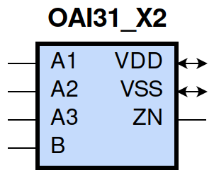
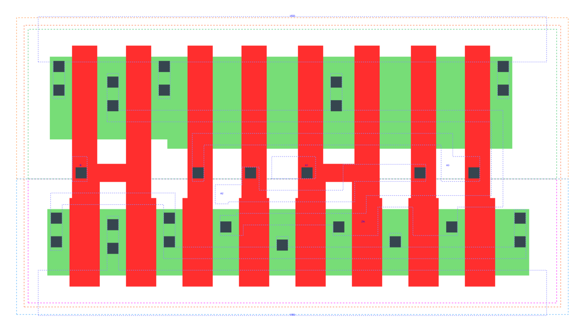

====================================
gf180mcu_fd_sc_mcu9t5v0__oai31_x2
====================================

**gf180mcu_fd_sc_mcu9t5v0__oai31_x2 symbol**

**gf180mcu_fd_sc_mcu9t5v0__oai31_x2 schematic**

.. image:: sc9_sch/OAI31_X2_sch.png
    :height: 250px
    :width: 450 px
    :align: center
    :alt: gf180mcu_fd_sc_mcu9t5v0__oai31_x2 schematic

**gf180mcu_fd_sc_mcu9t5v0__oai31_x2 layout**

.. include:: images.rst
| OAI31_X2 is a 3-input OR into 2-input NAND with 2X drive strength

|
| Attributes

============= ======================
**Attribute** **Value**
area          50.803200 µm\ :sup:`2`
============= ======================

|
| OUTPUT FUNCTIONS

============== ==========================
**Output Pin** **Function**
ZN             (((!A1)&(!A2)&(!A3))|(!B))
============== ==========================

|
| TRUTH TABLE FOR ZN

====== ====== ====== ===== ======
**A1** **A2** **A3** **B** **ZN**
0      0      0      ?     1
?      ?      ?      0     1
1      ?      ?      1     0
?      1      ?      1     0
?      ?      1      1     0
====== ====== ====== ===== ======

|
| FUNCTIONAL SCHEMATIC

| |image566|

| PIN CAPACITANCE (pf)

======= ======== ====================
**Pin** **Type** **Capacitance (pf)**
B       input    0.0128
A3      input    0.0145
A2      input    0.0141
A1      input    0.0137
======= ======== ====================

|
| DELAY AND OUTPUT TRANSITION TIME corresponding to min slew and load

+---------------+------------+--------------------+--------------+-------------------+----------------+---------------+
| **Input Pin** | **Output** | **When Condition** | **Tin (ns)** | **Out Load (pf)** | **Delay (ns)** | **Tout (ns)** |
+---------------+------------+--------------------+--------------+-------------------+----------------+---------------+
| B(LH)         | ZN(HL)     | !A1&!A2&A3         | 0.0100       | 0.0010            | 0.1165         | 0.0632        |
+---------------+------------+--------------------+--------------+-------------------+----------------+---------------+
| B(LH)         | ZN(HL)     | !A1&A2&!A3         | 0.0100       | 0.0010            | 0.1083         | 0.0525        |
+---------------+------------+--------------------+--------------+-------------------+----------------+---------------+
| B(LH)         | ZN(HL)     | !A1&A2&A3          | 0.0100       | 0.0010            | 0.0906         | 0.0477        |
+---------------+------------+--------------------+--------------+-------------------+----------------+---------------+
| B(LH)         | ZN(HL)     | A1&!A2&!A3         | 0.0100       | 0.0010            | 0.0865         | 0.0375        |
+---------------+------------+--------------------+--------------+-------------------+----------------+---------------+
| B(LH)         | ZN(HL)     | A1&!A2&A3          | 0.0100       | 0.0010            | 0.0746         | 0.0363        |
+---------------+------------+--------------------+--------------+-------------------+----------------+---------------+
| B(LH)         | ZN(HL)     | A1&A2&!A3          | 0.0100       | 0.0010            | 0.0747         | 0.0363        |
+---------------+------------+--------------------+--------------+-------------------+----------------+---------------+
| B(LH)         | ZN(HL)     | A1&A2&A3           | 0.0100       | 0.0010            | 0.0730         | 0.0422        |
+---------------+------------+--------------------+--------------+-------------------+----------------+---------------+
| B(HL)         | ZN(LH)     | !A1&!A2&A3         | 0.0100       | 0.0010            | 0.1217         | 0.1131        |
+---------------+------------+--------------------+--------------+-------------------+----------------+---------------+
| B(HL)         | ZN(LH)     | !A1&A2&!A3         | 0.0100       | 0.0010            | 0.1217         | 0.1069        |
+---------------+------------+--------------------+--------------+-------------------+----------------+---------------+
| B(HL)         | ZN(LH)     | !A1&A2&A3          | 0.0100       | 0.0010            | 0.1382         | 0.1179        |
+---------------+------------+--------------------+--------------+-------------------+----------------+---------------+
| B(HL)         | ZN(LH)     | A1&!A2&!A3         | 0.0100       | 0.0010            | 0.1150         | 0.0819        |
+---------------+------------+--------------------+--------------+-------------------+----------------+---------------+
| B(HL)         | ZN(LH)     | A1&!A2&A3          | 0.0100       | 0.0010            | 0.1319         | 0.0933        |
+---------------+------------+--------------------+--------------+-------------------+----------------+---------------+
| B(HL)         | ZN(LH)     | A1&A2&!A3          | 0.0100       | 0.0010            | 0.1319         | 0.0933        |
+---------------+------------+--------------------+--------------+-------------------+----------------+---------------+
| B(HL)         | ZN(LH)     | A1&A2&A3           | 0.0100       | 0.0010            | 0.1464         | 0.1043        |
+---------------+------------+--------------------+--------------+-------------------+----------------+---------------+
| A3(LH)        | ZN(HL)     | !A1&!A2&B          | 0.0100       | 0.0010            | 0.0852         | 0.0656        |
+---------------+------------+--------------------+--------------+-------------------+----------------+---------------+
| A3(HL)        | ZN(LH)     | !A1&!A2&B          | 0.0100       | 0.0010            | 0.2235         | 0.1288        |
+---------------+------------+--------------------+--------------+-------------------+----------------+---------------+
| A2(HL)        | ZN(LH)     | !A1&!A3&B          | 0.0100       | 0.0010            | 0.2008         | 0.1286        |
+---------------+------------+--------------------+--------------+-------------------+----------------+---------------+
| A2(LH)        | ZN(HL)     | !A1&!A3&B          | 0.0100       | 0.0010            | 0.0802         | 0.0527        |
+---------------+------------+--------------------+--------------+-------------------+----------------+---------------+
| A1(HL)        | ZN(LH)     | !A2&!A3&B          | 0.0100       | 0.0010            | 0.1441         | 0.1265        |
+---------------+------------+--------------------+--------------+-------------------+----------------+---------------+
| A1(LH)        | ZN(HL)     | !A2&!A3&B          | 0.0100       | 0.0010            | 0.0594         | 0.0366        |
+---------------+------------+--------------------+--------------+-------------------+----------------+---------------+

|
| DYNAMIC ENERGY

+---------------+--------------------+--------------+------------+-------------------+---------------------+
| **Input Pin** | **When Condition** | **Tin (ns)** | **Output** | **Out Load (pf)** | **Energy (uW/MHz)** |
+---------------+--------------------+--------------+------------+-------------------+---------------------+
| A1            | !A2&!A3&B          | 0.0100       | ZN(LH)     | 0.0010            | 0.4250              |
+---------------+--------------------+--------------+------------+-------------------+---------------------+
| B             | !A1&!A2&A3         | 0.0100       | ZN(HL)     | 0.0010            | 0.1626              |
+---------------+--------------------+--------------+------------+-------------------+---------------------+
| B             | !A1&A2&!A3         | 0.0100       | ZN(HL)     | 0.0010            | 0.0893              |
+---------------+--------------------+--------------+------------+-------------------+---------------------+
| B             | !A1&A2&A3          | 0.0100       | ZN(HL)     | 0.0010            | 0.0895              |
+---------------+--------------------+--------------+------------+-------------------+---------------------+
| B             | A1&!A2&!A3         | 0.0100       | ZN(HL)     | 0.0010            | 0.0117              |
+---------------+--------------------+--------------+------------+-------------------+---------------------+
| B             | A1&!A2&A3          | 0.0100       | ZN(HL)     | 0.0010            | 0.0118              |
+---------------+--------------------+--------------+------------+-------------------+---------------------+
| B             | A1&A2&!A3          | 0.0100       | ZN(HL)     | 0.0010            | 0.0118              |
+---------------+--------------------+--------------+------------+-------------------+---------------------+
| B             | A1&A2&A3           | 0.0100       | ZN(HL)     | 0.0010            | 0.0120              |
+---------------+--------------------+--------------+------------+-------------------+---------------------+
| A2            | !A1&!A3&B          | 0.0100       | ZN(LH)     | 0.0010            | 0.5144              |
+---------------+--------------------+--------------+------------+-------------------+---------------------+
| A3            | !A1&!A2&B          | 0.0100       | ZN(HL)     | 0.0010            | 0.1527              |
+---------------+--------------------+--------------+------------+-------------------+---------------------+
| A1            | !A2&!A3&B          | 0.0100       | ZN(HL)     | 0.0010            | 0.0130              |
+---------------+--------------------+--------------+------------+-------------------+---------------------+
| B             | !A1&!A2&A3         | 0.0100       | ZN(LH)     | 0.0010            | 0.8692              |
+---------------+--------------------+--------------+------------+-------------------+---------------------+
| B             | !A1&A2&!A3         | 0.0100       | ZN(LH)     | 0.0010            | 0.7815              |
+---------------+--------------------+--------------+------------+-------------------+---------------------+
| B             | !A1&A2&A3          | 0.0100       | ZN(LH)     | 0.0010            | 0.8535              |
+---------------+--------------------+--------------+------------+-------------------+---------------------+
| B             | A1&!A2&!A3         | 0.0100       | ZN(LH)     | 0.0010            | 0.6922              |
+---------------+--------------------+--------------+------------+-------------------+---------------------+
| B             | A1&!A2&A3          | 0.0100       | ZN(LH)     | 0.0010            | 0.7643              |
+---------------+--------------------+--------------+------------+-------------------+---------------------+
| B             | A1&A2&!A3          | 0.0100       | ZN(LH)     | 0.0010            | 0.7643              |
+---------------+--------------------+--------------+------------+-------------------+---------------------+
| B             | A1&A2&A3           | 0.0100       | ZN(LH)     | 0.0010            | 0.8357              |
+---------------+--------------------+--------------+------------+-------------------+---------------------+
| A2            | !A1&!A3&B          | 0.0100       | ZN(HL)     | 0.0010            | 0.0875              |
+---------------+--------------------+--------------+------------+-------------------+---------------------+
| A3            | !A1&!A2&B          | 0.0100       | ZN(LH)     | 0.0010            | 0.6013              |
+---------------+--------------------+--------------+------------+-------------------+---------------------+
| B(HL)         | !A1&!A2&!A3        | 0.0100       | n/a        | n/a               | 0.1231              |
+---------------+--------------------+--------------+------------+-------------------+---------------------+
| A3(LH)        | !A1&!A2&!B         | 0.0100       | n/a        | n/a               | 0.0652              |
+---------------+--------------------+--------------+------------+-------------------+---------------------+
| A3(LH)        | !A1&A2&!B          | 0.0100       | n/a        | n/a               | -0.1299             |
+---------------+--------------------+--------------+------------+-------------------+---------------------+
| A3(LH)        | A1&!A2&!B          | 0.0100       | n/a        | n/a               | -0.1176             |
+---------------+--------------------+--------------+------------+-------------------+---------------------+
| A3(LH)        | A1&A2&!B           | 0.0100       | n/a        | n/a               | -0.1274             |
+---------------+--------------------+--------------+------------+-------------------+---------------------+
| A3(LH)        | !A1&A2&B           | 0.0100       | n/a        | n/a               | -0.1033             |
+---------------+--------------------+--------------+------------+-------------------+---------------------+
| A3(LH)        | A1&!A2&B           | 0.0100       | n/a        | n/a               | -0.0987             |
+---------------+--------------------+--------------+------------+-------------------+---------------------+
| A3(LH)        | A1&A2&B            | 0.0100       | n/a        | n/a               | -0.1127             |
+---------------+--------------------+--------------+------------+-------------------+---------------------+
| A2(LH)        | !A1&!A3&!B         | 0.0100       | n/a        | n/a               | 0.0649              |
+---------------+--------------------+--------------+------------+-------------------+---------------------+
| A2(LH)        | !A1&A3&!B          | 0.0100       | n/a        | n/a               | -0.1306             |
+---------------+--------------------+--------------+------------+-------------------+---------------------+
| A2(LH)        | A1&!A3&!B          | 0.0100       | n/a        | n/a               | -0.1306             |
+---------------+--------------------+--------------+------------+-------------------+---------------------+
| A2(LH)        | A1&A3&!B           | 0.0100       | n/a        | n/a               | -0.1263             |
+---------------+--------------------+--------------+------------+-------------------+---------------------+
| A2(LH)        | !A1&A3&B           | 0.0100       | n/a        | n/a               | -0.0360             |
+---------------+--------------------+--------------+------------+-------------------+---------------------+
| A2(LH)        | A1&!A3&B           | 0.0100       | n/a        | n/a               | -0.0991             |
+---------------+--------------------+--------------+------------+-------------------+---------------------+
| A2(LH)        | A1&A3&B            | 0.0100       | n/a        | n/a               | -0.0878             |
+---------------+--------------------+--------------+------------+-------------------+---------------------+
| A1(LH)        | !A2&!A3&!B         | 0.0100       | n/a        | n/a               | 0.0644              |
+---------------+--------------------+--------------+------------+-------------------+---------------------+
| A1(LH)        | !A2&A3&!B          | 0.0100       | n/a        | n/a               | -0.1188             |
+---------------+--------------------+--------------+------------+-------------------+---------------------+
| A1(LH)        | A2&!A3&!B          | 0.0100       | n/a        | n/a               | -0.1314             |
+---------------+--------------------+--------------+------------+-------------------+---------------------+
| A1(LH)        | A2&A3&!B           | 0.0100       | n/a        | n/a               | -0.1286             |
+---------------+--------------------+--------------+------------+-------------------+---------------------+
| A1(LH)        | !A2&A3&B           | 0.0100       | n/a        | n/a               | -0.0329             |
+---------------+--------------------+--------------+------------+-------------------+---------------------+
| A1(LH)        | A2&!A3&B           | 0.0100       | n/a        | n/a               | -0.0339             |
+---------------+--------------------+--------------+------------+-------------------+---------------------+
| A1(LH)        | A2&A3&B            | 0.0100       | n/a        | n/a               | -0.0339             |
+---------------+--------------------+--------------+------------+-------------------+---------------------+
| A3(HL)        | !A1&!A2&!B         | 0.0100       | n/a        | n/a               | 0.1340              |
+---------------+--------------------+--------------+------------+-------------------+---------------------+
| A3(HL)        | !A1&A2&!B          | 0.0100       | n/a        | n/a               | 0.1381              |
+---------------+--------------------+--------------+------------+-------------------+---------------------+
| A3(HL)        | A1&!A2&!B          | 0.0100       | n/a        | n/a               | 0.1379              |
+---------------+--------------------+--------------+------------+-------------------+---------------------+
| A3(HL)        | A1&A2&!B           | 0.0100       | n/a        | n/a               | 0.1382              |
+---------------+--------------------+--------------+------------+-------------------+---------------------+
| A3(HL)        | !A1&A2&B           | 0.0100       | n/a        | n/a               | 0.1189              |
+---------------+--------------------+--------------+------------+-------------------+---------------------+
| A3(HL)        | A1&!A2&B           | 0.0100       | n/a        | n/a               | 0.1189              |
+---------------+--------------------+--------------+------------+-------------------+---------------------+
| A3(HL)        | A1&A2&B            | 0.0100       | n/a        | n/a               | 0.1189              |
+---------------+--------------------+--------------+------------+-------------------+---------------------+
| A2(HL)        | !A1&!A3&!B         | 0.0100       | n/a        | n/a               | 0.1339              |
+---------------+--------------------+--------------+------------+-------------------+---------------------+
| A2(HL)        | !A1&A3&!B          | 0.0100       | n/a        | n/a               | 0.1372              |
+---------------+--------------------+--------------+------------+-------------------+---------------------+
| A2(HL)        | A1&!A3&!B          | 0.0100       | n/a        | n/a               | 0.1381              |
+---------------+--------------------+--------------+------------+-------------------+---------------------+
| A2(HL)        | A1&A3&!B           | 0.0100       | n/a        | n/a               | 0.0900              |
+---------------+--------------------+--------------+------------+-------------------+---------------------+
| A2(HL)        | !A1&A3&B           | 0.0100       | n/a        | n/a               | 0.0752              |
+---------------+--------------------+--------------+------------+-------------------+---------------------+
| A2(HL)        | A1&!A3&B           | 0.0100       | n/a        | n/a               | 0.1192              |
+---------------+--------------------+--------------+------------+-------------------+---------------------+
| A2(HL)        | A1&A3&B            | 0.0100       | n/a        | n/a               | 0.0707              |
+---------------+--------------------+--------------+------------+-------------------+---------------------+
| B(LH)         | !A1&!A2&!A3        | 0.0100       | n/a        | n/a               | -0.1073             |
+---------------+--------------------+--------------+------------+-------------------+---------------------+
| A1(HL)        | !A2&!A3&!B         | 0.0100       | n/a        | n/a               | 0.1343              |
+---------------+--------------------+--------------+------------+-------------------+---------------------+
| A1(HL)        | !A2&A3&!B          | 0.0100       | n/a        | n/a               | 0.1381              |
+---------------+--------------------+--------------+------------+-------------------+---------------------+
| A1(HL)        | A2&!A3&!B          | 0.0100       | n/a        | n/a               | 0.1380              |
+---------------+--------------------+--------------+------------+-------------------+---------------------+
| A1(HL)        | A2&A3&!B           | 0.0100       | n/a        | n/a               | 0.1381              |
+---------------+--------------------+--------------+------------+-------------------+---------------------+
| A1(HL)        | !A2&A3&B           | 0.0100       | n/a        | n/a               | 0.1551              |
+---------------+--------------------+--------------+------------+-------------------+---------------------+
| A1(HL)        | A2&!A3&B           | 0.0100       | n/a        | n/a               | 0.0818              |
+---------------+--------------------+--------------+------------+-------------------+---------------------+
| A1(HL)        | A2&A3&B            | 0.0100       | n/a        | n/a               | 0.0819              |
+---------------+--------------------+--------------+------------+-------------------+---------------------+

|
| LEAKAGE POWER

================== ==============
**When Condition** **Power (nW)**
!A1&!A2&!A3&!B     0.2012
!A1&!A2&!A3&B      0.2035
!A1&!A2&A3&!B      0.3594
!A1&A2&!A3&!B      0.3594
!A1&A2&A3&!B       0.3601
A1&!A2&!A3&!B      0.3594
A1&!A2&A3&!B       0.3601
A1&A2&!A3&!B       0.3601
A1&A2&A3&!B        0.3606
!A1&!A2&A3&B       0.2987
!A1&A2&!A3&B       0.2281
!A1&A2&A3&B        0.2281
A1&!A2&!A3&B       0.1572
A1&!A2&A3&B        0.1572
A1&A2&!A3&B        0.1572
A1&A2&A3&B         0.1572
================== ==============

