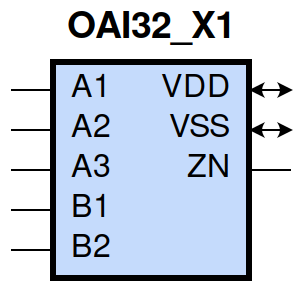

====================================
gf180mcu_fd_sc_mcu9t5v0__oai32_x1
====================================

**gf180mcu_fd_sc_mcu9t5v0__oai32_x1 symbol**

**gf180mcu_fd_sc_mcu9t5v0__oai32_x1 schematic**

**gf180mcu_fd_sc_mcu9t5v0__oai32_x1 layout**

.. image:: sc9_lay/OAI32_X1_lay.png
    :height: 300px
    :width: 500 px
    :align: center
    :alt: gf180mcu_fd_sc_mcu9t5v0__oai32_x1 layout

.. include:: images.rst
| OAI32_X1 is a two 3-input OR, 2-input OR into 2-input NAND with 1X drive strength

|
| Attributes

============= ======================
**Attribute** **Value**
area          33.868800 µm\ :sup:`2`
============= ======================

|
| OUTPUT FUNCTIONS

============== ===================================
**Output Pin** **Function**
ZN             (((!A1)&(!A2)&(!A3))|((!B1)&(!B2)))
============== ===================================

|
| TRUTH TABLE FOR ZN

====== ====== ====== ====== ====== ======
**A1** **A2** **A3** **B1** **B2** **ZN**
0      0      0      ?      ?      1
?      ?      ?      0      0      1
1      ?      ?      1      ?      0
1      ?      ?      ?      1      0
?      1      ?      1      ?      0
?      1      ?      ?      1      0
?      ?      1      1      ?      0
?      ?      1      ?      1      0
====== ====== ====== ====== ====== ======

|
| FUNCTIONAL SCHEMATIC

| |image572|

| PIN CAPACITANCE (pf)

======= ======== ====================
**Pin** **Type** **Capacitance (pf)**
A3      input    0.0064
A2      input    0.0065
A1      input    0.0068
B1      input    0.0070
B2      input    0.0066
======= ======== ====================

|
| DELAY AND OUTPUT TRANSITION TIME corresponding to min slew and load

+---------------+------------+--------------------+--------------+-------------------+----------------+---------------+
| **Input Pin** | **Output** | **When Condition** | **Tin (ns)** | **Out Load (pf)** | **Delay (ns)** | **Tout (ns)** |
+---------------+------------+--------------------+--------------+-------------------+----------------+---------------+
| A3(LH)        | ZN(HL)     | !A1&!A2&!B1&B2     | 0.0100       | 0.0010            | 0.1399         | 0.0731        |
+---------------+------------+--------------------+--------------+-------------------+----------------+---------------+
| A3(LH)        | ZN(HL)     | !A1&!A2&B1&!B2     | 0.0100       | 0.0010            | 0.1124         | 0.0574        |
+---------------+------------+--------------------+--------------+-------------------+----------------+---------------+
| A3(LH)        | ZN(HL)     | !A1&!A2&B1&B2      | 0.0100       | 0.0010            | 0.0921         | 0.0528        |
+---------------+------------+--------------------+--------------+-------------------+----------------+---------------+
| A3(HL)        | ZN(LH)     | !A1&!A2&!B1&B2     | 0.0100       | 0.0010            | 0.3529         | 0.2798        |
+---------------+------------+--------------------+--------------+-------------------+----------------+---------------+
| A3(HL)        | ZN(LH)     | !A1&!A2&B1&!B2     | 0.0100       | 0.0010            | 0.3330         | 0.2152        |
+---------------+------------+--------------------+--------------+-------------------+----------------+---------------+
| A3(HL)        | ZN(LH)     | !A1&!A2&B1&B2      | 0.0100       | 0.0010            | 0.3687         | 0.2424        |
+---------------+------------+--------------------+--------------+-------------------+----------------+---------------+
| A2(HL)        | ZN(LH)     | !A1&!A3&!B1&B2     | 0.0100       | 0.0010            | 0.3298         | 0.2798        |
+---------------+------------+--------------------+--------------+-------------------+----------------+---------------+
| A2(HL)        | ZN(LH)     | !A1&!A3&B1&!B2     | 0.0100       | 0.0010            | 0.3099         | 0.2156        |
+---------------+------------+--------------------+--------------+-------------------+----------------+---------------+
| A2(HL)        | ZN(LH)     | !A1&!A3&B1&B2      | 0.0100       | 0.0010            | 0.3456         | 0.2423        |
+---------------+------------+--------------------+--------------+-------------------+----------------+---------------+
| A2(LH)        | ZN(HL)     | !A1&!A3&!B1&B2     | 0.0100       | 0.0010            | 0.1310         | 0.0613        |
+---------------+------------+--------------------+--------------+-------------------+----------------+---------------+
| A2(LH)        | ZN(HL)     | !A1&!A3&B1&!B2     | 0.0100       | 0.0010            | 0.1071         | 0.0467        |
+---------------+------------+--------------------+--------------+-------------------+----------------+---------------+
| A2(LH)        | ZN(HL)     | !A1&!A3&B1&B2      | 0.0100       | 0.0010            | 0.0899         | 0.0442        |
+---------------+------------+--------------------+--------------+-------------------+----------------+---------------+
| A1(HL)        | ZN(LH)     | !A2&!A3&!B1&B2     | 0.0100       | 0.0010            | 0.2732         | 0.2794        |
+---------------+------------+--------------------+--------------+-------------------+----------------+---------------+
| A1(HL)        | ZN(LH)     | !A2&!A3&B1&!B2     | 0.0100       | 0.0010            | 0.2533         | 0.2149        |
+---------------+------------+--------------------+--------------+-------------------+----------------+---------------+
| A1(HL)        | ZN(LH)     | !A2&!A3&B1&B2      | 0.0100       | 0.0010            | 0.2892         | 0.2422        |
+---------------+------------+--------------------+--------------+-------------------+----------------+---------------+
| A1(LH)        | ZN(HL)     | !A2&!A3&!B1&B2     | 0.0100       | 0.0010            | 0.1075         | 0.0463        |
+---------------+------------+--------------------+--------------+-------------------+----------------+---------------+
| A1(LH)        | ZN(HL)     | !A2&!A3&B1&!B2     | 0.0100       | 0.0010            | 0.0860         | 0.0323        |
+---------------+------------+--------------------+--------------+-------------------+----------------+---------------+
| A1(LH)        | ZN(HL)     | !A2&!A3&B1&B2      | 0.0100       | 0.0010            | 0.0744         | 0.0329        |
+---------------+------------+--------------------+--------------+-------------------+----------------+---------------+
| B1(HL)        | ZN(LH)     | !A1&!A2&A3&!B2     | 0.0100       | 0.0010            | 0.1025         | 0.1226        |
+---------------+------------+--------------------+--------------+-------------------+----------------+---------------+
| B1(HL)        | ZN(LH)     | !A1&A2&!A3&!B2     | 0.0100       | 0.0010            | 0.1024         | 0.1080        |
+---------------+------------+--------------------+--------------+-------------------+----------------+---------------+
| B1(HL)        | ZN(LH)     | !A1&A2&A3&!B2      | 0.0100       | 0.0010            | 0.1014         | 0.1078        |
+---------------+------------+--------------------+--------------+-------------------+----------------+---------------+
| B1(HL)        | ZN(LH)     | A1&!A2&!A3&!B2     | 0.0100       | 0.0010            | 0.0942         | 0.0694        |
+---------------+------------+--------------------+--------------+-------------------+----------------+---------------+
| B1(HL)        | ZN(LH)     | A1&!A2&A3&!B2      | 0.0100       | 0.0010            | 0.0933         | 0.0693        |
+---------------+------------+--------------------+--------------+-------------------+----------------+---------------+
| B1(HL)        | ZN(LH)     | A1&A2&!A3&!B2      | 0.0100       | 0.0010            | 0.0933         | 0.0693        |
+---------------+------------+--------------------+--------------+-------------------+----------------+---------------+
| B1(HL)        | ZN(LH)     | A1&A2&A3&!B2       | 0.0100       | 0.0010            | 0.0927         | 0.0693        |
+---------------+------------+--------------------+--------------+-------------------+----------------+---------------+
| B1(LH)        | ZN(HL)     | !A1&!A2&A3&!B2     | 0.0100       | 0.0010            | 0.0801         | 0.0565        |
+---------------+------------+--------------------+--------------+-------------------+----------------+---------------+
| B1(LH)        | ZN(HL)     | !A1&A2&!A3&!B2     | 0.0100       | 0.0010            | 0.0730         | 0.0460        |
+---------------+------------+--------------------+--------------+-------------------+----------------+---------------+
| B1(LH)        | ZN(HL)     | !A1&A2&A3&!B2      | 0.0100       | 0.0010            | 0.0621         | 0.0354        |
+---------------+------------+--------------------+--------------+-------------------+----------------+---------------+
| B1(LH)        | ZN(HL)     | A1&!A2&!A3&!B2     | 0.0100       | 0.0010            | 0.0520         | 0.0306        |
+---------------+------------+--------------------+--------------+-------------------+----------------+---------------+
| B1(LH)        | ZN(HL)     | A1&!A2&A3&!B2      | 0.0100       | 0.0010            | 0.0459         | 0.0240        |
+---------------+------------+--------------------+--------------+-------------------+----------------+---------------+
| B1(LH)        | ZN(HL)     | A1&A2&!A3&!B2      | 0.0100       | 0.0010            | 0.0459         | 0.0240        |
+---------------+------------+--------------------+--------------+-------------------+----------------+---------------+
| B1(LH)        | ZN(HL)     | A1&A2&A3&!B2       | 0.0100       | 0.0010            | 0.0438         | 0.0223        |
+---------------+------------+--------------------+--------------+-------------------+----------------+---------------+
| B2(HL)        | ZN(LH)     | !A1&!A2&A3&!B1     | 0.0100       | 0.0010            | 0.1265         | 0.1229        |
+---------------+------------+--------------------+--------------+-------------------+----------------+---------------+
| B2(HL)        | ZN(LH)     | !A1&A2&!A3&!B1     | 0.0100       | 0.0010            | 0.1265         | 0.1084        |
+---------------+------------+--------------------+--------------+-------------------+----------------+---------------+
| B2(HL)        | ZN(LH)     | !A1&A2&A3&!B1      | 0.0100       | 0.0010            | 0.1256         | 0.1084        |
+---------------+------------+--------------------+--------------+-------------------+----------------+---------------+
| B2(HL)        | ZN(LH)     | A1&!A2&!A3&!B1     | 0.0100       | 0.0010            | 0.1182         | 0.0698        |
+---------------+------------+--------------------+--------------+-------------------+----------------+---------------+
| B2(HL)        | ZN(LH)     | A1&!A2&A3&!B1      | 0.0100       | 0.0010            | 0.1173         | 0.0698        |
+---------------+------------+--------------------+--------------+-------------------+----------------+---------------+
| B2(HL)        | ZN(LH)     | A1&A2&!A3&!B1      | 0.0100       | 0.0010            | 0.1173         | 0.0698        |
+---------------+------------+--------------------+--------------+-------------------+----------------+---------------+
| B2(HL)        | ZN(LH)     | A1&A2&A3&!B1       | 0.0100       | 0.0010            | 0.1167         | 0.0698        |
+---------------+------------+--------------------+--------------+-------------------+----------------+---------------+
| B2(LH)        | ZN(HL)     | !A1&!A2&A3&!B1     | 0.0100       | 0.0010            | 0.1056         | 0.0728        |
+---------------+------------+--------------------+--------------+-------------------+----------------+---------------+
| B2(LH)        | ZN(HL)     | !A1&A2&!A3&!B1     | 0.0100       | 0.0010            | 0.0946         | 0.0614        |
+---------------+------------+--------------------+--------------+-------------------+----------------+---------------+
| B2(LH)        | ZN(HL)     | !A1&A2&A3&!B1      | 0.0100       | 0.0010            | 0.0790         | 0.0472        |
+---------------+------------+--------------------+--------------+-------------------+----------------+---------------+
| B2(LH)        | ZN(HL)     | A1&!A2&!A3&!B1     | 0.0100       | 0.0010            | 0.0705         | 0.0463        |
+---------------+------------+--------------------+--------------+-------------------+----------------+---------------+
| B2(LH)        | ZN(HL)     | A1&!A2&A3&!B1      | 0.0100       | 0.0010            | 0.0600         | 0.0358        |
+---------------+------------+--------------------+--------------+-------------------+----------------+---------------+
| B2(LH)        | ZN(HL)     | A1&A2&!A3&!B1      | 0.0100       | 0.0010            | 0.0600         | 0.0358        |
+---------------+------------+--------------------+--------------+-------------------+----------------+---------------+
| B2(LH)        | ZN(HL)     | A1&A2&A3&!B1       | 0.0100       | 0.0010            | 0.0566         | 0.0329        |
+---------------+------------+--------------------+--------------+-------------------+----------------+---------------+

|
| DYNAMIC ENERGY

+---------------+--------------------+--------------+------------+-------------------+---------------------+
| **Input Pin** | **When Condition** | **Tin (ns)** | **Output** | **Out Load (pf)** | **Energy (uW/MHz)** |
+---------------+--------------------+--------------+------------+-------------------+---------------------+
| A1            | !A2&!A3&!B1&B2     | 0.0100       | ZN(LH)     | 0.0010            | 0.3694              |
+---------------+--------------------+--------------+------------+-------------------+---------------------+
| A1            | !A2&!A3&B1&!B2     | 0.0100       | ZN(LH)     | 0.0010            | 0.3253              |
+---------------+--------------------+--------------+------------+-------------------+---------------------+
| A1            | !A2&!A3&B1&B2      | 0.0100       | ZN(LH)     | 0.0010            | 0.3614              |
+---------------+--------------------+--------------+------------+-------------------+---------------------+
| B2            | !A1&!A2&A3&!B1     | 0.0100       | ZN(LH)     | 0.0010            | 0.2968              |
+---------------+--------------------+--------------+------------+-------------------+---------------------+
| B2            | !A1&A2&!A3&!B1     | 0.0100       | ZN(LH)     | 0.0010            | 0.2534              |
+---------------+--------------------+--------------+------------+-------------------+---------------------+
| B2            | !A1&A2&A3&!B1      | 0.0100       | ZN(LH)     | 0.0010            | 0.2523              |
+---------------+--------------------+--------------+------------+-------------------+---------------------+
| B2            | A1&!A2&!A3&!B1     | 0.0100       | ZN(LH)     | 0.0010            | 0.2090              |
+---------------+--------------------+--------------+------------+-------------------+---------------------+
| B2            | A1&!A2&A3&!B1      | 0.0100       | ZN(LH)     | 0.0010            | 0.2079              |
+---------------+--------------------+--------------+------------+-------------------+---------------------+
| B2            | A1&A2&!A3&!B1      | 0.0100       | ZN(LH)     | 0.0010            | 0.2079              |
+---------------+--------------------+--------------+------------+-------------------+---------------------+
| B2            | A1&A2&A3&!B1       | 0.0100       | ZN(LH)     | 0.0010            | 0.2074              |
+---------------+--------------------+--------------+------------+-------------------+---------------------+
| B1            | !A1&!A2&A3&!B2     | 0.0100       | ZN(LH)     | 0.0010            | 0.2524              |
+---------------+--------------------+--------------+------------+-------------------+---------------------+
| B1            | !A1&A2&!A3&!B2     | 0.0100       | ZN(LH)     | 0.0010            | 0.2088              |
+---------------+--------------------+--------------+------------+-------------------+---------------------+
| B1            | !A1&A2&A3&!B2      | 0.0100       | ZN(LH)     | 0.0010            | 0.2077              |
+---------------+--------------------+--------------+------------+-------------------+---------------------+
| B1            | A1&!A2&!A3&!B2     | 0.0100       | ZN(LH)     | 0.0010            | 0.1645              |
+---------------+--------------------+--------------+------------+-------------------+---------------------+
| B1            | A1&!A2&A3&!B2      | 0.0100       | ZN(LH)     | 0.0010            | 0.1633              |
+---------------+--------------------+--------------+------------+-------------------+---------------------+
| B1            | A1&A2&!A3&!B2      | 0.0100       | ZN(LH)     | 0.0010            | 0.1633              |
+---------------+--------------------+--------------+------------+-------------------+---------------------+
| B1            | A1&A2&A3&!B2       | 0.0100       | ZN(LH)     | 0.0010            | 0.1626              |
+---------------+--------------------+--------------+------------+-------------------+---------------------+
| A2            | !A1&!A3&!B1&B2     | 0.0100       | ZN(LH)     | 0.0010            | 0.4141              |
+---------------+--------------------+--------------+------------+-------------------+---------------------+
| A2            | !A1&!A3&B1&!B2     | 0.0100       | ZN(LH)     | 0.0010            | 0.3699              |
+---------------+--------------------+--------------+------------+-------------------+---------------------+
| A2            | !A1&!A3&B1&B2      | 0.0100       | ZN(LH)     | 0.0010            | 0.4057              |
+---------------+--------------------+--------------+------------+-------------------+---------------------+
| B1            | !A1&!A2&A3&!B2     | 0.0100       | ZN(HL)     | 0.0010            | 0.0840              |
+---------------+--------------------+--------------+------------+-------------------+---------------------+
| B1            | !A1&A2&!A3&!B2     | 0.0100       | ZN(HL)     | 0.0010            | 0.0475              |
+---------------+--------------------+--------------+------------+-------------------+---------------------+
| B1            | !A1&A2&A3&!B2      | 0.0100       | ZN(HL)     | 0.0010            | 0.0475              |
+---------------+--------------------+--------------+------------+-------------------+---------------------+
| B1            | A1&!A2&!A3&!B2     | 0.0100       | ZN(HL)     | 0.0010            | 0.0082              |
+---------------+--------------------+--------------+------------+-------------------+---------------------+
| B1            | A1&!A2&A3&!B2      | 0.0100       | ZN(HL)     | 0.0010            | 0.0083              |
+---------------+--------------------+--------------+------------+-------------------+---------------------+
| B1            | A1&A2&!A3&!B2      | 0.0100       | ZN(HL)     | 0.0010            | 0.0083              |
+---------------+--------------------+--------------+------------+-------------------+---------------------+
| B1            | A1&A2&A3&!B2       | 0.0100       | ZN(HL)     | 0.0010            | 0.0082              |
+---------------+--------------------+--------------+------------+-------------------+---------------------+
| A3            | !A1&!A2&!B1&B2     | 0.0100       | ZN(HL)     | 0.0010            | 0.1155              |
+---------------+--------------------+--------------+------------+-------------------+---------------------+
| A3            | !A1&!A2&B1&!B2     | 0.0100       | ZN(HL)     | 0.0010            | 0.0787              |
+---------------+--------------------+--------------+------------+-------------------+---------------------+
| A3            | !A1&!A2&B1&B2      | 0.0100       | ZN(HL)     | 0.0010            | 0.0786              |
+---------------+--------------------+--------------+------------+-------------------+---------------------+
| A1            | !A2&!A3&!B1&B2     | 0.0100       | ZN(HL)     | 0.0010            | 0.0464              |
+---------------+--------------------+--------------+------------+-------------------+---------------------+
| A1            | !A2&!A3&B1&!B2     | 0.0100       | ZN(HL)     | 0.0010            | 0.0079              |
+---------------+--------------------+--------------+------------+-------------------+---------------------+
| A1            | !A2&!A3&B1&B2      | 0.0100       | ZN(HL)     | 0.0010            | 0.0082              |
+---------------+--------------------+--------------+------------+-------------------+---------------------+
| B2            | !A1&!A2&A3&!B1     | 0.0100       | ZN(HL)     | 0.0010            | 0.1162              |
+---------------+--------------------+--------------+------------+-------------------+---------------------+
| B2            | !A1&A2&!A3&!B1     | 0.0100       | ZN(HL)     | 0.0010            | 0.0797              |
+---------------+--------------------+--------------+------------+-------------------+---------------------+
| B2            | !A1&A2&A3&!B1      | 0.0100       | ZN(HL)     | 0.0010            | 0.0799              |
+---------------+--------------------+--------------+------------+-------------------+---------------------+
| B2            | A1&!A2&!A3&!B1     | 0.0100       | ZN(HL)     | 0.0010            | 0.0414              |
+---------------+--------------------+--------------+------------+-------------------+---------------------+
| B2            | A1&!A2&A3&!B1      | 0.0100       | ZN(HL)     | 0.0010            | 0.0415              |
+---------------+--------------------+--------------+------------+-------------------+---------------------+
| B2            | A1&A2&!A3&!B1      | 0.0100       | ZN(HL)     | 0.0010            | 0.0414              |
+---------------+--------------------+--------------+------------+-------------------+---------------------+
| B2            | A1&A2&A3&!B1       | 0.0100       | ZN(HL)     | 0.0010            | 0.0413              |
+---------------+--------------------+--------------+------------+-------------------+---------------------+
| A2            | !A1&!A3&!B1&B2     | 0.0100       | ZN(HL)     | 0.0010            | 0.0829              |
+---------------+--------------------+--------------+------------+-------------------+---------------------+
| A2            | !A1&!A3&B1&!B2     | 0.0100       | ZN(HL)     | 0.0010            | 0.0460              |
+---------------+--------------------+--------------+------------+-------------------+---------------------+
| A2            | !A1&!A3&B1&B2      | 0.0100       | ZN(HL)     | 0.0010            | 0.0459              |
+---------------+--------------------+--------------+------------+-------------------+---------------------+
| A3            | !A1&!A2&!B1&B2     | 0.0100       | ZN(LH)     | 0.0010            | 0.4576              |
+---------------+--------------------+--------------+------------+-------------------+---------------------+
| A3            | !A1&!A2&B1&!B2     | 0.0100       | ZN(LH)     | 0.0010            | 0.4133              |
+---------------+--------------------+--------------+------------+-------------------+---------------------+
| A3            | !A1&!A2&B1&B2      | 0.0100       | ZN(LH)     | 0.0010            | 0.4493              |
+---------------+--------------------+--------------+------------+-------------------+---------------------+
| A3(LH)        | !A1&!A2&!B1&!B2    | 0.0100       | n/a        | n/a               | -0.0595             |
+---------------+--------------------+--------------+------------+-------------------+---------------------+
| A3(LH)        | !A1&A2&!B1&!B2     | 0.0100       | n/a        | n/a               | -0.0577             |
+---------------+--------------------+--------------+------------+-------------------+---------------------+
| A3(LH)        | A1&!A2&!B1&!B2     | 0.0100       | n/a        | n/a               | -0.0514             |
+---------------+--------------------+--------------+------------+-------------------+---------------------+
| A3(LH)        | A1&A2&!B1&!B2      | 0.0100       | n/a        | n/a               | -0.0564             |
+---------------+--------------------+--------------+------------+-------------------+---------------------+
| A3(LH)        | !A1&A2&!B1&B2      | 0.0100       | n/a        | n/a               | -0.0517             |
+---------------+--------------------+--------------+------------+-------------------+---------------------+
| A3(LH)        | !A1&A2&B1&!B2      | 0.0100       | n/a        | n/a               | -0.0517             |
+---------------+--------------------+--------------+------------+-------------------+---------------------+
| A3(LH)        | !A1&A2&B1&B2       | 0.0100       | n/a        | n/a               | -0.0517             |
+---------------+--------------------+--------------+------------+-------------------+---------------------+
| A3(LH)        | A1&!A2&!B1&B2      | 0.0100       | n/a        | n/a               | -0.0494             |
+---------------+--------------------+--------------+------------+-------------------+---------------------+
| A3(LH)        | A1&!A2&B1&!B2      | 0.0100       | n/a        | n/a               | -0.0494             |
+---------------+--------------------+--------------+------------+-------------------+---------------------+
| A3(LH)        | A1&!A2&B1&B2       | 0.0100       | n/a        | n/a               | -0.0494             |
+---------------+--------------------+--------------+------------+-------------------+---------------------+
| A3(LH)        | A1&A2&!B1&B2       | 0.0100       | n/a        | n/a               | -0.0564             |
+---------------+--------------------+--------------+------------+-------------------+---------------------+
| A3(LH)        | A1&A2&B1&!B2       | 0.0100       | n/a        | n/a               | -0.0564             |
+---------------+--------------------+--------------+------------+-------------------+---------------------+
| A3(LH)        | A1&A2&B1&B2        | 0.0100       | n/a        | n/a               | -0.0564             |
+---------------+--------------------+--------------+------------+-------------------+---------------------+
| A1(LH)        | !A2&!A3&!B1&!B2    | 0.0100       | n/a        | n/a               | -0.0600             |
+---------------+--------------------+--------------+------------+-------------------+---------------------+
| A1(LH)        | !A2&A3&!B1&!B2     | 0.0100       | n/a        | n/a               | -0.0523             |
+---------------+--------------------+--------------+------------+-------------------+---------------------+
| A1(LH)        | A2&!A3&!B1&!B2     | 0.0100       | n/a        | n/a               | -0.0583             |
+---------------+--------------------+--------------+------------+-------------------+---------------------+
| A1(LH)        | A2&A3&!B1&!B2      | 0.0100       | n/a        | n/a               | -0.0570             |
+---------------+--------------------+--------------+------------+-------------------+---------------------+
| A1(LH)        | !A2&A3&!B1&B2      | 0.0100       | n/a        | n/a               | -0.0165             |
+---------------+--------------------+--------------+------------+-------------------+---------------------+
| A1(LH)        | !A2&A3&B1&!B2      | 0.0100       | n/a        | n/a               | -0.0165             |
+---------------+--------------------+--------------+------------+-------------------+---------------------+
| A1(LH)        | !A2&A3&B1&B2       | 0.0100       | n/a        | n/a               | -0.0165             |
+---------------+--------------------+--------------+------------+-------------------+---------------------+
| A1(LH)        | A2&!A3&!B1&B2      | 0.0100       | n/a        | n/a               | -0.0170             |
+---------------+--------------------+--------------+------------+-------------------+---------------------+
| A1(LH)        | A2&!A3&B1&!B2      | 0.0100       | n/a        | n/a               | -0.0170             |
+---------------+--------------------+--------------+------------+-------------------+---------------------+
| A1(LH)        | A2&!A3&B1&B2       | 0.0100       | n/a        | n/a               | -0.0170             |
+---------------+--------------------+--------------+------------+-------------------+---------------------+
| A1(LH)        | A2&A3&!B1&B2       | 0.0100       | n/a        | n/a               | -0.0170             |
+---------------+--------------------+--------------+------------+-------------------+---------------------+
| A1(LH)        | A2&A3&B1&!B2       | 0.0100       | n/a        | n/a               | -0.0170             |
+---------------+--------------------+--------------+------------+-------------------+---------------------+
| A1(LH)        | A2&A3&B1&B2        | 0.0100       | n/a        | n/a               | -0.0170             |
+---------------+--------------------+--------------+------------+-------------------+---------------------+
| A2(LH)        | !A1&!A3&!B1&!B2    | 0.0100       | n/a        | n/a               | -0.0598             |
+---------------+--------------------+--------------+------------+-------------------+---------------------+
| A2(LH)        | !A1&A3&!B1&!B2     | 0.0100       | n/a        | n/a               | -0.0581             |
+---------------+--------------------+--------------+------------+-------------------+---------------------+
| A2(LH)        | A1&!A3&!B1&!B2     | 0.0100       | n/a        | n/a               | -0.0579             |
+---------------+--------------------+--------------+------------+-------------------+---------------------+
| A2(LH)        | A1&A3&!B1&!B2      | 0.0100       | n/a        | n/a               | -0.0558             |
+---------------+--------------------+--------------+------------+-------------------+---------------------+
| A2(LH)        | !A1&A3&!B1&B2      | 0.0100       | n/a        | n/a               | -0.0180             |
+---------------+--------------------+--------------+------------+-------------------+---------------------+
| A2(LH)        | !A1&A3&B1&!B2      | 0.0100       | n/a        | n/a               | -0.0180             |
+---------------+--------------------+--------------+------------+-------------------+---------------------+
| A2(LH)        | !A1&A3&B1&B2       | 0.0100       | n/a        | n/a               | -0.0180             |
+---------------+--------------------+--------------+------------+-------------------+---------------------+
| A2(LH)        | A1&!A3&!B1&B2      | 0.0100       | n/a        | n/a               | -0.0495             |
+---------------+--------------------+--------------+------------+-------------------+---------------------+
| A2(LH)        | A1&!A3&B1&!B2      | 0.0100       | n/a        | n/a               | -0.0495             |
+---------------+--------------------+--------------+------------+-------------------+---------------------+
| A2(LH)        | A1&!A3&B1&B2       | 0.0100       | n/a        | n/a               | -0.0496             |
+---------------+--------------------+--------------+------------+-------------------+---------------------+
| A2(LH)        | A1&A3&!B1&B2       | 0.0100       | n/a        | n/a               | -0.0439             |
+---------------+--------------------+--------------+------------+-------------------+---------------------+
| A2(LH)        | A1&A3&B1&!B2       | 0.0100       | n/a        | n/a               | -0.0439             |
+---------------+--------------------+--------------+------------+-------------------+---------------------+
| A2(LH)        | A1&A3&B1&B2        | 0.0100       | n/a        | n/a               | -0.0439             |
+---------------+--------------------+--------------+------------+-------------------+---------------------+
| A3(HL)        | !A1&!A2&!B1&!B2    | 0.0100       | n/a        | n/a               | 0.0651              |
+---------------+--------------------+--------------+------------+-------------------+---------------------+
| A3(HL)        | !A1&A2&!B1&!B2     | 0.0100       | n/a        | n/a               | 0.0595              |
+---------------+--------------------+--------------+------------+-------------------+---------------------+
| A3(HL)        | A1&!A2&!B1&!B2     | 0.0100       | n/a        | n/a               | 0.0595              |
+---------------+--------------------+--------------+------------+-------------------+---------------------+
| A3(HL)        | A1&A2&!B1&!B2      | 0.0100       | n/a        | n/a               | 0.0595              |
+---------------+--------------------+--------------+------------+-------------------+---------------------+
| A3(HL)        | !A1&A2&!B1&B2      | 0.0100       | n/a        | n/a               | 0.0595              |
+---------------+--------------------+--------------+------------+-------------------+---------------------+
| A3(HL)        | !A1&A2&B1&!B2      | 0.0100       | n/a        | n/a               | 0.0595              |
+---------------+--------------------+--------------+------------+-------------------+---------------------+
| A3(HL)        | !A1&A2&B1&B2       | 0.0100       | n/a        | n/a               | 0.0595              |
+---------------+--------------------+--------------+------------+-------------------+---------------------+
| A3(HL)        | A1&!A2&!B1&B2      | 0.0100       | n/a        | n/a               | 0.0595              |
+---------------+--------------------+--------------+------------+-------------------+---------------------+
| A3(HL)        | A1&!A2&B1&!B2      | 0.0100       | n/a        | n/a               | 0.0595              |
+---------------+--------------------+--------------+------------+-------------------+---------------------+
| A3(HL)        | A1&!A2&B1&B2       | 0.0100       | n/a        | n/a               | 0.0595              |
+---------------+--------------------+--------------+------------+-------------------+---------------------+
| A3(HL)        | A1&A2&!B1&B2       | 0.0100       | n/a        | n/a               | 0.0595              |
+---------------+--------------------+--------------+------------+-------------------+---------------------+
| A3(HL)        | A1&A2&B1&!B2       | 0.0100       | n/a        | n/a               | 0.0595              |
+---------------+--------------------+--------------+------------+-------------------+---------------------+
| A3(HL)        | A1&A2&B1&B2        | 0.0100       | n/a        | n/a               | 0.0595              |
+---------------+--------------------+--------------+------------+-------------------+---------------------+
| A2(HL)        | !A1&!A3&!B1&!B2    | 0.0100       | n/a        | n/a               | 0.0653              |
+---------------+--------------------+--------------+------------+-------------------+---------------------+
| A2(HL)        | !A1&A3&!B1&!B2     | 0.0100       | n/a        | n/a               | 0.0597              |
+---------------+--------------------+--------------+------------+-------------------+---------------------+
| A2(HL)        | A1&!A3&!B1&!B2     | 0.0100       | n/a        | n/a               | 0.0597              |
+---------------+--------------------+--------------+------------+-------------------+---------------------+
| A2(HL)        | A1&A3&!B1&!B2      | 0.0100       | n/a        | n/a               | 0.0355              |
+---------------+--------------------+--------------+------------+-------------------+---------------------+
| A2(HL)        | !A1&A3&!B1&B2      | 0.0100       | n/a        | n/a               | 0.0377              |
+---------------+--------------------+--------------+------------+-------------------+---------------------+
| A2(HL)        | !A1&A3&B1&!B2      | 0.0100       | n/a        | n/a               | 0.0377              |
+---------------+--------------------+--------------+------------+-------------------+---------------------+
| A2(HL)        | !A1&A3&B1&B2       | 0.0100       | n/a        | n/a               | 0.0376              |
+---------------+--------------------+--------------+------------+-------------------+---------------------+
| A2(HL)        | A1&!A3&!B1&B2      | 0.0100       | n/a        | n/a               | 0.0597              |
+---------------+--------------------+--------------+------------+-------------------+---------------------+
| A2(HL)        | A1&!A3&B1&!B2      | 0.0100       | n/a        | n/a               | 0.0597              |
+---------------+--------------------+--------------+------------+-------------------+---------------------+
| A2(HL)        | A1&!A3&B1&B2       | 0.0100       | n/a        | n/a               | 0.0597              |
+---------------+--------------------+--------------+------------+-------------------+---------------------+
| A2(HL)        | A1&A3&!B1&B2       | 0.0100       | n/a        | n/a               | 0.0355              |
+---------------+--------------------+--------------+------------+-------------------+---------------------+
| A2(HL)        | A1&A3&B1&!B2       | 0.0100       | n/a        | n/a               | 0.0355              |
+---------------+--------------------+--------------+------------+-------------------+---------------------+
| A2(HL)        | A1&A3&B1&B2        | 0.0100       | n/a        | n/a               | 0.0355              |
+---------------+--------------------+--------------+------------+-------------------+---------------------+
| B1(HL)        | !A1&!A2&!A3&!B2    | 0.0100       | n/a        | n/a               | 0.0674              |
+---------------+--------------------+--------------+------------+-------------------+---------------------+
| B1(HL)        | !A1&!A2&!A3&B2     | 0.0100       | n/a        | n/a               | 0.0684              |
+---------------+--------------------+--------------+------------+-------------------+---------------------+
| B1(HL)        | !A1&!A2&A3&B2      | 0.0100       | n/a        | n/a               | 0.0397              |
+---------------+--------------------+--------------+------------+-------------------+---------------------+
| B1(HL)        | !A1&A2&!A3&B2      | 0.0100       | n/a        | n/a               | 0.0397              |
+---------------+--------------------+--------------+------------+-------------------+---------------------+
| B1(HL)        | !A1&A2&A3&B2       | 0.0100       | n/a        | n/a               | 0.0397              |
+---------------+--------------------+--------------+------------+-------------------+---------------------+
| B1(HL)        | A1&!A2&!A3&B2      | 0.0100       | n/a        | n/a               | 0.0397              |
+---------------+--------------------+--------------+------------+-------------------+---------------------+
| B1(HL)        | A1&!A2&A3&B2       | 0.0100       | n/a        | n/a               | 0.0397              |
+---------------+--------------------+--------------+------------+-------------------+---------------------+
| B1(HL)        | A1&A2&!A3&B2       | 0.0100       | n/a        | n/a               | 0.0397              |
+---------------+--------------------+--------------+------------+-------------------+---------------------+
| B1(HL)        | A1&A2&A3&B2        | 0.0100       | n/a        | n/a               | 0.0397              |
+---------------+--------------------+--------------+------------+-------------------+---------------------+
| B2(LH)        | !A1&!A2&!A3&!B1    | 0.0100       | n/a        | n/a               | 0.0522              |
+---------------+--------------------+--------------+------------+-------------------+---------------------+
| B2(LH)        | !A1&!A2&!A3&B1     | 0.0100       | n/a        | n/a               | -0.0649             |
+---------------+--------------------+--------------+------------+-------------------+---------------------+
| B2(LH)        | !A1&!A2&A3&B1      | 0.0100       | n/a        | n/a               | -0.0498             |
+---------------+--------------------+--------------+------------+-------------------+---------------------+
| B2(LH)        | !A1&A2&!A3&B1      | 0.0100       | n/a        | n/a               | -0.0498             |
+---------------+--------------------+--------------+------------+-------------------+---------------------+
| B2(LH)        | !A1&A2&A3&B1       | 0.0100       | n/a        | n/a               | -0.0498             |
+---------------+--------------------+--------------+------------+-------------------+---------------------+
| B2(LH)        | A1&!A2&!A3&B1      | 0.0100       | n/a        | n/a               | -0.0498             |
+---------------+--------------------+--------------+------------+-------------------+---------------------+
| B2(LH)        | A1&!A2&A3&B1       | 0.0100       | n/a        | n/a               | -0.0498             |
+---------------+--------------------+--------------+------------+-------------------+---------------------+
| B2(LH)        | A1&A2&!A3&B1       | 0.0100       | n/a        | n/a               | -0.0498             |
+---------------+--------------------+--------------+------------+-------------------+---------------------+
| B2(LH)        | A1&A2&A3&B1        | 0.0100       | n/a        | n/a               | -0.0498             |
+---------------+--------------------+--------------+------------+-------------------+---------------------+
| B2(HL)        | !A1&!A2&!A3&!B1    | 0.0100       | n/a        | n/a               | 0.0670              |
+---------------+--------------------+--------------+------------+-------------------+---------------------+
| B2(HL)        | !A1&!A2&!A3&B1     | 0.0100       | n/a        | n/a               | 0.0681              |
+---------------+--------------------+--------------+------------+-------------------+---------------------+
| B2(HL)        | !A1&!A2&A3&B1      | 0.0100       | n/a        | n/a               | 0.0595              |
+---------------+--------------------+--------------+------------+-------------------+---------------------+
| B2(HL)        | !A1&A2&!A3&B1      | 0.0100       | n/a        | n/a               | 0.0595              |
+---------------+--------------------+--------------+------------+-------------------+---------------------+
| B2(HL)        | !A1&A2&A3&B1       | 0.0100       | n/a        | n/a               | 0.0595              |
+---------------+--------------------+--------------+------------+-------------------+---------------------+
| B2(HL)        | A1&!A2&!A3&B1      | 0.0100       | n/a        | n/a               | 0.0595              |
+---------------+--------------------+--------------+------------+-------------------+---------------------+
| B2(HL)        | A1&!A2&A3&B1       | 0.0100       | n/a        | n/a               | 0.0595              |
+---------------+--------------------+--------------+------------+-------------------+---------------------+
| B2(HL)        | A1&A2&!A3&B1       | 0.0100       | n/a        | n/a               | 0.0595              |
+---------------+--------------------+--------------+------------+-------------------+---------------------+
| B2(HL)        | A1&A2&A3&B1        | 0.0100       | n/a        | n/a               | 0.0595              |
+---------------+--------------------+--------------+------------+-------------------+---------------------+
| A1(HL)        | !A2&!A3&!B1&!B2    | 0.0100       | n/a        | n/a               | 0.0653              |
+---------------+--------------------+--------------+------------+-------------------+---------------------+
| A1(HL)        | !A2&A3&!B1&!B2     | 0.0100       | n/a        | n/a               | 0.0598              |
+---------------+--------------------+--------------+------------+-------------------+---------------------+
| A1(HL)        | A2&!A3&!B1&!B2     | 0.0100       | n/a        | n/a               | 0.0599              |
+---------------+--------------------+--------------+------------+-------------------+---------------------+
| A1(HL)        | A2&A3&!B1&!B2      | 0.0100       | n/a        | n/a               | 0.0599              |
+---------------+--------------------+--------------+------------+-------------------+---------------------+
| A1(HL)        | !A2&A3&!B1&B2      | 0.0100       | n/a        | n/a               | 0.0776              |
+---------------+--------------------+--------------+------------+-------------------+---------------------+
| A1(HL)        | !A2&A3&B1&!B2      | 0.0100       | n/a        | n/a               | 0.0776              |
+---------------+--------------------+--------------+------------+-------------------+---------------------+
| A1(HL)        | !A2&A3&B1&B2       | 0.0100       | n/a        | n/a               | 0.0776              |
+---------------+--------------------+--------------+------------+-------------------+---------------------+
| A1(HL)        | A2&!A3&!B1&B2      | 0.0100       | n/a        | n/a               | 0.0409              |
+---------------+--------------------+--------------+------------+-------------------+---------------------+
| A1(HL)        | A2&!A3&B1&!B2      | 0.0100       | n/a        | n/a               | 0.0409              |
+---------------+--------------------+--------------+------------+-------------------+---------------------+
| A1(HL)        | A2&!A3&B1&B2       | 0.0100       | n/a        | n/a               | 0.0410              |
+---------------+--------------------+--------------+------------+-------------------+---------------------+
| A1(HL)        | A2&A3&!B1&B2       | 0.0100       | n/a        | n/a               | 0.0409              |
+---------------+--------------------+--------------+------------+-------------------+---------------------+
| A1(HL)        | A2&A3&B1&!B2       | 0.0100       | n/a        | n/a               | 0.0409              |
+---------------+--------------------+--------------+------------+-------------------+---------------------+
| A1(HL)        | A2&A3&B1&B2        | 0.0100       | n/a        | n/a               | 0.0410              |
+---------------+--------------------+--------------+------------+-------------------+---------------------+
| B1(LH)        | !A1&!A2&!A3&!B2    | 0.0100       | n/a        | n/a               | 0.0515              |
+---------------+--------------------+--------------+------------+-------------------+---------------------+
| B1(LH)        | !A1&!A2&!A3&B2     | 0.0100       | n/a        | n/a               | -0.0657             |
+---------------+--------------------+--------------+------------+-------------------+---------------------+
| B1(LH)        | !A1&!A2&A3&B2      | 0.0100       | n/a        | n/a               | -0.0169             |
+---------------+--------------------+--------------+------------+-------------------+---------------------+
| B1(LH)        | !A1&A2&!A3&B2      | 0.0100       | n/a        | n/a               | -0.0169             |
+---------------+--------------------+--------------+------------+-------------------+---------------------+
| B1(LH)        | !A1&A2&A3&B2       | 0.0100       | n/a        | n/a               | -0.0169             |
+---------------+--------------------+--------------+------------+-------------------+---------------------+
| B1(LH)        | A1&!A2&!A3&B2      | 0.0100       | n/a        | n/a               | -0.0169             |
+---------------+--------------------+--------------+------------+-------------------+---------------------+
| B1(LH)        | A1&!A2&A3&B2       | 0.0100       | n/a        | n/a               | -0.0169             |
+---------------+--------------------+--------------+------------+-------------------+---------------------+
| B1(LH)        | A1&A2&!A3&B2       | 0.0100       | n/a        | n/a               | -0.0169             |
+---------------+--------------------+--------------+------------+-------------------+---------------------+
| B1(LH)        | A1&A2&A3&B2        | 0.0100       | n/a        | n/a               | -0.0169             |
+---------------+--------------------+--------------+------------+-------------------+---------------------+

|
| LEAKAGE POWER

=================== ==============
**When Condition**  **Power (nW)**
!A1&!A2&!A3&!B1&!B2 0.1006
!A1&!A2&!A3&!B1&B2  0.2002
!A1&!A2&!A3&B1&!B2  0.2002
!A1&!A2&!A3&B1&B2   0.2007
!A1&!A2&A3&!B1&!B2  0.1012
!A1&A2&!A3&!B1&!B2  0.1012
!A1&A2&A3&!B1&!B2   0.1012
A1&!A2&!A3&!B1&!B2  0.1012
A1&!A2&A3&!B1&!B2   0.1012
A1&A2&!A3&!B1&!B2   0.1012
A1&A2&A3&!B1&!B2    0.1012
!A1&!A2&A3&!B1&B2   0.2099
!A1&!A2&A3&B1&!B2   0.1744
!A1&!A2&A3&B1&B2    0.1744
!A1&A2&!A3&!B1&B2   0.1746
!A1&A2&!A3&B1&!B2   0.1392
!A1&A2&!A3&B1&B2    0.1392
!A1&A2&A3&!B1&B2    0.1746
!A1&A2&A3&B1&!B2    0.1392
!A1&A2&A3&B1&B2     0.1392
A1&!A2&!A3&!B1&B2   0.1392
A1&!A2&!A3&B1&!B2   0.1037
A1&!A2&!A3&B1&B2    0.1037
A1&!A2&A3&!B1&B2    0.1392
A1&!A2&A3&B1&!B2    0.1037
A1&!A2&A3&B1&B2     0.1037
A1&A2&!A3&!B1&B2    0.1392
A1&A2&!A3&B1&!B2    0.1037
A1&A2&!A3&B1&B2     0.1037
A1&A2&A3&!B1&B2     0.1392
A1&A2&A3&B1&!B2     0.1037
A1&A2&A3&B1&B2      0.1037
=================== ==============

