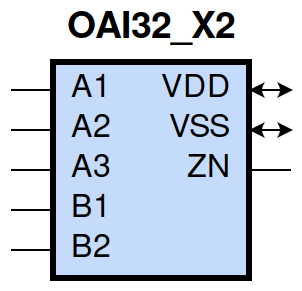
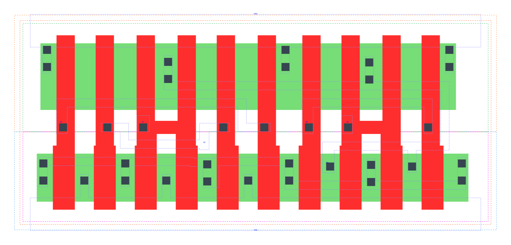

====================================
gf180mcu_fd_sc_mcu9t5v0__oai32_x2
====================================

**gf180mcu_fd_sc_mcu9t5v0__oai32_x2 symbol**

**gf180mcu_fd_sc_mcu9t5v0__oai32_x2 schematic**

.. image:: sc9_sch/OAI32_X2_sch.png
    :height: 250px
    :width: 450 px
    :align: center
    :alt: gf180mcu_fd_sc_mcu9t5v0__oai32_x2 schematic

**gf180mcu_fd_sc_mcu9t5v0__oai32_x2 layout**

.. include:: images.rst
| OAI32_X2 is a two 3-input OR, 2-input OR into 2-input NAND with 2X drive strength

|
| Attributes

============= ======================
**Attribute** **Value**
area          62.092800 µm\ :sup:`2`
============= ======================

|
| OUTPUT FUNCTIONS

============== ===================================
**Output Pin** **Function**
ZN             (((!A1)&(!A2)&(!A3))|((!B1)&(!B2)))
============== ===================================

|
| TRUTH TABLE FOR ZN

====== ====== ====== ====== ====== ======
**A1** **A2** **A3** **B1** **B2** **ZN**
0      0      0      ?      ?      1
?      ?      ?      0      0      1
1      ?      ?      1      ?      0
1      ?      ?      ?      1      0
?      1      ?      1      ?      0
?      1      ?      ?      1      0
?      ?      1      1      ?      0
?      ?      1      ?      1      0
====== ====== ====== ====== ====== ======

|
| FUNCTIONAL SCHEMATIC

| |image575|

| PIN CAPACITANCE (pf)

======= ======== ====================
**Pin** **Type** **Capacitance (pf)**
A3      input    0.0139
A2      input    0.0137
A1      input    0.0134
B2      input    0.0139
B1      input    0.0136
======= ======== ====================

|
| DELAY AND OUTPUT TRANSITION TIME corresponding to min slew and load

+---------------+------------+--------------------+--------------+-------------------+----------------+---------------+
| **Input Pin** | **Output** | **When Condition** | **Tin (ns)** | **Out Load (pf)** | **Delay (ns)** | **Tout (ns)** |
+---------------+------------+--------------------+--------------+-------------------+----------------+---------------+
| A3(LH)        | ZN(HL)     | !A1&!A2&!B1&B2     | 0.0100       | 0.0010            | 0.1409         | 0.0737        |
+---------------+------------+--------------------+--------------+-------------------+----------------+---------------+
| A3(LH)        | ZN(HL)     | !A1&!A2&B1&!B2     | 0.0100       | 0.0010            | 0.1135         | 0.0582        |
+---------------+------------+--------------------+--------------+-------------------+----------------+---------------+
| A3(LH)        | ZN(HL)     | !A1&!A2&B1&B2      | 0.0100       | 0.0010            | 0.0930         | 0.0533        |
+---------------+------------+--------------------+--------------+-------------------+----------------+---------------+
| A3(HL)        | ZN(LH)     | !A1&!A2&!B1&B2     | 0.0100       | 0.0010            | 0.3564         | 0.2825        |
+---------------+------------+--------------------+--------------+-------------------+----------------+---------------+
| A3(HL)        | ZN(LH)     | !A1&!A2&B1&!B2     | 0.0100       | 0.0010            | 0.3365         | 0.2182        |
+---------------+------------+--------------------+--------------+-------------------+----------------+---------------+
| A3(HL)        | ZN(LH)     | !A1&!A2&B1&B2      | 0.0100       | 0.0010            | 0.3724         | 0.2451        |
+---------------+------------+--------------------+--------------+-------------------+----------------+---------------+
| A2(HL)        | ZN(LH)     | !A1&!A3&!B1&B2     | 0.0100       | 0.0010            | 0.3331         | 0.2826        |
+---------------+------------+--------------------+--------------+-------------------+----------------+---------------+
| A2(HL)        | ZN(LH)     | !A1&!A3&B1&!B2     | 0.0100       | 0.0010            | 0.3130         | 0.2181        |
+---------------+------------+--------------------+--------------+-------------------+----------------+---------------+
| A2(HL)        | ZN(LH)     | !A1&!A3&B1&B2      | 0.0100       | 0.0010            | 0.3490         | 0.2452        |
+---------------+------------+--------------------+--------------+-------------------+----------------+---------------+
| A2(LH)        | ZN(HL)     | !A1&!A3&!B1&B2     | 0.0100       | 0.0010            | 0.1319         | 0.0618        |
+---------------+------------+--------------------+--------------+-------------------+----------------+---------------+
| A2(LH)        | ZN(HL)     | !A1&!A3&B1&!B2     | 0.0100       | 0.0010            | 0.1081         | 0.0472        |
+---------------+------------+--------------------+--------------+-------------------+----------------+---------------+
| A2(LH)        | ZN(HL)     | !A1&!A3&B1&B2      | 0.0100       | 0.0010            | 0.0907         | 0.0446        |
+---------------+------------+--------------------+--------------+-------------------+----------------+---------------+
| A1(HL)        | ZN(LH)     | !A2&!A3&!B1&B2     | 0.0100       | 0.0010            | 0.2770         | 0.2823        |
+---------------+------------+--------------------+--------------+-------------------+----------------+---------------+
| A1(HL)        | ZN(LH)     | !A2&!A3&B1&!B2     | 0.0100       | 0.0010            | 0.2570         | 0.2175        |
+---------------+------------+--------------------+--------------+-------------------+----------------+---------------+
| A1(HL)        | ZN(LH)     | !A2&!A3&B1&B2      | 0.0100       | 0.0010            | 0.2927         | 0.2449        |
+---------------+------------+--------------------+--------------+-------------------+----------------+---------------+
| A1(LH)        | ZN(HL)     | !A2&!A3&!B1&B2     | 0.0100       | 0.0010            | 0.1088         | 0.0471        |
+---------------+------------+--------------------+--------------+-------------------+----------------+---------------+
| A1(LH)        | ZN(HL)     | !A2&!A3&B1&!B2     | 0.0100       | 0.0010            | 0.0872         | 0.0329        |
+---------------+------------+--------------------+--------------+-------------------+----------------+---------------+
| A1(LH)        | ZN(HL)     | !A2&!A3&B1&B2      | 0.0100       | 0.0010            | 0.0754         | 0.0334        |
+---------------+------------+--------------------+--------------+-------------------+----------------+---------------+
| B2(HL)        | ZN(LH)     | !A1&!A2&A3&!B1     | 0.0100       | 0.0010            | 0.1274         | 0.1238        |
+---------------+------------+--------------------+--------------+-------------------+----------------+---------------+
| B2(HL)        | ZN(LH)     | !A1&A2&!A3&!B1     | 0.0100       | 0.0010            | 0.1276         | 0.1092        |
+---------------+------------+--------------------+--------------+-------------------+----------------+---------------+
| B2(HL)        | ZN(LH)     | !A1&A2&A3&!B1      | 0.0100       | 0.0010            | 0.1265         | 0.1090        |
+---------------+------------+--------------------+--------------+-------------------+----------------+---------------+
| B2(HL)        | ZN(LH)     | A1&!A2&!A3&!B1     | 0.0100       | 0.0010            | 0.1191         | 0.0706        |
+---------------+------------+--------------------+--------------+-------------------+----------------+---------------+
| B2(HL)        | ZN(LH)     | A1&!A2&A3&!B1      | 0.0100       | 0.0010            | 0.1182         | 0.0706        |
+---------------+------------+--------------------+--------------+-------------------+----------------+---------------+
| B2(HL)        | ZN(LH)     | A1&A2&!A3&!B1      | 0.0100       | 0.0010            | 0.1183         | 0.0706        |
+---------------+------------+--------------------+--------------+-------------------+----------------+---------------+
| B2(HL)        | ZN(LH)     | A1&A2&A3&!B1       | 0.0100       | 0.0010            | 0.1177         | 0.0707        |
+---------------+------------+--------------------+--------------+-------------------+----------------+---------------+
| B2(LH)        | ZN(HL)     | !A1&!A2&A3&!B1     | 0.0100       | 0.0010            | 0.1060         | 0.0733        |
+---------------+------------+--------------------+--------------+-------------------+----------------+---------------+
| B2(LH)        | ZN(HL)     | !A1&A2&!A3&!B1     | 0.0100       | 0.0010            | 0.0949         | 0.0620        |
+---------------+------------+--------------------+--------------+-------------------+----------------+---------------+
| B2(LH)        | ZN(HL)     | !A1&A2&A3&!B1      | 0.0100       | 0.0010            | 0.0794         | 0.0476        |
+---------------+------------+--------------------+--------------+-------------------+----------------+---------------+
| B2(LH)        | ZN(HL)     | A1&!A2&!A3&!B1     | 0.0100       | 0.0010            | 0.0710         | 0.0469        |
+---------------+------------+--------------------+--------------+-------------------+----------------+---------------+
| B2(LH)        | ZN(HL)     | A1&!A2&A3&!B1      | 0.0100       | 0.0010            | 0.0604         | 0.0361        |
+---------------+------------+--------------------+--------------+-------------------+----------------+---------------+
| B2(LH)        | ZN(HL)     | A1&A2&!A3&!B1      | 0.0100       | 0.0010            | 0.0604         | 0.0362        |
+---------------+------------+--------------------+--------------+-------------------+----------------+---------------+
| B2(LH)        | ZN(HL)     | A1&A2&A3&!B1       | 0.0100       | 0.0010            | 0.0570         | 0.0333        |
+---------------+------------+--------------------+--------------+-------------------+----------------+---------------+
| B1(HL)        | ZN(LH)     | !A1&!A2&A3&!B2     | 0.0100       | 0.0010            | 0.1034         | 0.1233        |
+---------------+------------+--------------------+--------------+-------------------+----------------+---------------+
| B1(HL)        | ZN(LH)     | !A1&A2&!A3&!B2     | 0.0100       | 0.0010            | 0.1035         | 0.1087        |
+---------------+------------+--------------------+--------------+-------------------+----------------+---------------+
| B1(HL)        | ZN(LH)     | !A1&A2&A3&!B2      | 0.0100       | 0.0010            | 0.1025         | 0.1087        |
+---------------+------------+--------------------+--------------+-------------------+----------------+---------------+
| B1(HL)        | ZN(LH)     | A1&!A2&!A3&!B2     | 0.0100       | 0.0010            | 0.0951         | 0.0702        |
+---------------+------------+--------------------+--------------+-------------------+----------------+---------------+
| B1(HL)        | ZN(LH)     | A1&!A2&A3&!B2      | 0.0100       | 0.0010            | 0.0942         | 0.0702        |
+---------------+------------+--------------------+--------------+-------------------+----------------+---------------+
| B1(HL)        | ZN(LH)     | A1&A2&!A3&!B2      | 0.0100       | 0.0010            | 0.0943         | 0.0701        |
+---------------+------------+--------------------+--------------+-------------------+----------------+---------------+
| B1(HL)        | ZN(LH)     | A1&A2&A3&!B2       | 0.0100       | 0.0010            | 0.0938         | 0.0702        |
+---------------+------------+--------------------+--------------+-------------------+----------------+---------------+
| B1(LH)        | ZN(HL)     | !A1&!A2&A3&!B2     | 0.0100       | 0.0010            | 0.0807         | 0.0571        |
+---------------+------------+--------------------+--------------+-------------------+----------------+---------------+
| B1(LH)        | ZN(HL)     | !A1&A2&!A3&!B2     | 0.0100       | 0.0010            | 0.0735         | 0.0465        |
+---------------+------------+--------------------+--------------+-------------------+----------------+---------------+
| B1(LH)        | ZN(HL)     | !A1&A2&A3&!B2      | 0.0100       | 0.0010            | 0.0626         | 0.0357        |
+---------------+------------+--------------------+--------------+-------------------+----------------+---------------+
| B1(LH)        | ZN(HL)     | A1&!A2&!A3&!B2     | 0.0100       | 0.0010            | 0.0525         | 0.0310        |
+---------------+------------+--------------------+--------------+-------------------+----------------+---------------+
| B1(LH)        | ZN(HL)     | A1&!A2&A3&!B2      | 0.0100       | 0.0010            | 0.0464         | 0.0244        |
+---------------+------------+--------------------+--------------+-------------------+----------------+---------------+
| B1(LH)        | ZN(HL)     | A1&A2&!A3&!B2      | 0.0100       | 0.0010            | 0.0464         | 0.0244        |
+---------------+------------+--------------------+--------------+-------------------+----------------+---------------+
| B1(LH)        | ZN(HL)     | A1&A2&A3&!B2       | 0.0100       | 0.0010            | 0.0444         | 0.0226        |
+---------------+------------+--------------------+--------------+-------------------+----------------+---------------+

|
| DYNAMIC ENERGY

+---------------+--------------------+--------------+------------+-------------------+---------------------+
| **Input Pin** | **When Condition** | **Tin (ns)** | **Output** | **Out Load (pf)** | **Energy (uW/MHz)** |
+---------------+--------------------+--------------+------------+-------------------+---------------------+
| A1            | !A2&!A3&!B1&B2     | 0.0100       | ZN(LH)     | 0.0010            | 0.7732              |
+---------------+--------------------+--------------+------------+-------------------+---------------------+
| A1            | !A2&!A3&B1&!B2     | 0.0100       | ZN(LH)     | 0.0010            | 0.6846              |
+---------------+--------------------+--------------+------------+-------------------+---------------------+
| A1            | !A2&!A3&B1&B2      | 0.0100       | ZN(LH)     | 0.0010            | 0.7567              |
+---------------+--------------------+--------------+------------+-------------------+---------------------+
| B2            | !A1&!A2&A3&!B1     | 0.0100       | ZN(LH)     | 0.0010            | 0.6232              |
+---------------+--------------------+--------------+------------+-------------------+---------------------+
| B2            | !A1&A2&!A3&!B1     | 0.0100       | ZN(LH)     | 0.0010            | 0.5362              |
+---------------+--------------------+--------------+------------+-------------------+---------------------+
| B2            | !A1&A2&A3&!B1      | 0.0100       | ZN(LH)     | 0.0010            | 0.5340              |
+---------------+--------------------+--------------+------------+-------------------+---------------------+
| B2            | A1&!A2&!A3&!B1     | 0.0100       | ZN(LH)     | 0.0010            | 0.4472              |
+---------------+--------------------+--------------+------------+-------------------+---------------------+
| B2            | A1&!A2&A3&!B1      | 0.0100       | ZN(LH)     | 0.0010            | 0.4451              |
+---------------+--------------------+--------------+------------+-------------------+---------------------+
| B2            | A1&A2&!A3&!B1      | 0.0100       | ZN(LH)     | 0.0010            | 0.4451              |
+---------------+--------------------+--------------+------------+-------------------+---------------------+
| B2            | A1&A2&A3&!B1       | 0.0100       | ZN(LH)     | 0.0010            | 0.4440              |
+---------------+--------------------+--------------+------------+-------------------+---------------------+
| B1            | !A1&!A2&A3&!B2     | 0.0100       | ZN(LH)     | 0.0010            | 0.5342              |
+---------------+--------------------+--------------+------------+-------------------+---------------------+
| B1            | !A1&A2&!A3&!B2     | 0.0100       | ZN(LH)     | 0.0010            | 0.4472              |
+---------------+--------------------+--------------+------------+-------------------+---------------------+
| B1            | !A1&A2&A3&!B2      | 0.0100       | ZN(LH)     | 0.0010            | 0.4448              |
+---------------+--------------------+--------------+------------+-------------------+---------------------+
| B1            | A1&!A2&!A3&!B2     | 0.0100       | ZN(LH)     | 0.0010            | 0.3583              |
+---------------+--------------------+--------------+------------+-------------------+---------------------+
| B1            | A1&!A2&A3&!B2      | 0.0100       | ZN(LH)     | 0.0010            | 0.3559              |
+---------------+--------------------+--------------+------------+-------------------+---------------------+
| B1            | A1&A2&!A3&!B2      | 0.0100       | ZN(LH)     | 0.0010            | 0.3557              |
+---------------+--------------------+--------------+------------+-------------------+---------------------+
| B1            | A1&A2&A3&!B2       | 0.0100       | ZN(LH)     | 0.0010            | 0.3545              |
+---------------+--------------------+--------------+------------+-------------------+---------------------+
| A2            | !A1&!A3&!B1&B2     | 0.0100       | ZN(LH)     | 0.0010            | 0.8625              |
+---------------+--------------------+--------------+------------+-------------------+---------------------+
| A2            | !A1&!A3&B1&!B2     | 0.0100       | ZN(LH)     | 0.0010            | 0.7737              |
+---------------+--------------------+--------------+------------+-------------------+---------------------+
| A2            | !A1&!A3&B1&B2      | 0.0100       | ZN(LH)     | 0.0010            | 0.8460              |
+---------------+--------------------+--------------+------------+-------------------+---------------------+
| B1            | !A1&!A2&A3&!B2     | 0.0100       | ZN(HL)     | 0.0010            | 0.1680              |
+---------------+--------------------+--------------+------------+-------------------+---------------------+
| B1            | !A1&A2&!A3&!B2     | 0.0100       | ZN(HL)     | 0.0010            | 0.0936              |
+---------------+--------------------+--------------+------------+-------------------+---------------------+
| B1            | !A1&A2&A3&!B2      | 0.0100       | ZN(HL)     | 0.0010            | 0.0938              |
+---------------+--------------------+--------------+------------+-------------------+---------------------+
| B1            | A1&!A2&!A3&!B2     | 0.0100       | ZN(HL)     | 0.0010            | 0.0164              |
+---------------+--------------------+--------------+------------+-------------------+---------------------+
| B1            | A1&!A2&A3&!B2      | 0.0100       | ZN(HL)     | 0.0010            | 0.0164              |
+---------------+--------------------+--------------+------------+-------------------+---------------------+
| B1            | A1&A2&!A3&!B2      | 0.0100       | ZN(HL)     | 0.0010            | 0.0164              |
+---------------+--------------------+--------------+------------+-------------------+---------------------+
| B1            | A1&A2&A3&!B2       | 0.0100       | ZN(HL)     | 0.0010            | 0.0164              |
+---------------+--------------------+--------------+------------+-------------------+---------------------+
| A3            | !A1&!A2&!B1&B2     | 0.0100       | ZN(HL)     | 0.0010            | 0.2309              |
+---------------+--------------------+--------------+------------+-------------------+---------------------+
| A3            | !A1&!A2&B1&!B2     | 0.0100       | ZN(HL)     | 0.0010            | 0.1573              |
+---------------+--------------------+--------------+------------+-------------------+---------------------+
| A3            | !A1&!A2&B1&B2      | 0.0100       | ZN(HL)     | 0.0010            | 0.1572              |
+---------------+--------------------+--------------+------------+-------------------+---------------------+
| A1            | !A2&!A3&!B1&B2     | 0.0100       | ZN(HL)     | 0.0010            | 0.0926              |
+---------------+--------------------+--------------+------------+-------------------+---------------------+
| A1            | !A2&!A3&B1&!B2     | 0.0100       | ZN(HL)     | 0.0010            | 0.0158              |
+---------------+--------------------+--------------+------------+-------------------+---------------------+
| A1            | !A2&!A3&B1&B2      | 0.0100       | ZN(HL)     | 0.0010            | 0.0163              |
+---------------+--------------------+--------------+------------+-------------------+---------------------+
| B2            | !A1&!A2&A3&!B1     | 0.0100       | ZN(HL)     | 0.0010            | 0.2320              |
+---------------+--------------------+--------------+------------+-------------------+---------------------+
| B2            | !A1&A2&!A3&!B1     | 0.0100       | ZN(HL)     | 0.0010            | 0.1582              |
+---------------+--------------------+--------------+------------+-------------------+---------------------+
| B2            | !A1&A2&A3&!B1      | 0.0100       | ZN(HL)     | 0.0010            | 0.1585              |
+---------------+--------------------+--------------+------------+-------------------+---------------------+
| B2            | A1&!A2&!A3&!B1     | 0.0100       | ZN(HL)     | 0.0010            | 0.0827              |
+---------------+--------------------+--------------+------------+-------------------+---------------------+
| B2            | A1&!A2&A3&!B1      | 0.0100       | ZN(HL)     | 0.0010            | 0.0826              |
+---------------+--------------------+--------------+------------+-------------------+---------------------+
| B2            | A1&A2&!A3&!B1      | 0.0100       | ZN(HL)     | 0.0010            | 0.0827              |
+---------------+--------------------+--------------+------------+-------------------+---------------------+
| B2            | A1&A2&A3&!B1       | 0.0100       | ZN(HL)     | 0.0010            | 0.0825              |
+---------------+--------------------+--------------+------------+-------------------+---------------------+
| A2            | !A1&!A3&!B1&B2     | 0.0100       | ZN(HL)     | 0.0010            | 0.1646              |
+---------------+--------------------+--------------+------------+-------------------+---------------------+
| A2            | !A1&!A3&B1&!B2     | 0.0100       | ZN(HL)     | 0.0010            | 0.0908              |
+---------------+--------------------+--------------+------------+-------------------+---------------------+
| A2            | !A1&!A3&B1&B2      | 0.0100       | ZN(HL)     | 0.0010            | 0.0906              |
+---------------+--------------------+--------------+------------+-------------------+---------------------+
| A3            | !A1&!A2&!B1&B2     | 0.0100       | ZN(LH)     | 0.0010            | 0.9499              |
+---------------+--------------------+--------------+------------+-------------------+---------------------+
| A3            | !A1&!A2&B1&!B2     | 0.0100       | ZN(LH)     | 0.0010            | 0.8610              |
+---------------+--------------------+--------------+------------+-------------------+---------------------+
| A3            | !A1&!A2&B1&B2      | 0.0100       | ZN(LH)     | 0.0010            | 0.9331              |
+---------------+--------------------+--------------+------------+-------------------+---------------------+
| A3(LH)        | !A1&!A2&!B1&!B2    | 0.0100       | n/a        | n/a               | -0.1187             |
+---------------+--------------------+--------------+------------+-------------------+---------------------+
| A3(LH)        | !A1&A2&!B1&!B2     | 0.0100       | n/a        | n/a               | -0.1153             |
+---------------+--------------------+--------------+------------+-------------------+---------------------+
| A3(LH)        | A1&!A2&!B1&!B2     | 0.0100       | n/a        | n/a               | -0.1028             |
+---------------+--------------------+--------------+------------+-------------------+---------------------+
| A3(LH)        | A1&A2&!B1&!B2      | 0.0100       | n/a        | n/a               | -0.1127             |
+---------------+--------------------+--------------+------------+-------------------+---------------------+
| A3(LH)        | !A1&A2&!B1&B2      | 0.0100       | n/a        | n/a               | -0.1033             |
+---------------+--------------------+--------------+------------+-------------------+---------------------+
| A3(LH)        | !A1&A2&B1&!B2      | 0.0100       | n/a        | n/a               | -0.1033             |
+---------------+--------------------+--------------+------------+-------------------+---------------------+
| A3(LH)        | !A1&A2&B1&B2       | 0.0100       | n/a        | n/a               | -0.1033             |
+---------------+--------------------+--------------+------------+-------------------+---------------------+
| A3(LH)        | A1&!A2&!B1&B2      | 0.0100       | n/a        | n/a               | -0.0987             |
+---------------+--------------------+--------------+------------+-------------------+---------------------+
| A3(LH)        | A1&!A2&B1&!B2      | 0.0100       | n/a        | n/a               | -0.0987             |
+---------------+--------------------+--------------+------------+-------------------+---------------------+
| A3(LH)        | A1&!A2&B1&B2       | 0.0100       | n/a        | n/a               | -0.0987             |
+---------------+--------------------+--------------+------------+-------------------+---------------------+
| A3(LH)        | A1&A2&!B1&B2       | 0.0100       | n/a        | n/a               | -0.1127             |
+---------------+--------------------+--------------+------------+-------------------+---------------------+
| A3(LH)        | A1&A2&B1&!B2       | 0.0100       | n/a        | n/a               | -0.1127             |
+---------------+--------------------+--------------+------------+-------------------+---------------------+
| A3(LH)        | A1&A2&B1&B2        | 0.0100       | n/a        | n/a               | -0.1127             |
+---------------+--------------------+--------------+------------+-------------------+---------------------+
| A1(LH)        | !A2&!A3&!B1&!B2    | 0.0100       | n/a        | n/a               | -0.1197             |
+---------------+--------------------+--------------+------------+-------------------+---------------------+
| A1(LH)        | !A2&A3&!B1&!B2     | 0.0100       | n/a        | n/a               | -0.1042             |
+---------------+--------------------+--------------+------------+-------------------+---------------------+
| A1(LH)        | A2&!A3&!B1&!B2     | 0.0100       | n/a        | n/a               | -0.1166             |
+---------------+--------------------+--------------+------------+-------------------+---------------------+
| A1(LH)        | A2&A3&!B1&!B2      | 0.0100       | n/a        | n/a               | -0.1139             |
+---------------+--------------------+--------------+------------+-------------------+---------------------+
| A1(LH)        | !A2&A3&!B1&B2      | 0.0100       | n/a        | n/a               | -0.0329             |
+---------------+--------------------+--------------+------------+-------------------+---------------------+
| A1(LH)        | !A2&A3&B1&!B2      | 0.0100       | n/a        | n/a               | -0.0329             |
+---------------+--------------------+--------------+------------+-------------------+---------------------+
| A1(LH)        | !A2&A3&B1&B2       | 0.0100       | n/a        | n/a               | -0.0329             |
+---------------+--------------------+--------------+------------+-------------------+---------------------+
| A1(LH)        | A2&!A3&!B1&B2      | 0.0100       | n/a        | n/a               | -0.0339             |
+---------------+--------------------+--------------+------------+-------------------+---------------------+
| A1(LH)        | A2&!A3&B1&!B2      | 0.0100       | n/a        | n/a               | -0.0339             |
+---------------+--------------------+--------------+------------+-------------------+---------------------+
| A1(LH)        | A2&!A3&B1&B2       | 0.0100       | n/a        | n/a               | -0.0338             |
+---------------+--------------------+--------------+------------+-------------------+---------------------+
| A1(LH)        | A2&A3&!B1&B2       | 0.0100       | n/a        | n/a               | -0.0338             |
+---------------+--------------------+--------------+------------+-------------------+---------------------+
| A1(LH)        | A2&A3&B1&!B2       | 0.0100       | n/a        | n/a               | -0.0338             |
+---------------+--------------------+--------------+------------+-------------------+---------------------+
| A1(LH)        | A2&A3&B1&B2        | 0.0100       | n/a        | n/a               | -0.0338             |
+---------------+--------------------+--------------+------------+-------------------+---------------------+
| A2(LH)        | !A1&!A3&!B1&!B2    | 0.0100       | n/a        | n/a               | -0.1193             |
+---------------+--------------------+--------------+------------+-------------------+---------------------+
| A2(LH)        | !A1&A3&!B1&!B2     | 0.0100       | n/a        | n/a               | -0.1160             |
+---------------+--------------------+--------------+------------+-------------------+---------------------+
| A2(LH)        | A1&!A3&!B1&!B2     | 0.0100       | n/a        | n/a               | -0.1158             |
+---------------+--------------------+--------------+------------+-------------------+---------------------+
| A2(LH)        | A1&A3&!B1&!B2      | 0.0100       | n/a        | n/a               | -0.1115             |
+---------------+--------------------+--------------+------------+-------------------+---------------------+
| A2(LH)        | !A1&A3&!B1&B2      | 0.0100       | n/a        | n/a               | -0.0361             |
+---------------+--------------------+--------------+------------+-------------------+---------------------+
| A2(LH)        | !A1&A3&B1&!B2      | 0.0100       | n/a        | n/a               | -0.0361             |
+---------------+--------------------+--------------+------------+-------------------+---------------------+
| A2(LH)        | !A1&A3&B1&B2       | 0.0100       | n/a        | n/a               | -0.0361             |
+---------------+--------------------+--------------+------------+-------------------+---------------------+
| A2(LH)        | A1&!A3&!B1&B2      | 0.0100       | n/a        | n/a               | -0.0991             |
+---------------+--------------------+--------------+------------+-------------------+---------------------+
| A2(LH)        | A1&!A3&B1&!B2      | 0.0100       | n/a        | n/a               | -0.0991             |
+---------------+--------------------+--------------+------------+-------------------+---------------------+
| A2(LH)        | A1&!A3&B1&B2       | 0.0100       | n/a        | n/a               | -0.0991             |
+---------------+--------------------+--------------+------------+-------------------+---------------------+
| A2(LH)        | A1&A3&!B1&B2       | 0.0100       | n/a        | n/a               | -0.0877             |
+---------------+--------------------+--------------+------------+-------------------+---------------------+
| A2(LH)        | A1&A3&B1&!B2       | 0.0100       | n/a        | n/a               | -0.0877             |
+---------------+--------------------+--------------+------------+-------------------+---------------------+
| A2(LH)        | A1&A3&B1&B2        | 0.0100       | n/a        | n/a               | -0.0876             |
+---------------+--------------------+--------------+------------+-------------------+---------------------+
| A3(HL)        | !A1&!A2&!B1&!B2    | 0.0100       | n/a        | n/a               | 0.1297              |
+---------------+--------------------+--------------+------------+-------------------+---------------------+
| A3(HL)        | !A1&A2&!B1&!B2     | 0.0100       | n/a        | n/a               | 0.1190              |
+---------------+--------------------+--------------+------------+-------------------+---------------------+
| A3(HL)        | A1&!A2&!B1&!B2     | 0.0100       | n/a        | n/a               | 0.1190              |
+---------------+--------------------+--------------+------------+-------------------+---------------------+
| A3(HL)        | A1&A2&!B1&!B2      | 0.0100       | n/a        | n/a               | 0.1189              |
+---------------+--------------------+--------------+------------+-------------------+---------------------+
| A3(HL)        | !A1&A2&!B1&B2      | 0.0100       | n/a        | n/a               | 0.1189              |
+---------------+--------------------+--------------+------------+-------------------+---------------------+
| A3(HL)        | !A1&A2&B1&!B2      | 0.0100       | n/a        | n/a               | 0.1189              |
+---------------+--------------------+--------------+------------+-------------------+---------------------+
| A3(HL)        | !A1&A2&B1&B2       | 0.0100       | n/a        | n/a               | 0.1189              |
+---------------+--------------------+--------------+------------+-------------------+---------------------+
| A3(HL)        | A1&!A2&!B1&B2      | 0.0100       | n/a        | n/a               | 0.1190              |
+---------------+--------------------+--------------+------------+-------------------+---------------------+
| A3(HL)        | A1&!A2&B1&!B2      | 0.0100       | n/a        | n/a               | 0.1190              |
+---------------+--------------------+--------------+------------+-------------------+---------------------+
| A3(HL)        | A1&!A2&B1&B2       | 0.0100       | n/a        | n/a               | 0.1190              |
+---------------+--------------------+--------------+------------+-------------------+---------------------+
| A3(HL)        | A1&A2&!B1&B2       | 0.0100       | n/a        | n/a               | 0.1190              |
+---------------+--------------------+--------------+------------+-------------------+---------------------+
| A3(HL)        | A1&A2&B1&!B2       | 0.0100       | n/a        | n/a               | 0.1189              |
+---------------+--------------------+--------------+------------+-------------------+---------------------+
| A3(HL)        | A1&A2&B1&B2        | 0.0100       | n/a        | n/a               | 0.1190              |
+---------------+--------------------+--------------+------------+-------------------+---------------------+
| A2(HL)        | !A1&!A3&!B1&!B2    | 0.0100       | n/a        | n/a               | 0.1300              |
+---------------+--------------------+--------------+------------+-------------------+---------------------+
| A2(HL)        | !A1&A3&!B1&!B2     | 0.0100       | n/a        | n/a               | 0.1190              |
+---------------+--------------------+--------------+------------+-------------------+---------------------+
| A2(HL)        | A1&!A3&!B1&!B2     | 0.0100       | n/a        | n/a               | 0.1191              |
+---------------+--------------------+--------------+------------+-------------------+---------------------+
| A2(HL)        | A1&A3&!B1&!B2      | 0.0100       | n/a        | n/a               | 0.0710              |
+---------------+--------------------+--------------+------------+-------------------+---------------------+
| A2(HL)        | !A1&A3&!B1&B2      | 0.0100       | n/a        | n/a               | 0.0766              |
+---------------+--------------------+--------------+------------+-------------------+---------------------+
| A2(HL)        | !A1&A3&B1&!B2      | 0.0100       | n/a        | n/a               | 0.0766              |
+---------------+--------------------+--------------+------------+-------------------+---------------------+
| A2(HL)        | !A1&A3&B1&B2       | 0.0100       | n/a        | n/a               | 0.0766              |
+---------------+--------------------+--------------+------------+-------------------+---------------------+
| A2(HL)        | A1&!A3&!B1&B2      | 0.0100       | n/a        | n/a               | 0.1192              |
+---------------+--------------------+--------------+------------+-------------------+---------------------+
| A2(HL)        | A1&!A3&B1&!B2      | 0.0100       | n/a        | n/a               | 0.1192              |
+---------------+--------------------+--------------+------------+-------------------+---------------------+
| A2(HL)        | A1&!A3&B1&B2       | 0.0100       | n/a        | n/a               | 0.1192              |
+---------------+--------------------+--------------+------------+-------------------+---------------------+
| A2(HL)        | A1&A3&!B1&B2       | 0.0100       | n/a        | n/a               | 0.0709              |
+---------------+--------------------+--------------+------------+-------------------+---------------------+
| A2(HL)        | A1&A3&B1&!B2       | 0.0100       | n/a        | n/a               | 0.0709              |
+---------------+--------------------+--------------+------------+-------------------+---------------------+
| A2(HL)        | A1&A3&B1&B2        | 0.0100       | n/a        | n/a               | 0.0709              |
+---------------+--------------------+--------------+------------+-------------------+---------------------+
| B1(HL)        | !A1&!A2&!A3&!B2    | 0.0100       | n/a        | n/a               | 0.1343              |
+---------------+--------------------+--------------+------------+-------------------+---------------------+
| B1(HL)        | !A1&!A2&!A3&B2     | 0.0100       | n/a        | n/a               | 0.1362              |
+---------------+--------------------+--------------+------------+-------------------+---------------------+
| B1(HL)        | !A1&!A2&A3&B2      | 0.0100       | n/a        | n/a               | 0.0794              |
+---------------+--------------------+--------------+------------+-------------------+---------------------+
| B1(HL)        | !A1&A2&!A3&B2      | 0.0100       | n/a        | n/a               | 0.0794              |
+---------------+--------------------+--------------+------------+-------------------+---------------------+
| B1(HL)        | !A1&A2&A3&B2       | 0.0100       | n/a        | n/a               | 0.0794              |
+---------------+--------------------+--------------+------------+-------------------+---------------------+
| B1(HL)        | A1&!A2&!A3&B2      | 0.0100       | n/a        | n/a               | 0.0794              |
+---------------+--------------------+--------------+------------+-------------------+---------------------+
| B1(HL)        | A1&!A2&A3&B2       | 0.0100       | n/a        | n/a               | 0.0794              |
+---------------+--------------------+--------------+------------+-------------------+---------------------+
| B1(HL)        | A1&A2&!A3&B2       | 0.0100       | n/a        | n/a               | 0.0794              |
+---------------+--------------------+--------------+------------+-------------------+---------------------+
| B1(HL)        | A1&A2&A3&B2        | 0.0100       | n/a        | n/a               | 0.0793              |
+---------------+--------------------+--------------+------------+-------------------+---------------------+
| B2(LH)        | !A1&!A2&!A3&!B1    | 0.0100       | n/a        | n/a               | 0.1090              |
+---------------+--------------------+--------------+------------+-------------------+---------------------+
| B2(LH)        | !A1&!A2&!A3&B1     | 0.0100       | n/a        | n/a               | -0.1300             |
+---------------+--------------------+--------------+------------+-------------------+---------------------+
| B2(LH)        | !A1&!A2&A3&B1      | 0.0100       | n/a        | n/a               | -0.0995             |
+---------------+--------------------+--------------+------------+-------------------+---------------------+
| B2(LH)        | !A1&A2&!A3&B1      | 0.0100       | n/a        | n/a               | -0.0995             |
+---------------+--------------------+--------------+------------+-------------------+---------------------+
| B2(LH)        | !A1&A2&A3&B1       | 0.0100       | n/a        | n/a               | -0.0995             |
+---------------+--------------------+--------------+------------+-------------------+---------------------+
| B2(LH)        | A1&!A2&!A3&B1      | 0.0100       | n/a        | n/a               | -0.0995             |
+---------------+--------------------+--------------+------------+-------------------+---------------------+
| B2(LH)        | A1&!A2&A3&B1       | 0.0100       | n/a        | n/a               | -0.0995             |
+---------------+--------------------+--------------+------------+-------------------+---------------------+
| B2(LH)        | A1&A2&!A3&B1       | 0.0100       | n/a        | n/a               | -0.0995             |
+---------------+--------------------+--------------+------------+-------------------+---------------------+
| B2(LH)        | A1&A2&A3&B1        | 0.0100       | n/a        | n/a               | -0.0995             |
+---------------+--------------------+--------------+------------+-------------------+---------------------+
| B2(HL)        | !A1&!A2&!A3&!B1    | 0.0100       | n/a        | n/a               | 0.1338              |
+---------------+--------------------+--------------+------------+-------------------+---------------------+
| B2(HL)        | !A1&!A2&!A3&B1     | 0.0100       | n/a        | n/a               | 0.1360              |
+---------------+--------------------+--------------+------------+-------------------+---------------------+
| B2(HL)        | !A1&!A2&A3&B1      | 0.0100       | n/a        | n/a               | 0.1189              |
+---------------+--------------------+--------------+------------+-------------------+---------------------+
| B2(HL)        | !A1&A2&!A3&B1      | 0.0100       | n/a        | n/a               | 0.1189              |
+---------------+--------------------+--------------+------------+-------------------+---------------------+
| B2(HL)        | !A1&A2&A3&B1       | 0.0100       | n/a        | n/a               | 0.1189              |
+---------------+--------------------+--------------+------------+-------------------+---------------------+
| B2(HL)        | A1&!A2&!A3&B1      | 0.0100       | n/a        | n/a               | 0.1189              |
+---------------+--------------------+--------------+------------+-------------------+---------------------+
| B2(HL)        | A1&!A2&A3&B1       | 0.0100       | n/a        | n/a               | 0.1189              |
+---------------+--------------------+--------------+------------+-------------------+---------------------+
| B2(HL)        | A1&A2&!A3&B1       | 0.0100       | n/a        | n/a               | 0.1189              |
+---------------+--------------------+--------------+------------+-------------------+---------------------+
| B2(HL)        | A1&A2&A3&B1        | 0.0100       | n/a        | n/a               | 0.1189              |
+---------------+--------------------+--------------+------------+-------------------+---------------------+
| A1(HL)        | !A2&!A3&!B1&!B2    | 0.0100       | n/a        | n/a               | 0.1304              |
+---------------+--------------------+--------------+------------+-------------------+---------------------+
| A1(HL)        | !A2&A3&!B1&!B2     | 0.0100       | n/a        | n/a               | 0.1195              |
+---------------+--------------------+--------------+------------+-------------------+---------------------+
| A1(HL)        | A2&!A3&!B1&!B2     | 0.0100       | n/a        | n/a               | 0.1195              |
+---------------+--------------------+--------------+------------+-------------------+---------------------+
| A1(HL)        | A2&A3&!B1&!B2      | 0.0100       | n/a        | n/a               | 0.1197              |
+---------------+--------------------+--------------+------------+-------------------+---------------------+
| A1(HL)        | !A2&A3&!B1&B2      | 0.0100       | n/a        | n/a               | 0.1552              |
+---------------+--------------------+--------------+------------+-------------------+---------------------+
| A1(HL)        | !A2&A3&B1&!B2      | 0.0100       | n/a        | n/a               | 0.1552              |
+---------------+--------------------+--------------+------------+-------------------+---------------------+
| A1(HL)        | !A2&A3&B1&B2       | 0.0100       | n/a        | n/a               | 0.1551              |
+---------------+--------------------+--------------+------------+-------------------+---------------------+
| A1(HL)        | A2&!A3&!B1&B2      | 0.0100       | n/a        | n/a               | 0.0806              |
+---------------+--------------------+--------------+------------+-------------------+---------------------+
| A1(HL)        | A2&!A3&B1&!B2      | 0.0100       | n/a        | n/a               | 0.0806              |
+---------------+--------------------+--------------+------------+-------------------+---------------------+
| A1(HL)        | A2&!A3&B1&B2       | 0.0100       | n/a        | n/a               | 0.0806              |
+---------------+--------------------+--------------+------------+-------------------+---------------------+
| A1(HL)        | A2&A3&!B1&B2       | 0.0100       | n/a        | n/a               | 0.0806              |
+---------------+--------------------+--------------+------------+-------------------+---------------------+
| A1(HL)        | A2&A3&B1&!B2       | 0.0100       | n/a        | n/a               | 0.0806              |
+---------------+--------------------+--------------+------------+-------------------+---------------------+
| A1(HL)        | A2&A3&B1&B2        | 0.0100       | n/a        | n/a               | 0.0806              |
+---------------+--------------------+--------------+------------+-------------------+---------------------+
| B1(LH)        | !A1&!A2&!A3&!B2    | 0.0100       | n/a        | n/a               | 0.1077              |
+---------------+--------------------+--------------+------------+-------------------+---------------------+
| B1(LH)        | !A1&!A2&!A3&B2     | 0.0100       | n/a        | n/a               | -0.1311             |
+---------------+--------------------+--------------+------------+-------------------+---------------------+
| B1(LH)        | !A1&!A2&A3&B2      | 0.0100       | n/a        | n/a               | -0.0338             |
+---------------+--------------------+--------------+------------+-------------------+---------------------+
| B1(LH)        | !A1&A2&!A3&B2      | 0.0100       | n/a        | n/a               | -0.0338             |
+---------------+--------------------+--------------+------------+-------------------+---------------------+
| B1(LH)        | !A1&A2&A3&B2       | 0.0100       | n/a        | n/a               | -0.0338             |
+---------------+--------------------+--------------+------------+-------------------+---------------------+
| B1(LH)        | A1&!A2&!A3&B2      | 0.0100       | n/a        | n/a               | -0.0338             |
+---------------+--------------------+--------------+------------+-------------------+---------------------+
| B1(LH)        | A1&!A2&A3&B2       | 0.0100       | n/a        | n/a               | -0.0338             |
+---------------+--------------------+--------------+------------+-------------------+---------------------+
| B1(LH)        | A1&A2&!A3&B2       | 0.0100       | n/a        | n/a               | -0.0338             |
+---------------+--------------------+--------------+------------+-------------------+---------------------+
| B1(LH)        | A1&A2&A3&B2        | 0.0100       | n/a        | n/a               | -0.0338             |
+---------------+--------------------+--------------+------------+-------------------+---------------------+

|
| LEAKAGE POWER

=================== ==============
**When Condition**  **Power (nW)**
!A1&!A2&!A3&!B1&!B2 0.1511
!A1&!A2&!A3&!B1&B2  0.3512
!A1&!A2&!A3&B1&!B2  0.3512
!A1&!A2&!A3&B1&B2   0.3522
!A1&!A2&A3&!B1&!B2  0.1523
!A1&A2&!A3&!B1&!B2  0.1523
!A1&A2&A3&!B1&!B2   0.1523
A1&!A2&!A3&!B1&!B2  0.1523
A1&!A2&A3&!B1&!B2   0.1523
A1&A2&!A3&!B1&!B2   0.1523
A1&A2&A3&!B1&!B2    0.1523
!A1&!A2&A3&!B1&B2   0.3698
!A1&!A2&A3&B1&!B2   0.2989
!A1&!A2&A3&B1&B2    0.2989
!A1&A2&!A3&!B1&B2   0.2993
!A1&A2&!A3&B1&!B2   0.2283
!A1&A2&!A3&B1&B2    0.2283
!A1&A2&A3&!B1&B2    0.2993
!A1&A2&A3&B1&!B2    0.2283
!A1&A2&A3&B1&B2     0.2283
A1&!A2&!A3&!B1&B2   0.2283
A1&!A2&!A3&B1&!B2   0.1574
A1&!A2&!A3&B1&B2    0.1574
A1&!A2&A3&!B1&B2    0.2283
A1&!A2&A3&B1&!B2    0.1574
A1&!A2&A3&B1&B2     0.1574
A1&A2&!A3&!B1&B2    0.2283
A1&A2&!A3&B1&!B2    0.1574
A1&A2&!A3&B1&B2     0.1574
A1&A2&A3&!B1&B2     0.2283
A1&A2&A3&B1&!B2     0.1574
A1&A2&A3&B1&B2      0.1574
=================== ==============

