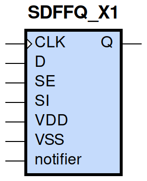
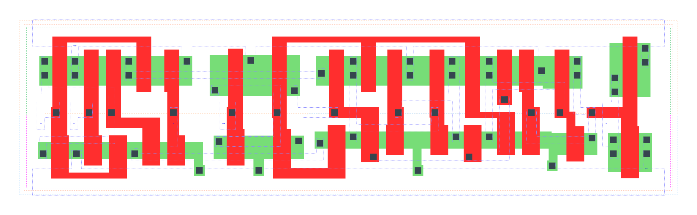

====================================
gf180mcu_fd_sc_mcu9t5v0__sdffq_x1
====================================

**gf180mcu_fd_sc_mcu9t5v0__sdffq_x1 symbol**

**gf180mcu_fd_sc_mcu9t5v0__sdffq_x1 schematic**

.. image:: sc9_sch/SDFFQ_X1_sch.png
    :height: 250px
    :width: 450 px
    :align: center
    :alt: gf180mcu_fd_sc_mcu9t5v0__sdffq_x1 schematic

**gf180mcu_fd_sc_mcu9t5v0__sdffq_x1 layout**

.. include:: images.rst
| SDFFQ_X1 is a positive edge triggered scan D-type flip flop with 1X drive strength

|
| Attributes

============= =======================
**Attribute** **Value**
area          107.251200 µm\ :sup:`2`
============= =======================

|

TRUTH TABLE

===== == = === ======
Input          Output
SE    SI D CLK Q
L     X  L ↑   L
L     X  H ↑   H
H     L  X ↑   L
H     H  X ↑   H
===== == = === ======

|
| FUNCTIONAL SCHEMATIC
| |image617|
| CONSTRAINTS

================== =============== ============= ============
**Constraint Pin** **Related Pin** **setup(ns)** **hold(ns)**
SE(LH)             CLK(LH)         0.3780        -0.1720
SE(LH)             CLK(LH)         0.5380        -0.1370
SE(HL)             CLK(LH)         0.4350        -0.0460
SE(HL)             CLK(LH)         0.4980        -0.2920
SI(HL)             CLK(LH)         0.5040        -0.1030
SI(HL)             CLK(LH)         0.5040        -0.1030
SI(LH)             CLK(LH)         0.4240        -0.2180
SI(LH)             CLK(LH)         0.4240        -0.2180
D(HL)              CLK(LH)         0.5040        -0.0970
D(HL)              CLK(LH)         0.5040        -0.1030
D(LH)              CLK(LH)         0.4240        -0.2180
D(LH)              CLK(LH)         0.4240        -0.2180
================== =============== ============= ============

|

================== =============== ===========================
**Constraint Pin** **Related Pin** **Minimum Pulse Width(ns)**
CLK(HLH)           CLK(HL)         0.5950
CLK(HLH)           CLK(HL)         0.5950
CLK(HLH)           CLK(HL)         0.5950
CLK(HLH)           CLK(HL)         0.4980
CLK(HLH)           CLK(HL)         0.4980
CLK(HLH)           CLK(HL)         0.5950
CLK(HLH)           CLK(HL)         0.4980
CLK(HLH)           CLK(HL)         0.4980
CLK(LHL)           CLK(LH)         0.2610
CLK(LHL)           CLK(LH)         0.2610
CLK(LHL)           CLK(LH)         0.2610
CLK(LHL)           CLK(LH)         0.3100
CLK(LHL)           CLK(LH)         0.3100
CLK(LHL)           CLK(LH)         0.2610
CLK(LHL)           CLK(LH)         0.3100
CLK(LHL)           CLK(LH)         0.3100
================== =============== ===========================

|
| PIN CAPACITANCE (pf)

======= ======== ====================
**Pin** **Type** **Capacitance (pf)**
SE      input    0.0083
SI      input    0.0040
D       input    0.0036
CLK     input    0.0049
======= ======== ====================

|
| DELAY AND OUTPUT TRANSITION TIME corresponding to min slew and load

+---------------+------------+--------------------+--------------+-------------------+----------------+---------------+
| **Input Pin** | **Output** | **When Condition** | **Tin (ns)** | **Out Load (pf)** | **Delay (ns)** | **Tout (ns)** |
+---------------+------------+--------------------+--------------+-------------------+----------------+---------------+
| CLK(LH)       | Q(HL)      | !D&!SE&!SI         | 0.0100       | 0.0010            | 0.5305         | 0.0371        |
+---------------+------------+--------------------+--------------+-------------------+----------------+---------------+
| CLK(LH)       | Q(HL)      | !D&!SE&SI          | 0.0100       | 0.0010            | 0.5305         | 0.0371        |
+---------------+------------+--------------------+--------------+-------------------+----------------+---------------+
| CLK(LH)       | Q(HL)      | !D&SE&!SI          | 0.0100       | 0.0010            | 0.5305         | 0.0371        |
+---------------+------------+--------------------+--------------+-------------------+----------------+---------------+
| CLK(LH)       | Q(HL)      | D&SE&!SI           | 0.0100       | 0.0010            | 0.5305         | 0.0371        |
+---------------+------------+--------------------+--------------+-------------------+----------------+---------------+
| CLK(LH)       | Q(LH)      | !D&SE&SI           | 0.0100       | 0.0010            | 0.4895         | 0.0377        |
+---------------+------------+--------------------+--------------+-------------------+----------------+---------------+
| CLK(LH)       | Q(LH)      | D&!SE&!SI          | 0.0100       | 0.0010            | 0.4895         | 0.0377        |
+---------------+------------+--------------------+--------------+-------------------+----------------+---------------+
| CLK(LH)       | Q(LH)      | D&!SE&SI           | 0.0100       | 0.0010            | 0.4895         | 0.0377        |
+---------------+------------+--------------------+--------------+-------------------+----------------+---------------+
| CLK(LH)       | Q(LH)      | D&SE&SI            | 0.0100       | 0.0010            | 0.4894         | 0.0377        |
+---------------+------------+--------------------+--------------+-------------------+----------------+---------------+

|
| DYNAMIC ENERGY

+---------------+--------------------+--------------+------------+-------------------+---------------------+
| **Input Pin** | **When Condition** | **Tin (ns)** | **Output** | **Out Load (pf)** | **Energy (uW/MHz)** |
+---------------+--------------------+--------------+------------+-------------------+---------------------+
| CLK           | !D&!SE&!SI         | 0.0100       | Q(HL)      | 0.0010            | 0.6934              |
+---------------+--------------------+--------------+------------+-------------------+---------------------+
| CLK           | !D&!SE&SI          | 0.0100       | Q(HL)      | 0.0010            | 0.6933              |
+---------------+--------------------+--------------+------------+-------------------+---------------------+
| CLK           | !D&SE&!SI          | 0.0100       | Q(HL)      | 0.0010            | 0.6931              |
+---------------+--------------------+--------------+------------+-------------------+---------------------+
| CLK           | D&SE&!SI           | 0.0100       | Q(HL)      | 0.0010            | 0.6930              |
+---------------+--------------------+--------------+------------+-------------------+---------------------+
| CLK           | !D&SE&SI           | 0.0100       | Q(LH)      | 0.0010            | 0.6607              |
+---------------+--------------------+--------------+------------+-------------------+---------------------+
| CLK           | D&!SE&!SI          | 0.0100       | Q(LH)      | 0.0010            | 0.6606              |
+---------------+--------------------+--------------+------------+-------------------+---------------------+
| CLK           | D&!SE&SI           | 0.0100       | Q(LH)      | 0.0010            | 0.6606              |
+---------------+--------------------+--------------+------------+-------------------+---------------------+
| CLK           | D&SE&SI            | 0.0100       | Q(LH)      | 0.0010            | 0.6607              |
+---------------+--------------------+--------------+------------+-------------------+---------------------+
| D(HL)         | !CLK&!SE&!SI       | 0.0100       | n/a        | n/a               | 0.4257              |
+---------------+--------------------+--------------+------------+-------------------+---------------------+
| D(HL)         | !CLK&SE&!SI        | 0.0100       | n/a        | n/a               | 0.0324              |
+---------------+--------------------+--------------+------------+-------------------+---------------------+
| D(HL)         | !CLK&!SE&SI        | 0.0100       | n/a        | n/a               | 0.4257              |
+---------------+--------------------+--------------+------------+-------------------+---------------------+
| D(HL)         | !CLK&SE&SI         | 0.0100       | n/a        | n/a               | 0.0321              |
+---------------+--------------------+--------------+------------+-------------------+---------------------+
| D(HL)         | CLK&!SE&!SI        | 0.0100       | n/a        | n/a               | 0.0861              |
+---------------+--------------------+--------------+------------+-------------------+---------------------+
| D(HL)         | CLK&SE&!SI         | 0.0100       | n/a        | n/a               | 0.0321              |
+---------------+--------------------+--------------+------------+-------------------+---------------------+
| D(HL)         | CLK&!SE&SI         | 0.0100       | n/a        | n/a               | 0.0861              |
+---------------+--------------------+--------------+------------+-------------------+---------------------+
| D(HL)         | CLK&SE&SI          | 0.0100       | n/a        | n/a               | 0.0321              |
+---------------+--------------------+--------------+------------+-------------------+---------------------+
| SE(LH)        | !CLK&!D&!SI        | 0.0100       | n/a        | n/a               | 0.0060              |
+---------------+--------------------+--------------+------------+-------------------+---------------------+
| SE(LH)        | !CLK&!D&SI         | 0.0100       | n/a        | n/a               | 0.2419              |
+---------------+--------------------+--------------+------------+-------------------+---------------------+
| SE(LH)        | CLK&!D&!SI         | 0.0100       | n/a        | n/a               | -0.0003             |
+---------------+--------------------+--------------+------------+-------------------+---------------------+
| SE(LH)        | CLK&!D&SI          | 0.0100       | n/a        | n/a               | -0.0076             |
+---------------+--------------------+--------------+------------+-------------------+---------------------+
| SE(LH)        | !CLK&D&!SI         | 0.0100       | n/a        | n/a               | 0.4025              |
+---------------+--------------------+--------------+------------+-------------------+---------------------+
| SE(LH)        | !CLK&D&SI          | 0.0100       | n/a        | n/a               | 0.0066              |
+---------------+--------------------+--------------+------------+-------------------+---------------------+
| SE(LH)        | CLK&D&!SI          | 0.0100       | n/a        | n/a               | 0.0508              |
+---------------+--------------------+--------------+------------+-------------------+---------------------+
| SE(LH)        | CLK&D&SI           | 0.0100       | n/a        | n/a               | 0.0027              |
+---------------+--------------------+--------------+------------+-------------------+---------------------+
| CLK(LH)       | !D&!SE&!SI         | 0.0100       | n/a        | n/a               | 0.2693              |
+---------------+--------------------+--------------+------------+-------------------+---------------------+
| CLK(LH)       | !D&SE&!SI          | 0.0100       | n/a        | n/a               | 0.2694              |
+---------------+--------------------+--------------+------------+-------------------+---------------------+
| CLK(LH)       | !D&!SE&SI          | 0.0100       | n/a        | n/a               | 0.2693              |
+---------------+--------------------+--------------+------------+-------------------+---------------------+
| CLK(LH)       | !D&SE&SI           | 0.0100       | n/a        | n/a               | 0.2717              |
+---------------+--------------------+--------------+------------+-------------------+---------------------+
| CLK(LH)       | D&!SE&!SI          | 0.0100       | n/a        | n/a               | 0.2717              |
+---------------+--------------------+--------------+------------+-------------------+---------------------+
| CLK(LH)       | D&SE&!SI           | 0.0100       | n/a        | n/a               | 0.2694              |
+---------------+--------------------+--------------+------------+-------------------+---------------------+
| CLK(LH)       | D&!SE&SI           | 0.0100       | n/a        | n/a               | 0.2715              |
+---------------+--------------------+--------------+------------+-------------------+---------------------+
| CLK(LH)       | D&SE&SI            | 0.0100       | n/a        | n/a               | 0.2719              |
+---------------+--------------------+--------------+------------+-------------------+---------------------+
| SI(LH)        | !CLK&!D&!SE        | 0.0100       | n/a        | n/a               | -0.0315             |
+---------------+--------------------+--------------+------------+-------------------+---------------------+
| SI(LH)        | !CLK&!D&SE         | 0.0100       | n/a        | n/a               | 0.2396              |
+---------------+--------------------+--------------+------------+-------------------+---------------------+
| SI(LH)        | CLK&!D&!SE         | 0.0100       | n/a        | n/a               | -0.0315             |
+---------------+--------------------+--------------+------------+-------------------+---------------------+
| SI(LH)        | CLK&!D&SE          | 0.0100       | n/a        | n/a               | -0.0261             |
+---------------+--------------------+--------------+------------+-------------------+---------------------+
| SI(LH)        | !CLK&D&!SE         | 0.0100       | n/a        | n/a               | -0.0293             |
+---------------+--------------------+--------------+------------+-------------------+---------------------+
| SI(LH)        | !CLK&D&SE          | 0.0100       | n/a        | n/a               | 0.2396              |
+---------------+--------------------+--------------+------------+-------------------+---------------------+
| SI(LH)        | CLK&D&!SE          | 0.0100       | n/a        | n/a               | -0.0298             |
+---------------+--------------------+--------------+------------+-------------------+---------------------+
| SI(LH)        | CLK&D&SE           | 0.0100       | n/a        | n/a               | -0.0261             |
+---------------+--------------------+--------------+------------+-------------------+---------------------+
| SE(HL)        | !CLK&!D&!SI        | 0.0100       | n/a        | n/a               | 0.1734              |
+---------------+--------------------+--------------+------------+-------------------+---------------------+
| SE(HL)        | !CLK&!D&SI         | 0.0100       | n/a        | n/a               | 0.5342              |
+---------------+--------------------+--------------+------------+-------------------+---------------------+
| SE(HL)        | CLK&!D&!SI         | 0.0100       | n/a        | n/a               | 0.1685              |
+---------------+--------------------+--------------+------------+-------------------+---------------------+
| SE(HL)        | CLK&!D&SI          | 0.0100       | n/a        | n/a               | 0.2101              |
+---------------+--------------------+--------------+------------+-------------------+---------------------+
| SE(HL)        | !CLK&D&!SI         | 0.0100       | n/a        | n/a               | 0.4457              |
+---------------+--------------------+--------------+------------+-------------------+---------------------+
| SE(HL)        | !CLK&D&SI          | 0.0100       | n/a        | n/a               | 0.1733              |
+---------------+--------------------+--------------+------------+-------------------+---------------------+
| SE(HL)        | CLK&D&!SI          | 0.0100       | n/a        | n/a               | 0.1839              |
+---------------+--------------------+--------------+------------+-------------------+---------------------+
| SE(HL)        | CLK&D&SI           | 0.0100       | n/a        | n/a               | 0.1676              |
+---------------+--------------------+--------------+------------+-------------------+---------------------+
| CLK(HL)       | !D&!SE&!SI         | 0.0100       | n/a        | n/a               | 0.3825              |
+---------------+--------------------+--------------+------------+-------------------+---------------------+
| CLK(HL)       | !D&SE&!SI          | 0.0100       | n/a        | n/a               | 0.3828              |
+---------------+--------------------+--------------+------------+-------------------+---------------------+
| CLK(HL)       | !D&!SE&SI          | 0.0100       | n/a        | n/a               | 0.3825              |
+---------------+--------------------+--------------+------------+-------------------+---------------------+
| CLK(HL)       | !D&SE&SI           | 0.0100       | n/a        | n/a               | 0.3799              |
+---------------+--------------------+--------------+------------+-------------------+---------------------+
| CLK(HL)       | D&!SE&!SI          | 0.0100       | n/a        | n/a               | 0.3800              |
+---------------+--------------------+--------------+------------+-------------------+---------------------+
| CLK(HL)       | D&SE&!SI           | 0.0100       | n/a        | n/a               | 0.3828              |
+---------------+--------------------+--------------+------------+-------------------+---------------------+
| CLK(HL)       | D&!SE&SI           | 0.0100       | n/a        | n/a               | 0.3889              |
+---------------+--------------------+--------------+------------+-------------------+---------------------+
| CLK(HL)       | D&SE&SI            | 0.0100       | n/a        | n/a               | 0.3888              |
+---------------+--------------------+--------------+------------+-------------------+---------------------+
| SI(HL)        | !CLK&!D&!SE        | 0.0100       | n/a        | n/a               | 0.0326              |
+---------------+--------------------+--------------+------------+-------------------+---------------------+
| SI(HL)        | !CLK&!D&SE         | 0.0100       | n/a        | n/a               | 0.4451              |
+---------------+--------------------+--------------+------------+-------------------+---------------------+
| SI(HL)        | CLK&!D&!SE         | 0.0100       | n/a        | n/a               | 0.0324              |
+---------------+--------------------+--------------+------------+-------------------+---------------------+
| SI(HL)        | CLK&!D&SE          | 0.0100       | n/a        | n/a               | 0.0874              |
+---------------+--------------------+--------------+------------+-------------------+---------------------+
| SI(HL)        | !CLK&D&!SE         | 0.0100       | n/a        | n/a               | 0.0321              |
+---------------+--------------------+--------------+------------+-------------------+---------------------+
| SI(HL)        | !CLK&D&SE          | 0.0100       | n/a        | n/a               | 0.4450              |
+---------------+--------------------+--------------+------------+-------------------+---------------------+
| SI(HL)        | CLK&D&!SE          | 0.0100       | n/a        | n/a               | 0.0320              |
+---------------+--------------------+--------------+------------+-------------------+---------------------+
| SI(HL)        | CLK&D&SE           | 0.0100       | n/a        | n/a               | 0.0874              |
+---------------+--------------------+--------------+------------+-------------------+---------------------+
| D(LH)         | !CLK&!SE&!SI       | 0.0100       | n/a        | n/a               | 0.2629              |
+---------------+--------------------+--------------+------------+-------------------+---------------------+
| D(LH)         | !CLK&SE&!SI        | 0.0100       | n/a        | n/a               | -0.0311             |
+---------------+--------------------+--------------+------------+-------------------+---------------------+
| D(LH)         | !CLK&!SE&SI        | 0.0100       | n/a        | n/a               | 0.2629              |
+---------------+--------------------+--------------+------------+-------------------+---------------------+
| D(LH)         | !CLK&SE&SI         | 0.0100       | n/a        | n/a               | -0.0285             |
+---------------+--------------------+--------------+------------+-------------------+---------------------+
| D(LH)         | CLK&!SE&!SI        | 0.0100       | n/a        | n/a               | -0.0096             |
+---------------+--------------------+--------------+------------+-------------------+---------------------+
| D(LH)         | CLK&SE&!SI         | 0.0100       | n/a        | n/a               | -0.0311             |
+---------------+--------------------+--------------+------------+-------------------+---------------------+
| D(LH)         | CLK&!SE&SI         | 0.0100       | n/a        | n/a               | -0.0096             |
+---------------+--------------------+--------------+------------+-------------------+---------------------+
| D(LH)         | CLK&SE&SI          | 0.0100       | n/a        | n/a               | -0.0290             |
+---------------+--------------------+--------------+------------+-------------------+---------------------+

|
| LEAKAGE POWER

================== ==============
**When Condition** **Power (nW)**
!CLK&!D&!SE&!SI    0.4562
!CLK&!D&!SE&SI     0.4564
!CLK&!D&SE&!SI     0.4676
!CLK&D&SE&!SI      0.4678
!CLK&!D&SE&SI      0.4747
!CLK&D&!SE&!SI     0.4755
!CLK&D&!SE&SI      0.5146
!CLK&D&SE&SI       0.5138
CLK&!D&!SE&!SI     0.4233
CLK&!D&!SE&SI      0.4233
CLK&!D&SE&!SI      0.4146
CLK&D&SE&!SI       0.4146
CLK&!D&SE&SI       0.4843
CLK&D&!SE&!SI      0.4791
CLK&D&!SE&SI       0.5808
CLK&D&SE&SI        0.5859
================== ==============

