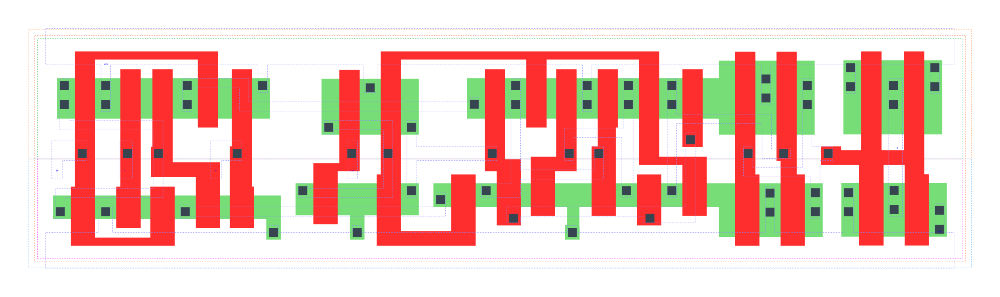

====================================
gf180mcu_fd_sc_mcu9t5v0__sdffq_x2
====================================

**gf180mcu_fd_sc_mcu9t5v0__sdffq_x2 symbol**

.. image:: sc9_sym/SDFFQ_X2_sym.png
    :height: 200px
    :width: 400 px
    :align: center
    :alt: gf180mcu_fd_sc_mcu9t5v0__sdffq_x2 symbol

**gf180mcu_fd_sc_mcu9t5v0__sdffq_x2 schematic**

.. image:: sc9_sch/SDFFQ_X2_sch.png
    :height: 250px
    :width: 450 px
    :align: center
    :alt: gf180mcu_fd_sc_mcu9t5v0__sdffq_x2 schematic

**gf180mcu_fd_sc_mcu9t5v0__sdffq_x2 layout**

.. include:: images.rst
| SDFFQ_X2 is a positive edge triggered scan D-type flip flop with 2X drive strength

|
| Attributes

============= =======================
**Attribute** **Value**
area          112.896000 µm\ :sup:`2`
============= =======================

|

TRUTH TABLE

===== == = === ======
Input          Output
SE    SI D CLK Q
L     X  L ↑   L
L     X  H ↑   H
H     L  X ↑   L
H     H  X ↑   H
===== == = === ======

|
| FUNCTIONAL SCHEMATIC
| |image620|
| CONSTRAINTS

================== =============== ============= ============
**Constraint Pin** **Related Pin** **setup(ns)** **hold(ns)**
SE(LH)             CLK(LH)         0.3840        -0.1600
SE(LH)             CLK(LH)         0.5500        -0.1430
SE(HL)             CLK(LH)         0.4470        -0.0460
SE(HL)             CLK(LH)         0.4980        -0.2810
SI(HL)             CLK(LH)         0.5150        -0.1030
SI(HL)             CLK(LH)         0.5150        -0.1030
SI(LH)             CLK(LH)         0.4290        -0.2060
SI(LH)             CLK(LH)         0.4290        -0.2060
D(HL)              CLK(LH)         0.5150        -0.1030
D(HL)              CLK(LH)         0.5150        -0.1030
D(LH)              CLK(LH)         0.4350        -0.2120
D(LH)              CLK(LH)         0.4350        -0.2120
================== =============== ============= ============

|

================== =============== ===========================
**Constraint Pin** **Related Pin** **Minimum Pulse Width(ns)**
CLK(HLH)           CLK(HL)         0.6010
CLK(HLH)           CLK(HL)         0.6010
CLK(HLH)           CLK(HL)         0.6010
CLK(HLH)           CLK(HL)         0.4980
CLK(HLH)           CLK(HL)         0.5040
CLK(HLH)           CLK(HL)         0.6010
CLK(HLH)           CLK(HL)         0.5040
CLK(HLH)           CLK(HL)         0.4980
CLK(LHL)           CLK(LH)         0.3000
CLK(LHL)           CLK(LH)         0.2900
CLK(LHL)           CLK(LH)         0.3000
CLK(LHL)           CLK(LH)         0.3680
CLK(LHL)           CLK(LH)         0.3680
CLK(LHL)           CLK(LH)         0.3000
CLK(LHL)           CLK(LH)         0.3680
CLK(LHL)           CLK(LH)         0.3680
================== =============== ===========================

|
| PIN CAPACITANCE (pf)

======= ======== ====================
**Pin** **Type** **Capacitance (pf)**
SE      input    0.0083
SI      input    0.0038
D       input    0.0037
CLK     input    0.0050
======= ======== ====================

|
| DELAY AND OUTPUT TRANSITION TIME corresponding to min slew and load

+---------------+------------+--------------------+--------------+-------------------+----------------+---------------+
| **Input Pin** | **Output** | **When Condition** | **Tin (ns)** | **Out Load (pf)** | **Delay (ns)** | **Tout (ns)** |
+---------------+------------+--------------------+--------------+-------------------+----------------+---------------+
| CLK(LH)       | Q(HL)      | !D&!SE&!SI         | 0.0100       | 0.0010            | 0.5511         | 0.0318        |
+---------------+------------+--------------------+--------------+-------------------+----------------+---------------+
| CLK(LH)       | Q(HL)      | !D&!SE&SI          | 0.0100       | 0.0010            | 0.5511         | 0.0318        |
+---------------+------------+--------------------+--------------+-------------------+----------------+---------------+
| CLK(LH)       | Q(HL)      | !D&SE&!SI          | 0.0100       | 0.0010            | 0.5511         | 0.0318        |
+---------------+------------+--------------------+--------------+-------------------+----------------+---------------+
| CLK(LH)       | Q(HL)      | D&SE&!SI           | 0.0100       | 0.0010            | 0.5511         | 0.0318        |
+---------------+------------+--------------------+--------------+-------------------+----------------+---------------+
| CLK(LH)       | Q(LH)      | !D&SE&SI           | 0.0100       | 0.0010            | 0.5154         | 0.0305        |
+---------------+------------+--------------------+--------------+-------------------+----------------+---------------+
| CLK(LH)       | Q(LH)      | D&!SE&!SI          | 0.0100       | 0.0010            | 0.5154         | 0.0305        |
+---------------+------------+--------------------+--------------+-------------------+----------------+---------------+
| CLK(LH)       | Q(LH)      | D&!SE&SI           | 0.0100       | 0.0010            | 0.5154         | 0.0305        |
+---------------+------------+--------------------+--------------+-------------------+----------------+---------------+
| CLK(LH)       | Q(LH)      | D&SE&SI            | 0.0100       | 0.0010            | 0.5154         | 0.0307        |
+---------------+------------+--------------------+--------------+-------------------+----------------+---------------+

|
| DYNAMIC ENERGY

+---------------+--------------------+--------------+------------+-------------------+---------------------+
| **Input Pin** | **When Condition** | **Tin (ns)** | **Output** | **Out Load (pf)** | **Energy (uW/MHz)** |
+---------------+--------------------+--------------+------------+-------------------+---------------------+
| CLK           | !D&!SE&!SI         | 0.0100       | Q(HL)      | 0.0010            | 0.9534              |
+---------------+--------------------+--------------+------------+-------------------+---------------------+
| CLK           | !D&!SE&SI          | 0.0100       | Q(HL)      | 0.0010            | 0.9531              |
+---------------+--------------------+--------------+------------+-------------------+---------------------+
| CLK           | !D&SE&!SI          | 0.0100       | Q(HL)      | 0.0010            | 0.9525              |
+---------------+--------------------+--------------+------------+-------------------+---------------------+
| CLK           | D&SE&!SI           | 0.0100       | Q(HL)      | 0.0010            | 0.9525              |
+---------------+--------------------+--------------+------------+-------------------+---------------------+
| CLK           | !D&SE&SI           | 0.0100       | Q(LH)      | 0.0010            | 0.9003              |
+---------------+--------------------+--------------+------------+-------------------+---------------------+
| CLK           | D&!SE&!SI          | 0.0100       | Q(LH)      | 0.0010            | 0.9008              |
+---------------+--------------------+--------------+------------+-------------------+---------------------+
| CLK           | D&!SE&SI           | 0.0100       | Q(LH)      | 0.0010            | 0.9008              |
+---------------+--------------------+--------------+------------+-------------------+---------------------+
| CLK           | D&SE&SI            | 0.0100       | Q(LH)      | 0.0010            | 0.9010              |
+---------------+--------------------+--------------+------------+-------------------+---------------------+
| D(HL)         | !CLK&!SE&!SI       | 0.0100       | n/a        | n/a               | 0.4262              |
+---------------+--------------------+--------------+------------+-------------------+---------------------+
| D(HL)         | !CLK&SE&!SI        | 0.0100       | n/a        | n/a               | 0.0324              |
+---------------+--------------------+--------------+------------+-------------------+---------------------+
| D(HL)         | !CLK&!SE&SI        | 0.0100       | n/a        | n/a               | 0.4262              |
+---------------+--------------------+--------------+------------+-------------------+---------------------+
| D(HL)         | !CLK&SE&SI         | 0.0100       | n/a        | n/a               | 0.0320              |
+---------------+--------------------+--------------+------------+-------------------+---------------------+
| D(HL)         | CLK&!SE&!SI        | 0.0100       | n/a        | n/a               | 0.0877              |
+---------------+--------------------+--------------+------------+-------------------+---------------------+
| D(HL)         | CLK&SE&!SI         | 0.0100       | n/a        | n/a               | 0.0321              |
+---------------+--------------------+--------------+------------+-------------------+---------------------+
| D(HL)         | CLK&!SE&SI         | 0.0100       | n/a        | n/a               | 0.0877              |
+---------------+--------------------+--------------+------------+-------------------+---------------------+
| D(HL)         | CLK&SE&SI          | 0.0100       | n/a        | n/a               | 0.0321              |
+---------------+--------------------+--------------+------------+-------------------+---------------------+
| SE(LH)        | !CLK&!D&!SI        | 0.0100       | n/a        | n/a               | 0.0061              |
+---------------+--------------------+--------------+------------+-------------------+---------------------+
| SE(LH)        | !CLK&!D&SI         | 0.0100       | n/a        | n/a               | 0.2469              |
+---------------+--------------------+--------------+------------+-------------------+---------------------+
| SE(LH)        | CLK&!D&!SI         | 0.0100       | n/a        | n/a               | -0.0003             |
+---------------+--------------------+--------------+------------+-------------------+---------------------+
| SE(LH)        | CLK&!D&SI          | 0.0100       | n/a        | n/a               | -0.0075             |
+---------------+--------------------+--------------+------------+-------------------+---------------------+
| SE(LH)        | !CLK&D&!SI         | 0.0100       | n/a        | n/a               | 0.4031              |
+---------------+--------------------+--------------+------------+-------------------+---------------------+
| SE(LH)        | !CLK&D&SI          | 0.0100       | n/a        | n/a               | 0.0072              |
+---------------+--------------------+--------------+------------+-------------------+---------------------+
| SE(LH)        | CLK&D&!SI          | 0.0100       | n/a        | n/a               | 0.0524              |
+---------------+--------------------+--------------+------------+-------------------+---------------------+
| SE(LH)        | CLK&D&SI           | 0.0100       | n/a        | n/a               | 0.0031              |
+---------------+--------------------+--------------+------------+-------------------+---------------------+
| CLK(LH)       | !D&!SE&!SI         | 0.0100       | n/a        | n/a               | 0.2596              |
+---------------+--------------------+--------------+------------+-------------------+---------------------+
| CLK(LH)       | !D&SE&!SI          | 0.0100       | n/a        | n/a               | 0.2594              |
+---------------+--------------------+--------------+------------+-------------------+---------------------+
| CLK(LH)       | !D&!SE&SI          | 0.0100       | n/a        | n/a               | 0.2594              |
+---------------+--------------------+--------------+------------+-------------------+---------------------+
| CLK(LH)       | !D&SE&SI           | 0.0100       | n/a        | n/a               | 0.2619              |
+---------------+--------------------+--------------+------------+-------------------+---------------------+
| CLK(LH)       | D&!SE&!SI          | 0.0100       | n/a        | n/a               | 0.2618              |
+---------------+--------------------+--------------+------------+-------------------+---------------------+
| CLK(LH)       | D&SE&!SI           | 0.0100       | n/a        | n/a               | 0.2593              |
+---------------+--------------------+--------------+------------+-------------------+---------------------+
| CLK(LH)       | D&!SE&SI           | 0.0100       | n/a        | n/a               | 0.2618              |
+---------------+--------------------+--------------+------------+-------------------+---------------------+
| CLK(LH)       | D&SE&SI            | 0.0100       | n/a        | n/a               | 0.2619              |
+---------------+--------------------+--------------+------------+-------------------+---------------------+
| SI(LH)        | !CLK&!D&!SE        | 0.0100       | n/a        | n/a               | -0.0315             |
+---------------+--------------------+--------------+------------+-------------------+---------------------+
| SI(LH)        | !CLK&!D&SE         | 0.0100       | n/a        | n/a               | 0.2446              |
+---------------+--------------------+--------------+------------+-------------------+---------------------+
| SI(LH)        | CLK&!D&!SE         | 0.0100       | n/a        | n/a               | -0.0315             |
+---------------+--------------------+--------------+------------+-------------------+---------------------+
| SI(LH)        | CLK&!D&SE          | 0.0100       | n/a        | n/a               | -0.0261             |
+---------------+--------------------+--------------+------------+-------------------+---------------------+
| SI(LH)        | !CLK&D&!SE         | 0.0100       | n/a        | n/a               | -0.0293             |
+---------------+--------------------+--------------+------------+-------------------+---------------------+
| SI(LH)        | !CLK&D&SE          | 0.0100       | n/a        | n/a               | 0.2447              |
+---------------+--------------------+--------------+------------+-------------------+---------------------+
| SI(LH)        | CLK&D&!SE          | 0.0100       | n/a        | n/a               | -0.0297             |
+---------------+--------------------+--------------+------------+-------------------+---------------------+
| SI(LH)        | CLK&D&SE           | 0.0100       | n/a        | n/a               | -0.0261             |
+---------------+--------------------+--------------+------------+-------------------+---------------------+
| SE(HL)        | !CLK&!D&!SI        | 0.0100       | n/a        | n/a               | 0.1720              |
+---------------+--------------------+--------------+------------+-------------------+---------------------+
| SE(HL)        | !CLK&!D&SI         | 0.0100       | n/a        | n/a               | 0.5330              |
+---------------+--------------------+--------------+------------+-------------------+---------------------+
| SE(HL)        | CLK&!D&!SI         | 0.0100       | n/a        | n/a               | 0.1669              |
+---------------+--------------------+--------------+------------+-------------------+---------------------+
| SE(HL)        | CLK&!D&SI          | 0.0100       | n/a        | n/a               | 0.2098              |
+---------------+--------------------+--------------+------------+-------------------+---------------------+
| SE(HL)        | !CLK&D&!SI         | 0.0100       | n/a        | n/a               | 0.4465              |
+---------------+--------------------+--------------+------------+-------------------+---------------------+
| SE(HL)        | !CLK&D&SI          | 0.0100       | n/a        | n/a               | 0.1699              |
+---------------+--------------------+--------------+------------+-------------------+---------------------+
| SE(HL)        | CLK&D&!SI          | 0.0100       | n/a        | n/a               | 0.1822              |
+---------------+--------------------+--------------+------------+-------------------+---------------------+
| SE(HL)        | CLK&D&SI           | 0.0100       | n/a        | n/a               | 0.1651              |
+---------------+--------------------+--------------+------------+-------------------+---------------------+
| CLK(HL)       | !D&!SE&!SI         | 0.0100       | n/a        | n/a               | 0.3820              |
+---------------+--------------------+--------------+------------+-------------------+---------------------+
| CLK(HL)       | !D&SE&!SI          | 0.0100       | n/a        | n/a               | 0.4177              |
+---------------+--------------------+--------------+------------+-------------------+---------------------+
| CLK(HL)       | !D&!SE&SI          | 0.0100       | n/a        | n/a               | 0.3820              |
+---------------+--------------------+--------------+------------+-------------------+---------------------+
| CLK(HL)       | !D&SE&SI           | 0.0100       | n/a        | n/a               | 0.4080              |
+---------------+--------------------+--------------+------------+-------------------+---------------------+
| CLK(HL)       | D&!SE&!SI          | 0.0100       | n/a        | n/a               | 0.3796              |
+---------------+--------------------+--------------+------------+-------------------+---------------------+
| CLK(HL)       | D&SE&!SI           | 0.0100       | n/a        | n/a               | 0.3822              |
+---------------+--------------------+--------------+------------+-------------------+---------------------+
| CLK(HL)       | D&!SE&SI           | 0.0100       | n/a        | n/a               | 0.4081              |
+---------------+--------------------+--------------+------------+-------------------+---------------------+
| CLK(HL)       | D&SE&SI            | 0.0100       | n/a        | n/a               | 0.4080              |
+---------------+--------------------+--------------+------------+-------------------+---------------------+
| SI(HL)        | !CLK&!D&!SE        | 0.0100       | n/a        | n/a               | 0.0326              |
+---------------+--------------------+--------------+------------+-------------------+---------------------+
| SI(HL)        | !CLK&!D&SE         | 0.0100       | n/a        | n/a               | 0.4455              |
+---------------+--------------------+--------------+------------+-------------------+---------------------+
| SI(HL)        | CLK&!D&!SE         | 0.0100       | n/a        | n/a               | 0.0324              |
+---------------+--------------------+--------------+------------+-------------------+---------------------+
| SI(HL)        | CLK&!D&SE          | 0.0100       | n/a        | n/a               | 0.0890              |
+---------------+--------------------+--------------+------------+-------------------+---------------------+
| SI(HL)        | !CLK&D&!SE         | 0.0100       | n/a        | n/a               | 0.0321              |
+---------------+--------------------+--------------+------------+-------------------+---------------------+
| SI(HL)        | !CLK&D&SE          | 0.0100       | n/a        | n/a               | 0.4455              |
+---------------+--------------------+--------------+------------+-------------------+---------------------+
| SI(HL)        | CLK&D&!SE          | 0.0100       | n/a        | n/a               | 0.0321              |
+---------------+--------------------+--------------+------------+-------------------+---------------------+
| SI(HL)        | CLK&D&SE           | 0.0100       | n/a        | n/a               | 0.0890              |
+---------------+--------------------+--------------+------------+-------------------+---------------------+
| D(LH)         | !CLK&!SE&!SI       | 0.0100       | n/a        | n/a               | 0.2656              |
+---------------+--------------------+--------------+------------+-------------------+---------------------+
| D(LH)         | !CLK&SE&!SI        | 0.0100       | n/a        | n/a               | -0.0311             |
+---------------+--------------------+--------------+------------+-------------------+---------------------+
| D(LH)         | !CLK&!SE&SI        | 0.0100       | n/a        | n/a               | 0.2655              |
+---------------+--------------------+--------------+------------+-------------------+---------------------+
| D(LH)         | !CLK&SE&SI         | 0.0100       | n/a        | n/a               | -0.0286             |
+---------------+--------------------+--------------+------------+-------------------+---------------------+
| D(LH)         | CLK&!SE&!SI        | 0.0100       | n/a        | n/a               | -0.0095             |
+---------------+--------------------+--------------+------------+-------------------+---------------------+
| D(LH)         | CLK&SE&!SI         | 0.0100       | n/a        | n/a               | -0.0310             |
+---------------+--------------------+--------------+------------+-------------------+---------------------+
| D(LH)         | CLK&!SE&SI         | 0.0100       | n/a        | n/a               | -0.0095             |
+---------------+--------------------+--------------+------------+-------------------+---------------------+
| D(LH)         | CLK&SE&SI          | 0.0100       | n/a        | n/a               | -0.0291             |
+---------------+--------------------+--------------+------------+-------------------+---------------------+

|
| LEAKAGE POWER

================== ==============
**When Condition** **Power (nW)**
!CLK&!D&!SE&!SI    0.4835
!CLK&!D&!SE&SI     0.4837
!CLK&!D&SE&!SI     0.6566
!CLK&D&SE&!SI      0.4953
!CLK&!D&SE&SI      0.6314
!CLK&D&!SE&!SI     0.4979
!CLK&D&!SE&SI      0.6280
!CLK&D&SE&SI       0.6314
CLK&!D&!SE&!SI     0.4520
CLK&!D&!SE&SI      0.4520
CLK&!D&SE&!SI      0.6604
CLK&D&SE&!SI       0.4428
CLK&!D&SE&SI       0.7294
CLK&D&!SE&!SI      0.4941
CLK&D&!SE&SI       0.7254
CLK&D&SE&SI        0.7294
================== ==============

