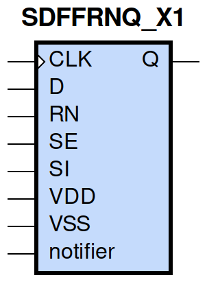
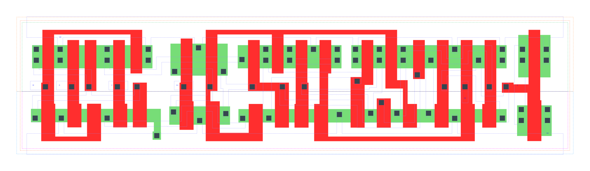

====================================
gf180mcu_fd_sc_mcu9t5v0__sdffrnq_x1
====================================

**gf180mcu_fd_sc_mcu9t5v0__sdffrnq_x1 symbol**

**gf180mcu_fd_sc_mcu9t5v0__sdffrnq_x1 schematic**

.. image:: sc9_sch/SDFFRNQ_X1_sch.png
    :height: 250px
    :width: 450 px
    :align: center
    :alt: gf180mcu_fd_sc_mcu9t5v0__sdffrnq_x1 schematic

**gf180mcu_fd_sc_mcu9t5v0__sdffrnq_x1 layout**

.. include:: images.rst
| SDFFRNQ_X1 is a positive edge triggered scan D-type flip flop with active low reset and 1X drive strength

|
| Attributes

============= =======================
**Attribute** **Value**
area          115.718400 µm\ :sup:`2`
============= =======================

|

TRUTH TABLE

===== == == = === ======
Input             Output
RN    SE SI D CLK Q
H     L  X  L ↑   L
H     L  X  H ↑   H
H     H  L  X ↑   L
H     H  H  X ↑   H
L     X  X  X X   L
===== == == = === ======

|
| FUNCTIONAL SCHEMATIC
| |image626|
| CONSTRAINTS

================== =============== ============= ============
**Constraint Pin** **Related Pin** **setup(ns)** **hold(ns)**
SE(LH)             CLK(LH)         0.4580        -0.2120
SE(LH)             CLK(LH)         0.6240        -0.0970
SE(HL)             CLK(LH)         0.5150        -0.0630
SE(HL)             CLK(LH)         0.5320        -0.3030
SI(HL)             CLK(LH)         0.5900        -0.0920
SI(HL)             CLK(LH)         0.5950        -0.0630
SI(LH)             CLK(LH)         0.5100        -0.2580
SI(LH)             CLK(LH)         0.4980        -0.2520
D(HL)              CLK(LH)         0.4980        -0.0460
D(HL)              CLK(LH)         0.4980        -0.0460
D(LH)              CLK(LH)         0.4290        -0.2000
D(LH)              CLK(LH)         0.4290        -0.2000
================== =============== ============= ============

|

================== =============== ================ ===============
**Constraint Pin** **Related Pin** **recovery(ns)** **removal(ns)**
RN(LH)             CLK(LH)         -0.1890          0.3320
RN(LH)             CLK(LH)         -0.1890          0.3320
RN(LH)             CLK(LH)         -0.1890          0.3320
RN(LH)             CLK(LH)         -0.1890          0.3320
================== =============== ================ ===============

|

================== =============== ===========================
**Constraint Pin** **Related Pin** **Minimum Pulse Width(ns)**
CLK(HLH)           CLK(HL)         0.6070
CLK(HLH)           CLK(HL)         0.6320
CLK(HLH)           CLK(HL)         0.6070
CLK(HLH)           CLK(HL)         0.5590
CLK(HLH)           CLK(HL)         0.4850
CLK(HLH)           CLK(HL)         0.6930
CLK(HLH)           CLK(HL)         0.4850
CLK(HLH)           CLK(HL)         0.5280
CLK(LHL)           CLK(LH)         0.3390
CLK(LHL)           CLK(LH)         0.3390
CLK(LHL)           CLK(LH)         0.3390
CLK(LHL)           CLK(LH)         0.3780
CLK(LHL)           CLK(LH)         0.3780
CLK(LHL)           CLK(LH)         0.3390
CLK(LHL)           CLK(LH)         0.3780
CLK(LHL)           CLK(LH)         0.3780
RN(HLH)            RN(HL)          0.3190
RN(HLH)            RN(HL)          0.3190
RN(HLH)            RN(HL)          0.3190
RN(HLH)            RN(HL)          0.3190
RN(HLH)            RN(HL)          0.3580
RN(HLH)            RN(HL)          0.3580
RN(HLH)            RN(HL)          0.3580
RN(HLH)            RN(HL)          0.3580
RN(HLH)            RN(HL)          0.3190
RN(HLH)            RN(HL)          0.3190
RN(HLH)            RN(HL)          0.3190
RN(HLH)            RN(HL)          0.3580
RN(HLH)            RN(HL)          0.3580
RN(HLH)            RN(HL)          0.3580
RN(HLH)            RN(HL)          0.3580
RN(HLH)            RN(HL)          0.3190
================== =============== ===========================

|
| PIN CAPACITANCE (pf)

======= ======== ====================
**Pin** **Type** **Capacitance (pf)**
SE      input    0.0084
SI      input    0.0039
D       input    0.0039
CLK     input    0.0050
RN      input    0.0080
======= ======== ====================

|
| DELAY AND OUTPUT TRANSITION TIME corresponding to min slew and load

+---------------+------------+--------------------+--------------+-------------------+----------------+---------------+
| **Input Pin** | **Output** | **When Condition** | **Tin (ns)** | **Out Load (pf)** | **Delay (ns)** | **Tout (ns)** |
+---------------+------------+--------------------+--------------+-------------------+----------------+---------------+
| CLK(LH)       | Q(HL)      | !D&RN&!SE&!SI      | 0.0100       | 0.0010            | 0.5590         | 0.0415        |
+---------------+------------+--------------------+--------------+-------------------+----------------+---------------+
| CLK(LH)       | Q(HL)      | !D&RN&!SE&SI       | 0.0100       | 0.0010            | 0.5590         | 0.0415        |
+---------------+------------+--------------------+--------------+-------------------+----------------+---------------+
| CLK(LH)       | Q(HL)      | !D&RN&SE&!SI       | 0.0100       | 0.0010            | 0.5591         | 0.0416        |
+---------------+------------+--------------------+--------------+-------------------+----------------+---------------+
| CLK(LH)       | Q(HL)      | D&RN&SE&!SI        | 0.0100       | 0.0010            | 0.5590         | 0.0415        |
+---------------+------------+--------------------+--------------+-------------------+----------------+---------------+
| CLK(LH)       | Q(LH)      | !D&RN&SE&SI        | 0.0100       | 0.0010            | 0.6184         | 0.0518        |
+---------------+------------+--------------------+--------------+-------------------+----------------+---------------+
| CLK(LH)       | Q(LH)      | D&RN&!SE&!SI       | 0.0100       | 0.0010            | 0.6184         | 0.0518        |
+---------------+------------+--------------------+--------------+-------------------+----------------+---------------+
| CLK(LH)       | Q(LH)      | D&RN&!SE&SI        | 0.0100       | 0.0010            | 0.6184         | 0.0518        |
+---------------+------------+--------------------+--------------+-------------------+----------------+---------------+
| CLK(LH)       | Q(LH)      | D&RN&SE&SI         | 0.0100       | 0.0010            | 0.6185         | 0.0518        |
+---------------+------------+--------------------+--------------+-------------------+----------------+---------------+
| RN(HL)        | Q(HL)      | !CLK&!D&!SE&!SI    | 0.0100       | 0.0010            | 0.2144         | 0.0426        |
+---------------+------------+--------------------+--------------+-------------------+----------------+---------------+
| RN(HL)        | Q(HL)      | !CLK&D&SE&!SI      | 0.0100       | 0.0010            | 0.2144         | 0.0426        |
+---------------+------------+--------------------+--------------+-------------------+----------------+---------------+
| RN(HL)        | Q(HL)      | !CLK&D&!SE&SI      | 0.0100       | 0.0010            | 0.2143         | 0.0427        |
+---------------+------------+--------------------+--------------+-------------------+----------------+---------------+
| RN(HL)        | Q(HL)      | !CLK&D&SE&SI       | 0.0100       | 0.0010            | 0.2143         | 0.0427        |
+---------------+------------+--------------------+--------------+-------------------+----------------+---------------+
| RN(HL)        | Q(HL)      | CLK&D&!SE&!SI      | 0.0100       | 0.0010            | 0.2146         | 0.0425        |
+---------------+------------+--------------------+--------------+-------------------+----------------+---------------+
| RN(HL)        | Q(HL)      | CLK&D&SE&!SI       | 0.0100       | 0.0010            | 0.2146         | 0.0425        |
+---------------+------------+--------------------+--------------+-------------------+----------------+---------------+
| RN(HL)        | Q(HL)      | CLK&D&!SE&SI       | 0.0100       | 0.0010            | 0.2146         | 0.0425        |
+---------------+------------+--------------------+--------------+-------------------+----------------+---------------+
| RN(HL)        | Q(HL)      | CLK&D&SE&SI        | 0.0100       | 0.0010            | 0.2146         | 0.0425        |
+---------------+------------+--------------------+--------------+-------------------+----------------+---------------+
| RN(HL)        | Q(HL)      | !CLK&!D&SE&!SI     | 0.0100       | 0.0010            | 0.2144         | 0.0426        |
+---------------+------------+--------------------+--------------+-------------------+----------------+---------------+
| RN(HL)        | Q(HL)      | !CLK&!D&!SE&SI     | 0.0100       | 0.0010            | 0.2144         | 0.0426        |
+---------------+------------+--------------------+--------------+-------------------+----------------+---------------+
| RN(HL)        | Q(HL)      | !CLK&!D&SE&SI      | 0.0100       | 0.0010            | 0.2143         | 0.0427        |
+---------------+------------+--------------------+--------------+-------------------+----------------+---------------+
| RN(HL)        | Q(HL)      | CLK&!D&!SE&!SI     | 0.0100       | 0.0010            | 0.2146         | 0.0425        |
+---------------+------------+--------------------+--------------+-------------------+----------------+---------------+
| RN(HL)        | Q(HL)      | CLK&!D&SE&!SI      | 0.0100       | 0.0010            | 0.2146         | 0.0425        |
+---------------+------------+--------------------+--------------+-------------------+----------------+---------------+
| RN(HL)        | Q(HL)      | CLK&!D&!SE&SI      | 0.0100       | 0.0010            | 0.2146         | 0.0425        |
+---------------+------------+--------------------+--------------+-------------------+----------------+---------------+
| RN(HL)        | Q(HL)      | CLK&!D&SE&SI       | 0.0100       | 0.0010            | 0.2146         | 0.0425        |
+---------------+------------+--------------------+--------------+-------------------+----------------+---------------+
| RN(HL)        | Q(HL)      | !CLK&D&!SE&!SI     | 0.0100       | 0.0010            | 0.2143         | 0.0427        |
+---------------+------------+--------------------+--------------+-------------------+----------------+---------------+

|
| DYNAMIC ENERGY

+---------------+--------------------+--------------+------------+-------------------+---------------------+
| **Input Pin** | **When Condition** | **Tin (ns)** | **Output** | **Out Load (pf)** | **Energy (uW/MHz)** |
+---------------+--------------------+--------------+------------+-------------------+---------------------+
| CLK           | !D&RN&!SE&!SI      | 0.0100       | Q(HL)      | 0.0010            | 0.7888              |
+---------------+--------------------+--------------+------------+-------------------+---------------------+
| CLK           | !D&RN&!SE&SI       | 0.0100       | Q(HL)      | 0.0010            | 0.7888              |
+---------------+--------------------+--------------+------------+-------------------+---------------------+
| CLK           | !D&RN&SE&!SI       | 0.0100       | Q(HL)      | 0.0010            | 0.7887              |
+---------------+--------------------+--------------+------------+-------------------+---------------------+
| CLK           | D&RN&SE&!SI        | 0.0100       | Q(HL)      | 0.0010            | 0.7885              |
+---------------+--------------------+--------------+------------+-------------------+---------------------+
| CLK           | !D&RN&SE&SI        | 0.0100       | Q(LH)      | 0.0010            | 0.8282              |
+---------------+--------------------+--------------+------------+-------------------+---------------------+
| CLK           | D&RN&!SE&!SI       | 0.0100       | Q(LH)      | 0.0010            | 0.8281              |
+---------------+--------------------+--------------+------------+-------------------+---------------------+
| CLK           | D&RN&!SE&SI        | 0.0100       | Q(LH)      | 0.0010            | 0.8281              |
+---------------+--------------------+--------------+------------+-------------------+---------------------+
| CLK           | D&RN&SE&SI         | 0.0100       | Q(LH)      | 0.0010            | 0.8283              |
+---------------+--------------------+--------------+------------+-------------------+---------------------+
| RN            | !CLK&!D&!SE&!SI    | 0.0100       | Q(HL)      | 0.0010            | 0.5407              |
+---------------+--------------------+--------------+------------+-------------------+---------------------+
| RN            | !CLK&D&SE&!SI      | 0.0100       | Q(HL)      | 0.0010            | 0.5407              |
+---------------+--------------------+--------------+------------+-------------------+---------------------+
| RN            | !CLK&D&!SE&SI      | 0.0100       | Q(HL)      | 0.0010            | 0.5586              |
+---------------+--------------------+--------------+------------+-------------------+---------------------+
| RN            | !CLK&D&SE&SI       | 0.0100       | Q(HL)      | 0.0010            | 0.5587              |
+---------------+--------------------+--------------+------------+-------------------+---------------------+
| RN            | CLK&D&!SE&!SI      | 0.0100       | Q(HL)      | 0.0010            | 0.8370              |
+---------------+--------------------+--------------+------------+-------------------+---------------------+
| RN            | CLK&D&SE&!SI       | 0.0100       | Q(HL)      | 0.0010            | 0.8370              |
+---------------+--------------------+--------------+------------+-------------------+---------------------+
| RN            | CLK&D&!SE&SI       | 0.0100       | Q(HL)      | 0.0010            | 0.8370              |
+---------------+--------------------+--------------+------------+-------------------+---------------------+
| RN            | CLK&D&SE&SI        | 0.0100       | Q(HL)      | 0.0010            | 0.8370              |
+---------------+--------------------+--------------+------------+-------------------+---------------------+
| RN            | !CLK&!D&SE&!SI     | 0.0100       | Q(HL)      | 0.0010            | 0.5407              |
+---------------+--------------------+--------------+------------+-------------------+---------------------+
| RN            | !CLK&!D&!SE&SI     | 0.0100       | Q(HL)      | 0.0010            | 0.5407              |
+---------------+--------------------+--------------+------------+-------------------+---------------------+
| RN            | !CLK&!D&SE&SI      | 0.0100       | Q(HL)      | 0.0010            | 0.5587              |
+---------------+--------------------+--------------+------------+-------------------+---------------------+
| RN            | CLK&!D&!SE&!SI     | 0.0100       | Q(HL)      | 0.0010            | 0.8371              |
+---------------+--------------------+--------------+------------+-------------------+---------------------+
| RN            | CLK&!D&SE&!SI      | 0.0100       | Q(HL)      | 0.0010            | 0.8370              |
+---------------+--------------------+--------------+------------+-------------------+---------------------+
| RN            | CLK&!D&!SE&SI      | 0.0100       | Q(HL)      | 0.0010            | 0.8371              |
+---------------+--------------------+--------------+------------+-------------------+---------------------+
| RN            | CLK&!D&SE&SI       | 0.0100       | Q(HL)      | 0.0010            | 0.8370              |
+---------------+--------------------+--------------+------------+-------------------+---------------------+
| RN            | !CLK&D&!SE&!SI     | 0.0100       | Q(HL)      | 0.0010            | 0.5586              |
+---------------+--------------------+--------------+------------+-------------------+---------------------+
| D(HL)         | !CLK&!RN&!SE&!SI   | 0.0100       | n/a        | n/a               | 0.4215              |
+---------------+--------------------+--------------+------------+-------------------+---------------------+
| D(HL)         | !CLK&!RN&!SE&SI    | 0.0100       | n/a        | n/a               | 0.4215              |
+---------------+--------------------+--------------+------------+-------------------+---------------------+
| D(HL)         | !CLK&!RN&SE&!SI    | 0.0100       | n/a        | n/a               | 0.0329              |
+---------------+--------------------+--------------+------------+-------------------+---------------------+
| D(HL)         | !CLK&!RN&SE&SI     | 0.0100       | n/a        | n/a               | 0.0153              |
+---------------+--------------------+--------------+------------+-------------------+---------------------+
| D(HL)         | CLK&!RN&!SE&!SI    | 0.0100       | n/a        | n/a               | 0.0367              |
+---------------+--------------------+--------------+------------+-------------------+---------------------+
| D(HL)         | CLK&!RN&!SE&SI     | 0.0100       | n/a        | n/a               | 0.0367              |
+---------------+--------------------+--------------+------------+-------------------+---------------------+
| D(HL)         | CLK&!RN&SE&!SI     | 0.0100       | n/a        | n/a               | 0.0392              |
+---------------+--------------------+--------------+------------+-------------------+---------------------+
| D(HL)         | CLK&!RN&SE&SI      | 0.0100       | n/a        | n/a               | 0.0169              |
+---------------+--------------------+--------------+------------+-------------------+---------------------+
| D(HL)         | CLK&RN&!SE&!SI     | 0.0100       | n/a        | n/a               | 0.0622              |
+---------------+--------------------+--------------+------------+-------------------+---------------------+
| D(HL)         | CLK&RN&SE&!SI      | 0.0100       | n/a        | n/a               | 0.0321              |
+---------------+--------------------+--------------+------------+-------------------+---------------------+
| D(HL)         | CLK&RN&!SE&SI      | 0.0100       | n/a        | n/a               | 0.0622              |
+---------------+--------------------+--------------+------------+-------------------+---------------------+
| D(HL)         | CLK&RN&SE&SI       | 0.0100       | n/a        | n/a               | 0.0136              |
+---------------+--------------------+--------------+------------+-------------------+---------------------+
| D(HL)         | !CLK&RN&!SE&!SI    | 0.0100       | n/a        | n/a               | 0.4031              |
+---------------+--------------------+--------------+------------+-------------------+---------------------+
| D(HL)         | !CLK&RN&SE&!SI     | 0.0100       | n/a        | n/a               | 0.0329              |
+---------------+--------------------+--------------+------------+-------------------+---------------------+
| D(HL)         | !CLK&RN&!SE&SI     | 0.0100       | n/a        | n/a               | 0.4031              |
+---------------+--------------------+--------------+------------+-------------------+---------------------+
| D(HL)         | !CLK&RN&SE&SI      | 0.0100       | n/a        | n/a               | 0.0153              |
+---------------+--------------------+--------------+------------+-------------------+---------------------+
| SE(LH)        | !CLK&!D&!RN&!SI    | 0.0100       | n/a        | n/a               | 0.0029              |
+---------------+--------------------+--------------+------------+-------------------+---------------------+
| SE(LH)        | !CLK&!D&!RN&SI     | 0.0100       | n/a        | n/a               | 0.2712              |
+---------------+--------------------+--------------+------------+-------------------+---------------------+
| SE(LH)        | !CLK&D&!RN&!SI     | 0.0100       | n/a        | n/a               | 0.4508              |
+---------------+--------------------+--------------+------------+-------------------+---------------------+
| SE(LH)        | !CLK&D&!RN&SI      | 0.0100       | n/a        | n/a               | -0.0120             |
+---------------+--------------------+--------------+------------+-------------------+---------------------+
| SE(LH)        | CLK&!D&!RN&!SI     | 0.0100       | n/a        | n/a               | -0.0000             |
+---------------+--------------------+--------------+------------+-------------------+---------------------+
| SE(LH)        | CLK&!D&!RN&SI      | 0.0100       | n/a        | n/a               | -0.0086             |
+---------------+--------------------+--------------+------------+-------------------+---------------------+
| SE(LH)        | CLK&D&!RN&!SI      | 0.0100       | n/a        | n/a               | 0.0008              |
+---------------+--------------------+--------------+------------+-------------------+---------------------+
| SE(LH)        | CLK&D&!RN&SI       | 0.0100       | n/a        | n/a               | -0.0125             |
+---------------+--------------------+--------------+------------+-------------------+---------------------+
| SE(LH)        | !CLK&D&RN&!SI      | 0.0100       | n/a        | n/a               | 0.4315              |
+---------------+--------------------+--------------+------------+-------------------+---------------------+
| SE(LH)        | !CLK&D&RN&SI       | 0.0100       | n/a        | n/a               | -0.0120             |
+---------------+--------------------+--------------+------------+-------------------+---------------------+
| SE(LH)        | CLK&D&RN&!SI       | 0.0100       | n/a        | n/a               | 0.0335              |
+---------------+--------------------+--------------+------------+-------------------+---------------------+
| SE(LH)        | CLK&D&RN&SI        | 0.0100       | n/a        | n/a               | -0.0156             |
+---------------+--------------------+--------------+------------+-------------------+---------------------+
| SE(LH)        | !CLK&!D&RN&!SI     | 0.0100       | n/a        | n/a               | 0.0029              |
+---------------+--------------------+--------------+------------+-------------------+---------------------+
| SE(LH)        | !CLK&!D&RN&SI      | 0.0100       | n/a        | n/a               | 0.2813              |
+---------------+--------------------+--------------+------------+-------------------+---------------------+
| SE(LH)        | CLK&!D&RN&!SI      | 0.0100       | n/a        | n/a               | -0.0000             |
+---------------+--------------------+--------------+------------+-------------------+---------------------+
| SE(LH)        | CLK&!D&RN&SI       | 0.0100       | n/a        | n/a               | -0.0086             |
+---------------+--------------------+--------------+------------+-------------------+---------------------+
| CLK(LH)       | !D&!RN&!SE&!SI     | 0.0100       | n/a        | n/a               | 0.2920              |
+---------------+--------------------+--------------+------------+-------------------+---------------------+
| CLK(LH)       | !D&!RN&!SE&SI      | 0.0100       | n/a        | n/a               | 0.2920              |
+---------------+--------------------+--------------+------------+-------------------+---------------------+
| CLK(LH)       | !D&!RN&SE&!SI      | 0.0100       | n/a        | n/a               | 0.2920              |
+---------------+--------------------+--------------+------------+-------------------+---------------------+
| CLK(LH)       | !D&!RN&SE&SI       | 0.0100       | n/a        | n/a               | 0.6240              |
+---------------+--------------------+--------------+------------+-------------------+---------------------+
| CLK(LH)       | D&!RN&!SE&!SI      | 0.0100       | n/a        | n/a               | 0.6240              |
+---------------+--------------------+--------------+------------+-------------------+---------------------+
| CLK(LH)       | D&!RN&!SE&SI       | 0.0100       | n/a        | n/a               | 0.6240              |
+---------------+--------------------+--------------+------------+-------------------+---------------------+
| CLK(LH)       | D&!RN&SE&!SI       | 0.0100       | n/a        | n/a               | 0.2920              |
+---------------+--------------------+--------------+------------+-------------------+---------------------+
| CLK(LH)       | D&!RN&SE&SI        | 0.0100       | n/a        | n/a               | 0.6240              |
+---------------+--------------------+--------------+------------+-------------------+---------------------+
| CLK(LH)       | D&RN&!SE&!SI       | 0.0100       | n/a        | n/a               | 0.2850              |
+---------------+--------------------+--------------+------------+-------------------+---------------------+
| CLK(LH)       | D&RN&SE&!SI        | 0.0100       | n/a        | n/a               | 0.2920              |
+---------------+--------------------+--------------+------------+-------------------+---------------------+
| CLK(LH)       | D&RN&!SE&SI        | 0.0100       | n/a        | n/a               | 0.2850              |
+---------------+--------------------+--------------+------------+-------------------+---------------------+
| CLK(LH)       | D&RN&SE&SI         | 0.0100       | n/a        | n/a               | 0.2850              |
+---------------+--------------------+--------------+------------+-------------------+---------------------+
| CLK(LH)       | !D&RN&!SE&!SI      | 0.0100       | n/a        | n/a               | 0.2920              |
+---------------+--------------------+--------------+------------+-------------------+---------------------+
| CLK(LH)       | !D&RN&SE&!SI       | 0.0100       | n/a        | n/a               | 0.2920              |
+---------------+--------------------+--------------+------------+-------------------+---------------------+
| CLK(LH)       | !D&RN&!SE&SI       | 0.0100       | n/a        | n/a               | 0.2920              |
+---------------+--------------------+--------------+------------+-------------------+---------------------+
| CLK(LH)       | !D&RN&SE&SI        | 0.0100       | n/a        | n/a               | 0.2852              |
+---------------+--------------------+--------------+------------+-------------------+---------------------+
| SI(LH)        | !CLK&!D&!RN&!SE    | 0.0100       | n/a        | n/a               | -0.0315             |
+---------------+--------------------+--------------+------------+-------------------+---------------------+
| SI(LH)        | !CLK&!D&!RN&SE     | 0.0100       | n/a        | n/a               | 0.2722              |
+---------------+--------------------+--------------+------------+-------------------+---------------------+
| SI(LH)        | !CLK&D&!RN&!SE     | 0.0100       | n/a        | n/a               | -0.0293             |
+---------------+--------------------+--------------+------------+-------------------+---------------------+
| SI(LH)        | !CLK&D&!RN&SE      | 0.0100       | n/a        | n/a               | 0.2521              |
+---------------+--------------------+--------------+------------+-------------------+---------------------+
| SI(LH)        | CLK&!D&!RN&!SE     | 0.0100       | n/a        | n/a               | -0.0315             |
+---------------+--------------------+--------------+------------+-------------------+---------------------+
| SI(LH)        | CLK&!D&!RN&SE      | 0.0100       | n/a        | n/a               | -0.0260             |
+---------------+--------------------+--------------+------------+-------------------+---------------------+
| SI(LH)        | CLK&D&!RN&!SE      | 0.0100       | n/a        | n/a               | -0.0304             |
+---------------+--------------------+--------------+------------+-------------------+---------------------+
| SI(LH)        | CLK&D&!RN&SE       | 0.0100       | n/a        | n/a               | -0.0262             |
+---------------+--------------------+--------------+------------+-------------------+---------------------+
| SI(LH)        | !CLK&D&RN&!SE      | 0.0100       | n/a        | n/a               | -0.0293             |
+---------------+--------------------+--------------+------------+-------------------+---------------------+
| SI(LH)        | !CLK&D&RN&SE       | 0.0100       | n/a        | n/a               | 0.2624              |
+---------------+--------------------+--------------+------------+-------------------+---------------------+
| SI(LH)        | CLK&D&RN&!SE       | 0.0100       | n/a        | n/a               | -0.0298             |
+---------------+--------------------+--------------+------------+-------------------+---------------------+
| SI(LH)        | CLK&D&RN&SE        | 0.0100       | n/a        | n/a               | -0.0262             |
+---------------+--------------------+--------------+------------+-------------------+---------------------+
| SI(LH)        | !CLK&!D&RN&!SE     | 0.0100       | n/a        | n/a               | -0.0316             |
+---------------+--------------------+--------------+------------+-------------------+---------------------+
| SI(LH)        | !CLK&!D&RN&SE      | 0.0100       | n/a        | n/a               | 0.2824              |
+---------------+--------------------+--------------+------------+-------------------+---------------------+
| SI(LH)        | CLK&!D&RN&!SE      | 0.0100       | n/a        | n/a               | -0.0315             |
+---------------+--------------------+--------------+------------+-------------------+---------------------+
| SI(LH)        | CLK&!D&RN&SE       | 0.0100       | n/a        | n/a               | -0.0260             |
+---------------+--------------------+--------------+------------+-------------------+---------------------+
| SE(HL)        | !CLK&!D&!RN&!SI    | 0.0100       | n/a        | n/a               | 0.1895              |
+---------------+--------------------+--------------+------------+-------------------+---------------------+
| SE(HL)        | !CLK&!D&!RN&SI     | 0.0100       | n/a        | n/a               | 0.6021              |
+---------------+--------------------+--------------+------------+-------------------+---------------------+
| SE(HL)        | !CLK&D&!RN&!SI     | 0.0100       | n/a        | n/a               | 0.4576              |
+---------------+--------------------+--------------+------------+-------------------+---------------------+
| SE(HL)        | !CLK&D&!RN&SI      | 0.0100       | n/a        | n/a               | 0.1920              |
+---------------+--------------------+--------------+------------+-------------------+---------------------+
| SE(HL)        | CLK&!D&!RN&!SI     | 0.0100       | n/a        | n/a               | 0.1973              |
+---------------+--------------------+--------------+------------+-------------------+---------------------+
| SE(HL)        | CLK&!D&!RN&SI      | 0.0100       | n/a        | n/a               | 0.1936              |
+---------------+--------------------+--------------+------------+-------------------+---------------------+
| SE(HL)        | CLK&D&!RN&!SI      | 0.0100       | n/a        | n/a               | 0.1930              |
+---------------+--------------------+--------------+------------+-------------------+---------------------+
| SE(HL)        | CLK&D&!RN&SI       | 0.0100       | n/a        | n/a               | 0.1939              |
+---------------+--------------------+--------------+------------+-------------------+---------------------+
| SE(HL)        | !CLK&D&RN&!SI      | 0.0100       | n/a        | n/a               | 0.4681              |
+---------------+--------------------+--------------+------------+-------------------+---------------------+
| SE(HL)        | !CLK&D&RN&SI       | 0.0100       | n/a        | n/a               | 0.1921              |
+---------------+--------------------+--------------+------------+-------------------+---------------------+
| SE(HL)        | CLK&D&RN&!SI       | 0.0100       | n/a        | n/a               | 0.1949              |
+---------------+--------------------+--------------+------------+-------------------+---------------------+
| SE(HL)        | CLK&D&RN&SI        | 0.0100       | n/a        | n/a               | 0.1915              |
+---------------+--------------------+--------------+------------+-------------------+---------------------+
| SE(HL)        | !CLK&!D&RN&!SI     | 0.0100       | n/a        | n/a               | 0.1895              |
+---------------+--------------------+--------------+------------+-------------------+---------------------+
| SE(HL)        | !CLK&!D&RN&SI      | 0.0100       | n/a        | n/a               | 0.5837              |
+---------------+--------------------+--------------+------------+-------------------+---------------------+
| SE(HL)        | CLK&!D&RN&!SI      | 0.0100       | n/a        | n/a               | 0.1887              |
+---------------+--------------------+--------------+------------+-------------------+---------------------+
| SE(HL)        | CLK&!D&RN&SI       | 0.0100       | n/a        | n/a               | 0.2432              |
+---------------+--------------------+--------------+------------+-------------------+---------------------+
| CLK(HL)       | !D&!RN&!SE&!SI     | 0.0100       | n/a        | n/a               | 0.4403              |
+---------------+--------------------+--------------+------------+-------------------+---------------------+
| CLK(HL)       | !D&!RN&!SE&SI      | 0.0100       | n/a        | n/a               | 0.4403              |
+---------------+--------------------+--------------+------------+-------------------+---------------------+
| CLK(HL)       | !D&!RN&SE&!SI      | 0.0100       | n/a        | n/a               | 0.4686              |
+---------------+--------------------+--------------+------------+-------------------+---------------------+
| CLK(HL)       | !D&!RN&SE&SI       | 0.0100       | n/a        | n/a               | 0.6650              |
+---------------+--------------------+--------------+------------+-------------------+---------------------+
| CLK(HL)       | D&!RN&!SE&!SI      | 0.0100       | n/a        | n/a               | 0.6217              |
+---------------+--------------------+--------------+------------+-------------------+---------------------+
| CLK(HL)       | D&!RN&!SE&SI       | 0.0100       | n/a        | n/a               | 0.6217              |
+---------------+--------------------+--------------+------------+-------------------+---------------------+
| CLK(HL)       | D&!RN&SE&!SI       | 0.0100       | n/a        | n/a               | 0.5006              |
+---------------+--------------------+--------------+------------+-------------------+---------------------+
| CLK(HL)       | D&!RN&SE&SI        | 0.0100       | n/a        | n/a               | 0.6433              |
+---------------+--------------------+--------------+------------+-------------------+---------------------+
| CLK(HL)       | D&RN&!SE&!SI       | 0.0100       | n/a        | n/a               | 0.3817              |
+---------------+--------------------+--------------+------------+-------------------+---------------------+
| CLK(HL)       | D&RN&SE&!SI        | 0.0100       | n/a        | n/a               | 0.3822              |
+---------------+--------------------+--------------+------------+-------------------+---------------------+
| CLK(HL)       | D&RN&!SE&SI        | 0.0100       | n/a        | n/a               | 0.3817              |
+---------------+--------------------+--------------+------------+-------------------+---------------------+
| CLK(HL)       | D&RN&SE&SI         | 0.0100       | n/a        | n/a               | 0.3815              |
+---------------+--------------------+--------------+------------+-------------------+---------------------+
| CLK(HL)       | !D&RN&!SE&!SI      | 0.0100       | n/a        | n/a               | 0.3822              |
+---------------+--------------------+--------------+------------+-------------------+---------------------+
| CLK(HL)       | !D&RN&SE&!SI       | 0.0100       | n/a        | n/a               | 0.3823              |
+---------------+--------------------+--------------+------------+-------------------+---------------------+
| CLK(HL)       | !D&RN&!SE&SI       | 0.0100       | n/a        | n/a               | 0.3822              |
+---------------+--------------------+--------------+------------+-------------------+---------------------+
| CLK(HL)       | !D&RN&SE&SI        | 0.0100       | n/a        | n/a               | 0.3815              |
+---------------+--------------------+--------------+------------+-------------------+---------------------+
| SI(HL)        | !CLK&!D&!RN&!SE    | 0.0100       | n/a        | n/a               | 0.0324              |
+---------------+--------------------+--------------+------------+-------------------+---------------------+
| SI(HL)        | !CLK&!D&!RN&SE     | 0.0100       | n/a        | n/a               | 0.5058              |
+---------------+--------------------+--------------+------------+-------------------+---------------------+
| SI(HL)        | !CLK&D&!RN&!SE     | 0.0100       | n/a        | n/a               | 0.0320              |
+---------------+--------------------+--------------+------------+-------------------+---------------------+
| SI(HL)        | !CLK&D&!RN&SE      | 0.0100       | n/a        | n/a               | 0.5165              |
+---------------+--------------------+--------------+------------+-------------------+---------------------+
| SI(HL)        | CLK&!D&!RN&!SE     | 0.0100       | n/a        | n/a               | 0.0320              |
+---------------+--------------------+--------------+------------+-------------------+---------------------+
| SI(HL)        | CLK&!D&!RN&SE      | 0.0100       | n/a        | n/a               | 0.0324              |
+---------------+--------------------+--------------+------------+-------------------+---------------------+
| SI(HL)        | CLK&D&!RN&!SE      | 0.0100       | n/a        | n/a               | 0.0320              |
+---------------+--------------------+--------------+------------+-------------------+---------------------+
| SI(HL)        | CLK&D&!RN&SE       | 0.0100       | n/a        | n/a               | 0.0322              |
+---------------+--------------------+--------------+------------+-------------------+---------------------+
| SI(HL)        | !CLK&D&RN&!SE      | 0.0100       | n/a        | n/a               | 0.0320              |
+---------------+--------------------+--------------+------------+-------------------+---------------------+
| SI(HL)        | !CLK&D&RN&SE       | 0.0100       | n/a        | n/a               | 0.4970              |
+---------------+--------------------+--------------+------------+-------------------+---------------------+
| SI(HL)        | CLK&D&RN&!SE       | 0.0100       | n/a        | n/a               | 0.0321              |
+---------------+--------------------+--------------+------------+-------------------+---------------------+
| SI(HL)        | CLK&D&RN&SE        | 0.0100       | n/a        | n/a               | 0.0880              |
+---------------+--------------------+--------------+------------+-------------------+---------------------+
| SI(HL)        | !CLK&!D&RN&!SE     | 0.0100       | n/a        | n/a               | 0.0325              |
+---------------+--------------------+--------------+------------+-------------------+---------------------+
| SI(HL)        | !CLK&!D&RN&SE      | 0.0100       | n/a        | n/a               | 0.4867              |
+---------------+--------------------+--------------+------------+-------------------+---------------------+
| SI(HL)        | CLK&!D&RN&!SE      | 0.0100       | n/a        | n/a               | 0.0320              |
+---------------+--------------------+--------------+------------+-------------------+---------------------+
| SI(HL)        | CLK&!D&RN&SE       | 0.0100       | n/a        | n/a               | 0.1113              |
+---------------+--------------------+--------------+------------+-------------------+---------------------+
| D(LH)         | !CLK&!RN&!SE&!SI   | 0.0100       | n/a        | n/a               | 0.2358              |
+---------------+--------------------+--------------+------------+-------------------+---------------------+
| D(LH)         | !CLK&!RN&!SE&SI    | 0.0100       | n/a        | n/a               | 0.2358              |
+---------------+--------------------+--------------+------------+-------------------+---------------------+
| D(LH)         | !CLK&!RN&SE&!SI    | 0.0100       | n/a        | n/a               | -0.0289             |
+---------------+--------------------+--------------+------------+-------------------+---------------------+
| D(LH)         | !CLK&!RN&SE&SI     | 0.0100       | n/a        | n/a               | -0.0103             |
+---------------+--------------------+--------------+------------+-------------------+---------------------+
| D(LH)         | CLK&!RN&!SE&!SI    | 0.0100       | n/a        | n/a               | -0.0280             |
+---------------+--------------------+--------------+------------+-------------------+---------------------+
| D(LH)         | CLK&!RN&!SE&SI     | 0.0100       | n/a        | n/a               | -0.0277             |
+---------------+--------------------+--------------+------------+-------------------+---------------------+
| D(LH)         | CLK&!RN&SE&!SI     | 0.0100       | n/a        | n/a               | -0.0313             |
+---------------+--------------------+--------------+------------+-------------------+---------------------+
| D(LH)         | CLK&!RN&SE&SI      | 0.0100       | n/a        | n/a               | -0.0224             |
+---------------+--------------------+--------------+------------+-------------------+---------------------+
| D(LH)         | CLK&RN&!SE&!SI     | 0.0100       | n/a        | n/a               | -0.0280             |
+---------------+--------------------+--------------+------------+-------------------+---------------------+
| D(LH)         | CLK&RN&SE&!SI      | 0.0100       | n/a        | n/a               | -0.0313             |
+---------------+--------------------+--------------+------------+-------------------+---------------------+
| D(LH)         | CLK&RN&!SE&SI      | 0.0100       | n/a        | n/a               | -0.0277             |
+---------------+--------------------+--------------+------------+-------------------+---------------------+
| D(LH)         | CLK&RN&SE&SI       | 0.0100       | n/a        | n/a               | -0.0109             |
+---------------+--------------------+--------------+------------+-------------------+---------------------+
| D(LH)         | !CLK&RN&!SE&!SI    | 0.0100       | n/a        | n/a               | 0.2460              |
+---------------+--------------------+--------------+------------+-------------------+---------------------+
| D(LH)         | !CLK&RN&SE&!SI     | 0.0100       | n/a        | n/a               | -0.0289             |
+---------------+--------------------+--------------+------------+-------------------+---------------------+
| D(LH)         | !CLK&RN&!SE&SI     | 0.0100       | n/a        | n/a               | 0.2460              |
+---------------+--------------------+--------------+------------+-------------------+---------------------+
| D(LH)         | !CLK&RN&SE&SI      | 0.0100       | n/a        | n/a               | -0.0103             |
+---------------+--------------------+--------------+------------+-------------------+---------------------+
| RN(HL)        | !CLK&!D&!SE&!SI    | 0.0100       | n/a        | n/a               | 0.0673              |
+---------------+--------------------+--------------+------------+-------------------+---------------------+
| RN(HL)        | !CLK&D&SE&!SI      | 0.0100       | n/a        | n/a               | 0.0673              |
+---------------+--------------------+--------------+------------+-------------------+---------------------+
| RN(HL)        | !CLK&D&!SE&SI      | 0.0100       | n/a        | n/a               | 0.0665              |
+---------------+--------------------+--------------+------------+-------------------+---------------------+
| RN(HL)        | !CLK&D&SE&SI       | 0.0100       | n/a        | n/a               | 0.0665              |
+---------------+--------------------+--------------+------------+-------------------+---------------------+
| RN(HL)        | CLK&D&!SE&!SI      | 0.0100       | n/a        | n/a               | 0.0693              |
+---------------+--------------------+--------------+------------+-------------------+---------------------+
| RN(HL)        | CLK&D&SE&!SI       | 0.0100       | n/a        | n/a               | 0.0695              |
+---------------+--------------------+--------------+------------+-------------------+---------------------+
| RN(HL)        | CLK&D&!SE&SI       | 0.0100       | n/a        | n/a               | 0.0693              |
+---------------+--------------------+--------------+------------+-------------------+---------------------+
| RN(HL)        | CLK&D&SE&SI        | 0.0100       | n/a        | n/a               | 0.0693              |
+---------------+--------------------+--------------+------------+-------------------+---------------------+
| RN(HL)        | !CLK&!D&SE&!SI     | 0.0100       | n/a        | n/a               | 0.0673              |
+---------------+--------------------+--------------+------------+-------------------+---------------------+
| RN(HL)        | !CLK&!D&!SE&SI     | 0.0100       | n/a        | n/a               | 0.0673              |
+---------------+--------------------+--------------+------------+-------------------+---------------------+
| RN(HL)        | !CLK&!D&SE&SI      | 0.0100       | n/a        | n/a               | 0.0665              |
+---------------+--------------------+--------------+------------+-------------------+---------------------+
| RN(HL)        | CLK&!D&!SE&!SI     | 0.0100       | n/a        | n/a               | 0.0695              |
+---------------+--------------------+--------------+------------+-------------------+---------------------+
| RN(HL)        | CLK&!D&SE&!SI      | 0.0100       | n/a        | n/a               | 0.0695              |
+---------------+--------------------+--------------+------------+-------------------+---------------------+
| RN(HL)        | CLK&!D&!SE&SI      | 0.0100       | n/a        | n/a               | 0.0695              |
+---------------+--------------------+--------------+------------+-------------------+---------------------+
| RN(HL)        | CLK&!D&SE&SI       | 0.0100       | n/a        | n/a               | 0.0693              |
+---------------+--------------------+--------------+------------+-------------------+---------------------+
| RN(HL)        | !CLK&D&!SE&!SI     | 0.0100       | n/a        | n/a               | 0.0665              |
+---------------+--------------------+--------------+------------+-------------------+---------------------+
| RN(LH)        | !CLK&!D&!SE&!SI    | 0.0100       | n/a        | n/a               | -0.0641             |
+---------------+--------------------+--------------+------------+-------------------+---------------------+
| RN(LH)        | !CLK&!D&!SE&SI     | 0.0100       | n/a        | n/a               | -0.0641             |
+---------------+--------------------+--------------+------------+-------------------+---------------------+
| RN(LH)        | !CLK&!D&SE&!SI     | 0.0100       | n/a        | n/a               | -0.0641             |
+---------------+--------------------+--------------+------------+-------------------+---------------------+
| RN(LH)        | !CLK&!D&SE&SI      | 0.0100       | n/a        | n/a               | -0.0591             |
+---------------+--------------------+--------------+------------+-------------------+---------------------+
| RN(LH)        | !CLK&D&!SE&!SI     | 0.0100       | n/a        | n/a               | -0.0591             |
+---------------+--------------------+--------------+------------+-------------------+---------------------+
| RN(LH)        | !CLK&D&!SE&SI      | 0.0100       | n/a        | n/a               | -0.0591             |
+---------------+--------------------+--------------+------------+-------------------+---------------------+
| RN(LH)        | !CLK&D&SE&!SI      | 0.0100       | n/a        | n/a               | -0.0641             |
+---------------+--------------------+--------------+------------+-------------------+---------------------+
| RN(LH)        | !CLK&D&SE&SI       | 0.0100       | n/a        | n/a               | -0.0591             |
+---------------+--------------------+--------------+------------+-------------------+---------------------+
| RN(LH)        | CLK&!D&!SE&!SI     | 0.0100       | n/a        | n/a               | -0.0641             |
+---------------+--------------------+--------------+------------+-------------------+---------------------+
| RN(LH)        | CLK&!D&!SE&SI      | 0.0100       | n/a        | n/a               | -0.0641             |
+---------------+--------------------+--------------+------------+-------------------+---------------------+
| RN(LH)        | CLK&!D&SE&!SI      | 0.0100       | n/a        | n/a               | -0.0641             |
+---------------+--------------------+--------------+------------+-------------------+---------------------+
| RN(LH)        | CLK&!D&SE&SI       | 0.0100       | n/a        | n/a               | -0.0641             |
+---------------+--------------------+--------------+------------+-------------------+---------------------+
| RN(LH)        | CLK&D&!SE&!SI      | 0.0100       | n/a        | n/a               | -0.0641             |
+---------------+--------------------+--------------+------------+-------------------+---------------------+
| RN(LH)        | CLK&D&!SE&SI       | 0.0100       | n/a        | n/a               | -0.0641             |
+---------------+--------------------+--------------+------------+-------------------+---------------------+
| RN(LH)        | CLK&D&SE&!SI       | 0.0100       | n/a        | n/a               | -0.0641             |
+---------------+--------------------+--------------+------------+-------------------+---------------------+
| RN(LH)        | CLK&D&SE&SI        | 0.0100       | n/a        | n/a               | -0.0641             |
+---------------+--------------------+--------------+------------+-------------------+---------------------+

|
| LEAKAGE POWER

=================== ==============
**When Condition**  **Power (nW)**
!CLK&!D&!RN&!SE&!SI 0.4461
!CLK&!D&!RN&!SE&SI  0.4462
!CLK&!D&!RN&SE&!SI  0.4862
!CLK&!D&!RN&SE&SI   0.5122
!CLK&D&!RN&!SE&!SI  0.4406
!CLK&D&!RN&!SE&SI   0.4406
!CLK&D&!RN&SE&!SI   0.5257
!CLK&D&!RN&SE&SI    0.4768
CLK&!D&!RN&!SE&!SI  0.4257
CLK&!D&!RN&!SE&SI   0.4257
CLK&!D&!RN&SE&!SI   0.4266
CLK&!D&!RN&SE&SI    0.4269
CLK&D&!RN&!SE&!SI   0.4260
CLK&D&!RN&!SE&SI    0.4260
CLK&D&!RN&SE&!SI    0.4267
CLK&D&!RN&SE&SI     0.4269
CLK&!D&RN&!SE&!SI   0.4655
CLK&!D&RN&!SE&SI    0.4655
CLK&!D&RN&SE&!SI    0.4664
CLK&D&RN&SE&!SI     0.4664
CLK&!D&RN&SE&SI     0.6751
CLK&D&RN&!SE&!SI    0.6396
CLK&D&RN&!SE&SI     0.6396
CLK&D&RN&SE&SI      0.6591
!CLK&!D&RN&!SE&!SI  0.4463
!CLK&!D&RN&!SE&SI   0.4465
!CLK&!D&RN&SE&!SI   0.4865
!CLK&!D&RN&SE&SI    0.6613
!CLK&D&RN&!SE&!SI   0.5897
!CLK&D&RN&!SE&SI    0.5897
!CLK&D&RN&SE&!SI    0.5260
!CLK&D&RN&SE&SI     0.6259
=================== ==============

