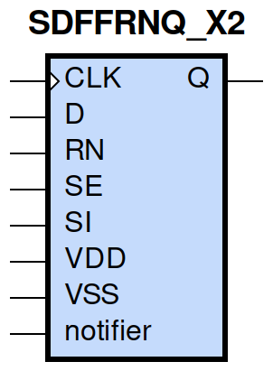
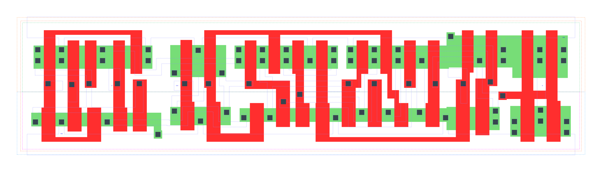

====================================
gf180mcu_fd_sc_mcu9t5v0__sdffrnq_x2
====================================

**gf180mcu_fd_sc_mcu9t5v0__sdffrnq_x2 symbol**

**gf180mcu_fd_sc_mcu9t5v0__sdffrnq_x2 schematic**

.. image:: sc9_sch/SDFFRNQ_X2_sch.png
    :height: 250px
    :width: 450 px
    :align: center
    :alt: gf180mcu_fd_sc_mcu9t5v0__sdffrnq_x2 schematic

**gf180mcu_fd_sc_mcu9t5v0__sdffrnq_x2 layout**

.. include:: images.rst
| SDFFRNQ_X2 is a positive edge triggered scan D-type flip flop with active low reset and 2X drive strength

|
| Attributes

============= =======================
**Attribute** **Value**
area          118.540800 µm\ :sup:`2`
============= =======================

|

TRUTH TABLE

===== == == = === ======
Input             Output
RN    SE SI D CLK Q
H     L  X  L ↑   L
H     L  X  H ↑   H
H     H  L  X ↑   L
H     H  H  X ↑   H
L     X  X  X X   L
===== == == = === ======

|
| FUNCTIONAL SCHEMATIC
| |image629|
| CONSTRAINTS

================== =============== ============= ============
**Constraint Pin** **Related Pin** **setup(ns)** **hold(ns)**
SE(LH)             CLK(LH)         0.4640        -0.2060
SE(LH)             CLK(LH)         0.6350        -0.0860
SE(HL)             CLK(LH)         0.5210        -0.0520
SE(HL)             CLK(LH)         0.5440        -0.3030
SI(HL)             CLK(LH)         0.6010        -0.0860
SI(HL)             CLK(LH)         0.6070        -0.0520
SI(LH)             CLK(LH)         0.5150        -0.2520
SI(LH)             CLK(LH)         0.4980        -0.2460
D(HL)              CLK(LH)         0.5100        -0.0400
D(HL)              CLK(LH)         0.5100        -0.0400
D(LH)              CLK(LH)         0.4350        -0.1950
D(LH)              CLK(LH)         0.4350        -0.1950
================== =============== ============= ============

|

================== =============== ================ ===============
**Constraint Pin** **Related Pin** **recovery(ns)** **removal(ns)**
RN(LH)             CLK(LH)         -0.1770          0.3210
RN(LH)             CLK(LH)         -0.1770          0.3210
RN(LH)             CLK(LH)         -0.1770          0.3210
RN(LH)             CLK(LH)         -0.1770          0.3210
================== =============== ================ ===============

|

================== =============== ===========================
**Constraint Pin** **Related Pin** **Minimum Pulse Width(ns)**
CLK(HLH)           CLK(HL)         0.6080
CLK(HLH)           CLK(HL)         0.6320
CLK(HLH)           CLK(HL)         0.6140
CLK(HLH)           CLK(HL)         0.5770
CLK(HLH)           CLK(HL)         0.4980
CLK(HLH)           CLK(HL)         0.6990
CLK(HLH)           CLK(HL)         0.4980
CLK(HLH)           CLK(HL)         0.5400
CLK(LHL)           CLK(LH)         0.3580
CLK(LHL)           CLK(LH)         0.3580
CLK(LHL)           CLK(LH)         0.3580
CLK(LHL)           CLK(LH)         0.3880
CLK(LHL)           CLK(LH)         0.3880
CLK(LHL)           CLK(LH)         0.3580
CLK(LHL)           CLK(LH)         0.3880
CLK(LHL)           CLK(LH)         0.3880
RN(HLH)            RN(HL)          0.2900
RN(HLH)            RN(HL)          0.2900
RN(HLH)            RN(HL)          0.2900
RN(HLH)            RN(HL)          0.2900
RN(HLH)            RN(HL)          0.3680
RN(HLH)            RN(HL)          0.3680
RN(HLH)            RN(HL)          0.3680
RN(HLH)            RN(HL)          0.3680
RN(HLH)            RN(HL)          0.2900
RN(HLH)            RN(HL)          0.2900
RN(HLH)            RN(HL)          0.2900
RN(HLH)            RN(HL)          0.3680
RN(HLH)            RN(HL)          0.3680
RN(HLH)            RN(HL)          0.3680
RN(HLH)            RN(HL)          0.3680
RN(HLH)            RN(HL)          0.2900
================== =============== ===========================

|
| PIN CAPACITANCE (pf)

======= ======== ====================
**Pin** **Type** **Capacitance (pf)**
SE      input    0.0084
SI      input    0.0039
D       input    0.0039
CLK     input    0.0051
RN      input    0.0096
======= ======== ====================

|
| DELAY AND OUTPUT TRANSITION TIME corresponding to min slew and load

+---------------+------------+--------------------+--------------+-------------------+----------------+---------------+
| **Input Pin** | **Output** | **When Condition** | **Tin (ns)** | **Out Load (pf)** | **Delay (ns)** | **Tout (ns)** |
+---------------+------------+--------------------+--------------+-------------------+----------------+---------------+
| CLK(LH)       | Q(HL)      | !D&RN&!SE&!SI      | 0.0100       | 0.0010            | 0.5742         | 0.0354        |
+---------------+------------+--------------------+--------------+-------------------+----------------+---------------+
| CLK(LH)       | Q(HL)      | !D&RN&!SE&SI       | 0.0100       | 0.0010            | 0.5743         | 0.0354        |
+---------------+------------+--------------------+--------------+-------------------+----------------+---------------+
| CLK(LH)       | Q(HL)      | !D&RN&SE&!SI       | 0.0100       | 0.0010            | 0.5742         | 0.0353        |
+---------------+------------+--------------------+--------------+-------------------+----------------+---------------+
| CLK(LH)       | Q(HL)      | D&RN&SE&!SI        | 0.0100       | 0.0010            | 0.5742         | 0.0354        |
+---------------+------------+--------------------+--------------+-------------------+----------------+---------------+
| CLK(LH)       | Q(LH)      | !D&RN&SE&SI        | 0.0100       | 0.0010            | 0.6015         | 0.0393        |
+---------------+------------+--------------------+--------------+-------------------+----------------+---------------+
| CLK(LH)       | Q(LH)      | D&RN&!SE&!SI       | 0.0100       | 0.0010            | 0.6015         | 0.0393        |
+---------------+------------+--------------------+--------------+-------------------+----------------+---------------+
| CLK(LH)       | Q(LH)      | D&RN&!SE&SI        | 0.0100       | 0.0010            | 0.6015         | 0.0393        |
+---------------+------------+--------------------+--------------+-------------------+----------------+---------------+
| CLK(LH)       | Q(LH)      | D&RN&SE&SI         | 0.0100       | 0.0010            | 0.6015         | 0.0393        |
+---------------+------------+--------------------+--------------+-------------------+----------------+---------------+
| RN(HL)        | Q(HL)      | !CLK&!D&!SE&!SI    | 0.0100       | 0.0010            | 0.2113         | 0.0364        |
+---------------+------------+--------------------+--------------+-------------------+----------------+---------------+
| RN(HL)        | Q(HL)      | !CLK&D&SE&!SI      | 0.0100       | 0.0010            | 0.2113         | 0.0364        |
+---------------+------------+--------------------+--------------+-------------------+----------------+---------------+
| RN(HL)        | Q(HL)      | !CLK&D&!SE&SI      | 0.0100       | 0.0010            | 0.2112         | 0.0366        |
+---------------+------------+--------------------+--------------+-------------------+----------------+---------------+
| RN(HL)        | Q(HL)      | !CLK&D&SE&SI       | 0.0100       | 0.0010            | 0.2112         | 0.0366        |
+---------------+------------+--------------------+--------------+-------------------+----------------+---------------+
| RN(HL)        | Q(HL)      | CLK&D&!SE&!SI      | 0.0100       | 0.0010            | 0.2112         | 0.0363        |
+---------------+------------+--------------------+--------------+-------------------+----------------+---------------+
| RN(HL)        | Q(HL)      | CLK&D&SE&!SI       | 0.0100       | 0.0010            | 0.2112         | 0.0363        |
+---------------+------------+--------------------+--------------+-------------------+----------------+---------------+
| RN(HL)        | Q(HL)      | CLK&D&!SE&SI       | 0.0100       | 0.0010            | 0.2112         | 0.0363        |
+---------------+------------+--------------------+--------------+-------------------+----------------+---------------+
| RN(HL)        | Q(HL)      | CLK&D&SE&SI        | 0.0100       | 0.0010            | 0.2112         | 0.0363        |
+---------------+------------+--------------------+--------------+-------------------+----------------+---------------+
| RN(HL)        | Q(HL)      | !CLK&!D&SE&!SI     | 0.0100       | 0.0010            | 0.2113         | 0.0364        |
+---------------+------------+--------------------+--------------+-------------------+----------------+---------------+
| RN(HL)        | Q(HL)      | !CLK&!D&!SE&SI     | 0.0100       | 0.0010            | 0.2113         | 0.0364        |
+---------------+------------+--------------------+--------------+-------------------+----------------+---------------+
| RN(HL)        | Q(HL)      | !CLK&!D&SE&SI      | 0.0100       | 0.0010            | 0.2112         | 0.0366        |
+---------------+------------+--------------------+--------------+-------------------+----------------+---------------+
| RN(HL)        | Q(HL)      | CLK&!D&!SE&!SI     | 0.0100       | 0.0010            | 0.2112         | 0.0363        |
+---------------+------------+--------------------+--------------+-------------------+----------------+---------------+
| RN(HL)        | Q(HL)      | CLK&!D&SE&!SI      | 0.0100       | 0.0010            | 0.2112         | 0.0363        |
+---------------+------------+--------------------+--------------+-------------------+----------------+---------------+
| RN(HL)        | Q(HL)      | CLK&!D&!SE&SI      | 0.0100       | 0.0010            | 0.2112         | 0.0363        |
+---------------+------------+--------------------+--------------+-------------------+----------------+---------------+
| RN(HL)        | Q(HL)      | CLK&!D&SE&SI       | 0.0100       | 0.0010            | 0.2112         | 0.0363        |
+---------------+------------+--------------------+--------------+-------------------+----------------+---------------+
| RN(HL)        | Q(HL)      | !CLK&D&!SE&!SI     | 0.0100       | 0.0010            | 0.2112         | 0.0366        |
+---------------+------------+--------------------+--------------+-------------------+----------------+---------------+

|
| DYNAMIC ENERGY

+---------------+--------------------+--------------+------------+-------------------+---------------------+
| **Input Pin** | **When Condition** | **Tin (ns)** | **Output** | **Out Load (pf)** | **Energy (uW/MHz)** |
+---------------+--------------------+--------------+------------+-------------------+---------------------+
| CLK           | !D&RN&!SE&!SI      | 0.0100       | Q(HL)      | 0.0010            | 1.0182              |
+---------------+--------------------+--------------+------------+-------------------+---------------------+
| CLK           | !D&RN&!SE&SI       | 0.0100       | Q(HL)      | 0.0010            | 1.0183              |
+---------------+--------------------+--------------+------------+-------------------+---------------------+
| CLK           | !D&RN&SE&!SI       | 0.0100       | Q(HL)      | 0.0010            | 1.0181              |
+---------------+--------------------+--------------+------------+-------------------+---------------------+
| CLK           | D&RN&SE&!SI        | 0.0100       | Q(HL)      | 0.0010            | 1.0182              |
+---------------+--------------------+--------------+------------+-------------------+---------------------+
| CLK           | !D&RN&SE&SI        | 0.0100       | Q(LH)      | 0.0010            | 1.0454              |
+---------------+--------------------+--------------+------------+-------------------+---------------------+
| CLK           | D&RN&!SE&!SI       | 0.0100       | Q(LH)      | 0.0010            | 1.0453              |
+---------------+--------------------+--------------+------------+-------------------+---------------------+
| CLK           | D&RN&!SE&SI        | 0.0100       | Q(LH)      | 0.0010            | 1.0453              |
+---------------+--------------------+--------------+------------+-------------------+---------------------+
| CLK           | D&RN&SE&SI         | 0.0100       | Q(LH)      | 0.0010            | 1.0455              |
+---------------+--------------------+--------------+------------+-------------------+---------------------+
| RN            | !CLK&!D&!SE&!SI    | 0.0100       | Q(HL)      | 0.0010            | 0.7870              |
+---------------+--------------------+--------------+------------+-------------------+---------------------+
| RN            | !CLK&D&SE&!SI      | 0.0100       | Q(HL)      | 0.0010            | 0.7870              |
+---------------+--------------------+--------------+------------+-------------------+---------------------+
| RN            | !CLK&D&!SE&SI      | 0.0100       | Q(HL)      | 0.0010            | 0.8091              |
+---------------+--------------------+--------------+------------+-------------------+---------------------+
| RN            | !CLK&D&SE&SI       | 0.0100       | Q(HL)      | 0.0010            | 0.8091              |
+---------------+--------------------+--------------+------------+-------------------+---------------------+
| RN            | CLK&D&!SE&!SI      | 0.0100       | Q(HL)      | 0.0010            | 1.0903              |
+---------------+--------------------+--------------+------------+-------------------+---------------------+
| RN            | CLK&D&SE&!SI       | 0.0100       | Q(HL)      | 0.0010            | 1.0903              |
+---------------+--------------------+--------------+------------+-------------------+---------------------+
| RN            | CLK&D&!SE&SI       | 0.0100       | Q(HL)      | 0.0010            | 1.0903              |
+---------------+--------------------+--------------+------------+-------------------+---------------------+
| RN            | CLK&D&SE&SI        | 0.0100       | Q(HL)      | 0.0010            | 1.0903              |
+---------------+--------------------+--------------+------------+-------------------+---------------------+
| RN            | !CLK&!D&SE&!SI     | 0.0100       | Q(HL)      | 0.0010            | 0.7870              |
+---------------+--------------------+--------------+------------+-------------------+---------------------+
| RN            | !CLK&!D&!SE&SI     | 0.0100       | Q(HL)      | 0.0010            | 0.7870              |
+---------------+--------------------+--------------+------------+-------------------+---------------------+
| RN            | !CLK&!D&SE&SI      | 0.0100       | Q(HL)      | 0.0010            | 0.8092              |
+---------------+--------------------+--------------+------------+-------------------+---------------------+
| RN            | CLK&!D&!SE&!SI     | 0.0100       | Q(HL)      | 0.0010            | 1.0904              |
+---------------+--------------------+--------------+------------+-------------------+---------------------+
| RN            | CLK&!D&SE&!SI      | 0.0100       | Q(HL)      | 0.0010            | 1.0903              |
+---------------+--------------------+--------------+------------+-------------------+---------------------+
| RN            | CLK&!D&!SE&SI      | 0.0100       | Q(HL)      | 0.0010            | 1.0904              |
+---------------+--------------------+--------------+------------+-------------------+---------------------+
| RN            | CLK&!D&SE&SI       | 0.0100       | Q(HL)      | 0.0010            | 1.0902              |
+---------------+--------------------+--------------+------------+-------------------+---------------------+
| RN            | !CLK&D&!SE&!SI     | 0.0100       | Q(HL)      | 0.0010            | 0.8091              |
+---------------+--------------------+--------------+------------+-------------------+---------------------+
| D(HL)         | !CLK&!RN&!SE&!SI   | 0.0100       | n/a        | n/a               | 0.4265              |
+---------------+--------------------+--------------+------------+-------------------+---------------------+
| D(HL)         | !CLK&!RN&!SE&SI    | 0.0100       | n/a        | n/a               | 0.4265              |
+---------------+--------------------+--------------+------------+-------------------+---------------------+
| D(HL)         | !CLK&!RN&SE&!SI    | 0.0100       | n/a        | n/a               | 0.0329              |
+---------------+--------------------+--------------+------------+-------------------+---------------------+
| D(HL)         | !CLK&!RN&SE&SI     | 0.0100       | n/a        | n/a               | 0.0153              |
+---------------+--------------------+--------------+------------+-------------------+---------------------+
| D(HL)         | CLK&!RN&!SE&!SI    | 0.0100       | n/a        | n/a               | 0.0367              |
+---------------+--------------------+--------------+------------+-------------------+---------------------+
| D(HL)         | CLK&!RN&!SE&SI     | 0.0100       | n/a        | n/a               | 0.0367              |
+---------------+--------------------+--------------+------------+-------------------+---------------------+
| D(HL)         | CLK&!RN&SE&!SI     | 0.0100       | n/a        | n/a               | 0.0394              |
+---------------+--------------------+--------------+------------+-------------------+---------------------+
| D(HL)         | CLK&!RN&SE&SI      | 0.0100       | n/a        | n/a               | 0.0165              |
+---------------+--------------------+--------------+------------+-------------------+---------------------+
| D(HL)         | CLK&RN&!SE&!SI     | 0.0100       | n/a        | n/a               | 0.0662              |
+---------------+--------------------+--------------+------------+-------------------+---------------------+
| D(HL)         | CLK&RN&SE&!SI      | 0.0100       | n/a        | n/a               | 0.0321              |
+---------------+--------------------+--------------+------------+-------------------+---------------------+
| D(HL)         | CLK&RN&!SE&SI      | 0.0100       | n/a        | n/a               | 0.0662              |
+---------------+--------------------+--------------+------------+-------------------+---------------------+
| D(HL)         | CLK&RN&SE&SI       | 0.0100       | n/a        | n/a               | 0.0137              |
+---------------+--------------------+--------------+------------+-------------------+---------------------+
| D(HL)         | !CLK&RN&!SE&!SI    | 0.0100       | n/a        | n/a               | 0.4073              |
+---------------+--------------------+--------------+------------+-------------------+---------------------+
| D(HL)         | !CLK&RN&SE&!SI     | 0.0100       | n/a        | n/a               | 0.0329              |
+---------------+--------------------+--------------+------------+-------------------+---------------------+
| D(HL)         | !CLK&RN&!SE&SI     | 0.0100       | n/a        | n/a               | 0.4073              |
+---------------+--------------------+--------------+------------+-------------------+---------------------+
| D(HL)         | !CLK&RN&SE&SI      | 0.0100       | n/a        | n/a               | 0.0153              |
+---------------+--------------------+--------------+------------+-------------------+---------------------+
| SE(LH)        | !CLK&!D&!RN&!SI    | 0.0100       | n/a        | n/a               | 0.0032              |
+---------------+--------------------+--------------+------------+-------------------+---------------------+
| SE(LH)        | !CLK&!D&!RN&SI     | 0.0100       | n/a        | n/a               | 0.2724              |
+---------------+--------------------+--------------+------------+-------------------+---------------------+
| SE(LH)        | !CLK&D&!RN&!SI     | 0.0100       | n/a        | n/a               | 0.4575              |
+---------------+--------------------+--------------+------------+-------------------+---------------------+
| SE(LH)        | !CLK&D&!RN&SI      | 0.0100       | n/a        | n/a               | -0.0120             |
+---------------+--------------------+--------------+------------+-------------------+---------------------+
| SE(LH)        | CLK&!D&!RN&!SI     | 0.0100       | n/a        | n/a               | 0.0000              |
+---------------+--------------------+--------------+------------+-------------------+---------------------+
| SE(LH)        | CLK&!D&!RN&SI      | 0.0100       | n/a        | n/a               | -0.0088             |
+---------------+--------------------+--------------+------------+-------------------+---------------------+
| SE(LH)        | CLK&D&!RN&!SI      | 0.0100       | n/a        | n/a               | 0.0007              |
+---------------+--------------------+--------------+------------+-------------------+---------------------+
| SE(LH)        | CLK&D&!RN&SI       | 0.0100       | n/a        | n/a               | -0.0129             |
+---------------+--------------------+--------------+------------+-------------------+---------------------+
| SE(LH)        | !CLK&D&RN&!SI      | 0.0100       | n/a        | n/a               | 0.4372              |
+---------------+--------------------+--------------+------------+-------------------+---------------------+
| SE(LH)        | !CLK&D&RN&SI       | 0.0100       | n/a        | n/a               | -0.0119             |
+---------------+--------------------+--------------+------------+-------------------+---------------------+
| SE(LH)        | CLK&D&RN&!SI       | 0.0100       | n/a        | n/a               | 0.0376              |
+---------------+--------------------+--------------+------------+-------------------+---------------------+
| SE(LH)        | CLK&D&RN&SI        | 0.0100       | n/a        | n/a               | -0.0153             |
+---------------+--------------------+--------------+------------+-------------------+---------------------+
| SE(LH)        | !CLK&!D&RN&!SI     | 0.0100       | n/a        | n/a               | 0.0032              |
+---------------+--------------------+--------------+------------+-------------------+---------------------+
| SE(LH)        | !CLK&!D&RN&SI      | 0.0100       | n/a        | n/a               | 0.2831              |
+---------------+--------------------+--------------+------------+-------------------+---------------------+
| SE(LH)        | CLK&!D&RN&!SI      | 0.0100       | n/a        | n/a               | 0.0000              |
+---------------+--------------------+--------------+------------+-------------------+---------------------+
| SE(LH)        | CLK&!D&RN&SI       | 0.0100       | n/a        | n/a               | -0.0088             |
+---------------+--------------------+--------------+------------+-------------------+---------------------+
| CLK(LH)       | !D&!RN&!SE&!SI     | 0.0100       | n/a        | n/a               | 0.2975              |
+---------------+--------------------+--------------+------------+-------------------+---------------------+
| CLK(LH)       | !D&!RN&!SE&SI      | 0.0100       | n/a        | n/a               | 0.2974              |
+---------------+--------------------+--------------+------------+-------------------+---------------------+
| CLK(LH)       | !D&!RN&SE&!SI      | 0.0100       | n/a        | n/a               | 0.2975              |
+---------------+--------------------+--------------+------------+-------------------+---------------------+
| CLK(LH)       | !D&!RN&SE&SI       | 0.0100       | n/a        | n/a               | 0.6343              |
+---------------+--------------------+--------------+------------+-------------------+---------------------+
| CLK(LH)       | D&!RN&!SE&!SI      | 0.0100       | n/a        | n/a               | 0.6343              |
+---------------+--------------------+--------------+------------+-------------------+---------------------+
| CLK(LH)       | D&!RN&!SE&SI       | 0.0100       | n/a        | n/a               | 0.6342              |
+---------------+--------------------+--------------+------------+-------------------+---------------------+
| CLK(LH)       | D&!RN&SE&!SI       | 0.0100       | n/a        | n/a               | 0.2975              |
+---------------+--------------------+--------------+------------+-------------------+---------------------+
| CLK(LH)       | D&!RN&SE&SI        | 0.0100       | n/a        | n/a               | 0.6342              |
+---------------+--------------------+--------------+------------+-------------------+---------------------+
| CLK(LH)       | D&RN&!SE&!SI       | 0.0100       | n/a        | n/a               | 0.2901              |
+---------------+--------------------+--------------+------------+-------------------+---------------------+
| CLK(LH)       | D&RN&SE&!SI        | 0.0100       | n/a        | n/a               | 0.2976              |
+---------------+--------------------+--------------+------------+-------------------+---------------------+
| CLK(LH)       | D&RN&!SE&SI        | 0.0100       | n/a        | n/a               | 0.2903              |
+---------------+--------------------+--------------+------------+-------------------+---------------------+
| CLK(LH)       | D&RN&SE&SI         | 0.0100       | n/a        | n/a               | 0.2903              |
+---------------+--------------------+--------------+------------+-------------------+---------------------+
| CLK(LH)       | !D&RN&!SE&!SI      | 0.0100       | n/a        | n/a               | 0.2976              |
+---------------+--------------------+--------------+------------+-------------------+---------------------+
| CLK(LH)       | !D&RN&SE&!SI       | 0.0100       | n/a        | n/a               | 0.2976              |
+---------------+--------------------+--------------+------------+-------------------+---------------------+
| CLK(LH)       | !D&RN&!SE&SI       | 0.0100       | n/a        | n/a               | 0.2975              |
+---------------+--------------------+--------------+------------+-------------------+---------------------+
| CLK(LH)       | !D&RN&SE&SI        | 0.0100       | n/a        | n/a               | 0.2902              |
+---------------+--------------------+--------------+------------+-------------------+---------------------+
| SI(LH)        | !CLK&!D&!RN&!SE    | 0.0100       | n/a        | n/a               | -0.0315             |
+---------------+--------------------+--------------+------------+-------------------+---------------------+
| SI(LH)        | !CLK&!D&!RN&SE     | 0.0100       | n/a        | n/a               | 0.2735              |
+---------------+--------------------+--------------+------------+-------------------+---------------------+
| SI(LH)        | !CLK&D&!RN&!SE     | 0.0100       | n/a        | n/a               | -0.0293             |
+---------------+--------------------+--------------+------------+-------------------+---------------------+
| SI(LH)        | !CLK&D&!RN&SE      | 0.0100       | n/a        | n/a               | 0.2536              |
+---------------+--------------------+--------------+------------+-------------------+---------------------+
| SI(LH)        | CLK&!D&!RN&!SE     | 0.0100       | n/a        | n/a               | -0.0315             |
+---------------+--------------------+--------------+------------+-------------------+---------------------+
| SI(LH)        | CLK&!D&!RN&SE      | 0.0100       | n/a        | n/a               | -0.0258             |
+---------------+--------------------+--------------+------------+-------------------+---------------------+
| SI(LH)        | CLK&D&!RN&!SE      | 0.0100       | n/a        | n/a               | -0.0303             |
+---------------+--------------------+--------------+------------+-------------------+---------------------+
| SI(LH)        | CLK&D&!RN&SE       | 0.0100       | n/a        | n/a               | -0.0260             |
+---------------+--------------------+--------------+------------+-------------------+---------------------+
| SI(LH)        | !CLK&D&RN&!SE      | 0.0100       | n/a        | n/a               | -0.0292             |
+---------------+--------------------+--------------+------------+-------------------+---------------------+
| SI(LH)        | !CLK&D&RN&SE       | 0.0100       | n/a        | n/a               | 0.2643              |
+---------------+--------------------+--------------+------------+-------------------+---------------------+
| SI(LH)        | CLK&D&RN&!SE       | 0.0100       | n/a        | n/a               | -0.0297             |
+---------------+--------------------+--------------+------------+-------------------+---------------------+
| SI(LH)        | CLK&D&RN&SE        | 0.0100       | n/a        | n/a               | -0.0259             |
+---------------+--------------------+--------------+------------+-------------------+---------------------+
| SI(LH)        | !CLK&!D&RN&!SE     | 0.0100       | n/a        | n/a               | -0.0315             |
+---------------+--------------------+--------------+------------+-------------------+---------------------+
| SI(LH)        | !CLK&!D&RN&SE      | 0.0100       | n/a        | n/a               | 0.2841              |
+---------------+--------------------+--------------+------------+-------------------+---------------------+
| SI(LH)        | CLK&!D&RN&!SE      | 0.0100       | n/a        | n/a               | -0.0315             |
+---------------+--------------------+--------------+------------+-------------------+---------------------+
| SI(LH)        | CLK&!D&RN&SE       | 0.0100       | n/a        | n/a               | -0.0258             |
+---------------+--------------------+--------------+------------+-------------------+---------------------+
| SE(HL)        | !CLK&!D&!RN&!SI    | 0.0100       | n/a        | n/a               | 0.1941              |
+---------------+--------------------+--------------+------------+-------------------+---------------------+
| SE(HL)        | !CLK&!D&!RN&SI     | 0.0100       | n/a        | n/a               | 0.6115              |
+---------------+--------------------+--------------+------------+-------------------+---------------------+
| SE(HL)        | !CLK&D&!RN&!SI     | 0.0100       | n/a        | n/a               | 0.4638              |
+---------------+--------------------+--------------+------------+-------------------+---------------------+
| SE(HL)        | !CLK&D&!RN&SI      | 0.0100       | n/a        | n/a               | 0.1966              |
+---------------+--------------------+--------------+------------+-------------------+---------------------+
| SE(HL)        | CLK&!D&!RN&!SI     | 0.0100       | n/a        | n/a               | 0.2020              |
+---------------+--------------------+--------------+------------+-------------------+---------------------+
| SE(HL)        | CLK&!D&!RN&SI      | 0.0100       | n/a        | n/a               | 0.1982              |
+---------------+--------------------+--------------+------------+-------------------+---------------------+
| SE(HL)        | CLK&D&!RN&!SI      | 0.0100       | n/a        | n/a               | 0.1979              |
+---------------+--------------------+--------------+------------+-------------------+---------------------+
| SE(HL)        | CLK&D&!RN&SI       | 0.0100       | n/a        | n/a               | 0.1989              |
+---------------+--------------------+--------------+------------+-------------------+---------------------+
| SE(HL)        | !CLK&D&RN&!SI      | 0.0100       | n/a        | n/a               | 0.4746              |
+---------------+--------------------+--------------+------------+-------------------+---------------------+
| SE(HL)        | !CLK&D&RN&SI       | 0.0100       | n/a        | n/a               | 0.1968              |
+---------------+--------------------+--------------+------------+-------------------+---------------------+
| SE(HL)        | CLK&D&RN&!SI       | 0.0100       | n/a        | n/a               | 0.1998              |
+---------------+--------------------+--------------+------------+-------------------+---------------------+
| SE(HL)        | CLK&D&RN&SI        | 0.0100       | n/a        | n/a               | 0.1962              |
+---------------+--------------------+--------------+------------+-------------------+---------------------+
| SE(HL)        | !CLK&!D&RN&!SI     | 0.0100       | n/a        | n/a               | 0.1941              |
+---------------+--------------------+--------------+------------+-------------------+---------------------+
| SE(HL)        | !CLK&!D&RN&SI      | 0.0100       | n/a        | n/a               | 0.5924              |
+---------------+--------------------+--------------+------------+-------------------+---------------------+
| SE(HL)        | CLK&!D&RN&!SI      | 0.0100       | n/a        | n/a               | 0.1932              |
+---------------+--------------------+--------------+------------+-------------------+---------------------+
| SE(HL)        | CLK&!D&RN&SI       | 0.0100       | n/a        | n/a               | 0.2517              |
+---------------+--------------------+--------------+------------+-------------------+---------------------+
| CLK(HL)       | !D&!RN&!SE&!SI     | 0.0100       | n/a        | n/a               | 0.4387              |
+---------------+--------------------+--------------+------------+-------------------+---------------------+
| CLK(HL)       | !D&!RN&!SE&SI      | 0.0100       | n/a        | n/a               | 0.4387              |
+---------------+--------------------+--------------+------------+-------------------+---------------------+
| CLK(HL)       | !D&!RN&SE&!SI      | 0.0100       | n/a        | n/a               | 0.4676              |
+---------------+--------------------+--------------+------------+-------------------+---------------------+
| CLK(HL)       | !D&!RN&SE&SI       | 0.0100       | n/a        | n/a               | 0.6666              |
+---------------+--------------------+--------------+------------+-------------------+---------------------+
| CLK(HL)       | D&!RN&!SE&!SI      | 0.0100       | n/a        | n/a               | 0.6234              |
+---------------+--------------------+--------------+------------+-------------------+---------------------+
| CLK(HL)       | D&!RN&!SE&SI       | 0.0100       | n/a        | n/a               | 0.6234              |
+---------------+--------------------+--------------+------------+-------------------+---------------------+
| CLK(HL)       | D&!RN&SE&!SI       | 0.0100       | n/a        | n/a               | 0.5002              |
+---------------+--------------------+--------------+------------+-------------------+---------------------+
| CLK(HL)       | D&!RN&SE&SI        | 0.0100       | n/a        | n/a               | 0.6452              |
+---------------+--------------------+--------------+------------+-------------------+---------------------+
| CLK(HL)       | D&RN&!SE&!SI       | 0.0100       | n/a        | n/a               | 0.3816              |
+---------------+--------------------+--------------+------------+-------------------+---------------------+
| CLK(HL)       | D&RN&SE&!SI        | 0.0100       | n/a        | n/a               | 0.3821              |
+---------------+--------------------+--------------+------------+-------------------+---------------------+
| CLK(HL)       | D&RN&!SE&SI        | 0.0100       | n/a        | n/a               | 0.3816              |
+---------------+--------------------+--------------+------------+-------------------+---------------------+
| CLK(HL)       | D&RN&SE&SI         | 0.0100       | n/a        | n/a               | 0.3815              |
+---------------+--------------------+--------------+------------+-------------------+---------------------+
| CLK(HL)       | !D&RN&!SE&!SI      | 0.0100       | n/a        | n/a               | 0.3821              |
+---------------+--------------------+--------------+------------+-------------------+---------------------+
| CLK(HL)       | !D&RN&SE&!SI       | 0.0100       | n/a        | n/a               | 0.3822              |
+---------------+--------------------+--------------+------------+-------------------+---------------------+
| CLK(HL)       | !D&RN&!SE&SI       | 0.0100       | n/a        | n/a               | 0.3821              |
+---------------+--------------------+--------------+------------+-------------------+---------------------+
| CLK(HL)       | !D&RN&SE&SI        | 0.0100       | n/a        | n/a               | 0.3814              |
+---------------+--------------------+--------------+------------+-------------------+---------------------+
| SI(HL)        | !CLK&!D&!RN&!SE    | 0.0100       | n/a        | n/a               | 0.0325              |
+---------------+--------------------+--------------+------------+-------------------+---------------------+
| SI(HL)        | !CLK&!D&!RN&SE     | 0.0100       | n/a        | n/a               | 0.5116              |
+---------------+--------------------+--------------+------------+-------------------+---------------------+
| SI(HL)        | !CLK&D&!RN&!SE     | 0.0100       | n/a        | n/a               | 0.0321              |
+---------------+--------------------+--------------+------------+-------------------+---------------------+
| SI(HL)        | !CLK&D&!RN&SE      | 0.0100       | n/a        | n/a               | 0.5231              |
+---------------+--------------------+--------------+------------+-------------------+---------------------+
| SI(HL)        | CLK&!D&!RN&!SE     | 0.0100       | n/a        | n/a               | 0.0321              |
+---------------+--------------------+--------------+------------+-------------------+---------------------+
| SI(HL)        | CLK&!D&!RN&SE      | 0.0100       | n/a        | n/a               | 0.0322              |
+---------------+--------------------+--------------+------------+-------------------+---------------------+
| SI(HL)        | CLK&D&!RN&!SE      | 0.0100       | n/a        | n/a               | 0.0321              |
+---------------+--------------------+--------------+------------+-------------------+---------------------+
| SI(HL)        | CLK&D&!RN&SE       | 0.0100       | n/a        | n/a               | 0.0321              |
+---------------+--------------------+--------------+------------+-------------------+---------------------+
| SI(HL)        | !CLK&D&RN&!SE      | 0.0100       | n/a        | n/a               | 0.0321              |
+---------------+--------------------+--------------+------------+-------------------+---------------------+
| SI(HL)        | !CLK&D&RN&SE       | 0.0100       | n/a        | n/a               | 0.5027              |
+---------------+--------------------+--------------+------------+-------------------+---------------------+
| SI(HL)        | CLK&D&RN&!SE       | 0.0100       | n/a        | n/a               | 0.0321              |
+---------------+--------------------+--------------+------------+-------------------+---------------------+
| SI(HL)        | CLK&D&RN&SE        | 0.0100       | n/a        | n/a               | 0.0920              |
+---------------+--------------------+--------------+------------+-------------------+---------------------+
| SI(HL)        | !CLK&!D&RN&!SE     | 0.0100       | n/a        | n/a               | 0.0325              |
+---------------+--------------------+--------------+------------+-------------------+---------------------+
| SI(HL)        | !CLK&!D&RN&SE      | 0.0100       | n/a        | n/a               | 0.4918              |
+---------------+--------------------+--------------+------------+-------------------+---------------------+
| SI(HL)        | CLK&!D&RN&!SE      | 0.0100       | n/a        | n/a               | 0.0320              |
+---------------+--------------------+--------------+------------+-------------------+---------------------+
| SI(HL)        | CLK&!D&RN&SE       | 0.0100       | n/a        | n/a               | 0.1153              |
+---------------+--------------------+--------------+------------+-------------------+---------------------+
| D(LH)         | !CLK&!RN&!SE&!SI   | 0.0100       | n/a        | n/a               | 0.2373              |
+---------------+--------------------+--------------+------------+-------------------+---------------------+
| D(LH)         | !CLK&!RN&!SE&SI    | 0.0100       | n/a        | n/a               | 0.2373              |
+---------------+--------------------+--------------+------------+-------------------+---------------------+
| D(LH)         | !CLK&!RN&SE&!SI    | 0.0100       | n/a        | n/a               | -0.0286             |
+---------------+--------------------+--------------+------------+-------------------+---------------------+
| D(LH)         | !CLK&!RN&SE&SI     | 0.0100       | n/a        | n/a               | -0.0103             |
+---------------+--------------------+--------------+------------+-------------------+---------------------+
| D(LH)         | CLK&!RN&!SE&!SI    | 0.0100       | n/a        | n/a               | -0.0274             |
+---------------+--------------------+--------------+------------+-------------------+---------------------+
| D(LH)         | CLK&!RN&!SE&SI     | 0.0100       | n/a        | n/a               | -0.0272             |
+---------------+--------------------+--------------+------------+-------------------+---------------------+
| D(LH)         | CLK&!RN&SE&!SI     | 0.0100       | n/a        | n/a               | -0.0313             |
+---------------+--------------------+--------------+------------+-------------------+---------------------+
| D(LH)         | CLK&!RN&SE&SI      | 0.0100       | n/a        | n/a               | -0.0220             |
+---------------+--------------------+--------------+------------+-------------------+---------------------+
| D(LH)         | CLK&RN&!SE&!SI     | 0.0100       | n/a        | n/a               | -0.0274             |
+---------------+--------------------+--------------+------------+-------------------+---------------------+
| D(LH)         | CLK&RN&SE&!SI      | 0.0100       | n/a        | n/a               | -0.0313             |
+---------------+--------------------+--------------+------------+-------------------+---------------------+
| D(LH)         | CLK&RN&!SE&SI      | 0.0100       | n/a        | n/a               | -0.0272             |
+---------------+--------------------+--------------+------------+-------------------+---------------------+
| D(LH)         | CLK&RN&SE&SI       | 0.0100       | n/a        | n/a               | -0.0108             |
+---------------+--------------------+--------------+------------+-------------------+---------------------+
| D(LH)         | !CLK&RN&!SE&!SI    | 0.0100       | n/a        | n/a               | 0.2480              |
+---------------+--------------------+--------------+------------+-------------------+---------------------+
| D(LH)         | !CLK&RN&SE&!SI     | 0.0100       | n/a        | n/a               | -0.0287             |
+---------------+--------------------+--------------+------------+-------------------+---------------------+
| D(LH)         | !CLK&RN&!SE&SI     | 0.0100       | n/a        | n/a               | 0.2480              |
+---------------+--------------------+--------------+------------+-------------------+---------------------+
| D(LH)         | !CLK&RN&SE&SI      | 0.0100       | n/a        | n/a               | -0.0103             |
+---------------+--------------------+--------------+------------+-------------------+---------------------+
| RN(HL)        | !CLK&!D&!SE&!SI    | 0.0100       | n/a        | n/a               | 0.0818              |
+---------------+--------------------+--------------+------------+-------------------+---------------------+
| RN(HL)        | !CLK&D&SE&!SI      | 0.0100       | n/a        | n/a               | 0.0818              |
+---------------+--------------------+--------------+------------+-------------------+---------------------+
| RN(HL)        | !CLK&D&!SE&SI      | 0.0100       | n/a        | n/a               | 0.0806              |
+---------------+--------------------+--------------+------------+-------------------+---------------------+
| RN(HL)        | !CLK&D&SE&SI       | 0.0100       | n/a        | n/a               | 0.0806              |
+---------------+--------------------+--------------+------------+-------------------+---------------------+
| RN(HL)        | CLK&D&!SE&!SI      | 0.0100       | n/a        | n/a               | 0.0838              |
+---------------+--------------------+--------------+------------+-------------------+---------------------+
| RN(HL)        | CLK&D&SE&!SI       | 0.0100       | n/a        | n/a               | 0.0840              |
+---------------+--------------------+--------------+------------+-------------------+---------------------+
| RN(HL)        | CLK&D&!SE&SI       | 0.0100       | n/a        | n/a               | 0.0838              |
+---------------+--------------------+--------------+------------+-------------------+---------------------+
| RN(HL)        | CLK&D&SE&SI        | 0.0100       | n/a        | n/a               | 0.0838              |
+---------------+--------------------+--------------+------------+-------------------+---------------------+
| RN(HL)        | !CLK&!D&SE&!SI     | 0.0100       | n/a        | n/a               | 0.0819              |
+---------------+--------------------+--------------+------------+-------------------+---------------------+
| RN(HL)        | !CLK&!D&!SE&SI     | 0.0100       | n/a        | n/a               | 0.0818              |
+---------------+--------------------+--------------+------------+-------------------+---------------------+
| RN(HL)        | !CLK&!D&SE&SI      | 0.0100       | n/a        | n/a               | 0.0806              |
+---------------+--------------------+--------------+------------+-------------------+---------------------+
| RN(HL)        | CLK&!D&!SE&!SI     | 0.0100       | n/a        | n/a               | 0.0840              |
+---------------+--------------------+--------------+------------+-------------------+---------------------+
| RN(HL)        | CLK&!D&SE&!SI      | 0.0100       | n/a        | n/a               | 0.0840              |
+---------------+--------------------+--------------+------------+-------------------+---------------------+
| RN(HL)        | CLK&!D&!SE&SI      | 0.0100       | n/a        | n/a               | 0.0840              |
+---------------+--------------------+--------------+------------+-------------------+---------------------+
| RN(HL)        | CLK&!D&SE&SI       | 0.0100       | n/a        | n/a               | 0.0838              |
+---------------+--------------------+--------------+------------+-------------------+---------------------+
| RN(HL)        | !CLK&D&!SE&!SI     | 0.0100       | n/a        | n/a               | 0.0806              |
+---------------+--------------------+--------------+------------+-------------------+---------------------+
| RN(LH)        | !CLK&!D&!SE&!SI    | 0.0100       | n/a        | n/a               | -0.0766             |
+---------------+--------------------+--------------+------------+-------------------+---------------------+
| RN(LH)        | !CLK&!D&!SE&SI     | 0.0100       | n/a        | n/a               | -0.0766             |
+---------------+--------------------+--------------+------------+-------------------+---------------------+
| RN(LH)        | !CLK&!D&SE&!SI     | 0.0100       | n/a        | n/a               | -0.0766             |
+---------------+--------------------+--------------+------------+-------------------+---------------------+
| RN(LH)        | !CLK&!D&SE&SI      | 0.0100       | n/a        | n/a               | -0.0713             |
+---------------+--------------------+--------------+------------+-------------------+---------------------+
| RN(LH)        | !CLK&D&!SE&!SI     | 0.0100       | n/a        | n/a               | -0.0713             |
+---------------+--------------------+--------------+------------+-------------------+---------------------+
| RN(LH)        | !CLK&D&!SE&SI      | 0.0100       | n/a        | n/a               | -0.0713             |
+---------------+--------------------+--------------+------------+-------------------+---------------------+
| RN(LH)        | !CLK&D&SE&!SI      | 0.0100       | n/a        | n/a               | -0.0766             |
+---------------+--------------------+--------------+------------+-------------------+---------------------+
| RN(LH)        | !CLK&D&SE&SI       | 0.0100       | n/a        | n/a               | -0.0713             |
+---------------+--------------------+--------------+------------+-------------------+---------------------+
| RN(LH)        | CLK&!D&!SE&!SI     | 0.0100       | n/a        | n/a               | -0.0766             |
+---------------+--------------------+--------------+------------+-------------------+---------------------+
| RN(LH)        | CLK&!D&!SE&SI      | 0.0100       | n/a        | n/a               | -0.0766             |
+---------------+--------------------+--------------+------------+-------------------+---------------------+
| RN(LH)        | CLK&!D&SE&!SI      | 0.0100       | n/a        | n/a               | -0.0766             |
+---------------+--------------------+--------------+------------+-------------------+---------------------+
| RN(LH)        | CLK&!D&SE&SI       | 0.0100       | n/a        | n/a               | -0.0766             |
+---------------+--------------------+--------------+------------+-------------------+---------------------+
| RN(LH)        | CLK&D&!SE&!SI      | 0.0100       | n/a        | n/a               | -0.0766             |
+---------------+--------------------+--------------+------------+-------------------+---------------------+
| RN(LH)        | CLK&D&!SE&SI       | 0.0100       | n/a        | n/a               | -0.0766             |
+---------------+--------------------+--------------+------------+-------------------+---------------------+
| RN(LH)        | CLK&D&SE&!SI       | 0.0100       | n/a        | n/a               | -0.0766             |
+---------------+--------------------+--------------+------------+-------------------+---------------------+
| RN(LH)        | CLK&D&SE&SI        | 0.0100       | n/a        | n/a               | -0.0766             |
+---------------+--------------------+--------------+------------+-------------------+---------------------+

|
| LEAKAGE POWER

=================== ==============
**When Condition**  **Power (nW)**
!CLK&!D&!RN&!SE&!SI 0.4734
!CLK&!D&!RN&!SE&SI  0.4736
!CLK&!D&!RN&SE&!SI  0.5135
!CLK&!D&!RN&SE&SI   0.5390
!CLK&D&!RN&!SE&!SI  0.4675
!CLK&D&!RN&!SE&SI   0.4675
!CLK&D&!RN&SE&!SI   0.5530
!CLK&D&!RN&SE&SI    0.5037
CLK&!D&!RN&!SE&!SI  0.4525
CLK&!D&!RN&!SE&SI   0.4525
CLK&!D&!RN&SE&!SI   0.4535
CLK&!D&!RN&SE&SI    0.4536
CLK&D&!RN&!SE&!SI   0.4527
CLK&D&!RN&!SE&SI    0.4527
CLK&D&!RN&SE&!SI    0.4535
CLK&D&!RN&SE&SI     0.4536
CLK&!D&RN&!SE&!SI   0.4932
CLK&!D&RN&!SE&SI    0.4932
CLK&!D&RN&SE&!SI    0.4941
CLK&D&RN&SE&!SI     0.4941
CLK&!D&RN&SE&SI     0.7050
CLK&D&RN&!SE&!SI    0.6687
CLK&D&RN&!SE&SI     0.6687
CLK&D&RN&SE&SI      0.6887
!CLK&!D&RN&!SE&!SI  0.4737
!CLK&!D&RN&!SE&SI   0.4739
!CLK&!D&RN&SE&!SI   0.5138
!CLK&!D&RN&SE&SI    0.6779
!CLK&D&RN&!SE&!SI   0.6063
!CLK&D&RN&!SE&SI    0.6063
!CLK&D&RN&SE&!SI    0.5533
!CLK&D&RN&SE&SI     0.6425
=================== ==============

