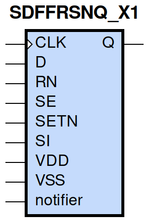
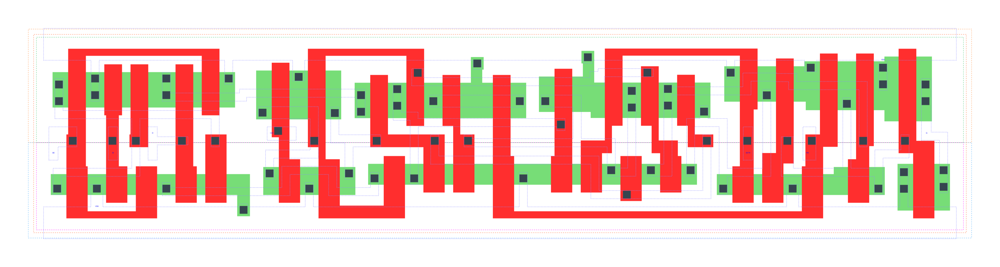

====================================
gf180mcu_fd_sc_mcu9t5v0__sdffrsnq_x1
====================================

**gf180mcu_fd_sc_mcu9t5v0__sdffrsnq_x1 symbol**

**gf180mcu_fd_sc_mcu9t5v0__sdffrsnq_x1 schematic**

.. image:: sc9_sch/SDFFRSNQ_X1_sch.png
    :height: 250px
    :width: 450 px
    :align: center
    :alt: gf180mcu_fd_sc_mcu9t5v0__sdffrsnq_x1 schematic

**gf180mcu_fd_sc_mcu9t5v0__sdffrsnq_x1 layout**

.. include:: images.rst
| SDFFRSNQ_X1 is a positive edge triggered scan D-type flip flop with active low reset and 1X drive strength

|
| Attributes

============= =======================
**Attribute** **Value**
area          129.830400 µm\ :sup:`2`
============= =======================

|

TRUTH TABLE

===== ==== == == = === ======
Input                  Output
RN    SETN SE SI D CLK Q
H     H    L  X  L ↑   L
H     H    L  X  H ↑   H
H     H    H  L  X ↑   L
H     H    H  H  X ↑   H
H     L    X  X  X X   H
L     H    X  X  X X   L
L     L    X  X  X X   L
===== ==== == == = === ======

|
| FUNCTIONAL SCHEMATIC
| |image635|
| CONSTRAINTS

================== =============== ============= ============
**Constraint Pin** **Related Pin** **setup(ns)** **hold(ns)**
SE(LH)             CLK(LH)         0.4920        -0.1950
SE(LH)             CLK(LH)         0.6760        -0.0920
SE(HL)             CLK(LH)         0.5610        -0.0570
SE(HL)             CLK(LH)         0.5670        -0.2920
SI(HL)             CLK(LH)         0.6410        -0.0920
SI(HL)             CLK(LH)         0.6470        -0.0570
SI(LH)             CLK(LH)         0.5380        -0.2400
SI(LH)             CLK(LH)         0.5210        -0.2350
D(HL)              CLK(LH)         0.5440        -0.0460
D(HL)              CLK(LH)         0.5440        -0.0460
D(LH)              CLK(LH)         0.4580        -0.1890
D(LH)              CLK(LH)         0.4580        -0.1890
SETN(LH)           RN(LH)          -0.0060       0.0800
SETN(LH)           RN(LH)          -0.0060       0.0800
SETN(LH)           RN(LH)          -0.0060       0.0800
SETN(LH)           RN(LH)          -0.0060       0.0800
SETN(LH)           RN(LH)          -0.0400       0.0970
SETN(LH)           RN(LH)          -0.0400       0.0970
SETN(LH)           RN(LH)          -0.0400       0.0970
SETN(LH)           RN(LH)          -0.0400       0.0970
SETN(LH)           RN(LH)          -0.0060       0.0800
SETN(LH)           RN(LH)          -0.0060       0.0800
SETN(LH)           RN(LH)          -0.0060       0.0800
SETN(LH)           RN(LH)          -0.0400       0.0970
SETN(LH)           RN(LH)          -0.0400       0.0970
SETN(LH)           RN(LH)          -0.0400       0.0970
SETN(LH)           RN(LH)          -0.0400       0.0970
SETN(LH)           RN(LH)          -0.0060       0.0800
RN(LH)             SETN(LH)        0.0800        -0.0060
RN(LH)             SETN(LH)        0.0800        -0.0060
RN(LH)             SETN(LH)        0.0800        -0.0060
RN(LH)             SETN(LH)        0.0800        -0.0060
RN(LH)             SETN(LH)        0.0970        -0.0400
RN(LH)             SETN(LH)        0.0970        -0.0400
RN(LH)             SETN(LH)        0.0970        -0.0400
RN(LH)             SETN(LH)        0.0970        -0.0400
RN(LH)             SETN(LH)        0.0800        -0.0060
RN(LH)             SETN(LH)        0.0800        -0.0060
RN(LH)             SETN(LH)        0.0800        -0.0060
RN(LH)             SETN(LH)        0.0970        -0.0400
RN(LH)             SETN(LH)        0.0970        -0.0400
RN(LH)             SETN(LH)        0.0970        -0.0400
RN(LH)             SETN(LH)        0.0970        -0.0400
RN(LH)             SETN(LH)        0.0800        -0.0060
================== =============== ============= ============

|

================== =============== ================ ===============
**Constraint Pin** **Related Pin** **recovery(ns)** **removal(ns)**
SETN(LH)           CLK(LH)         0.0170           0.2180
SETN(LH)           CLK(LH)         0.0170           0.2180
SETN(LH)           CLK(LH)         0.0170           0.2180
SETN(LH)           CLK(LH)         0.0170           0.2180
RN(LH)             CLK(LH)         -0.2060          0.3550
RN(LH)             CLK(LH)         -0.2060          0.3550
RN(LH)             CLK(LH)         -0.2060          0.3550
RN(LH)             CLK(LH)         -0.2060          0.3550
================== =============== ================ ===============

|

================== =============== ===========================
**Constraint Pin** **Related Pin** **Minimum Pulse Width(ns)**
CLK(HLH)           CLK(HL)         0.6750
CLK(HLH)           CLK(HL)         0.7050
CLK(HLH)           CLK(HL)         0.6750
CLK(HLH)           CLK(HL)         0.6080
CLK(HLH)           CLK(HL)         0.5400
CLK(HLH)           CLK(HL)         0.7660
CLK(HLH)           CLK(HL)         0.5400
CLK(HLH)           CLK(HL)         0.5710
CLK(LHL)           CLK(LH)         0.3780
CLK(LHL)           CLK(LH)         0.3780
CLK(LHL)           CLK(LH)         0.3780
CLK(LHL)           CLK(LH)         0.3980
CLK(LHL)           CLK(LH)         0.3980
CLK(LHL)           CLK(LH)         0.3780
CLK(LHL)           CLK(LH)         0.3980
CLK(LHL)           CLK(LH)         0.3980
SETN(HLH)          SETN(HL)        0.3780
SETN(HLH)          SETN(HL)        0.3780
SETN(HLH)          SETN(HL)        0.3780
SETN(HLH)          SETN(HL)        0.3780
SETN(HLH)          SETN(HL)        0.3980
SETN(HLH)          SETN(HL)        0.3980
SETN(HLH)          SETN(HL)        0.3980
SETN(HLH)          SETN(HL)        0.3980
SETN(HLH)          SETN(HL)        0.3780
SETN(HLH)          SETN(HL)        0.3780
SETN(HLH)          SETN(HL)        0.3780
SETN(HLH)          SETN(HL)        0.3980
SETN(HLH)          SETN(HL)        0.3980
SETN(HLH)          SETN(HL)        0.3980
SETN(HLH)          SETN(HL)        0.3980
SETN(HLH)          SETN(HL)        0.3780
RN(HLH)            RN(HL)          0.2800
RN(HLH)            RN(HL)          0.2800
RN(HLH)            RN(HL)          0.2800
RN(HLH)            RN(HL)          0.2800
RN(HLH)            RN(HL)          0.3880
RN(HLH)            RN(HL)          0.3880
RN(HLH)            RN(HL)          0.3880
RN(HLH)            RN(HL)          0.3880
RN(HLH)            RN(HL)          0.2800
RN(HLH)            RN(HL)          0.2800
RN(HLH)            RN(HL)          0.2800
RN(HLH)            RN(HL)          0.3880
RN(HLH)            RN(HL)          0.3880
RN(HLH)            RN(HL)          0.3880
RN(HLH)            RN(HL)          0.3880
RN(HLH)            RN(HL)          0.2800
================== =============== ===========================

|
| PIN CAPACITANCE (pf)

======= ======== ====================
**Pin** **Type** **Capacitance (pf)**
SE      input    0.0084
SI      input    0.0038
D       input    0.0040
CLK     input    0.0050
SETN    input    0.0085
RN      input    0.0094
======= ======== ====================

|
| DELAY AND OUTPUT TRANSITION TIME corresponding to min slew and load

+---------------+------------+-----------------------+--------------+-------------------+----------------+---------------+
| **Input Pin** | **Output** | **When Condition**    | **Tin (ns)** | **Out Load (pf)** | **Delay (ns)** | **Tout (ns)** |
+---------------+------------+-----------------------+--------------+-------------------+----------------+---------------+
| CLK(LH)       | Q(HL)      | !D&RN&!SE&SETN&!SI    | 0.0100       | 0.0010            | 0.5824         | 0.0372        |
+---------------+------------+-----------------------+--------------+-------------------+----------------+---------------+
| CLK(LH)       | Q(HL)      | !D&RN&!SE&SETN&SI     | 0.0100       | 0.0010            | 0.5824         | 0.0372        |
+---------------+------------+-----------------------+--------------+-------------------+----------------+---------------+
| CLK(LH)       | Q(HL)      | !D&RN&SE&SETN&!SI     | 0.0100       | 0.0010            | 0.5825         | 0.0371        |
+---------------+------------+-----------------------+--------------+-------------------+----------------+---------------+
| CLK(LH)       | Q(HL)      | D&RN&SE&SETN&!SI      | 0.0100       | 0.0010            | 0.5824         | 0.0371        |
+---------------+------------+-----------------------+--------------+-------------------+----------------+---------------+
| CLK(LH)       | Q(LH)      | !D&RN&SE&SETN&SI      | 0.0100       | 0.0010            | 0.6185         | 0.0482        |
+---------------+------------+-----------------------+--------------+-------------------+----------------+---------------+
| CLK(LH)       | Q(LH)      | D&RN&!SE&SETN&!SI     | 0.0100       | 0.0010            | 0.6186         | 0.0481        |
+---------------+------------+-----------------------+--------------+-------------------+----------------+---------------+
| CLK(LH)       | Q(LH)      | D&RN&!SE&SETN&SI      | 0.0100       | 0.0010            | 0.6184         | 0.0482        |
+---------------+------------+-----------------------+--------------+-------------------+----------------+---------------+
| CLK(LH)       | Q(LH)      | D&RN&SE&SETN&SI       | 0.0100       | 0.0010            | 0.6184         | 0.0483        |
+---------------+------------+-----------------------+--------------+-------------------+----------------+---------------+
| SETN(HL)      | Q(LH)      | !CLK&!D&RN&!SE&!SI    | 0.0100       | 0.0010            | 0.5363         | 0.0479        |
+---------------+------------+-----------------------+--------------+-------------------+----------------+---------------+
| SETN(HL)      | Q(LH)      | !CLK&D&RN&SE&!SI      | 0.0100       | 0.0010            | 0.5363         | 0.0479        |
+---------------+------------+-----------------------+--------------+-------------------+----------------+---------------+
| SETN(HL)      | Q(LH)      | !CLK&D&RN&!SE&SI      | 0.0100       | 0.0010            | 0.5367         | 0.0480        |
+---------------+------------+-----------------------+--------------+-------------------+----------------+---------------+
| SETN(HL)      | Q(LH)      | !CLK&D&RN&SE&SI       | 0.0100       | 0.0010            | 0.5367         | 0.0480        |
+---------------+------------+-----------------------+--------------+-------------------+----------------+---------------+
| SETN(HL)      | Q(LH)      | CLK&D&RN&!SE&!SI      | 0.0100       | 0.0010            | 0.5801         | 0.0476        |
+---------------+------------+-----------------------+--------------+-------------------+----------------+---------------+
| SETN(HL)      | Q(LH)      | CLK&D&RN&SE&!SI       | 0.0100       | 0.0010            | 0.5802         | 0.0480        |
+---------------+------------+-----------------------+--------------+-------------------+----------------+---------------+
| SETN(HL)      | Q(LH)      | CLK&D&RN&!SE&SI       | 0.0100       | 0.0010            | 0.5801         | 0.0476        |
+---------------+------------+-----------------------+--------------+-------------------+----------------+---------------+
| SETN(HL)      | Q(LH)      | CLK&D&RN&SE&SI        | 0.0100       | 0.0010            | 0.5802         | 0.0476        |
+---------------+------------+-----------------------+--------------+-------------------+----------------+---------------+
| SETN(HL)      | Q(LH)      | !CLK&!D&RN&SE&!SI     | 0.0100       | 0.0010            | 0.5363         | 0.0479        |
+---------------+------------+-----------------------+--------------+-------------------+----------------+---------------+
| SETN(HL)      | Q(LH)      | !CLK&!D&RN&!SE&SI     | 0.0100       | 0.0010            | 0.5363         | 0.0479        |
+---------------+------------+-----------------------+--------------+-------------------+----------------+---------------+
| SETN(HL)      | Q(LH)      | !CLK&!D&RN&SE&SI      | 0.0100       | 0.0010            | 0.5367         | 0.0480        |
+---------------+------------+-----------------------+--------------+-------------------+----------------+---------------+
| SETN(HL)      | Q(LH)      | CLK&!D&RN&!SE&!SI     | 0.0100       | 0.0010            | 0.5802         | 0.0480        |
+---------------+------------+-----------------------+--------------+-------------------+----------------+---------------+
| SETN(HL)      | Q(LH)      | CLK&!D&RN&SE&!SI      | 0.0100       | 0.0010            | 0.5802         | 0.0480        |
+---------------+------------+-----------------------+--------------+-------------------+----------------+---------------+
| SETN(HL)      | Q(LH)      | CLK&!D&RN&!SE&SI      | 0.0100       | 0.0010            | 0.5802         | 0.0480        |
+---------------+------------+-----------------------+--------------+-------------------+----------------+---------------+
| SETN(HL)      | Q(LH)      | CLK&!D&RN&SE&SI       | 0.0100       | 0.0010            | 0.5802         | 0.0476        |
+---------------+------------+-----------------------+--------------+-------------------+----------------+---------------+
| SETN(HL)      | Q(LH)      | !CLK&D&RN&!SE&!SI     | 0.0100       | 0.0010            | 0.5367         | 0.0480        |
+---------------+------------+-----------------------+--------------+-------------------+----------------+---------------+
| RN(HL)        | Q(HL)      | !CLK&!D&!SE&SETN&!SI  | 0.0100       | 0.0010            | 0.1782         | 0.0355        |
+---------------+------------+-----------------------+--------------+-------------------+----------------+---------------+
| RN(HL)        | Q(HL)      | !CLK&D&SE&SETN&!SI    | 0.0100       | 0.0010            | 0.1782         | 0.0355        |
+---------------+------------+-----------------------+--------------+-------------------+----------------+---------------+
| RN(HL)        | Q(HL)      | !CLK&D&!SE&SETN&SI    | 0.0100       | 0.0010            | 0.1781         | 0.0355        |
+---------------+------------+-----------------------+--------------+-------------------+----------------+---------------+
| RN(HL)        | Q(HL)      | !CLK&D&SE&SETN&SI     | 0.0100       | 0.0010            | 0.1781         | 0.0355        |
+---------------+------------+-----------------------+--------------+-------------------+----------------+---------------+
| RN(HL)        | Q(HL)      | CLK&D&!SE&SETN&!SI    | 0.0100       | 0.0010            | 0.1783         | 0.0354        |
+---------------+------------+-----------------------+--------------+-------------------+----------------+---------------+
| RN(HL)        | Q(HL)      | CLK&D&SE&SETN&!SI     | 0.0100       | 0.0010            | 0.1783         | 0.0354        |
+---------------+------------+-----------------------+--------------+-------------------+----------------+---------------+
| RN(HL)        | Q(HL)      | CLK&D&!SE&SETN&SI     | 0.0100       | 0.0010            | 0.1783         | 0.0354        |
+---------------+------------+-----------------------+--------------+-------------------+----------------+---------------+
| RN(HL)        | Q(HL)      | CLK&D&SE&SETN&SI      | 0.0100       | 0.0010            | 0.1783         | 0.0354        |
+---------------+------------+-----------------------+--------------+-------------------+----------------+---------------+
| RN(HL)        | Q(HL)      | !CLK&!D&!SE&!SETN&!SI | 0.0100       | 0.0010            | 0.1782         | 0.0350        |
+---------------+------------+-----------------------+--------------+-------------------+----------------+---------------+
| RN(HL)        | Q(HL)      | !CLK&!D&!SE&!SETN&SI  | 0.0100       | 0.0010            | 0.1782         | 0.0350        |
+---------------+------------+-----------------------+--------------+-------------------+----------------+---------------+
| RN(HL)        | Q(HL)      | !CLK&!D&SE&!SETN&!SI  | 0.0100       | 0.0010            | 0.1782         | 0.0350        |
+---------------+------------+-----------------------+--------------+-------------------+----------------+---------------+
| RN(HL)        | Q(HL)      | !CLK&!D&SE&!SETN&SI   | 0.0100       | 0.0010            | 0.1781         | 0.0351        |
+---------------+------------+-----------------------+--------------+-------------------+----------------+---------------+
| RN(HL)        | Q(HL)      | !CLK&D&!SE&!SETN&!SI  | 0.0100       | 0.0010            | 0.1781         | 0.0351        |
+---------------+------------+-----------------------+--------------+-------------------+----------------+---------------+
| RN(HL)        | Q(HL)      | !CLK&D&!SE&!SETN&SI   | 0.0100       | 0.0010            | 0.1781         | 0.0351        |
+---------------+------------+-----------------------+--------------+-------------------+----------------+---------------+
| RN(HL)        | Q(HL)      | !CLK&D&SE&!SETN&!SI   | 0.0100       | 0.0010            | 0.1782         | 0.0350        |
+---------------+------------+-----------------------+--------------+-------------------+----------------+---------------+
| RN(HL)        | Q(HL)      | !CLK&D&SE&!SETN&SI    | 0.0100       | 0.0010            | 0.1781         | 0.0351        |
+---------------+------------+-----------------------+--------------+-------------------+----------------+---------------+
| RN(HL)        | Q(HL)      | CLK&!D&!SE&!SETN&!SI  | 0.0100       | 0.0010            | 0.1783         | 0.0351        |
+---------------+------------+-----------------------+--------------+-------------------+----------------+---------------+
| RN(HL)        | Q(HL)      | CLK&!D&!SE&!SETN&SI   | 0.0100       | 0.0010            | 0.1783         | 0.0351        |
+---------------+------------+-----------------------+--------------+-------------------+----------------+---------------+
| RN(HL)        | Q(HL)      | CLK&!D&SE&!SETN&!SI   | 0.0100       | 0.0010            | 0.1783         | 0.0351        |
+---------------+------------+-----------------------+--------------+-------------------+----------------+---------------+
| RN(HL)        | Q(HL)      | CLK&!D&SE&!SETN&SI    | 0.0100       | 0.0010            | 0.1783         | 0.0351        |
+---------------+------------+-----------------------+--------------+-------------------+----------------+---------------+
| RN(HL)        | Q(HL)      | CLK&D&!SE&!SETN&!SI   | 0.0100       | 0.0010            | 0.1783         | 0.0351        |
+---------------+------------+-----------------------+--------------+-------------------+----------------+---------------+
| RN(HL)        | Q(HL)      | CLK&D&!SE&!SETN&SI    | 0.0100       | 0.0010            | 0.1783         | 0.0351        |
+---------------+------------+-----------------------+--------------+-------------------+----------------+---------------+
| RN(HL)        | Q(HL)      | CLK&D&SE&!SETN&!SI    | 0.0100       | 0.0010            | 0.1783         | 0.0351        |
+---------------+------------+-----------------------+--------------+-------------------+----------------+---------------+
| RN(HL)        | Q(HL)      | CLK&D&SE&!SETN&SI     | 0.0100       | 0.0010            | 0.1783         | 0.0351        |
+---------------+------------+-----------------------+--------------+-------------------+----------------+---------------+
| RN(HL)        | Q(HL)      | !CLK&!D&SE&SETN&!SI   | 0.0100       | 0.0010            | 0.1782         | 0.0355        |
+---------------+------------+-----------------------+--------------+-------------------+----------------+---------------+
| RN(HL)        | Q(HL)      | !CLK&!D&!SE&SETN&SI   | 0.0100       | 0.0010            | 0.1782         | 0.0355        |
+---------------+------------+-----------------------+--------------+-------------------+----------------+---------------+
| RN(HL)        | Q(HL)      | !CLK&!D&SE&SETN&SI    | 0.0100       | 0.0010            | 0.1781         | 0.0355        |
+---------------+------------+-----------------------+--------------+-------------------+----------------+---------------+
| RN(HL)        | Q(HL)      | CLK&!D&!SE&SETN&!SI   | 0.0100       | 0.0010            | 0.1783         | 0.0354        |
+---------------+------------+-----------------------+--------------+-------------------+----------------+---------------+
| RN(HL)        | Q(HL)      | CLK&!D&SE&SETN&!SI    | 0.0100       | 0.0010            | 0.1783         | 0.0354        |
+---------------+------------+-----------------------+--------------+-------------------+----------------+---------------+
| RN(HL)        | Q(HL)      | CLK&!D&!SE&SETN&SI    | 0.0100       | 0.0010            | 0.1783         | 0.0354        |
+---------------+------------+-----------------------+--------------+-------------------+----------------+---------------+
| RN(HL)        | Q(HL)      | CLK&!D&SE&SETN&SI     | 0.0100       | 0.0010            | 0.1783         | 0.0354        |
+---------------+------------+-----------------------+--------------+-------------------+----------------+---------------+
| RN(HL)        | Q(HL)      | !CLK&D&!SE&SETN&!SI   | 0.0100       | 0.0010            | 0.1781         | 0.0355        |
+---------------+------------+-----------------------+--------------+-------------------+----------------+---------------+
| RN(LH)        | Q(LH)      | !CLK&!D&!SE&!SETN&!SI | 0.0100       | 0.0010            | 0.2732         | 0.0465        |
+---------------+------------+-----------------------+--------------+-------------------+----------------+---------------+
| RN(LH)        | Q(LH)      | !CLK&!D&!SE&!SETN&SI  | 0.0100       | 0.0010            | 0.2732         | 0.0465        |
+---------------+------------+-----------------------+--------------+-------------------+----------------+---------------+
| RN(LH)        | Q(LH)      | !CLK&!D&SE&!SETN&!SI  | 0.0100       | 0.0010            | 0.2732         | 0.0465        |
+---------------+------------+-----------------------+--------------+-------------------+----------------+---------------+
| RN(LH)        | Q(LH)      | !CLK&!D&SE&!SETN&SI   | 0.0100       | 0.0010            | 0.2730         | 0.0462        |
+---------------+------------+-----------------------+--------------+-------------------+----------------+---------------+
| RN(LH)        | Q(LH)      | !CLK&D&!SE&!SETN&!SI  | 0.0100       | 0.0010            | 0.2730         | 0.0465        |
+---------------+------------+-----------------------+--------------+-------------------+----------------+---------------+
| RN(LH)        | Q(LH)      | !CLK&D&!SE&!SETN&SI   | 0.0100       | 0.0010            | 0.2730         | 0.0465        |
+---------------+------------+-----------------------+--------------+-------------------+----------------+---------------+
| RN(LH)        | Q(LH)      | !CLK&D&SE&!SETN&!SI   | 0.0100       | 0.0010            | 0.2732         | 0.0465        |
+---------------+------------+-----------------------+--------------+-------------------+----------------+---------------+
| RN(LH)        | Q(LH)      | !CLK&D&SE&!SETN&SI    | 0.0100       | 0.0010            | 0.2730         | 0.0462        |
+---------------+------------+-----------------------+--------------+-------------------+----------------+---------------+
| RN(LH)        | Q(LH)      | CLK&!D&!SE&!SETN&!SI  | 0.0100       | 0.0010            | 0.2754         | 0.0466        |
+---------------+------------+-----------------------+--------------+-------------------+----------------+---------------+
| RN(LH)        | Q(LH)      | CLK&!D&!SE&!SETN&SI   | 0.0100       | 0.0010            | 0.2754         | 0.0465        |
+---------------+------------+-----------------------+--------------+-------------------+----------------+---------------+
| RN(LH)        | Q(LH)      | CLK&!D&SE&!SETN&!SI   | 0.0100       | 0.0010            | 0.2754         | 0.0465        |
+---------------+------------+-----------------------+--------------+-------------------+----------------+---------------+
| RN(LH)        | Q(LH)      | CLK&!D&SE&!SETN&SI    | 0.0100       | 0.0010            | 0.2754         | 0.0466        |
+---------------+------------+-----------------------+--------------+-------------------+----------------+---------------+
| RN(LH)        | Q(LH)      | CLK&D&!SE&!SETN&!SI   | 0.0100       | 0.0010            | 0.2754         | 0.0466        |
+---------------+------------+-----------------------+--------------+-------------------+----------------+---------------+
| RN(LH)        | Q(LH)      | CLK&D&!SE&!SETN&SI    | 0.0100       | 0.0010            | 0.2754         | 0.0465        |
+---------------+------------+-----------------------+--------------+-------------------+----------------+---------------+
| RN(LH)        | Q(LH)      | CLK&D&SE&!SETN&!SI    | 0.0100       | 0.0010            | 0.2754         | 0.0465        |
+---------------+------------+-----------------------+--------------+-------------------+----------------+---------------+
| RN(LH)        | Q(LH)      | CLK&D&SE&!SETN&SI     | 0.0100       | 0.0010            | 0.2754         | 0.0466        |
+---------------+------------+-----------------------+--------------+-------------------+----------------+---------------+

|
| DYNAMIC ENERGY

+---------------+------------------------+--------------+------------+-------------------+---------------------+
| **Input Pin** | **When Condition**     | **Tin (ns)** | **Output** | **Out Load (pf)** | **Energy (uW/MHz)** |
+---------------+------------------------+--------------+------------+-------------------+---------------------+
| CLK           | !D&RN&!SE&SETN&!SI     | 0.0100       | Q(HL)      | 0.0010            | 0.8416              |
+---------------+------------------------+--------------+------------+-------------------+---------------------+
| CLK           | !D&RN&!SE&SETN&SI      | 0.0100       | Q(HL)      | 0.0010            | 0.8416              |
+---------------+------------------------+--------------+------------+-------------------+---------------------+
| CLK           | !D&RN&SE&SETN&!SI      | 0.0100       | Q(HL)      | 0.0010            | 0.8415              |
+---------------+------------------------+--------------+------------+-------------------+---------------------+
| CLK           | D&RN&SE&SETN&!SI       | 0.0100       | Q(HL)      | 0.0010            | 0.8415              |
+---------------+------------------------+--------------+------------+-------------------+---------------------+
| CLK           | !D&RN&SE&SETN&SI       | 0.0100       | Q(LH)      | 0.0010            | 0.9131              |
+---------------+------------------------+--------------+------------+-------------------+---------------------+
| CLK           | D&RN&!SE&SETN&!SI      | 0.0100       | Q(LH)      | 0.0010            | 0.9128              |
+---------------+------------------------+--------------+------------+-------------------+---------------------+
| CLK           | D&RN&!SE&SETN&SI       | 0.0100       | Q(LH)      | 0.0010            | 0.9130              |
+---------------+------------------------+--------------+------------+-------------------+---------------------+
| CLK           | D&RN&SE&SETN&SI        | 0.0100       | Q(LH)      | 0.0010            | 0.9132              |
+---------------+------------------------+--------------+------------+-------------------+---------------------+
| SETN          | !CLK&!D&RN&!SE&!SI     | 0.0100       | Q(LH)      | 0.0010            | 0.7550              |
+---------------+------------------------+--------------+------------+-------------------+---------------------+
| SETN          | !CLK&D&RN&SE&!SI       | 0.0100       | Q(LH)      | 0.0010            | 0.7551              |
+---------------+------------------------+--------------+------------+-------------------+---------------------+
| SETN          | !CLK&D&RN&!SE&SI       | 0.0100       | Q(LH)      | 0.0010            | 0.6199              |
+---------------+------------------------+--------------+------------+-------------------+---------------------+
| SETN          | !CLK&D&RN&SE&SI        | 0.0100       | Q(LH)      | 0.0010            | 0.6199              |
+---------------+------------------------+--------------+------------+-------------------+---------------------+
| SETN          | CLK&D&RN&!SE&!SI       | 0.0100       | Q(LH)      | 0.0010            | 0.8945              |
+---------------+------------------------+--------------+------------+-------------------+---------------------+
| SETN          | CLK&D&RN&SE&!SI        | 0.0100       | Q(LH)      | 0.0010            | 0.8948              |
+---------------+------------------------+--------------+------------+-------------------+---------------------+
| SETN          | CLK&D&RN&!SE&SI        | 0.0100       | Q(LH)      | 0.0010            | 0.8945              |
+---------------+------------------------+--------------+------------+-------------------+---------------------+
| SETN          | CLK&D&RN&SE&SI         | 0.0100       | Q(LH)      | 0.0010            | 0.8947              |
+---------------+------------------------+--------------+------------+-------------------+---------------------+
| SETN          | !CLK&!D&RN&SE&!SI      | 0.0100       | Q(LH)      | 0.0010            | 0.7550              |
+---------------+------------------------+--------------+------------+-------------------+---------------------+
| SETN          | !CLK&!D&RN&!SE&SI      | 0.0100       | Q(LH)      | 0.0010            | 0.7550              |
+---------------+------------------------+--------------+------------+-------------------+---------------------+
| SETN          | !CLK&!D&RN&SE&SI       | 0.0100       | Q(LH)      | 0.0010            | 0.6199              |
+---------------+------------------------+--------------+------------+-------------------+---------------------+
| SETN          | CLK&!D&RN&!SE&!SI      | 0.0100       | Q(LH)      | 0.0010            | 0.8948              |
+---------------+------------------------+--------------+------------+-------------------+---------------------+
| SETN          | CLK&!D&RN&SE&!SI       | 0.0100       | Q(LH)      | 0.0010            | 0.8948              |
+---------------+------------------------+--------------+------------+-------------------+---------------------+
| SETN          | CLK&!D&RN&!SE&SI       | 0.0100       | Q(LH)      | 0.0010            | 0.8948              |
+---------------+------------------------+--------------+------------+-------------------+---------------------+
| SETN          | CLK&!D&RN&SE&SI        | 0.0100       | Q(LH)      | 0.0010            | 0.8947              |
+---------------+------------------------+--------------+------------+-------------------+---------------------+
| SETN          | !CLK&D&RN&!SE&!SI      | 0.0100       | Q(LH)      | 0.0010            | 0.6199              |
+---------------+------------------------+--------------+------------+-------------------+---------------------+
| RN            | !CLK&!D&!SE&SETN&!SI   | 0.0100       | Q(HL)      | 0.0010            | 0.5755              |
+---------------+------------------------+--------------+------------+-------------------+---------------------+
| RN            | !CLK&D&SE&SETN&!SI     | 0.0100       | Q(HL)      | 0.0010            | 0.5755              |
+---------------+------------------------+--------------+------------+-------------------+---------------------+
| RN            | !CLK&D&!SE&SETN&SI     | 0.0100       | Q(HL)      | 0.0010            | 0.5759              |
+---------------+------------------------+--------------+------------+-------------------+---------------------+
| RN            | !CLK&D&SE&SETN&SI      | 0.0100       | Q(HL)      | 0.0010            | 0.5758              |
+---------------+------------------------+--------------+------------+-------------------+---------------------+
| RN            | CLK&D&!SE&SETN&!SI     | 0.0100       | Q(HL)      | 0.0010            | 0.8706              |
+---------------+------------------------+--------------+------------+-------------------+---------------------+
| RN            | CLK&D&SE&SETN&!SI      | 0.0100       | Q(HL)      | 0.0010            | 0.8715              |
+---------------+------------------------+--------------+------------+-------------------+---------------------+
| RN            | CLK&D&!SE&SETN&SI      | 0.0100       | Q(HL)      | 0.0010            | 0.8706              |
+---------------+------------------------+--------------+------------+-------------------+---------------------+
| RN            | CLK&D&SE&SETN&SI       | 0.0100       | Q(HL)      | 0.0010            | 0.8706              |
+---------------+------------------------+--------------+------------+-------------------+---------------------+
| RN            | !CLK&!D&!SE&!SETN&!SI  | 0.0100       | Q(HL)      | 0.0010            | 0.3939              |
+---------------+------------------------+--------------+------------+-------------------+---------------------+
| RN            | !CLK&!D&!SE&!SETN&SI   | 0.0100       | Q(HL)      | 0.0010            | 0.3939              |
+---------------+------------------------+--------------+------------+-------------------+---------------------+
| RN            | !CLK&!D&SE&!SETN&!SI   | 0.0100       | Q(HL)      | 0.0010            | 0.3939              |
+---------------+------------------------+--------------+------------+-------------------+---------------------+
| RN            | !CLK&!D&SE&!SETN&SI    | 0.0100       | Q(HL)      | 0.0010            | 0.3916              |
+---------------+------------------------+--------------+------------+-------------------+---------------------+
| RN            | !CLK&D&!SE&!SETN&!SI   | 0.0100       | Q(HL)      | 0.0010            | 0.3916              |
+---------------+------------------------+--------------+------------+-------------------+---------------------+
| RN            | !CLK&D&!SE&!SETN&SI    | 0.0100       | Q(HL)      | 0.0010            | 0.3916              |
+---------------+------------------------+--------------+------------+-------------------+---------------------+
| RN            | !CLK&D&SE&!SETN&!SI    | 0.0100       | Q(HL)      | 0.0010            | 0.3939              |
+---------------+------------------------+--------------+------------+-------------------+---------------------+
| RN            | !CLK&D&SE&!SETN&SI     | 0.0100       | Q(HL)      | 0.0010            | 0.3916              |
+---------------+------------------------+--------------+------------+-------------------+---------------------+
| RN            | CLK&!D&!SE&!SETN&!SI   | 0.0100       | Q(HL)      | 0.0010            | 0.5731              |
+---------------+------------------------+--------------+------------+-------------------+---------------------+
| RN            | CLK&!D&!SE&!SETN&SI    | 0.0100       | Q(HL)      | 0.0010            | 0.5731              |
+---------------+------------------------+--------------+------------+-------------------+---------------------+
| RN            | CLK&!D&SE&!SETN&!SI    | 0.0100       | Q(HL)      | 0.0010            | 0.5731              |
+---------------+------------------------+--------------+------------+-------------------+---------------------+
| RN            | CLK&!D&SE&!SETN&SI     | 0.0100       | Q(HL)      | 0.0010            | 0.5731              |
+---------------+------------------------+--------------+------------+-------------------+---------------------+
| RN            | CLK&D&!SE&!SETN&!SI    | 0.0100       | Q(HL)      | 0.0010            | 0.5731              |
+---------------+------------------------+--------------+------------+-------------------+---------------------+
| RN            | CLK&D&!SE&!SETN&SI     | 0.0100       | Q(HL)      | 0.0010            | 0.5731              |
+---------------+------------------------+--------------+------------+-------------------+---------------------+
| RN            | CLK&D&SE&!SETN&!SI     | 0.0100       | Q(HL)      | 0.0010            | 0.5731              |
+---------------+------------------------+--------------+------------+-------------------+---------------------+
| RN            | CLK&D&SE&!SETN&SI      | 0.0100       | Q(HL)      | 0.0010            | 0.5731              |
+---------------+------------------------+--------------+------------+-------------------+---------------------+
| RN            | !CLK&!D&SE&SETN&!SI    | 0.0100       | Q(HL)      | 0.0010            | 0.5755              |
+---------------+------------------------+--------------+------------+-------------------+---------------------+
| RN            | !CLK&!D&!SE&SETN&SI    | 0.0100       | Q(HL)      | 0.0010            | 0.5755              |
+---------------+------------------------+--------------+------------+-------------------+---------------------+
| RN            | !CLK&!D&SE&SETN&SI     | 0.0100       | Q(HL)      | 0.0010            | 0.5758              |
+---------------+------------------------+--------------+------------+-------------------+---------------------+
| RN            | CLK&!D&!SE&SETN&!SI    | 0.0100       | Q(HL)      | 0.0010            | 0.8715              |
+---------------+------------------------+--------------+------------+-------------------+---------------------+
| RN            | CLK&!D&SE&SETN&!SI     | 0.0100       | Q(HL)      | 0.0010            | 0.8715              |
+---------------+------------------------+--------------+------------+-------------------+---------------------+
| RN            | CLK&!D&!SE&SETN&SI     | 0.0100       | Q(HL)      | 0.0010            | 0.8715              |
+---------------+------------------------+--------------+------------+-------------------+---------------------+
| RN            | CLK&!D&SE&SETN&SI      | 0.0100       | Q(HL)      | 0.0010            | 0.8707              |
+---------------+------------------------+--------------+------------+-------------------+---------------------+
| RN            | !CLK&D&!SE&SETN&!SI    | 0.0100       | Q(HL)      | 0.0010            | 0.5758              |
+---------------+------------------------+--------------+------------+-------------------+---------------------+
| RN            | !CLK&!D&!SE&!SETN&!SI  | 0.0100       | Q(LH)      | 0.0010            | 0.2186              |
+---------------+------------------------+--------------+------------+-------------------+---------------------+
| RN            | !CLK&!D&!SE&!SETN&SI   | 0.0100       | Q(LH)      | 0.0010            | 0.2186              |
+---------------+------------------------+--------------+------------+-------------------+---------------------+
| RN            | !CLK&!D&SE&!SETN&!SI   | 0.0100       | Q(LH)      | 0.0010            | 0.2186              |
+---------------+------------------------+--------------+------------+-------------------+---------------------+
| RN            | !CLK&!D&SE&!SETN&SI    | 0.0100       | Q(LH)      | 0.0010            | 0.2206              |
+---------------+------------------------+--------------+------------+-------------------+---------------------+
| RN            | !CLK&D&!SE&!SETN&!SI   | 0.0100       | Q(LH)      | 0.0010            | 0.2205              |
+---------------+------------------------+--------------+------------+-------------------+---------------------+
| RN            | !CLK&D&!SE&!SETN&SI    | 0.0100       | Q(LH)      | 0.0010            | 0.2205              |
+---------------+------------------------+--------------+------------+-------------------+---------------------+
| RN            | !CLK&D&SE&!SETN&!SI    | 0.0100       | Q(LH)      | 0.0010            | 0.2186              |
+---------------+------------------------+--------------+------------+-------------------+---------------------+
| RN            | !CLK&D&SE&!SETN&SI     | 0.0100       | Q(LH)      | 0.0010            | 0.2206              |
+---------------+------------------------+--------------+------------+-------------------+---------------------+
| RN            | CLK&!D&!SE&!SETN&!SI   | 0.0100       | Q(LH)      | 0.0010            | 0.3593              |
+---------------+------------------------+--------------+------------+-------------------+---------------------+
| RN            | CLK&!D&!SE&!SETN&SI    | 0.0100       | Q(LH)      | 0.0010            | 0.3593              |
+---------------+------------------------+--------------+------------+-------------------+---------------------+
| RN            | CLK&!D&SE&!SETN&!SI    | 0.0100       | Q(LH)      | 0.0010            | 0.3593              |
+---------------+------------------------+--------------+------------+-------------------+---------------------+
| RN            | CLK&!D&SE&!SETN&SI     | 0.0100       | Q(LH)      | 0.0010            | 0.3594              |
+---------------+------------------------+--------------+------------+-------------------+---------------------+
| RN            | CLK&D&!SE&!SETN&!SI    | 0.0100       | Q(LH)      | 0.0010            | 0.3593              |
+---------------+------------------------+--------------+------------+-------------------+---------------------+
| RN            | CLK&D&!SE&!SETN&SI     | 0.0100       | Q(LH)      | 0.0010            | 0.3593              |
+---------------+------------------------+--------------+------------+-------------------+---------------------+
| RN            | CLK&D&SE&!SETN&!SI     | 0.0100       | Q(LH)      | 0.0010            | 0.3593              |
+---------------+------------------------+--------------+------------+-------------------+---------------------+
| RN            | CLK&D&SE&!SETN&SI      | 0.0100       | Q(LH)      | 0.0010            | 0.3594              |
+---------------+------------------------+--------------+------------+-------------------+---------------------+
| SETN(HL)      | !CLK&!D&!RN&!SE&!SI    | 0.0100       | n/a        | n/a               | 0.4333              |
+---------------+------------------------+--------------+------------+-------------------+---------------------+
| SETN(HL)      | !CLK&!D&!RN&!SE&SI     | 0.0100       | n/a        | n/a               | 0.4333              |
+---------------+------------------------+--------------+------------+-------------------+---------------------+
| SETN(HL)      | !CLK&!D&!RN&SE&!SI     | 0.0100       | n/a        | n/a               | 0.4333              |
+---------------+------------------------+--------------+------------+-------------------+---------------------+
| SETN(HL)      | !CLK&!D&!RN&SE&SI      | 0.0100       | n/a        | n/a               | 0.3078              |
+---------------+------------------------+--------------+------------+-------------------+---------------------+
| SETN(HL)      | !CLK&D&!RN&!SE&!SI     | 0.0100       | n/a        | n/a               | 0.3078              |
+---------------+------------------------+--------------+------------+-------------------+---------------------+
| SETN(HL)      | !CLK&D&!RN&!SE&SI      | 0.0100       | n/a        | n/a               | 0.3078              |
+---------------+------------------------+--------------+------------+-------------------+---------------------+
| SETN(HL)      | !CLK&D&!RN&SE&!SI      | 0.0100       | n/a        | n/a               | 0.4333              |
+---------------+------------------------+--------------+------------+-------------------+---------------------+
| SETN(HL)      | !CLK&D&!RN&SE&SI       | 0.0100       | n/a        | n/a               | 0.3078              |
+---------------+------------------------+--------------+------------+-------------------+---------------------+
| SETN(HL)      | CLK&!D&!RN&!SE&!SI     | 0.0100       | n/a        | n/a               | 0.4354              |
+---------------+------------------------+--------------+------------+-------------------+---------------------+
| SETN(HL)      | CLK&!D&!RN&!SE&SI      | 0.0100       | n/a        | n/a               | 0.4354              |
+---------------+------------------------+--------------+------------+-------------------+---------------------+
| SETN(HL)      | CLK&!D&!RN&SE&!SI      | 0.0100       | n/a        | n/a               | 0.4354              |
+---------------+------------------------+--------------+------------+-------------------+---------------------+
| SETN(HL)      | CLK&!D&!RN&SE&SI       | 0.0100       | n/a        | n/a               | 0.4354              |
+---------------+------------------------+--------------+------------+-------------------+---------------------+
| SETN(HL)      | CLK&D&!RN&!SE&!SI      | 0.0100       | n/a        | n/a               | 0.4354              |
+---------------+------------------------+--------------+------------+-------------------+---------------------+
| SETN(HL)      | CLK&D&!RN&!SE&SI       | 0.0100       | n/a        | n/a               | 0.4354              |
+---------------+------------------------+--------------+------------+-------------------+---------------------+
| SETN(HL)      | CLK&D&!RN&SE&!SI       | 0.0100       | n/a        | n/a               | 0.4354              |
+---------------+------------------------+--------------+------------+-------------------+---------------------+
| SETN(HL)      | CLK&D&!RN&SE&SI        | 0.0100       | n/a        | n/a               | 0.4354              |
+---------------+------------------------+--------------+------------+-------------------+---------------------+
| SETN(HL)      | CLK&!D&RN&!SE&!SI      | 0.0100       | n/a        | n/a               | 0.0708              |
+---------------+------------------------+--------------+------------+-------------------+---------------------+
| SETN(HL)      | CLK&!D&RN&SE&!SI       | 0.0100       | n/a        | n/a               | 0.0708              |
+---------------+------------------------+--------------+------------+-------------------+---------------------+
| SETN(HL)      | CLK&!D&RN&!SE&SI       | 0.0100       | n/a        | n/a               | 0.0708              |
+---------------+------------------------+--------------+------------+-------------------+---------------------+
| SETN(HL)      | CLK&!D&RN&SE&SI        | 0.0100       | n/a        | n/a               | 0.0709              |
+---------------+------------------------+--------------+------------+-------------------+---------------------+
| SETN(HL)      | !CLK&D&RN&!SE&!SI      | 0.0100       | n/a        | n/a               | 0.0708              |
+---------------+------------------------+--------------+------------+-------------------+---------------------+
| SETN(HL)      | !CLK&D&RN&SE&!SI       | 0.0100       | n/a        | n/a               | 0.2058              |
+---------------+------------------------+--------------+------------+-------------------+---------------------+
| SETN(HL)      | !CLK&D&RN&!SE&SI       | 0.0100       | n/a        | n/a               | 0.0708              |
+---------------+------------------------+--------------+------------+-------------------+---------------------+
| SETN(HL)      | !CLK&D&RN&SE&SI        | 0.0100       | n/a        | n/a               | 0.0708              |
+---------------+------------------------+--------------+------------+-------------------+---------------------+
| SETN(HL)      | CLK&D&RN&!SE&!SI       | 0.0100       | n/a        | n/a               | 0.0709              |
+---------------+------------------------+--------------+------------+-------------------+---------------------+
| SETN(HL)      | CLK&D&RN&SE&!SI        | 0.0100       | n/a        | n/a               | 0.0708              |
+---------------+------------------------+--------------+------------+-------------------+---------------------+
| SETN(HL)      | !CLK&!D&RN&!SE&!SI     | 0.0100       | n/a        | n/a               | 0.2058              |
+---------------+------------------------+--------------+------------+-------------------+---------------------+
| SETN(HL)      | CLK&D&RN&!SE&SI        | 0.0100       | n/a        | n/a               | 0.0709              |
+---------------+------------------------+--------------+------------+-------------------+---------------------+
| SETN(HL)      | CLK&D&RN&SE&SI         | 0.0100       | n/a        | n/a               | 0.0708              |
+---------------+------------------------+--------------+------------+-------------------+---------------------+
| SETN(HL)      | !CLK&!D&RN&SE&!SI      | 0.0100       | n/a        | n/a               | 0.2058              |
+---------------+------------------------+--------------+------------+-------------------+---------------------+
| SETN(HL)      | !CLK&!D&RN&!SE&SI      | 0.0100       | n/a        | n/a               | 0.2058              |
+---------------+------------------------+--------------+------------+-------------------+---------------------+
| SETN(HL)      | !CLK&!D&RN&SE&SI       | 0.0100       | n/a        | n/a               | 0.0708              |
+---------------+------------------------+--------------+------------+-------------------+---------------------+
| D(HL)         | !CLK&!RN&!SE&!SETN&!SI | 0.0100       | n/a        | n/a               | 0.2639              |
+---------------+------------------------+--------------+------------+-------------------+---------------------+
| D(HL)         | !CLK&!RN&!SE&!SETN&SI  | 0.0100       | n/a        | n/a               | 0.2639              |
+---------------+------------------------+--------------+------------+-------------------+---------------------+
| D(HL)         | !CLK&!RN&!SE&SETN&!SI  | 0.0100       | n/a        | n/a               | 0.4146              |
+---------------+------------------------+--------------+------------+-------------------+---------------------+
| D(HL)         | !CLK&!RN&!SE&SETN&SI   | 0.0100       | n/a        | n/a               | 0.4146              |
+---------------+------------------------+--------------+------------+-------------------+---------------------+
| D(HL)         | !CLK&!RN&SE&!SETN&!SI  | 0.0100       | n/a        | n/a               | 0.0330              |
+---------------+------------------------+--------------+------------+-------------------+---------------------+
| D(HL)         | !CLK&!RN&SE&!SETN&SI   | 0.0100       | n/a        | n/a               | 0.0152              |
+---------------+------------------------+--------------+------------+-------------------+---------------------+
| D(HL)         | !CLK&!RN&SE&SETN&!SI   | 0.0100       | n/a        | n/a               | 0.0330              |
+---------------+------------------------+--------------+------------+-------------------+---------------------+
| D(HL)         | !CLK&!RN&SE&SETN&SI    | 0.0100       | n/a        | n/a               | 0.0152              |
+---------------+------------------------+--------------+------------+-------------------+---------------------+
| D(HL)         | CLK&!RN&!SE&!SETN&!SI  | 0.0100       | n/a        | n/a               | 0.0368              |
+---------------+------------------------+--------------+------------+-------------------+---------------------+
| D(HL)         | CLK&!RN&!SE&!SETN&SI   | 0.0100       | n/a        | n/a               | 0.0367              |
+---------------+------------------------+--------------+------------+-------------------+---------------------+
| D(HL)         | CLK&!RN&!SE&SETN&!SI   | 0.0100       | n/a        | n/a               | 0.0368              |
+---------------+------------------------+--------------+------------+-------------------+---------------------+
| D(HL)         | CLK&!RN&!SE&SETN&SI    | 0.0100       | n/a        | n/a               | 0.0367              |
+---------------+------------------------+--------------+------------+-------------------+---------------------+
| D(HL)         | CLK&!RN&SE&!SETN&!SI   | 0.0100       | n/a        | n/a               | 0.0394              |
+---------------+------------------------+--------------+------------+-------------------+---------------------+
| D(HL)         | CLK&!RN&SE&!SETN&SI    | 0.0100       | n/a        | n/a               | 0.0171              |
+---------------+------------------------+--------------+------------+-------------------+---------------------+
| D(HL)         | CLK&!RN&SE&SETN&!SI    | 0.0100       | n/a        | n/a               | 0.0394              |
+---------------+------------------------+--------------+------------+-------------------+---------------------+
| D(HL)         | CLK&!RN&SE&SETN&SI     | 0.0100       | n/a        | n/a               | 0.0171              |
+---------------+------------------------+--------------+------------+-------------------+---------------------+
| D(HL)         | !CLK&RN&!SE&SETN&!SI   | 0.0100       | n/a        | n/a               | 0.4001              |
+---------------+------------------------+--------------+------------+-------------------+---------------------+
| D(HL)         | !CLK&RN&SE&SETN&!SI    | 0.0100       | n/a        | n/a               | 0.0330              |
+---------------+------------------------+--------------+------------+-------------------+---------------------+
| D(HL)         | !CLK&RN&!SE&SETN&SI    | 0.0100       | n/a        | n/a               | 0.4001              |
+---------------+------------------------+--------------+------------+-------------------+---------------------+
| D(HL)         | !CLK&RN&SE&SETN&SI     | 0.0100       | n/a        | n/a               | 0.0152              |
+---------------+------------------------+--------------+------------+-------------------+---------------------+
| D(HL)         | CLK&RN&!SE&SETN&!SI    | 0.0100       | n/a        | n/a               | 0.0611              |
+---------------+------------------------+--------------+------------+-------------------+---------------------+
| D(HL)         | CLK&RN&SE&SETN&!SI     | 0.0100       | n/a        | n/a               | 0.0321              |
+---------------+------------------------+--------------+------------+-------------------+---------------------+
| D(HL)         | !CLK&RN&!SE&!SETN&!SI  | 0.0100       | n/a        | n/a               | 0.2639              |
+---------------+------------------------+--------------+------------+-------------------+---------------------+
| D(HL)         | !CLK&RN&!SE&!SETN&SI   | 0.0100       | n/a        | n/a               | 0.2639              |
+---------------+------------------------+--------------+------------+-------------------+---------------------+
| D(HL)         | !CLK&RN&SE&!SETN&!SI   | 0.0100       | n/a        | n/a               | 0.0330              |
+---------------+------------------------+--------------+------------+-------------------+---------------------+
| D(HL)         | !CLK&RN&SE&!SETN&SI    | 0.0100       | n/a        | n/a               | 0.0152              |
+---------------+------------------------+--------------+------------+-------------------+---------------------+
| D(HL)         | CLK&RN&!SE&!SETN&!SI   | 0.0100       | n/a        | n/a               | 0.0321              |
+---------------+------------------------+--------------+------------+-------------------+---------------------+
| D(HL)         | CLK&RN&!SE&!SETN&SI    | 0.0100       | n/a        | n/a               | 0.0321              |
+---------------+------------------------+--------------+------------+-------------------+---------------------+
| D(HL)         | CLK&RN&SE&!SETN&!SI    | 0.0100       | n/a        | n/a               | 0.0321              |
+---------------+------------------------+--------------+------------+-------------------+---------------------+
| D(HL)         | CLK&RN&SE&!SETN&SI     | 0.0100       | n/a        | n/a               | 0.0171              |
+---------------+------------------------+--------------+------------+-------------------+---------------------+
| D(HL)         | CLK&RN&!SE&SETN&SI     | 0.0100       | n/a        | n/a               | 0.0611              |
+---------------+------------------------+--------------+------------+-------------------+---------------------+
| D(HL)         | CLK&RN&SE&SETN&SI      | 0.0100       | n/a        | n/a               | 0.0135              |
+---------------+------------------------+--------------+------------+-------------------+---------------------+
| SE(HL)        | !CLK&!D&!RN&!SETN&!SI  | 0.0100       | n/a        | n/a               | 0.1909              |
+---------------+------------------------+--------------+------------+-------------------+---------------------+
| SE(HL)        | !CLK&!D&!RN&!SETN&SI   | 0.0100       | n/a        | n/a               | 0.4457              |
+---------------+------------------------+--------------+------------+-------------------+---------------------+
| SE(HL)        | !CLK&!D&!RN&SETN&!SI   | 0.0100       | n/a        | n/a               | 0.1909              |
+---------------+------------------------+--------------+------------+-------------------+---------------------+
| SE(HL)        | !CLK&!D&!RN&SETN&SI    | 0.0100       | n/a        | n/a               | 0.5964              |
+---------------+------------------------+--------------+------------+-------------------+---------------------+
| SE(HL)        | !CLK&D&!RN&!SETN&!SI   | 0.0100       | n/a        | n/a               | 0.3228              |
+---------------+------------------------+--------------+------------+-------------------+---------------------+
| SE(HL)        | !CLK&D&!RN&!SETN&SI    | 0.0100       | n/a        | n/a               | 0.1934              |
+---------------+------------------------+--------------+------------+-------------------+---------------------+
| SE(HL)        | !CLK&D&!RN&SETN&!SI    | 0.0100       | n/a        | n/a               | 0.4974              |
+---------------+------------------------+--------------+------------+-------------------+---------------------+
| SE(HL)        | !CLK&D&!RN&SETN&SI     | 0.0100       | n/a        | n/a               | 0.1934              |
+---------------+------------------------+--------------+------------+-------------------+---------------------+
| SE(HL)        | CLK&!D&!RN&!SETN&!SI   | 0.0100       | n/a        | n/a               | 0.1988              |
+---------------+------------------------+--------------+------------+-------------------+---------------------+
| SE(HL)        | CLK&!D&!RN&!SETN&SI    | 0.0100       | n/a        | n/a               | 0.1950              |
+---------------+------------------------+--------------+------------+-------------------+---------------------+
| SE(HL)        | CLK&!D&!RN&SETN&!SI    | 0.0100       | n/a        | n/a               | 0.1988              |
+---------------+------------------------+--------------+------------+-------------------+---------------------+
| SE(HL)        | CLK&!D&!RN&SETN&SI     | 0.0100       | n/a        | n/a               | 0.1950              |
+---------------+------------------------+--------------+------------+-------------------+---------------------+
| SE(HL)        | CLK&D&!RN&!SETN&!SI    | 0.0100       | n/a        | n/a               | 0.1942              |
+---------------+------------------------+--------------+------------+-------------------+---------------------+
| SE(HL)        | CLK&D&!RN&!SETN&SI     | 0.0100       | n/a        | n/a               | 0.1950              |
+---------------+------------------------+--------------+------------+-------------------+---------------------+
| SE(HL)        | CLK&D&!RN&SETN&!SI     | 0.0100       | n/a        | n/a               | 0.1942              |
+---------------+------------------------+--------------+------------+-------------------+---------------------+
| SE(HL)        | CLK&D&!RN&SETN&SI      | 0.0100       | n/a        | n/a               | 0.1950              |
+---------------+------------------------+--------------+------------+-------------------+---------------------+
| SE(HL)        | CLK&!D&RN&SETN&!SI     | 0.0100       | n/a        | n/a               | 0.1901              |
+---------------+------------------------+--------------+------------+-------------------+---------------------+
| SE(HL)        | CLK&!D&RN&SETN&SI      | 0.0100       | n/a        | n/a               | 0.2436              |
+---------------+------------------------+--------------+------------+-------------------+---------------------+
| SE(HL)        | !CLK&!D&RN&!SETN&!SI   | 0.0100       | n/a        | n/a               | 0.1909              |
+---------------+------------------------+--------------+------------+-------------------+---------------------+
| SE(HL)        | !CLK&!D&RN&!SETN&SI    | 0.0100       | n/a        | n/a               | 0.4457              |
+---------------+------------------------+--------------+------------+-------------------+---------------------+
| SE(HL)        | !CLK&D&RN&!SETN&!SI    | 0.0100       | n/a        | n/a               | 0.3228              |
+---------------+------------------------+--------------+------------+-------------------+---------------------+
| SE(HL)        | !CLK&D&RN&!SETN&SI     | 0.0100       | n/a        | n/a               | 0.1934              |
+---------------+------------------------+--------------+------------+-------------------+---------------------+
| SE(HL)        | CLK&!D&RN&!SETN&!SI    | 0.0100       | n/a        | n/a               | 0.1900              |
+---------------+------------------------+--------------+------------+-------------------+---------------------+
| SE(HL)        | CLK&!D&RN&!SETN&SI     | 0.0100       | n/a        | n/a               | 0.1905              |
+---------------+------------------------+--------------+------------+-------------------+---------------------+
| SE(HL)        | CLK&D&RN&!SETN&!SI     | 0.0100       | n/a        | n/a               | 0.1940              |
+---------------+------------------------+--------------+------------+-------------------+---------------------+
| SE(HL)        | CLK&D&RN&!SETN&SI      | 0.0100       | n/a        | n/a               | 0.2012              |
+---------------+------------------------+--------------+------------+-------------------+---------------------+
| SE(HL)        | !CLK&D&RN&SETN&!SI     | 0.0100       | n/a        | n/a               | 0.5069              |
+---------------+------------------------+--------------+------------+-------------------+---------------------+
| SE(HL)        | !CLK&D&RN&SETN&SI      | 0.0100       | n/a        | n/a               | 0.1935              |
+---------------+------------------------+--------------+------------+-------------------+---------------------+
| SE(HL)        | CLK&D&RN&SETN&!SI      | 0.0100       | n/a        | n/a               | 0.1961              |
+---------------+------------------------+--------------+------------+-------------------+---------------------+
| SE(HL)        | CLK&D&RN&SETN&SI       | 0.0100       | n/a        | n/a               | 0.1929              |
+---------------+------------------------+--------------+------------+-------------------+---------------------+
| SE(HL)        | !CLK&!D&RN&SETN&!SI    | 0.0100       | n/a        | n/a               | 0.1909              |
+---------------+------------------------+--------------+------------+-------------------+---------------------+
| SE(HL)        | !CLK&!D&RN&SETN&SI     | 0.0100       | n/a        | n/a               | 0.5818              |
+---------------+------------------------+--------------+------------+-------------------+---------------------+
| SE(LH)        | !CLK&!D&!RN&!SETN&!SI  | 0.0100       | n/a        | n/a               | 0.0032              |
+---------------+------------------------+--------------+------------+-------------------+---------------------+
| SE(LH)        | !CLK&!D&!RN&!SETN&SI   | 0.0100       | n/a        | n/a               | 0.1268              |
+---------------+------------------------+--------------+------------+-------------------+---------------------+
| SE(LH)        | !CLK&!D&!RN&SETN&!SI   | 0.0100       | n/a        | n/a               | 0.0032              |
+---------------+------------------------+--------------+------------+-------------------+---------------------+
| SE(LH)        | !CLK&!D&!RN&SETN&SI    | 0.0100       | n/a        | n/a               | 0.3081              |
+---------------+------------------------+--------------+------------+-------------------+---------------------+
| SE(LH)        | !CLK&D&!RN&!SETN&!SI   | 0.0100       | n/a        | n/a               | 0.2764              |
+---------------+------------------------+--------------+------------+-------------------+---------------------+
| SE(LH)        | !CLK&D&!RN&!SETN&SI    | 0.0100       | n/a        | n/a               | -0.0120             |
+---------------+------------------------+--------------+------------+-------------------+---------------------+
| SE(LH)        | !CLK&D&!RN&SETN&!SI    | 0.0100       | n/a        | n/a               | 0.4431              |
+---------------+------------------------+--------------+------------+-------------------+---------------------+
| SE(LH)        | !CLK&D&!RN&SETN&SI     | 0.0100       | n/a        | n/a               | -0.0120             |
+---------------+------------------------+--------------+------------+-------------------+---------------------+
| SE(LH)        | CLK&!D&!RN&!SETN&!SI   | 0.0100       | n/a        | n/a               | -0.0000             |
+---------------+------------------------+--------------+------------+-------------------+---------------------+
| SE(LH)        | CLK&!D&!RN&!SETN&SI    | 0.0100       | n/a        | n/a               | -0.0086             |
+---------------+------------------------+--------------+------------+-------------------+---------------------+
| SE(LH)        | CLK&!D&!RN&SETN&!SI    | 0.0100       | n/a        | n/a               | -0.0000             |
+---------------+------------------------+--------------+------------+-------------------+---------------------+
| SE(LH)        | CLK&!D&!RN&SETN&SI     | 0.0100       | n/a        | n/a               | -0.0085             |
+---------------+------------------------+--------------+------------+-------------------+---------------------+
| SE(LH)        | CLK&D&!RN&!SETN&!SI    | 0.0100       | n/a        | n/a               | 0.0007              |
+---------------+------------------------+--------------+------------+-------------------+---------------------+
| SE(LH)        | CLK&D&!RN&!SETN&SI     | 0.0100       | n/a        | n/a               | -0.0122             |
+---------------+------------------------+--------------+------------+-------------------+---------------------+
| SE(LH)        | CLK&D&!RN&SETN&!SI     | 0.0100       | n/a        | n/a               | 0.0007              |
+---------------+------------------------+--------------+------------+-------------------+---------------------+
| SE(LH)        | CLK&D&!RN&SETN&SI      | 0.0100       | n/a        | n/a               | -0.0122             |
+---------------+------------------------+--------------+------------+-------------------+---------------------+
| SE(LH)        | CLK&!D&RN&SETN&!SI     | 0.0100       | n/a        | n/a               | -0.0000             |
+---------------+------------------------+--------------+------------+-------------------+---------------------+
| SE(LH)        | CLK&!D&RN&SETN&SI      | 0.0100       | n/a        | n/a               | -0.0085             |
+---------------+------------------------+--------------+------------+-------------------+---------------------+
| SE(LH)        | !CLK&!D&RN&!SETN&!SI   | 0.0100       | n/a        | n/a               | 0.0032              |
+---------------+------------------------+--------------+------------+-------------------+---------------------+
| SE(LH)        | !CLK&!D&RN&!SETN&SI    | 0.0100       | n/a        | n/a               | 0.1268              |
+---------------+------------------------+--------------+------------+-------------------+---------------------+
| SE(LH)        | !CLK&D&RN&!SETN&!SI    | 0.0100       | n/a        | n/a               | 0.2764              |
+---------------+------------------------+--------------+------------+-------------------+---------------------+
| SE(LH)        | !CLK&D&RN&!SETN&SI     | 0.0100       | n/a        | n/a               | -0.0120             |
+---------------+------------------------+--------------+------------+-------------------+---------------------+
| SE(LH)        | CLK&!D&RN&!SETN&!SI    | 0.0100       | n/a        | n/a               | -0.0000             |
+---------------+------------------------+--------------+------------+-------------------+---------------------+
| SE(LH)        | CLK&!D&RN&!SETN&SI     | 0.0100       | n/a        | n/a               | -0.0085             |
+---------------+------------------------+--------------+------------+-------------------+---------------------+
| SE(LH)        | CLK&D&RN&!SETN&!SI     | 0.0100       | n/a        | n/a               | 0.0008              |
+---------------+------------------------+--------------+------------+-------------------+---------------------+
| SE(LH)        | CLK&D&RN&!SETN&SI      | 0.0100       | n/a        | n/a               | -0.0122             |
+---------------+------------------------+--------------+------------+-------------------+---------------------+
| SE(LH)        | !CLK&D&RN&SETN&!SI     | 0.0100       | n/a        | n/a               | 0.4277              |
+---------------+------------------------+--------------+------------+-------------------+---------------------+
| SE(LH)        | !CLK&D&RN&SETN&SI      | 0.0100       | n/a        | n/a               | -0.0120             |
+---------------+------------------------+--------------+------------+-------------------+---------------------+
| SE(LH)        | CLK&D&RN&SETN&!SI      | 0.0100       | n/a        | n/a               | 0.0324              |
+---------------+------------------------+--------------+------------+-------------------+---------------------+
| SE(LH)        | CLK&D&RN&SETN&SI       | 0.0100       | n/a        | n/a               | -0.0156             |
+---------------+------------------------+--------------+------------+-------------------+---------------------+
| SE(LH)        | !CLK&!D&RN&SETN&!SI    | 0.0100       | n/a        | n/a               | 0.0032              |
+---------------+------------------------+--------------+------------+-------------------+---------------------+
| SE(LH)        | !CLK&!D&RN&SETN&SI     | 0.0100       | n/a        | n/a               | 0.3174              |
+---------------+------------------------+--------------+------------+-------------------+---------------------+
| CLK(LH)       | !D&!RN&!SE&!SETN&!SI   | 0.0100       | n/a        | n/a               | 0.3224              |
+---------------+------------------------+--------------+------------+-------------------+---------------------+
| CLK(LH)       | !D&!RN&!SE&!SETN&SI    | 0.0100       | n/a        | n/a               | 0.3224              |
+---------------+------------------------+--------------+------------+-------------------+---------------------+
| CLK(LH)       | !D&!RN&!SE&SETN&!SI    | 0.0100       | n/a        | n/a               | 0.3034              |
+---------------+------------------------+--------------+------------+-------------------+---------------------+
| CLK(LH)       | !D&!RN&!SE&SETN&SI     | 0.0100       | n/a        | n/a               | 0.3034              |
+---------------+------------------------+--------------+------------+-------------------+---------------------+
| CLK(LH)       | !D&!RN&SE&!SETN&!SI    | 0.0100       | n/a        | n/a               | 0.3224              |
+---------------+------------------------+--------------+------------+-------------------+---------------------+
| CLK(LH)       | !D&!RN&SE&!SETN&SI     | 0.0100       | n/a        | n/a               | 0.4435              |
+---------------+------------------------+--------------+------------+-------------------+---------------------+
| CLK(LH)       | !D&!RN&SE&SETN&!SI     | 0.0100       | n/a        | n/a               | 0.3033              |
+---------------+------------------------+--------------+------------+-------------------+---------------------+
| CLK(LH)       | !D&!RN&SE&SETN&SI      | 0.0100       | n/a        | n/a               | 0.6511              |
+---------------+------------------------+--------------+------------+-------------------+---------------------+
| CLK(LH)       | D&!RN&!SE&!SETN&!SI    | 0.0100       | n/a        | n/a               | 0.4433              |
+---------------+------------------------+--------------+------------+-------------------+---------------------+
| CLK(LH)       | D&!RN&!SE&!SETN&SI     | 0.0100       | n/a        | n/a               | 0.4434              |
+---------------+------------------------+--------------+------------+-------------------+---------------------+
| CLK(LH)       | D&!RN&!SE&SETN&!SI     | 0.0100       | n/a        | n/a               | 0.6508              |
+---------------+------------------------+--------------+------------+-------------------+---------------------+
| CLK(LH)       | D&!RN&!SE&SETN&SI      | 0.0100       | n/a        | n/a               | 0.6508              |
+---------------+------------------------+--------------+------------+-------------------+---------------------+
| CLK(LH)       | D&!RN&SE&!SETN&!SI     | 0.0100       | n/a        | n/a               | 0.3224              |
+---------------+------------------------+--------------+------------+-------------------+---------------------+
| CLK(LH)       | D&!RN&SE&!SETN&SI      | 0.0100       | n/a        | n/a               | 0.4435              |
+---------------+------------------------+--------------+------------+-------------------+---------------------+
| CLK(LH)       | D&!RN&SE&SETN&!SI      | 0.0100       | n/a        | n/a               | 0.3034              |
+---------------+------------------------+--------------+------------+-------------------+---------------------+
| CLK(LH)       | D&!RN&SE&SETN&SI       | 0.0100       | n/a        | n/a               | 0.6510              |
+---------------+------------------------+--------------+------------+-------------------+---------------------+
| CLK(LH)       | !D&RN&!SE&SETN&!SI     | 0.0100       | n/a        | n/a               | 0.3032              |
+---------------+------------------------+--------------+------------+-------------------+---------------------+
| CLK(LH)       | !D&RN&SE&SETN&!SI      | 0.0100       | n/a        | n/a               | 0.3032              |
+---------------+------------------------+--------------+------------+-------------------+---------------------+
| CLK(LH)       | !D&RN&!SE&SETN&SI      | 0.0100       | n/a        | n/a               | 0.3032              |
+---------------+------------------------+--------------+------------+-------------------+---------------------+
| CLK(LH)       | !D&RN&SE&SETN&SI       | 0.0100       | n/a        | n/a               | 0.3253              |
+---------------+------------------------+--------------+------------+-------------------+---------------------+
| CLK(LH)       | D&RN&!SE&SETN&!SI      | 0.0100       | n/a        | n/a               | 0.3252              |
+---------------+------------------------+--------------+------------+-------------------+---------------------+
| CLK(LH)       | D&RN&SE&SETN&!SI       | 0.0100       | n/a        | n/a               | 0.3032              |
+---------------+------------------------+--------------+------------+-------------------+---------------------+
| CLK(LH)       | !D&RN&!SE&!SETN&!SI    | 0.0100       | n/a        | n/a               | 0.4123              |
+---------------+------------------------+--------------+------------+-------------------+---------------------+
| CLK(LH)       | !D&RN&!SE&!SETN&SI     | 0.0100       | n/a        | n/a               | 0.4123              |
+---------------+------------------------+--------------+------------+-------------------+---------------------+
| CLK(LH)       | !D&RN&SE&!SETN&!SI     | 0.0100       | n/a        | n/a               | 0.4126              |
+---------------+------------------------+--------------+------------+-------------------+---------------------+
| CLK(LH)       | !D&RN&SE&!SETN&SI      | 0.0100       | n/a        | n/a               | 0.3257              |
+---------------+------------------------+--------------+------------+-------------------+---------------------+
| CLK(LH)       | D&RN&!SE&!SETN&!SI     | 0.0100       | n/a        | n/a               | 0.3254              |
+---------------+------------------------+--------------+------------+-------------------+---------------------+
| CLK(LH)       | D&RN&!SE&!SETN&SI      | 0.0100       | n/a        | n/a               | 0.3254              |
+---------------+------------------------+--------------+------------+-------------------+---------------------+
| CLK(LH)       | D&RN&SE&!SETN&!SI      | 0.0100       | n/a        | n/a               | 0.4123              |
+---------------+------------------------+--------------+------------+-------------------+---------------------+
| CLK(LH)       | D&RN&SE&!SETN&SI       | 0.0100       | n/a        | n/a               | 0.3255              |
+---------------+------------------------+--------------+------------+-------------------+---------------------+
| CLK(LH)       | D&RN&!SE&SETN&SI       | 0.0100       | n/a        | n/a               | 0.3253              |
+---------------+------------------------+--------------+------------+-------------------+---------------------+
| CLK(LH)       | D&RN&SE&SETN&SI        | 0.0100       | n/a        | n/a               | 0.3253              |
+---------------+------------------------+--------------+------------+-------------------+---------------------+
| SI(LH)        | !CLK&!D&!RN&!SE&!SETN  | 0.0100       | n/a        | n/a               | -0.0315             |
+---------------+------------------------+--------------+------------+-------------------+---------------------+
| SI(LH)        | !CLK&!D&!RN&!SE&SETN   | 0.0100       | n/a        | n/a               | -0.0315             |
+---------------+------------------------+--------------+------------+-------------------+---------------------+
| SI(LH)        | !CLK&!D&!RN&SE&!SETN   | 0.0100       | n/a        | n/a               | 0.1256              |
+---------------+------------------------+--------------+------------+-------------------+---------------------+
| SI(LH)        | !CLK&!D&!RN&SE&SETN    | 0.0100       | n/a        | n/a               | 0.3089              |
+---------------+------------------------+--------------+------------+-------------------+---------------------+
| SI(LH)        | !CLK&D&!RN&!SE&!SETN   | 0.0100       | n/a        | n/a               | -0.0293             |
+---------------+------------------------+--------------+------------+-------------------+---------------------+
| SI(LH)        | !CLK&D&!RN&!SE&SETN    | 0.0100       | n/a        | n/a               | -0.0293             |
+---------------+------------------------+--------------+------------+-------------------+---------------------+
| SI(LH)        | !CLK&D&!RN&SE&!SETN    | 0.0100       | n/a        | n/a               | 0.1097              |
+---------------+------------------------+--------------+------------+-------------------+---------------------+
| SI(LH)        | !CLK&D&!RN&SE&SETN     | 0.0100       | n/a        | n/a               | 0.2896              |
+---------------+------------------------+--------------+------------+-------------------+---------------------+
| SI(LH)        | CLK&!D&!RN&!SE&!SETN   | 0.0100       | n/a        | n/a               | -0.0315             |
+---------------+------------------------+--------------+------------+-------------------+---------------------+
| SI(LH)        | CLK&!D&!RN&!SE&SETN    | 0.0100       | n/a        | n/a               | -0.0315             |
+---------------+------------------------+--------------+------------+-------------------+---------------------+
| SI(LH)        | CLK&!D&!RN&SE&!SETN    | 0.0100       | n/a        | n/a               | -0.0260             |
+---------------+------------------------+--------------+------------+-------------------+---------------------+
| SI(LH)        | CLK&!D&!RN&SE&SETN     | 0.0100       | n/a        | n/a               | -0.0260             |
+---------------+------------------------+--------------+------------+-------------------+---------------------+
| SI(LH)        | CLK&D&!RN&!SE&!SETN    | 0.0100       | n/a        | n/a               | -0.0304             |
+---------------+------------------------+--------------+------------+-------------------+---------------------+
| SI(LH)        | CLK&D&!RN&!SE&SETN     | 0.0100       | n/a        | n/a               | -0.0304             |
+---------------+------------------------+--------------+------------+-------------------+---------------------+
| SI(LH)        | CLK&D&!RN&SE&!SETN     | 0.0100       | n/a        | n/a               | -0.0263             |
+---------------+------------------------+--------------+------------+-------------------+---------------------+
| SI(LH)        | CLK&D&!RN&SE&SETN      | 0.0100       | n/a        | n/a               | -0.0263             |
+---------------+------------------------+--------------+------------+-------------------+---------------------+
| SI(LH)        | CLK&!D&RN&!SE&SETN     | 0.0100       | n/a        | n/a               | -0.0315             |
+---------------+------------------------+--------------+------------+-------------------+---------------------+
| SI(LH)        | CLK&!D&RN&SE&SETN      | 0.0100       | n/a        | n/a               | -0.0260             |
+---------------+------------------------+--------------+------------+-------------------+---------------------+
| SI(LH)        | !CLK&D&RN&!SE&SETN     | 0.0100       | n/a        | n/a               | -0.0293             |
+---------------+------------------------+--------------+------------+-------------------+---------------------+
| SI(LH)        | !CLK&D&RN&SE&SETN      | 0.0100       | n/a        | n/a               | 0.2989              |
+---------------+------------------------+--------------+------------+-------------------+---------------------+
| SI(LH)        | !CLK&!D&RN&!SE&!SETN   | 0.0100       | n/a        | n/a               | -0.0315             |
+---------------+------------------------+--------------+------------+-------------------+---------------------+
| SI(LH)        | !CLK&!D&RN&SE&!SETN    | 0.0100       | n/a        | n/a               | 0.1256              |
+---------------+------------------------+--------------+------------+-------------------+---------------------+
| SI(LH)        | !CLK&D&RN&!SE&!SETN    | 0.0100       | n/a        | n/a               | -0.0293             |
+---------------+------------------------+--------------+------------+-------------------+---------------------+
| SI(LH)        | !CLK&D&RN&SE&!SETN     | 0.0100       | n/a        | n/a               | 0.1097              |
+---------------+------------------------+--------------+------------+-------------------+---------------------+
| SI(LH)        | CLK&!D&RN&!SE&!SETN    | 0.0100       | n/a        | n/a               | -0.0315             |
+---------------+------------------------+--------------+------------+-------------------+---------------------+
| SI(LH)        | CLK&!D&RN&SE&!SETN     | 0.0100       | n/a        | n/a               | -0.0260             |
+---------------+------------------------+--------------+------------+-------------------+---------------------+
| SI(LH)        | CLK&D&RN&!SE&!SETN     | 0.0100       | n/a        | n/a               | -0.0304             |
+---------------+------------------------+--------------+------------+-------------------+---------------------+
| SI(LH)        | CLK&D&RN&SE&!SETN      | 0.0100       | n/a        | n/a               | -0.0263             |
+---------------+------------------------+--------------+------------+-------------------+---------------------+
| SI(LH)        | CLK&D&RN&!SE&SETN      | 0.0100       | n/a        | n/a               | -0.0298             |
+---------------+------------------------+--------------+------------+-------------------+---------------------+
| SI(LH)        | CLK&D&RN&SE&SETN       | 0.0100       | n/a        | n/a               | -0.0263             |
+---------------+------------------------+--------------+------------+-------------------+---------------------+
| SI(LH)        | !CLK&!D&RN&!SE&SETN    | 0.0100       | n/a        | n/a               | -0.0315             |
+---------------+------------------------+--------------+------------+-------------------+---------------------+
| SI(LH)        | !CLK&!D&RN&SE&SETN     | 0.0100       | n/a        | n/a               | 0.3183              |
+---------------+------------------------+--------------+------------+-------------------+---------------------+
| CLK(HL)       | !D&!RN&!SE&!SETN&!SI   | 0.0100       | n/a        | n/a               | 0.4712              |
+---------------+------------------------+--------------+------------+-------------------+---------------------+
| CLK(HL)       | !D&!RN&!SE&!SETN&SI    | 0.0100       | n/a        | n/a               | 0.4712              |
+---------------+------------------------+--------------+------------+-------------------+---------------------+
| CLK(HL)       | !D&!RN&!SE&SETN&!SI    | 0.0100       | n/a        | n/a               | 0.4644              |
+---------------+------------------------+--------------+------------+-------------------+---------------------+
| CLK(HL)       | !D&!RN&!SE&SETN&SI     | 0.0100       | n/a        | n/a               | 0.4644              |
+---------------+------------------------+--------------+------------+-------------------+---------------------+
| CLK(HL)       | !D&!RN&SE&!SETN&!SI    | 0.0100       | n/a        | n/a               | 0.4998              |
+---------------+------------------------+--------------+------------+-------------------+---------------------+
| CLK(HL)       | !D&!RN&SE&!SETN&SI     | 0.0100       | n/a        | n/a               | 0.5501              |
+---------------+------------------------+--------------+------------+-------------------+---------------------+
| CLK(HL)       | !D&!RN&SE&SETN&!SI     | 0.0100       | n/a        | n/a               | 0.4934              |
+---------------+------------------------+--------------+------------+-------------------+---------------------+
| CLK(HL)       | !D&!RN&SE&SETN&SI      | 0.0100       | n/a        | n/a               | 0.7304              |
+---------------+------------------------+--------------+------------+-------------------+---------------------+
| CLK(HL)       | D&!RN&!SE&!SETN&!SI    | 0.0100       | n/a        | n/a               | 0.5210              |
+---------------+------------------------+--------------+------------+-------------------+---------------------+
| CLK(HL)       | D&!RN&!SE&!SETN&SI     | 0.0100       | n/a        | n/a               | 0.5210              |
+---------------+------------------------+--------------+------------+-------------------+---------------------+
| CLK(HL)       | D&!RN&!SE&SETN&!SI     | 0.0100       | n/a        | n/a               | 0.6894              |
+---------------+------------------------+--------------+------------+-------------------+---------------------+
| CLK(HL)       | D&!RN&!SE&SETN&SI      | 0.0100       | n/a        | n/a               | 0.6894              |
+---------------+------------------------+--------------+------------+-------------------+---------------------+
| CLK(HL)       | D&!RN&SE&!SETN&!SI     | 0.0100       | n/a        | n/a               | 0.5281              |
+---------------+------------------------+--------------+------------+-------------------+---------------------+
| CLK(HL)       | D&!RN&SE&!SETN&SI      | 0.0100       | n/a        | n/a               | 0.5346              |
+---------------+------------------------+--------------+------------+-------------------+---------------------+
| CLK(HL)       | D&!RN&SE&SETN&!SI      | 0.0100       | n/a        | n/a               | 0.5258              |
+---------------+------------------------+--------------+------------+-------------------+---------------------+
| CLK(HL)       | D&!RN&SE&SETN&SI       | 0.0100       | n/a        | n/a               | 0.7097              |
+---------------+------------------------+--------------+------------+-------------------+---------------------+
| CLK(HL)       | !D&RN&!SE&SETN&!SI     | 0.0100       | n/a        | n/a               | 0.4084              |
+---------------+------------------------+--------------+------------+-------------------+---------------------+
| CLK(HL)       | !D&RN&SE&SETN&!SI      | 0.0100       | n/a        | n/a               | 0.4084              |
+---------------+------------------------+--------------+------------+-------------------+---------------------+
| CLK(HL)       | !D&RN&!SE&SETN&SI      | 0.0100       | n/a        | n/a               | 0.4084              |
+---------------+------------------------+--------------+------------+-------------------+---------------------+
| CLK(HL)       | !D&RN&SE&SETN&SI       | 0.0100       | n/a        | n/a               | 0.4077              |
+---------------+------------------------+--------------+------------+-------------------+---------------------+
| CLK(HL)       | D&RN&!SE&SETN&!SI      | 0.0100       | n/a        | n/a               | 0.4079              |
+---------------+------------------------+--------------+------------+-------------------+---------------------+
| CLK(HL)       | D&RN&SE&SETN&!SI       | 0.0100       | n/a        | n/a               | 0.4083              |
+---------------+------------------------+--------------+------------+-------------------+---------------------+
| CLK(HL)       | !D&RN&!SE&!SETN&!SI    | 0.0100       | n/a        | n/a               | 0.6019              |
+---------------+------------------------+--------------+------------+-------------------+---------------------+
| CLK(HL)       | !D&RN&!SE&!SETN&SI     | 0.0100       | n/a        | n/a               | 0.6019              |
+---------------+------------------------+--------------+------------+-------------------+---------------------+
| CLK(HL)       | !D&RN&SE&!SETN&!SI     | 0.0100       | n/a        | n/a               | 0.6297              |
+---------------+------------------------+--------------+------------+-------------------+---------------------+
| CLK(HL)       | !D&RN&SE&!SETN&SI      | 0.0100       | n/a        | n/a               | 0.4701              |
+---------------+------------------------+--------------+------------+-------------------+---------------------+
| CLK(HL)       | D&RN&!SE&!SETN&!SI     | 0.0100       | n/a        | n/a               | 0.4410              |
+---------------+------------------------+--------------+------------+-------------------+---------------------+
| CLK(HL)       | D&RN&!SE&!SETN&SI      | 0.0100       | n/a        | n/a               | 0.4410              |
+---------------+------------------------+--------------+------------+-------------------+---------------------+
| CLK(HL)       | D&RN&SE&!SETN&!SI      | 0.0100       | n/a        | n/a               | 0.6570              |
+---------------+------------------------+--------------+------------+-------------------+---------------------+
| CLK(HL)       | D&RN&SE&!SETN&SI       | 0.0100       | n/a        | n/a               | 0.4542              |
+---------------+------------------------+--------------+------------+-------------------+---------------------+
| CLK(HL)       | D&RN&!SE&SETN&SI       | 0.0100       | n/a        | n/a               | 0.4079              |
+---------------+------------------------+--------------+------------+-------------------+---------------------+
| CLK(HL)       | D&RN&SE&SETN&SI        | 0.0100       | n/a        | n/a               | 0.4078              |
+---------------+------------------------+--------------+------------+-------------------+---------------------+
| SI(HL)        | !CLK&!D&!RN&!SE&!SETN  | 0.0100       | n/a        | n/a               | 0.0325              |
+---------------+------------------------+--------------+------------+-------------------+---------------------+
| SI(HL)        | !CLK&!D&!RN&!SE&SETN   | 0.0100       | n/a        | n/a               | 0.0325              |
+---------------+------------------------+--------------+------------+-------------------+---------------------+
| SI(HL)        | !CLK&!D&!RN&SE&!SETN   | 0.0100       | n/a        | n/a               | 0.3369              |
+---------------+------------------------+--------------+------------+-------------------+---------------------+
| SI(HL)        | !CLK&!D&!RN&SE&SETN    | 0.0100       | n/a        | n/a               | 0.4984              |
+---------------+------------------------+--------------+------------+-------------------+---------------------+
| SI(HL)        | !CLK&D&!RN&!SE&!SETN   | 0.0100       | n/a        | n/a               | 0.0321              |
+---------------+------------------------+--------------+------------+-------------------+---------------------+
| SI(HL)        | !CLK&D&!RN&!SE&SETN    | 0.0100       | n/a        | n/a               | 0.0321              |
+---------------+------------------------+--------------+------------+-------------------+---------------------+
| SI(HL)        | !CLK&D&!RN&SE&!SETN    | 0.0100       | n/a        | n/a               | 0.3419              |
+---------------+------------------------+--------------+------------+-------------------+---------------------+
| SI(HL)        | !CLK&D&!RN&SE&SETN     | 0.0100       | n/a        | n/a               | 0.5087              |
+---------------+------------------------+--------------+------------+-------------------+---------------------+
| SI(HL)        | CLK&!D&!RN&!SE&!SETN   | 0.0100       | n/a        | n/a               | 0.0321              |
+---------------+------------------------+--------------+------------+-------------------+---------------------+
| SI(HL)        | CLK&!D&!RN&!SE&SETN    | 0.0100       | n/a        | n/a               | 0.0321              |
+---------------+------------------------+--------------+------------+-------------------+---------------------+
| SI(HL)        | CLK&!D&!RN&SE&!SETN    | 0.0100       | n/a        | n/a               | 0.0323              |
+---------------+------------------------+--------------+------------+-------------------+---------------------+
| SI(HL)        | CLK&!D&!RN&SE&SETN     | 0.0100       | n/a        | n/a               | 0.0322              |
+---------------+------------------------+--------------+------------+-------------------+---------------------+
| SI(HL)        | CLK&D&!RN&!SE&!SETN    | 0.0100       | n/a        | n/a               | 0.0321              |
+---------------+------------------------+--------------+------------+-------------------+---------------------+
| SI(HL)        | CLK&D&!RN&!SE&SETN     | 0.0100       | n/a        | n/a               | 0.0321              |
+---------------+------------------------+--------------+------------+-------------------+---------------------+
| SI(HL)        | CLK&D&!RN&SE&!SETN     | 0.0100       | n/a        | n/a               | 0.0321              |
+---------------+------------------------+--------------+------------+-------------------+---------------------+
| SI(HL)        | CLK&D&!RN&SE&SETN      | 0.0100       | n/a        | n/a               | 0.0321              |
+---------------+------------------------+--------------+------------+-------------------+---------------------+
| SI(HL)        | CLK&!D&RN&!SE&SETN     | 0.0100       | n/a        | n/a               | 0.0321              |
+---------------+------------------------+--------------+------------+-------------------+---------------------+
| SI(HL)        | CLK&!D&RN&SE&SETN      | 0.0100       | n/a        | n/a               | 0.1103              |
+---------------+------------------------+--------------+------------+-------------------+---------------------+
| SI(HL)        | !CLK&D&RN&!SE&SETN     | 0.0100       | n/a        | n/a               | 0.0321              |
+---------------+------------------------+--------------+------------+-------------------+---------------------+
| SI(HL)        | !CLK&D&RN&SE&SETN      | 0.0100       | n/a        | n/a               | 0.4933              |
+---------------+------------------------+--------------+------------+-------------------+---------------------+
| SI(HL)        | !CLK&!D&RN&!SE&!SETN   | 0.0100       | n/a        | n/a               | 0.0325              |
+---------------+------------------------+--------------+------------+-------------------+---------------------+
| SI(HL)        | !CLK&!D&RN&SE&!SETN    | 0.0100       | n/a        | n/a               | 0.3369              |
+---------------+------------------------+--------------+------------+-------------------+---------------------+
| SI(HL)        | !CLK&D&RN&!SE&!SETN    | 0.0100       | n/a        | n/a               | 0.0321              |
+---------------+------------------------+--------------+------------+-------------------+---------------------+
| SI(HL)        | !CLK&D&RN&SE&!SETN     | 0.0100       | n/a        | n/a               | 0.3419              |
+---------------+------------------------+--------------+------------+-------------------+---------------------+
| SI(HL)        | CLK&!D&RN&!SE&!SETN    | 0.0100       | n/a        | n/a               | 0.0321              |
+---------------+------------------------+--------------+------------+-------------------+---------------------+
| SI(HL)        | CLK&!D&RN&SE&!SETN     | 0.0100       | n/a        | n/a               | 0.0320              |
+---------------+------------------------+--------------+------------+-------------------+---------------------+
| SI(HL)        | CLK&D&RN&!SE&!SETN     | 0.0100       | n/a        | n/a               | 0.0321              |
+---------------+------------------------+--------------+------------+-------------------+---------------------+
| SI(HL)        | CLK&D&RN&SE&!SETN      | 0.0100       | n/a        | n/a               | 0.0320              |
+---------------+------------------------+--------------+------------+-------------------+---------------------+
| SI(HL)        | CLK&D&RN&!SE&SETN      | 0.0100       | n/a        | n/a               | 0.0321              |
+---------------+------------------------+--------------+------------+-------------------+---------------------+
| SI(HL)        | CLK&D&RN&SE&SETN       | 0.0100       | n/a        | n/a               | 0.0870              |
+---------------+------------------------+--------------+------------+-------------------+---------------------+
| SI(HL)        | !CLK&!D&RN&!SE&SETN    | 0.0100       | n/a        | n/a               | 0.0325              |
+---------------+------------------------+--------------+------------+-------------------+---------------------+
| SI(HL)        | !CLK&!D&RN&SE&SETN     | 0.0100       | n/a        | n/a               | 0.4832              |
+---------------+------------------------+--------------+------------+-------------------+---------------------+
| D(LH)         | !CLK&!RN&!SE&!SETN&!SI | 0.0100       | n/a        | n/a               | 0.0997              |
+---------------+------------------------+--------------+------------+-------------------+---------------------+
| D(LH)         | !CLK&!RN&!SE&!SETN&SI  | 0.0100       | n/a        | n/a               | 0.0997              |
+---------------+------------------------+--------------+------------+-------------------+---------------------+
| D(LH)         | !CLK&!RN&!SE&SETN&!SI  | 0.0100       | n/a        | n/a               | 0.2742              |
+---------------+------------------------+--------------+------------+-------------------+---------------------+
| D(LH)         | !CLK&!RN&!SE&SETN&SI   | 0.0100       | n/a        | n/a               | 0.2742              |
+---------------+------------------------+--------------+------------+-------------------+---------------------+
| D(LH)         | !CLK&!RN&SE&!SETN&!SI  | 0.0100       | n/a        | n/a               | -0.0287             |
+---------------+------------------------+--------------+------------+-------------------+---------------------+
| D(LH)         | !CLK&!RN&SE&!SETN&SI   | 0.0100       | n/a        | n/a               | -0.0103             |
+---------------+------------------------+--------------+------------+-------------------+---------------------+
| D(LH)         | !CLK&!RN&SE&SETN&!SI   | 0.0100       | n/a        | n/a               | -0.0287             |
+---------------+------------------------+--------------+------------+-------------------+---------------------+
| D(LH)         | !CLK&!RN&SE&SETN&SI    | 0.0100       | n/a        | n/a               | -0.0103             |
+---------------+------------------------+--------------+------------+-------------------+---------------------+
| D(LH)         | CLK&!RN&!SE&!SETN&!SI  | 0.0100       | n/a        | n/a               | -0.0281             |
+---------------+------------------------+--------------+------------+-------------------+---------------------+
| D(LH)         | CLK&!RN&!SE&!SETN&SI   | 0.0100       | n/a        | n/a               | -0.0279             |
+---------------+------------------------+--------------+------------+-------------------+---------------------+
| D(LH)         | CLK&!RN&!SE&SETN&!SI   | 0.0100       | n/a        | n/a               | -0.0281             |
+---------------+------------------------+--------------+------------+-------------------+---------------------+
| D(LH)         | CLK&!RN&!SE&SETN&SI    | 0.0100       | n/a        | n/a               | -0.0279             |
+---------------+------------------------+--------------+------------+-------------------+---------------------+
| D(LH)         | CLK&!RN&SE&!SETN&!SI   | 0.0100       | n/a        | n/a               | -0.0313             |
+---------------+------------------------+--------------+------------+-------------------+---------------------+
| D(LH)         | CLK&!RN&SE&!SETN&SI    | 0.0100       | n/a        | n/a               | -0.0227             |
+---------------+------------------------+--------------+------------+-------------------+---------------------+
| D(LH)         | CLK&!RN&SE&SETN&!SI    | 0.0100       | n/a        | n/a               | -0.0313             |
+---------------+------------------------+--------------+------------+-------------------+---------------------+
| D(LH)         | CLK&!RN&SE&SETN&SI     | 0.0100       | n/a        | n/a               | -0.0227             |
+---------------+------------------------+--------------+------------+-------------------+---------------------+
| D(LH)         | !CLK&RN&!SE&SETN&!SI   | 0.0100       | n/a        | n/a               | 0.2839              |
+---------------+------------------------+--------------+------------+-------------------+---------------------+
| D(LH)         | !CLK&RN&SE&SETN&!SI    | 0.0100       | n/a        | n/a               | -0.0287             |
+---------------+------------------------+--------------+------------+-------------------+---------------------+
| D(LH)         | !CLK&RN&!SE&SETN&SI    | 0.0100       | n/a        | n/a               | 0.2839              |
+---------------+------------------------+--------------+------------+-------------------+---------------------+
| D(LH)         | !CLK&RN&SE&SETN&SI     | 0.0100       | n/a        | n/a               | -0.0103             |
+---------------+------------------------+--------------+------------+-------------------+---------------------+
| D(LH)         | CLK&RN&!SE&SETN&!SI    | 0.0100       | n/a        | n/a               | -0.0281             |
+---------------+------------------------+--------------+------------+-------------------+---------------------+
| D(LH)         | CLK&RN&SE&SETN&!SI     | 0.0100       | n/a        | n/a               | -0.0313             |
+---------------+------------------------+--------------+------------+-------------------+---------------------+
| D(LH)         | !CLK&RN&!SE&!SETN&!SI  | 0.0100       | n/a        | n/a               | 0.0997              |
+---------------+------------------------+--------------+------------+-------------------+---------------------+
| D(LH)         | !CLK&RN&!SE&!SETN&SI   | 0.0100       | n/a        | n/a               | 0.0997              |
+---------------+------------------------+--------------+------------+-------------------+---------------------+
| D(LH)         | !CLK&RN&SE&!SETN&!SI   | 0.0100       | n/a        | n/a               | -0.0287             |
+---------------+------------------------+--------------+------------+-------------------+---------------------+
| D(LH)         | !CLK&RN&SE&!SETN&SI    | 0.0100       | n/a        | n/a               | -0.0103             |
+---------------+------------------------+--------------+------------+-------------------+---------------------+
| D(LH)         | CLK&RN&!SE&!SETN&!SI   | 0.0100       | n/a        | n/a               | -0.0255             |
+---------------+------------------------+--------------+------------+-------------------+---------------------+
| D(LH)         | CLK&RN&!SE&!SETN&SI    | 0.0100       | n/a        | n/a               | -0.0253             |
+---------------+------------------------+--------------+------------+-------------------+---------------------+
| D(LH)         | CLK&RN&SE&!SETN&!SI    | 0.0100       | n/a        | n/a               | -0.0313             |
+---------------+------------------------+--------------+------------+-------------------+---------------------+
| D(LH)         | CLK&RN&SE&!SETN&SI     | 0.0100       | n/a        | n/a               | -0.0219             |
+---------------+------------------------+--------------+------------+-------------------+---------------------+
| D(LH)         | CLK&RN&!SE&SETN&SI     | 0.0100       | n/a        | n/a               | -0.0278             |
+---------------+------------------------+--------------+------------+-------------------+---------------------+
| D(LH)         | CLK&RN&SE&SETN&SI      | 0.0100       | n/a        | n/a               | -0.0109             |
+---------------+------------------------+--------------+------------+-------------------+---------------------+
| RN(HL)        | !CLK&!D&!SE&SETN&!SI   | 0.0100       | n/a        | n/a               | 0.0804              |
+---------------+------------------------+--------------+------------+-------------------+---------------------+
| RN(HL)        | !CLK&D&SE&SETN&!SI     | 0.0100       | n/a        | n/a               | 0.0804              |
+---------------+------------------------+--------------+------------+-------------------+---------------------+
| RN(HL)        | !CLK&D&!SE&SETN&SI     | 0.0100       | n/a        | n/a               | 0.0797              |
+---------------+------------------------+--------------+------------+-------------------+---------------------+
| RN(HL)        | !CLK&D&SE&SETN&SI      | 0.0100       | n/a        | n/a               | 0.0797              |
+---------------+------------------------+--------------+------------+-------------------+---------------------+
| RN(HL)        | CLK&D&!SE&SETN&!SI     | 0.0100       | n/a        | n/a               | 0.0825              |
+---------------+------------------------+--------------+------------+-------------------+---------------------+
| RN(HL)        | CLK&D&SE&SETN&!SI      | 0.0100       | n/a        | n/a               | 0.0827              |
+---------------+------------------------+--------------+------------+-------------------+---------------------+
| RN(HL)        | CLK&D&!SE&SETN&SI      | 0.0100       | n/a        | n/a               | 0.0825              |
+---------------+------------------------+--------------+------------+-------------------+---------------------+
| RN(HL)        | CLK&D&SE&SETN&SI       | 0.0100       | n/a        | n/a               | 0.0825              |
+---------------+------------------------+--------------+------------+-------------------+---------------------+
| RN(HL)        | !CLK&!D&SE&SETN&!SI    | 0.0100       | n/a        | n/a               | 0.0804              |
+---------------+------------------------+--------------+------------+-------------------+---------------------+
| RN(HL)        | !CLK&!D&!SE&SETN&SI    | 0.0100       | n/a        | n/a               | 0.0804              |
+---------------+------------------------+--------------+------------+-------------------+---------------------+
| RN(HL)        | !CLK&!D&SE&SETN&SI     | 0.0100       | n/a        | n/a               | 0.0797              |
+---------------+------------------------+--------------+------------+-------------------+---------------------+
| RN(HL)        | CLK&!D&!SE&SETN&!SI    | 0.0100       | n/a        | n/a               | 0.0827              |
+---------------+------------------------+--------------+------------+-------------------+---------------------+
| RN(HL)        | CLK&!D&SE&SETN&!SI     | 0.0100       | n/a        | n/a               | 0.0827              |
+---------------+------------------------+--------------+------------+-------------------+---------------------+
| RN(HL)        | CLK&!D&!SE&SETN&SI     | 0.0100       | n/a        | n/a               | 0.0827              |
+---------------+------------------------+--------------+------------+-------------------+---------------------+
| RN(HL)        | CLK&!D&SE&SETN&SI      | 0.0100       | n/a        | n/a               | 0.0825              |
+---------------+------------------------+--------------+------------+-------------------+---------------------+
| RN(HL)        | !CLK&D&!SE&SETN&!SI    | 0.0100       | n/a        | n/a               | 0.0797              |
+---------------+------------------------+--------------+------------+-------------------+---------------------+
| RN(LH)        | !CLK&!D&!SE&SETN&!SI   | 0.0100       | n/a        | n/a               | -0.0766             |
+---------------+------------------------+--------------+------------+-------------------+---------------------+
| RN(LH)        | !CLK&!D&!SE&SETN&SI    | 0.0100       | n/a        | n/a               | -0.0766             |
+---------------+------------------------+--------------+------------+-------------------+---------------------+
| RN(LH)        | !CLK&!D&SE&SETN&!SI    | 0.0100       | n/a        | n/a               | -0.0766             |
+---------------+------------------------+--------------+------------+-------------------+---------------------+
| RN(LH)        | !CLK&!D&SE&SETN&SI     | 0.0100       | n/a        | n/a               | -0.0716             |
+---------------+------------------------+--------------+------------+-------------------+---------------------+
| RN(LH)        | !CLK&D&!SE&SETN&!SI    | 0.0100       | n/a        | n/a               | -0.0716             |
+---------------+------------------------+--------------+------------+-------------------+---------------------+
| RN(LH)        | !CLK&D&!SE&SETN&SI     | 0.0100       | n/a        | n/a               | -0.0716             |
+---------------+------------------------+--------------+------------+-------------------+---------------------+
| RN(LH)        | !CLK&D&SE&SETN&!SI     | 0.0100       | n/a        | n/a               | -0.0766             |
+---------------+------------------------+--------------+------------+-------------------+---------------------+
| RN(LH)        | !CLK&D&SE&SETN&SI      | 0.0100       | n/a        | n/a               | -0.0716             |
+---------------+------------------------+--------------+------------+-------------------+---------------------+
| RN(LH)        | CLK&!D&!SE&SETN&!SI    | 0.0100       | n/a        | n/a               | -0.0766             |
+---------------+------------------------+--------------+------------+-------------------+---------------------+
| RN(LH)        | CLK&!D&!SE&SETN&SI     | 0.0100       | n/a        | n/a               | -0.0766             |
+---------------+------------------------+--------------+------------+-------------------+---------------------+
| RN(LH)        | CLK&!D&SE&SETN&!SI     | 0.0100       | n/a        | n/a               | -0.0766             |
+---------------+------------------------+--------------+------------+-------------------+---------------------+
| RN(LH)        | CLK&!D&SE&SETN&SI      | 0.0100       | n/a        | n/a               | -0.0766             |
+---------------+------------------------+--------------+------------+-------------------+---------------------+
| RN(LH)        | CLK&D&!SE&SETN&!SI     | 0.0100       | n/a        | n/a               | -0.0766             |
+---------------+------------------------+--------------+------------+-------------------+---------------------+
| RN(LH)        | CLK&D&!SE&SETN&SI      | 0.0100       | n/a        | n/a               | -0.0766             |
+---------------+------------------------+--------------+------------+-------------------+---------------------+
| RN(LH)        | CLK&D&SE&SETN&!SI      | 0.0100       | n/a        | n/a               | -0.0766             |
+---------------+------------------------+--------------+------------+-------------------+---------------------+
| RN(LH)        | CLK&D&SE&SETN&SI       | 0.0100       | n/a        | n/a               | -0.0766             |
+---------------+------------------------+--------------+------------+-------------------+---------------------+
| SETN(LH)      | !CLK&!D&!RN&!SE&!SI    | 0.0100       | n/a        | n/a               | 0.1970              |
+---------------+------------------------+--------------+------------+-------------------+---------------------+
| SETN(LH)      | !CLK&!D&!RN&!SE&SI     | 0.0100       | n/a        | n/a               | 0.1970              |
+---------------+------------------------+--------------+------------+-------------------+---------------------+
| SETN(LH)      | !CLK&!D&!RN&SE&!SI     | 0.0100       | n/a        | n/a               | 0.1970              |
+---------------+------------------------+--------------+------------+-------------------+---------------------+
| SETN(LH)      | !CLK&!D&!RN&SE&SI      | 0.0100       | n/a        | n/a               | 0.0980              |
+---------------+------------------------+--------------+------------+-------------------+---------------------+
| SETN(LH)      | !CLK&D&!RN&!SE&!SI     | 0.0100       | n/a        | n/a               | 0.0980              |
+---------------+------------------------+--------------+------------+-------------------+---------------------+
| SETN(LH)      | !CLK&D&!RN&!SE&SI      | 0.0100       | n/a        | n/a               | 0.0980              |
+---------------+------------------------+--------------+------------+-------------------+---------------------+
| SETN(LH)      | !CLK&D&!RN&SE&!SI      | 0.0100       | n/a        | n/a               | 0.1970              |
+---------------+------------------------+--------------+------------+-------------------+---------------------+
| SETN(LH)      | !CLK&D&!RN&SE&SI       | 0.0100       | n/a        | n/a               | 0.0980              |
+---------------+------------------------+--------------+------------+-------------------+---------------------+
| SETN(LH)      | CLK&!D&!RN&!SE&!SI     | 0.0100       | n/a        | n/a               | 0.1874              |
+---------------+------------------------+--------------+------------+-------------------+---------------------+
| SETN(LH)      | CLK&!D&!RN&!SE&SI      | 0.0100       | n/a        | n/a               | 0.1874              |
+---------------+------------------------+--------------+------------+-------------------+---------------------+
| SETN(LH)      | CLK&!D&!RN&SE&!SI      | 0.0100       | n/a        | n/a               | 0.1874              |
+---------------+------------------------+--------------+------------+-------------------+---------------------+
| SETN(LH)      | CLK&!D&!RN&SE&SI       | 0.0100       | n/a        | n/a               | 0.1874              |
+---------------+------------------------+--------------+------------+-------------------+---------------------+
| SETN(LH)      | CLK&D&!RN&!SE&!SI      | 0.0100       | n/a        | n/a               | 0.1874              |
+---------------+------------------------+--------------+------------+-------------------+---------------------+
| SETN(LH)      | CLK&D&!RN&!SE&SI       | 0.0100       | n/a        | n/a               | 0.1874              |
+---------------+------------------------+--------------+------------+-------------------+---------------------+
| SETN(LH)      | CLK&D&!RN&SE&!SI       | 0.0100       | n/a        | n/a               | 0.1874              |
+---------------+------------------------+--------------+------------+-------------------+---------------------+
| SETN(LH)      | CLK&D&!RN&SE&SI        | 0.0100       | n/a        | n/a               | 0.1874              |
+---------------+------------------------+--------------+------------+-------------------+---------------------+
| SETN(LH)      | !CLK&!D&RN&!SE&!SI     | 0.0100       | n/a        | n/a               | 0.0360              |
+---------------+------------------------+--------------+------------+-------------------+---------------------+
| SETN(LH)      | !CLK&!D&RN&!SE&SI      | 0.0100       | n/a        | n/a               | 0.0360              |
+---------------+------------------------+--------------+------------+-------------------+---------------------+
| SETN(LH)      | !CLK&!D&RN&SE&!SI      | 0.0100       | n/a        | n/a               | 0.0360              |
+---------------+------------------------+--------------+------------+-------------------+---------------------+
| SETN(LH)      | !CLK&!D&RN&SE&SI       | 0.0100       | n/a        | n/a               | -0.0506             |
+---------------+------------------------+--------------+------------+-------------------+---------------------+
| SETN(LH)      | !CLK&D&RN&!SE&!SI      | 0.0100       | n/a        | n/a               | -0.0506             |
+---------------+------------------------+--------------+------------+-------------------+---------------------+
| SETN(LH)      | !CLK&D&RN&!SE&SI       | 0.0100       | n/a        | n/a               | -0.0506             |
+---------------+------------------------+--------------+------------+-------------------+---------------------+
| SETN(LH)      | !CLK&D&RN&SE&!SI       | 0.0100       | n/a        | n/a               | 0.0360              |
+---------------+------------------------+--------------+------------+-------------------+---------------------+
| SETN(LH)      | !CLK&D&RN&SE&SI        | 0.0100       | n/a        | n/a               | -0.0506             |
+---------------+------------------------+--------------+------------+-------------------+---------------------+
| SETN(LH)      | CLK&!D&RN&!SE&!SI      | 0.0100       | n/a        | n/a               | -0.0506             |
+---------------+------------------------+--------------+------------+-------------------+---------------------+
| SETN(LH)      | CLK&!D&RN&!SE&SI       | 0.0100       | n/a        | n/a               | -0.0506             |
+---------------+------------------------+--------------+------------+-------------------+---------------------+
| SETN(LH)      | CLK&!D&RN&SE&!SI       | 0.0100       | n/a        | n/a               | -0.0506             |
+---------------+------------------------+--------------+------------+-------------------+---------------------+
| SETN(LH)      | CLK&!D&RN&SE&SI        | 0.0100       | n/a        | n/a               | -0.0506             |
+---------------+------------------------+--------------+------------+-------------------+---------------------+
| SETN(LH)      | CLK&D&RN&!SE&!SI       | 0.0100       | n/a        | n/a               | -0.0506             |
+---------------+------------------------+--------------+------------+-------------------+---------------------+
| SETN(LH)      | CLK&D&RN&!SE&SI        | 0.0100       | n/a        | n/a               | -0.0506             |
+---------------+------------------------+--------------+------------+-------------------+---------------------+
| SETN(LH)      | CLK&D&RN&SE&!SI        | 0.0100       | n/a        | n/a               | -0.0506             |
+---------------+------------------------+--------------+------------+-------------------+---------------------+
| SETN(LH)      | CLK&D&RN&SE&SI         | 0.0100       | n/a        | n/a               | -0.0506             |
+---------------+------------------------+--------------+------------+-------------------+---------------------+

|
| LEAKAGE POWER

========================= ==============
**When Condition**        **Power (nW)**
!CLK&!D&!RN&!SE&!SETN&!SI 0.4820
!CLK&!D&!RN&!SE&!SETN&SI  0.4822
!CLK&!D&!RN&!SE&SETN&!SI  0.4990
!CLK&!D&!RN&!SE&SETN&SI   0.4991
!CLK&!D&!RN&SE&!SETN&!SI  0.5221
!CLK&!D&!RN&SE&!SETN&SI   0.5494
!CLK&!D&!RN&SE&SETN&!SI   0.5392
!CLK&!D&!RN&SE&SETN&SI    0.5786
!CLK&D&!RN&!SE&!SETN&!SI  0.4778
!CLK&D&!RN&!SE&!SETN&SI   0.4778
!CLK&D&!RN&!SE&SETN&!SI   0.5070
!CLK&D&!RN&!SE&SETN&SI    0.5070
!CLK&D&!RN&SE&!SETN&!SI   0.5616
!CLK&D&!RN&SE&!SETN&SI    0.5140
!CLK&D&!RN&SE&SETN&!SI    0.5786
!CLK&D&!RN&SE&SETN&SI     0.5432
CLK&!D&!RN&!SE&!SETN&!SI  0.5008
CLK&!D&!RN&!SE&!SETN&SI   0.5008
CLK&!D&!RN&!SE&SETN&!SI   0.4784
CLK&!D&!RN&!SE&SETN&SI    0.4784
CLK&!D&!RN&SE&!SETN&!SI   0.5018
CLK&!D&!RN&SE&!SETN&SI    0.5020
CLK&!D&!RN&SE&SETN&!SI    0.4793
CLK&!D&!RN&SE&SETN&SI     0.4795
CLK&D&!RN&!SE&!SETN&!SI   0.5010
CLK&D&!RN&!SE&!SETN&SI    0.5010
CLK&D&!RN&!SE&SETN&!SI    0.4786
CLK&D&!RN&!SE&SETN&SI     0.4786
CLK&D&!RN&SE&!SETN&!SI    0.5018
CLK&D&!RN&SE&!SETN&SI     0.5020
CLK&D&!RN&SE&SETN&!SI     0.4794
CLK&D&!RN&SE&SETN&SI      0.4795
!CLK&!D&RN&!SE&SETN&!SI   0.6984
!CLK&!D&RN&!SE&SETN&SI    0.6986
!CLK&!D&RN&SE&SETN&!SI    0.7386
!CLK&!D&RN&SE&SETN&SI     0.7306
!CLK&D&RN&!SE&SETN&!SI    0.6590
!CLK&D&RN&!SE&SETN&SI     0.6590
!CLK&D&RN&SE&SETN&!SI     0.7781
!CLK&D&RN&SE&SETN&SI      0.6953
CLK&!D&RN&!SE&SETN&!SI    0.5190
CLK&!D&RN&!SE&SETN&SI     0.5190
CLK&!D&RN&SE&SETN&!SI     0.5198
CLK&D&RN&SE&SETN&!SI      0.5198
!CLK&!D&RN&!SE&!SETN&!SI  0.4684
!CLK&!D&RN&!SE&!SETN&SI   0.4686
!CLK&!D&RN&SE&!SETN&!SI   0.5086
!CLK&!D&RN&SE&!SETN&SI    0.5356
!CLK&D&RN&!SE&!SETN&!SI   0.4640
!CLK&D&RN&!SE&!SETN&SI    0.4640
!CLK&D&RN&SE&!SETN&!SI    0.5481
!CLK&D&RN&SE&!SETN&SI     0.5003
CLK&!D&RN&!SE&!SETN&!SI   0.4640
CLK&!D&RN&!SE&!SETN&SI    0.4640
CLK&!D&RN&SE&!SETN&!SI    0.4649
CLK&!D&RN&SE&!SETN&SI     0.4649
CLK&D&RN&!SE&!SETN&!SI    0.4640
CLK&D&RN&!SE&!SETN&SI     0.4640
CLK&D&RN&SE&!SETN&!SI     0.4649
CLK&D&RN&SE&!SETN&SI      0.4649
CLK&!D&RN&SE&SETN&SI      0.8125
CLK&D&RN&!SE&SETN&!SI     0.7773
CLK&D&RN&!SE&SETN&SI      0.7773
CLK&D&RN&SE&SETN&SI       0.7965
========================= ==============

